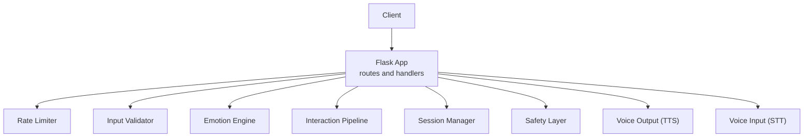
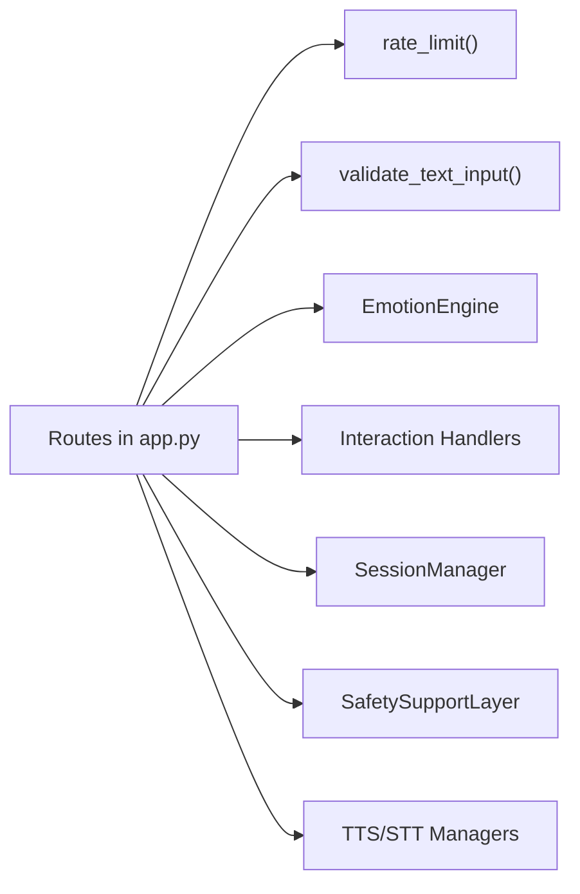

# API Reference

<cite>
**Referenced Files in This Document**
- [app.py](file://psychologist/app.py)
- [rate_limiter.py](file://psychologist/rate_limiter.py)
- [system_constants.py](file://psychologist/system_constants.py)
- [API.md](file://psychologist/docs/API.md)
- [interaction_models.py](file://psychologist/emotion_engine/interaction/interaction_models.py)
- [models.py](file://psychologist/emotion_engine/models.py)
- [interaction_config.yaml](file://psychologist/config/interaction_config.yaml)
- [safety_config.yaml](file://psychologist/config/safety_config.yaml)
- [tts_config.yaml](file://psychologist/config/tts_config.yaml)
- [voice_config.yaml](file://psychologist/config/voice_config.yaml)
- [test_api_endpoints.py](file://psychologist/tests/test_api_endpoints.py)
</cite>

## Table of Contents
1. [Introduction](#introduction)
2. [Project Structure](#project-structure)
3. [Core Components](#core-components)
4. [Architecture Overview](#architecture-overview)
5. [Detailed Component Analysis](#detailed-component-analysis)
6. [Dependency Analysis](#dependency-analysis)
7. [Performance Considerations](#performance-considerations)
8. [Troubleshooting Guide](#troubleshooting-guide)
9. [Conclusion](#conclusion)
10. [Appendices](#appendices)

## Introduction
This document provides comprehensive API documentation for the Psychologist AI Companion RESTful API. It covers all endpoints under the emotion engine, interaction pipeline, session management, support tools, safety monitoring, and voice output subsystems. For each endpoint, you will find HTTP methods, URL patterns, request/response schemas, parameter validation rules, error codes, and operational notes. Authentication, rate limiting, CORS, and versioning policies are documented along with practical usage examples and integration patterns.

## Project Structure
The API is implemented as a Flask application with modular components:
- Central routing and middleware in the Flask app
- Rate limiting and input validation utilities
- Emotion engine and interaction models
- Configuration files controlling behavior and limits
- Tests validating endpoint behavior

**Diagram sources**
- [app.py:159-543](file://psychologist/app.py#L159-L543)
- [rate_limiter.py:74-112](file://psychologist/rate_limiter.py#L74-L112)
- [rate_limiter.py:115-143](file://psychologist/rate_limiter.py#L115-L143)

**Section sources**
- [app.py:1-551](file://psychologist/app.py#L1-L551)
- [system_constants.py:84-102](file://psychologist/system_constants.py#L84-L102)

## Core Components
- Base URL: http://127.0.0.1:5000
- All endpoints accept application/json and return application/json
- Global CORS is enabled via Flask-CORS
- Rate limits:
  - Default: 60 requests per 60 seconds
  - Strict: 30 requests per 60 seconds for write-heavy endpoints
- Health endpoint: GET /api/health

**Section sources**
- [API.md:3-6](file://psychologist/docs/API.md#L3-L6)
- [app.py:22-23](file://psychologist/app.py#L22-L23)
- [system_constants.py:92-102](file://psychologist/system_constants.py#L92-L102)

## Architecture Overview
The API exposes functional domains:
- Emotion Engine: processing, state, personality, memory, reset
- Interaction: message handling, mode switching, voice controls, session lifecycle
- Safety: risk assessment and safety status
- Voice Output: TTS control and status (conditional availability)
- Support Tools: calming, breathing, journaling, reflection, mood check-in, session summary

```mermaid
graph TB
subgraph "Emotion Engine"
EProc["/api/emotion/process"]
EState["/api/emotion/state"]
EPers["/api/emotion/personality"]
EMem["/api/emotion/memory"]
EReset["/api/emotion/reset"]
end
subgraph "Interaction"
IMsg["/api/interaction/message"]
IVStart["/api/interaction/voice/start"]
IVStop["/api/interaction/voice/stop"]
IVStatus["/api/interaction/voice/status"]
IVLevel["/api/interaction/voice/level"]
IModeSet["/api/interaction/mode (POST)"]
IModeGet["/api/interaction/mode (GET)"]
SStart["/api/session/start"]
SEnd["/api/session/end"]
SCurr["/api/session/current"]
SHist["/api/session/history"]
end
subgraph "Safety"
SStat["/api/safety/status"]
end
subgraph "Voice Output"
VTTS["/api/voice-output/tts"]
VStop["/api/voice-output/tts/stop"]
VReplay["/api/voice-output/tts/replay"]
VStatus["/api/voice-output/status"]
end
subgraph "Support Tools"
SCalm["/api/support/calm"]
SBreathe["/api/support/breathing"]
SJournal["/api/support/journal"]
SReflect["/api/support/reflection"]
SMood["/api/support/mood-checkin"]
SSum["/api/support/summary"]
end
EProc --> EmotionEngine
EState --> EmotionEngine
EPers --> EmotionEngine
EMem --> EmotionEngine
EReset --> EmotionEngine
IMsg --> Interaction
IVStart --> Interaction
IVStop --> Interaction
IVStatus --> Interaction
IVLevel --> Interaction
IModeSet --> Interaction
IModeGet --> Interaction
SStart --> Sessions
SEnd --> Sessions
SCurr --> Sessions
SHist --> Sessions
SStat --> Safety
VTTS --> VoiceOutput
VStop --> VoiceOutput
VReplay --> VoiceOutput
VStatus --> VoiceOutput
SCalm --> SupportTools
SBreathe --> SupportTools
SJournal --> SupportTools
SReflect --> SupportTools
SMood --> SupportTools
SSum --> SupportTools
```

**Diagram sources**
- [app.py:159-543](file://psychologist/app.py#L159-L543)

## Detailed Component Analysis

### Emotion Engine Endpoints
- POST /api/emotion/process
  - Purpose: Analyze and respond to textual input using the emotion engine
  - Request: { text: string, additional_emotions?: object }
  - Validation: JSON body required; text must be non-empty and <= 5000 chars
  - Response: { emotional_state, sentiment, context, reasoning, predictions, response, dominant_emotion }
  - Errors: 400 invalid_input, 500 processing_error
  - Rate Limit: 60/min

- GET /api/emotion/state
  - Purpose: Retrieve current emotional state snapshot
  - Response: { primary_emotions, secondary_emotions, advanced_emotions, intensity }
  - Errors: None (returns current state)
  - Rate Limit: 60/min

- GET /api/emotion/personality
  - Purpose: Retrieve current Big Five and derived personality traits
  - Response: { openness, conscientiousness, extraversion, agreeableness, neuroticism, ... }
  - Errors: None (returns current traits)
  - Rate Limit: 60/min

- POST /api/emotion/personality
  - Purpose: Update personality traits (partial updates supported)
  - Request: { openness?: number, extraversion?: number, ... } (values 0.0–1.0)
  - Validation: Invalid fields or types yield 400 invalid_input
  - Response: Updated personality object
  - Errors: 400 invalid_input
  - Rate Limit: 30/min

- GET /api/emotion/memory
  - Purpose: Get emotional memory summary
  - Response: { short_term_count, long_term_count, recent_emotions }
  - Errors: None
  - Rate Limit: 60/min

- POST /api/emotion/reset
  - Purpose: Reset emotion engine to default state
  - Response: { status: "ok" }
  - Errors: None
  - Rate Limit: 60/min

**Section sources**
- [app.py:159-203](file://psychologist/app.py#L159-L203)
- [rate_limiter.py:74-112](file://psychologist/rate_limiter.py#L74-L112)
- [rate_limiter.py:115-143](file://psychologist/rate_limiter.py#L115-L143)
- [models.py:44-110](file://psychologist/emotion_engine/models.py#L44-L110)
- [API.md:24-131](file://psychologist/docs/API.md#L24-L131)

### Interaction and Session Endpoints
- POST /api/interaction/message
  - Purpose: Process user message through the interaction pipeline (primary conversation endpoint)
  - Request: { text: string, language?: "en"|"bn", user_mood?: string|null, speak_response?: boolean }
  - Validation: JSON body required; text must be non-empty and <= 5000 chars
  - Behavior: Ensures active session; delegates to text/voice/hybrid handler based on current mode
  - Response: { user_message, assistant_message, emotion_result, safety_assessment }
  - Errors: 400 invalid_input, 500 processing_error
  - Rate Limit: 60/min

- POST /api/interaction/voice/start
  - Purpose: Start voice listening (voice/hybrid modes only)
  - Response: Listening status
  - Errors: 400 text mode not enabled, 500 voice_error
  - Rate Limit: 30/min

- POST /api/interaction/voice/stop
  - Purpose: Stop voice listening and process transcript
  - Response: Same as POST /api/interaction/message or { status: "no_input" }
  - Errors: 400 text mode not enabled, 500 voice_error
  - Rate Limit: 30/min

- GET /api/interaction/voice/status
  - Purpose: Get current voice I/O status
  - Response: { is_listening, is_speaking, audio_level, current_transcript, push_to_talk, stt_available, tts_available, mode }
  - Errors: None
  - Rate Limit: 60/min

- GET /api/interaction/voice/level
  - Purpose: Get current audio input level (0.0–1.0)
  - Response: { audio_level }
  - Errors: None
  - Rate Limit: 60/min

- POST /api/interaction/mode
  - Purpose: Switch interaction mode
  - Request: { mode: "text"|"voice"|"hybrid" }
  - Response: { success, previous_mode, current_mode, config }
  - Errors: None (switches mode)
  - Rate Limit: 30/min

- GET /api/interaction/mode
  - Purpose: Get current mode and allowed modes
  - Response: { current_mode, config, allowed_modes, mode_history_count }
  - Errors: None
  - Rate Limit: 60/min

- POST /api/session/start
  - Purpose: Start a new session
  - Request: { mode?: "text"|"voice"|"hybrid", language?: "en"|"bn" }
  - Response: Full session state object
  - Errors: None
  - Rate Limit: 30/min

- POST /api/session/end
  - Purpose: End current session and generate summary
  - Response: { session_id, summary, follow_up_suggestions, start_time, end_time, user_messages, assistant_messages }
  - Errors: 400 no active session
  - Rate Limit: 30/min

- GET /api/session/current
  - Purpose: Get current session or status if none
  - Response: Session object or { status: "no_active_session" }
  - Errors: None
  - Rate Limit: 60/min

- GET /api/session/history
  - Purpose: Get recent session summaries
  - Response: Array of session summaries
  - Errors: None
  - Rate Limit: 60/min

**Section sources**
- [app.py:288-476](file://psychologist/app.py#L288-L476)
- [rate_limiter.py:74-112](file://psychologist/rate_limiter.py#L74-L112)
- [interaction_models.py:15-46](file://psychologist/emotion_engine/interaction/interaction_models.py#L15-L46)
- [interaction_models.py:191-262](file://psychologist/emotion_engine/interaction/interaction_models.py#L191-L262)
- [API.md:264-401](file://psychologist/docs/API.md#L264-L401)

### Safety Monitoring Endpoint
- GET /api/safety/status
  - Purpose: Get safety state of the current session
  - Response: { risk_level: "none"|"low"|"moderate"|"high"|"critical", flags }
  - Behavior: If no active session, returns risk_level "none" and empty flags
  - Errors: None
  - Rate Limit: 60/min

**Section sources**
- [app.py:527-543](file://psychologist/app.py#L527-L543)
- [API.md:445-459](file://psychologist/docs/API.md#L445-L459)

### Voice Output Endpoints (Conditional Availability)
- POST /api/voice-output/tts
  - Purpose: Speak text using the locked local voice
  - Request: { text: string, language?: "en"|"bn", emotion?: string, save?: boolean }
  - Validation: JSON body required; text must be non-empty and <= configured max length
  - Response: { success, audio_path, text, language, emotion }
  - Errors: 400 invalid_input, 500 tts_error; 501 if voice output not available
  - Rate Limit: 30/min

- POST /api/voice-output/tts/stop
  - Purpose: Stop current voice playback
  - Response: { status: "stopped" }
  - Errors: None
  - Rate Limit: 30/min

- POST /api/voice-output/tts/replay
  - Purpose: Replay the last spoken audio
  - Response: { status: "replaying" }
  - Errors: None
  - Rate Limit: 30/min

- GET /api/voice-output/status
  - Purpose: Get voice lock status, active engine, and recent activity log
  - Response: Includes voice status plus activity_log tail
  - Errors: None
  - Rate Limit: 60/min

Notes:
- Voice output endpoints are only available when TTS initialization succeeds; otherwise, all return 501
- Activity log size is limited by SESSION_ACTIVITY_LOG_LIMIT

**Section sources**
- [app.py:240-286](file://psychologist/app.py#L240-L286)
- [system_constants.py:80-81](file://psychologist/system_constants.py#L80-L81)
- [tts_config.yaml:1-61](file://psychologist/config/tts_config.yaml#L1-L61)
- [API.md:461-501](file://psychologist/docs/API.md#L461-L501)

### Support Tools Endpoints
- POST /api/support/calm
  - Purpose: Return a calming exercise script
  - Request: { language?: "en"|"bn" }
  - Response: SupportAction object
  - Errors: None
  - Rate Limit: 30/min

- POST /api/support/breathing
  - Purpose: Return a guided breathing exercise
  - Request: { language?: "en"|"bn" }
  - Response: SupportAction object
  - Errors: None
  - Rate Limit: 30/min

- POST /api/support/journal
  - Purpose: Return a journaling prompt (optional emotion customization)
  - Request: { language?: "en"|"bn", emotion?: string }
  - Response: SupportAction object
  - Errors: None
  - Rate Limit: 30/min

- POST /api/support/reflection
  - Purpose: Return self-reflection questions
  - Request: { language?: "en"|"bn" }
  - Response: SupportAction object
  - Errors: None
  - Rate Limit: 30/min

- POST /api/support/mood-checkin
  - Purpose: Return a mood check-in prompt
  - Request: { language?: "en"|"bn" }
  - Response: SupportAction object
  - Errors: None
  - Rate Limit: 30/min

- POST /api/support/summary
  - Purpose: Generate session summary (requires active session)
  - Response: Session summary object
  - Errors: 400 no active session
  - Rate Limit: 30/min

**Section sources**
- [app.py:478-525](file://psychologist/app.py#L478-L525)
- [rate_limiter.py:74-112](file://psychologist/rate_limiter.py#L74-L112)
- [interaction_models.py:267-287](file://psychologist/emotion_engine/interaction/interaction_models.py#L267-L287)
- [API.md:403-444](file://psychologist/docs/API.md#L403-L444)

### Data Models and Serialization Formats
Key data structures used across endpoints:

- EmotionalState
  - Fields: timestamp, primary_emotions, secondary_emotions, advanced_emotions, intensity
  - Methods: get_dominant_emotion(), to_dict()

- PersonalityTraits
  - Fields: openness, conscientiousness, extraversion, agreeableness, neuroticism, plus derived traits
  - Methods: to_dict()

- UserMessage
  - Fields: message_id, session_id, input_type, raw_text, normalized_text, language, timestamp, detected_emotion, confidence, user_selected_mood
  - Methods: to_dict(), from_dict()

- AssistantMessage
  - Fields: message_id, session_id, response_text, response_language, response_type, spoken, audio_path, safety_level, timestamp
  - Methods: to_dict(), from_dict()

- SessionState
  - Fields: session_id, active_mode, start_time, end_time, last_interaction_time, current_emotion_state, mood_timeline, safety_flags, user_messages, assistant_messages, detected_emotions, summary, follow_up_suggestions, user_preference_snapshot, language
  - Methods: to_dict(), from_dict()

- SupportAction
  - Fields: action_type, trigger_reason, script_key, language, completed, timestamp, content
  - Methods: to_dict()

- SafetyAssessment
  - Fields: risk_level, detected_signals, recommended_response_type, should_escalate, safe_response_template
  - Methods: to_dict()

**Section sources**
- [models.py:44-143](file://psychologist/emotion_engine/models.py#L44-L143)
- [interaction_models.py:92-309](file://psychologist/emotion_engine/interaction/interaction_models.py#L92-L309)

### Error Handling and Status Codes
Standardized error responses:
- 400 invalid_input or bad_request
- 404 not_found
- 405 method_not_allowed
- 429 rate_limited
- 500 processing_error or internal_error
- 501 voice output not available (when TTS subsystem is disabled)

Behavior verified by tests:
- Nonexistent endpoints return 404 with JSON error
- Disallowed HTTP methods return 405 with JSON error
- Missing/empty/invalid text yields 400 invalid_input

**Section sources**
- [app.py:27-46](file://psychologist/app.py#L27-L46)
- [test_api_endpoints.py:227-238](file://psychologist/tests/test_api_endpoints.py#L227-L238)
- [API.md:502-520](file://psychologist/docs/API.md#L502-L520)

### Practical Usage Examples and Integration Patterns
- Basic conversation loop:
  - Start a session: POST /api/session/start with desired mode/language
  - Send messages: POST /api/interaction/message with text and optional speak_response
  - Monitor safety: GET /api/safety/status periodically
  - Switch modes: POST /api/interaction/mode to change between text/voice/hybrid
  - End session: POST /api/session/end to generate summary

- Voice interaction:
  - Start recording: POST /api/interaction/voice/start (voice/hybrid only)
  - Stop and process: POST /api/interaction/voice/stop (returns processed result)
  - Check status: GET /api/interaction/voice/status and GET /api/interaction/voice/level

- Support tools:
  - Trigger calming: POST /api/support/calm
  - Breathing exercise: POST /api/support/breathing
  - Journal prompt: POST /api/support/journal with emotion
  - Reflection questions: POST /api/support/reflection
  - Mood check-in: POST /api/support/mood-checkin
  - Session summary: POST /api/support/summary (after active session)

- Voice output:
  - Speak text: POST /api/voice-output/tts with text and optional emotion/save
  - Control playback: POST /api/voice-output/tts/stop, POST /api/voice-output/tts/replay
  - Inspect status: GET /api/voice-output/status

**Section sources**
- [API.md:264-401](file://psychologist/docs/API.md#L264-L401)
- [API.md:403-444](file://psychologist/docs/API.md#L403-L444)
- [API.md:461-501](file://psychologist/docs/API.md#L461-L501)

## Dependency Analysis
- Routing depends on Flask decorators and rate-limiting decorator
- Input validation uses a shared validator function
- Emotion engine and interaction pipeline are invoked by handlers
- Session manager coordinates state and persistence
- Safety layer integrates with session state
- Voice subsystems are conditionally enabled based on initialization

**Diagram sources**
- [app.py:159-543](file://psychologist/app.py#L159-L543)
- [rate_limiter.py:74-143](file://psychologist/rate_limiter.py#L74-L143)

**Section sources**
- [app.py:60-149](file://psychologist/app.py#L60-L149)
- [rate_limiter.py:74-143](file://psychologist/rate_limiter.py#L74-L143)

## Performance Considerations
- Rate limiting prevents overload; tune window/request counts via system constants
- Input length limits reduce processing overhead
- Voice output is optional and disabled if initialization fails; avoid unnecessary TTS calls
- Session history and activity logs are bounded by configuration constants
- Consider batching frequent GET requests and caching non-sensitive state where appropriate

[No sources needed since this section provides general guidance]

## Troubleshooting Guide
Common issues and resolutions:
- 400 invalid_input
  - Cause: Missing/empty JSON body, missing or empty text, text exceeding max length
  - Resolution: Ensure application/json content-type and valid payload

- 404 not_found
  - Cause: Unknown endpoint
  - Resolution: Verify URL correctness

- 405 method_not_allowed
  - Cause: Using wrong HTTP method
  - Resolution: Use the documented method (e.g., POST for mutation endpoints)

- 429 rate_limited
  - Cause: Exceeded rate limit
  - Resolution: Back off and retry; adjust client-side throttling

- 500 processing_error/internal_error
  - Cause: Unhandled exception in processing pipeline
  - Resolution: Check server logs; retry after brief delay

- 501 voice output not available
  - Cause: TTS subsystem did not initialize
  - Resolution: Confirm TTS engines and configuration; retry startup

- Safety status “none”
  - Cause: No active session
  - Resolution: Start a session before checking safety

**Section sources**
- [app.py:27-46](file://psychologist/app.py#L27-L46)
- [test_api_endpoints.py:227-238](file://psychologist/tests/test_api_endpoints.py#L227-L238)
- [API.md:502-520](file://psychologist/docs/API.md#L502-L520)

## Conclusion
The Psychologist AI Companion API offers a cohesive set of endpoints for emotion processing, interaction orchestration, session management, safety monitoring, and optional voice output. With standardized error handling, rate limiting, and clear request/response schemas, clients can integrate reliably. Adhering to validation rules and rate limits ensures robust operation, while optional voice features enable multimodal experiences.

[No sources needed since this section summarizes without analyzing specific files]

## Appendices

### Authentication and Security
- Authentication: None (local-only offline system)
- CORS: Enabled globally via Flask-CORS
- Privacy: Configurable; voice systems marked offline-only by default

**Section sources**
- [app.py:22-23](file://psychologist/app.py#L22-L23)
- [voice_config.yaml:1-28](file://psychologist/config/voice_config.yaml#L1-L28)
- [tts_config.yaml:55-61](file://psychologist/config/tts_config.yaml#L55-L61)

### Rate Limiting Policies
- Default: 60 requests per 60 seconds
- Strict: 30 requests per 60 seconds for write-heavy endpoints
- Enforcement: Per-IP sliding window token bucket

**Section sources**
- [system_constants.py:92-102](file://psychologist/system_constants.py#L92-L102)
- [rate_limiter.py:22-71](file://psychologist/rate_limiter.py#L22-L71)

### API Versioning and Compatibility
- No explicit versioning scheme observed
- Backward compatibility: Not documented; treat as evolving local API

**Section sources**
- [API.md:1-10](file://psychologist/docs/API.md#L1-L10)

### Configuration Highlights
- Interaction defaults: hybrid mode enabled, auto-save sessions, max 60 minutes
- Safety: keyword-based crisis detection, safe response templates, professional help reminders
- Voice: single-voice mode, multiple engine fallbacks, emotion-aware voice styles

**Section sources**
- [interaction_config.yaml:1-60](file://psychologist/config/interaction_config.yaml#L1-L60)
- [safety_config.yaml:1-116](file://psychologist/config/safety_config.yaml#L1-L116)
- [tts_config.yaml:1-61](file://psychologist/config/tts_config.yaml#L1-L61)
- [voice_config.yaml:1-28](file://psychologist/config/voice_config.yaml#L1-L28)