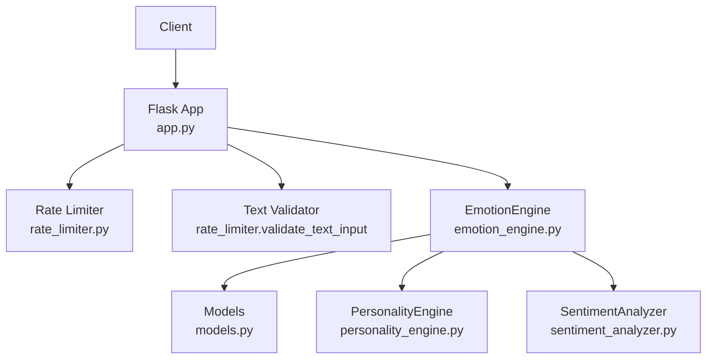
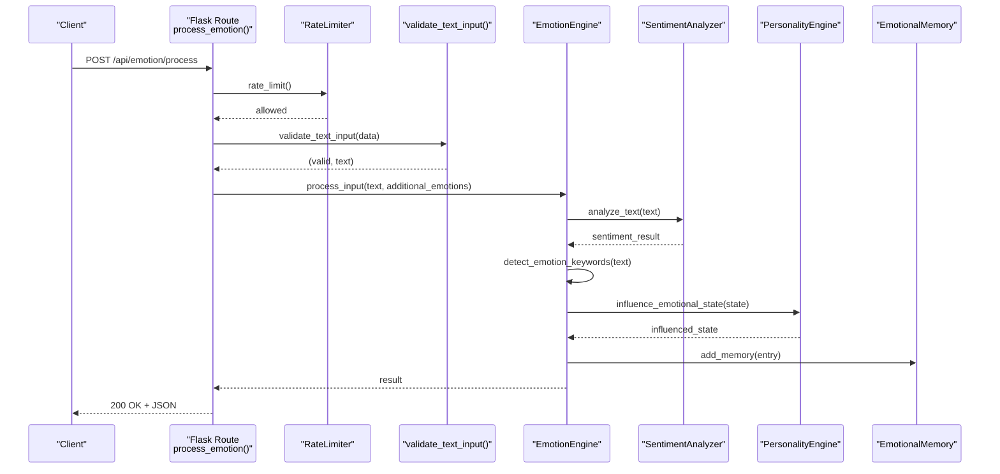
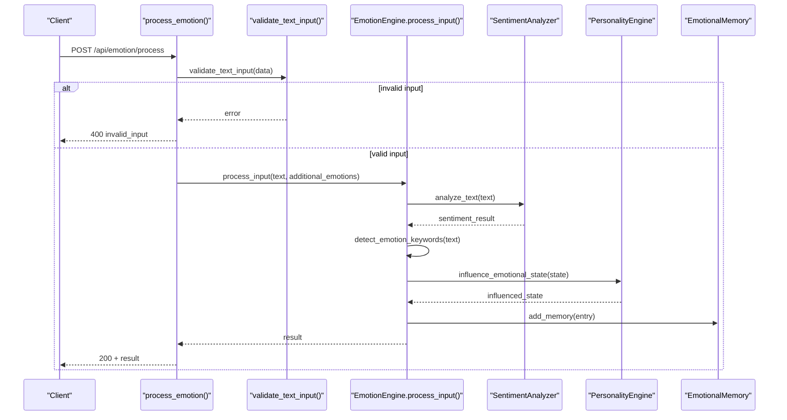
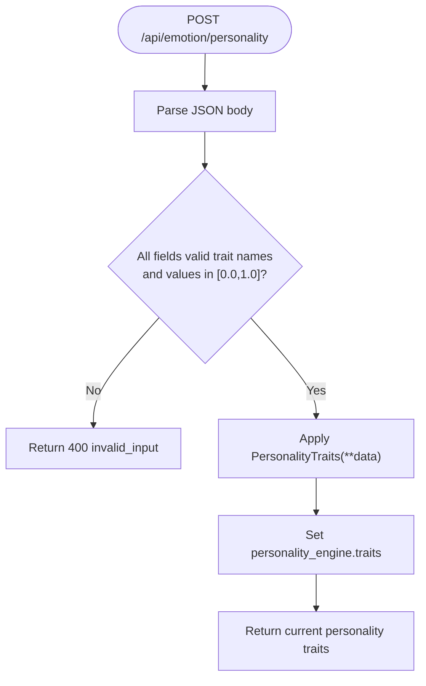
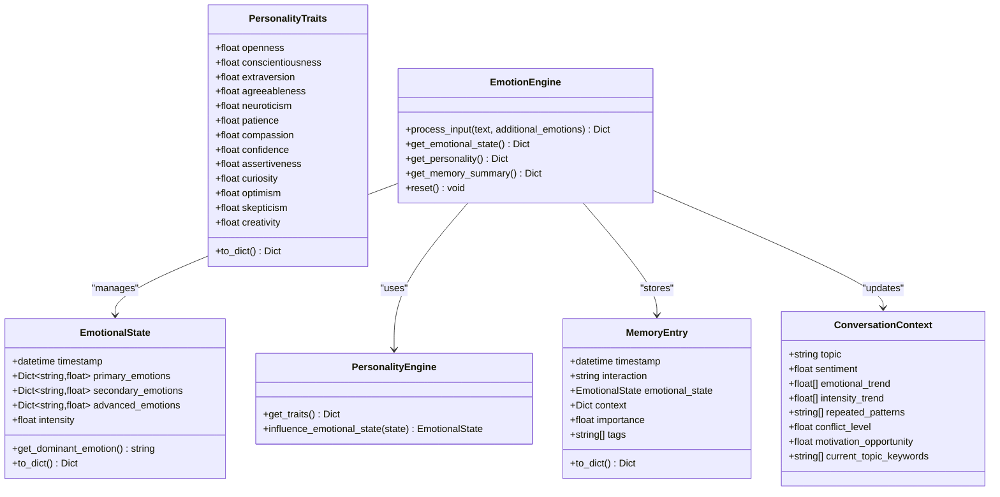
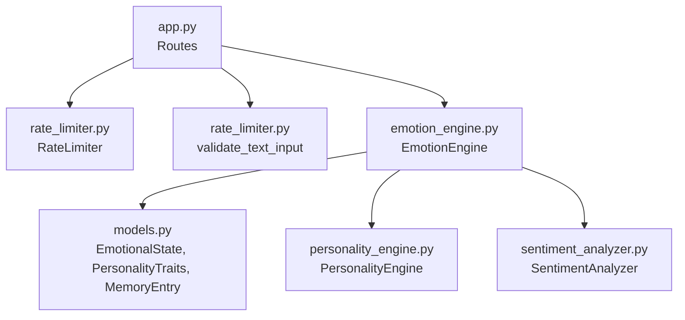

# Emotion Processing API

<cite>
**Referenced Files in This Document**
- [app.py](file://psychologist/app.py)
- [API.md](file://psychologist/docs/API.md)
- [rate_limiter.py](file://psychologist/rate_limiter.py)
- [emotion_engine.py](file://psychologist/emotion_engine/emotion_engine.py)
- [models.py](file://psychologist/emotion_engine/models.py)
- [personality_engine.py](file://psychologist/emotion_engine/personality_engine/personality_engine.py)
- [sentiment_analyzer.py](file://psychologist/emotion_engine/sentiment_analysis/sentiment_analyzer.py)
- [system_constants.py](file://psychologist/system_constants.py)
- [test_api_endpoints.py](file://psychologist/tests/test_api_endpoints.py)
</cite>

## Table of Contents
1. [Introduction](#introduction)
2. [Project Structure](#project-structure)
3. [Core Components](#core-components)
4. [Architecture Overview](#architecture-overview)
5. [Detailed Component Analysis](#detailed-component-analysis)
6. [Dependency Analysis](#dependency-analysis)
7. [Performance Considerations](#performance-considerations)
8. [Troubleshooting Guide](#troubleshooting-guide)
9. [Conclusion](#conclusion)
10. [Appendices](#appendices)

## Introduction
This document provides comprehensive API documentation for the emotion processing endpoints exposed by the emotion engine. It covers the POST /api/emotion/process endpoint for analyzing user input and returning emotional analysis, the GET /api/emotion/state endpoint for retrieving the current emotional state, the GET/POST /api/emotion/personality endpoints for managing personality traits, the GET /api/emotion/memory endpoint for accessing memory summaries, and the POST /api/emotion/reset endpoint for clearing the emotional state. It includes request/response schemas, parameter validation rules, error handling, rate limiting policies, and integration patterns with the emotion engine.

## Project Structure
The emotion processing API is implemented as part of a Flask application. The endpoints are defined in the main application module and delegate to the emotion engine for processing. Validation utilities and rate limiting are provided by dedicated modules. The emotion engine encapsulates the core logic for sentiment analysis, personality influence, memory management, and state transitions.

**Diagram sources**
- [app.py:159-203](file://psychologist/app.py#L159-L203)
- [rate_limiter.py:74-112](file://psychologist/rate_limiter.py#L74-L112)
- [emotion_engine.py:23-92](file://psychologist/emotion_engine/emotion_engine.py#L23-L92)
- [models.py:44-110](file://psychologist/emotion_engine/models.py#L44-L110)
- [personality_engine.py:6-54](file://psychologist/emotion_engine/personality_engine/personality_engine.py#L6-L54)
- [sentiment_analyzer.py:5-73](file://psychologist/emotion_engine/sentiment_analysis/sentiment_analyzer.py#L5-L73)

**Section sources**
- [app.py:159-203](file://psychologist/app.py#L159-L203)
- [rate_limiter.py:74-112](file://psychologist/rate_limiter.py#L74-L112)
- [emotion_engine.py:23-92](file://psychologist/emotion_engine/emotion_engine.py#L23-L92)
- [models.py:44-110](file://psychologist/emotion_engine/models.py#L44-L110)
- [personality_engine.py:6-54](file://psychologist/emotion_engine/personality_engine/personality_engine.py#L6-L54)
- [sentiment_analyzer.py:5-73](file://psychologist/emotion_engine/sentiment_analysis/sentiment_analyzer.py#L5-L73)

## Core Components
- Flask Application: Defines the emotion processing endpoints and error handlers.
- Rate Limiter: Enforces per-IP rate limits for API endpoints.
- Text Validator: Validates incoming JSON payloads for text fields.
- EmotionEngine: Orchestrates sentiment analysis, personality influence, memory updates, reasoning, prediction, and response generation.
- Models: Defines data structures for emotional states, personality traits, memory entries, and conversation context.
- PersonalityEngine: Applies personality traits to influence emotional states.
- SentimentAnalyzer: Performs sentiment scoring and emotion keyword detection.

**Section sources**
- [app.py:159-203](file://psychologist/app.py#L159-L203)
- [rate_limiter.py:74-112](file://psychologist/rate_limiter.py#L74-L112)
- [emotion_engine.py:23-92](file://psychologist/emotion_engine/emotion_engine.py#L23-L92)
- [models.py:44-110](file://psychologist/emotion_engine/models.py#L44-L110)
- [personality_engine.py:6-54](file://psychologist/emotion_engine/personality_engine/personality_engine.py#L6-L54)
- [sentiment_analyzer.py:5-73](file://psychologist/emotion_engine/sentiment_analysis/sentiment_analyzer.py#L5-L73)

## Architecture Overview
The emotion processing API follows a layered architecture:
- Presentation Layer: Flask routes expose the emotion endpoints.
- Validation Layer: Input validation ensures request bodies conform to expected schemas.
- Service Layer: The EmotionEngine coordinates the processing pipeline.
- Persistence/State Layer: PersonalityEngine and EmotionalMemory manage personality traits and memory summaries.
- Utility Layer: Rate limiter controls request throughput.

**Diagram sources**
- [app.py:159-173](file://psychologist/app.py#L159-L173)
- [rate_limiter.py:74-112](file://psychologist/rate_limiter.py#L74-L112)
- [rate_limiter.py:115-142](file://psychologist/rate_limiter.py#L115-L142)
- [emotion_engine.py:37-92](file://psychologist/emotion_engine/emotion_engine.py#L37-L92)
- [sentiment_analyzer.py:31-73](file://psychologist/emotion_engine/sentiment_analysis/sentiment_analyzer.py#L31-L73)
- [personality_engine.py:40-54](file://psychologist/emotion_engine/personality_engine/personality_engine.py#L40-L54)

## Detailed Component Analysis

### Endpoint: POST /api/emotion/process
Purpose: Analyze user input text and return emotional analysis, sentiment, reasoning, predictions, and response.

- Request Schema
  - Content-Type: application/json
  - Body fields:
    - text (string, required): Input text to analyze (max length 5000)
    - additional_emotions (object, optional): Direct emotion overrides (e.g., {"happiness": 0.8})

- Response Schema (200 OK)
  - emotional_state: Current emotional state snapshot
    - primary_emotions: Map of primary emotions to scores
    - secondary_emotions: Map of secondary emotions to scores
    - advanced_emotions: Map of advanced emotions to scores
    - intensity: Scalar intensity of current state
  - sentiment: Sentiment analysis result
    - sentiment: Normalized sentiment (-1 to 1)
    - intensity: Normalized intensity (0 to 1)
  - context: Context summary
    - conversation_history: Recent conversation history
    - emotional_trend: Recent emotional trend data
  - reasoning: Reasoning result
    - mode: Reasoning mode (e.g., supportive)
    - bayesian_updated: Bayesian updates applied
  - predictions: Behavior predictions
  - response: Generated assistant response
  - dominant_emotion: Name of dominant emotion

- Validation Rules
  - text must be present, non-empty, and not exceed 5000 characters
  - additional_emotions must be a valid JSON object if provided

- Error Responses
  - 400 Bad Request: invalid_input when validation fails
  - 500 Internal Server Error: processing_error when processing fails

- Rate Limiting
  - 60 requests per 60 seconds per client IP

- Practical Usage Examples
  - Process text input:
    - POST /api/emotion/process with {"text": "I'm feeling really happy today!"}
  - Inject emotion overrides:
    - POST /api/emotion/process with {"text": "I'm sad", "additional_emotions": {"sadness": 0.9}}

**Diagram sources**
- [app.py:159-173](file://psychologist/app.py#L159-L173)
- [rate_limiter.py:115-142](file://psychologist/rate_limiter.py#L115-L142)
- [emotion_engine.py:37-92](file://psychologist/emotion_engine/emotion_engine.py#L37-L92)
- [sentiment_analyzer.py:31-73](file://psychologist/emotion_engine/sentiment_analysis/sentiment_analyzer.py#L31-L73)
- [personality_engine.py:40-54](file://psychologist/emotion_engine/personality_engine/personality_engine.py#L40-L54)

**Section sources**
- [app.py:159-173](file://psychologist/app.py#L159-L173)
- [rate_limiter.py:115-142](file://psychologist/rate_limiter.py#L115-L142)
- [emotion_engine.py:37-92](file://psychologist/emotion_engine/emotion_engine.py#L37-L92)
- [sentiment_analyzer.py:31-73](file://psychologist/emotion_engine/sentiment_analysis/sentiment_analyzer.py#L31-L73)
- [personality_engine.py:40-54](file://psychologist/emotion_engine/personality_engine/personality_engine.py#L40-L54)
- [system_constants.py:71](file://psychologist/system_constants.py#L71)

### Endpoint: GET /api/emotion/state
Purpose: Retrieve the current emotional state snapshot.

- Response Schema (200 OK)
  - primary_emotions: Map of primary emotions to scores
  - secondary_emotions: Map of secondary emotions to scores
  - advanced_emotions: Map of advanced emotions to scores
  - intensity: Scalar intensity of current state

- Practical Usage Examples
  - GET /api/emotion/state to inspect current state

**Section sources**
- [app.py:175-177](file://psychologist/app.py#L175-L177)
- [emotion_engine.py:164-165](file://psychologist/emotion_engine/emotion_engine.py#L164-L165)

### Endpoint: GET /api/emotion/personality
Purpose: Retrieve the current Big Five personality traits plus additional traits.

- Response Schema (200 OK)
  - openness: Trait score (0.0–1.0)
  - conscientiousness: Trait score (0.0–1.0)
  - extraversion: Trait score (0.0–1.0)
  - agreeableness: Trait score (0.0–1.0)
  - neuroticism: Trait score (0.0–1.0)
  - patience: Trait score (0.0–1.0)
  - compassion: Trait score (0.0–1.0)
  - confidence: Trait score (0.0–1.0)
  - assertiveness: Trait score (0.0–1.0)
  - curiosity: Trait score (0.0–1.0)
  - optimism: Trait score (0.0–1.0)
  - skepticism: Trait score (0.0–1.0)
  - creativity: Trait score (0.0–1.0)

- Practical Usage Examples
  - GET /api/emotion/personality to inspect current traits

**Section sources**
- [app.py:179-181](file://psychologist/app.py#L179-L181)
- [personality_engine.py:20-21](file://psychologist/emotion_engine/personality_engine/personality_engine.py#L20-L21)
- [models.py:79-110](file://psychologist/emotion_engine/models.py#L79-L110)

### Endpoint: POST /api/emotion/personality
Purpose: Update personality traits.

- Request Schema
  - Content-Type: application/json
  - Body fields:
    - Any subset of personality trait keys with numeric values between 0.0 and 1.0

- Response Schema (200 OK)
  - Updated personality traits object

- Validation Rules
  - Only recognized trait names are accepted
  - Values must be numeric and within [0.0, 1.0]

- Error Responses
  - 400 Bad Request: invalid_input when validation fails

- Rate Limiting
  - 30 requests per 60 seconds per client IP

- Practical Usage Examples
  - POST /api/emotion/personality with {"openness": 0.8, "extraversion": 0.6}

**Diagram sources**
- [app.py:183-194](file://psychologist/app.py#L183-L194)
- [models.py:79-110](file://psychologist/emotion_engine/models.py#L79-L110)

**Section sources**
- [app.py:183-194](file://psychologist/app.py#L183-L194)
- [models.py:79-110](file://psychologist/emotion_engine/models.py#L79-L110)

### Endpoint: GET /api/emotion/memory
Purpose: Retrieve emotional memory summary.

- Response Schema (200 OK)
  - short_term_count: Number of short-term memories
  - long_term_count: Number of long-term memories
  - recent_emotions: List of recent emotional patterns

- Practical Usage Examples
  - GET /api/emotion/memory to inspect memory statistics

**Section sources**
- [app.py:196-198](file://psychologist/app.py#L196-L198)
- [emotion_engine.py:170-175](file://psychologist/emotion_engine/emotion_engine.py#L170-L175)

### Endpoint: POST /api/emotion/reset
Purpose: Reset the emotion engine to default state.

- Response Schema (200 OK)
  - status: "ok"

- Practical Usage Examples
  - POST /api/emotion/reset to clear state and memory

**Section sources**
- [app.py:200-203](file://psychologist/app.py#L200-L203)
- [emotion_engine.py:177-183](file://psychologist/emotion_engine/emotion_engine.py#L177-L183)

### Data Models
The emotion engine uses several data models to represent state and traits.

**Diagram sources**
- [models.py:44-143](file://psychologist/emotion_engine/models.py#L44-L143)
- [emotion_engine.py:23-92](file://psychologist/emotion_engine/emotion_engine.py#L23-L92)
- [personality_engine.py:6-54](file://psychologist/emotion_engine/personality_engine/personality_engine.py#L6-L54)

**Section sources**
- [models.py:44-143](file://psychologist/emotion_engine/models.py#L44-L143)
- [emotion_engine.py:23-92](file://psychologist/emotion_engine/emotion_engine.py#L23-L92)
- [personality_engine.py:6-54](file://psychologist/emotion_engine/personality_engine/personality_engine.py#L6-L54)

## Dependency Analysis
The emotion processing endpoints depend on the rate limiter and validator utilities, and delegate to the emotion engine for processing. The emotion engine depends on sentiment analysis, personality influence, and memory management.

**Diagram sources**
- [app.py:159-203](file://psychologist/app.py#L159-L203)
- [rate_limiter.py:74-112](file://psychologist/rate_limiter.py#L74-L112)
- [rate_limiter.py:115-142](file://psychologist/rate_limiter.py#L115-L142)
- [emotion_engine.py:23-92](file://psychologist/emotion_engine/emotion_engine.py#L23-L92)
- [models.py:44-110](file://psychologist/emotion_engine/models.py#L44-L110)
- [personality_engine.py:6-54](file://psychologist/emotion_engine/personality_engine/personality_engine.py#L6-L54)
- [sentiment_analyzer.py:5-73](file://psychologist/emotion_engine/sentiment_analysis/sentiment_analyzer.py#L5-L73)

**Section sources**
- [app.py:159-203](file://psychologist/app.py#L159-L203)
- [rate_limiter.py:74-112](file://psychologist/rate_limiter.py#L74-L112)
- [rate_limiter.py:115-142](file://psychologist/rate_limiter.py#L115-L142)
- [emotion_engine.py:23-92](file://psychologist/emotion_engine/emotion_engine.py#L23-L92)
- [models.py:44-110](file://psychologist/emotion_engine/models.py#L44-L110)
- [personality_engine.py:6-54](file://psychologist/emotion_engine/personality_engine/personality_engine.py#L6-L54)
- [sentiment_analyzer.py:5-73](file://psychologist/emotion_engine/sentiment_analysis/sentiment_analyzer.py#L5-L73)

## Performance Considerations
- Rate Limiting: Enforced per-IP with sliding-window token buckets. Process endpoint uses stricter limits (30 RPM) for write-heavy operations, while personality updates use moderate limits (60 RPM).
- Input Length Limits: Text inputs are validated to prevent excessive payload sizes.
- State Decay: Emotion values decay over time to prevent accumulation and maintain responsiveness.
- Memory Limits: History and memory counts are bounded to control resource usage.

[No sources needed since this section provides general guidance]

## Troubleshooting Guide
Common issues and resolutions:
- 400 Bad Request: Ensure the request body is valid JSON and contains a non-empty text field not exceeding the maximum length.
- 400 Bad Request (personality): Verify that only recognized trait names are used and values are numeric within [0.0, 1.0].
- 429 Too Many Requests: Reduce request frequency or implement client-side backoff.
- 500 Internal Server Error: Indicates processing failures; retry after a delay and check server logs.

**Section sources**
- [app.py:27-46](file://psychologist/app.py#L27-L46)
- [rate_limiter.py:74-112](file://psychologist/rate_limiter.py#L74-L112)
- [rate_limiter.py:115-142](file://psychologist/rate_limiter.py#L115-L142)
- [test_api_endpoints.py:34-54](file://psychologist/tests/test_api_endpoints.py#L34-L54)
- [test_api_endpoints.py:77-82](file://psychologist/tests/test_api_endpoints.py#L77-L82)

## Conclusion
The emotion processing API provides a robust interface for analyzing user input, managing personality traits, and maintaining emotional state and memory. The endpoints are protected by rate limiting, validated by input sanitization, and integrated with a comprehensive emotion engine that considers sentiment, personality, context, reasoning, and memory. The documented schemas and examples enable straightforward integration and reliable operation.

[No sources needed since this section summarizes without analyzing specific files]

## Appendices

### Rate Limiting Policies
- Process endpoint (/api/emotion/process): 60 requests per 60 seconds
- Personality endpoints (/api/emotion/personality): 30 requests per 60 seconds
- Other emotion endpoints: 60 requests per 60 seconds

**Section sources**
- [app.py:159-184](file://psychologist/app.py#L159-L184)
- [system_constants.py:92-102](file://psychologist/system_constants.py#L92-L102)

### Input Validation Rules
- text: Required, non-empty string, max length 5000 characters
- additional_emotions: Optional object with numeric emotion scores
- personality traits: Optional subset of recognized trait names with values in [0.0, 1.0]

**Section sources**
- [rate_limiter.py:115-142](file://psychologist/rate_limiter.py#L115-L142)
- [models.py:79-110](file://psychologist/emotion_engine/models.py#L79-L110)

### Integration Patterns
- Use GET /api/emotion/state to monitor current emotional state before/after processing.
- Use GET /api/emotion/memory to assess memory impact of interactions.
- Use POST /api/emotion/reset to clear state during testing or session resets.
- Combine POST /api/emotion/process with personality updates to tailor responses to individual profiles.

**Section sources**
- [app.py:175-203](file://psychologist/app.py#L175-L203)
- [emotion_engine.py:164-183](file://psychologist/emotion_engine/emotion_engine.py#L164-L183)