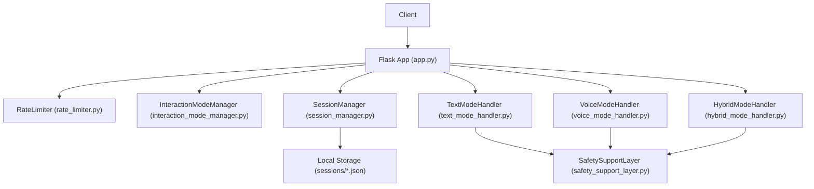
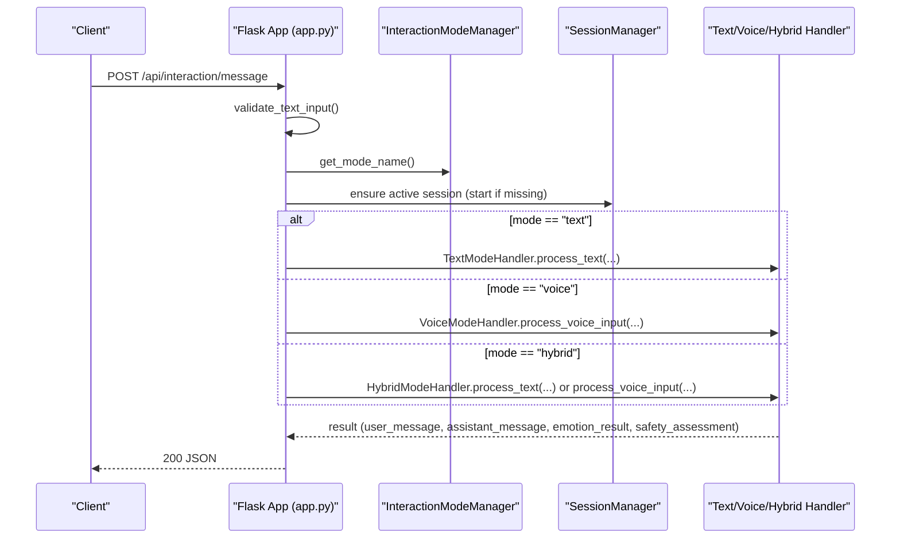
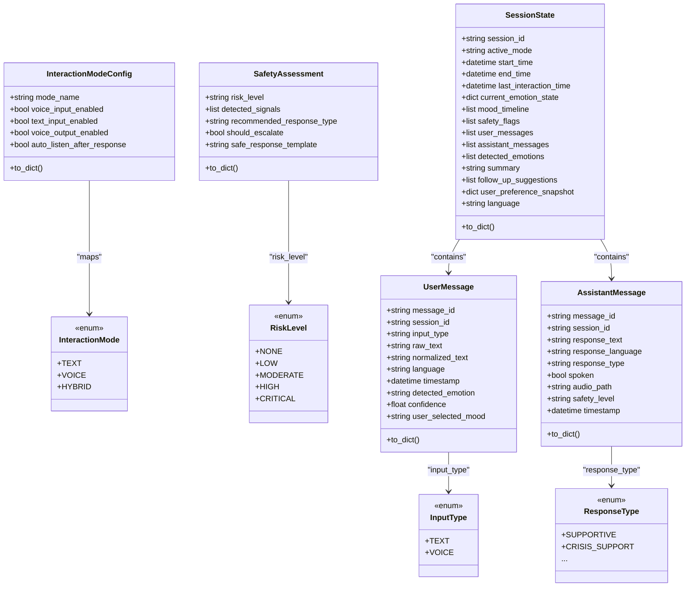
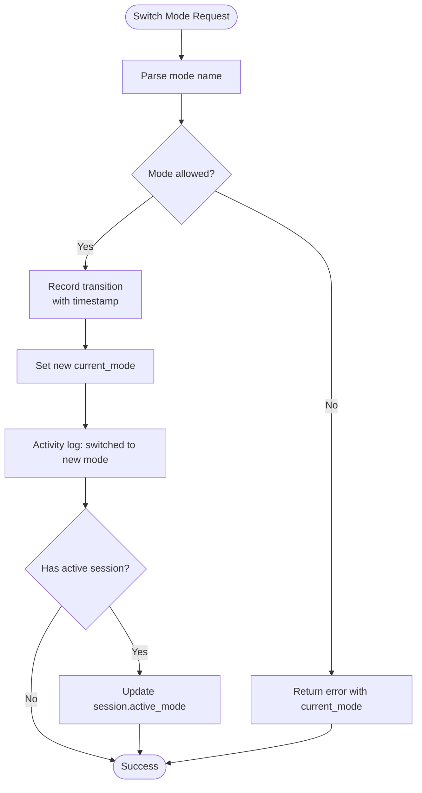
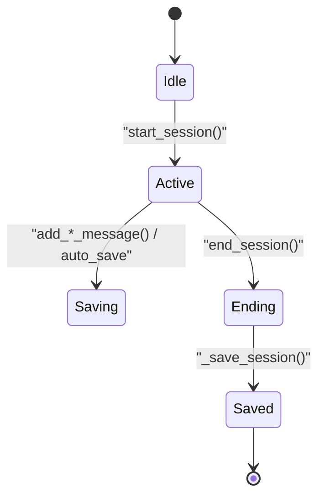
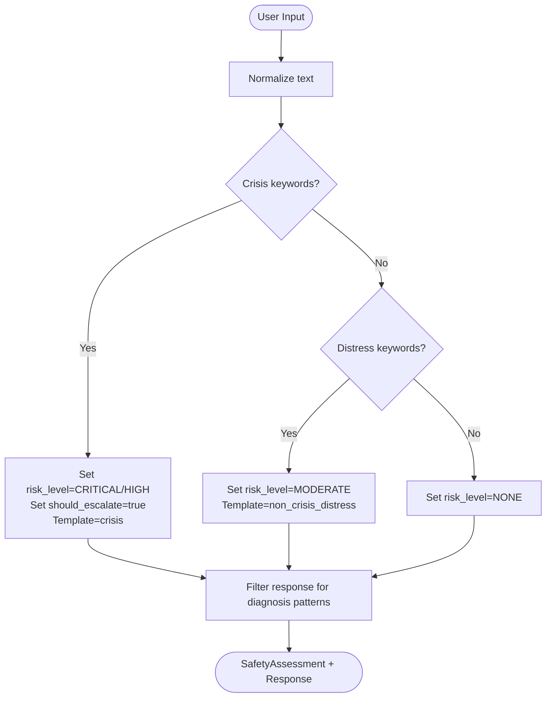
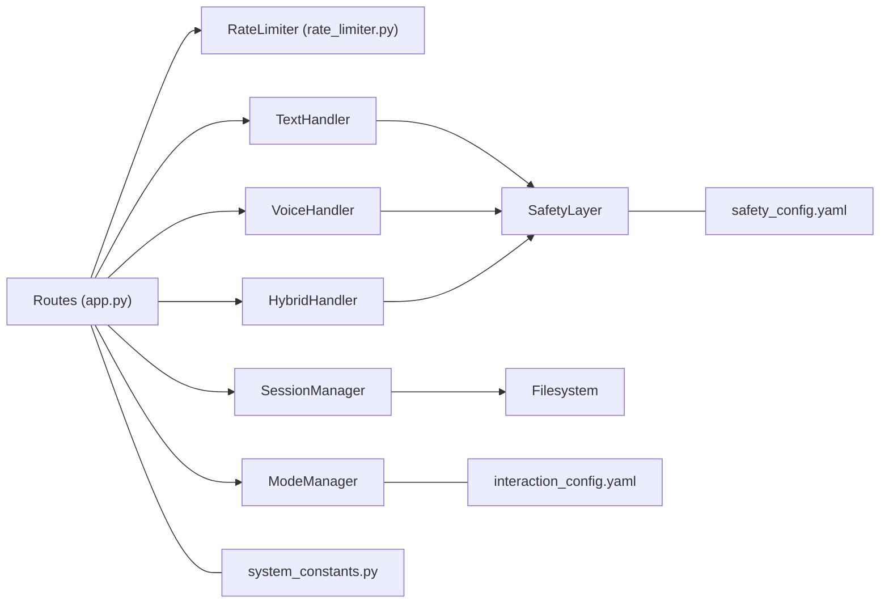

# Interaction Management API

<cite>
**Referenced Files in This Document**
- [app.py](file://psychologist/app.py)
- [API.md](file://psychologist/docs/API.md)
- [rate_limiter.py](file://psychologist/rate_limiter.py)
- [system_constants.py](file://psychologist/system_constants.py)
- [interaction_mode_manager.py](file://psychologist/emotion_engine/interaction/interaction_mode_manager.py)
- [session_manager.py](file://psychologist/emotion_engine/interaction/session_manager.py)
- [text_mode_handler.py](file://psychologist/emotion_engine/interaction/text_mode_handler.py)
- [voice_mode_handler.py](file://psychologist/emotion_engine/interaction/voice_mode_handler.py)
- [hybrid_mode_handler.py](file://psychologist/emotion_engine/interaction/hybrid_mode_handler.py)
- [interaction_models.py](file://psychologist/emotion_engine/interaction/interaction_models.py)
- [safety_support_layer.py](file://psychologist/emotion_engine/interaction/safety_support_layer.py)
- [interaction_config.yaml](file://psychologist/config/interaction_config.yaml)
- [safety_config.yaml](file://psychologist/config/safety_config.yaml)
- [test_api_endpoints.py](file://psychologist/tests/test_api_endpoints.py)
</cite>

## Table of Contents
1. [Introduction](#introduction)
2. [Project Structure](#project-structure)
3. [Core Components](#core-components)
4. [Architecture Overview](#architecture-overview)
5. [Detailed Component Analysis](#detailed-component-analysis)
6. [Dependency Analysis](#dependency-analysis)
7. [Performance Considerations](#performance-considerations)
8. [Troubleshooting Guide](#troubleshooting-guide)
9. [Conclusion](#conclusion)
10. [Appendices](#appendices)

## Introduction
This document provides comprehensive API documentation for the interaction management endpoints that power dual-mode interaction handling. It covers:
- Unified text and voice input processing via POST /api/interaction/message
- Voice input control endpoints: /api/interaction/voice/start, /api/interaction/voice/stop, /api/interaction/voice/status, /api/interaction/voice/level
- Interaction mode switching via /api/interaction/mode (GET/POST)
- Session management via /api/session/start, /api/session/end, /api/session/current, /api/session/history
- Request/response schemas, parameter validation, rate limiting policies, error handling strategies
- Interaction mode switching logic, session lifecycle management, and integration patterns between modes

## Project Structure
The interaction management API is implemented in the main Flask application with modular handlers and managers:
- Flask routes define endpoints and apply rate limits
- InteractionModeManager controls mode switching and configuration
- SessionManager manages session lifecycle and persistence
- TextModeHandler, VoiceModeHandler, and HybridModeHandler orchestrate the processing pipelines
- SafetySupportLayer performs safety checks and response filtering
- RateLimiter enforces per-IP request quotas
- System constants and YAML configurations define limits and behavior

**Diagram sources**
- [app.py:288-448](file://psychologist/app.py#L288-L448)
- [interaction_mode_manager.py:17-166](file://psychologist/emotion_engine/interaction/interaction_mode_manager.py#L17-L166)
- [session_manager.py:26-303](file://psychologist/emotion_engine/interaction/session_manager.py#L26-L303)
- [text_mode_handler.py:23-170](file://psychologist/emotion_engine/interaction/text_mode_handler.py#L23-L170)
- [voice_mode_handler.py:28-305](file://psychologist/emotion_engine/interaction/voice_mode_handler.py#L28-L305)
- [hybrid_mode_handler.py:18-120](file://psychologist/emotion_engine/interaction/hybrid_mode_handler.py#L18-L120)
- [safety_support_layer.py:24-286](file://psychologist/emotion_engine/interaction/safety_support_layer.py#L24-L286)

**Section sources**
- [app.py:288-448](file://psychologist/app.py#L288-L448)
- [rate_limiter.py:74-112](file://psychologist/rate_limiter.py#L74-L112)
- [system_constants.py:63-103](file://psychologist/system_constants.py#L63-L103)

## Core Components
- InteractionModeManager: Manages current mode (text, voice, hybrid), validates transitions, and exposes mode configuration
- SessionManager: Creates, updates, persists, and queries sessions; generates summaries and follow-ups
- TextModeHandler: Full pipeline for text input (normalization, safety, emotion analysis, response generation, optional TTS, session recording)
- VoiceModeHandler: Full pipeline for voice input (STT, optional voice emotion features, fusion, safety, response, TTS, session recording)
- HybridModeHandler: Delegates to text or voice handler while preserving a single session context
- SafetySupportLayer: Keyword-based crisis detection, diagnosis blocking, and safe response templates
- RateLimiter: Per-IP sliding-window token bucket enforcement
- System constants and YAML configs: Define limits, defaults, and behavior toggles

**Section sources**
- [interaction_mode_manager.py:17-166](file://psychologist/emotion_engine/interaction/interaction_mode_manager.py#L17-L166)
- [session_manager.py:26-303](file://psychologist/emotion_engine/interaction/session_manager.py#L26-L303)
- [text_mode_handler.py:23-170](file://psychologist/emotion_engine/interaction/text_mode_handler.py#L23-L170)
- [voice_mode_handler.py:28-305](file://psychologist/emotion_engine/interaction/voice_mode_handler.py#L28-L305)
- [hybrid_mode_handler.py:18-120](file://psychologist/emotion_engine/interaction/hybrid_mode_handler.py#L18-L120)
- [safety_support_layer.py:24-286](file://psychologist/emotion_engine/interaction/safety_support_layer.py#L24-L286)
- [rate_limiter.py:22-112](file://psychologist/rate_limiter.py#L22-L112)
- [system_constants.py:63-103](file://psychologist/system_constants.py#L63-L103)
- [interaction_config.yaml:1-60](file://psychologist/config/interaction_config.yaml#L1-L60)

## Architecture Overview
The interaction endpoints integrate with mode managers and handlers to provide a unified interface for dual-mode conversations. The flow below shows the POST /api/interaction/message endpoint, which routes to the appropriate handler based on the current mode.

**Diagram sources**
- [app.py:290-335](file://psychologist/app.py#L290-L335)
- [interaction_mode_manager.py:65-101](file://psychologist/emotion_engine/interaction/interaction_mode_manager.py#L65-L101)
- [session_manager.py:59-92](file://psychologist/emotion_engine/interaction/session_manager.py#L59-L92)
- [text_mode_handler.py:52-158](file://psychologist/emotion_engine/interaction/text_mode_handler.py#L52-L158)
- [voice_mode_handler.py:145-277](file://psychologist/emotion_engine/interaction/voice_mode_handler.py#L145-L277)
- [hybrid_mode_handler.py:48-94](file://psychologist/emotion_engine/interaction/hybrid_mode_handler.py#L48-L94)

## Detailed Component Analysis

### Endpoint: POST /api/interaction/message
Purpose: Unified endpoint to process user messages across modes. Automatically ensures an active session and delegates to the appropriate handler.

- Request JSON
  - text: string (required), max length 5000
  - language: string (optional, default en), supported values en/bn
  - user_mood: string|null (optional), allows overriding detected emotion
  - speak_response: boolean (optional, default false), speak response via TTS if available
- Response JSON
  - user_message: UserMessage object
  - assistant_message: AssistantMessage object
  - emotion_result: { dominant_emotion, confidence, emotional_state }
  - safety_assessment: { risk_level, detected_signals, should_escalate, safe_response_template }
- Validation
  - Validates JSON body and text field length
- Rate Limit
  - 60 requests per 60 seconds
- Error Handling
  - 400 invalid_input on validation failure
  - 500 processing_error on internal failures
- Behavior
  - Ensures active session exists; starts one if missing
  - Routes to TextModeHandler, VoiceModeHandler, or HybridModeHandler based on current mode

**Section sources**
- [app.py:290-335](file://psychologist/app.py#L290-L335)
- [rate_limiter.py:74-112](file://psychologist/rate_limiter.py#L74-L112)
- [rate_limiter.py:115-142](file://psychologist/rate_limiter.py#L115-L142)
- [system_constants.py:71-72](file://psychologist/system_constants.py#L71-L72)
- [session_manager.py:59-74](file://psychologist/emotion_engine/interaction/session_manager.py#L59-L74)
- [text_mode_handler.py:52-158](file://psychologist/emotion_engine/interaction/text_mode_handler.py#L52-L158)
- [voice_mode_handler.py:145-277](file://psychologist/emotion_engine/interaction/voice_mode_handler.py#L145-L277)
- [hybrid_mode_handler.py:48-94](file://psychologist/emotion_engine/interaction/hybrid_mode_handler.py#L48-L94)

### Endpoint: POST /api/interaction/voice/start
Purpose: Start voice input listening (voice/hybrid modes only).

- Request: none (JSON body optional)
- Response JSON
  - status: "listening" or error status
- Validation
  - Returns 400 if current mode is "text"
- Rate Limit
  - 30 requests per 60 seconds
- Error Handling
  - 400 mode error
  - 500 voice_error on internal failures

**Section sources**
- [app.py:337-356](file://psychologist/app.py#L337-L356)
- [rate_limiter.py:74-112](file://psychologist/rate_limiter.py#L74-L112)
- [voice_mode_handler.py:76-94](file://psychologist/emotion_engine/interaction/voice_mode_handler.py#L76-L94)
- [hybrid_mode_handler.py:71-74](file://psychologist/emotion_engine/interaction/hybrid_mode_handler.py#L71-L74)

### Endpoint: POST /api/interaction/voice/stop
Purpose: Stop voice input and process the captured transcript.

- Request JSON
  - language: string (optional, default en)
- Response JSON
  - If no speech detected: {"status": "no_input", "message": "..."}
  - Else: same as POST /api/interaction/message
- Validation
  - Determines mode and session before processing
- Rate Limit
  - 30 requests per 60 seconds
- Error Handling
  - 400 mode error if in text mode
  - 500 voice_error on internal failures

**Section sources**
- [app.py:358-402](file://psychologist/app.py#L358-L402)
- [rate_limiter.py:74-112](file://psychologist/rate_limiter.py#L74-L112)
- [voice_mode_handler.py:96-110](file://psychologist/emotion_engine/interaction/voice_mode_handler.py#L96-L110)
- [voice_mode_handler.py:145-277](file://psychologist/emotion_engine/interaction/voice_mode_handler.py#L145-L277)
- [hybrid_mode_handler.py:76-78](file://psychologist/emotion_engine/interaction/hybrid_mode_handler.py#L76-L78)

### Endpoint: GET /api/interaction/voice/status
Purpose: Get current voice I/O status.

- Response JSON
  - is_listening: boolean
  - is_speaking: boolean
  - audio_level: number (0.0–1.0)
  - current_transcript: string
  - push_to_talk: boolean
  - continuous_mode: boolean
  - stt_available: boolean
  - tts_available: boolean
  - mode: string ("text", "voice", or "hybrid")
- Behavior
  - Returns voice handler status if in voice/hybrid
  - Returns text mode status with push_to_talk and STT/TTS availability if in text mode

**Section sources**
- [app.py:404-424](file://psychologist/app.py#L404-L424)
- [voice_mode_handler.py:281-291](file://psychologist/emotion_engine/interaction/voice_mode_handler.py#L281-L291)
- [hybrid_mode_handler.py:116-119](file://psychologist/emotion_engine/interaction/hybrid_mode_handler.py#L116-L119)

### Endpoint: GET /api/interaction/voice/level
Purpose: Get current audio input level.

- Response JSON
  - audio_level: number (0.0–1.0)
- Behavior
  - Returns 0.0 if not in voice/hybrid mode

**Section sources**
- [app.py:426-433](file://psychologist/app.py#L426-L433)
- [voice_mode_handler.py:118-122](file://psychologist/emotion_engine/interaction/voice_mode_handler.py#L118-L122)

### Endpoint: POST /api/interaction/mode
Purpose: Switch interaction mode.

- Request JSON
  - mode: string (optional, default hybrid), allowed values text/voice/hybrid
- Response JSON
  - success: boolean
  - previous_mode: string
  - current_mode: string
  - config: InteractionModeConfig object
- Behavior
  - Updates mode manager; if a session exists, also updates session active_mode

**Section sources**
- [app.py:435-447](file://psychologist/app.py#L435-L447)
- [interaction_mode_manager.py:70-101](file://psychologist/emotion_engine/interaction/interaction_mode_manager.py#L70-L101)
- [session_manager.py:138-141](file://psychologist/emotion_engine/interaction/session_manager.py#L138-L141)

### Endpoint: GET /api/interaction/mode
Purpose: Get current mode and allowed modes.

- Response JSON
  - current_mode: string
  - config: InteractionModeConfig object
  - allowed_modes: array of strings
  - mode_history_count: number

**Section sources**
- [app.py:445-447](file://psychologist/app.py#L445-L447)
- [interaction_mode_manager.py:138-144](file://psychologist/emotion_engine/interaction/interaction_mode_manager.py#L138-L144)

### Endpoint: POST /api/session/start
Purpose: Start a new session.

- Request JSON
  - mode: string (optional, default current mode), allowed values text/voice/hybrid
  - language: string (optional, default en), supported values en/bn
- Response JSON
  - SessionState object
- Behavior
  - Starts a new session; saves any existing session first

**Section sources**
- [app.py:449-457](file://psychologist/app.py#L449-L457)
- [session_manager.py:59-74](file://psychologist/emotion_engine/interaction/session_manager.py#L59-L74)

### Endpoint: POST /api/session/end
Purpose: End the current session.

- Request: none
- Response JSON
  - Summary object with session_id, summary, follow_up_suggestions, timestamps, and message arrays
- Behavior
  - Generates summary and follow-ups, saves to disk, clears current session

**Section sources**
- [app.py:459-465](file://psychologist/app.py#L459-L465)
- [session_manager.py:76-92](file://psychologist/emotion_engine/interaction/session_manager.py#L76-L92)

### Endpoint: GET /api/session/current
Purpose: Get current session or status if none.

- Response JSON
  - If active session: SessionState object
  - Else: {"status": "no_active_session"}

**Section sources**
- [app.py:467-471](file://psychologist/app.py#L467-L471)
- [session_manager.py:94-95](file://psychologist/emotion_engine/interaction/session_manager.py#L94-L95)

### Endpoint: GET /api/session/history
Purpose: Get recent session history.

- Response JSON
  - Array of session summary objects with session_id, timestamps, summary, message_count, active_mode, language

**Section sources**
- [app.py:473-476](file://psychologist/app.py#L473-L476)
- [session_manager.py:150-172](file://psychologist/emotion_engine/interaction/session_manager.py#L150-L172)

### Data Models
Key data structures used across endpoints and handlers:

**Diagram sources**
- [interaction_models.py:17-309](file://psychologist/emotion_engine/interaction/interaction_models.py#L17-L309)

**Section sources**
- [interaction_models.py:17-309](file://psychologist/emotion_engine/interaction/interaction_models.py#L17-L309)

### Interaction Mode Switching Logic
The mode manager enforces allowed modes and tracks history. When switching:
- Validates requested mode against allowed set
- Records transition with timestamp
- Updates activity log
- Optionally updates session active_mode if a session exists

**Diagram sources**
- [interaction_mode_manager.py:70-101](file://psychologist/emotion_engine/interaction/interaction_mode_manager.py#L70-L101)
- [session_manager.py:138-141](file://psychologist/emotion_engine/interaction/session_manager.py#L138-L141)

**Section sources**
- [interaction_mode_manager.py:70-101](file://psychologist/emotion_engine/interaction/interaction_mode_manager.py#L70-L101)
- [session_manager.py:138-141](file://psychologist/emotion_engine/interaction/session_manager.py#L138-L141)

### Session Lifecycle Management
SessionManager orchestrates creation, updates, persistence, and cleanup:
- start_session: creates new session, saves previous if exists
- add_user_message/add_assistant_message: append to session and optionally auto-save
- update_emotion_state/update_mode/update_preferences: snapshot state
- end_session: computes summary and follow-ups, saves to disk, cleans up old sessions
- get_session_history/get_recurring_emotions/get_preferred_mode: analytics helpers
- _save_session/_cleanup_old_sessions: persistence layer

**Diagram sources**
- [session_manager.py:59-92](file://psychologist/emotion_engine/interaction/session_manager.py#L59-L92)
- [session_manager.py:279-302](file://psychologist/emotion_engine/interaction/session_manager.py#L279-L302)

**Section sources**
- [session_manager.py:59-92](file://psychologist/emotion_engine/interaction/session_manager.py#L59-L92)
- [session_manager.py:212-275](file://psychologist/emotion_engine/interaction/session_manager.py#L212-L275)
- [session_manager.py:279-302](file://psychologist/emotion_engine/interaction/session_manager.py#L279-L302)

### Safety and Response Filtering
SafetySupportLayer performs:
- Crisis detection using keyword lists (English/Bangla)
- Distress detection for moderate-risk inputs
- Diagnosis/block pattern filtering to prevent medical claims
- Safe response templates for high/moderate risk
- Professional help reminders and disclaimers

**Diagram sources**
- [safety_support_layer.py:80-135](file://psychologist/emotion_engine/interaction/safety_support_layer.py#L80-L135)
- [safety_support_layer.py:139-155](file://psychologist/emotion_engine/interaction/safety_support_layer.py#L139-L155)
- [safety_config.yaml:5-116](file://psychologist/config/safety_config.yaml#L5-L116)

**Section sources**
- [safety_support_layer.py:80-135](file://psychologist/emotion_engine/interaction/safety_support_layer.py#L80-L135)
- [safety_support_layer.py:139-155](file://psychologist/emotion_engine/interaction/safety_support_layer.py#L139-L155)
- [safety_config.yaml:5-116](file://psychologist/config/safety_config.yaml#L5-L116)

### Practical Examples

- Switch to voice mode and record a voice interaction
  - POST /api/interaction/mode {"mode":"voice"}
  - POST /api/interaction/voice/start
  - POST /api/interaction/voice/stop
  - Observe assistant_message.spoken and audio_path if TTS available

- Start a session in hybrid mode, alternate text and voice
  - POST /api/session/start {"mode":"hybrid","language":"en"}
  - POST /api/interaction/message {"text":"Hello","language":"en","speak_response":true}
  - POST /api/interaction/voice/start
  - POST /api/interaction/voice/stop
  - GET /api/session/current

- Manage session state and history
  - GET /api/session/current
  - POST /api/session/end
  - GET /api/session/history

**Section sources**
- [app.py:435-476](file://psychologist/app.py#L435-L476)
- [test_api_endpoints.py:186-216](file://psychologist/tests/test_api_endpoints.py#L186-L216)

## Dependency Analysis
The interaction endpoints depend on:
- Flask routing and rate limiting
- Mode manager for configuration and transitions
- Session manager for persistence and state
- Handlers for processing logic
- Safety layer for risk assessment and filtering
- Constants and YAML configs for limits and behavior

**Diagram sources**
- [app.py:288-448](file://psychologist/app.py#L288-L448)
- [rate_limiter.py:74-112](file://psychologist/rate_limiter.py#L74-L112)
- [interaction_mode_manager.py:17-166](file://psychologist/emotion_engine/interaction/interaction_mode_manager.py#L17-L166)
- [session_manager.py:26-303](file://psychologist/emotion_engine/interaction/session_manager.py#L26-L303)
- [text_mode_handler.py:23-170](file://psychologist/emotion_engine/interaction/text_mode_handler.py#L23-L170)
- [voice_mode_handler.py:28-305](file://psychologist/emotion_engine/interaction/voice_mode_handler.py#L28-L305)
- [hybrid_mode_handler.py:18-120](file://psychologist/emotion_engine/interaction/hybrid_mode_handler.py#L18-L120)
- [safety_support_layer.py:24-286](file://psychologist/emotion_engine/interaction/safety_support_layer.py#L24-L286)
- [interaction_config.yaml:1-60](file://psychologist/config/interaction_config.yaml#L1-L60)
- [safety_config.yaml:1-116](file://psychologist/config/safety_config.yaml#L1-L116)
- [system_constants.py:63-103](file://psychologist/system_constants.py#L63-L103)

**Section sources**
- [app.py:288-448](file://psychologist/app.py#L288-L448)
- [interaction_config.yaml:1-60](file://psychologist/config/interaction_config.yaml#L1-L60)
- [safety_config.yaml:1-116](file://psychologist/config/safety_config.yaml#L1-L116)
- [system_constants.py:63-103](file://psychologist/system_constants.py#L63-L103)

## Performance Considerations
- Response length limits: text mode responses are up to 500 characters; voice mode responses are up to 200 characters
- Rate limiting: 60 requests/minute for reads, 30 requests/minute for writes
- Session persistence: sessions are saved on message events when auto-save is enabled
- Audio processing: voice input relies on STT; ensure STT engines are initialized to avoid runtime errors

[No sources needed since this section provides general guidance]

## Troubleshooting Guide
Common issues and resolutions:
- 400 invalid_input
  - Occurs when JSON body is missing or text field is empty/overlength
  - Validate request body and text length (max 5000)
- 400 bad_request/method_not_allowed
  - Occurs on malformed requests or wrong HTTP method
- 404 not_found
  - Endpoint does not exist
- 405 method_not_allowed
  - HTTP method not supported for the endpoint
- 429 rate_limited
  - Exceeded per-IP rate quota; wait for the next window
- 500 processing_error/internal_error
  - Unexpected failure in processing or internal server error
- 501 voice_output_not_available
  - Voice output subsystem not initialized

**Section sources**
- [app.py:27-46](file://psychologist/app.py#L27-L46)
- [rate_limiter.py:97-107](file://psychologist/rate_limiter.py#L97-L107)
- [test_api_endpoints.py:227-239](file://psychologist/tests/test_api_endpoints.py#L227-L239)

## Conclusion
The interaction management API provides a robust, offline-first framework for dual-mode conversations. It integrates safety checks, session persistence, and flexible mode switching to support text, voice, and hybrid interaction styles. The documented endpoints, schemas, and behaviors enable developers to build reliable client integrations and maintain consistent user experiences across modalities.

[No sources needed since this section summarizes without analyzing specific files]

## Appendices

### Request/Response Schemas

- POST /api/interaction/message
  - Request: { text:string, language:"en"|"bn", user_mood:string|null, speak_response:boolean }
  - Response: { user_message:UserMessage, assistant_message:AssistantMessage, emotion_result:{dominant_emotion, confidence, emotional_state}, safety_assessment:SafetyAssessment }

- POST /api/interaction/voice/start
  - Request: none
  - Response: { status:"listening"|"already_listening"|"error","message"? }

- POST /api/interaction/voice/stop
  - Request: { language:"en"|"bn" }
  - Response: { status:"no_input","message" } or same as POST /api/interaction/message

- GET /api/interaction/voice/status
  - Response: { is_listening:boolean, is_speaking:boolean, audio_level:number, current_transcript:string, push_to_talk:boolean, continuous_mode:boolean, stt_available:boolean, tts_available:boolean, mode:"text"|"voice"|"hybrid" }

- GET /api/interaction/voice/level
  - Response: { audio_level:number }

- POST /api/interaction/mode
  - Request: { mode:"text"|"voice"|"hybrid" }
  - Response: { success:boolean, previous_mode:string, current_mode:string, config:InteractionModeConfig }

- GET /api/interaction/mode
  - Response: { current_mode:string, config:InteractionModeConfig, allowed_modes:string[], mode_history_count:number }

- POST /api/session/start
  - Request: { mode:"text"|"voice"|"hybrid", language:"en"|"bn" }
  - Response: SessionState

- POST /api/session/end
  - Request: none
  - Response: { session_id:string, summary:string, follow_up_suggestions:string[], start_time:string, end_time:string, user_messages:any[], assistant_messages:any[] }

- GET /api/session/current
  - Response: SessionState or { status:"no_active_session" }

- GET /api/session/history
  - Response: Array of { session_id:string, start_time:string, end_time:string, summary:string, message_count:number, active_mode:"text"|"voice"|"hybrid", language:"en"|"bn" }

**Section sources**
- [API.md:266-401](file://psychologist/docs/API.md#L266-L401)
- [app.py:290-476](file://psychologist/app.py#L290-L476)
- [interaction_models.py:92-262](file://psychologist/emotion_engine/interaction/interaction_models.py#L92-L262)

### Rate Limiting Policies
- Default: 60 requests per 60 seconds
- Strict endpoints (voice, session, mode): 30 requests per 60 seconds
- Enforced via per-IP sliding-window token bucket

**Section sources**
- [rate_limiter.py:74-112](file://psychologist/rate_limiter.py#L74-L112)
- [system_constants.py:92-102](file://psychologist/system_constants.py#L92-L102)

### Parameter Validation
- validate_text_input: checks JSON body presence, string type, non-empty, max length (default 5000)
- Additional validations in routes: language values, mode names, session existence

**Section sources**
- [rate_limiter.py:115-142](file://psychologist/rate_limiter.py#L115-L142)
- [app.py:294-296](file://psychologist/app.py#L294-L296)
- [system_constants.py:71-72](file://psychologist/system_constants.py#L71-L72)