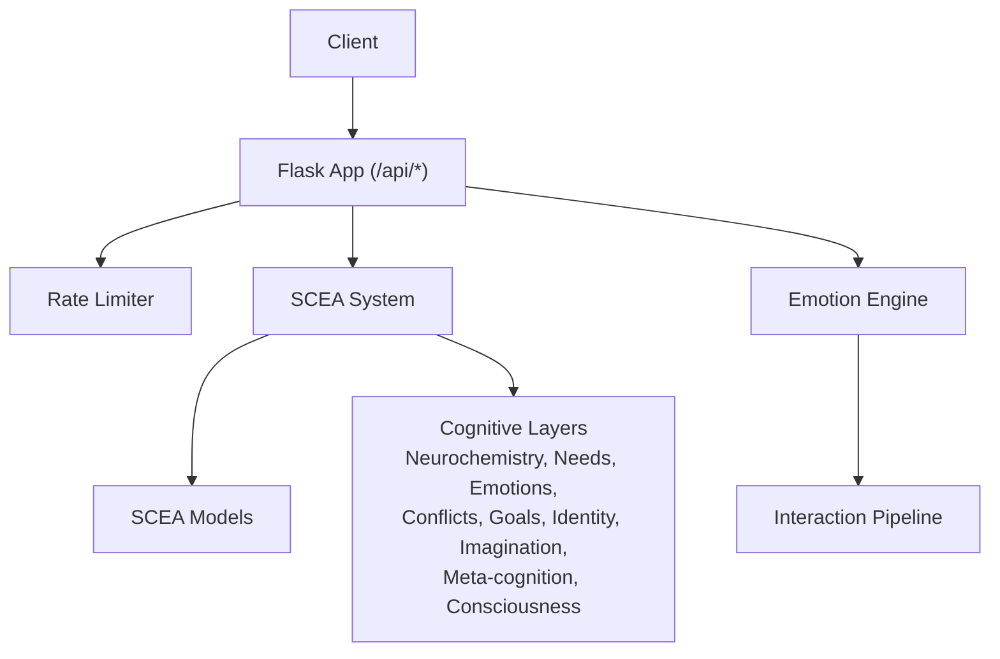
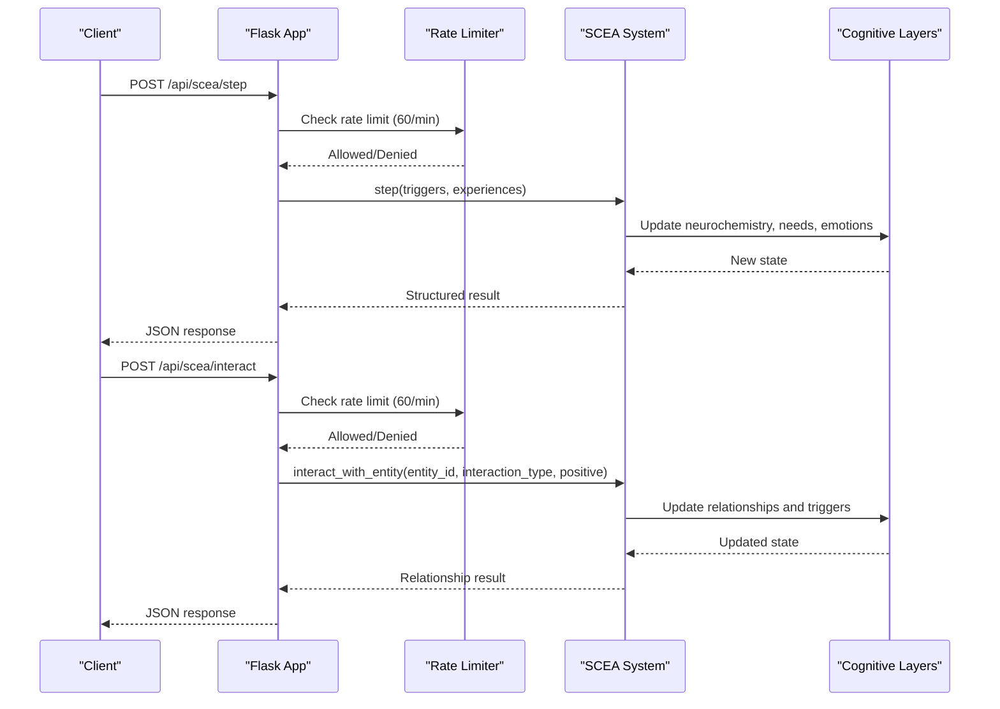
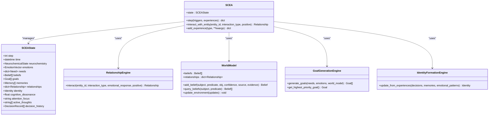
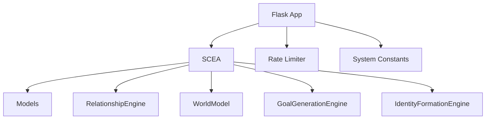

# SCEA (Self-Cognitive Architecture) API

<cite>
**Referenced Files in This Document**
- [app.py](file://psychologist/app.py)
- [rate_limiter.py](file://psychologist/rate_limiter.py)
- [scea.py](file://psychologist/scea/core/scea.py)
- [models.py](file://psychologist/scea/core/models.py)
- [system_constants.py](file://psychologist/system_constants.py)
- [test_api_endpoints.py](file://psychologist/tests/test_api_endpoints.py)
- [example_scea.py](file://psychologist/example_scea.py)
- [relationship_system.py](file://psychologist/scea/relationship_engine/relationship_system.py)
- [world_model_system.py](file://psychologist/scea/world_model/world_model_system.py)
- [goal_system.py](file://psychologist/scea/goal_generation/goal_system.py)
- [identity_system.py](file://psychologist/scea/identity_formation/identity_system.py)
</cite>

## Table of Contents
1. [Introduction](#introduction)
2. [Project Structure](#project-structure)
3. [Core Components](#core-components)
4. [Architecture Overview](#architecture-overview)
5. [Detailed Component Analysis](#detailed-component-analysis)
6. [Dependency Analysis](#dependency-analysis)
7. [Performance Considerations](#performance-considerations)
8. [Troubleshooting Guide](#troubleshooting-guide)
9. [Conclusion](#conclusion)
10. [Appendices](#appendices)

## Introduction
This document provides comprehensive API documentation for the Self-Cognitive Evolution Architecture (SCEA) endpoints. It focuses on two primary endpoints:
- POST /api/scea/step: advances the SCEA system state using optional triggers and experiences parameters
- POST /api/scea/interact: performs entity interactions with entity_id, interaction_type, and positive parameters

The documentation covers request/response schemas, parameter validation rules, rate limiting policies (60 requests per minute), error handling strategies, and practical examples. It also explains how SCEA operations integrate with the broader emotion processing system and self-cognitive architecture layers.

## Project Structure
The SCEA API is implemented within a Flask application that orchestrates emotion processing and self-cognitive evolution. Key components include:
- Flask application with route decorators for rate limiting and error handling
- SCEA core system managing state and cognitive layers
- Emotion engine and interaction pipeline for broader emotion processing integration
- Tests validating endpoint behavior and examples demonstrating usage

**Diagram sources**
- [app.py:205-236](file://psychologist/app.py#L205-L236)
- [scea.py:30-48](file://psychologist/scea/core/scea.py#L30-L48)
- [models.py:147-162](file://psychologist/scea/core/models.py#L147-L162)

**Section sources**
- [app.py:205-236](file://psychologist/app.py#L205-L236)
- [system_constants.py:92-102](file://psychologist/system_constants.py#L92-L102)

## Core Components
- Flask application with centralized error handlers and CORS support
- SCEA system encapsulating state and cognitive engines
- Rate limiter enforcing per-IP request limits
- System constants defining SCEA limits and defaults

Key responsibilities:
- Expose /api/scea/step and /api/scea/interact endpoints
- Validate JSON payload and enforce rate limits
- Transform internal SCEA state into structured responses
- Integrate with emotion processing and interaction systems

**Section sources**
- [app.py:25-47](file://psychologist/app.py#L25-L47)
- [rate_limiter.py:74-112](file://psychologist/rate_limiter.py#L74-L112)
- [system_constants.py:48-61](file://psychologist/system_constants.py#L48-L61)

## Architecture Overview
The SCEA API sits alongside the emotion processing system. The Flask routes validate inputs, apply rate limits, and delegate to the SCEA system. Responses are returned as JSON with standardized error handling.

**Diagram sources**
- [app.py:205-236](file://psychologist/app.py#L205-L236)
- [rate_limiter.py:74-112](file://psychologist/rate_limiter.py#L74-L112)
- [scea.py:61-184](file://psychologist/scea/core/scea.py#L61-L184)

## Detailed Component Analysis

### Endpoint: POST /api/scea/step
Purpose:
- Advance the SCEA system state by processing optional triggers and experiences.

Request Schema:
- Content-Type: application/json
- Body fields:
  - triggers: object (optional)
    - Arbitrary key-value pairs representing neurochemical triggers
  - experiences: array of objects (optional)
    - Each experience object must include:
      - type: string (identifier for the experience type)
      - Additional fields as needed by the experience handler

Validation rules:
- Request body must be valid JSON; otherwise returns 400 with invalid_input
- triggers and experiences are optional; defaults to empty/null when omitted
- No explicit field validation beyond presence/type checks

Response Schema:
- Fields:
  - step: integer (incremented step counter)
  - neurochemistry: object
    - dopamine: number
    - serotonin: number
    - oxytocin: number
    - cortisol: number
    - adrenaline: number
  - emotions: object
    - dominant: string or null
    - valence: number (-1 to 1)
    - intensity: number (0 to 1)
    - all: object (emotion name to intensity mapping)
  - needs: object (need name to satisfaction score)
  - cognitive_dissonance: number
  - consciousness: object (attention focus and active thoughts)
  - decision: object
    - description: string
    - context: object
    - priority: number
  - identity: object
    - self_confidence: number
    - consistency: number
    - self_image: object (trait to score mapping)

Rate limiting:
- 60 requests per 60 seconds per client IP

Error handling:
- 400: invalid_input when JSON is missing or malformed
- 500: processing_error when internal processing fails
- 429: rate_limited when exceeding rate limit

Example usage:
- Advance the system with a novelty experience and social connection triggers
- Advance the system with an achievement experience and no triggers

Practical examples:
- See [test_scea_step_empty:97-103](file://psychologist/tests/test_api_endpoints.py#L97-L103) for minimal invocation
- See [example_scea.py:39-75](file://psychologist/example_scea.py#L39-L75) for a simulation loop combining interactions and experiences

Integration with emotion processing:
- Emotions are updated via the emotional physics engine using experiences and neurochemical effects
- Needs influence goal generation and identity formation
- Consciousness layer synthesizes attention focus and active thoughts

**Section sources**
- [app.py:205-219](file://psychologist/app.py#L205-L219)
- [rate_limiter.py:74-112](file://psychologist/rate_limiter.py#L74-L112)
- [scea.py:61-184](file://psychologist/scea/core/scea.py#L61-L184)
- [models.py:147-162](file://psychologist/scea/core/models.py#L147-L162)
- [test_api_endpoints.py:97-103](file://psychologist/tests/test_api_endpoints.py#L97-L103)
- [example_scea.py:39-75](file://psychologist/example_scea.py#L39-L75)

### Endpoint: POST /api/scea/interact
Purpose:
- Interact with a virtual entity and update relationships and neurochemical triggers accordingly.

Request Schema:
- Content-Type: application/json
- Body fields:
  - entity_id: string (required)
  - interaction_type: string (required)
  - positive: boolean (optional, default true)

Validation rules:
- Request body must be valid JSON; otherwise returns 400 with invalid_input
- entity_id and interaction_type must be non-empty strings when provided
- positive is optional and defaults to true

Response Schema:
- Returns the updated relationship object for the entity:
  - entity_id: string
  - trust: number (0 to 1)
  - familiarity: number (0 to 1)
  - attachment: number (0 to 1)
  - respect: number (0 to 1)
  - reliability: number (0 to 1)
  - interaction_history: array (up to 100 most recent interactions)
  - emotional_associations: object (emotion to association score)

Rate limiting:
- 60 requests per 60 seconds per client IP

Error handling:
- 400: invalid_input when JSON is missing or malformed
- 500: processing_error when internal processing fails

Example usage:
- Positive conversation interaction with user_1
- Negative interaction with another entity

Practical examples:
- See [test_scea_interact:109-119](file://psychologist/tests/test_api_endpoints.py#L109-L119) for a successful interaction
- See [example_scea.py:43-47](file://psychologist/example_scea.py#L43-L47) for periodic interactions during simulation

Integration with emotion processing:
- Relationship updates influence future emotional responses and triggers
- Positive interactions increase trust and reward-related triggers
- Negative interactions introduce threat/stress triggers

**Section sources**
- [app.py:221-236](file://psychologist/app.py#L221-L236)
- [rate_limiter.py:74-112](file://psychologist/rate_limiter.py#L74-L112)
- [scea.py:225-245](file://psychologist/scea/core/scea.py#L225-L245)
- [relationship_system.py:10-45](file://psychologist/scea/relationship_engine/relationship_system.py#L10-L45)

### SCEA State and Cognitive Layers
The SCEA system maintains a comprehensive state and interacts with multiple cognitive engines:
- State fields include step, time, neurochemistry, emotions, needs, beliefs, goals, memories, relationships, identity, cognitive dissonance, attention focus, active thoughts, and decision history
- Engines include neurochemistry, needs, emotional physics, world model, relationship engine, conflict detection/resolution, goal generation, identity formation, imagination, meta-cognition, emotional evolution, and consciousness layer

**Diagram sources**
- [scea.py:30-48](file://psychologist/scea/core/scea.py#L30-L48)
- [models.py:147-162](file://psychologist/scea/core/models.py#L147-L162)
- [relationship_system.py:6-16](file://psychologist/scea/relationship_engine/relationship_system.py#L6-L16)
- [world_model_system.py:5-10](file://psychologist/scea/world_model/world_model_system.py#L5-L10)
- [goal_system.py:6-11](file://psychologist/scea/goal_generation/goal_system.py#L6-L11)
- [identity_system.py:6-10](file://psychologist/scea/identity_formation/identity_system.py#L6-L10)

**Section sources**
- [scea.py:30-48](file://psychologist/scea/core/scea.py#L30-L48)
- [models.py:147-162](file://psychologist/scea/core/models.py#L147-L162)
- [relationship_system.py:6-45](file://psychologist/scea/relationship_engine/relationship_system.py#L6-L45)
- [world_model_system.py:5-81](file://psychologist/scea/world_model/world_model_system.py#L5-L81)
- [goal_system.py:6-144](file://psychologist/scea/goal_generation/goal_system.py#L6-L144)
- [identity_system.py:6-106](file://psychologist/scea/identity_formation/identity_system.py#L6-L106)

## Dependency Analysis
The SCEA API depends on:
- Flask routing and rate limiting
- SCEA core system and models
- System constants for limits and weights
- Relationship engine for entity interactions
- World model for beliefs and environment state
- Goal generation and identity formation engines

**Diagram sources**
- [app.py:205-236](file://psychologist/app.py#L205-L236)
- [scea.py:30-48](file://psychologist/scea/core/scea.py#L30-L48)
- [models.py:1-6](file://psychologist/scea/core/models.py#L1-L6)
- [system_constants.py:48-61](file://psychologist/system_constants.py#L48-L61)

**Section sources**
- [app.py:205-236](file://psychologist/app.py#L205-L236)
- [scea.py:30-48](file://psychologist/scea/core/scea.py#L30-L48)
- [system_constants.py:48-61](file://psychologist/system_constants.py#L48-L61)

## Performance Considerations
- Rate limiting: Both endpoints are configured with 60 requests per minute per client IP to prevent abuse and ensure stability
- Payload size: While not enforced by the endpoints, consider keeping experience arrays and trigger objects concise to minimize processing overhead
- State limits: SCEA enforces memory and decision history limits to control memory growth and maintain performance
- Recommendations:
  - Batch related interactions when possible
  - Avoid excessive polling of the step endpoint
  - Monitor response sizes and avoid unnecessary large payloads

[No sources needed since this section provides general guidance]

## Troubleshooting Guide
Common issues and resolutions:
- 400 Bad Request (invalid_input): Ensure the request body is valid JSON and includes required fields where applicable
- 404 Not Found: Verify the endpoint path is correct
- 405 Method Not Allowed: Confirm the HTTP method matches the endpoint specification
- 429 Too Many Requests: Implement client-side backoff and reduce request frequency
- 500 Internal Server Error: Inspect server logs for stack traces; retry after verifying input correctness

Error handling behavior:
- Centralized error handlers return JSON with error and message fields
- Rate limiter returns a 429 response with rate_limited and a friendly message
- Validation helpers ensure text inputs meet length and emptiness criteria

**Section sources**
- [app.py:27-46](file://psychologist/app.py#L27-L46)
- [rate_limiter.py:97-108](file://psychologist/rate_limiter.py#L97-L108)

## Conclusion
The SCEA API provides controlled, rate-limited access to advanced self-cognitive evolution capabilities. By leveraging triggers and experiences, applications can drive the system toward adaptive behavior and evolving identity. Entity interactions enable dynamic relationship modeling with neurochemical feedback loops. Together with the emotion processing system, these endpoints form a cohesive framework for synthetic emotional intelligence and self-awareness.

[No sources needed since this section summarizes without analyzing specific files]

## Appendices

### Request/Response Examples

- POST /api/scea/step
  - Request body:
    - triggers: object (optional)
    - experiences: array of objects (optional)
  - Typical response fields: step, neurochemistry, emotions, needs, cognitive_dissonance, consciousness, decision, identity

- POST /api/scea/interact
  - Request body:
    - entity_id: string
    - interaction_type: string
    - positive: boolean (optional)
  - Response: Relationship object with trust, familiarity, attachment, respect, reliability, interaction_history, and emotional_associations

Validation references:
- [test_scea_step_empty:97-103](file://psychologist/tests/test_api_endpoints.py#L97-L103)
- [test_scea_interact:109-119](file://psychologist/tests/test_api_endpoints.py#L109-L119)
- [example_scea.py:43-47](file://psychologist/example_scea.py#L43-L47)

**Section sources**
- [test_api_endpoints.py:97-119](file://psychologist/tests/test_api_endpoints.py#L97-L119)
- [example_scea.py:43-47](file://psychologist/example_scea.py#L43-L47)