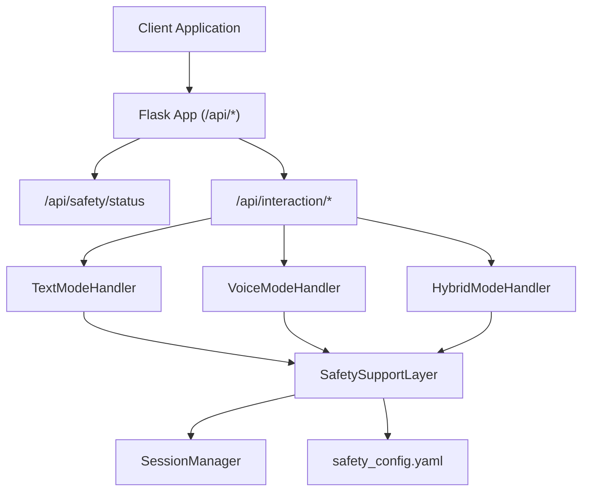
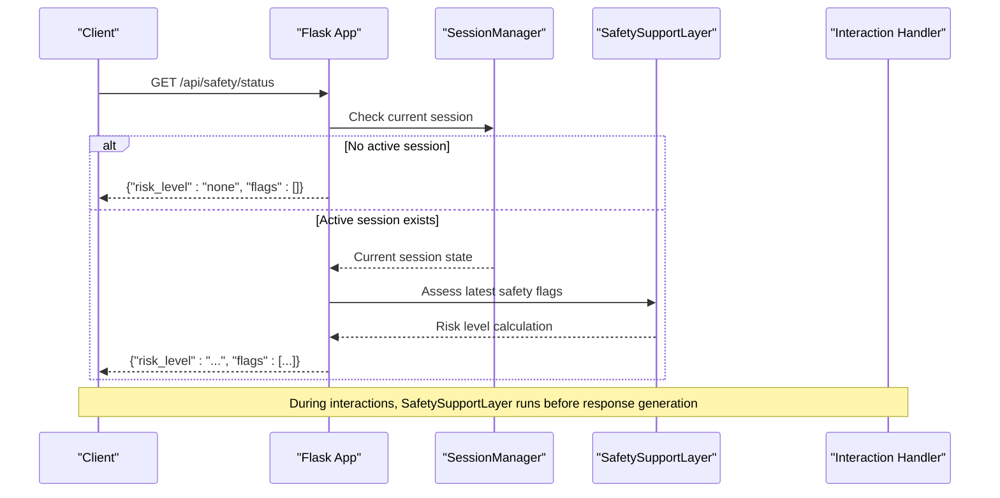
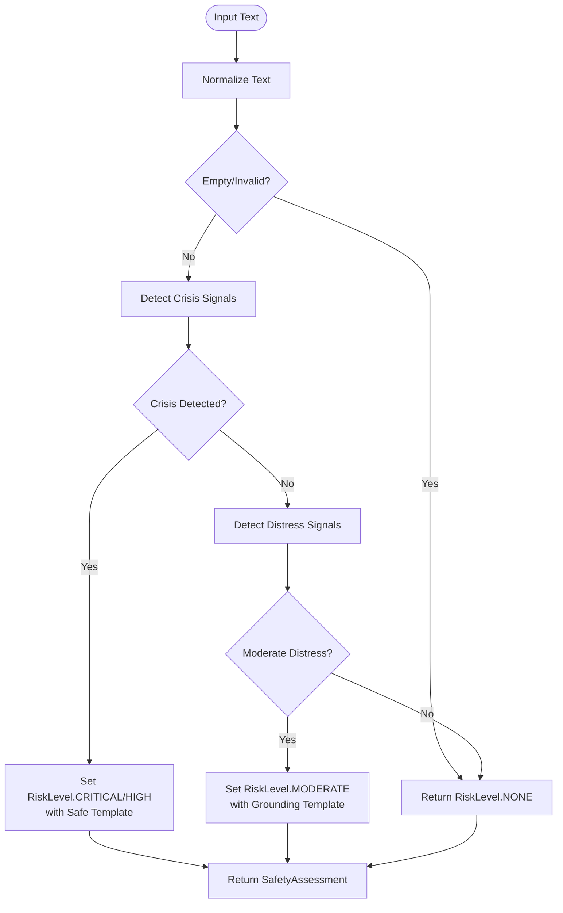
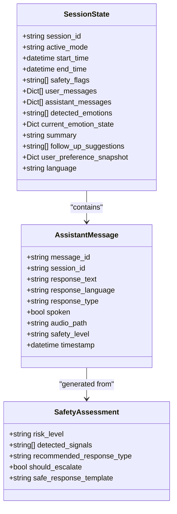
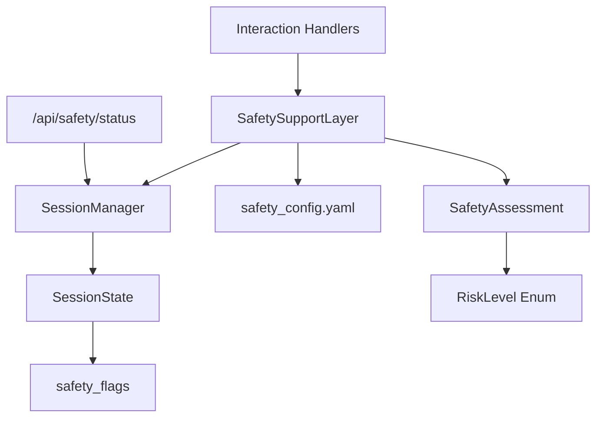

# Safety Monitoring API

<cite>
**Referenced Files in This Document**
- [app.py](file://psychologist/app.py)
- [API.md](file://psychologist/docs/API.md)
- [safety_config.yaml](file://psychologist/config/safety_config.yaml)
- [safety_support_layer.py](file://psychologist/emotion_engine/interaction/safety_support_layer.py)
- [session_manager.py](file://psychologist/emotion_engine/interaction/session_manager.py)
- [interaction_models.py](file://psychologist/emotion_engine/interaction/interaction_models.py)
- [text_mode_handler.py](file://psychologist/emotion_engine/interaction/text_mode_handler.py)
- [voice_mode_handler.py](file://psychologist/emotion_engine/interaction/voice_mode_handler.py)
- [hybrid_mode_handler.py](file://psychologist/emotion_engine/interaction/hybrid_mode_handler.py)
- [system_constants.py](file://psychologist/system_constants.py)
</cite>

## Table of Contents
1. [Introduction](#introduction)
2. [Project Structure](#project-structure)
3. [Core Components](#core-components)
4. [Architecture Overview](#architecture-overview)
5. [Detailed Component Analysis](#detailed-component-analysis)
6. [Dependency Analysis](#dependency-analysis)
7. [Performance Considerations](#performance-considerations)
8. [Troubleshooting Guide](#troubleshooting-guide)
9. [Conclusion](#conclusion)

## Introduction
This document provides comprehensive API documentation for the safety monitoring and crisis detection endpoints, focusing on the `/api/safety/status` endpoint. It explains how the system detects safety risks during interactions, maintains safety flags in sessions, and integrates with the broader interaction system. The documentation covers risk level classifications, safety flag structures, configuration options, and practical examples for monitoring safety status during interactions.

## Project Structure
The safety monitoring system is integrated into the main Flask application and interacts with the interaction pipeline components:

- Flask application routes define the API endpoints
- Safety assessment logic resides in the SafetySupportLayer
- Session state tracks safety flags and risk levels
- Interaction handlers (text, voice, hybrid) perform safety checks before generating responses



**Diagram sources**
- [app.py:527-543](file://psychologist/app.py#L527-L543)
- [text_mode_handler.py:71-73](file://psychologist/emotion_engine/interaction/text_mode_handler.py#L71-L73)
- [voice_mode_handler.py:165-167](file://psychologist/emotion_engine/interaction/voice_mode_handler.py#L165-L167)
- [hybrid_mode_handler.py:56-67](file://psychologist/emotion_engine/interaction/hybrid_mode_handler.py#L56-L67)
- [safety_support_layer.py:80-135](file://psychologist/emotion_engine/interaction/safety_support_layer.py#L80-L135)
- [session_manager.py:127-131](file://psychologist/emotion_engine/interaction/session_manager.py#L127-L131)
- [safety_config.yaml:1-116](file://psychologist/config/safety_config.yaml#L1-L116)

**Section sources**
- [app.py:527-543](file://psychologist/app.py#L527-L543)
- [API.md:445-460](file://psychologist/docs/API.md#L445-L460)

## Core Components
This section documents the key components involved in safety monitoring and crisis detection:

- SafetySupportLayer: Performs keyword-based safety assessments and provides safe response templates
- SessionManager: Maintains session state including safety flags and risk levels
- Interaction Handlers: Integrate safety checks into the interaction pipeline
- Safety Configuration: Defines crisis keywords, diagnosis blocking patterns, and safe response templates

Key implementation patterns:
- Safety assessment occurs before response generation in both text and voice modes
- Safety flags are recorded in the session state and exposed via the safety status endpoint
- Risk levels are standardized across the system

**Section sources**
- [safety_support_layer.py:24-135](file://psychologist/emotion_engine/interaction/safety_support_layer.py#L24-L135)
- [session_manager.py:127-131](file://psychologist/emotion_engine/interaction/session_manager.py#L127-L131)
- [text_mode_handler.py:71-125](file://psychologist/emotion_engine/interaction/text_mode_handler.py#L71-L125)
- [voice_mode_handler.py:165-241](file://psychologist/emotion_engine/interaction/voice_mode_handler.py#L165-L241)
- [safety_config.yaml:1-116](file://psychologist/config/safety_config.yaml#L1-L116)

## Architecture Overview
The safety monitoring architecture follows a layered approach:



**Diagram sources**
- [app.py:527-543](file://psychologist/app.py#L527-L543)
- [session_manager.py:94-98](file://psychologist/emotion_engine/interaction/session_manager.py#L94-L98)
- [safety_support_layer.py:80-135](file://psychologist/emotion_engine/interaction/safety_support_layer.py#L80-L135)

## Detailed Component Analysis

### Safety Status Endpoint
The `/api/safety/status` endpoint provides the current safety status of the active session:

**Endpoint**: `GET /api/safety/status`

**Response Schema**:
```json
{
  "risk_level": "string",
  "flags": "array|object"
}
```

Where:
- `risk_level`: One of "none", "low", "moderate", "high", "critical"
- `flags`: Array of safety flags or object containing risk level metadata

**Behavior**:
- Returns "none" with empty flags when no active session exists
- Converts session safety flags to standardized risk level
- Supports both list and dictionary flag formats

**Section sources**
- [app.py:527-543](file://psychologist/app.py#L527-L543)
- [API.md:447-457](file://psychologist/docs/API.md#L447-L457)

### Safety Assessment Logic
The SafetySupportLayer performs comprehensive safety assessments:



**Diagram sources**
- [safety_support_layer.py:80-135](file://psychologist/emotion_engine/interaction/safety_support_layer.py#L80-L135)

**Risk Level Classification**:
- `NONE`: No safety concerns detected
- `LOW`: Mild distress language (not currently used in production)
- `MODERATE`: Notable distress requiring support tools
- `HIGH`: Crisis signals detected requiring immediate intervention
- `CRITICAL`: Immediate danger requiring strong crisis messaging

**Section sources**
- [safety_support_layer.py:24-34](file://psychologist/emotion_engine/interaction/safety_support_layer.py#L24-L34)
- [interaction_models.py:48-54](file://psychologist/emotion_engine/interaction/interaction_models.py#L48-L54)

### Safety Flag Integration
Safety flags are integrated throughout the interaction pipeline:



**Diagram sources**
- [interaction_models.py:191-227](file://psychologist/emotion_engine/interaction/interaction_models.py#L191-L227)
- [interaction_models.py:143-186](file://psychologist/emotion_engine/interaction/interaction_models.py#L143-L186)
- [interaction_models.py:292-308](file://psychologist/emotion_engine/interaction/interaction_models.py#L292-L308)

**Section sources**
- [session_manager.py:127-131](file://psychologist/emotion_engine/interaction/session_manager.py#L127-L131)
- [text_mode_handler.py:118-125](file://psychologist/emotion_engine/interaction/text_mode_handler.py#L118-L125)
- [voice_mode_handler.py:234-241](file://psychologist/emotion_engine/interaction/voice_mode_handler.py#L234-L241)

### Safety Configuration
The system uses a YAML configuration file to define safety rules:

**Crisis Keywords**:
- Self-harm: suicide, self-harm, cutting, ending life
- Harm to others: violence, killing, hurting
- Abuse: domestic violence, sexual assault
- Panic: breathing difficulties, heart racing
- Medical emergencies: overdose, bleeding

**Diagnosis Blocking Patterns**:
- Prevents claiming diagnoses or medical expertise
- Replaces problematic responses with safe alternatives

**Safe Response Templates**:
- Crisis support templates in English and Bangla
- Non-crisis distress templates
- Professional help reminders and disclaimers

**Section sources**
- [safety_config.yaml:1-116](file://psychologist/config/safety_config.yaml#L1-L116)

### Practical Usage Examples

#### Monitoring Safety Status During Interactions
```javascript
// Example: Poll safety status during a session
async function monitorSafety(sessionId) {
  const response = await fetch('/api/safety/status');
  const safety = await response.json();
  
  console.log(`Current risk level: ${safety.risk_level}`);
  
  // React to elevated risk
  if (safety.risk_level === 'high' || safety.risk_level === 'critical') {
    // Trigger intervention protocols
    await initiateCrisisProtocol();
  }
  
  return safety;
}
```

#### Interpreting Risk Levels
- `none`: Normal interaction, no safety concerns
- `moderate`: User expressing distress, offer support tools
- `high/critical`: Crisis detected, provide immediate support

#### Integration with Session Management
```javascript
// Example: Track safety flags across interactions
let safetyHistory = [];

async function trackSafetyDuringSession() {
  const response = await fetch('/api/interaction/message', {
    method: 'POST',
    headers: {'Content-Type': 'application/json'},
    body: JSON.stringify({text: userInput})
  });
  
  const result = await response.json();
  safetyHistory.push(result.safety_assessment);
  
  // Monitor trend
  const latestRisk = result.safety_assessment.risk_level;
  const flags = result.assistant_message.safety_level;
  
  // Update UI based on risk level
  updateSafetyIndicator(latestRisk, flags);
}
```

**Section sources**
- [API.md:447-457](file://psychologist/docs/API.md#L447-L457)
- [text_mode_handler.py:97-125](file://psychologist/emotion_engine/interaction/text_mode_handler.py#L97-L125)
- [voice_mode_handler.py:212-241](file://psychologist/emotion_engine/interaction/voice_mode_handler.py#L212-L241)

## Dependency Analysis
The safety monitoring system has the following dependencies:



**Diagram sources**
- [app.py:527-543](file://psychologist/app.py#L527-L543)
- [session_manager.py:127-131](file://psychologist/emotion_engine/interaction/session_manager.py#L127-L131)
- [safety_support_layer.py:80-135](file://psychologist/emotion_engine/interaction/safety_support_layer.py#L80-L135)
- [interaction_models.py:48-54](file://psychologist/emotion_engine/interaction/interaction_models.py#L48-L54)

**Section sources**
- [system_constants.py:74-81](file://psychologist/system_constants.py#L74-L81)

## Performance Considerations
- Safety assessments use keyword matching only, avoiding expensive computations
- Results are cached in session state to avoid repeated processing
- Configuration loading occurs once during initialization
- Response filtering is O(n) where n is the number of diagnosis patterns

## Troubleshooting Guide
Common issues and solutions:

**No Active Session**:
- Symptom: `/api/safety/status` returns `{"risk_level": "none", "flags": []}`
- Cause: No active session exists
- Solution: Start a session via `/api/session/start` before checking safety status

**Incorrect Risk Level Calculation**:
- Verify safety configuration contains expected keywords
- Check that input text normalization isn't removing important context
- Review session safety flags for accumulated risk indicators

**Missing Safety Flags**:
- Ensure interaction handlers are properly recording safety levels
- Verify session persistence is functioning correctly
- Check that safety assessment is being performed before response generation

**Section sources**
- [app.py:529-530](file://psychologist/app.py#L529-L530)
- [session_manager.py:127-131](file://psychologist/emotion_engine/interaction/session_manager.py#L127-L131)
- [text_mode_handler.py:141-147](file://psychologist/emotion_engine/interaction/text_mode_handler.py#L141-L147)

## Conclusion
The safety monitoring API provides a robust framework for detecting and responding to safety concerns during interactions. By integrating safety assessments into the interaction pipeline and maintaining comprehensive safety flags in session state, the system enables real-time monitoring and intervention capabilities. The standardized risk level classifications and flexible configuration options make it suitable for various deployment scenarios while maintaining consistent safety protocols.