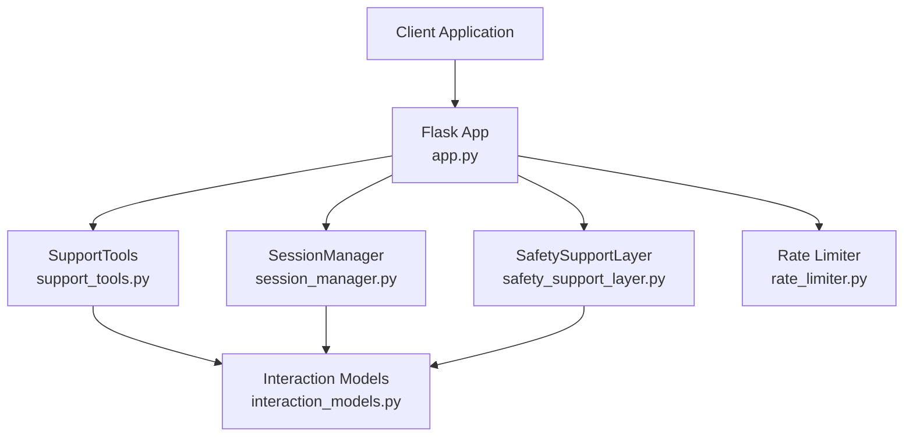
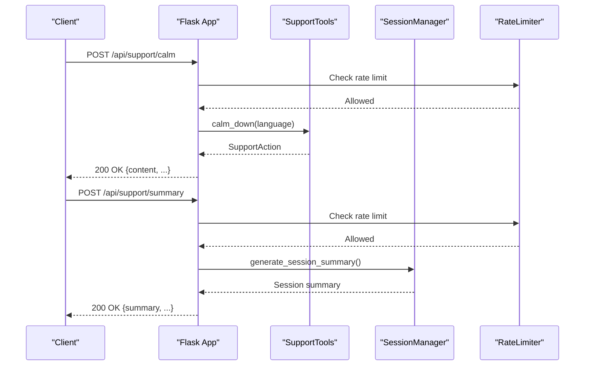
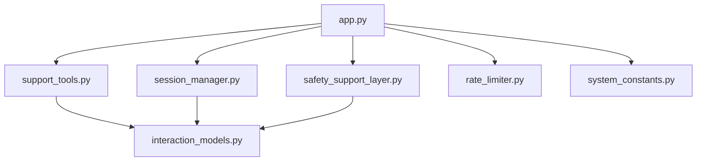

# Support Tools API

<cite>
**Referenced Files in This Document**
- [app.py](file://psychologist/app.py)
- [support_tools.py](file://psychologist/emotion_engine/interaction/support_tools.py)
- [session_manager.py](file://psychologist/emotion_engine/interaction/session_manager.py)
- [interaction_models.py](file://psychologist/emotion_engine/interaction/interaction_models.py)
- [safety_support_layer.py](file://psychologist/emotion_engine/interaction/safety_support_layer.py)
- [rate_limiter.py](file://psychologist/rate_limiter.py)
- [system_constants.py](file://psychologist/system_constants.py)
- [safety_config.yaml](file://psychologist/config/safety_config.yaml)
- [test_api_endpoints.py](file://psychologist/tests/test_api_endpoints.py)
</cite>

## Table of Contents
1. [Introduction](#introduction)
2. [Project Structure](#project-structure)
3. [Core Components](#core-components)
4. [Architecture Overview](#architecture-overview)
5. [Detailed Component Analysis](#detailed-component-analysis)
6. [Dependency Analysis](#dependency-analysis)
7. [Performance Considerations](#performance-considerations)
8. [Troubleshooting Guide](#troubleshooting-guide)
9. [Conclusion](#conclusion)

## Introduction
This document provides comprehensive API documentation for the mental health support tools endpoints. It covers the following endpoints:
- POST /api/support/calm: Breathing and relaxation exercises
- POST /api/support/breathing: Guided breathing exercises
- POST /api/support/journal: Journaling prompts with emotion selection
- POST /api/support/reflection: Reflection questions
- POST /api/support/mood-checkin: Mood tracking
- POST /api/support/summary: Session summaries

The documentation includes request/response schemas, parameter validation, rate limiting (30 requests per minute), integration with the session management system, practical examples, and the relationship to the overall safety monitoring system.

## Project Structure
The support tools are implemented as part of the interaction layer within the emotion engine. The Flask application exposes endpoints that delegate to the SupportTools class and integrate with the SessionManager for session lifecycle management.

**Diagram sources**
- [app.py:478-525](file://psychologist/app.py#L478-L525)
- [support_tools.py:19-179](file://psychologist/emotion_engine/interaction/support_tools.py#L19-L179)
- [session_manager.py:26-303](file://psychologist/emotion_engine/interaction/session_manager.py#L26-L303)
- [safety_support_layer.py:24-286](file://psychologist/emotion_engine/interaction/safety_support_layer.py#L24-L286)
- [interaction_models.py:15-309](file://psychologist/emotion_engine/interaction/interaction_models.py#L15-L309)
- [rate_limiter.py:74-112](file://psychologist/rate_limiter.py#L74-L112)

**Section sources**
- [app.py:478-525](file://psychologist/app.py#L478-L525)
- [support_tools.py:19-179](file://psychologist/emotion_engine/interaction/support_tools.py#L19-L179)
- [session_manager.py:26-303](file://psychologist/emotion_engine/interaction/session_manager.py#L26-L303)
- [safety_support_layer.py:24-286](file://psychologist/emotion_engine/interaction/safety_support_layer.py#L24-L286)
- [interaction_models.py:15-309](file://psychologist/emotion_engine/interaction/interaction_models.py#L15-L309)
- [rate_limiter.py:74-112](file://psychologist/rate_limiter.py#L74-L112)

## Core Components
- SupportTools: Provides pre-written supportive content for calming, breathing, journaling, reflection, mood check-in, and grounding exercises. Content is available in English and Bangla.
- SessionManager: Manages session lifecycle, persistence, and generates summaries and follow-up suggestions.
- SafetySupportLayer: Detects crisis signals, blocks diagnostic statements, and provides safe response templates.
- RateLimiter: Enforces per-IP rate limits using a sliding-window token bucket mechanism.
- Interaction Models: Defines data structures for support actions, session state, safety assessments, and enums for types and risk levels.

Key integration points:
- Support endpoints call SupportTools to retrieve content and return SupportAction objects.
- Session endpoints manage session creation, updates, and summaries.
- Safety layer integrates with the broader interaction pipeline to assess risk and guide responses.

**Section sources**
- [support_tools.py:19-179](file://psychologist/emotion_engine/interaction/support_tools.py#L19-L179)
- [session_manager.py:26-303](file://psychologist/emotion_engine/interaction/session_manager.py#L26-L303)
- [safety_support_layer.py:24-286](file://psychologist/emotion_engine/interaction/safety_support_layer.py#L24-L286)
- [rate_limiter.py:22-112](file://psychologist/rate_limiter.py#L22-L112)
- [interaction_models.py:267-287](file://psychologist/emotion_engine/interaction/interaction_models.py#L267-L287)

## Architecture Overview
The support tools API follows a layered architecture:
- Presentation Layer: Flask routes expose endpoints with rate limiting.
- Domain Layer: SupportTools encapsulates content retrieval and selection.
- Persistence Layer: SessionManager handles session creation, updates, and storage.
- Safety Layer: SafetySupportLayer performs keyword-based safety checks and provides safe templates.
- Data Models: Shared data structures define the shape of requests, responses, and internal state.

**Diagram sources**
- [app.py:478-525](file://psychologist/app.py#L478-L525)
- [support_tools.py:27-31](file://psychologist/emotion_engine/interaction/support_tools.py#L27-L31)
- [session_manager.py:212-244](file://psychologist/emotion_engine/interaction/session_manager.py#L212-L244)
- [rate_limiter.py:94-110](file://psychologist/rate_limiter.py#L94-L110)

## Detailed Component Analysis

### Endpoint: POST /api/support/calm
Purpose: Retrieve calming exercises for immediate stress relief.

Request Schema
- Body: JSON object
  - language: string, optional, default "en". Supported values: "en", "bn", "bn_bd".
- Validation: Uses rate limiter (30 RPM).

Response Schema
- JSON object representing a SupportAction:
  - action_type: string, value "calm_down"
  - trigger_reason: string, description of why the action was triggered
  - script_key: string, identifies the selected script variant
  - language: string, "en" or "bn"
  - completed: boolean, indicates completion status
  - timestamp: ISO 8601 datetime string
  - content: string, the calming instruction text

Behavior
- Delegates to SupportTools.calm_down(language).
- Selects a random script from the available variants for the specified language.
- Returns the SupportAction serialized to JSON.

Practical Example
- Request: POST /api/support/calm with {"language": "bn"}
- Response includes content in Bengali with a calming instruction.

Integration Notes
- No session requirement.
- Rate-limited endpoint.

**Section sources**
- [app.py:478-484](file://psychologist/app.py#L478-L484)
- [support_tools.py:27-31](file://psychologist/emotion_engine/interaction/support_tools.py#L27-L31)
- [interaction_models.py:267-287](file://psychologist/emotion_engine/interaction/interaction_models.py#L267-L287)

### Endpoint: POST /api/support/breathing
Purpose: Retrieve guided breathing exercises.

Request Schema
- Body: JSON object
  - language: string, optional, default "en". Supported values: "en", "bn", "bn_bd".

Response Schema
- JSON object representing a SupportAction:
  - action_type: string, value "breathing_exercise"
  - trigger_reason: string
  - script_key: string
  - language: string
  - completed: boolean
  - timestamp: ISO 8601 datetime string
  - content: string, the breathing exercise instructions

Behavior
- Delegates to SupportTools.breathing_exercise(language).
- Selects a random script variant for the specified language.

Practical Example
- Request: POST /api/support/breathing with {"language": "en"}
- Response includes English content with a 4-7-8 or box breathing technique.

**Section sources**
- [app.py:486-492](file://psychologist/app.py#L486-L492)
- [support_tools.py:33-37](file://psychologist/emotion_engine/interaction/support_tools.py#L33-L37)
- [interaction_models.py:267-287](file://psychologist/emotion_engine/interaction/interaction_models.py#L267-L287)

### Endpoint: POST /api/support/journal
Purpose: Retrieve journaling prompts, optionally customized by emotion.

Request Schema
- Body: JSON object
  - language: string, optional, default "en". Supported values: "en", "bn", "bn_bd".
  - emotion: string, optional. When provided in English, the response content is prefixed with an emotion-specific note.

Response Schema
- JSON object representing a SupportAction:
  - action_type: string, value "journaling_prompt"
  - trigger_reason: string
  - script_key: string
  - language: string
  - completed: boolean
  - timestamp: ISO 8601 datetime string
  - content: string, the journaling prompt

Behavior
- Delegates to SupportTools.journaling_prompt(language, emotion).
- If emotion is provided and language is "en", prefixes the content with a note about the emotion.
- For "bn" or "bn_bd", prefixes content with a Bengali emotion note.

Practical Example
- Request: POST /api/support/journal with {"language": "en", "emotion": "sadness"}
- Response includes an emotion-aware journaling prompt in English.

**Section sources**
- [app.py:494-501](file://psychologist/app.py#L494-L501)
- [support_tools.py:39-57](file://psychologist/emotion_engine/interaction/support_tools.py#L39-L57)
- [interaction_models.py:267-287](file://psychologist/emotion_engine/interaction/interaction_models.py#L267-L287)

### Endpoint: POST /api/support/reflection
Purpose: Retrieve reflection questions for self-awareness.

Request Schema
- Body: JSON object
  - language: string, optional, default "en". Supported values: "en", "bn", "bn_bd".

Response Schema
- JSON object representing a SupportAction:
  - action_type: string, value "reflection_questions"
  - trigger_reason: string
  - script_key: string
  - language: string
  - completed: boolean
  - timestamp: ISO 8601 datetime string
  - content: string, the reflection prompts

Behavior
- Delegates to SupportTools.reflection_questions(language).
- Selects a random script variant for the specified language.

**Section sources**
- [app.py:503-509](file://psychologist/app.py#L503-L509)
- [support_tools.py:59-63](file://psychologist/emotion_engine/interaction/support_tools.py#L59-L63)
- [interaction_models.py:267-287](file://psychologist/emotion_engine/interaction/interaction_models.py#L267-L287)

### Endpoint: POST /api/support/mood-checkin
Purpose: Retrieve mood check-in prompts for tracking emotional state.

Request Schema
- Body: JSON object
  - language: string, optional, default "en". Supported values: "en", "bn", "bn_bd".

Response Schema
- JSON object representing a SupportAction:
  - action_type: string, value "mood_checkin"
  - trigger_reason: string
  - script_key: string
  - language: string
  - completed: boolean
  - timestamp: ISO 8601 datetime string
  - content: string, the mood check-in instructions

Behavior
- Delegates to SupportTools.mood_checkin(language).
- Selects a random script variant for the specified language.

**Section sources**
- [app.py:511-517](file://psychologist/app.py#L511-L517)
- [support_tools.py:65-69](file://psychologist/emotion_engine/interaction/support_tools.py#L65-L69)
- [interaction_models.py:267-287](file://psychologist/emotion_engine/interaction/interaction_models.py#L267-L287)

### Endpoint: POST /api/support/summary
Purpose: Generate a session summary when a session is active.

Request Schema
- Body: JSON object (no required fields).
- Validation: Requires an active session managed by SessionManager.

Response Schema
- JSON object containing:
  - summary: string, generated summary of the session
  - follow_up_suggestions: array of strings, suggested next steps
  - session_id: string
  - start_time: ISO 8601 datetime string
  - end_time: ISO 8601 datetime string or null
  - message_count: integer, number of user messages
  - active_mode: string
  - language: string
  - safety_flags: array of strings, safety-related flags recorded during the session

Behavior
- Validates that a session exists; otherwise returns an error.
- Delegates to SessionManager.generate_session_summary() internally.
- Returns the session summary and follow-up suggestions.

Practical Example
- Request: POST /api/support/summary when a session is active
- Response includes a summary and suggestions based on detected emotions and safety flags.

**Section sources**
- [app.py:519-525](file://psychologist/app.py#L519-L525)
- [session_manager.py:212-275](file://psychologist/emotion_engine/interaction/session_manager.py#L212-L275)
- [interaction_models.py:191-227](file://psychologist/emotion_engine/interaction/interaction_models.py#L191-L227)

### SupportAction Data Model
SupportAction is the core response model for support tools:
- Fields:
  - action_type: string, enum-like value indicating the type of support action
  - trigger_reason: string, reason for triggering the action
  - script_key: string, identifies the selected script variant
  - language: string, "en" or "bn"
  - completed: boolean
  - timestamp: ISO 8601 datetime string
  - content: string, the actual support content

Usage:
- Returned by SupportTools methods to standardize responses across endpoints.

**Section sources**
- [interaction_models.py:267-287](file://psychologist/emotion_engine/interaction/interaction_models.py#L267-L287)
- [support_tools.py:85-98](file://psychologist/emotion_engine/interaction/support_tools.py#L85-L98)

### Session Management Integration
SessionManager manages session lifecycle and provides summary generation:
- Methods used by support endpoints:
  - start_session(mode, language): creates a new session
  - end_session(generate_summary): ends the current session and persists it
  - generate_session_summary(): produces a textual summary and follow-up suggestions
  - add_user_message(UserMessage): records user messages and detected emotions
  - add_assistant_message(AssistantMessage): records assistant responses and safety flags

Follow-up suggestions are derived from detected emotions and safety flags, providing actionable insights for subsequent sessions.

**Section sources**
- [session_manager.py:59-92](file://psychologist/emotion_engine/interaction/session_manager.py#L59-L92)
- [session_manager.py:212-275](file://psychologist/emotion_engine/interaction/session_manager.py#L212-L275)
- [interaction_models.py:92-138](file://psychologist/emotion_engine/interaction/interaction_models.py#L92-L138)
- [interaction_models.py:143-186](file://psychologist/emotion_engine/interaction/interaction_models.py#L143-L186)

### Safety Monitoring Integration
SafetySupportLayer performs keyword-based safety checks:
- Crisis detection: Identifies keywords indicative of self-harm, harm to others, abuse, panic attacks, and medical emergencies.
- Distress detection: Flags moderate distress language.
- Safe response templates: Provides templates for crisis and non-crisis distress scenarios.
- Response filtering: Blocks diagnostic statements and other unsafe content.

Integration points:
- Safety flags are recorded in SessionState and included in session summaries.
- Safety layer informs risk levels that influence session summaries and follow-up suggestions.

**Section sources**
- [safety_support_layer.py:80-135](file://psychologist/emotion_engine/interaction/safety_support_layer.py#L80-L135)
- [safety_support_layer.py:167-227](file://psychologist/emotion_engine/interaction/safety_support_layer.py#L167-L227)
- [safety_support_layer.py:231-285](file://psychologist/emotion_engine/interaction/safety_support_layer.py#L231-L285)
- [safety_config.yaml:5-116](file://psychologist/config/safety_config.yaml#L5-L116)
- [session_manager.py:127-131](file://psychologist/emotion_engine/interaction/session_manager.py#L127-L131)

### Rate Limiting
All support endpoints are rate-limited to 30 requests per minute per client IP:
- Implementation: Sliding-window token bucket per client IP.
- Behavior: Returns HTTP 429 Too Many Requests when exceeded.
- Decorator usage: @rate_limit(app, requests=30, window_seconds=60).

Validation:
- Tests confirm successful responses for support endpoints when within limits.

**Section sources**
- [app.py:478-525](file://psychologist/app.py#L478-L525)
- [rate_limiter.py:74-112](file://psychologist/rate_limiter.py#L74-L112)
- [test_api_endpoints.py:158-184](file://psychologist/tests/test_api_endpoints.py#L158-L184)

## Dependency Analysis
The support tools API depends on several core modules:

**Diagram sources**
- [app.py:478-525](file://psychologist/app.py#L478-L525)
- [support_tools.py:19-179](file://psychologist/emotion_engine/interaction/support_tools.py#L19-L179)
- [session_manager.py:26-303](file://psychologist/emotion_engine/interaction/session_manager.py#L26-L303)
- [safety_support_layer.py:24-286](file://psychologist/emotion_engine/interaction/safety_support_layer.py#L24-L286)
- [interaction_models.py:15-309](file://psychologist/emotion_engine/interaction/interaction_models.py#L15-L309)
- [rate_limiter.py:74-112](file://psychologist/rate_limiter.py#L74-L112)
- [system_constants.py:98-102](file://psychologist/system_constants.py#L98-L102)

**Section sources**
- [app.py:478-525](file://psychologist/app.py#L478-L525)
- [support_tools.py:19-179](file://psychologist/emotion_engine/interaction/support_tools.py#L19-L179)
- [session_manager.py:26-303](file://psychologist/emotion_engine/interaction/session_manager.py#L26-L303)
- [safety_support_layer.py:24-286](file://psychologist/emotion_engine/interaction/safety_support_layer.py#L24-L286)
- [interaction_models.py:15-309](file://psychologist/emotion_engine/interaction/interaction_models.py#L15-L309)
- [rate_limiter.py:74-112](file://psychologist/rate_limiter.py#L74-L112)
- [system_constants.py:98-102](file://psychologist/system_constants.py#L98-L102)

## Performance Considerations
- In-memory rate limiting: Suitable for single-process deployments; consider external storage for multi-process setups.
- Content retrieval: SupportTools selects random scripts per request; negligible computational overhead.
- Session persistence: JSON serialization and disk writes occur on session end; keep sessions appropriately scoped to reduce I/O.
- Safety checks: Keyword matching is linear in the number of keywords; configuration can be tuned for performance vs. sensitivity trade-offs.

## Troubleshooting Guide
Common issues and resolutions:
- Rate limit exceeded: Ensure clients wait between requests or adjust client-side throttling. The server responds with HTTP 429 and a JSON error payload.
- No active session for summary: Call POST /api/session/start before requesting a summary, or ensure a session exists.
- Unsupported language: Only "en", "bn", and "bn_bd" are supported; invalid values fall back to English.
- Missing or malformed JSON: Ensure the request body is valid JSON and includes required fields where applicable.

Validation and error handling:
- Rate limiter returns structured JSON errors on 429.
- Tests demonstrate expected behaviors for support endpoints.

**Section sources**
- [rate_limiter.py:94-110](file://psychologist/rate_limiter.py#L94-L110)
- [test_api_endpoints.py:158-184](file://psychologist/tests/test_api_endpoints.py#L158-L184)

## Conclusion
The Support Tools API provides a robust, offline-first set of mental health support resources integrated with session management and safety monitoring. The endpoints are rate-limited, language-aware, and designed to be easily integrated into therapy sessions. The system’s keyword-based safety layer ensures responsible support delivery, while session summaries and follow-up suggestions facilitate ongoing therapeutic progress.