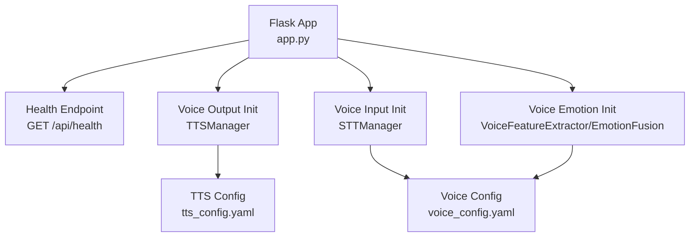
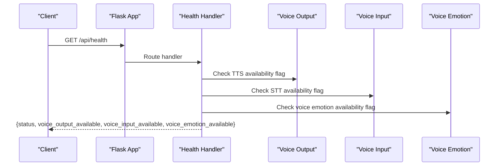
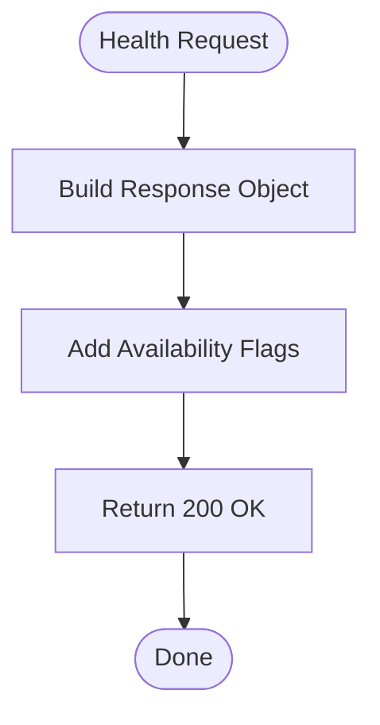
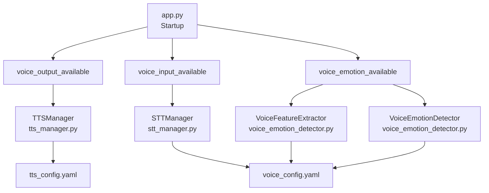

# System Health & Status API

<cite>
**Referenced Files in This Document**
- [app.py](file://psychologist/app.py)
- [API.md](file://psychologist/docs/API.md)
- [test_api_endpoints.py](file://psychologist/tests/test_api_endpoints.py)
- [tts_manager.py](file://psychologist/emotion_engine/voice_output/tts_manager.py)
- [stt_manager.py](file://psychologist/emotion_engine/voice_system/stt_manager.py)
- [voice_emotion_detector.py](file://psychologist/emotion_engine/voice_system/voice_emotion_detector.py)
- [audio_config.py](file://psychologist/emotion_engine/voice_system/audio_config.py)
- [vosk_engine.py](file://psychologist/emotion_engine/voice_system/vosk_engine.py)
- [whisper_engine.py](file://psychologist/emotion_engine/voice_system/whisper_engine.py)
- [voice_config.yaml](file://psychologist/config/voice_config.yaml)
- [tts_config.yaml](file://psychologist/config/tts_config.yaml)
- [system_constants.py](file://psychologist/system_constants.py)
</cite>

## Table of Contents
1. [Introduction](#introduction)
2. [Project Structure](#project-structure)
3. [Core Components](#core-components)
4. [Architecture Overview](#architecture-overview)
5. [Detailed Component Analysis](#detailed-component-analysis)
6. [Dependency Analysis](#dependency-analysis)
7. [Performance Considerations](#performance-considerations)
8. [Troubleshooting Guide](#troubleshooting-guide)
9. [Conclusion](#conclusion)

## Introduction
This document provides comprehensive API documentation for the system health and status endpoints, focusing on the `/api/health` GET endpoint. It explains how the health check reports voice system availability indicators (voice_output_available, voice_input_available, voice_emotion_available) and integrates with the initialization process of different system components. The documentation covers response schemas, error handling, monitoring patterns, and practical examples for system readiness verification and configuration change handling.

## Project Structure
The health endpoint is implemented within the Flask application and leverages voice system components during application startup to determine subsystem availability. The relevant files include the Flask app definition, voice system managers, configuration files, and tests.

**Diagram sources**
- [app.py:48-120](file://psychologist/app.py#L48-L120)
- [tts_manager.py:31-88](file://psychologist/emotion_engine/voice_output/tts_manager.py#L31-L88)
- [stt_manager.py:17-39](file://psychologist/emotion_engine/voice_system/stt_manager.py#L17-L39)
- [voice_config.yaml:1-28](file://psychologist/config/voice_config.yaml#L1-L28)
- [tts_config.yaml:1-61](file://psychologist/config/tts_config.yaml#L1-L61)

**Section sources**
- [app.py:48-120](file://psychologist/app.py#L48-L120)
- [API.md:8-22](file://psychologist/docs/API.md#L8-L22)

## Core Components
The health endpoint consolidates subsystem availability flags derived from the application's initialization phase:
- voice_output_available: Indicates whether the TTS system was successfully initialized with a single locked voice.
- voice_input_available: Indicates whether the STT system was successfully initialized.
- voice_emotion_available: Indicates whether voice emotion components (feature extraction, emotion detection, fusion) were successfully initialized.

The endpoint returns a JSON object containing:
- status: Always "ok" for successful health checks.
- voice_output_available: Boolean flag indicating TTS availability.
- voice_input_available: Boolean flag indicating STT availability.
- voice_emotion_available: Boolean flag indicating voice emotion availability.

**Section sources**
- [app.py:48-58](file://psychologist/app.py#L48-L58)
- [API.md:14-22](file://psychologist/docs/API.md#L14-L22)

## Architecture Overview
The health check integrates with the application startup sequence to reflect the current state of voice subsystems. The diagram below shows how the health endpoint depends on voice system initialization and configuration.

**Diagram sources**
- [app.py:48-58](file://psychologist/app.py#L48-L58)
- [app.py:73-119](file://psychologist/app.py#L73-L119)

## Detailed Component Analysis

### Health Endpoint Implementation
The health endpoint is defined as a GET route that returns a JSON object with the system status and voice subsystem availability flags. The flags are populated during application initialization based on successful attempts to instantiate and configure voice components.

Key implementation aspects:
- Route registration: GET /api/health
- Response construction: Includes status and three boolean flags for voice subsystems
- Availability determination: Flags are set during startup when voice components are initialized

**Diagram sources**
- [app.py:48-58](file://psychologist/app.py#L48-L58)

**Section sources**
- [app.py:48-58](file://psychologist/app.py#L48-L58)
- [API.md:10-22](file://psychologist/docs/API.md#L10-L22)

### Voice Output Availability (TTS)
The voice output availability flag is determined during application startup when the TTS manager is instantiated and configured. The TTS manager initializes multiple engines (Piper, eSpeak, pyttsx3) and locks a single local voice for consistent output.

Initialization flow:
- Attempt to import and initialize TTS components
- Set voice_output_available flag based on success
- Log initialization status

Availability indicators:
- voice_output_available: True if TTS initialization succeeds, False otherwise
- Additional voice output status can be queried via /api/voice-output/status when available

**Section sources**
- [app.py:73-82](file://psychologist/app.py#L73-L82)
- [tts_manager.py:55-87](file://psychologist/emotion_engine/voice_output/tts_manager.py#L55-L87)
- [tts_config.yaml:12-18](file://psychologist/config/tts_config.yaml#L12-L18)

### Voice Input Availability (STT)
The voice input availability flag is determined during application startup when the STT manager is instantiated and engines are initialized. The STT manager coordinates audio recording, preprocessing, and speech recognition.

Initialization flow:
- Instantiate STT manager
- Initialize speech recognition engines
- Set voice_input_available flag based on success

Availability indicators:
- voice_input_available: True if STT initialization succeeds, False otherwise
- STT-specific status and controls are available via interaction endpoints when enabled

**Section sources**
- [app.py:93-101](file://psychologist/app.py#L93-L101)
- [stt_manager.py:30-33](file://psychologist/emotion_engine/voice_system/stt_manager.py#L30-L33)
- [voice_config.yaml:6-12](file://psychologist/config/voice_config.yaml#L6-L12)

### Voice Emotion Availability
The voice emotion availability flag is determined during application startup when voice emotion components are initialized. These components include feature extraction, emotion detection, and emotion fusion.

Initialization flow:
- Import and instantiate voice feature extractor, emotion detector, and fusion components
- Set voice_emotion_available flag based on successful initialization

Availability indicators:
- voice_emotion_available: True if voice emotion components initialize successfully, False otherwise
- Voice emotion detection uses rule-based scoring and normalization

**Section sources**
- [app.py:108-119](file://psychologist/app.py#L108-L119)
- [voice_emotion_detector.py:6-51](file://psychologist/emotion_engine/voice_system/voice_emotion_detector.py#L6-L51)
- [audio_config.py:30-37](file://psychologist/emotion_engine/voice_system/audio_config.py#L30-L37)

### Error Handling and Edge Cases
The health endpoint itself does not throw exceptions; however, the application defines structured error handlers for other routes that demonstrate the expected error response format. The health endpoint follows standard HTTP semantics:
- Successful health checks return 200 OK with the health payload
- Method-not-allowed scenarios return 405 with a structured error response

Integration tests validate the health endpoint's behavior and response structure.

**Section sources**
- [app.py:25-46](file://psychologist/app.py#L25-L46)
- [test_api_endpoints.py:11-20](file://psychologist/tests/test_api_endpoints.py#L11-L20)
- [test_api_endpoints.py:234-238](file://psychologist/tests/test_api_endpoints.py#L234-L238)

## Dependency Analysis
The health endpoint depends on the application's initialization sequence to populate availability flags. The diagram below illustrates these dependencies.

**Diagram sources**
- [app.py:73-119](file://psychologist/app.py#L73-L119)
- [tts_manager.py:41-51](file://psychologist/emotion_engine/voice_output/tts_manager.py#L41-L51)
- [stt_manager.py:18-29](file://psychologist/emotion_engine/voice_system/stt_manager.py#L18-L29)
- [voice_emotion_detector.py:6-11](file://psychologist/emotion_engine/voice_system/voice_emotion_detector.py#L6-L11)
- [tts_config.yaml:1-61](file://psychologist/config/tts_config.yaml#L1-L61)
- [voice_config.yaml:1-28](file://psychologist/config/voice_config.yaml#L1-L28)

**Section sources**
- [app.py:73-119](file://psychologist/app.py#L73-L119)
- [tts_manager.py:41-51](file://psychologist/emotion_engine/voice_output/tts_manager.py#L41-L51)
- [stt_manager.py:18-29](file://psychologist/emotion_engine/voice_system/stt_manager.py#L18-L29)
- [voice_emotion_detector.py:6-11](file://psychologist/emotion_engine/voice_system/voice_emotion_detector.py#L6-L11)

## Performance Considerations
- Health endpoint overhead: The endpoint performs minimal computation, primarily returning pre-computed availability flags set during startup.
- Initialization timing: Availability flags are established during application startup, ensuring the health endpoint reflects the current system state without runtime initialization costs.
- Configuration impact: Changes to voice configuration files can alter availability flags, affecting health check outcomes.

## Troubleshooting Guide
Common scenarios and resolutions:
- All flags are false: Verify that voice system components are properly installed and configured. Check configuration files for correct engine settings and model paths.
- Partial flags false: Investigate specific component initialization failures. Review logs for import errors or missing dependencies.
- Health endpoint returns 405: Confirm that only GET requests are sent to /api/health.

Validation references:
- Integration tests confirm successful health responses and proper error handling for disallowed methods.

**Section sources**
- [test_api_endpoints.py:11-20](file://psychologist/tests/test_api_endpoints.py#L11-L20)
- [test_api_endpoints.py:234-238](file://psychologist/tests/test_api_endpoints.py#L234-L238)

## Conclusion
The /api/health endpoint provides a reliable mechanism for monitoring system readiness and voice subsystem availability. Its integration with the application startup sequence ensures accurate reflection of component initialization status. By understanding the relationship between health checks and voice system initialization, operators can effectively monitor system health, diagnose configuration issues, and respond to changes in system capabilities.