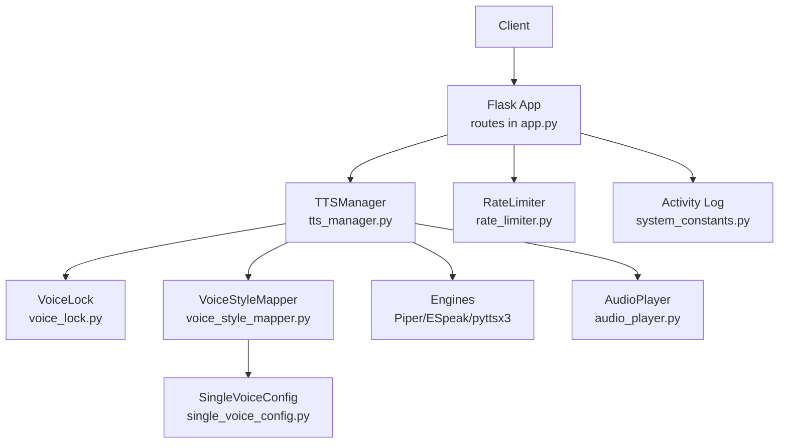
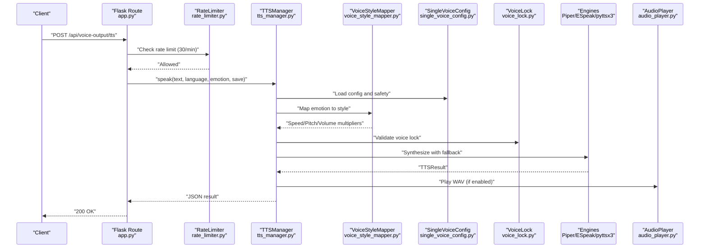
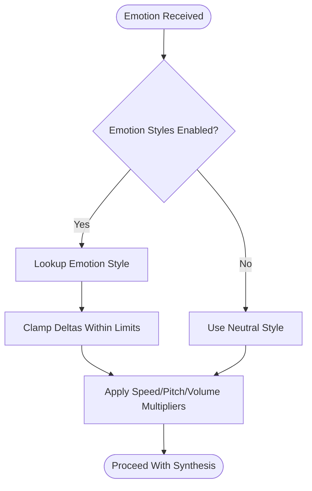
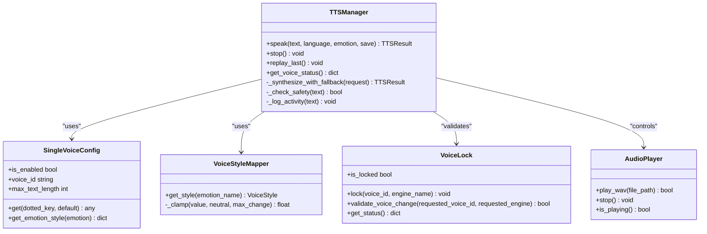

# Voice Output API

<cite>
**Referenced Files in This Document**
- [app.py](file://psychologist/app.py)
- [rate_limiter.py](file://psychologist/rate_limiter.py)
- [system_constants.py](file://psychologist/system_constants.py)
- [single_voice_tts.yaml](file://psychologist/config/single_voice_tts.yaml)
- [tts_manager.py](file://psychologist/emotion_engine/voice_output/tts_manager.py)
- [single_voice_config.py](file://psychologist/emotion_engine/voice_output/single_voice_config.py)
- [models.py](file://psychologist/emotion_engine/voice_output/models.py)
- [audio_player.py](file://psychologist/emotion_engine/voice_output/audio_player.py)
- [voice_lock.py](file://psychologist/emotion_engine/voice_output/voice_lock.py)
- [voice_style_mapper.py](file://psychologist/emotion_engine/voice_output/voice_style_mapper.py)
</cite>

## Table of Contents
1. [Introduction](#introduction)
2. [Project Structure](#project-structure)
3. [Core Components](#core-components)
4. [Architecture Overview](#architecture-overview)
5. [Detailed Component Analysis](#detailed-component-analysis)
6. [Dependency Analysis](#dependency-analysis)
7. [Performance Considerations](#performance-considerations)
8. [Troubleshooting Guide](#troubleshooting-guide)
9. [Conclusion](#conclusion)
10. [Appendices](#appendices)

## Introduction
This document provides comprehensive API documentation for the voice output endpoints when the voice system is available. It covers:
- Text-to-speech synthesis endpoint with language, emotion-aware style adjustments, and save options
- Playback control endpoints for stopping and replaying audio
- Status endpoint for voice system state and activity log
- Request/response schemas, parameter validation, rate limiting, error handling
- Single locked voice configuration, activity logging, and integration with the emotion engine for emotion-aware speech synthesis

## Project Structure
The voice output API is implemented as Flask routes and orchestrated by the TTS manager. The system enforces a single locked local voice, applies emotion-aware prosody adjustments, and supports optional audio saving and playback.

**Diagram sources**
- [app.py:240-287](file://psychologist/app.py#L240-L287)
- [tts_manager.py:31-244](file://psychologist/emotion_engine/voice_output/tts_manager.py#L31-L244)
- [voice_lock.py:13-97](file://psychologist/emotion_engine/voice_output/voice_lock.py#L13-L97)
- [voice_style_mapper.py:13-77](file://psychologist/emotion_engine/voice_output/voice_style_mapper.py#L13-L77)
- [single_voice_config.py:17-230](file://psychologist/emotion_engine/voice_output/single_voice_config.py#L17-L230)
- [audio_player.py:25-110](file://psychologist/emotion_engine/voice_output/audio_player.py#L25-L110)
- [rate_limiter.py:74-112](file://psychologist/rate_limiter.py#L74-L112)
- [system_constants.py:80-81](file://psychologist/system_constants.py#L80-L81)

**Section sources**
- [app.py:240-287](file://psychologist/app.py#L240-L287)
- [tts_manager.py:31-244](file://psychologist/emotion_engine/voice_output/tts_manager.py#L31-L244)
- [rate_limiter.py:74-112](file://psychologist/rate_limiter.py#L74-L112)
- [system_constants.py:80-81](file://psychologist/system_constants.py#L80-L81)

## Core Components
- TTSManager orchestrates synthesis, emotion mapping, engine fallback, playback, and persistence
- SingleVoiceConfig enforces a single locked local voice and emotion styles
- VoiceLock prevents voice identity changes at runtime
- VoiceStyleMapper maps detected emotions to prosody adjustments
- AudioPlayer handles WAV playback with graceful fallbacks
- RateLimiter enforces per-IP rate limits
- Activity logging tracks operational events

**Section sources**
- [tts_manager.py:31-244](file://psychologist/emotion_engine/voice_output/tts_manager.py#L31-L244)
- [single_voice_config.py:17-230](file://psychologist/emotion_engine/voice_output/single_voice_config.py#L17-L230)
- [voice_lock.py:13-97](file://psychologist/emotion_engine/voice_output/voice_lock.py#L13-L97)
- [voice_style_mapper.py:13-77](file://psychologist/emotion_engine/voice_output/voice_style_mapper.py#L13-L77)
- [audio_player.py:25-110](file://psychologist/emotion_engine/voice_output/audio_player.py#L25-L110)
- [rate_limiter.py:74-112](file://psychologist/rate_limiter.py#L74-L112)

## Architecture Overview
The voice output API exposes four endpoints when the voice system is available. All write endpoints are rate-limited to 30 requests per minute. The system validates inputs, applies emotion-aware prosody, synthesizes audio via prioritized engines, plays audio, optionally saves it, and updates the activity log.

**Diagram sources**
- [app.py:240-257](file://psychologist/app.py#L240-L257)
- [rate_limiter.py:74-112](file://psychologist/rate_limiter.py#L74-L112)
- [tts_manager.py:100-168](file://psychologist/emotion_engine/voice_output/tts_manager.py#L100-L168)
- [voice_style_mapper.py:23-59](file://psychologist/emotion_engine/voice_output/voice_style_mapper.py#L23-L59)
- [single_voice_config.py:119-188](file://psychologist/emotion_engine/voice_output/single_voice_config.py#L119-L188)
- [voice_lock.py:65-87](file://psychologist/emotion_engine/voice_output/voice_lock.py#L65-L87)
- [audio_player.py:36-62](file://psychologist/emotion_engine/voice_output/audio_player.py#L36-L62)

## Detailed Component Analysis

### Endpoint: POST /api/voice-output/tts
Purpose: Synthesize speech using the single locked local voice with optional emotion-aware prosody and save option.

- Method: POST
- Rate limit: 30 requests per 60 seconds per client IP
- Request body schema:
  - text: string (required, max length 5000)
  - language: string (optional, default "en")
  - emotion: string (optional, emotion name mapped to prosody)
  - save: boolean (optional, default false)
- Response body schema:
  - success: boolean
  - engine_name: string or null
  - audio_path: string or null
  - duration_seconds: number
  - error_message: string or null
  - timestamp: ISO datetime string
- Behavior:
  - Validates text input and rejects empty/oversized text
  - Applies emotion style multipliers to speed, pitch, and volume
  - Synthesizes audio via prioritized engines (Piper → eSpeak → pyttsx3)
  - Plays audio if auto-play is enabled
  - Saves audio if requested or configured
  - Logs activity events
- Error responses:
  - 400 invalid_input when validation fails
  - 500 tts_error on synthesis failure
  - 429 rate_limited when exceeding rate limit

Practical example:
- Synthesize with emotion "happy" and save the result
  - POST /api/voice-output/tts with JSON body containing text, language "en", emotion "happy", save true

**Section sources**
- [app.py:240-257](file://psychologist/app.py#L240-L257)
- [rate_limiter.py:74-112](file://psychologist/rate_limiter.py#L74-L112)
- [tts_manager.py:100-168](file://psychologist/emotion_engine/voice_output/tts_manager.py#L100-L168)
- [models.py:7-38](file://psychologist/emotion_engine/voice_output/models.py#L7-L38)
- [single_voice_config.py:218-229](file://psychologist/emotion_engine/voice_output/single_voice_config.py#L218-L229)

### Endpoint: POST /api/voice-output/tts/stop
Purpose: Stop current playback and cancel pending synthesis.

- Method: POST
- Rate limit: None
- Response body: {"status": "stopped"}
- Behavior:
  - Stops audio playback and cancels engine operations
  - Clears stop flag and resets playing state

Practical example:
- Stop playback immediately
  - POST /api/voice-output/tts/stop

**Section sources**
- [app.py:259-263](file://psychologist/app.py#L259-L263)
- [tts_manager.py:196-201](file://psychologist/emotion_engine/voice_output/tts_manager.py#L196-L201)
- [audio_player.py:101-105](file://psychologist/emotion_engine/voice_output/audio_player.py#L101-L105)

### Endpoint: POST /api/voice-output/tts/replay
Purpose: Replay the last synthesized audio.

- Method: POST
- Rate limit: None
- Response body: {"status": "replaying"}
- Behavior:
  - Replays the most recent audio file if available
  - Updates activity log

Practical example:
- Replay the last spoken audio
  - POST /api/voice-output/tts/replay

**Section sources**
- [app.py:265-269](file://psychologist/app.py#L265-L269)
- [tts_manager.py:202-206](file://psychologist/emotion_engine/voice_output/tts_manager.py#L202-L206)

### Endpoint: GET /api/voice-output/status
Purpose: Retrieve voice system status, active engine, and recent activity log.

- Method: GET
- Rate limit: None
- Response body schema:
  - locked: boolean
  - voice_id: string
  - engine_name: string
  - developer_mode: boolean
  - label: string
  - active_engine: string or null
  - available_engines: array of strings
  - tts_enabled: boolean
  - mode: string
  - activity_log: array of strings (up to last N entries)
- Behavior:
  - Returns voice lock status and configuration mode
  - Includes the last N activity log entries (N defined by system constants)

Practical example:
- Check voice system status and recent activity
  - GET /api/voice-output/status

**Section sources**
- [app.py:271-277](file://psychologist/app.py#L271-L277)
- [tts_manager.py:216-224](file://psychologist/emotion_engine/voice_output/tts_manager.py#L216-L224)
- [system_constants.py:80-81](file://psychologist/system_constants.py#L80-L81)

### Parameter Validation
- Text validation enforces JSON body presence, non-empty string, and maximum length (default 5000)
- Emotion parameter is accepted as-is and mapped to prosody multipliers
- Language parameter defaults to "en" if omitted
- Save parameter defaults to false if omitted

**Section sources**
- [rate_limiter.py:115-142](file://psychologist/rate_limiter.py#L115-L142)
- [app.py:246](file://psychologist/app.py#L246)

### Rate Limiting
- All voice output endpoints are protected by a sliding-window token bucket
- Default: 30 requests per 60 seconds per client IP
- Exceeding the limit returns 429 with a standardized error payload

**Section sources**
- [rate_limiter.py:22-71](file://psychologist/rate_limiter.py#L22-L71)
- [rate_limiter.py:74-112](file://psychologist/rate_limiter.py#L74-L112)
- [app.py:242](file://psychologist/app.py#L242)

### Error Handling
- 400 invalid_input: malformed or missing JSON, empty text, oversized text
- 429 rate_limited: rate limit exceeded
- 500 tts_error: synthesis or playback failure
- 501 service unavailable: voice output system not initialized

**Section sources**
- [app.py:27-46](file://psychologist/app.py#L27-L46)
- [app.py:283-286](file://psychologist/app.py#L283-L286)
- [tts_manager.py:228-244](file://psychologist/emotion_engine/voice_output/tts_manager.py#L228-L244)

### Single Locked Voice Configuration
- Enforced by VoiceLock to prevent runtime voice changes
- Voice identity and engine are locked at initialization
- Developer mode allows temporary unlocking for debugging
- Emotion changes are permitted and only affect prosody multipliers

**Section sources**
- [voice_lock.py:13-97](file://psychologist/emotion_engine/voice_output/voice_lock.py#L13-L97)
- [tts_manager.py:81-87](file://psychologist/emotion_engine/voice_output/tts_manager.py#L81-L87)

### Activity Logging
- Centralized activity log maintained in the Flask app
- Limited to the last N entries (N defined by system constants)
- Updated during initialization, synthesis, playback, and control operations

**Section sources**
- [app.py:69-71](file://psychologist/app.py#L69-L71)
- [tts_manager.py:94-96](file://psychologist/emotion_engine/voice_output/tts_manager.py#L94-L96)
- [system_constants.py:80-81](file://psychologist/system_constants.py#L80-L81)

### Emotion-Aware Speech Synthesis
- Emotion mapping uses VoiceStyleMapper to compute bounded multipliers
- Prosody parameters: speed, pitch, volume, pause
- Multipliers are clamped to configured maximum deltas
- Emotion styles are defined in the single voice configuration

**Diagram sources**
- [voice_style_mapper.py:23-59](file://psychologist/emotion_engine/voice_output/voice_style_mapper.py#L23-L59)
- [single_voice_config.py:218-229](file://psychologist/emotion_engine/voice_output/single_voice_config.py#L218-L229)

**Section sources**
- [voice_style_mapper.py:13-77](file://psychologist/emotion_engine/voice_output/voice_style_mapper.py#L13-L77)
- [single_voice_config.py:88-98](file://psychologist/emotion_engine/voice_output/single_voice_config.py#L88-L98)

## Dependency Analysis
The voice output API depends on the TTS manager and its internal components. The manager coordinates configuration, emotion mapping, engine selection, audio playback, and persistence.

**Diagram sources**
- [tts_manager.py:31-244](file://psychologist/emotion_engine/voice_output/tts_manager.py#L31-L244)
- [single_voice_config.py:17-230](file://psychologist/emotion_engine/voice_output/single_voice_config.py#L17-L230)
- [voice_style_mapper.py:13-77](file://psychologist/emotion_engine/voice_output/voice_style_mapper.py#L13-L77)
- [voice_lock.py:13-97](file://psychologist/emotion_engine/voice_output/voice_lock.py#L13-L97)
- [audio_player.py:25-110](file://psychologist/emotion_engine/voice_output/audio_player.py#L25-L110)

**Section sources**
- [tts_manager.py:31-244](file://psychologist/emotion_engine/voice_output/tts_manager.py#L31-L244)

## Performance Considerations
- Engine fallback reduces latency by preferring the fastest available engine
- Auto-play is configurable; disabling it avoids blocking the request with audio rendering
- Saving audio is optional; enabling it increases I/O overhead
- Activity logging is lightweight but consider limiting log frequency in high-throughput scenarios

## Troubleshooting Guide
Common issues and resolutions:
- No audio playback: Verify audio libraries availability; the system falls back from PyAudio to Pygame
- Rate limit errors: Slow down requests or increase the window; ensure client IP is consistent
- Empty or oversized text: Ensure the request body is valid JSON and text length does not exceed limits
- Voice output not available: The system initializes the voice output only if dependencies are present

**Section sources**
- [audio_player.py:11-23](file://psychologist/emotion_engine/voice_output/audio_player.py#L11-L23)
- [rate_limiter.py:97-107](file://psychologist/rate_limiter.py#L97-L107)
- [rate_limiter.py:133-142](file://psychologist/rate_limiter.py#L133-L142)
- [app.py:73-82](file://psychologist/app.py#L73-L82)

## Conclusion
The voice output API provides a secure, emotion-aware, single-voice TTS system with robust playback control and status reporting. It enforces strict safety policies, applies bounded prosody adjustments, and offers optional audio persistence and playback. The endpoints are rate-limited and integrate with centralized activity logging for observability.

## Appendices

### Request/Response Schemas
- POST /api/voice-output/tts
  - Request: text (string, required), language (string, optional), emotion (string, optional), save (boolean, optional)
  - Response: success (boolean), engine_name (string|null), audio_path (string|null), duration_seconds (number), error_message (string|null), timestamp (ISO datetime)
- POST /api/voice-output/tts/stop
  - Request: none
  - Response: status (string)
- POST /api/voice-output/tts/replay
  - Request: none
  - Response: status (string)
- GET /api/voice-output/status
  - Request: none
  - Response: voice lock status, active engine, available engines, tts_enabled, mode, activity_log (array of strings)

**Section sources**
- [models.py:7-38](file://psychologist/emotion_engine/voice_output/models.py#L7-L38)
- [app.py:240-277](file://psychologist/app.py#L240-L277)

### Configuration Reference
Key configuration keys for emotion styles and safety are defined in the single voice configuration file. Adjust these values to customize prosody bounds and behavior.

**Section sources**
- [single_voice_tts.yaml:1-69](file://psychologist/config/single_voice_tts.yaml#L1-L69)
- [single_voice_config.py:54-106](file://psychologist/emotion_engine/voice_output/single_voice_config.py#L54-L106)