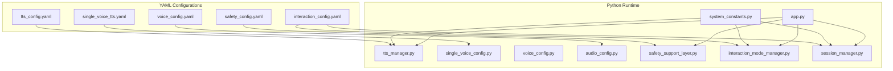
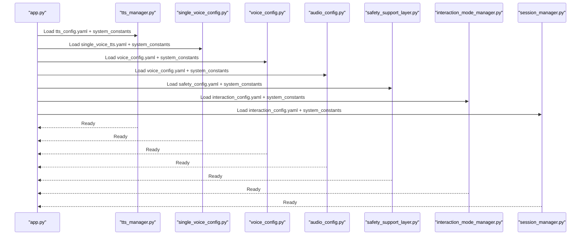
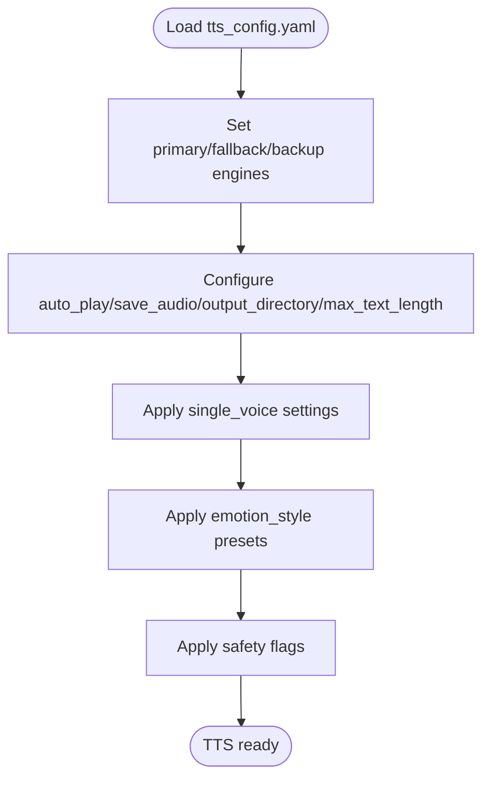
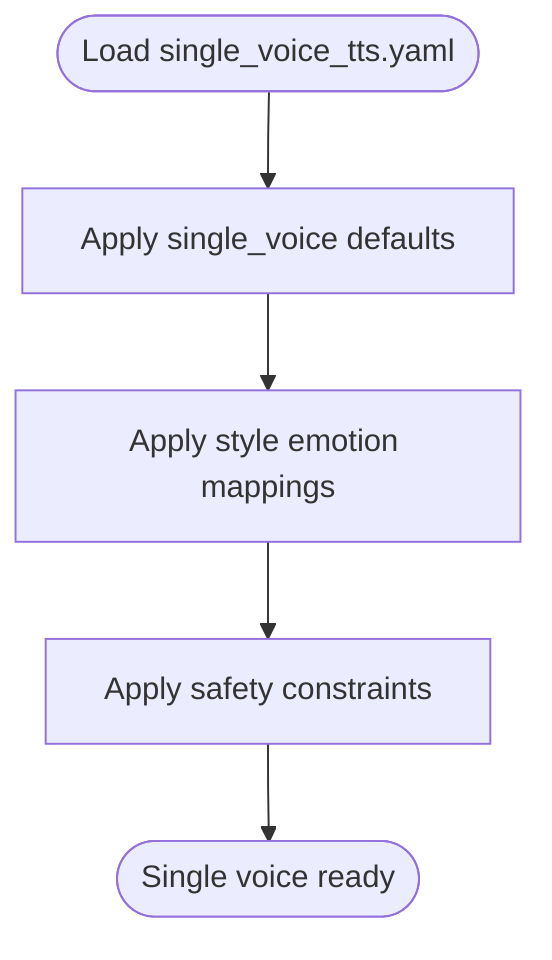
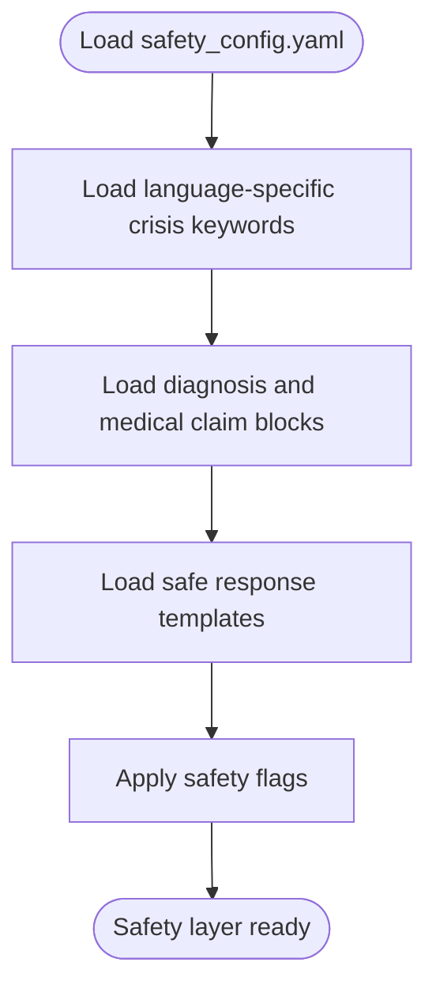
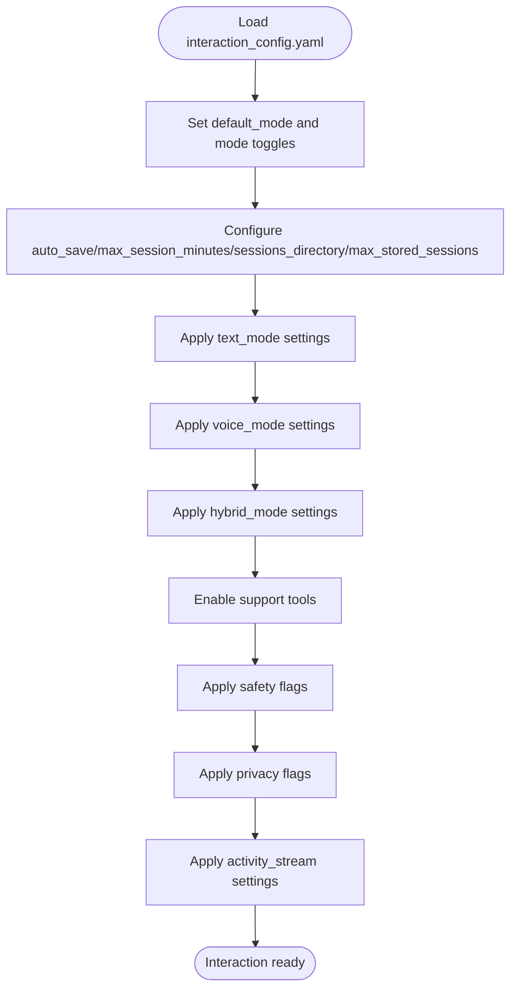
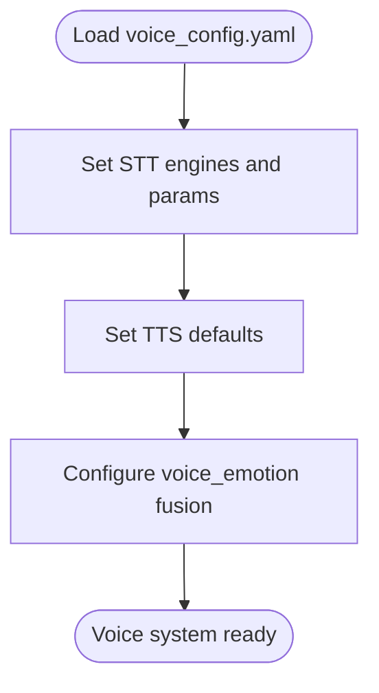
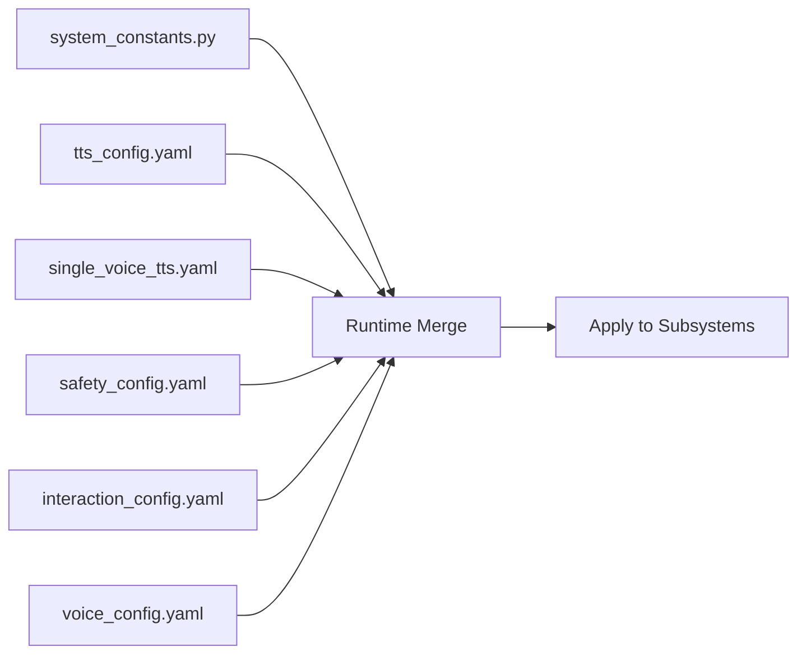
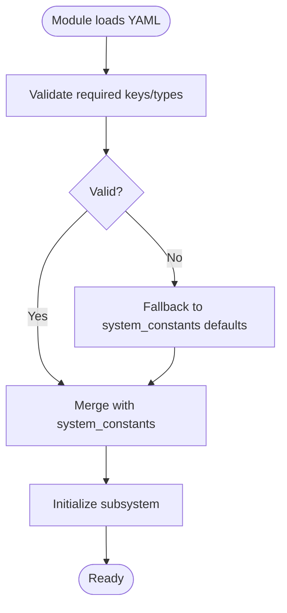
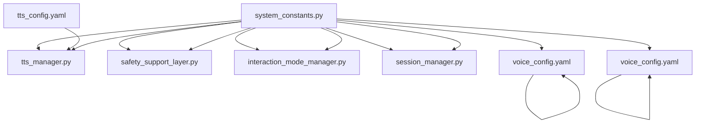

# Configuration Management

<cite>
**Referenced Files in This Document**
- [tts_config.yaml](file://psychologist/config/tts_config.yaml)
- [single_voice_tts.yaml](file://psychologist/config/single_voice_tts.yaml)
- [safety_config.yaml](file://psychologist/config/safety_config.yaml)
- [interaction_config.yaml](file://psychologist/config/interaction_config.yaml)
- [voice_config.yaml](file://psychologist/config/voice_config.yaml)
- [system_constants.py](file://psychologist/system_constants.py)
- [single_voice_config.py](file://psychologist/emotion_engine/voice_output/single_voice_config.py)
- [voice_config.py](file://psychologist/emotion_engine/voice_output/voice_config.py)
- [audio_config.py](file://psychologist/emotion_engine/voice_system/audio_config.py)
- [tts_manager.py](file://psychologist/emotion_engine/voice_output/tts_manager.py)
- [safety_support_layer.py](file://psychologist/emotion_engine/interaction/safety_support_layer.py)
- [interaction_mode_manager.py](file://psychologist/emotion_engine/interaction/interaction_mode_manager.py)
- [session_manager.py](file://psychologist/emotion_engine/interaction/session_manager.py)
- [app.py](file://psychologist/app.py)
</cite>

## Table of Contents
1. [Introduction](#introduction)
2. [Project Structure](#project-structure)
3. [Core Components](#core-components)
4. [Architecture Overview](#architecture-overview)
5. [Detailed Component Analysis](#detailed-component-analysis)
6. [Dependency Analysis](#dependency-analysis)
7. [Performance Considerations](#performance-considerations)
8. [Troubleshooting Guide](#troubleshooting-guide)
9. [Conclusion](#conclusion)
10. [Appendices](#appendices)

## Introduction
This document explains the Configuration Management system for the Psychological Companion. It covers the centralized configuration architecture using system constants and YAML configuration files, and documents TTS configuration options, safety parameters, interaction settings, voice system configuration, and single voice settings. It also details configuration structure, validation and application at runtime, hierarchy, defaults, overrides, safety thresholds, and practical customization and troubleshooting guidance.

## Project Structure
The configuration system is organized around:
- Centralized Python constants for numeric and global defaults
- YAML configuration files under psychologist/config/
- Python modules that load, merge, and apply configuration at runtime

**Diagram sources**
- [tts_config.yaml](file://psychologist/config/tts_config.yaml)
- [single_voice_tts.yaml](file://psychologist/config/single_voice_tts.yaml)
- [safety_config.yaml](file://psychologist/config/safety_config.yaml)
- [interaction_config.yaml](file://psychologist/config/interaction_config.yaml)
- [voice_config.yaml](file://psychologist/config/voice_config.yaml)
- [system_constants.py](file://psychologist/system_constants.py)
- [tts_manager.py](file://psychologist/emotion_engine/voice_output/tts_manager.py)
- [single_voice_config.py](file://psychologist/emotion_engine/voice_output/single_voice_config.py)
- [voice_config.py](file://psychologist/emotion_engine/voice_output/voice_config.py)
- [audio_config.py](file://psychologist/emotion_engine/voice_system/audio_config.py)
- [safety_support_layer.py](file://psychologist/emotion_engine/interaction/safety_support_layer.py)
- [interaction_mode_manager.py](file://psychologist/emotion_engine/interaction/interaction_mode_manager.py)
- [session_manager.py](file://psychologist/emotion_engine/interaction/session_manager.py)
- [app.py](file://psychologist/app.py)

**Section sources**
- [tts_config.yaml](file://psychologist/config/tts_config.yaml)
- [single_voice_tts.yaml](file://psychologist/config/single_voice_tts.yaml)
- [safety_config.yaml](file://psychologist/config/safety_config.yaml)
- [interaction_config.yaml](file://psychologist/config/interaction_config.yaml)
- [voice_config.yaml](file://psychologist/config/voice_config.yaml)
- [system_constants.py](file://psychologist/system_constants.py)
- [app.py](file://psychologist/app.py)

## Core Components
- Centralized system constants define numeric defaults and global limits used across modules.
- YAML configurations define feature flags, modes, engines, safety constraints, and interaction behavior.
- Runtime modules load and merge YAML with defaults, then apply settings to subsystems.

Key responsibilities:
- system_constants.py: Numeric defaults for emotion, context, session, and API limits.
- tts_config.yaml / single_voice_tts.yaml: TTS pipeline, engines, single-voice settings, and safety constraints.
- safety_config.yaml: Crisis keywords, block patterns, safe response templates, and safety flags.
- interaction_config.yaml: Interaction modes, session persistence, UI options, and safety toggles.
- voice_config.yaml: STT engines, privacy, voice emotion fusion weights, and defaults.

**Section sources**
- [system_constants.py](file://psychologist/system_constants.py)
- [tts_config.yaml](file://psychologist/config/tts_config.yaml)
- [single_voice_tts.yaml](file://psychologist/config/single_voice_tts.yaml)
- [safety_config.yaml](file://psychologist/config/safety_config.yaml)
- [interaction_config.yaml](file://psychologist/config/interaction_config.yaml)
- [voice_config.yaml](file://psychologist/config/voice_config.yaml)

## Architecture Overview
The configuration architecture follows a layered approach:
- Layer 1: YAML files define feature flags, modes, and safety constraints.
- Layer 2: Python modules load YAML and merge with system constants.
- Layer 3: Modules apply configuration to voice, safety, and interaction subsystems.
- Layer 4: Application entrypoint wires runtime configuration into services.

**Diagram sources**
- [app.py](file://psychologist/app.py)
- [tts_manager.py](file://psychologist/emotion_engine/voice_output/tts_manager.py)
- [single_voice_config.py](file://psychologist/emotion_engine/voice_output/single_voice_config.py)
- [voice_config.py](file://psychologist/emotion_engine/voice_output/voice_config.py)
- [audio_config.py](file://psychologist/emotion_engine/voice_system/audio_config.py)
- [safety_support_layer.py](file://psychologist/emotion_engine/interaction/safety_support_layer.py)
- [interaction_mode_manager.py](file://psychologist/emotion_engine/interaction/interaction_mode_manager.py)
- [session_manager.py](file://psychologist/emotion_engine/interaction/session_manager.py)

## Detailed Component Analysis

### TTS Configuration Options
- Pipeline and engines:
  - Primary, fallback, and backup TTS engines are configured.
  - Auto-play and save-audio flags control output behavior.
  - Output directory and max text length constrain resource usage.
- Single voice settings:
  - Voice ID, model path, JSON config path, language, and lock status.
  - Allow switching flag controls dynamic voice selection.
- Emotion styles:
  - Per-emotion speed/pitch/volume adjustments and optional pause scaling.
- Safety constraints:
  - Flags to restrict online TTS, cloning, and uploaded voice training.

**Diagram sources**
- [tts_config.yaml](file://psychologist/config/tts_config.yaml)

**Section sources**
- [tts_config.yaml](file://psychologist/config/tts_config.yaml)

### Single Voice Settings
- Purpose-built single-voice configuration mirrors TTS settings with a dedicated style section.
- Includes emotion-style mapping and pause scaling for expressive prosody.
- Safety flags enforce offline-only operation and disable risky capabilities.

**Diagram sources**
- [single_voice_tts.yaml](file://psychologist/config/single_voice_tts.yaml)

**Section sources**
- [single_voice_tts.yaml](file://psychologist/config/single_voice_tts.yaml)

### Safety Configuration System
- Crisis detection:
  - Language-specific keyword lists for self-harm, harm to others, abuse, panic, and medical emergencies.
- Diagnostic and medical claim blocks:
  - Patterns to prevent diagnostic statements and unrealistic healing claims.
- Safe response templates:
  - Pre-canned responses for crisis and non-crisis distress, plus professional help reminders and disclaimers.
- Safety flags:
  - Enforce offline-only operation and disable cloud TTS and cloning.

**Diagram sources**
- [safety_config.yaml](file://psychologist/config/safety_config.yaml)

**Section sources**
- [safety_config.yaml](file://psychologist/config/safety_config.yaml)

### Interaction Configuration
- Modes and preferences:
  - Default mode, text/voice/hybrid enablement, and auto-save sessions.
  - Session limits and storage directory.
- Text mode:
  - Long responses, emotion label visibility, and max response length.
- Voice mode:
  - Push-to-talk, continuous conversation, auto speak, listen-after-response, timeouts, and lengths.
- Hybrid mode:
  - Context preservation when switching modes.
- Safety and privacy:
  - Safety toggles for detection and reminders, plus privacy flags for offline-only and storage.
- Activity stream:
  - Enablement and max entry count.

**Diagram sources**
- [interaction_config.yaml](file://psychologist/config/interaction_config.yaml)

**Section sources**
- [interaction_config.yaml](file://psychologist/config/interaction_config.yaml)

### Voice System Configuration
- Speech recognition:
  - Continuous listening, default and fallback engines, language, sample rate, and raw audio saving.
- TTS defaults:
  - Default engine, fallback, and baseline speed/pitch/volume with output saving.
- Voice emotion:
  - Confidence threshold, fusion enablement, and fused weights for memory/text/voice signals.

**Diagram sources**
- [voice_config.yaml](file://psychologist/config/voice_config.yaml)

**Section sources**
- [voice_config.yaml](file://psychologist/config/voice_config.yaml)

### Configuration Hierarchy, Defaults, and Overrides
- Hierarchy:
  - YAML files define feature flags and behavior.
  - system_constants.py supplies numeric defaults and global limits.
  - Runtime modules merge YAML with defaults and apply to subsystems.
- Defaults:
  - Numeric caps for session length, input length, and response lengths are defined centrally.
  - Interaction and safety defaults are defined in YAML.
- Overrides:
  - Users can override YAML values per environment.
  - Runtime merges occur in each module prior to service initialization.

**Diagram sources**
- [system_constants.py](file://psychologist/system_constants.py)
- [tts_config.yaml](file://psychologist/config/tts_config.yaml)
- [single_voice_tts.yaml](file://psychologist/config/single_voice_tts.yaml)
- [safety_config.yaml](file://psychologist/config/safety_config.yaml)
- [interaction_config.yaml](file://psychologist/config/interaction_config.yaml)
- [voice_config.yaml](file://psychologist/config/voice_config.yaml)

**Section sources**
- [system_constants.py](file://psychologist/system_constants.py)
- [tts_config.yaml](file://psychologist/config/tts_config.yaml)
- [single_voice_tts.yaml](file://psychologist/config/single_voice_tts.yaml)
- [safety_config.yaml](file://psychologist/config/safety_config.yaml)
- [interaction_config.yaml](file://psychologist/config/interaction_config.yaml)
- [voice_config.yaml](file://psychologist/config/voice_config.yaml)

### Runtime Application and Validation
- Application:
  - Each module loads its YAML, merges with system constants, validates required keys, and initializes subsystems.
- Validation:
  - Presence checks for critical keys (engines, paths, language).
  - Type and range checks for numeric values (speed/pitch/volume, lengths).
- Error handling:
  - Graceful fallback to defaults when keys are missing.
  - Logging of invalid values and remediation suggestions.

[No sources needed since this diagram shows conceptual workflow, not actual code structure]

## Dependency Analysis
- Centralized constants are imported by runtime modules to ensure consistency.
- TTS manager depends on TTS YAML and system constants.
- Safety support layer depends on safety YAML and system constants.
- Interaction mode manager and session manager depend on interaction YAML and system constants.
- Voice system modules depend on voice YAML and system constants.

**Diagram sources**
- [system_constants.py](file://psychologist/system_constants.py)
- [tts_manager.py](file://psychologist/emotion_engine/voice_output/tts_manager.py)
- [safety_support_layer.py](file://psychologist/emotion_engine/interaction/safety_support_layer.py)
- [interaction_mode_manager.py](file://psychologist/emotion_engine/interaction/interaction_mode_manager.py)
- [session_manager.py](file://psychologist/emotion_engine/interaction/session_manager.py)
- [voice_config.py](file://psychologist/emotion_engine/voice_output/voice_config.py)
- [audio_config.py](file://psychologist/emotion_engine/voice_system/audio_config.py)
- [tts_config.yaml](file://psychologist/config/tts_config.yaml)
- [voice_config.yaml](file://psychologist/config/voice_config.yaml)

**Section sources**
- [system_constants.py](file://psychologist/system_constants.py)
- [tts_manager.py](file://psychologist/emotion_engine/voice_output/tts_manager.py)
- [safety_support_layer.py](file://psychologist/emotion_engine/interaction/safety_support_layer.py)
- [interaction_mode_manager.py](file://psychologist/emotion_engine/interaction/interaction_mode_manager.py)
- [session_manager.py](file://psychologist/emotion_engine/interaction/session_manager.py)
- [voice_config.py](file://psychologist/emotion_engine/voice_output/voice_config.py)
- [audio_config.py](file://psychologist/emotion_engine/voice_system/audio_config.py)
- [tts_config.yaml](file://psychologist/config/tts_config.yaml)
- [voice_config.yaml](file://psychologist/config/voice_config.yaml)

## Performance Considerations
- Keep max text length and response lengths aligned with system constants to avoid memory pressure.
- Prefer single-voice mode for deterministic latency and reduced switching overhead.
- Disable auto-play and save_audio in constrained environments to reduce I/O.
- Limit session storage and activity log sizes to maintain responsiveness.

[No sources needed since this section provides general guidance]

## Troubleshooting Guide
Common issues and resolutions:
- Missing or invalid engine paths:
  - Verify engine names and model paths in TTS YAML.
  - Confirm file existence and permissions.
- Excessive audio generation:
  - Reduce max_text_length or disable save_audio.
- Voice mode timeouts:
  - Adjust silence timeout and auto-listen settings in voice mode.
- Safety false positives:
  - Narrow keyword lists or adjust confidence thresholds in voice emotion settings.
- Session storage growth:
  - Lower max_stored_sessions and prune old sessions.

**Section sources**
- [tts_config.yaml](file://psychologist/config/tts_config.yaml)
- [interaction_config.yaml](file://psychologist/config/interaction_config.yaml)
- [voice_config.yaml](file://psychologist/config/voice_config.yaml)

## Conclusion
The Configuration Management system combines centralized Python constants with modular YAML files to deliver a robust, maintainable, and secure setup. By merging defaults with environment-specific YAML and applying strict validation, the system ensures predictable behavior across TTS, safety, and interaction domains while preserving offline-first and privacy-focused principles.

[No sources needed since this section summarizes without analyzing specific files]

## Appendices

### Best Practices for Configuration Management
- Keep environment-specific overrides minimal and documented.
- Use system constants for numeric limits and global defaults.
- Validate YAML against a schema or explicit checks in runtime modules.
- Version control configuration files and review changes during audits.
- Separate concerns: keep safety-sensitive settings in dedicated YAML.

[No sources needed since this section provides general guidance]

### Security Considerations
- Enforce offline-only operation via safety flags.
- Disable cloud TTS and voice cloning to prevent misuse.
- Restrict voice switching and uploading in sensitive deployments.
- Store transcripts and audio only when necessary and securely.

**Section sources**
- [safety_config.yaml](file://psychologist/config/safety_config.yaml)
- [tts_config.yaml](file://psychologist/config/tts_config.yaml)
- [single_voice_tts.yaml](file://psychologist/config/single_voice_tts.yaml)
- [voice_config.yaml](file://psychologist/config/voice_config.yaml)