# Behavior Prediction System

<cite>
**Referenced Files in This Document**
- [behavior_predictor.py](file://psychologist/emotion_engine/behavior_predictor/behavior_predictor.py)
- [personality_engine.py](file://psychologist/emotion_engine/personality_engine/personality_engine.py)
- [context_engine.py](file://psychologist/emotion_engine/context_engine/context_engine.py)
- [emotional_memory.py](file://psychologist/emotion_engine/emotional_memory/emotional_memory.py)
- [models.py](file://psychologist/emotion_engine/models.py)
- [sentiment_analyzer.py](file://psychologist/emotion_engine/sentiment_analysis/sentiment_analyzer.py)
- [bayesian_network.py](file://psychologist/emotion_engine/bayesian_engine/bayesian_network.py)
- [fuzzy_engine.py](file://psychologist/emotion_engine/fuzzy_logic/fuzzy_engine.py)
- [text_mode_handler.py](file://psychologist/emotion_engine/interaction/text_mode_handler.py)
- [session_manager.py](file://psychologist/emotion_engine/interaction/session_manager.py)
- [safety_support_layer.py](file://psychologist/emotion_engine/interaction/safety_support_layer.py)
- [system_constants.py](file://psychologist/system_constants.py)
- [safety_config.yaml](file://psychologist/config/safety_config.yaml)
</cite>

## Table of Contents
1. [Introduction](#introduction)
2. [Project Structure](#project-structure)
3. [Core Components](#core-components)
4. [Architecture Overview](#architecture-overview)
5. [Detailed Component Analysis](#detailed-component-analysis)
6. [Dependency Analysis](#dependency-analysis)
7. [Performance Considerations](#performance-considerations)
8. [Troubleshooting Guide](#troubleshooting-guide)
9. [Conclusion](#conclusion)
10. [Appendices](#appendices)

## Introduction
This document describes the Behavior Prediction System that forecasts user behavioral patterns grounded in emotional state, personality traits, and interaction history. It explains the prediction models, confidence scoring, pattern recognition mechanisms, and how predictions inform proactive emotional support strategies. It also documents integration points with safety monitoring systems and presents example prediction workflows and behavioral pattern analysis.

## Project Structure
The Behavior Prediction System spans several subsystems:
- Behavior predictor: computes escalation risk, recovery likelihood, next emotion probabilities, engagement, and motivation.
- Personality engine: models personality traits and influences emotional states.
- Context engine: tracks conversation context, sentiment trends, topics, and repeated patterns.
- Emotional memory: maintains short-term and long-term memory of emotional experiences and extracts patterns.
- Sentiment analyzer: performs keyword-based sentiment analysis.
- Bayesian engine: updates emotion probabilities using conditional probability tables.
- Fuzzy logic engine: fuzzifies intensities and traits, applies rules, and defuzzifies outputs.
- Interaction pipeline: orchestrates text-mode processing, safety checks, and session persistence.
- Safety support layer: detects crisis signals and provides safe response templates.
- System constants and configuration: define limits, weights, and safety keyword sets.

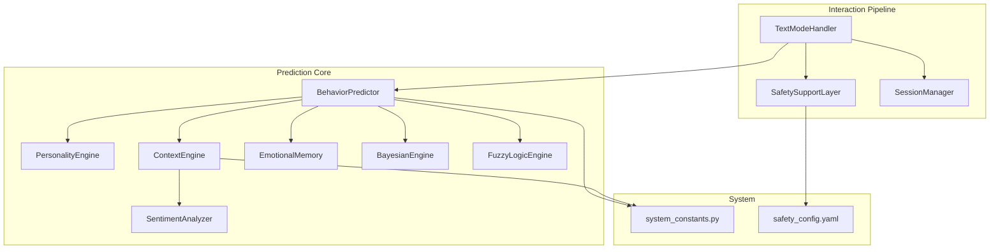

**Diagram sources**
- [behavior_predictor.py:1-133](file://psychologist/emotion_engine/behavior_predictor/behavior_predictor.py#L1-L133)
- [personality_engine.py:1-68](file://psychologist/emotion_engine/personality_engine/personality_engine.py#L1-L68)
- [context_engine.py:1-117](file://psychologist/emotion_engine/context_engine/context_engine.py#L1-L117)
- [emotional_memory.py:1-103](file://psychologist/emotion_engine/emotional_memory/emotional_memory.py#L1-L103)
- [sentiment_analyzer.py:1-103](file://psychologist/emotion_engine/sentiment_analysis/sentiment_analyzer.py#L1-L103)
- [bayesian_network.py:1-105](file://psychologist/emotion_engine/bayesian_engine/bayesian_network.py#L1-L105)
- [fuzzy_engine.py:1-81](file://psychologist/emotion_engine/fuzzy_logic/fuzzy_engine.py#L1-L81)
- [text_mode_handler.py:1-170](file://psychologist/emotion_engine/interaction/text_mode_handler.py#L1-L170)
- [session_manager.py:1-303](file://psychologist/emotion_engine/interaction/session_manager.py#L1-L303)
- [safety_support_layer.py:1-286](file://psychologist/emotion_engine/interaction/safety_support_layer.py#L1-L286)
- [system_constants.py:1-103](file://psychologist/system_constants.py#L1-L103)
- [safety_config.yaml:1-116](file://psychologist/config/safety_config.yaml#L1-L116)

**Section sources**
- [behavior_predictor.py:1-133](file://psychologist/emotion_engine/behavior_predictor/behavior_predictor.py#L1-L133)
- [personality_engine.py:1-68](file://psychologist/emotion_engine/personality_engine/personality_engine.py#L1-L68)
- [context_engine.py:1-117](file://psychologist/emotion_engine/context_engine/context_engine.py#L1-L117)
- [emotional_memory.py:1-103](file://psychologist/emotion_engine/emotional_memory/emotional_memory.py#L1-L103)
- [sentiment_analyzer.py:1-103](file://psychologist/emotion_engine/sentiment_analysis/sentiment_analyzer.py#L1-L103)
- [bayesian_network.py:1-105](file://psychologist/emotion_engine/bayesian_engine/bayesian_network.py#L1-L105)
- [fuzzy_engine.py:1-81](file://psychologist/emotion_engine/fuzzy_logic/fuzzy_engine.py#L1-L81)
- [text_mode_handler.py:1-170](file://psychologist/emotion_engine/interaction/text_mode_handler.py#L1-L170)
- [session_manager.py:1-303](file://psychologist/emotion_engine/interaction/session_manager.py#L1-L303)
- [safety_support_layer.py:1-286](file://psychologist/emotion_engine/interaction/safety_support_layer.py#L1-L286)
- [system_constants.py:1-103](file://psychologist/system_constants.py#L1-L103)
- [safety_config.yaml:1-116](file://psychologist/config/safety_config.yaml#L1-L116)

## Core Components
- BehaviorPredictor: central prediction module computing escalation risk, recovery likelihood, next emotion probabilities, engagement, and motivation.
- PersonalityEngine: trait-based influence model affecting emotional states.
- ContextEngine: builds conversation context from text, sentiment, topics, and repeated patterns.
- EmotionalMemory: manages short-term and long-term memory, emotional patterns, and preference storage.
- SentimentAnalyzer: keyword-based sentiment scoring and emotion keyword detection.
- BayesianEngine: updates emotion probabilities using predefined conditional probability tables.
- FuzzyLogicEngine: fuzzification and defuzzification for continuous-valued outputs.
- TextModeHandler: orchestrates the end-to-end text interaction pipeline with safety checks and session updates.
- SafetySupportLayer: keyword-based crisis detection and safe response templates.
- SessionManager: persists sessions, summarizes outcomes, and suggests follow-ups.
- system_constants and safety_config: global configuration and safety keyword sets.

**Section sources**
- [behavior_predictor.py:7-133](file://psychologist/emotion_engine/behavior_predictor/behavior_predictor.py#L7-L133)
- [personality_engine.py:6-68](file://psychologist/emotion_engine/personality_engine/personality_engine.py#L6-L68)
- [context_engine.py:9-117](file://psychologist/emotion_engine/context_engine/context_engine.py#L9-L117)
- [emotional_memory.py:8-103](file://psychologist/emotion_engine/emotional_memory/emotional_memory.py#L8-L103)
- [sentiment_analyzer.py:5-103](file://psychologist/emotion_engine/sentiment_analysis/sentiment_analyzer.py#L5-L103)
- [bayesian_network.py:5-105](file://psychologist/emotion_engine/bayesian_engine/bayesian_network.py#L5-L105)
- [fuzzy_engine.py:4-81](file://psychologist/emotion_engine/fuzzy_logic/fuzzy_engine.py#L4-L81)
- [text_mode_handler.py:23-170](file://psychologist/emotion_engine/interaction/text_mode_handler.py#L23-L170)
- [safety_support_layer.py:24-286](file://psychologist/emotion_engine/interaction/safety_support_layer.py#L24-L286)
- [session_manager.py:26-303](file://psychologist/emotion_engine/interaction/session_manager.py#L26-L303)
- [system_constants.py:1-103](file://psychologist/system_constants.py#L1-L103)
- [safety_config.yaml:1-116](file://psychologist/config/safety_config.yaml#L1-L116)

## Architecture Overview
The Behavior Prediction System integrates perception, reasoning, and action:
- Perception: Text input is normalized, safety assessed, and emotional state inferred.
- Reasoning: BehaviorPredictor combines personality, context, and memory to produce predictions.
- Action: Predictions inform proactive support strategies and safety escalations.

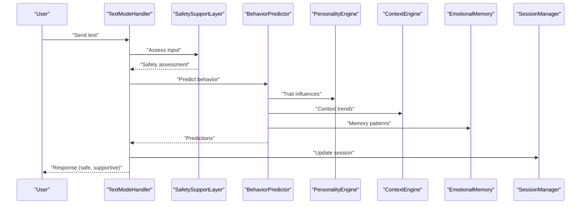

**Diagram sources**
- [text_mode_handler.py:52-158](file://psychologist/emotion_engine/interaction/text_mode_handler.py#L52-L158)
- [safety_support_layer.py:80-135](file://psychologist/emotion_engine/interaction/safety_support_layer.py#L80-L135)
- [behavior_predictor.py:125-132](file://psychologist/emotion_engine/behavior_predictor/behavior_predictor.py#L125-L132)
- [personality_engine.py:40-54](file://psychologist/emotion_engine/personality_engine/personality_engine.py#L40-L54)
- [context_engine.py:24-46](file://psychologist/emotion_engine/context_engine/context_engine.py#L24-L46)
- [emotional_memory.py:38-84](file://psychologist/emotion_engine/emotional_memory/emotional_memory.py#L38-L84)
- [session_manager.py:102-147](file://psychologist/emotion_engine/interaction/session_manager.py#L102-L147)

## Detailed Component Analysis

### BehaviorPredictor
BehaviorPredictor encapsulates five prediction capabilities:
- Escalation risk: Computes risk scores across anger, fear, sadness, stress based on recent trends and maps to a recommended action threshold.
- Recovery likelihood: Scores recovery potential using resilience, social support, and current intensity factors, estimating timeframes.
- Next emotion probabilities: Transitions from the dominant emotion and sentiment-driven adjustments yield top candidates.
- Engagement level: Combines average intensity and sentiment trend to estimate engagement.
- Motivation level: Aggregates hope/confidence with personality optimism and confidence.

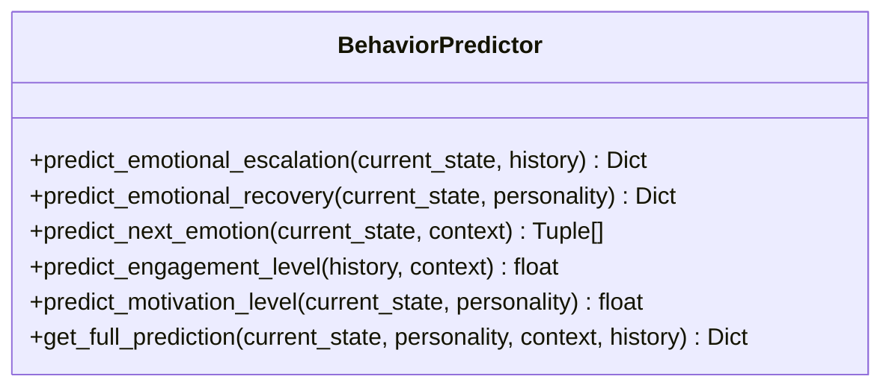

**Diagram sources**
- [behavior_predictor.py:7-133](file://psychologist/emotion_engine/behavior_predictor/behavior_predictor.py#L7-L133)

**Section sources**
- [behavior_predictor.py:16-132](file://psychologist/emotion_engine/behavior_predictor/behavior_predictor.py#L16-L132)

### PersonalityEngine
PersonalityEngine models personality via a set of traits and computes influence multipliers for each emotion type. It can transform an emotional state by applying trait-based scaling and summarize personality characteristics.

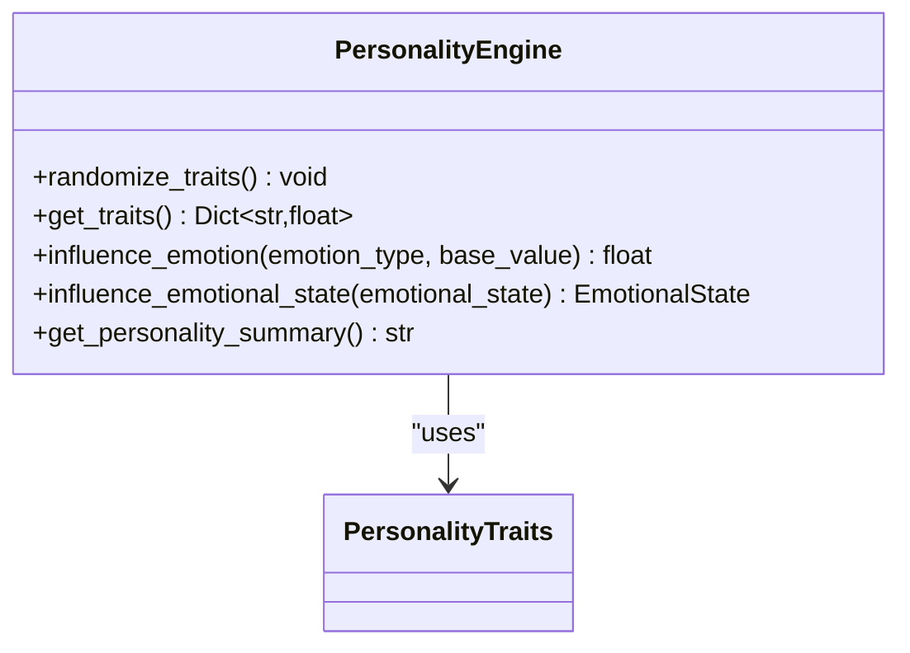

**Diagram sources**
- [personality_engine.py:6-68](file://psychologist/emotion_engine/personality_engine/personality_engine.py#L6-L68)
- [models.py:79-110](file://psychologist/emotion_engine/models.py#L79-L110)

**Section sources**
- [personality_engine.py:23-54](file://psychologist/emotion_engine/personality_engine/personality_engine.py#L23-L54)

### ContextEngine
ContextEngine builds a ConversationContext from incoming text, including sentiment, intensity trends, dominant topic, keywords, conflict level, motivation opportunity, and repeated patterns. It leverages a SentimentAnalyzer and respects configurable limits.

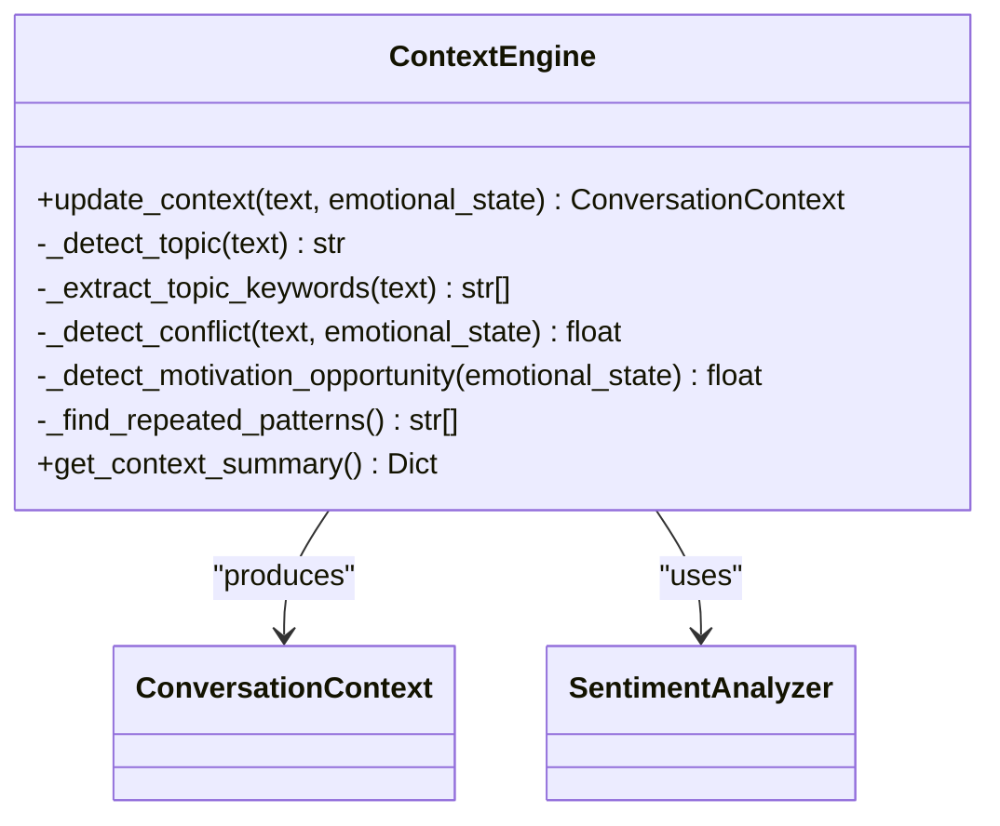

**Diagram sources**
- [context_engine.py:9-117](file://psychologist/emotion_engine/context_engine/context_engine.py#L9-L117)
- [models.py:133-143](file://psychologist/emotion_engine/models.py#L133-L143)
- [sentiment_analyzer.py:5-103](file://psychologist/emotion_engine/sentiment_analysis/sentiment_analyzer.py#L5-L103)

**Section sources**
- [context_engine.py:24-116](file://psychologist/emotion_engine/context_engine/context_engine.py#L24-L116)

### EmotionalMemory
EmotionalMemory maintains short-term and long-term memory entries, transfers oldest entries when capacity is exceeded, updates emotional patterns, and supports preference storage. It can influence current emotional states by blending with historical averages.

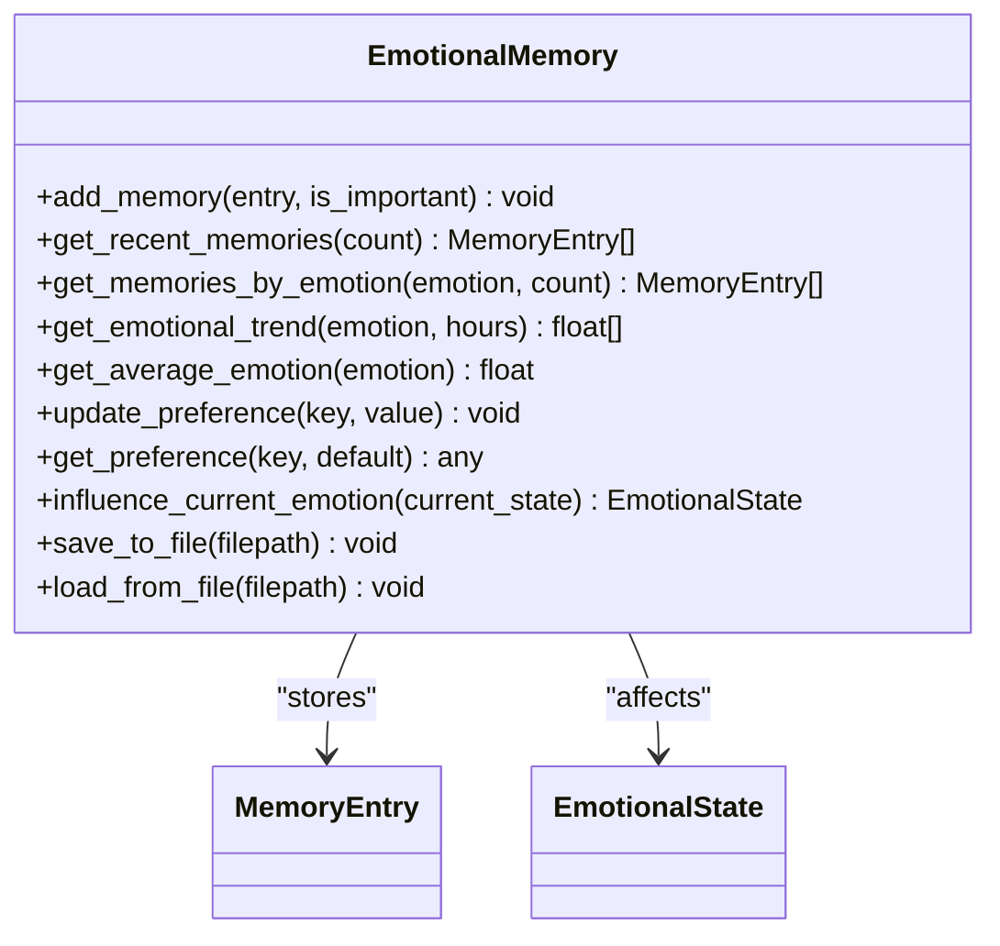

**Diagram sources**
- [emotional_memory.py:8-103](file://psychologist/emotion_engine/emotional_memory/emotional_memory.py#L8-L103)
- [models.py:113-131](file://psychologist/emotion_engine/models.py#L113-L131)

**Section sources**
- [emotional_memory.py:17-84](file://psychologist/emotion_engine/emotional_memory/emotional_memory.py#L17-L84)

### SentimentAnalyzer
SentimentAnalyzer tokenizes text, computes sentiment and intensity scores, and detects emotion keywords using predefined lexicons and modifiers.

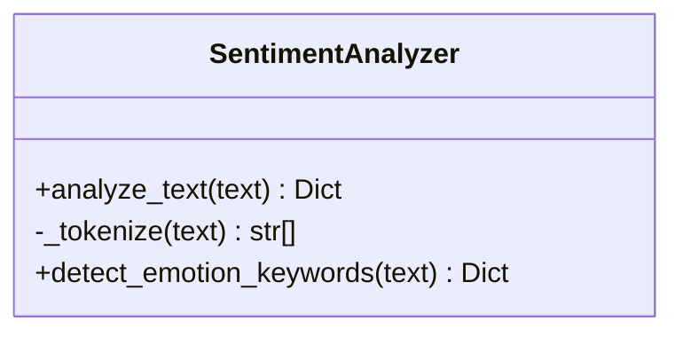

**Diagram sources**
- [sentiment_analyzer.py:5-103](file://psychologist/emotion_engine/sentiment_analysis/sentiment_analyzer.py#L5-L103)

**Section sources**
- [sentiment_analyzer.py:31-102](file://psychologist/emotion_engine/sentiment_analysis/sentiment_analyzer.py#L31-L102)

### BayesianEngine
BayesianEngine maintains prior probabilities and conditional probability tables for selected emotion pairs. It computes posteriors and updates emotion probabilities by combining evidence with priors.

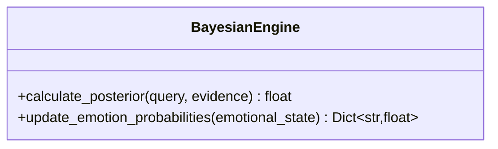

**Diagram sources**
- [bayesian_network.py:5-105](file://psychologist/emotion_engine/bayesian_engine/bayesian_network.py#L5-L105)

**Section sources**
- [bayesian_network.py:54-101](file://psychologist/emotion_engine/bayesian_engine/bayesian_network.py#L54-L101)

### FuzzyLogicEngine
FuzzyLogicEngine fuzzifies emotion intensities and personality traits using triangular and trapezoidal membership functions, applies rules, and defuzzifies to crisp outputs.

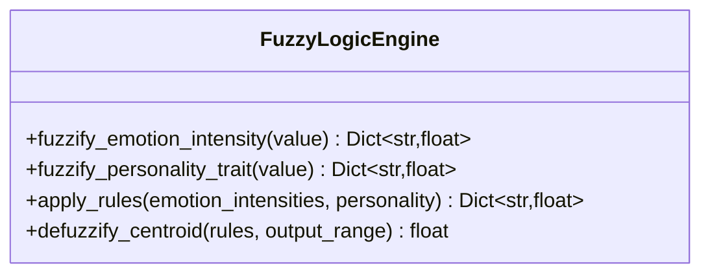

**Diagram sources**
- [fuzzy_engine.py:4-81](file://psychologist/emotion_engine/fuzzy_logic/fuzzy_engine.py#L4-L81)

**Section sources**
- [fuzzy_engine.py:28-80](file://psychologist/emotion_engine/fuzzy_logic/fuzzy_engine.py#L28-L80)

### TextModeHandler
TextModeHandler orchestrates the text interaction pipeline: normalization, safety assessment, emotion processing, response generation, optional TTS, and session updates.

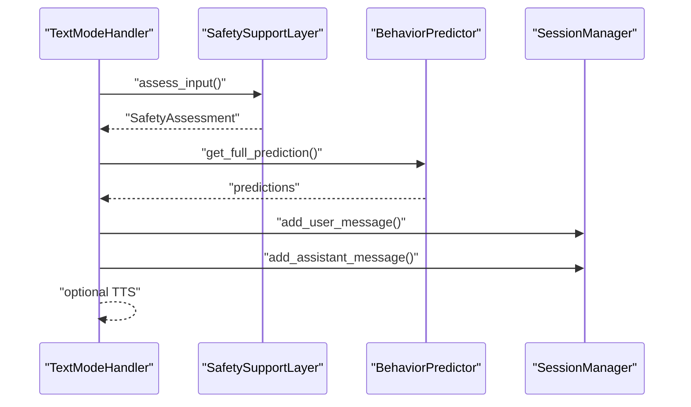

**Diagram sources**
- [text_mode_handler.py:52-158](file://psychologist/emotion_engine/interaction/text_mode_handler.py#L52-L158)
- [safety_support_layer.py:80-135](file://psychologist/emotion_engine/interaction/safety_support_layer.py#L80-L135)
- [behavior_predictor.py:125-132](file://psychologist/emotion_engine/behavior_predictor/behavior_predictor.py#L125-L132)
- [session_manager.py:102-147](file://psychologist/emotion_engine/interaction/session_manager.py#L102-L147)

**Section sources**
- [text_mode_handler.py:52-158](file://psychologist/emotion_engine/interaction/text_mode_handler.py#L52-L158)

### SafetySupportLayer
SafetySupportLayer detects crisis and moderate distress signals using keyword lists, selects appropriate safe response templates, and filters generated responses to avoid diagnostic statements.

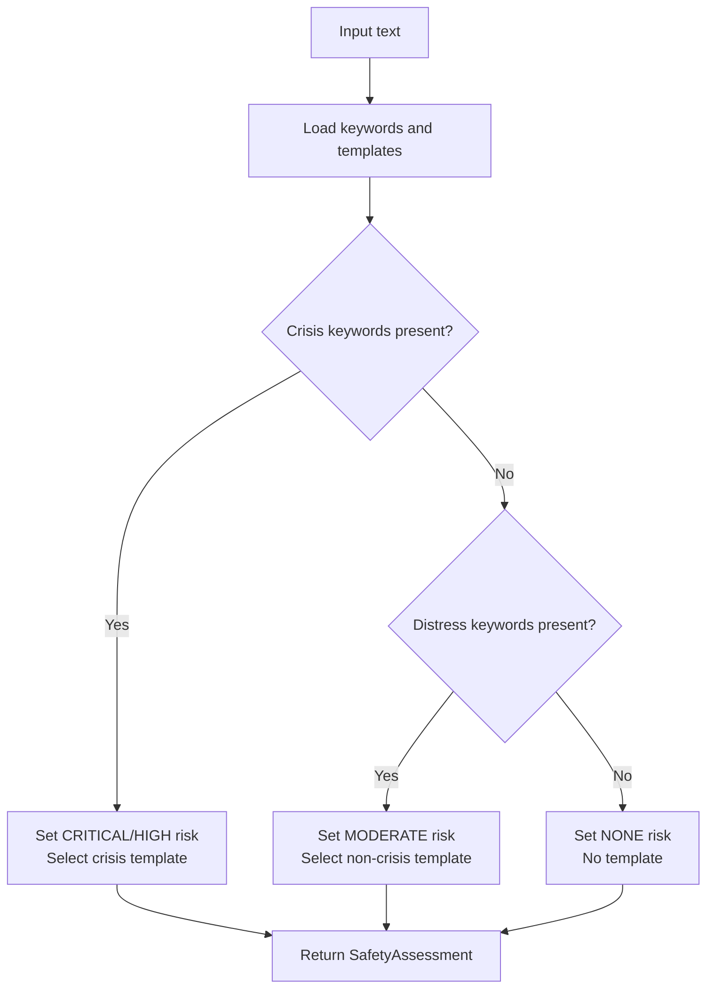

**Diagram sources**
- [safety_support_layer.py:80-135](file://psychologist/emotion_engine/interaction/safety_support_layer.py#L80-L135)
- [safety_config.yaml:5-116](file://psychologist/config/safety_config.yaml#L5-L116)

**Section sources**
- [safety_support_layer.py:167-227](file://psychologist/emotion_engine/interaction/safety_support_layer.py#L167-L227)
- [safety_config.yaml:5-116](file://psychologist/config/safety_config.yaml#L5-L116)

### SessionManager
SessionManager manages session lifecycle, records user and assistant messages, tracks detected emotions and mood timeline, and generates summaries and follow-up suggestions.

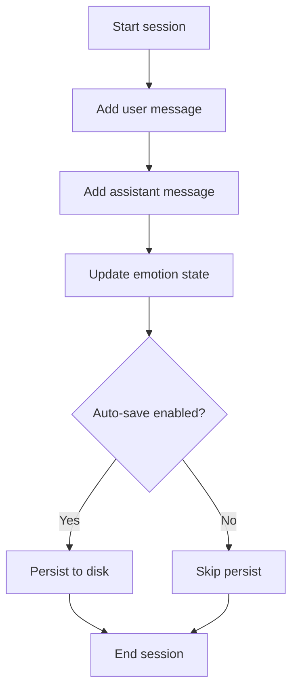

**Diagram sources**
- [session_manager.py:59-147](file://psychologist/emotion_engine/interaction/session_manager.py#L59-L147)

**Section sources**
- [session_manager.py:76-92](file://psychologist/emotion_engine/interaction/session_manager.py#L76-L92)

## Dependency Analysis
- BehaviorPredictor depends on models (EmotionalState, PersonalityTraits, ConversationContext), EmotionalMemory for historical context, and system constants for limits.
- ContextEngine depends on SentimentAnalyzer and system constants for history/trend limits.
- PersonalityEngine depends on models for PersonalityTraits and influences emotional states.
- TextModeHandler composes SafetySupportLayer, BehaviorPredictor, and SessionManager.
- SafetySupportLayer depends on safety_config.yaml for keyword and template sets.

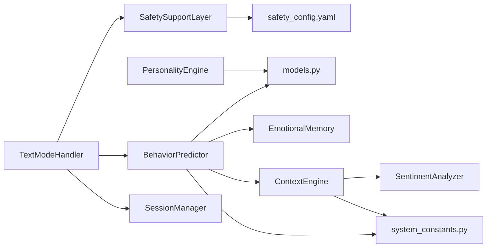

**Diagram sources**
- [behavior_predictor.py:1-5](file://psychologist/emotion_engine/behavior_predictor/behavior_predictor.py#L1-L5)
- [context_engine.py:1-6](file://psychologist/emotion_engine/context_engine/context_engine.py#L1-L6)
- [personality_engine.py:1-3](file://psychologist/emotion_engine/personality_engine/personality_engine.py#L1-L3)
- [text_mode_handler.py:12-39](file://psychologist/emotion_engine/interaction/text_mode_handler.py#L12-L39)
- [safety_support_layer.py:36-48](file://psychologist/emotion_engine/interaction/safety_support_layer.py#L36-L48)
- [system_constants.py:1-103](file://psychologist/system_constants.py#L1-L103)
- [safety_config.yaml:1-116](file://psychologist/config/safety_config.yaml#L1-L116)

**Section sources**
- [behavior_predictor.py:1-5](file://psychologist/emotion_engine/behavior_predictor/behavior_predictor.py#L1-L5)
- [context_engine.py:1-6](file://psychologist/emotion_engine/context_engine/context_engine.py#L1-L6)
- [personality_engine.py:1-3](file://psychologist/emotion_engine/personality_engine/personality_engine.py#L1-L3)
- [text_mode_handler.py:12-39](file://psychologist/emotion_engine/interaction/text_mode_handler.py#L12-L39)
- [safety_support_layer.py:36-48](file://psychologist/emotion_engine/interaction/safety_support_layer.py#L36-L48)
- [system_constants.py:1-103](file://psychologist/system_constants.py#L1-L103)
- [safety_config.yaml:1-116](file://psychologist/config/safety_config.yaml#L1-L116)

## Performance Considerations
- Complexity:
  - BehaviorPredictor computations are linear in the number of recent states and constant-time per emotion dimension.
  - ContextEngine operations scale with conversation history length and keyword matching cost.
  - Memory operations are O(n) for pattern updates and trend extraction.
- Tuning:
  - Adjust system constants for history limits and blending weights to balance responsiveness and stability.
  - Use thresholds for escalation/action recommendations carefully to minimize false positives/negatives.
- I/O:
  - Persist sessions and memory periodically to reduce startup costs and maintain continuity.

[No sources needed since this section provides general guidance]

## Troubleshooting Guide
- Safety detection:
  - Verify safety_config.yaml contains expected keywords and templates for the active language.
  - Ensure assess_input returns appropriate risk levels and templates.
- Prediction accuracy:
  - Confirm personality trait initialization and influence multipliers align with intended behavior.
  - Validate context trends and repeated patterns reflect recent interactions.
- Session persistence:
  - Check session directory permissions and cleanup policies.
  - Review summary generation logic for missing or misclassified emotions.

**Section sources**
- [safety_support_layer.py:61-77](file://psychologist/emotion_engine/interaction/safety_support_layer.py#L61-L77)
- [safety_config.yaml:5-116](file://psychologist/config/safety_config.yaml#L5-L116)
- [session_manager.py:279-303](file://psychologist/emotion_engine/interaction/session_manager.py#L279-L303)

## Conclusion
The Behavior Prediction System integrates perceptual, memory, and reasoning components to anticipate behavioral patterns and inform proactive emotional support. By combining personality-influenced predictions, contextual sentiment trends, and learned emotional patterns, it enables timely interventions and safe response strategies. The system’s modular design facilitates extension and tuning for diverse user needs.

[No sources needed since this section summarizes without analyzing specific files]

## Appendices

### Prediction Workflows
- Escalation prediction:
  - Input: current EmotionalState and recent history.
  - Compute per-emotion trends over the last three states.
  - Aggregate risk score and map to timeframe and recommended action.
- Recovery prediction:
  - Combine resilience, social support, and current intensity.
  - Estimate recovery timeframe based on composite score.
- Next emotion prediction:
  - Start from dominant emotion and apply transition probabilities.
  - Adjust by sentiment directionality.
- Engagement and motivation:
  - Engagement: weighted combination of average intensity and sentiment trend.
  - Motivation: secondary emotions plus personality optimism/confidence.

**Section sources**
- [behavior_predictor.py:16-123](file://psychologist/emotion_engine/behavior_predictor/behavior_predictor.py#L16-L123)

### Behavioral Pattern Analysis
- Repeated patterns:
  - Extract frequently occurring words from conversation history to identify recurring themes.
- Topic detection:
  - Score topics by keyword matches and select the highest-scoring category.
- Conflict and motivation opportunities:
  - Quantify presence of anger/disgust, negative sentiment, and hope/curiosity/motivation indicators.

**Section sources**
- [context_engine.py:48-106](file://psychologist/emotion_engine/context_engine/context_engine.py#L48-L106)

### Integration with Safety Monitoring
- SafetySupportLayer:
  - Detects crisis and moderate distress using keyword lists.
  - Selects safe response templates and filters diagnostic statements.
- TextModeHandler:
  - Enforces safety checks before generating responses.
  - Updates session with safety flags and emotion snapshots.

**Section sources**
- [safety_support_layer.py:80-135](file://psychologist/emotion_engine/interaction/safety_support_layer.py#L80-L135)
- [text_mode_handler.py:71-112](file://psychologist/emotion_engine/interaction/text_mode_handler.py#L71-L112)