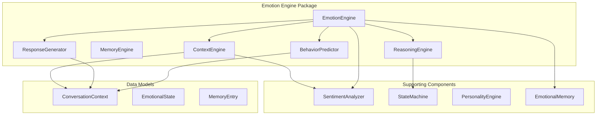
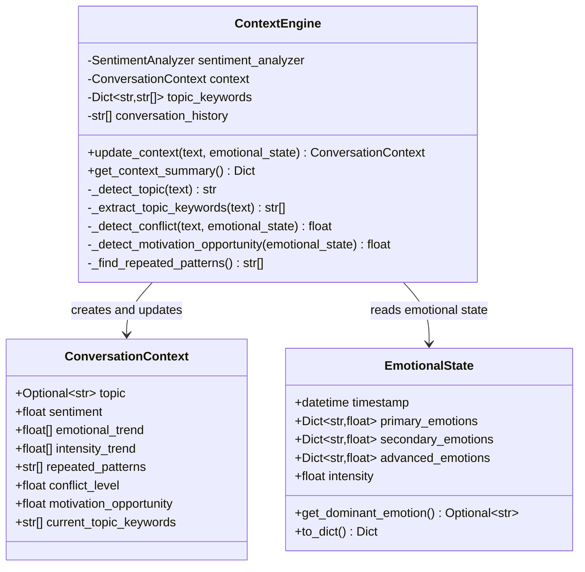
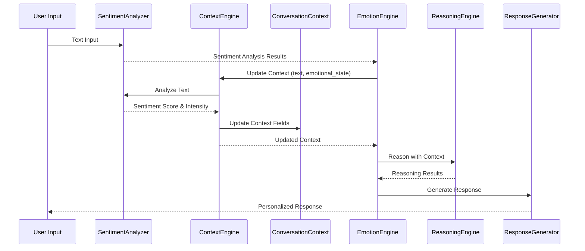
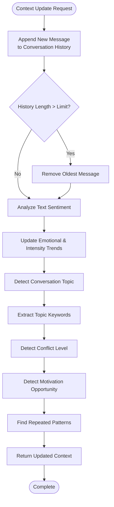
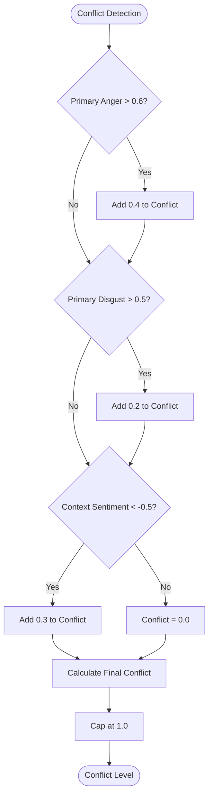
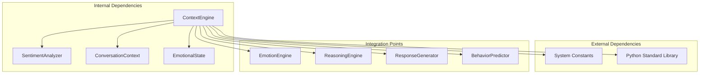

# Context Processing Engine

<cite>
**Referenced Files in This Document**
- [context_engine.py](file://psychologist/emotion_engine/context_engine/context_engine.py)
- [emotion_engine.py](file://psychologist/emotion_engine/emotion_engine.py)
- [models.py](file://psychologist/emotion_engine/models.py)
- [sentiment_analyzer.py](file://psychologist/emotion_engine/sentiment_analysis/sentiment_analyzer.py)
- [system_constants.py](file://psychologist/system_constants.py)
- [reasoning_engine.py](file://psychologist/emotion_engine/reasoning_engine/reasoning_engine.py)
- [response_generator.py](file://psychologist/emotion_engine/response_generator/response_generator.py)
- [behavior_predictor.py](file://psychologist/emotion_engine/behavior_predictor/behavior_predictor.py)
</cite>

## Table of Contents
1. [Introduction](#introduction)
2. [Project Structure](#project-structure)
3. [Core Components](#core-components)
4. [Architecture Overview](#architecture-overview)
5. [Detailed Component Analysis](#detailed-component-analysis)
6. [Dependency Analysis](#dependency-analysis)
7. [Performance Considerations](#performance-considerations)
8. [Troubleshooting Guide](#troubleshooting-guide)
9. [Conclusion](#conclusion)

## Introduction

The Context Processing Engine is a sophisticated component within the Psychologist AI system that manages conversational context tracking, emotional state interpretation, and response generation. This engine serves as the bridge between raw conversation data and intelligent emotional responses, maintaining a comprehensive understanding of the therapeutic conversation's evolving dynamics.

The engine operates by continuously monitoring conversation history, analyzing sentiment patterns, detecting topics and recurring themes, and identifying emotional conflicts and motivation opportunities. It transforms unstructured conversation data into structured context that informs all downstream emotional processing decisions.

## Project Structure

The Context Processing Engine is organized within the emotion_engine package, alongside related components that form the complete emotional intelligence system:

**Diagram sources**
- [context_engine.py:1-117](file://psychologist/emotion_engine/context_engine/context_engine.py#L1-L117)
- [emotion_engine.py:1-184](file://psychologist/emotion_engine/emotion_engine.py#L1-L184)

**Section sources**
- [context_engine.py:1-117](file://psychologist/emotion_engine/context_engine/context_engine.py#L1-L117)
- [emotion_engine.py:1-184](file://psychologist/emotion_engine/emotion_engine.py#L1-L184)

## Core Components

The Context Processing Engine consists of several interconnected components that work together to maintain and utilize conversational context:

### ConversationContext Data Structure

The `ConversationContext` class serves as the central data container that maintains all context-related information:

**Diagram sources**
- [models.py:133-143](file://psychologist/emotion_engine/models.py#L133-L143)
- [context_engine.py:9-117](file://psychologist/emotion_engine/context_engine/context_engine.py#L9-L117)

### Topic Detection System

The engine employs a keyword-based topic detection mechanism that categorizes conversations into predefined domains:

| Topic Category | Keywords |
|---|---|
| Work | work, job, career, office, boss, colleague, project, deadline |
| Family | family, parent, mother, father, child, spouse, partner, relative |
| Health | health, doctor, sick, ill, exercise, diet, medicine, hospital |
| Relationships | relationship, friend, love, date, breakup, marriage, divorce |
| Education | school, college, university, study, exam, teacher, student |
| Finance | money, finance, budget, debt, bill, salary, income, expense |
| Hobbies | hobby, game, sport, music, art, read, travel, vacation |

**Section sources**
- [context_engine.py:13-21](file://psychologist/emotion_engine/context_engine/context_engine.py#L13-L21)
- [context_engine.py:48-68](file://psychologist/emotion_engine/context_engine/context_engine.py#L48-L68)

## Architecture Overview

The Context Processing Engine integrates seamlessly with the broader emotion processing pipeline, serving as a crucial middleware component:

**Diagram sources**
- [emotion_engine.py:37-92](file://psychologist/emotion_engine/emotion_engine.py#L37-L92)
- [context_engine.py:24-46](file://psychologist/emotion_engine/context_engine/context_engine.py#L24-L46)

The architecture follows a pipeline pattern where each component builds upon the previous one, with context serving as the unifying thread that connects all emotional processing decisions.

**Section sources**
- [emotion_engine.py:37-92](file://psychologist/emotion_engine/emotion_engine.py#L37-L92)
- [context_engine.py:24-46](file://psychologist/emotion_engine/context_engine/context_engine.py#L24-L46)

## Detailed Component Analysis

### Context Update Mechanisms

The `update_context` method orchestrates the comprehensive context updating process:

**Diagram sources**
- [context_engine.py:24-46](file://psychologist/emotion_engine/context_engine/context_engine.py#L24-L46)

#### Conversation History Management

The engine maintains a sliding window of conversation messages with configurable limits:

- **History Limit**: 20 messages (configurable via system constants)
- **Automatic Cleanup**: Oldest messages automatically removed when limit exceeded
- **Memory Efficiency**: Fixed-size buffer prevents unbounded memory growth

#### Trend Analysis System

The engine tracks two critical trend streams:

1. **Emotional Trend**: Running sentiment scores from recent conversations
2. **Intensity Trend**: Emotional intensity levels over time

Both trends are maintained with configurable limits (default: 10 data points) and automatically trimmed when exceeding capacity.

**Section sources**
- [context_engine.py:24-46](file://psychologist/emotion_engine/context_engine/context_engine.py#L24-L46)
- [system_constants.py:41-45](file://psychologist/system_constants.py#L41-L45)

### Context Summarization Functions

The `get_context_summary` method provides a consolidated view of all context information:

| Context Field | Purpose | Range | Example Values |
|---|---|---|---|
| topic | Primary conversation theme | work/family/health/relationships/education/finance/hobbies/general | "work", "family", "general" |
| sentiment | Current conversation sentiment | -1.0 to 1.0 | -0.8 (very negative), 0.5 (moderately positive) |
| conflict_level | Measure of emotional conflict | 0.0 to 1.0 | 0.0 (none), 0.7 (high conflict) |
| motivation_opportunity | Potential for motivational responses | 0.0 to 1.0 | 0.0 (low), 0.9 (high potential) |
| repeated_patterns | Frequently occurring words/phrases | List of strings | ["stress", "anxious", "worried"] |
| topic_keywords | Keywords indicating current topic | List of strings | ["job", "work", "deadline"] |

**Section sources**
- [context_engine.py:108-116](file://psychologist/emotion_engine/context_engine/context_engine.py#L108-L116)

### Conflict Detection Algorithm

The conflict detection system evaluates multiple factors to determine conflict levels:

**Diagram sources**
- [context_engine.py:70-78](file://psychologist/emotion_engine/context_engine/context_engine.py#L70-L78)

**Section sources**
- [context_engine.py:70-78](file://psychologist/emotion_engine/context_engine/context_engine.py#L70-L78)

### Motivation Opportunity Detection

The motivation detection system identifies opportunities for encouraging and supportive responses:

| Emotion Component | Threshold | Weight |
|---|---|---|
| Secondary Hope | 0.5 | 0.4 |
| Secondary Curiosity | 0.5 | 0.3 |
| Advanced Motivation | 0.4 | 0.3 |

The system combines these weighted scores to determine the overall motivation opportunity level, which influences response selection and personalization.

**Section sources**
- [context_engine.py:80-88](file://psychologist/emotion_engine/context_engine/context_engine.py#L80-L88)

### Topic Keyword Extraction

The keyword extraction process identifies relevant topic indicators within conversation text:

1. **Tokenization**: Split text into individual words
2. **Keyword Matching**: Compare against topic keyword lists
3. **Set Deduplication**: Remove duplicate keywords
4. **Contextual Relevance**: Focus on meaningful topic indicators

This system enables the engine to understand conversation themes and adjust response strategies accordingly.

**Section sources**
- [context_engine.py:61-68](file://psychologist/emotion_engine/context_engine/context_engine.py#L61-L68)

## Dependency Analysis

The Context Processing Engine has carefully managed dependencies that support its core functionality:

**Diagram sources**
- [context_engine.py:1-6](file://psychologist/emotion_engine/context_engine/context_engine.py#L1-L6)

### External Dependencies

The engine relies on several external systems:

- **System Constants**: Configuration management for limits and thresholds
- **Sentiment Analyzer**: Text analysis capabilities
- **Python Standard Library**: Regular expressions and typing support

### Integration Points

The Context Processing Engine integrates with multiple downstream systems:

1. **EmotionEngine**: Provides current emotional state for conflict detection
2. **ReasoningEngine**: Uses context for decision-making
3. **ResponseGenerator**: Personalizes responses based on context
4. **BehaviorPredictor**: Incorporates context into behavioral predictions

**Section sources**
- [context_engine.py:1-6](file://psychologist/emotion_engine/context_engine/context_engine.py#L1-L6)
- [emotion_engine.py:45-51](file://psychologist/emotion_engine/emotion_engine.py#L45-L51)

## Performance Considerations

The Context Processing Engine is designed with several performance optimizations:

### Memory Management

- **Fixed-Size Buffers**: Conversation history and trend arrays maintain constant memory usage
- **Automatic Cleanup**: Oldest items automatically removed when limits exceeded
- **Efficient Data Structures**: Lists and dictionaries optimized for frequent updates

### Computational Efficiency

- **Linear Complexity**: Most operations scale linearly with input size
- **Early Termination**: Topic detection stops when sufficient keywords found
- **Minimal String Operations**: Efficient keyword matching algorithms

### Scalability Features

- **Configurable Limits**: System constants allow tuning for different deployment scenarios
- **Modular Design**: Components can be independently optimized
- **Stateless Operations**: Many operations don't require persistent state

**Section sources**
- [system_constants.py:41-45](file://psychologist/system_constants.py#L41-L45)
- [context_engine.py:26-27](file://psychologist/emotion_engine/context_engine/context_engine.py#L26-L27)
- [context_engine.py:35-38](file://psychologist/emotion_engine/context_engine/context_engine.py#L35-L38)

## Troubleshooting Guide

### Common Issues and Solutions

#### Context Not Updating Properly

**Symptoms**: Context remains static across multiple interactions
**Causes**: 
- Conversation history limit reached
- Sentiment analyzer failures
- Topic keyword mismatches

**Solutions**:
- Verify system constants configuration
- Check sentiment analyzer input preprocessing
- Review topic keyword lists for relevance

#### Excessive Memory Usage

**Symptoms**: Memory consumption grows over time
**Causes**: 
- History limit not configured
- Context objects not being cleaned up
- Large conversation messages

**Solutions**:
- Confirm CONVERSATION_HISTORY_LIMIT setting
- Monitor conversation message sizes
- Implement message truncation if needed

#### Inaccurate Topic Detection

**Symptoms**: Wrong topic categories identified
**Causes**:
- Insufficient keyword coverage
- Ambiguous conversation themes
- Low-frequency topic keywords

**Solutions**:
- Expand topic keyword lists
- Adjust keyword matching thresholds
- Implement topic validation mechanisms

### Debugging Context Processing

To debug context processing issues:

1. **Enable Logging**: Monitor context update operations
2. **Inspect Intermediate Values**: Check sentiment scores and keyword extractions
3. **Validate Data Types**: Ensure proper conversion between contexts and states
4. **Test Edge Cases**: Verify behavior with empty inputs and boundary conditions

**Section sources**
- [context_engine.py:24-46](file://psychologist/emotion_engine/context_engine/context_engine.py#L24-L46)
- [system_constants.py:41-45](file://psychologist/system_constants.py#L41-L45)

## Conclusion

The Context Processing Engine represents a sophisticated approach to managing conversational context in therapeutic AI systems. By maintaining comprehensive conversation histories, analyzing sentiment trends, and detecting meaningful patterns, the engine enables nuanced emotional responses that adapt to the evolving dynamics of human-AI interactions.

The engine's modular design, efficient memory management, and configurable thresholds make it suitable for various deployment scenarios while maintaining high performance standards. Its integration with the broader emotion processing pipeline ensures that contextual insights inform every aspect of the therapeutic interaction, from initial emotional state assessment to final response generation.

Through careful attention to data structures, processing algorithms, and integration points, the Context Processing Engine provides a robust foundation for building empathetic and responsive AI therapeutic companions.