# Core Emotion Processing Engine

<cite>
**Referenced Files in This Document**
- [emotion_engine.py](file://psychologist/emotion_engine/emotion_engine.py)
- [models.py](file://psychologist/emotion_engine/models.py)
- [personality_engine.py](file://psychologist/emotion_engine/personality_engine/personality_engine.py)
- [sentiment_analyzer.py](file://psychologist/emotion_engine/sentiment_analysis/sentiment_analyzer.py)
- [context_engine.py](file://psychologist/emotion_engine/context_engine/context_engine.py)
- [reasoning_engine.py](file://psychologist/emotion_engine/reasoning_engine/reasoning_engine.py)
- [emotion_state_machine.py](file://psychologist/emotion_engine/state_machine/emotion_state_machine.py)
- [bayesian_network.py](file://psychologist/emotion_engine/bayesian_engine/bayesian_network.py)
- [fuzzy_engine.py](file://psychologist/emotion_engine/fuzzy_logic/fuzzy_engine.py)
- [emotional_memory.py](file://psychologist/emotion_engine/emotional_memory/emotional_memory.py)
- [response_generator.py](file://psychologist/emotion_engine/response_generator/response_generator.py)
- [behavior_predictor.py](file://psychologist/emotion_engine/behavior_predictor/behavior_predictor.py)
- [test_emotion_engine.py](file://psychologist/emotion_engine/tests/test_emotion_engine.py)
</cite>

## Table of Contents
1. [Introduction](#introduction)
2. [Project Structure](#project-structure)
3. [Core Components](#core-components)
4. [Architecture Overview](#architecture-overview)
5. [Detailed Component Analysis](#detailed-component-analysis)
6. [Dependency Analysis](#dependency-analysis)
7. [Performance Considerations](#performance-considerations)
8. [Troubleshooting Guide](#troubleshooting-guide)
9. [Conclusion](#conclusion)
10. [Appendices](#appendices)

## Introduction
The Core Emotion Processing Engine is the central orchestrator for emotional intelligence in the system. It integrates sentiment analysis, context processing, memory management, personality influence, Bayesian reasoning, fuzzy logic, and response generation into a cohesive pipeline. The engine maintains a multi-dimensional emotion model across primary, secondary, and advanced emotion categories, applies personality-driven influences, evolves emotions over time via decay and memory, and produces contextually appropriate responses. It also predicts behavioral trends and recovery dynamics to support therapeutic and conversational goals.

## Project Structure
The emotion engine module is organized around a central orchestration class that composes specialized engines and utilities:
- Central engine: EmotionEngine orchestrates processing and state management
- Models: Defines emotion enums, state structures, and context/memory entries
- Personality engine: Applies personality traits to emotional states
- Sentiment analyzer: Computes sentiment polarity, intensity, and emotion keywords
- Context engine: Tracks conversation context, trends, and repeated patterns
- Reasoning engine: Implements rule evaluation, fuzzy adjustments, Bayesian updates, and state machine transitions
- State machine: Manages discrete emotion state transitions
- Bayesian engine: Updates emotion probabilities based on conditional relationships
- Fuzzy logic engine: Handles uncertainty and defuzzification for emotion intensities
- Emotional memory: Stores short-term and long-term memories and tracks emotional patterns
- Behavior predictor: Predicts escalation, recovery, next emotions, engagement, and motivation
- Response generator: Produces personalized, mode-aware responses

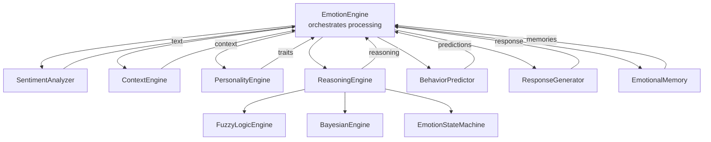

**Diagram sources**
- [emotion_engine.py:23-92](file://psychologist/emotion_engine/emotion_engine.py#L23-L92)
- [sentiment_analyzer.py:5-73](file://psychologist/emotion_engine/sentiment_analysis/sentiment_analyzer.py#L5-L73)
- [context_engine.py:9-46](file://psychologist/emotion_engine/context_engine/context_engine.py#L9-L46)
- [personality_engine.py:6-54](file://psychologist/emotion_engine/personality_engine/personality_engine.py#L6-L54)
- [reasoning_engine.py:86-204](file://psychologist/emotion_engine/reasoning_engine/reasoning_engine.py#L86-L204)
- [emotion_state_machine.py:5-89](file://psychologist/emotion_engine/state_machine/emotion_state_machine.py#L5-L89)
- [bayesian_network.py:5-104](file://psychologist/emotion_engine/bayesian_engine/bayesian_network.py#L5-L104)
- [fuzzy_engine.py:4-80](file://psychologist/emotion_engine/fuzzy_logic/fuzzy_engine.py#L4-L80)
- [emotional_memory.py:8-84](file://psychologist/emotion_engine/emotional_memory/emotional_memory.py#L8-L84)
- [behavior_predictor.py:7-132](file://psychologist/emotion_engine/behavior_predictor/behavior_predictor.py#L7-L132)
- [response_generator.py:6-85](file://psychologist/emotion_engine/response_generator/response_generator.py#L6-L85)

**Section sources**
- [emotion_engine.py:23-92](file://psychologist/emotion_engine/emotion_engine.py#L23-L92)

## Core Components
- EmotionEngine: Central orchestrator that coordinates sentiment analysis, context updates, reasoning, personality influence, memory, behavior prediction, and response generation. Maintains current emotional state, history, and interaction count.
- Models: Defines primary, secondary, and advanced emotion categories; emotional state dataclass; personality traits; memory entry; and conversation context.
- PersonalityEngine: Applies personality traits to modulate emotion magnitudes and provides personality summaries.
- SentimentAnalyzer: Tokenizes text, computes sentiment polarity and intensity, and detects emotion keywords.
- ContextEngine: Builds conversation context including topic, sentiment trends, conflict level, motivation opportunity, and repeated patterns.
- ReasoningEngine: Evaluates prioritized rules against emotional state, context, and personality; applies fuzzy logic and Bayesian updates; manages emotion state machine transitions.
- EmotionStateMachine: Discrete-state transitions driven by current and optional trigger emotions with configurable probabilities.
- BayesianEngine: Conditional probability tables and priors to compute posterior updates for selected emotions.
- FuzzyLogicEngine: Triangular/trapezoidal membership functions and centroid defuzzification for handling uncertainty in emotion intensities.
- EmotionalMemory: Short-term and long-term memory storage, emotional pattern tracking, preference storage, and averaging influence on current emotion.
- BehaviorPredictor: Predictions for escalation risk, recovery, next likely emotions, engagement, and motivation.
- ResponseGenerator: Mode-aware response templates with personalization based on personality and context.

**Section sources**
- [emotion_engine.py:23-92](file://psychologist/emotion_engine/emotion_engine.py#L23-L92)
- [models.py:7-143](file://psychologist/emotion_engine/models.py#L7-L143)
- [personality_engine.py:6-68](file://psychologist/emotion_engine/personality_engine/personality_engine.py#L6-L68)
- [sentiment_analyzer.py:5-103](file://psychologist/emotion_engine/sentiment_analysis/sentiment_analyzer.py#L5-L103)
- [context_engine.py:9-117](file://psychologist/emotion_engine/context_engine/context_engine.py#L9-L117)
- [reasoning_engine.py:86-205](file://psychologist/emotion_engine/reasoning_engine/reasoning_engine.py#L86-L205)
- [emotion_state_machine.py:5-90](file://psychologist/emotion_engine/state_machine/emotion_state_machine.py#L5-L90)
- [bayesian_network.py:5-105](file://psychologist/emotion_engine/bayesian_engine/bayesian_network.py#L5-L105)
- [fuzzy_engine.py:4-81](file://psychologist/emotion_engine/fuzzy_logic/fuzzy_engine.py#L4-L81)
- [emotional_memory.py:8-103](file://psychologist/emotion_engine/emotional_memory/emotional_memory.py#L8-L103)
- [behavior_predictor.py:7-133](file://psychologist/emotion_engine/behavior_predictor/behavior_predictor.py#L7-L133)
- [response_generator.py:6-122](file://psychologist/emotion_engine/response_generator/response_generator.py#L6-L122)

## Architecture Overview
The EmotionEngine’s processing pipeline transforms raw text input into a structured emotional response through a series of coordinated stages. The pipeline emphasizes multi-modal inputs (text, context, personality), probabilistic updates (Bayesian), and fuzzy handling of uncertainty, while maintaining explicit state evolution and memory.

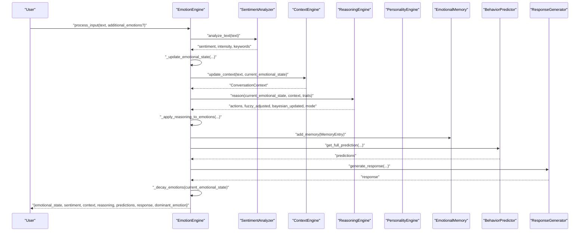

**Diagram sources**
- [emotion_engine.py:37-92](file://psychologist/emotion_engine/emotion_engine.py#L37-L92)
- [sentiment_analyzer.py:31-73](file://psychologist/emotion_engine/sentiment_analysis/sentiment_analyzer.py#L31-L73)
- [context_engine.py:24-46](file://psychologist/emotion_engine/context_engine/context_engine.py#L24-L46)
- [reasoning_engine.py:185-204](file://psychologist/emotion_engine/reasoning_engine/reasoning_engine.py#L185-L204)
- [personality_engine.py:40-54](file://psychologist/emotion_engine/personality_engine/personality_engine.py#L40-L54)
- [emotional_memory.py:17-28](file://psychologist/emotion_engine/emotional_memory/emotional_memory.py#L17-L28)
- [behavior_predictor.py:125-132](file://psychologist/emotion_engine/behavior_predictor/behavior_predictor.py#L125-L132)
- [response_generator.py:77-85](file://psychologist/emotion_engine/response_generator/response_generator.py#L77-L85)

## Detailed Component Analysis

### EmotionEngine Orchestration
- Responsibilities:
  - Initialize subsystems: personality engine, memory, sentiment analyzer, context engine, reasoning engine, behavior predictor, response generator
  - Process input: sentiment extraction, emotion keyword detection, state update, context update, reasoning, memory entry creation, behavior prediction, response generation, emotion decay
  - Expose getters for current state, personality, and memory summary
  - Reset subsystems and state
- Key constants: EMOTION_DECAY_FACTOR, EMOTION_HISTORY_LIMIT, REASONING_BLEND_CURRENT, REASONING_BLEND_BAYESIAN, SENTIMENT_BOOST_PER_KEYWORD, SENTIMENT_BOOST_MAX, SENTIMENT_INFLUENCE_FACTOR, EMOTION_HISTORY_IMPORTANCE_WEIGHT

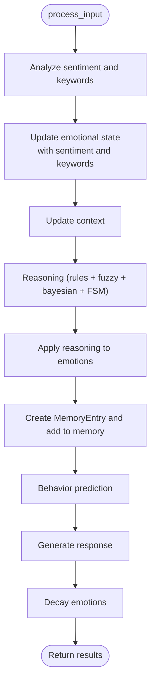

**Diagram sources**
- [emotion_engine.py:37-92](file://psychologist/emotion_engine/emotion_engine.py#L37-L92)

**Section sources**
- [emotion_engine.py:23-92](file://psychologist/emotion_engine/emotion_engine.py#L23-L92)

### Multi-Dimensional Emotion Tracking Model
- Emotion categories:
  - Primary: happiness, sadness, anger, fear, surprise, disgust
  - Secondary: excitement, anxiety, frustration, curiosity, hope, confidence, embarrassment, pride, jealousy, gratitude, sympathy, empathy
  - Advanced: burnout, motivation, stress, loneliness, trust, distrust, attachment, nostalgia, emotional_fatigue, emotional_recovery
- EmotionalState fields: timestamp, primary/secondary/advanced emotion maps, intensity
- Dominant emotion selection across all categories
- MemoryEntry: stores interaction, emotional state snapshot, context, importance, and tags
- ConversationContext: topic, sentiment, trend arrays, repeated patterns, conflict level, motivation opportunity, current topic keywords

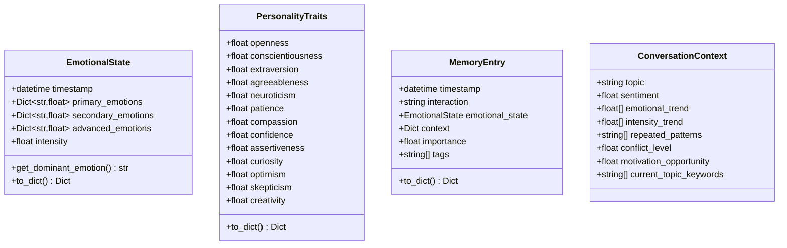

**Diagram sources**
- [models.py:44-143](file://psychologist/emotion_engine/models.py#L44-L143)

**Section sources**
- [models.py:7-143](file://psychologist/emotion_engine/models.py#L7-L143)

### Personality Influence on Emotions
- PersonalityEngine applies weighted influences per emotion category based on traits such as optimism, neuroticism, patience, confidence, agreeableness, compassion, curiosity, openness
- Influences are combined multiplicatively with base emotion values to produce adjusted emotional magnitudes
- Provides personality summary highlighting high/low trait clusters

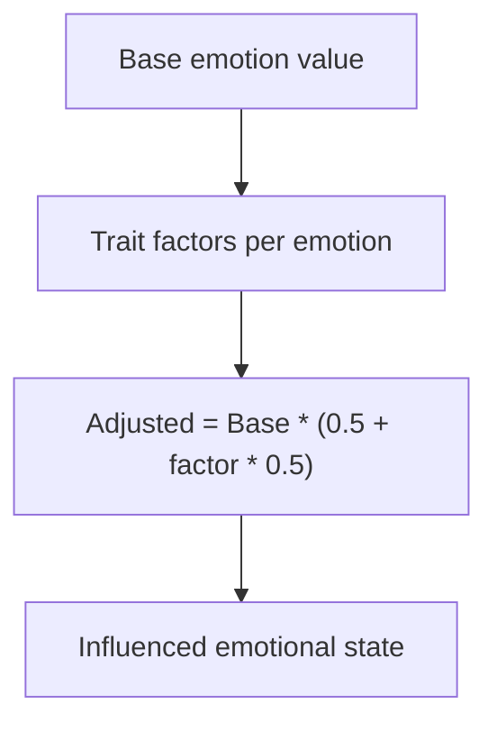

**Diagram sources**
- [personality_engine.py:23-54](file://psychologist/emotion_engine/personality_engine/personality_engine.py#L23-L54)

**Section sources**
- [personality_engine.py:6-68](file://psychologist/emotion_engine/personality_engine/personality_engine.py#L6-L68)

### Sentiment Analysis and Keyword Detection
- Tokenization and scoring of positive/negative words
- Intensifier and negator handling to adjust sentiment and intensity
- Emotion keyword detection across primary/secondary emotion lexicons
- Returns normalized sentiment (-1..1), intensity (0..1), and counts

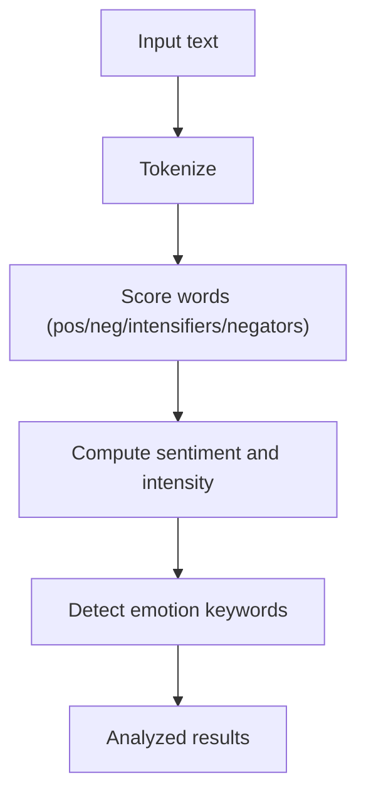

**Diagram sources**
- [sentiment_analyzer.py:31-103](file://psychologist/emotion_engine/sentiment_analysis/sentiment_analyzer.py#L31-L103)

**Section sources**
- [sentiment_analyzer.py:5-103](file://psychologist/emotion_engine/sentiment_analysis/sentiment_analyzer.py#L5-L103)

### Context Processing and Trend Tracking
- Maintains conversation history and topic detection via keyword matching
- Tracks sentiment and intensity trends with configurable limits
- Detects conflict level from emotion thresholds and sentiment
- Identifies motivation opportunity from hope, curiosity, and motivation
- Extracts repeated patterns by frequency of words in history

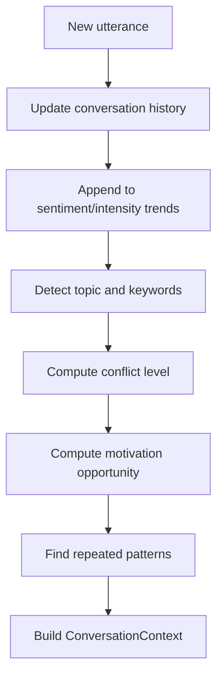

**Diagram sources**
- [context_engine.py:24-117](file://psychologist/emotion_engine/context_engine/context_engine.py#L24-L117)

**Section sources**
- [context_engine.py:9-117](file://psychologist/emotion_engine/context_engine/context_engine.py#L9-L117)

### Reasoning Pipeline: Rules, Fuzzy Logic, and Bayesian Updates
- Rule evaluation: Conditions on primary/secondary/advanced emotions, context fields, and personality traits; actions aggregated by max value per key
- FuzzyLogicEngine: fuzzifies intensities and personality traits, applies simple rules, and defuzzifies centroids
- BayesianEngine: computes posteriors from conditional probability tables and priors, then averages with current values
- EmotionStateMachine: transitions to a trigger emotion if intensity threshold met, otherwise probabilistic transitions; tracks history and most likely next states

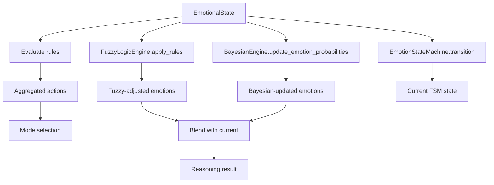

**Diagram sources**
- [reasoning_engine.py:174-204](file://psychologist/emotion_engine/reasoning_engine/reasoning_engine.py#L174-L204)
- [fuzzy_engine.py:64-80](file://psychologist/emotion_engine/fuzzy_logic/fuzzy_engine.py#L64-L80)
- [bayesian_network.py:73-101](file://psychologist/emotion_engine/bayesian_engine/bayesian_network.py#L73-L101)
- [emotion_state_machine.py:52-77](file://psychologist/emotion_engine/state_machine/emotion_state_machine.py#L52-L77)

**Section sources**
- [reasoning_engine.py:86-205](file://psychologist/emotion_engine/reasoning_engine/reasoning_engine.py#L86-L205)
- [fuzzy_engine.py:4-81](file://psychologist/emotion_engine/fuzzy_logic/fuzzy_engine.py#L4-L81)
- [bayesian_network.py:5-105](file://psychologist/emotion_engine/bayesian_engine/bayesian_network.py#L5-L105)
- [emotion_state_machine.py:5-90](file://psychologist/emotion_engine/state_machine/emotion_state_machine.py#L5-L90)

### Memory System and Emotional Pattern Evolution
- Short-term memory: recent interactions; transfers oldest entries to long-term when capacity exceeded
- Long-term memory: retained entries with higher importance; pruned by importance
- Pattern tracking: maintains recent emotion magnitude histories per category for trend analysis
- Preference storage: user preferences persisted alongside memories
- Influence on current emotion: blends current values with historical averages

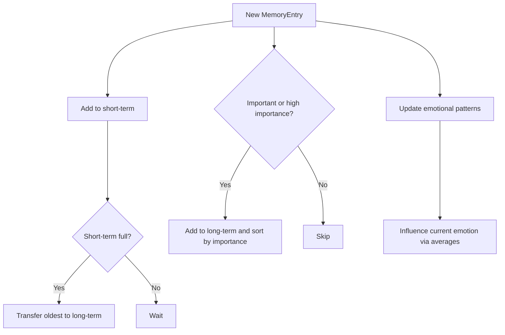

**Diagram sources**
- [emotional_memory.py:17-84](file://psychologist/emotion_engine/emotional_memory/emotional_memory.py#L17-L84)

**Section sources**
- [emotional_memory.py:8-103](file://psychologist/emotion_engine/emotional_memory/emotional_memory.py#L8-L103)

### Behavior Prediction Suite
- Escalation risk: computes per-emotion trends over recent states and estimates risk/timeframe with recommended action
- Recovery: scores resilience, social support, and current intensity to estimate recovery time
- Next emotions: predicts top candidates based on dominant emotion transitions and sentiment
- Engagement: average intensity and sentiment trend inform engagement level
- Motivation: aggregates hope, confidence, optimism, and confidence

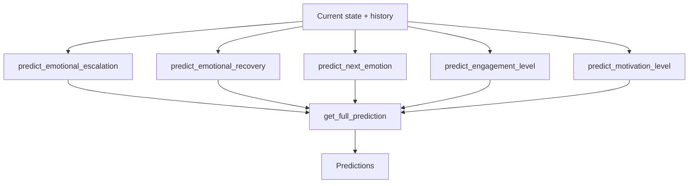

**Diagram sources**
- [behavior_predictor.py:16-132](file://psychologist/emotion_engine/behavior_predictor/behavior_predictor.py#L16-L132)

**Section sources**
- [behavior_predictor.py:7-133](file://psychologist/emotion_engine/behavior_predictor/behavior_predictor.py#L7-L133)

### Response Generation Algorithm
- Templates mapped to modes (supportive, calming, reassuring, celebratory, encouraging, stress_relief, recovery, trust_building, neutral)
- Mode selection from reasoning result; randomized template choice
- Personalization:
  - Adds topic-related prompts based on detected topic
  - Extroversion influences tone and phrasing
- Multiple response generation and style retrieval helpers

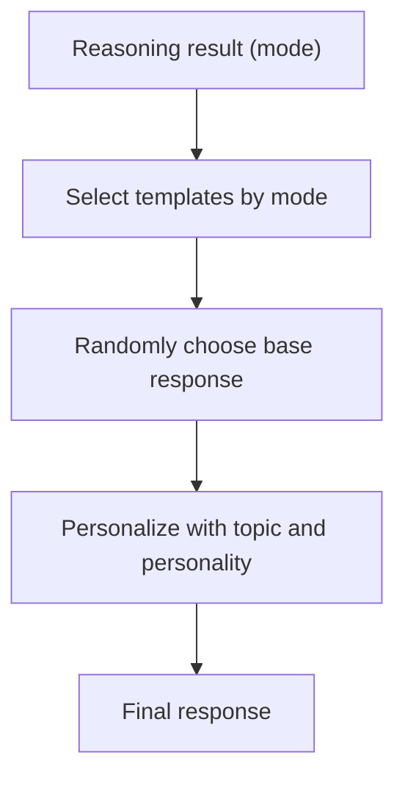

**Diagram sources**
- [response_generator.py:77-122](file://psychologist/emotion_engine/response_generator/response_generator.py#L77-L122)

**Section sources**
- [response_generator.py:6-122](file://psychologist/emotion_engine/response_generator/response_generator.py#L6-L122)

## Dependency Analysis
- Internal dependencies:
  - EmotionEngine depends on models, personality engine, emotional memory, sentiment analyzer, context engine, reasoning engine, behavior predictor, and response generator
  - ReasoningEngine depends on fuzzy logic, Bayesian engine, and emotion state machine
  - ContextEngine depends on SentimentAnalyzer
  - ResponseGenerator depends on models
  - BehaviorPredictor depends on models and EmotionalMemory indirectly via EmotionEngine
- External dependencies:
  - Typing hints and dataclasses/utilities from Python standard library
  - No external third-party libraries are imported in these modules

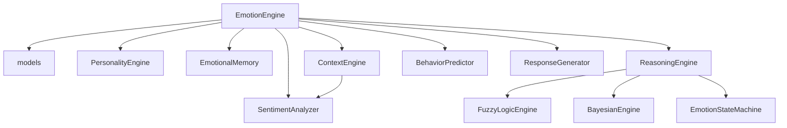

**Diagram sources**
- [emotion_engine.py:1-31](file://psychologist/emotion_engine/emotion_engine.py#L1-L31)
- [reasoning_engine.py:1-5](file://psychologist/emotion_engine/reasoning_engine/reasoning_engine.py#L1-L5)
- [context_engine.py:1-6](file://psychologist/emotion_engine/context_engine/context_engine.py#L1-L6)

**Section sources**
- [emotion_engine.py:1-31](file://psychologist/emotion_engine/emotion_engine.py#L1-L31)
- [reasoning_engine.py:1-5](file://psychologist/emotion_engine/reasoning_engine/reasoning_engine.py#L1-L5)
- [context_engine.py:1-6](file://psychologist/emotion_engine/context_engine/context_engine.py#L1-L6)

## Performance Considerations
- Complexity characteristics:
  - Sentiment analysis: linear in number of tokens
  - Context updates: linear in conversation history length and token counts
  - Rule evaluation: O(Rules × Conditions) with shallow checks
  - Fuzzy logic: proportional to number of emotions processed
  - Bayesian updates: constant-time conditional lookups and averaging
  - Memory operations: append/pop with bounded capacities; pattern updates amortized
  - Behavior prediction: sliding windows over recent states and trends
- Optimization opportunities:
  - Precompute and cache sentiment lexicons and topic keyword sets
  - Use efficient trend computations (rolling window sums) for context trends
  - Memoize Bayesian posteriors when evidence keys repeat
  - Batch rule evaluations if scaling to multiple concurrent conversations
  - Limit memory growth with stricter pruning policies if needed

[No sources needed since this section provides general guidance]

## Troubleshooting Guide
- Emotion values out of bounds:
  - Ensure clamping to [0, 1] after sentiment and keyword boosts and manual overrides
- Dominant emotion returns None:
  - Verify initialization of emotion dictionaries in EmotionalState post-init
- Reasoning mode unexpected:
  - Confirm rule priorities and conditions match expected thresholds
- Memory not persisting:
  - Use save_to_file/load_from_file on EmotionalMemory to persist patterns and preferences
- Personality influence not applied:
  - Check that influence_emotional_state is invoked after sentiment updates
- Response not personalized:
  - Validate topic detection and personality trait thresholds in response personalization

**Section sources**
- [emotion_engine.py:94-130](file://psychologist/emotion_engine/emotion_engine.py#L94-L130)
- [models.py:52-67](file://psychologist/emotion_engine/models.py#L52-L67)
- [reasoning_engine.py:174-183](file://psychologist/emotion_engine/reasoning_engine/reasoning_engine.py#L174-L183)
- [emotional_memory.py:86-103](file://psychologist/emotion_engine/emotional_memory/emotional_memory.py#L86-L103)
- [personality_engine.py:40-54](file://psychologist/emotion_engine/personality_engine/personality_engine.py#L40-L54)
- [response_generator.py:87-112](file://psychologist/emotion_engine/response_generator/response_generator.py#L87-L112)

## Conclusion
The Core Emotion Processing Engine provides a robust, modular framework for modeling and responding to human-like emotional states. By combining precise sentiment computation, contextual awareness, personality-driven modulation, probabilistic Bayesian updates, fuzzy logic for uncertainty, and predictive behavior modeling, it supports nuanced, adaptive interactions. The explicit memory system enables emotion evolution over time, while the response generator tailors output to both situation and individual traits.

[No sources needed since this section summarizes without analyzing specific files]

## Appendices

### Practical Examples and Workflows
- Example 1: Supportive response to prolonged sadness and loneliness
  - Input: text expressing prolonged sadness
  - Pipeline: sentiment analyzer → update emotional state (sadness boost) → context (conflict low, motivation opportunity medium) → reasoning triggers supportive mode → response generator selects supportive template → behavior predictor indicates recovery potential
- Example 2: Calming intervention during anger escalation
  - Input: text with high anger and conflict
  - Pipeline: sentiment analyzer → update emotional state (anger boost) → reasoning triggers calming mode → response generator selects calming template → behavior predictor recommends monitoring/early intervention
- Example 3: Encouraging curiosity-driven exploration
  - Input: text with curiosity and hope
  - Pipeline: sentiment analyzer → update emotional state (curiosity/expectancy) → context (topic detection) → reasoning triggers encouraging mode → response generator adds topic-related prompt

[No sources needed since this section provides general guidance]

### Configuration Options
- Constants influencing processing (referenced in EmotionEngine):
  - EMOTION_DECAY_FACTOR: exponential decay for emotion magnitudes
  - EMOTION_HISTORY_LIMIT: cap on stored emotional history
  - REASONING_BLEND_CURRENT: weight for blending reasoning updates with current values
  - REASONING_BLEND_BAYESIAN: weight for Bayesian updates
  - SENTIMENT_BOOST_PER_KEYWORD: per-keyword intensity increment
  - SENTIMENT_BOOST_MAX: maximum boost cap
  - SENTIMENT_INFLUENCE_FACTOR: baseline sentiment impact on happiness/sadness
  - EMOTION_HISTORY_IMPORTANCE_WEIGHT: base importance for memory entries
- PersonalityEngine:
  - Trait ranges: 0.0–1.0 for all traits
- ContextEngine:
  - CONVERSATION_HISTORY_LIMIT and EMOTIONAL_TREND_LIMIT govern trend sizes
- EmotionalMemory:
  - Short-term and long-term capacities; importance thresholds for retention and pruning
- BehaviorPredictor:
  - Thresholds for escalation risk and timeframe classification
- ResponseGenerator:
  - Mode-specific templates; personalization thresholds for extroversion

**Section sources**
- [emotion_engine.py:11-20](file://psychologist/emotion_engine/emotion_engine.py#L11-L20)
- [personality_engine.py:80-94](file://psychologist/emotion_engine/personality_engine/personality_engine.py#L80-L94)
- [context_engine.py:6](file://psychologist/emotion_engine/context_engine/context_engine.py#L6)
- [emotional_memory.py:9-16](file://psychologist/emotion_engine/emotional_memory/emotional_memory.py#L9-L16)
- [behavior_predictor.py:16-132](file://psychologist/emotion_engine/behavior_predictor/behavior_predictor.py#L16-L132)
- [response_generator.py:10-75](file://psychologist/emotion_engine/response_generator/response_generator.py#L10-L75)