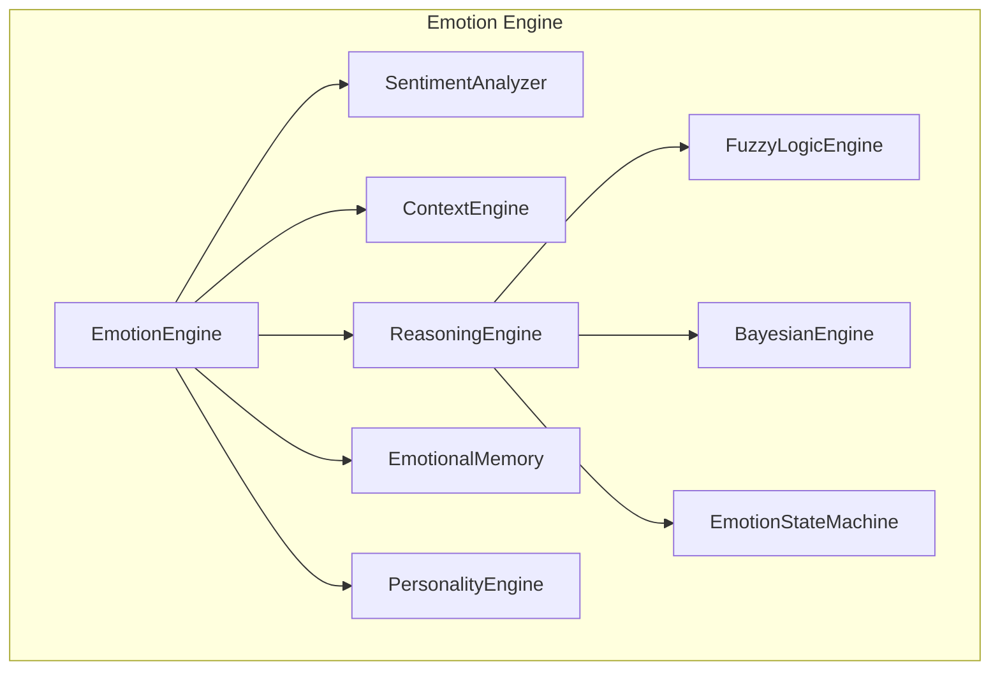
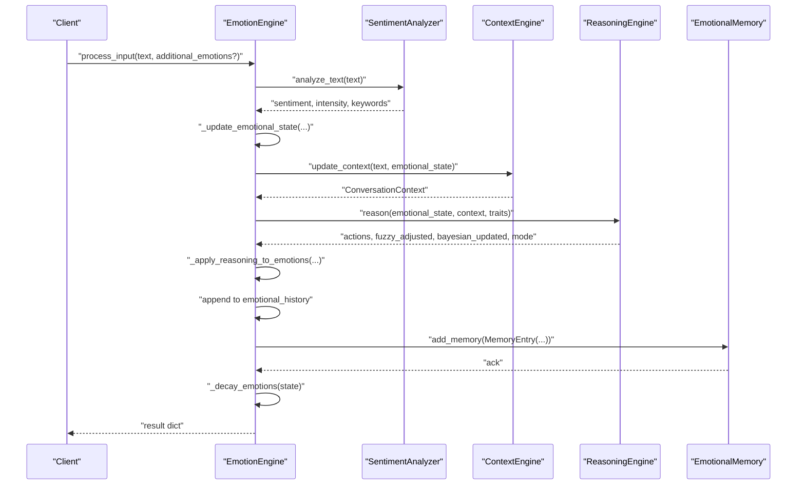
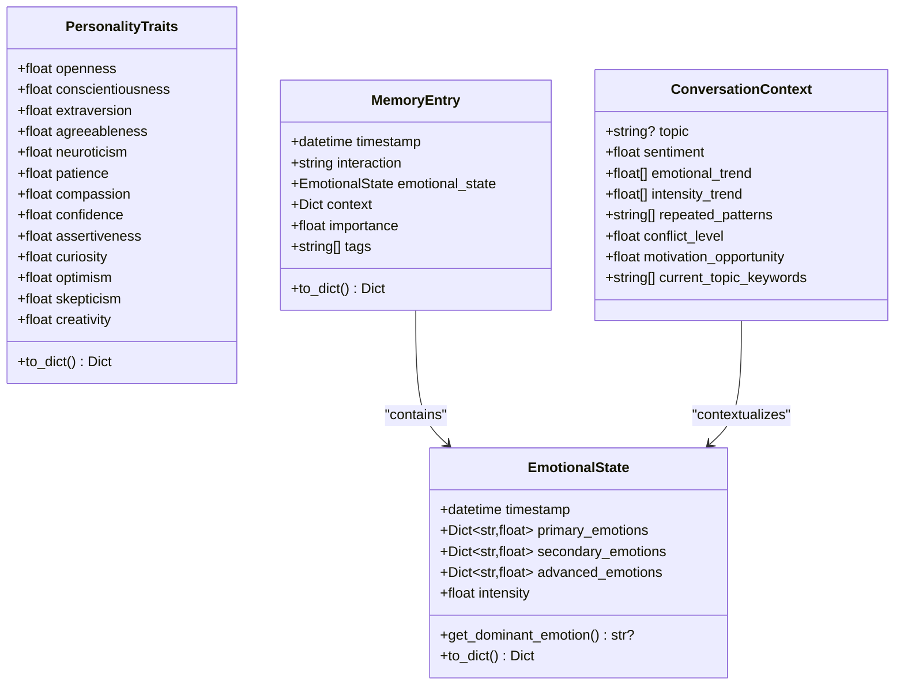
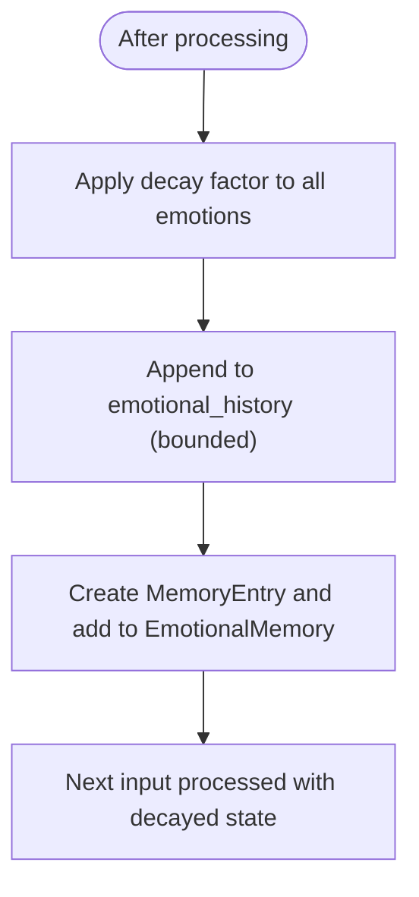
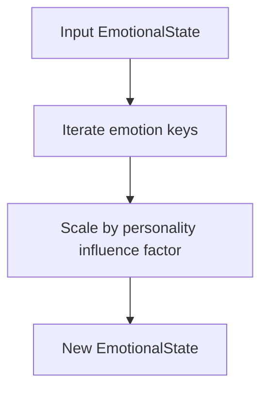
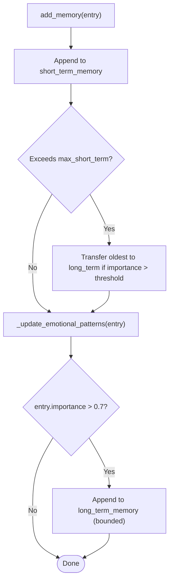
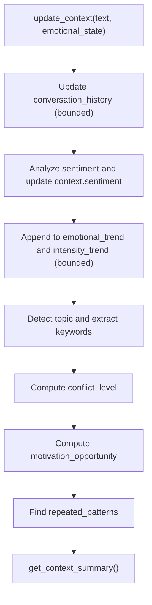
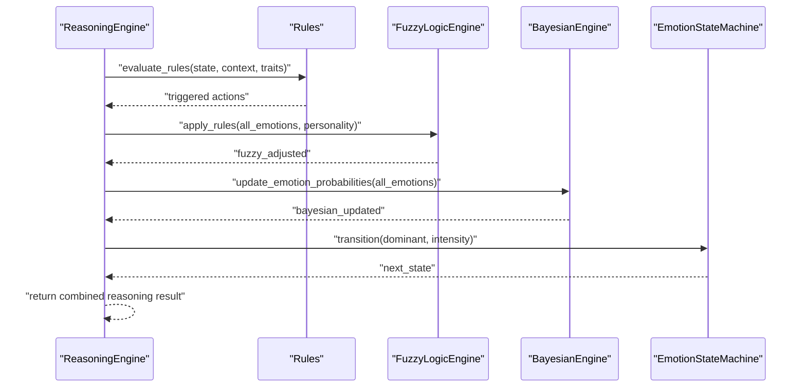
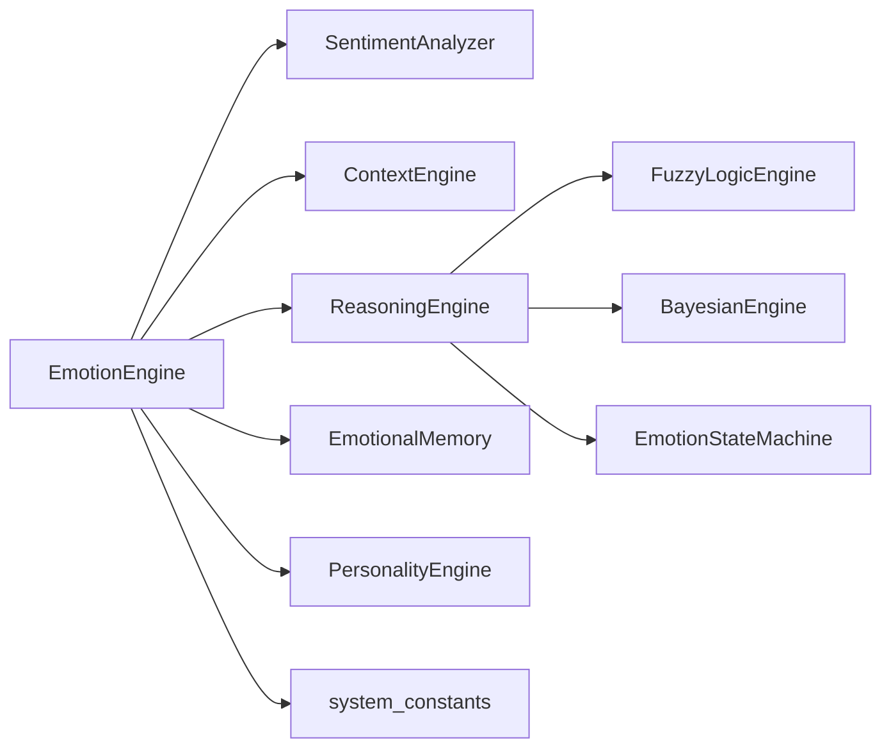

# Emotion Data Models and State Management

<cite>
**Referenced Files in This Document**
- [models.py](file://psychologist/emotion_engine/models.py)
- [emotion_engine.py](file://psychologist/emotion_engine/emotion_engine.py)
- [personality_engine.py](file://psychologist/emotion_engine/personality_engine.py)
- [emotional_memory.py](file://psychologist/emotion_engine/emotional_memory.py)
- [context_engine.py](file://psychologist/emotion_engine/context_engine.py)
- [emotion_state_machine.py](file://psychologist/emotion_engine/state_machine/emotion_state_machine.py)
- [sentiment_analyzer.py](file://psychologist/emotion_engine/sentiment_analysis/sentiment_analyzer.py)
- [reasoning_engine.py](file://psychologist/emotion_engine/reasoning_engine/reasoning_engine.py)
- [bayesian_network.py](file://psychologist/emotion_engine/bayesian_engine/bayesian_network.py)
- [fuzzy_engine.py](file://psychologist/emotion_engine/fuzzy_logic/fuzzy_engine.py)
- [system_constants.py](file://psychologist/system_constants.py)
- [test_emotion_engine.py](file://psychologist/emotion_engine/tests/test_emotion_engine.py)
</cite>

## Table of Contents
1. [Introduction](#introduction)
2. [Project Structure](#project-structure)
3. [Core Components](#core-components)
4. [Architecture Overview](#architecture-overview)
5. [Detailed Component Analysis](#detailed-component-analysis)
6. [Dependency Analysis](#dependency-analysis)
7. [Performance Considerations](#performance-considerations)
8. [Troubleshooting Guide](#troubleshooting-guide)
9. [Conclusion](#conclusion)

## Introduction
This document explains the Emotion Data Models and State Management subsystem. It focuses on the core data structures—EmotionalState, PersonalityTraits, MemoryEntry, and ConversationContext—and documents how they represent emotion states, personality trait scoring, and memory-backed context. It also covers state transition algorithms, emotion decay calculations, and data validation rules, along with practical usage examples and integration points with other emotion-processing components.

## Project Structure
The emotion subsystem is organized around a set of cohesive modules:
- Data models define the canonical structures for emotions, traits, memory, and conversation context.
- The EmotionEngine orchestrates processing of text input, updates the current emotional state, applies reasoning, and persists memories.
- Supporting engines handle personality influence, sentiment analysis, context modeling, fuzzy logic, Bayesian inference, and state machine transitions.

**Diagram sources**
- [emotion_engine.py:23-36](file://psychologist/emotion_engine/emotion_engine.py#L23-L36)
- [personality_engine.py:6-8](file://psychologist/emotion_engine/personality_engine.py#L6-L8)
- [sentiment_analyzer.py:5-6](file://psychologist/emotion_engine/sentiment_analysis/sentiment_analyzer.py#L5-L6)
- [context_engine.py:9-12](file://psychologist/emotion_engine/context_engine/context_engine.py#L9-L12)
- [reasoning_engine.py:86-92](file://psychologist/emotion_engine/reasoning_engine/reasoning_engine.py#L86-L92)
- [emotion_state_machine.py:5-9](file://psychologist/emotion_engine/state_machine/emotion_state_machine.py#L5-L9)
- [bayesian_network.py:5-8](file://psychologist/emotion_engine/bayesian_engine/bayesian_network.py#L5-L8)
- [fuzzy_engine.py:4-6](file://psychologist/emotion_engine/fuzzy_logic/fuzzy_engine.py#L4-L6)
- [emotional_memory.py:8-16](file://psychologist/emotion_engine/emotional_memory/emotional_memory.py#L8-L16)

**Section sources**
- [emotion_engine.py:23-36](file://psychologist/emotion_engine/emotion_engine.py#L23-L36)
- [models.py:44-143](file://psychologist/emotion_engine/models.py#L44-L143)

## Core Components
This section documents the core data structures and their roles in representing emotion states, personality traits, memory entries, and conversational context.

- EmotionalState
  - Purpose: Encapsulates current emotion levels across three categories: primary, secondary, and advanced emotions, plus a scalar intensity.
  - Initialization: Automatically initializes zeroed emotion slots for all supported emotion enums.
  - Dominant Emotion: Computes the emotion with the highest magnitude across all categories.
  - Serialization: Provides dictionary export suitable for persistence and transport.
  - Validation: Enforces bounds via update logic and decay scaling.

- PersonalityTraits
  - Purpose: Captures baseline personality characteristics used to influence emotional interpretation and expression.
  - Traits: Includes openness, conscientiousness, extraversion, agreeableness, neuroticism, and several emotion-relevant traits (e.g., patience, compassion, confidence).
  - Serialization: Converts traits to a dictionary for downstream processing.

- MemoryEntry
  - Purpose: Stores a snapshot of an interaction including the associated EmotionalState, contextual metadata, importance, and tags.
  - Serialization: Exports to dictionary for storage and retrieval.

- ConversationContext
  - Purpose: Tracks evolving conversational context including topic, sentiment trend, intensity trend, repeated patterns, conflict level, motivation opportunity, and current topic keywords.

**Section sources**
- [models.py:44-143](file://psychologist/emotion_engine/models.py#L44-L143)

## Architecture Overview
The EmotionEngine coordinates input processing, state updates, reasoning, and persistence. It integrates with PersonalityEngine, SentimentAnalyzer, ContextEngine, ReasoningEngine, and EmotionalMemory.

**Diagram sources**
- [emotion_engine.py:37-92](file://psychologist/emotion_engine/emotion_engine.py#L37-L92)
- [context_engine.py:24-46](file://psychologist/emotion_engine/context_engine/context_engine.py#L24-L46)
- [reasoning_engine.py:185-204](file://psychologist/emotion_engine/reasoning_engine/reasoning_engine.py#L185-L204)
- [emotional_memory.py:17-28](file://psychologist/emotion_engine/emotional_memory/emotional_memory.py#L17-L28)

## Detailed Component Analysis

### Data Model Classes
This section presents the core data structures and their relationships.

**Diagram sources**
- [models.py:44-143](file://psychologist/emotion_engine/models.py#L44-L143)

**Section sources**
- [models.py:44-143](file://psychologist/emotion_engine/models.py#L44-L143)

### Emotion Decay and State Transition
- Emotion Decay
  - The engine applies a multiplicative decay factor to all emotion dimensions after generating a response, gradually reducing intensities over time.
  - Constants govern the decay factor and history limits.

- State Transitions
  - A finite-state machine defines transition probabilities among discrete emotion states. Transitions can be triggered by dominant emotion or sampled probabilistically from the current state.

**Diagram sources**
- [emotion_engine.py:147-162](file://psychologist/emotion_engine/emotion_engine.py#L147-L162)
- [system_constants.py:14-18](file://psychologist/system_constants.py#L14-L18)

**Section sources**
- [emotion_engine.py:147-162](file://psychologist/emotion_engine/emotion_engine.py#L147-L162)
- [emotion_state_machine.py:52-70](file://psychologist/emotion_engine/state_machine/emotion_state_machine.py#L52-L70)
- [system_constants.py:14-18](file://psychologist/system_constants.py#L14-L18)

### Personality Influence on Emotions
Personality traits modulate how raw emotion magnitudes are interpreted and expressed. The PersonalityEngine scales emotion values based on trait profiles.

**Diagram sources**
- [personality_engine.py:40-54](file://psychologist/emotion_engine/personality_engine.py#L40-L54)

**Section sources**
- [personality_engine.py:23-54](file://psychologist/emotion_engine/personality_engine.py#L23-L54)

### Memory and Pattern Learning
EmotionalMemory maintains short-term and long-term memory, transfers oldest entries when capacity is exceeded, and tracks emotional patterns to influence future states.

**Diagram sources**
- [emotional_memory.py:17-28](file://psychologist/emotion_engine/emotional_memory/emotional_memory.py#L17-L28)

**Section sources**
- [emotional_memory.py:8-103](file://psychologist/emotion_engine/emotional_memory/emotional_memory.py#L8-L103)

### Context Modeling
ContextEngine builds a dynamic ConversationContext from incoming text, tracking sentiment trends, repeated patterns, conflict level, and motivation opportunities.

**Diagram sources**
- [context_engine.py:24-46](file://psychologist/emotion_engine/context_engine/context_engine.py#L24-L46)

**Section sources**
- [context_engine.py:9-117](file://psychologist/emotion_engine/context_engine/context_engine.py#L9-L117)

### Reasoning and Mode Selection
The ReasoningEngine evaluates rules against the current EmotionalState, ConversationContext, and PersonalityTraits, then applies fuzzy logic and Bayesian updates to refine emotion magnitudes and select a response mode.

**Diagram sources**
- [reasoning_engine.py:185-204](file://psychologist/emotion_engine/reasoning_engine/reasoning_engine.py#L185-L204)
- [fuzzy_engine.py:64-80](file://psychologist/emotion_engine/fuzzy_logic/fuzzy_engine.py#L64-L80)
- [bayesian_network.py:73-101](file://psychologist/emotion_engine/bayesian_engine/bayesian_network.py#L73-L101)
- [emotion_state_machine.py:52-70](file://psychologist/emotion_engine/state_machine/emotion_state_machine.py#L52-L70)

**Section sources**
- [reasoning_engine.py:86-204](file://psychologist/emotion_engine/reasoning_engine/reasoning_engine.py#L86-L204)
- [fuzzy_engine.py:4-81](file://psychologist/emotion_engine/fuzzy_logic/fuzzy_engine.py#L4-L81)
- [bayesian_network.py:5-105](file://psychologist/emotion_engine/bayesian_engine/bayesian_network.py#L5-L105)
- [emotion_state_machine.py:5-90](file://psychologist/emotion_engine/state_machine/emotion_state_machine.py#L5-L90)

### Data Validation Rules
- Bounds enforcement
  - Emotion values are clamped to [0.0, 1.0] during updates.
  - Intensity values are similarly bounded.
- Enum initialization
  - EmotionalState ensures all supported emotion enums are present with zero defaults.
- Trend and history limits
  - ContextEngine and EmotionEngine enforce maximum lengths for histories and trends.

**Section sources**
- [emotion_engine.py:94-130](file://psychologist/emotion_engine/emotion_engine.py#L94-L130)
- [models.py:52-67](file://psychologist/emotion_engine/models.py#L52-L67)
- [context_engine.py:26-38](file://psychologist/emotion_engine/context_engine/context_engine.py#L26-L38)
- [system_constants.py:41-45](file://psychologist/system_constants.py#L41-L45)

### Examples of Data Model Usage
- Creating and inspecting an EmotionalState
  - Construct an EmotionalState and check its dominant emotion.
  - Reference: [models.py:63-67](file://psychologist/emotion_engine/models.py#L63-L67)
- Updating emotion from text input
  - Use EmotionEngine.process_input to analyze sentiment, detect keywords, and update the current state.
  - Reference: [emotion_engine.py:37-92](file://psychologist/emotion_engine/emotion_engine.py#L37-L92)
- Applying personality influence
  - Call PersonalityEngine.influence_emotional_state to scale emotion magnitudes according to traits.
  - Reference: [personality_engine.py:40-54](file://psychologist/emotion_engine/personality_engine/personality_engine.py#L40-L54)
- Persisting and retrieving memories
  - Add a MemoryEntry to EmotionalMemory and serialize to JSON for persistence.
  - Reference: [emotional_memory.py:86-103](file://psychologist/emotion_engine/emotional_memory/emotional_memory.py#L86-L103)
- Building conversation context
  - Update ConversationContext from text and retrieve a summary for downstream components.
  - Reference: [context_engine.py:24-46](file://psychologist/emotion_engine/context_engine/context_engine.py#L24-L46)

**Section sources**
- [models.py:44-143](file://psychologist/emotion_engine/models.py#L44-L143)
- [emotion_engine.py:37-92](file://psychologist/emotion_engine/emotion_engine.py#L37-L92)
- [personality_engine.py:40-54](file://psychologist/emotion_engine/personality_engine/personality_engine.py#L40-L54)
- [emotional_memory.py:86-103](file://psychologist/emotion_engine/emotional_memory/emotional_memory.py#L86-L103)
- [context_engine.py:24-46](file://psychologist/emotion_engine/context_engine/context_engine.py#L24-L46)

## Dependency Analysis
The EmotionEngine composes multiple specialized engines and utilities. Dependencies are primarily module-level imports and cross-calls among components.

**Diagram sources**
- [emotion_engine.py:1-31](file://psychologist/emotion_engine/emotion_engine.py#L1-L31)
- [reasoning_engine.py:1-5](file://psychologist/emotion_engine/reasoning_engine/reasoning_engine.py#L1-L5)
- [system_constants.py:1-103](file://psychologist/system_constants.py#L1-L103)

**Section sources**
- [emotion_engine.py:1-31](file://psychologist/emotion_engine/emotion_engine.py#L1-L31)
- [reasoning_engine.py:1-5](file://psychologist/emotion_engine/reasoning_engine/reasoning_engine.py#L1-L5)
- [system_constants.py:1-103](file://psychologist/system_constants.py#L1-L103)

## Performance Considerations
- Decaying emotion values reduces computational overhead by preventing unbounded growth of emotion magnitudes across cycles.
- Bounded histories and trends cap memory usage for context and emotional tracking.
- Probabilistic transitions and rule evaluation are lightweight but should remain deterministic for reproducibility.

[No sources needed since this section provides general guidance]

## Troubleshooting Guide
- Dominant emotion returns None
  - Occurs when no emotion values are set. Ensure EmotionalState is initialized and updated before calling get_dominant_emotion.
  - Reference: [models.py:63-67](file://psychologist/emotion_engine/models.py#L63-L67)
- Emotion values exceed bounds
  - Verify that updates clamp values to [0.0, 1.0] and that decay does not reintroduce out-of-range values.
  - Reference: [emotion_engine.py:94-130](file://psychologist/emotion_engine/emotion_engine.py#L94-L130)
- Context trends empty or truncated
  - Confirm that update_context is called for each message and that limits are configured appropriately.
  - Reference: [context_engine.py:24-46](file://psychologist/emotion_engine/context_engine/context_engine.py#L24-L46), [system_constants.py:41-45](file://psychologist/system_constants.py#L41-L45)
- Memory not persisting
  - Ensure save_to_file is invoked with a valid path and that load_from_file reads existing files.
  - Reference: [emotional_memory.py:86-103](file://psychologist/emotion_engine/emotional_memory/emotional_memory.py#L86-L103)

**Section sources**
- [models.py:63-67](file://psychologist/emotion_engine/models.py#L63-L67)
- [emotion_engine.py:94-130](file://psychologist/emotion_engine/emotion_engine.py#L94-L130)
- [context_engine.py:24-46](file://psychologist/emotion_engine/context_engine/context_engine.py#L24-L46)
- [system_constants.py:41-45](file://psychologist/system_constants.py#L41-L45)
- [emotional_memory.py:86-103](file://psychologist/emotion_engine/emotional_memory/emotional_memory.py#L86-L103)

## Conclusion
The emotion data models and state management system provide a structured, extensible foundation for representing and evolving emotional states. Through PersonalityEngine influence, SentimentAnalyzer-driven updates, ContextEngine trend tracking, ReasoningEngine rule evaluation, and EmotionalMemory pattern learning, the system supports nuanced, context-aware emotion processing. The decaying state transitions and bounded histories ensure stability and performance over extended interactions.