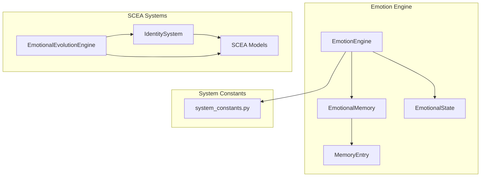
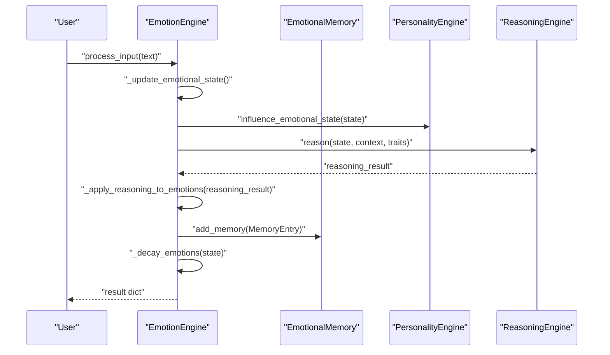
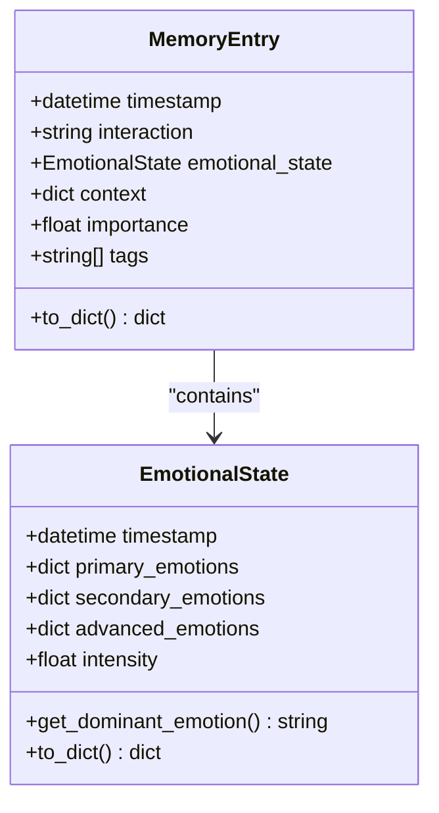
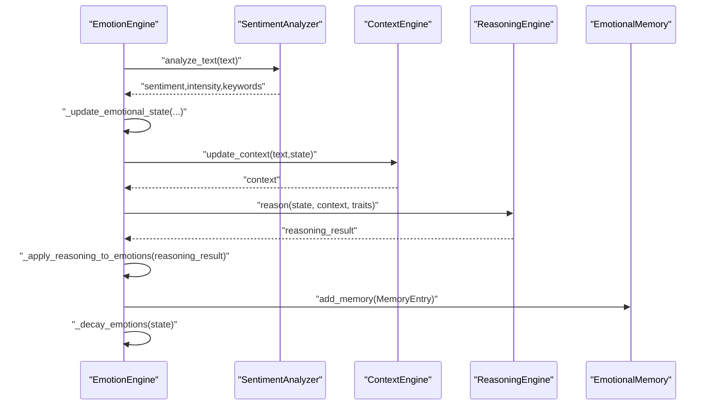
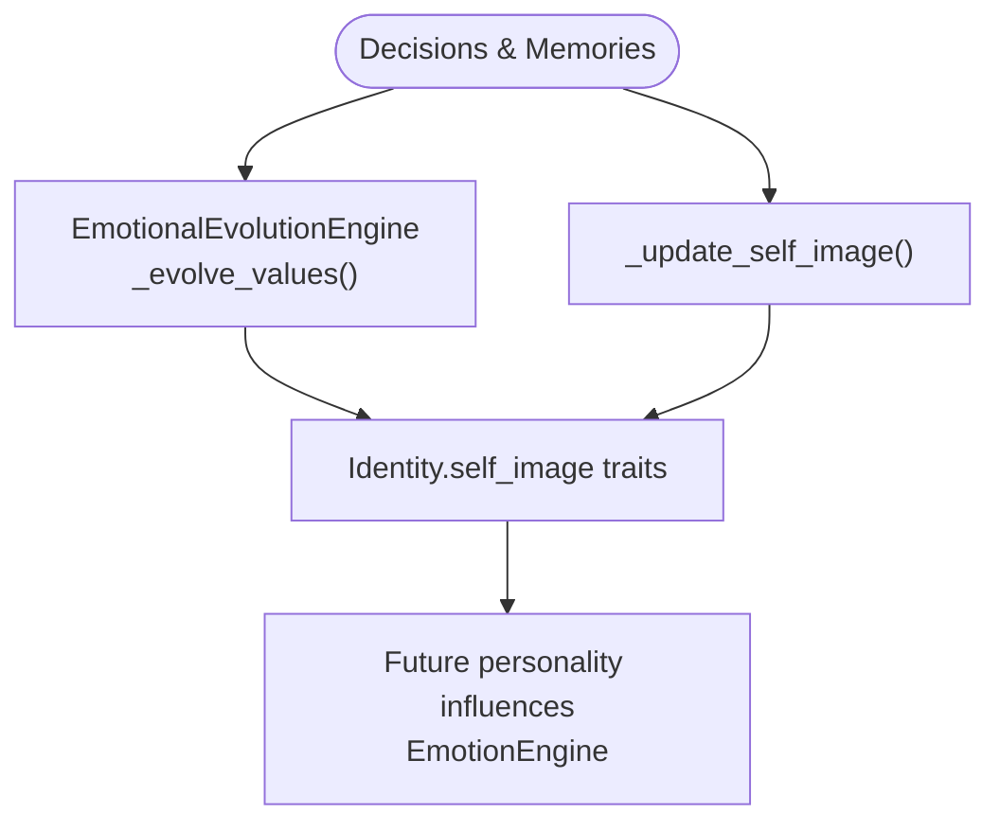
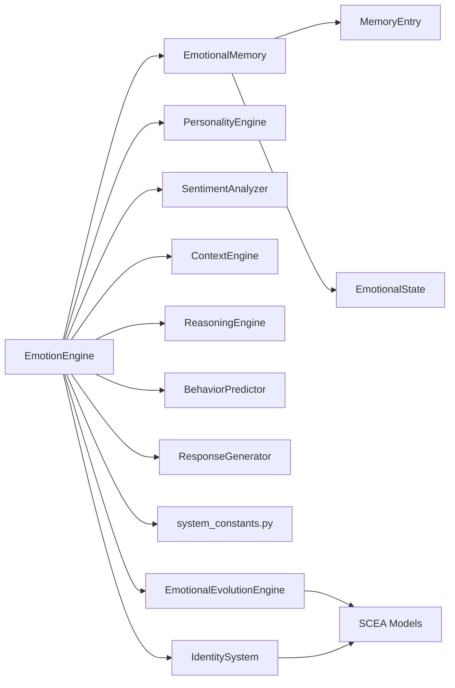

# Emotional Memory System

<cite>
**Referenced Files in This Document**
- [emotional_memory.py](file://psychologist/psychologist/emotion_engine/emotional_memory/emotional_memory.py)
- [__init__.py](file://psychologist/psychologist/emotion_engine/emotional_memory/__init__.py)
- [models.py](file://psychologist/psychologist/emotion_engine/models.py)
- [emotion_engine.py](file://psychologist/psychologist/emotion_engine/emotion_engine.py)
- [system_constants.py](file://psychologist/psychologist/system_constants.py)
- [emotional_evolution_system.py](file://psychologist/psychologist/scea/emotional_evolution/emotional_evolution_system.py)
- [identity_system.py](file://psychologist/psychologist/scea/identity_formation/identity_system.py)
- [models.py](file://psychologist/psychologist/scea/core/models.py)
</cite>

## Table of Contents
1. [Introduction](#introduction)
2. [Project Structure](#project-structure)
3. [Core Components](#core-components)
4. [Architecture Overview](#architecture-overview)
5. [Detailed Component Analysis](#detailed-component-analysis)
6. [Dependency Analysis](#dependency-analysis)
7. [Performance Considerations](#performance-considerations)
8. [Troubleshooting Guide](#troubleshooting-guide)
9. [Conclusion](#conclusion)

## Introduction
This document describes the Emotional Memory System, which stores and manages emotional experiences, maintains both short-term and long-term memory, recognizes emotional patterns, and influences future emotional processing and response generation. It documents the MemoryEntry data structure, memory importance scoring, retrieval mechanisms, and the feedback loop between memory and personality development.

## Project Structure
The Emotional Memory System resides under the emotion engine and integrates with broader systems for personality, reasoning, and identity formation.



**Diagram sources**
- [emotion_engine.py:23-36](file://psychologist/psychologist/emotion_engine/emotion_engine.py#L23-L36)
- [emotional_memory.py:8-16](file://psychologist/psychologist/emotion_engine/emotional_memory/emotional_memory.py#L8-L16)
- [models.py:113-130](file://psychologist/psychologist/emotion_engine/models.py#L113-L130)
- [models.py:44-76](file://psychologist/psychologist/emotion_engine/models.py#L44-L76)
- [system_constants.py:14-36](file://psychologist/psychologist/system_constants.py#L14-L36)
- [emotional_evolution_system.py:6-35](file://psychologist/psychologist/scea/emotional_evolution/emotional_evolution_system.py#L6-L35)
- [identity_system.py:33-76](file://psychologist/psychologist/scea/identity_formation/identity_system.py#L33-L76)
- [models.py:95-162](file://psychologist/psychologist/scea/core/models.py#L95-L162)

**Section sources**
- [emotion_engine.py:23-36](file://psychologist/psychologist/emotion_engine/emotion_engine.py#L23-L36)
- [emotional_memory.py:8-16](file://psychologist/psychologist/emotion_engine/emotional_memory/emotional_memory.py#L8-L16)
- [models.py:113-130](file://psychologist/psychologist/emotion_engine/models.py#L113-L130)
- [models.py:44-76](file://psychologist/psychologist/emotion_engine/models.py#L44-L76)
- [system_constants.py:14-36](file://psychologist/psychologist/system_constants.py#L14-L36)
- [emotional_evolution_system.py:6-35](file://psychologist/psychologist/scea/emotional_evolution/emotional_evolution_system.py#L6-L35)
- [identity_system.py:33-76](file://psychologist/psychologist/scea/identity_formation/identity_system.py#L33-L76)
- [models.py:95-162](file://psychologist/psychologist/scea/core/models.py#L95-L162)

## Core Components
- MemoryEntry: The atomic unit of memory containing timestamp, interaction text, emotional state snapshot, contextual metadata, importance score, and tags.
- EmotionalState: Encapsulates primary, secondary, and advanced emotions with intensity and provides dominant emotion detection and serialization.
- EmotionalMemory: Manages short-term and long-term memory lists, importance-based retention, emotional pattern tracking, preference storage, and persistence.

Key responsibilities:
- Short-term memory growth with automatic transfer to long-term when capacity is exceeded.
- Long-term retention gated by importance thresholds and periodic pruning by importance.
- Pattern tracking for emotional tendencies over time.
- Influence on current emotional state via averaging historical emotional patterns.
- Persistence to/from JSON for session continuity.

**Section sources**
- [models.py:113-130](file://psychologist/psychologist/emotion_engine/models.py#L113-L130)
- [models.py:44-76](file://psychologist/psychologist/emotion_engine/models.py#L44-L76)
- [emotional_memory.py:8-16](file://psychologist/psychologist/emotion_engine/emotional_memory/emotional_memory.py#L8-L16)
- [emotional_memory.py:17-28](file://psychologist/psychologist/emotion_engine/emotional_memory/emotional_memory.py#L17-L28)
- [emotional_memory.py:30-36](file://psychologist/psychologist/emotion_engine/emotional_memory/emotional_memory.py#L30-L36)
- [emotional_memory.py:38-44](file://psychologist/psychologist/emotion_engine/emotional_memory/emotional_memory.py#L38-L44)
- [emotional_memory.py:46-55](file://psychologist/psychologist/emotion_engine/emotional_memory/emotional_memory.py#L46-L55)
- [emotional_memory.py:78-84](file://psychologist/psychologist/emotion_engine/emotional_memory/emotional_memory.py#L78-L84)
- [emotional_memory.py:86-102](file://psychologist/psychologist/emotion_engine/emotional_memory/emotional_memory.py#L86-L102)

## Architecture Overview
The EmotionEngine orchestrates input processing, updates the current emotional state, constructs a MemoryEntry, and delegates memory storage and pattern tracking to EmotionalMemory. Personality and reasoning influence the emotional state, while memory patterns feed back to adjust current emotions. Evolutionary systems later shape identity and values based on memory and decisions.



**Diagram sources**
- [emotion_engine.py:37-92](file://psychologist/psychologist/emotion_engine/emotion_engine.py#L37-L92)
- [emotion_engine.py:94-129](file://psychologist/psychologist/emotion_engine/emotion_engine.py#L94-L129)
- [emotion_engine.py:131-145](file://psychologist/psychologist/emotion_engine/emotion_engine.py#L131-L145)
- [emotion_engine.py:147-162](file://psychologist/psychologist/emotion_engine/emotion_engine.py#L147-L162)
- [emotional_memory.py:17-28](file://psychologist/psychologist/emotion_engine/emotional_memory/emotional_memory.py#L17-L28)

## Detailed Component Analysis

### MemoryEntry and EmotionalState
MemoryEntry captures a moment of interaction with:
- Timestamp
- Interaction text
- EmotionalState snapshot
- Context dictionary
- Importance score
- Tags list

EmotionalState normalizes emotion dictionaries to include all supported emotion categories and computes a dominant emotion. It serializes to a dictionary for persistence and interchange.



**Diagram sources**
- [models.py:113-130](file://psychologist/psychologist/emotion_engine/models.py#L113-L130)
- [models.py:44-76](file://psychologist/psychologist/emotion_engine/models.py#L44-L76)

**Section sources**
- [models.py:113-130](file://psychologist/psychologist/emotion_engine/models.py#L113-L130)
- [models.py:44-76](file://psychologist/psychologist/emotion_engine/models.py#L44-L76)

### EmotionalMemory: Storage, Scoring, and Retrieval
Short-term and long-term memory management:
- Short-term growth with automatic oldest-to-long-term transfer when capacity is exceeded.
- Long-term retention gated by importance threshold and periodic pruning by importance.
- Pattern tracking aggregates recent emotional values per emotion category with a sliding window.
- Retrieval supports recent memories and emotion-specific recency sorting.
- Influence adjusts current emotional state by blending current and historical averages.
- Persistence writes and reads short-term, long-term, patterns, and preferences.

```mermaid
flowchart TD
Start(["Add Memory"]) --> PushST["Append to short_term"]
PushST --> CheckST{"len(short_term) > max_short_term?"}
CheckST --> |Yes| Transfer["Transfer oldest if importance > 0.3"]
CheckST --> |No| UpdatePatterns["Update emotional_patterns"]
Transfer --> UpdatePatterns
UpdatePatterns --> CheckImp{"is_important OR importance > 0.7?"}
CheckImp --> |Yes| PushLT["Append to long_term"]
PushLT --> CheckLT{"len(long_term) > max_long_term?"}
CheckLT --> |Yes| Prune["Sort by importance and keep top"}
CheckLT --> |No| End(["Done"])
CheckImp --> |No| End
Prune --> End
```

**Diagram sources**
- [emotional_memory.py:17-28](file://psychologist/psychologist/emotion_engine/emotional_memory/emotional_memory.py#L17-L28)
- [emotional_memory.py:30-36](file://psychologist/psychologist/emotion_engine/emotional_memory/emotional_memory.py#L30-L36)
- [emotional_memory.py:38-44](file://psychologist/psychologist/emotion_engine/emotional_memory/emotional_memory.py#L38-L44)

Memory importance scoring:
- Determined during EmotionEngine processing by combining a base weight and intensity-based weighting.
- Influences whether a memory is immediately promoted to long-term and how aggressively pruned later.

**Section sources**
- [emotional_memory.py:17-28](file://psychologist/psychologist/emotion_engine/emotional_memory/emotional_memory.py#L17-L28)
- [emotional_memory.py:30-36](file://psychologist/psychologist/emotion_engine/emotional_memory/emotional_memory.py#L30-L36)
- [emotional_memory.py:38-44](file://psychologist/psychologist/emotion_engine/emotional_memory/emotional_memory.py#L38-L44)
- [emotion_engine.py:59-66](file://psychologist/psychologist/emotion_engine/emotion_engine.py#L59-L66)
- [system_constants.py:35](file://psychologist/psychologist/system_constants.py#L35)

Retrieval mechanisms:
- Recent memories: last N items from short-term.
- Emotion-specific recall: scans combined memory lists and sorts by recency for a given emotion above a threshold.
- Trend analysis: recent values for a given emotion within a time window.

**Section sources**
- [emotional_memory.py:46-55](file://psychologist/psychologist/emotion_engine/emotional_memory/emotional_memory.py#L46-L55)
- [emotional_memory.py:57-65](file://psychologist/psychologist/emotion_engine/emotional_memory/emotional_memory.py#L57-L65)

Influence on future processing:
- Historical average per emotion is blended into current emotional state to bias subsequent reasoning and responses.

**Section sources**
- [emotional_memory.py:78-84](file://psychologist/psychologist/emotion_engine/emotional_memory/emotional_memory.py#L78-L84)

### EmotionEngine Integration
The EmotionEngine builds MemoryEntry from the current emotional state and context, adds it to EmotionalMemory, and applies decay to maintain realistic emotional dynamics across interactions.



**Diagram sources**
- [emotion_engine.py:37-92](file://psychologist/psychologist/emotion_engine/emotion_engine.py#L37-L92)
- [emotion_engine.py:94-129](file://psychologist/psychologist/emotion_engine/emotion_engine.py#L94-L129)
- [emotion_engine.py:131-145](file://psychologist/psychologist/emotion_engine/emotion_engine.py#L131-L145)
- [emotion_engine.py:147-162](file://psychologist/psychologist/emotion_engine/emotion_engine.py#L147-L162)

**Section sources**
- [emotion_engine.py:37-92](file://psychologist/psychologist/emotion_engine/emotion_engine.py#L37-L92)
- [emotion_engine.py:94-129](file://psychologist/psychologist/emotion_engine/emotion_engine.py#L94-L129)
- [emotion_engine.py:131-145](file://psychologist/psychologist/emotion_engine/emotion_engine.py#L131-L145)
- [emotion_engine.py:147-162](file://psychologist/psychologist/emotion_engine/emotion_engine.py#L147-L162)

### Personality and Identity Evolution
Long-term memory and decisions influence identity and values:
- EmotionalEvolutionEngine evolves value importances based on recent decision outcomes.
- IdentitySystem updates self-image traits based on recent memories and decisions.
- These changes form part of the evolving personality that influences future emotional processing.



**Diagram sources**
- [emotional_evolution_system.py:37-52](file://psychologist/psychologist/scea/emotional_evolution/emotional_evolution_system.py#L37-L52)
- [identity_system.py:33-76](file://psychologist/psychologist/scea/identity_formation/identity_system.py#L33-L76)

**Section sources**
- [emotional_evolution_system.py:37-52](file://psychologist/psychologist/scea/emotional_evolution/emotional_evolution_system.py#L37-L52)
- [identity_system.py:33-76](file://psychologist/psychologist/scea/identity_formation/identity_system.py#L33-L76)

## Dependency Analysis
- EmotionEngine depends on EmotionalMemory, PersonalityEngine, SentimentAnalyzer, ContextEngine, ReasoningEngine, BehaviorPredictor, and ResponseGenerator.
- EmotionalMemory depends on MemoryEntry and EmotionalState.
- Personality and identity systems depend on SCEA core models and integrate with memory/decision streams.



**Diagram sources**
- [emotion_engine.py:23-36](file://psychologist/psychologist/emotion_engine/emotion_engine.py#L23-L36)
- [emotional_memory.py:8-16](file://psychologist/psychologist/emotion_engine/emotional_memory/emotional_memory.py#L8-L16)
- [models.py:113-130](file://psychologist/psychologist/emotion_engine/models.py#L113-L130)
- [models.py:44-76](file://psychologist/psychologist/emotion_engine/models.py#L44-L76)
- [system_constants.py:14-36](file://psychologist/psychologist/system_constants.py#L14-L36)
- [emotional_evolution_system.py:6-35](file://psychologist/psychologist/scea/emotional_evolution/emotional_evolution_system.py#L6-L35)
- [identity_system.py:33-76](file://psychologist/psychologist/scea/identity_formation/identity_system.py#L33-L76)
- [models.py:95-162](file://psychologist/psychologist/scea/core/models.py#L95-L162)

**Section sources**
- [emotion_engine.py:23-36](file://psychologist/psychologist/emotion_engine/emotion_engine.py#L23-L36)
- [emotional_memory.py:8-16](file://psychologist/psychologist/emotion_engine/emotional_memory/emotional_memory.py#L8-L16)
- [models.py:113-130](file://psychologist/psychologist/emotion_engine/models.py#L113-L130)
- [models.py:44-76](file://psychologist/psychologist/emotion_engine/models.py#L44-L76)
- [system_constants.py:14-36](file://psychologist/psychologist/system_constants.py#L14-L36)
- [emotional_evolution_system.py:6-35](file://psychologist/psychologist/scea/emotional_evolution/emotional_evolution_system.py#L6-L35)
- [identity_system.py:33-76](file://psychologist/psychologist/scea/identity_formation/identity_system.py#L33-L76)
- [models.py:95-162](file://psychologist/psychologist/scea/core/models.py#L95-L162)

## Performance Considerations
- Memory limits: Short-term and long-term capacities bound memory growth; pruning by importance ensures relevance.
- Pattern window: Emotional patterns cap at a fixed window size to control memory footprint.
- Decay factor: Applied after each interaction to prevent emotional drift and stabilize processing.
- Retrieval cost: Emotion-specific retrieval scans combined memory lists; consider indexing or caching for large histories.

[No sources needed since this section provides general guidance]

## Troubleshooting Guide
Common issues and remedies:
- Memory not persisting across sessions: Verify save/load paths and file existence; confirm JSON serialization/deserialization of short-term, long-term, patterns, and preferences.
- Excessive memory usage: Adjust max_short_term and max_long_term; ensure importance-based pruning is effective.
- Out-of-memory errors: Reduce pattern window size or frequency of updates; monitor long-term memory counts.
- Identity not evolving: Confirm decision and memory feeds to evolution systems; check thresholds for value and self-image updates.

**Section sources**
- [emotional_memory.py:86-102](file://psychologist/psychologist/emotion_engine/emotional_memory/emotional_memory.py#L86-L102)

## Conclusion
The Emotional Memory System provides a robust foundation for capturing, organizing, and leveraging emotional experiences. Through MemoryEntry and EmotionalState, it preserves rich context alongside emotional states. EmotionalMemory’s dual-memory architecture, importance-driven retention, and pattern tracking enable nuanced emotional modeling. The feedback from memory influences current emotional processing and shapes personality and identity over time, forming a cohesive loop from perception to action and evolution.