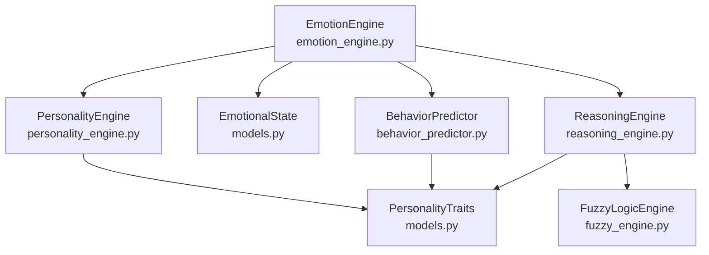
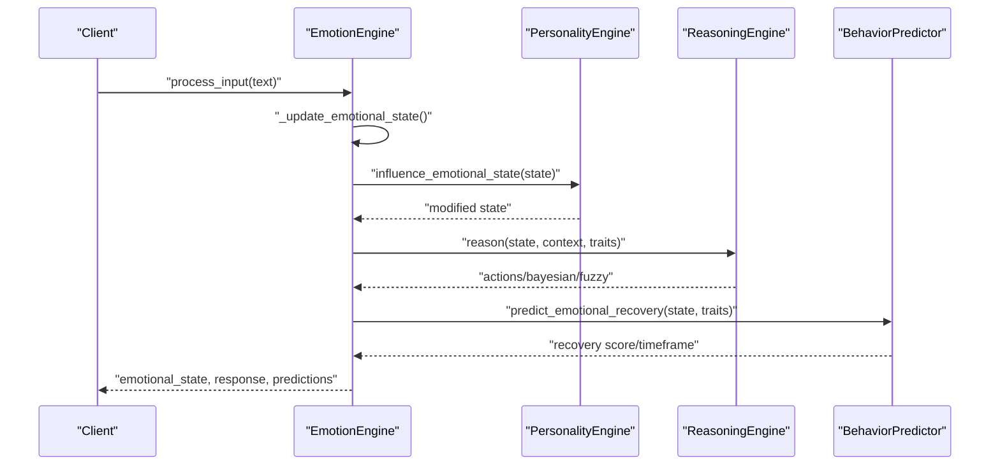
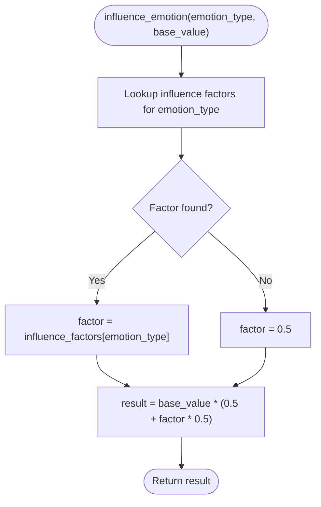
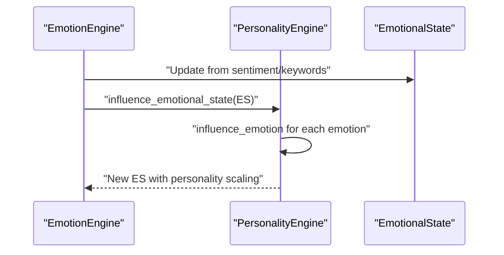
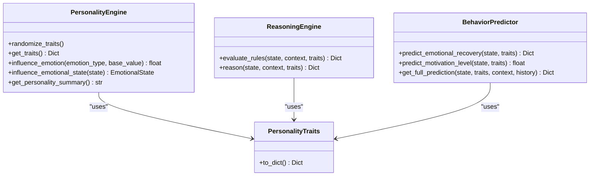
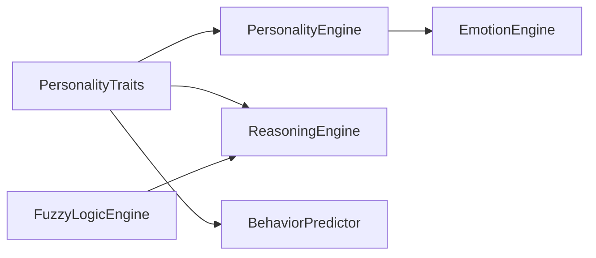

# Personality Influence Engine

<cite>
**Referenced Files in This Document**
- [personality_engine.py](file://psychologist/emotion_engine/personality_engine/personality_engine.py)
- [models.py](file://psychologist/emotion_engine/models.py)
- [emotion_engine.py](file://psychologist/emotion_engine/emotion_engine.py)
- [behavior_predictor.py](file://psychologist/emotion_engine/behavior_predictor/behavior_predictor.py)
- [reasoning_engine.py](file://psychologist/emotion_engine/reasoning_engine/reasoning_engine.py)
- [fuzzy_engine.py](file://psychologist/emotion_engine/fuzzy_logic/fuzzy_engine.py)
- [app.py](file://psychologist/app.py)
- [test_emotion_engine.py](file://psychologist/emotion_engine/tests/test_emotion_engine.py)
</cite>

## Table of Contents
1. [Introduction](#introduction)
2. [Project Structure](#project-structure)
3. [Core Components](#core-components)
4. [Architecture Overview](#architecture-overview)
5. [Detailed Component Analysis](#detailed-component-analysis)
6. [Dependency Analysis](#dependency-analysis)
7. [Performance Considerations](#performance-considerations)
8. [Troubleshooting Guide](#troubleshooting-guide)
9. [Conclusion](#conclusion)

## Introduction
This document describes the Personality Influence Engine, focusing on how personality traits influence emotional processing and behavior within the broader emotion engine. It explains the Big Five personality model implementation, trait-based emotional influence mechanisms, and how personality affects emotional responses. It also documents the PersonalityTraits data structure, trait scoring algorithms, and personality influence on emotional processing and response generation. Examples illustrate personality-influenced emotional processing and trait-based behavioral patterns.

## Project Structure
The Personality Influence Engine resides within the emotion engine subsystem and integrates with related engines for reasoning, behavior prediction, and fuzzy logic. Personality traits are represented by a dedicated data structure and influence both immediate emotional states and long-term behavioral predictions.

**Diagram sources**
- [personality_engine.py:6-67](file://psychologist/emotion_engine/personality_engine/personality_engine.py#L6-L67)
- [models.py:79-110](file://psychologist/emotion_engine/models.py#L79-L110)
- [emotion_engine.py:23-92](file://psychologist/emotion_engine/emotion_engine.py#L23-L92)
- [behavior_predictor.py:7-132](file://psychologist/emotion_engine/behavior_predictor/behavior_predictor.py#L7-L132)
- [reasoning_engine.py:86-204](file://psychologist/emotion_engine/reasoning_engine/reasoning_engine.py#L86-L204)
- [fuzzy_engine.py:4-80](file://psychologist/emotion_engine/fuzzy_logic/fuzzy_engine.py#L4-L80)

**Section sources**
- [personality_engine.py:1-67](file://psychologist/emotion_engine/personality_engine/personality_engine.py#L1-L67)
- [models.py:79-110](file://psychologist/emotion_engine/models.py#L79-L110)
- [emotion_engine.py:23-92](file://psychologist/emotion_engine/emotion_engine.py#L23-L92)

## Core Components
- PersonalityTraits: Defines personality dimensions and provides serialization to dictionary.
- PersonalityEngine: Applies personality influences to emotions and emotional states.
- EmotionEngine: Orchestrates input processing, updates emotional states, applies personality influence, and coordinates reasoning and behavior prediction.
- BehaviorPredictor: Uses personality traits to predict recovery, escalation, next emotions, engagement, and motivation.
- ReasoningEngine: Evaluates rules incorporating personality traits and emotion intensities; integrates fuzzy logic and Bayesian updates.
- FuzzyLogicEngine: Provides fuzzification and defuzzification for continuous adjustments to emotion intensities.

**Section sources**
- [models.py:79-110](file://psychologist/emotion_engine/models.py#L79-L110)
- [personality_engine.py:6-67](file://psychologist/emotion_engine/personality_engine/personality_engine.py#L6-L67)
- [emotion_engine.py:23-92](file://psychologist/emotion_engine/emotion_engine.py#L23-L92)
- [behavior_predictor.py:7-132](file://psychologist/emotion_engine/behavior_predictor/behavior_predictor.py#L7-L132)
- [reasoning_engine.py:86-204](file://psychologist/emotion_engine/reasoning_engine/reasoning_engine.py#L86-L204)
- [fuzzy_engine.py:4-80](file://psychologist/emotion_engine/fuzzy_logic/fuzzy_engine.py#L4-L80)

## Architecture Overview
Personality influences emotional processing through two primary pathways:
- Direct influence on emotion magnitudes during state updates.
- Indirect influence via reasoning and behavior prediction systems.

**Diagram sources**
- [emotion_engine.py:37-92](file://psychologist/emotion_engine/emotion_engine.py#L37-L92)
- [personality_engine.py:40-54](file://psychologist/emotion_engine/personality_engine/personality_engine.py#L40-L54)
- [reasoning_engine.py:185-204](file://psychologist/emotion_engine/reasoning_engine/reasoning_engine.py#L185-L204)
- [behavior_predictor.py:51-67](file://psychologist/emotion_engine/behavior_predictor/behavior_predictor.py#L51-L67)

## Detailed Component Analysis

### PersonalityTraits Data Structure
PersonalityTraits encapsulates personality dimensions with default values and supports conversion to dictionary form. The Big Five plus additional constructs are modeled as floating-point scores in [0.0, 1.0].

Key characteristics:
- Dimensions include openness, conscientiousness, extraversion, agreeableness, neuroticism, plus derived traits such as patience, compassion, confidence, assertiveness, curiosity, optimism, skepticism, and creativity.
- Provides a to_dict method for serialization and API exposure.

Implementation highlights:
- Defaults initialized in the dataclass fields.
- Serialization via to_dict for downstream consumers.

**Section sources**
- [models.py:79-110](file://psychologist/emotion_engine/models.py#L79-L110)

### PersonalityEngine: Trait-Based Emotional Influence
PersonalityEngine modifies emotional intensities and emotional states based on personality traits.

Direct influence mechanism:
- influence_emotion: Computes a multiplicative factor per emotion using trait values and returns a scaled base value.
- influence_emotional_state: Applies influence_emotion across primary, secondary, and advanced emotions.

Trait scoring algorithms:
- Happiness influenced by optimism.
- Sadness influenced by neuroticism.
- Anger influenced by neuroticism and inverse of patience.
- Fear influenced by neuroticism and inverse of confidence.
- Anxiety influenced by a weighted combination of neuroticism and inverse confidence.
- Confidence influenced by trait confidence.
- Curiosity influenced by curiosity × openness.
- Stress influenced by neuroticism and inverse of patience.
- Trust influenced by agreeableness.
- Empathy influenced by compassion × agreeableness.

**Diagram sources**
- [personality_engine.py:23-38](file://psychologist/emotion_engine/personality_engine/personality_engine.py#L23-L38)

Behavioral pattern examples:
- High openness and curiosity increase curiosity-driven exploration.
- High agreeableness and compassion amplify empathy and trust.
- High neuroticism increases vulnerability to sadness, fear, anxiety, and stress.
- High confidence reduces fear and stress susceptibility.

**Section sources**
- [personality_engine.py:6-67](file://psychologist/emotion_engine/personality_engine/personality_engine.py#L6-L67)

### Personality Influence on Emotional Responses
PersonalityEngine integrates with EmotionEngine to adjust emotional states after initial sentiment and keyword-driven updates.

Processing logic:
- EmotionEngine updates primary/secondary/advanced emotions from sentiment and keywords.
- EmotionEngine calls PersonalityEngine.influence_emotional_state to scale all emotion categories.
- Subsequent systems (reasoning, behavior prediction) consume the personality-adjusted state.

**Diagram sources**
- [emotion_engine.py:94-129](file://psychologist/emotion_engine/emotion_engine.py#L94-L129)
- [personality_engine.py:40-54](file://psychologist/emotion_engine/personality_engine/personality_engine.py#L40-L54)

**Section sources**
- [emotion_engine.py:94-129](file://psychologist/emotion_engine/emotion_engine.py#L94-L129)
- [personality_engine.py:40-54](file://psychologist/emotion_engine/personality_engine/personality_engine.py#L40-L54)

### Personality Adaptation Over Time
Personality traits themselves are not modified by the PersonalityEngine. However, personality influences emotional evolution and behavior prediction across sessions. The broader system includes an emotional evolution component that evolves self-image over time based on valence-congruent memories, indirectly reflecting personality-consistent adaptation.

Evidence:
- Emotional evolution system adjusts self-image traits based on recent memories’ valence and content relevance, with small random mutations applied.

Implication:
- While personality traits remain static in PersonalityEngine, personality-consistent changes in identity and values can emerge over time through memory-driven evolution.

**Section sources**
- [emotional_evolution_system.py:54-79](file://psychologist/scea/emotional_evolution/emotional_evolution_system.py#L54-L79)

### Personality Integration in Reasoning and Prediction
PersonalityEngine feeds traits into higher-level systems that use them for inference and prediction.

ReasoningEngine:
- Rules incorporate personality conditions (e.g., neuroticism thresholds, agreeableness thresholds).
- Evaluates rules against current emotional state and context to select appropriate modes and intensities.

BehaviorPredictor:
- Recovery prediction combines resilience (derived from personality), social support, and current intensity.
- Motivation prediction considers hope/confidence and personality optimism/confidence.

**Diagram sources**
- [personality_engine.py:6-67](file://psychologist/emotion_engine/personality_engine/personality_engine.py#L6-L67)
- [reasoning_engine.py:86-204](file://psychologist/emotion_engine/reasoning_engine/reasoning_engine.py#L86-L204)
- [behavior_predictor.py:51-132](file://psychologist/emotion_engine/behavior_predictor/behavior_predictor.py#L51-L132)
- [models.py:79-110](file://psychologist/emotion_engine/models.py#L79-L110)

**Section sources**
- [reasoning_engine.py:174-204](file://psychologist/emotion_engine/reasoning_engine/reasoning_engine.py#L174-L204)
- [behavior_predictor.py:51-132](file://psychologist/emotion_engine/behavior_predictor/behavior_predictor.py#L51-L132)

### API Exposure and Personality Management
Personality traits are exposed and modifiable via the application’s API endpoints.

Endpoints:
- GET /api/emotion/personality: Returns current personality traits.
- POST /api/emotion/personality: Accepts JSON of traits to update the personality engine.

Validation:
- JSON parsing and construction of PersonalityTraits; errors returned for invalid fields.

**Section sources**
- [app.py:179-194](file://psychologist/app.py#L179-L194)
- [models.py:79-110](file://psychologist/emotion_engine/models.py#L79-L110)

## Dependency Analysis
PersonalityEngine depends on PersonalityTraits for trait values and is consumed by EmotionEngine. ReasoningEngine and BehaviorPredictor depend on PersonalityTraits for rule evaluation and predictive modeling. FuzzyLogicEngine complements reasoning by adjusting emotion intensities fuzzily.

**Diagram sources**
- [models.py:79-110](file://psychologist/emotion_engine/models.py#L79-L110)
- [personality_engine.py:6-67](file://psychologist/emotion_engine/personality_engine/personality_engine.py#L6-L67)
- [emotion_engine.py:23-31](file://psychologist/emotion_engine/emotion_engine.py#L23-L31)
- [reasoning_engine.py:86-91](file://psychologist/emotion_engine/reasoning_engine/reasoning_engine.py#L86-L91)
- [behavior_predictor.py:1-3](file://psychologist/emotion_engine/behavior_predictor/behavior_predictor.py#L1-L3)
- [fuzzy_engine.py:4-80](file://psychologist/emotion_engine/fuzzy_logic/fuzzy_engine.py#L4-L80)

**Section sources**
- [emotion_engine.py:23-31](file://psychologist/emotion_engine/emotion_engine.py#L23-L31)
- [reasoning_engine.py:86-91](file://psychologist/emotion_engine/reasoning_engine/reasoning_engine.py#L86-L91)
- [behavior_predictor.py:1-3](file://psychologist/emotion_engine/behavior_predictor/behavior_predictor.py#L1-L3)

## Performance Considerations
- PersonalityEngine operations are O(N) in the number of emotions per state update.
- influence_emotion performs constant-time lookups and arithmetic; negligible overhead.
- PersonalityEngine.randomize_traits iterates over a fixed set of traits; suitable for initialization.
- Integrating personality into reasoning and behavior prediction adds minimal computational cost compared to other subsystems.

## Troubleshooting Guide
Common issues and diagnostics:
- Invalid personality traits in API:
  - Symptoms: 400 error with invalid field messages.
  - Cause: Unknown trait keys passed to PersonalityTraits constructor.
  - Resolution: Ensure only supported trait names are included.

- Personality not changing:
  - Symptoms: No effect on emotional responses.
  - Causes: Traits remain at defaults; ensure PersonalityEngine is constructed with custom traits or randomized.
  - Resolution: Call randomize_traits or set traits via API.

- Unexpected emotional magnitudes:
  - Symptoms: Emotions appear amplified or dampened.
  - Causes: Influence factors scale by 0.5 + trait * 0.5; extreme trait values near 0 or 1 yield strong scaling.
  - Resolution: Adjust trait values to desired sensitivity range.

**Section sources**
- [app.py:183-194](file://psychologist/app.py#L183-L194)
- [personality_engine.py:10-18](file://psychologist/emotion_engine/personality_engine/personality_engine.py#L10-L18)
- [personality_engine.py:23-38](file://psychologist/emotion_engine/personality_engine/personality_engine.py#L23-L38)

## Conclusion
The Personality Influence Engine augments emotional processing by applying trait-based scaling to emotion intensities and integrating personality into reasoning and behavior prediction. PersonalityTraits provides a flexible, serializable representation of individual differences, while PersonalityEngine offers straightforward, interpretable influence functions. Together with ReasoningEngine and BehaviorPredictor, personality shapes both immediate emotional responses and longer-term behavioral expectations. Although personality traits are not dynamically modified by PersonalityEngine, downstream systems enable personality-consistent adaptation over time through memory-driven evolution.