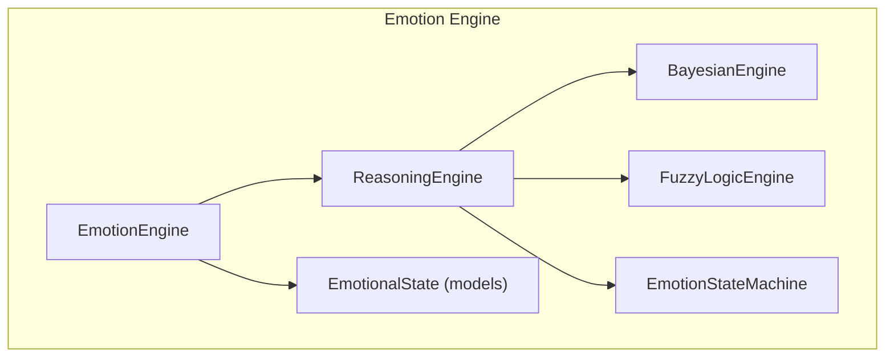
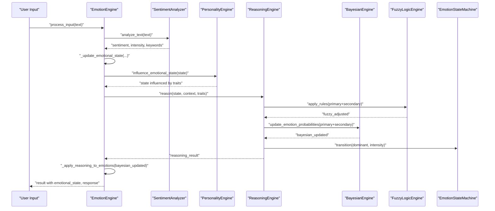
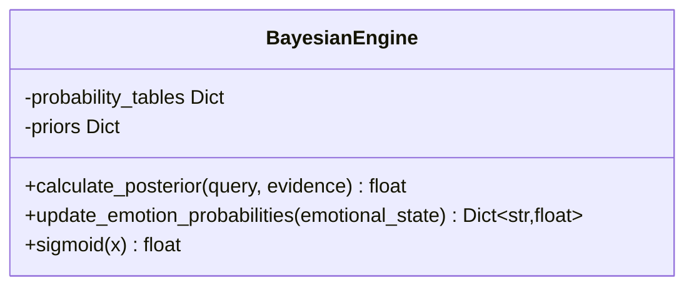
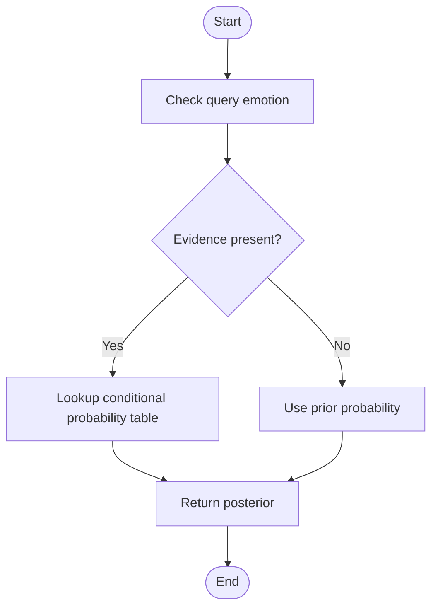
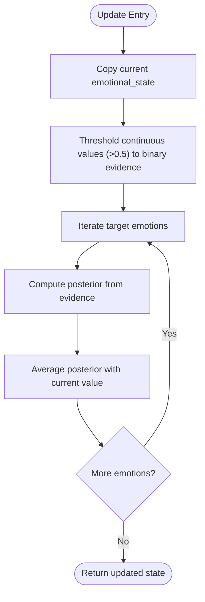
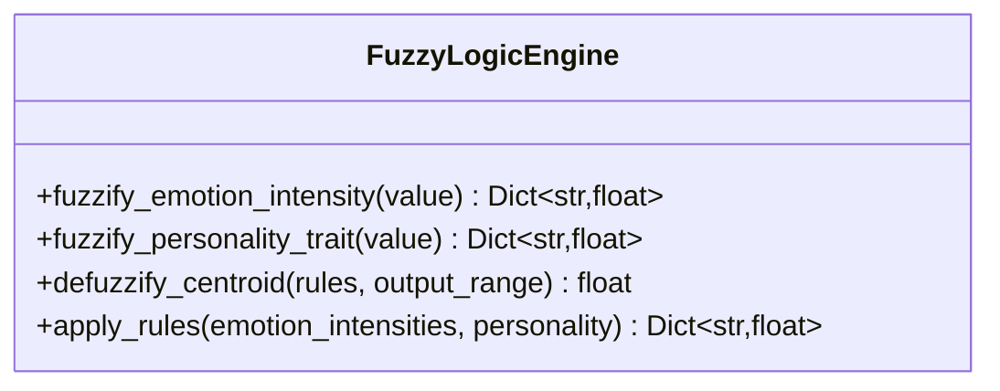
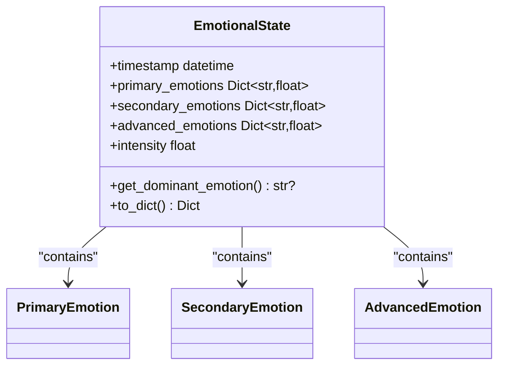
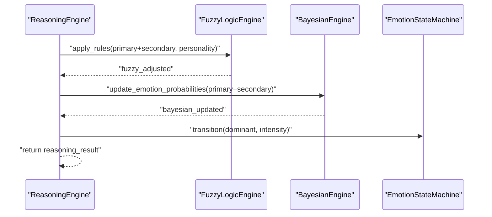
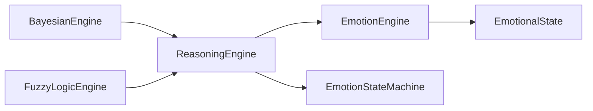
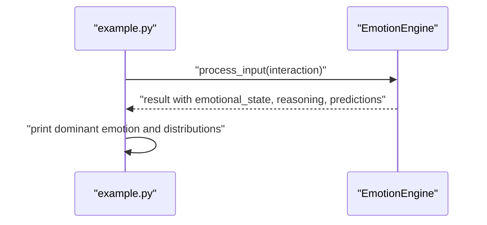

# Bayesian Reasoning Engine

<cite>
**Referenced Files in This Document**
- [bayesian_network.py](file://psychologist/emotion_engine/bayesian_engine/bayesian_network.py)
- [reasoning_engine.py](file://psychologist/emotion_engine/reasoning_engine/reasoning_engine.py)
- [emotion_engine.py](file://psychologist/emotion_engine/emotion_engine.py)
- [emotion_state_machine.py](file://psychologist/emotion_engine/state_machine/emotion_state_machine.py)
- [fuzzy_engine.py](file://psychologist/emotion_engine/fuzzy_logic/fuzzy_engine.py)
- [models.py](file://psychologist/emotion_engine/models.py)
- [system_constants.py](file://psychologist/system_constants.py)
- [example.py](file://psychologist/example.py)
</cite>

## Table of Contents
1. [Introduction](#introduction)
2. [Project Structure](#project-structure)
3. [Core Components](#core-components)
4. [Architecture Overview](#architecture-overview)
5. [Detailed Component Analysis](#detailed-component-analysis)
6. [Dependency Analysis](#dependency-analysis)
7. [Performance Considerations](#performance-considerations)
8. [Troubleshooting Guide](#troubleshooting-guide)
9. [Conclusion](#conclusion)
10. [Appendices](#appendices)

## Introduction
This document describes the Bayesian Reasoning Engine responsible for probabilistic emotion updates in the system. It explains how Bayesian networks infer emotional states from observed causes, how conditional probability tables encode these relationships, and how evidence is combined to compute posterior probabilities. The document also covers the integration with emotion intensity scaling and confidence scoring mechanisms, and demonstrates practical examples of updating emotion probabilities given new evidence.

## Project Structure
The Bayesian Reasoning Engine resides within the emotion engine subsystem and collaborates with other engines to produce coherent emotional reasoning and responses. The relevant modules include:
- BayesianEngine: Implements conditional probability lookups and posterior updates
- ReasoningEngine: Orchestrates rule evaluation, fuzzy adjustments, and Bayesian updates
- EmotionEngine: Drives the end-to-end pipeline and applies reasoning outcomes
- EmotionStateMachine: Provides state transitions informed by dominant emotions
- FuzzyLogicEngine: Converts crisp intensities into fuzzy sets for nuanced adjustments
- Models: Defines primary, secondary, and advanced emotion categories and state structures
- System constants: Provide tunable blending factors and thresholds

**Diagram sources**
- [emotion_engine.py:23-92](file://psychologist/emotion_engine/emotion_engine.py#L23-L92)
- [reasoning_engine.py:86-204](file://psychologist/emotion_engine/reasoning_engine/reasoning_engine.py#L86-L204)
- [emotion_state_machine.py:5-90](file://psychologist/emotion_engine/state_machine/emotion_state_machine.py#L5-L90)
- [fuzzy_engine.py:4-81](file://psychologist/emotion_engine/fuzzy_logic/fuzzy_engine.py#L4-L81)
- [bayesian_network.py:5-105](file://psychologist/emotion_engine/bayesian_engine/bayesian_network.py#L5-L105)
- [models.py:44-76](file://psychologist/emotion_engine/models.py#L44-L76)

**Section sources**
- [emotion_engine.py:23-92](file://psychologist/emotion_engine/emotion_engine.py#L23-L92)
- [reasoning_engine.py:86-204](file://psychologist/emotion_engine/reasoning_engine/reasoning_engine.py#L86-L204)
- [models.py:7-42](file://psychologist/emotion_engine/models.py#L7-L42)

## Core Components
- BayesianEngine: Maintains conditional probability tables and priors, computes posteriors from evidence, and updates emotion probabilities via averaging with current values.
- ReasoningEngine: Evaluates domain rules, applies fuzzy logic adjustments, invokes Bayesian updates, and manages emotion state transitions.
- EmotionEngine: Integrates sentiment, keywords, personality influence, and reasoning outputs into a unified emotional state with decay and memory.
- EmotionStateMachine: Encodes transition probabilities among primary, secondary, and advanced emotions.
- FuzzyLogicEngine: Provides membership functions and defuzzification to scale emotion intensities based on fuzzy rules.
- Models: Defines the taxonomy of emotions and the emotional state data structure.

**Section sources**
- [bayesian_network.py:5-105](file://psychologist/emotion_engine/bayesian_engine/bayesian_network.py#L5-L105)
- [reasoning_engine.py:86-204](file://psychologist/emotion_engine/reasoning_engine/reasoning_engine.py#L86-L204)
- [emotion_engine.py:23-184](file://psychologist/emotion_engine/emotion_engine.py#L23-L184)
- [emotion_state_machine.py:5-90](file://psychologist/emotion_engine/state_machine/emotion_state_machine.py#L5-L90)
- [fuzzy_engine.py:4-81](file://psychologist/emotion_engine/fuzzy_logic/fuzzy_engine.py#L4-L81)
- [models.py:7-42](file://psychologist/emotion_engine/models.py#L7-L42)

## Architecture Overview
The Bayesian Reasoning Engine participates in a multi-stage pipeline:
1. Input processing produces sentiment and keyword-driven emotion boosts.
2. Personality influences the emotional state.
3. Reasoning evaluates rules, applies fuzzy adjustments, and requests Bayesian updates.
4. BayesianEngine computes posteriors from conditional probabilities and priors, then averages with current emotion values.
5. The blended values are applied back to the emotional state.
6. State machine transitions may be triggered by dominant emotion and intensity.
7. Predictions and responses are generated based on the updated state.

**Diagram sources**
- [emotion_engine.py:37-92](file://psychologist/emotion_engine/emotion_engine.py#L37-L92)
- [reasoning_engine.py:185-204](file://psychologist/emotion_engine/reasoning_engine/reasoning_engine.py#L185-L204)
- [bayesian_network.py:73-101](file://psychologist/emotion_engine/bayesian_engine/bayesian_network.py#L73-L101)
- [emotion_state_machine.py:52-77](file://psychologist/emotion_engine/state_machine/emotion_state_machine.py#L52-L77)
- [fuzzy_engine.py:64-80](file://psychologist/emotion_engine/fuzzy_logic/fuzzy_engine.py#L64-L80)

## Detailed Component Analysis

### Bayesian Network Structure and Conditional Probabilities
The BayesianEngine encodes directed relationships between causes and effects:
- sadness depends on loneliness
- anxiety depends on stress and fear
- frustration depends on anger and stress
- excitement depends on happiness and curiosity
- trust depends on agreeableness
- confidence depends on success

Each conditional relationship is represented by a lookup table keyed by Boolean tuples indicating the truth values of parent nodes. Priors are maintained for all nodes.

**Diagram sources**
- [bayesian_network.py:5-105](file://psychologist/emotion_engine/bayesian_engine/bayesian_network.py#L5-L105)

**Section sources**
- [bayesian_network.py:10-52](file://psychologist/emotion_engine/bayesian_engine/bayesian_network.py#L10-L52)
- [bayesian_network.py:54-71](file://psychologist/emotion_engine/bayesian_engine/bayesian_network.py#L54-L71)

### Evidence Combination and Posterior Computation
Evidence is binary thresholded from continuous emotion values (greater than 0.5). The engine selects the appropriate conditional table based on the query emotion and available evidence, returning the corresponding conditional probability. If no specific conditional is defined, it falls back to the prior for the queried emotion.

**Diagram sources**
- [bayesian_network.py:54-71](file://psychologist/emotion_engine/bayesian_engine/bayesian_network.py#L54-L71)

**Section sources**
- [bayesian_network.py:54-71](file://psychologist/emotion_engine/bayesian_engine/bayesian_network.py#L54-L71)

### Updating Emotion Probabilities with Bayesian Updates
The update method converts continuous emotion values into binary evidence, computes posteriors for applicable emotions, and blends them with existing values by averaging. This soft fusion preserves historical values while incorporating new probabilistic insights.

**Diagram sources**
- [bayesian_network.py:73-101](file://psychologist/emotion_engine/bayesian_engine/bayesian_network.py#L73-L101)

**Section sources**
- [bayesian_network.py:73-101](file://psychologist/emotion_engine/bayesian_engine/bayesian_network.py#L73-L101)

### Integration with Emotion Intensity Scaling and Confidence Scoring
- Intensity scaling: The fuzzy logic engine converts emotion intensities into fuzzy sets and defuzzifies them to adjust emotion magnitudes based on fuzzy rules.
- Confidence scoring: While the BayesianEngine does not expose explicit confidence scores, the fused multimodal emotion system (outside this module) computes a confidence value derived from the dominant fused emotion. This illustrates how probabilistic updates can integrate with broader confidence mechanisms.

**Diagram sources**
- [fuzzy_engine.py:4-81](file://psychologist/emotion_engine/fuzzy_logic/fuzzy_engine.py#L4-L81)

**Section sources**
- [fuzzy_engine.py:28-80](file://psychologist/emotion_engine/fuzzy_logic/fuzzy_engine.py#L28-L80)

### Emotion Categories and State Representation
The system defines three hierarchical levels of emotions:
- Primary emotions: happiness, sadness, anger, fear, surprise, disgust
- Secondary emotions: excitement, anxiety, frustration, curiosity, hope, confidence, embarrassment, pride, jealousy, gratitude, sympathy, empathy
- Advanced emotions: burnout, motivation, stress, loneliness, trust, distrust, attachment, nostalgia, emotional fatigue, emotional recovery

EmotionalState aggregates these categories with an intensity scalar and provides helpers to retrieve dominant emotion and serialize state.

**Diagram sources**
- [models.py:44-76](file://psychologist/emotion_engine/models.py#L44-L76)
- [models.py:7-42](file://psychologist/emotion_engine/models.py#L7-L42)

**Section sources**
- [models.py:7-42](file://psychologist/emotion_engine/models.py#L7-L42)
- [models.py:44-76](file://psychologist/emotion_engine/models.py#L44-L76)

### Reasoning Pipeline and Bayesian Integration
The ReasoningEngine orchestrates:
- Rule evaluation to determine action modes
- Fuzzy adjustments to emotion intensities
- Bayesian updates to refine emotion probabilities
- State machine transitions based on dominant emotion and intensity

**Diagram sources**
- [reasoning_engine.py:185-204](file://psychologist/emotion_engine/reasoning_engine/reasoning_engine.py#L185-L204)
- [fuzzy_engine.py:64-80](file://psychologist/emotion_engine/fuzzy_logic/fuzzy_engine.py#L64-L80)
- [bayesian_network.py:73-101](file://psychologist/emotion_engine/bayesian_engine/bayesian_network.py#L73-L101)
- [emotion_state_machine.py:52-77](file://psychologist/emotion_engine/state_machine/emotion_state_machine.py#L52-L77)

**Section sources**
- [reasoning_engine.py:185-204](file://psychologist/emotion_engine/reasoning_engine/reasoning_engine.py#L185-L204)

### Practical Examples: Emotion Probability Updates
Below are example scenarios demonstrating how emotion probabilities are updated using the BayesianEngine. Replace the placeholders with actual emotion values from the current emotional state.

- Scenario A: Updating sadness given loneliness
  - Evidence: loneliness > 0.5
  - Posterior: P(sadness | loneliness=true) from the conditional table
  - Updated sadness: average of current sadness and posterior

- Scenario B: Updating anxiety given stress and fear
  - Evidence: stress > 0.5 and fear > 0.5
  - Posterior: P(anxiety | stress=true, fear=true)
  - Updated anxiety: average of current anxiety and posterior

- Scenario C: Updating frustration given anger and stress
  - Evidence: anger > 0.5 and stress > 0.5
  - Posterior: P(frustration | anger=true, stress=true)
  - Updated frustration: average of current frustration and posterior

- Scenario D: Updating excitement given happiness and curiosity
  - Evidence: happiness > 0.5 and curiosity > 0.5
  - Posterior: P(excitement | happiness=true, curiosity=true)
  - Updated excitement: average of current excitement and posterior

- Scenario E: Applying priors when no specific conditional exists
  - If no matching conditional, use the prior for the queried emotion

These updates are averaged with current emotion values to produce blended results that reflect both prior beliefs and new evidence.

**Section sources**
- [bayesian_network.py:73-101](file://psychologist/emotion_engine/bayesian_engine/bayesian_network.py#L73-L101)
- [bayesian_network.py:54-71](file://psychologist/emotion_engine/bayesian_engine/bayesian_network.py#L54-L71)

## Dependency Analysis
The BayesianEngine is consumed by the ReasoningEngine, which in turn is orchestrated by the EmotionEngine. The state machine consumes the dominant emotion to decide transitions. Fuzzy logic adjusts intensities independently but cooperatively with Bayesian updates.

**Diagram sources**
- [reasoning_engine.py:86-204](file://psychologist/emotion_engine/reasoning_engine/reasoning_engine.py#L86-L204)
- [emotion_engine.py:23-92](file://psychologist/emotion_engine/emotion_engine.py#L23-L92)
- [emotion_state_machine.py:5-90](file://psychologist/emotion_engine/state_machine/emotion_state_machine.py#L5-L90)
- [fuzzy_engine.py:4-81](file://psychologist/emotion_engine/fuzzy_logic/fuzzy_engine.py#L4-L81)
- [bayesian_network.py:5-105](file://psychologist/emotion_engine/bayesian_engine/bayesian_network.py#L5-L105)

**Section sources**
- [reasoning_engine.py:86-204](file://psychologist/emotion_engine/reasoning_engine/reasoning_engine.py#L86-L204)
- [emotion_engine.py:23-92](file://psychologist/emotion_engine/emotion_engine.py#L23-L92)

## Performance Considerations
- Complexity: The BayesianEngine performs constant-time lookups against precomputed tables and priors, making updates O(n) in the number of target emotions.
- Blending: Averaging posteriors with current values is linear in the number of updated emotions.
- Tuning: Constants such as blending weights and decay factors are centralized for easy adjustment without code changes.

[No sources needed since this section provides general guidance]

## Troubleshooting Guide
- Missing conditional probabilities: If a query emotion lacks a defined conditional, the engine falls back to its prior. Verify that the emotion and its parents are included in the tables.
- Threshold sensitivity: Binary evidence is derived from a > 0.5 threshold. Very close values near the threshold may flip between true and false depending on noise.
- Blending balance: The reasoning blend weights combine current and Bayesian values. Adjust the weights to emphasize either stability or responsiveness.
- State decay: Over time, emotion values decay multiplicatively. If updates seem to fade quickly, review the decay factor and blending weights.

**Section sources**
- [bayesian_network.py:54-71](file://psychologist/emotion_engine/bayesian_engine/bayesian_network.py#L54-L71)
- [emotion_engine.py:147-162](file://psychologist/emotion_engine/emotion_engine.py#L147-L162)
- [system_constants.py:14-24](file://psychologist/system_constants.py#L14-L24)

## Conclusion
The Bayesian Reasoning Engine augments the emotion system with principled probabilistic updates. By combining conditional probability tables, priors, and evidence-based posteriors, it refines emotional states in a way that respects both prior knowledge and new observations. Integrated with fuzzy logic and state transitions, it contributes to coherent, adaptive emotional reasoning and response generation.

[No sources needed since this section summarizes without analyzing specific files]

## Appendices

### Example Usage Walkthrough
The example script demonstrates end-to-end processing, including dominant emotion reporting, emotion distributions, reasoning mode, predicted next emotions, and engagement level.

**Diagram sources**
- [example.py:34-56](file://psychologist/example.py#L34-L56)
- [emotion_engine.py:37-92](file://psychologist/emotion_engine/emotion_engine.py#L37-L92)

**Section sources**
- [example.py:34-56](file://psychologist/example.py#L34-L56)