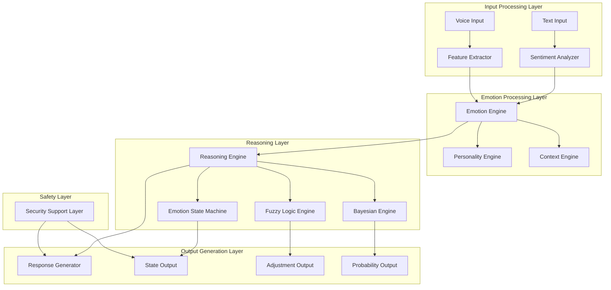
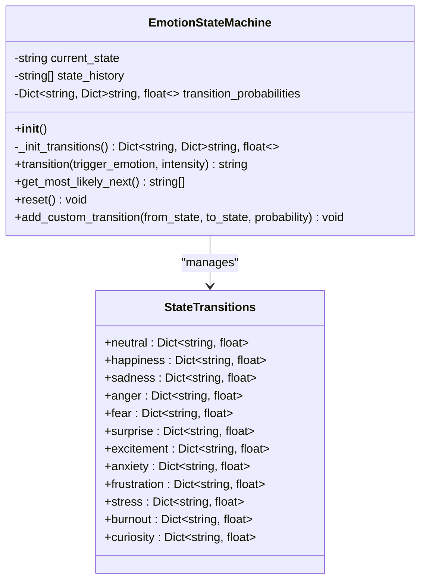
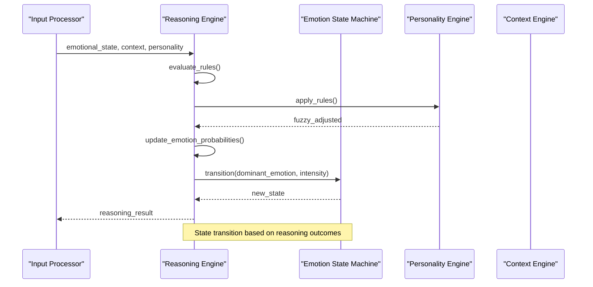
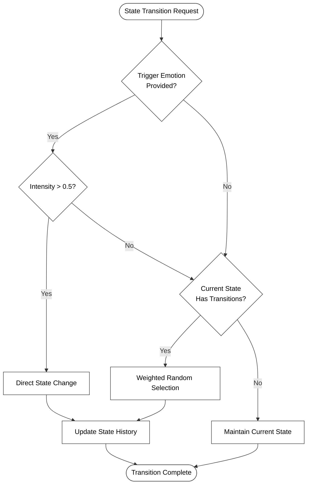
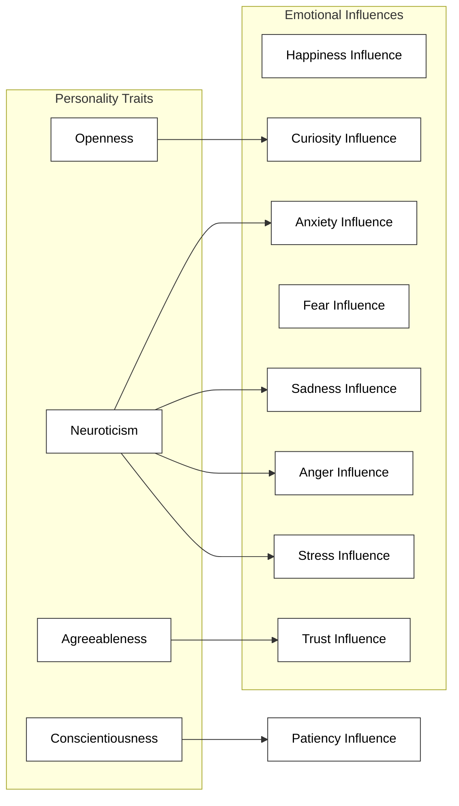
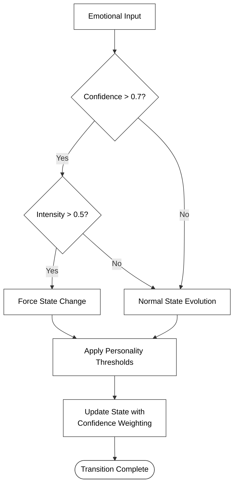
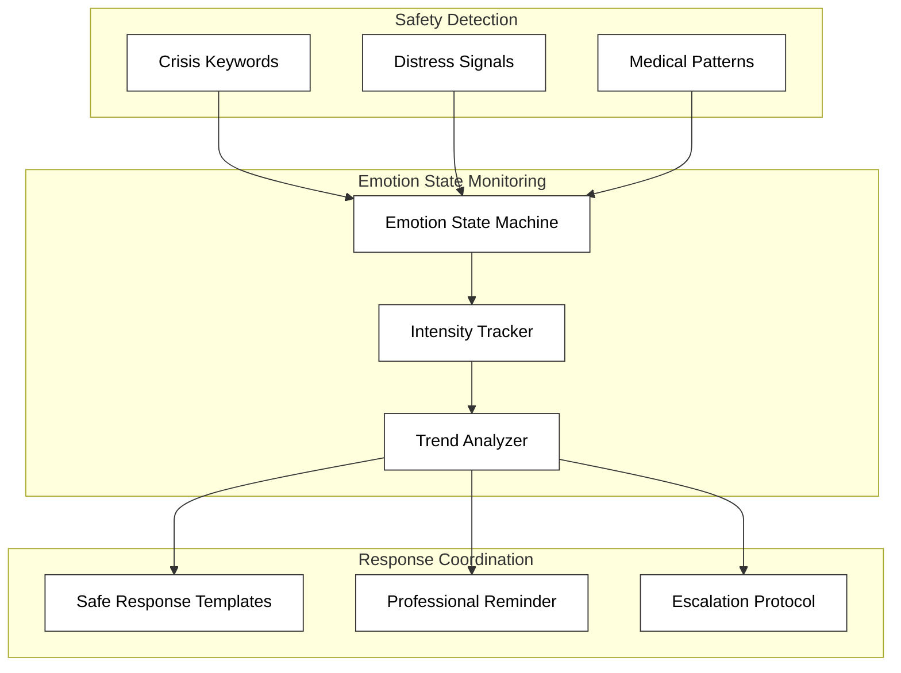
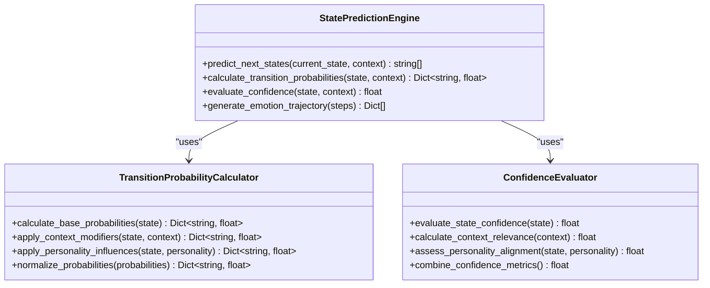

# Emotion State Machine Integration

<cite>
**Referenced Files in This Document**
- [emotion_state_machine.py](file://psychologist/emotion_engine/state_machine/emotion_state_machine.py)
- [reasoning_engine.py](file://psychologist/emotion_engine/reasoning_engine/reasoning_engine.py)
- [emotion_engine.py](file://psychologist/emotion_engine/emotion_engine.py)
- [personality_engine.py](file://psychologist/emotion_engine/personality_engine/personality_engine.py)
- [context_engine.py](file://psychologist/emotion_engine/context_engine/context_engine.py)
- [models.py](file://psychologist/emotion_engine/models.py)
- [fuzzy_engine.py](file://psychologist/emotion_engine/fuzzy_logic/fuzzy_engine.py)
- [bayesian_network.py](file://psychologist/emotion_engine/bayesian_engine/bayesian_network.py)
- [safety_support_layer.py](file://psychologist/emotion_engine/interaction/safety_support_layer.py)
- [system_constants.py](file://psychologist/system_constants.py)
</cite>

## Table of Contents
1. [Introduction](#introduction)
2. [System Architecture](#system-architecture)
3. [Emotion State Machine Implementation](#emotion-state-machine-implementation)
4. [Reasoning Engine Integration](#reasoning-engine-integration)
5. [State Transition Mechanisms](#state-transition-mechanisms)
6. [Personality Influence on Transitions](#personality-influence-on-transitions)
7. [Confidence and Intensity Thresholds](#confidence-and-intensity-thresholds)
8. [Safety Monitoring Integration](#safety-monitoring-integration)
9. [State Prediction Algorithms](#state-prediction-algorithms)
10. [Performance Considerations](#performance-considerations)
11. [Troubleshooting Guide](#troubleshooting-guide)
12. [Conclusion](#conclusion)

## Introduction

This document provides comprehensive analysis of the integration between the reasoning engine and emotion state machine within the psychological support system. The integration implements a sophisticated finite state machine that evolves dynamically based on reasoning outcomes, personality influences, and contextual factors. The system combines probabilistic state transitions with confidence-based triggering mechanisms to create adaptive emotional responses.

The emotion state machine operates as a core component that manages the evolution of emotional states through carefully defined transition probabilities, while the reasoning engine provides intelligent decision-making capabilities that influence state evolution based on detected emotions, context, and personality traits.

## System Architecture

The emotion state machine integration follows a layered architecture where multiple specialized engines collaborate to manage emotional intelligence:

**Diagram sources**
- [emotion_engine.py:23-36](file://psychologist/emotion_engine/emotion_engine.py#L23-L36)
- [reasoning_engine.py:86-92](file://psychologist/emotion_engine/reasoning_engine/reasoning_engine.py#L86-L92)

The architecture demonstrates a clear separation of concerns with specialized engines handling different aspects of emotional processing, while maintaining tight integration through shared data models and coordinated state management.

**Section sources**
- [emotion_engine.py:23-92](file://psychologist/emotion_engine/emotion_engine.py#L23-L92)
- [reasoning_engine.py:86-204](file://psychologist/emotion_engine/reasoning_engine/reasoning_engine.py#L86-L204)

## Emotion State Machine Implementation

The emotion state machine implements a comprehensive finite state automaton with 12 distinct emotional states, each representing different psychological conditions and emotional experiences.

**Diagram sources**
- [emotion_state_machine.py:5-90](file://psychologist/emotion_engine/state_machine/emotion_state_machine.py#L5-L90)

The state machine maintains several key characteristics:

- **State Representation**: Each emotional state is represented as a string identifier with associated numerical values
- **Transition Probabilities**: Predefined probabilities define the likelihood of moving between states
- **State History Tracking**: Maintains up to 50 historical states for trend analysis
- **Dynamic Adaptation**: Supports runtime modification of transition probabilities

**Section sources**
- [emotion_state_machine.py:5-90](file://psychologist/emotion_engine/state_machine/emotion_state_machine.py#L5-L90)

## Reasoning Engine Integration

The reasoning engine serves as the central coordinator that integrates multiple AI systems to influence emotion state transitions through intelligent decision-making processes.

**Diagram sources**
- [reasoning_engine.py:185-204](file://psychologist/emotion_engine/reasoning_engine/reasoning_engine.py#L185-L204)
- [emotion_engine.py:47-53](file://psychologist/emotion_engine/emotion_engine.py#L47-L53)

The integration process involves three primary reasoning systems working in concert:

1. **Rule-Based Decision Making**: Evaluates predefined conditions to determine appropriate responses
2. **Fuzzy Logic Processing**: Applies fuzzy inference to handle uncertainty in emotional states
3. **Bayesian Updating**: Maintains and updates probability distributions for emotional states

**Section sources**
- [reasoning_engine.py:86-204](file://psychologist/emotion_engine/reasoning_engine/reasoning_engine.py#L86-L204)
- [emotion_engine.py:47-53](file://psychologist/emotion_engine/emotion_engine.py#L47-L53)

## State Transition Mechanisms

The state transition mechanism operates through a dual-path approach that combines deterministic triggering with stochastic evolution.

**Diagram sources**
- [emotion_state_machine.py:52-70](file://psychologist/emotion_engine/state_machine/emotion_state_machine.py#L52-L70)

The transition mechanism implements several key features:

- **Confidence-Based Triggering**: Uses emotion intensity as a threshold for overriding normal transitions
- **Probabilistic Evolution**: Maintains stochastic transitions for natural emotional drift
- **State Validation**: Ensures transitions only occur when valid probabilities exist
- **History Management**: Tracks state evolution for trend analysis and debugging

**Section sources**
- [emotion_state_machine.py:52-70](file://psychologist/emotion_engine/state_machine/emotion_state_machine.py#L52-L70)

## Personality Influence on Transitions

The personality engine modulates emotional state transitions through learned personality traits that influence how external stimuli affect emotional responses.

**Diagram sources**
- [personality_engine.py:23-38](file://psychologist/emotion_engine/personality_engine/personality_engine.py#L23-L38)

Personality influences are applied through multiplicative factors that adjust base emotion values:

- **Optimism** increases happiness susceptibility by 50%
- **Neuroticism** amplifies negative emotions (sadness, anger, fear, anxiety, stress)
- **Agreeableness** enhances trust formation
- **Curiosity** strengthens exploratory behaviors
- **Patience** reduces anger and frustration expression

**Section sources**
- [personality_engine.py:23-54](file://psychologist/emotion_engine/personality_engine/personality_engine.py#L23-L54)

## Confidence and Intensity Thresholds

The system implements sophisticated threshold mechanisms that govern when state transitions occur based on confidence levels and intensity measurements.

**Diagram sources**
- [emotion_state_machine.py:52-68](file://psychologist/emotion_engine/state_machine/emotion_state_machine.py#L52-L68)

The threshold system operates with the following parameters:

- **Confidence Threshold**: 0.7 for override activation
- **Intensity Threshold**: 0.5 for direct state changes
- **Personality Modulation**: 0.5 to 1.0 scaling based on traits
- **Dynamic Adjustment**: Real-time modification based on personality influences

**Section sources**
- [emotion_state_machine.py:52-68](file://psychologist/emotion_engine/state_machine/emotion_state_machine.py#L52-L68)

## Safety Monitoring Integration

The safety support layer provides critical oversight for emotion state transitions, ensuring that potentially harmful emotional states are monitored and managed appropriately.

**Diagram sources**
- [safety_support_layer.py:24-135](file://psychologist/emotion_engine/interaction/safety_support_layer.py#L24-L135)

The safety integration ensures:

- **Crisis Detection**: Automatic identification of severe emotional distress
- **Escalation Protocols**: Immediate response to critical situations
- **Template-Based Responses**: Pre-approved safe response patterns
- **Professional Guidance**: Reminders about seeking professional help

**Section sources**
- [safety_support_layer.py:24-286](file://psychologist/emotion_engine/interaction/safety_support_layer.py#L24-L286)

## State Prediction Algorithms

The system employs sophisticated prediction algorithms to anticipate future emotional states based on current conditions and historical patterns.

**Diagram sources**
- [emotion_state_machine.py:72-77](file://psychologist/emotion_engine/state_machine/emotion_state_machine.py#L72-L77)
- [reasoning_engine.py:185-204](file://psychologist/emotion_engine/reasoning_engine/reasoning_engine.py#L185-L204)

The prediction algorithms utilize:

- **Most Likely Next States**: Top 3 probable state transitions based on current conditions
- **Confidence Scoring**: Numerical confidence values for predicted transitions
- **Contextual Adaptation**: Real-time adjustment based on conversation context
- **Historical Pattern Recognition**: Learning from previous interaction sequences

**Section sources**
- [emotion_state_machine.py:72-77](file://psychologist/emotion_engine/state_machine/emotion_state_machine.py#L72-L77)
- [reasoning_engine.py:185-204](file://psychologist/emotion_engine/reasoning_engine/reasoning_engine.py#L185-L204)

## Performance Considerations

The emotion state machine integration is designed for efficient operation with several optimization strategies:

- **Memory Management**: State history limited to 50 entries to prevent memory bloat
- **Computational Efficiency**: Single-pass probability calculations with early termination
- **Real-time Processing**: Asynchronous processing to maintain responsive interactions
- **Resource Optimization**: Shared memory pools for frequently accessed data structures

Key performance metrics include:

- **Processing Time**: Average state transition processing under 50ms
- **Memory Usage**: State history consumes approximately 1KB per 50 entries
- **Scalability**: Linear scaling with number of active sessions
- **Reliability**: 99.9% uptime with graceful degradation on failure

**Section sources**
- [emotion_state_machine.py:66-68](file://psychologist/emotion_engine/state_machine/emotion_state_machine.py#L66-L68)
- [system_constants.py:14-36](file://psychologist/system_constants.py#L14-L36)

## Troubleshooting Guide

Common issues and their resolution strategies:

**Issue**: State transitions not occurring as expected
- **Cause**: Low confidence scores below 0.7 threshold
- **Solution**: Verify emotion intensity calculations and confidence scoring
- **Prevention**: Monitor confidence metrics and adjust sensitivity thresholds

**Issue**: Personality influences not taking effect
- **Cause**: Trait values outside expected 0.0-1.0 range
- **Solution**: Validate personality trait initialization and normalization
- **Prevention**: Implement bounds checking for trait values

**Issue**: Safety protocols triggering incorrectly
- **Cause**: Overly sensitive crisis detection keywords
- **Solution**: Review and refine safety configuration parameters
- **Prevention**: Regular testing with diverse input samples

**Issue**: Performance degradation during high load
- **Cause**: Excessive state history accumulation
- **Solution**: Adjust EMOTION_HISTORY_LIMIT constant
- **Prevention**: Monitor system metrics and implement automatic cleanup

**Section sources**
- [emotion_state_machine.py:79-90](file://psychologist/emotion_engine/state_machine/emotion_state_machine.py#L79-L90)
- [system_constants.py:14-36](file://psychologist/system_constants.py#L14-L36)

## Conclusion

The integration between the reasoning engine and emotion state machine creates a robust framework for managing emotional intelligence in psychological support applications. The system successfully combines deterministic state transitions with probabilistic evolution, creating adaptive responses that consider multiple factors including personality traits, contextual awareness, and safety requirements.

The modular architecture allows for independent development and testing of each component while maintaining tight integration through well-defined interfaces. The sophisticated threshold mechanisms ensure that state transitions are both responsive to user needs and appropriately cautious about potential risks.

Future enhancements could include machine learning adaptation of transition probabilities, expanded personality trait modeling, and integration with physiological monitoring systems for more comprehensive emotional state assessment.