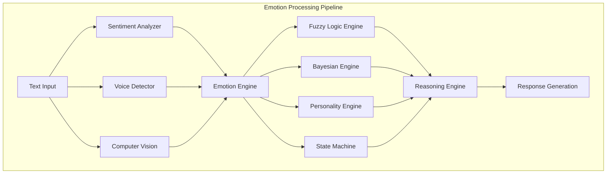
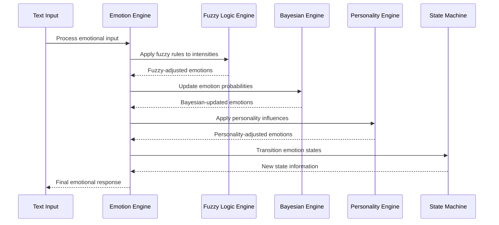
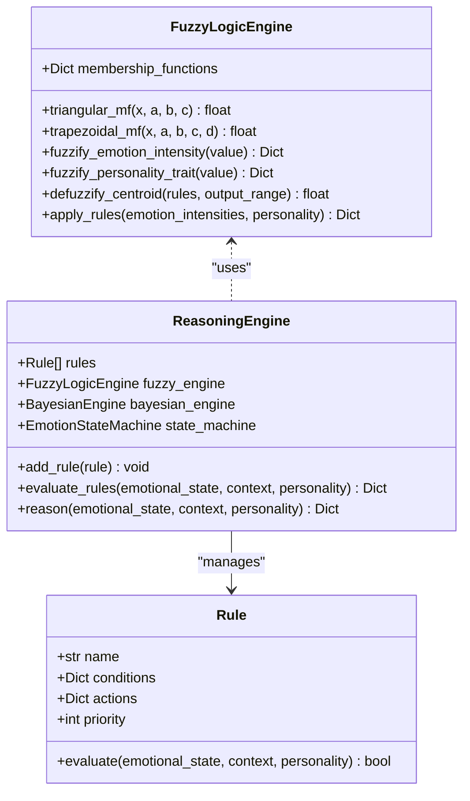
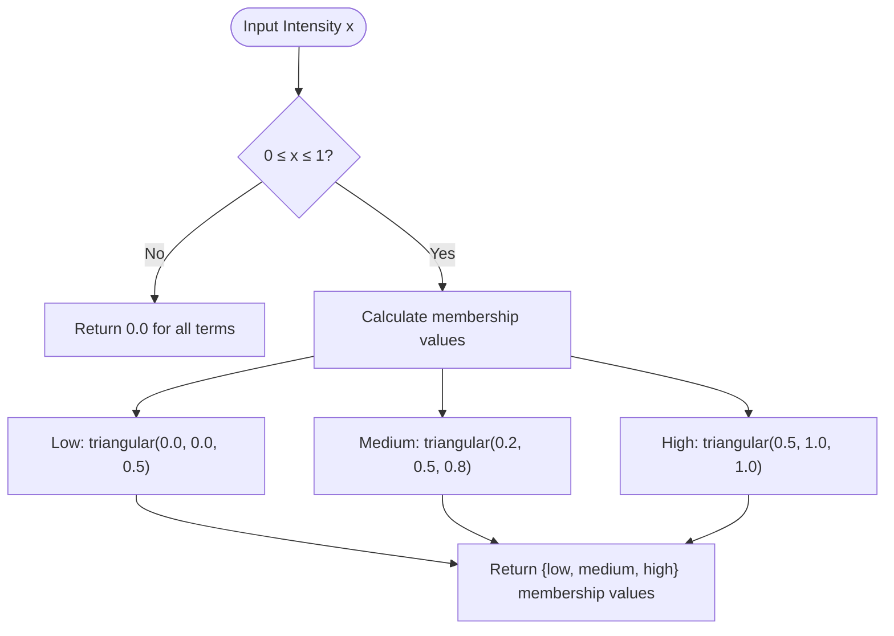
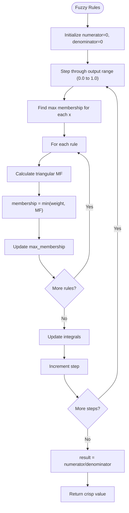
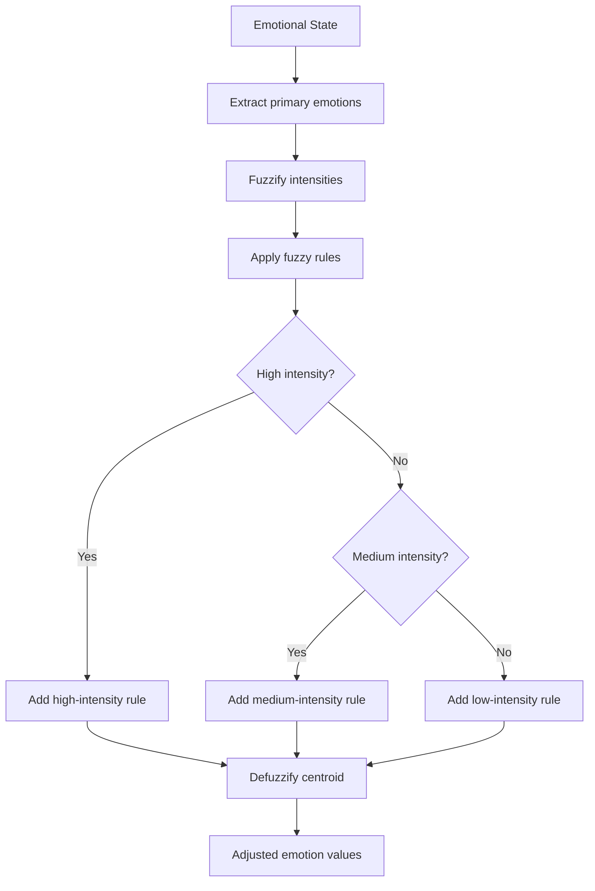
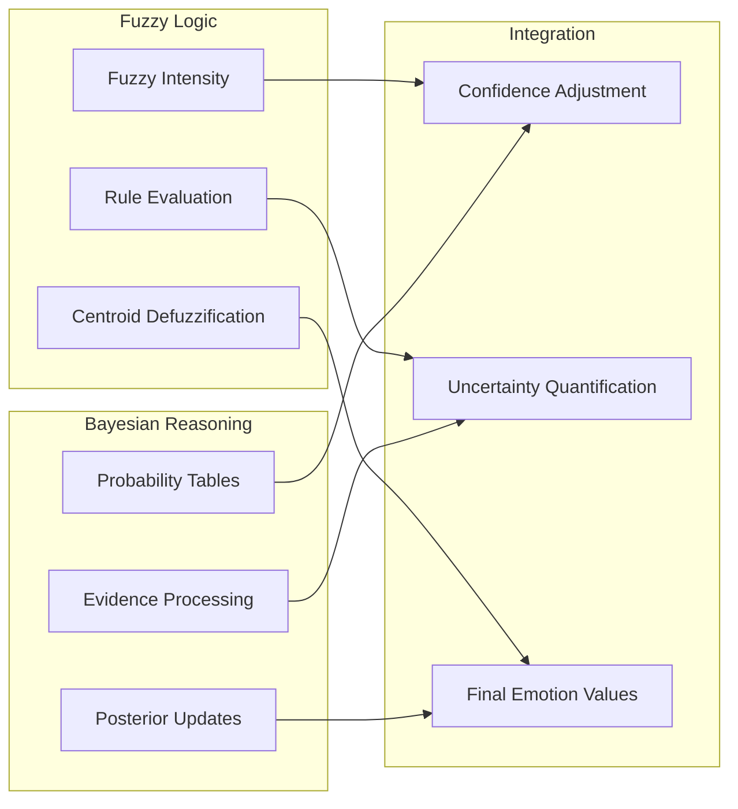
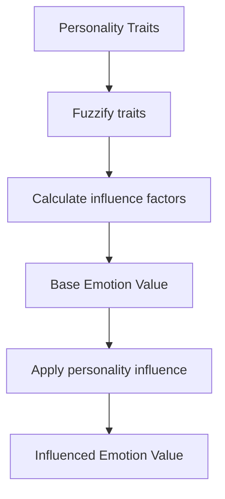
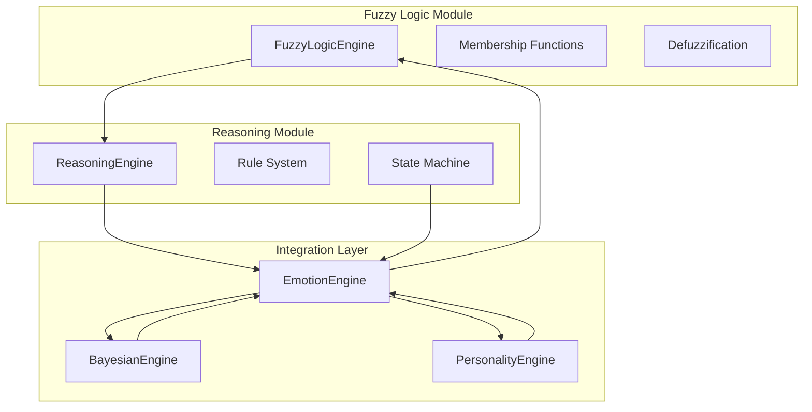

# Fuzzy Logic Reasoning Engine

<cite>
**Referenced Files in This Document**
- [fuzzy_engine.py](file://psychologist/emotion_engine/fuzzy_logic/fuzzy_engine.py)
- [__init__.py](file://psychologist/emotion_engine/fuzzy_logic/__init__.py)
- [reasoning_engine.py](file://psychologist/emotion_engine/reasoning_engine/reasoning_engine.py)
- [emotion_engine.py](file://psychologist/emotion_engine/emotion_engine.py)
- [models.py](file://psychologist/emotion_engine/models.py)
- [bayesian_network.py](file://psychologist/emotion_engine/bayesian_engine/bayesian_network.py)
- [personality_engine.py](file://psychologist/emotion_engine/personality_engine/personality_engine.py)
- [emotion_state_machine.py](file://psychologist/emotion_engine/state_machine/emotion_state_machine.py)
- [emotion_fusion.py](file://psychologist/emotion_engine/voice_system/emotion_fusion.py)
- [emotional_conflict_engine.py](file://psychologist/scea/conflict_engine/emotional_conflict_engine.py)
</cite>

## Table of Contents
1. [Introduction](#introduction)
2. [Project Structure](#project-structure)
3. [Core Components](#core-components)
4. [Architecture Overview](#architecture-overview)
5. [Detailed Component Analysis](#detailed-component-analysis)
6. [Dependency Analysis](#dependency-analysis)
7. [Performance Considerations](#performance-considerations)
8. [Troubleshooting Guide](#troubleshooting-guide)
9. [Conclusion](#conclusion)

## Introduction
This document provides comprehensive documentation for the Fuzzy Logic Reasoning Engine within the Psychologist AI system. The engine implements a fuzzy inference system designed to handle uncertainty in emotional states and decision-making. It combines fuzzy logic operations with probabilistic reasoning and personality influences to produce nuanced emotional responses.

The system operates on continuous emotion intensities represented as degrees of membership in linguistic terms (low, medium, high) rather than binary states. This approach enables sophisticated reasoning about conflicting emotions, gradual transitions, and uncertainty quantification.

## Project Structure
The fuzzy logic engine is integrated into the broader emotion processing pipeline:

**Diagram sources**
- [emotion_engine.py:37-92](file://psychologist/emotion_engine/emotion_engine.py#L37-L92)
- [reasoning_engine.py:185-204](file://psychologist/emotion_engine/reasoning_engine/reasoning_engine.py#L185-L204)

**Section sources**
- [emotion_engine.py:23-36](file://psychologist/emotion_engine/emotion_engine.py#L23-L36)
- [reasoning_engine.py:86-92](file://psychologist/emotion_engine/reasoning_engine/reasoning_engine.py#L86-L92)

## Core Components

### Fuzzy Logic Engine
The central component responsible for fuzzy inference operations, membership functions, and defuzzification.

Key capabilities:
- Triangular and trapezoidal membership functions
- Fuzzification of emotion intensities
- Rule-based fuzzy inference
- Centroid defuzzification
- Personality trait fuzzification

### Membership Functions
The system defines two primary membership function types:

**Triangular Membership Functions**: Used for emotion intensity classification
- Low: [0.0, 0.0, 0.5] - captures weak positive emotions
- Medium: [0.2, 0.5, 0.8] - captures moderate emotional states
- High: [0.5, 1.0, 1.0] - captures strong positive emotions

**Trapezoidal Membership Functions**: Used for personality trait classification
- Very Low: [0.0, 0.0, 0.1, 0.2]
- Low: [0.1, 0.25, 0.4]
- Medium: [0.3, 0.5, 0.7]
- High: [0.6, 0.75, 0.9]
- Very High: [0.8, 0.9, 1.0, 1.0]

### Fuzzy Operations
The engine implements fundamental fuzzy operations through membership functions:

**AND Operation**: Minimum operator (min(a, b))
**OR Operation**: Maximum operator (max(a, b))
**NOT Operation**: Complement operator (1 - x)

These operations enable complex fuzzy reasoning about emotion combinations and conflicts.

**Section sources**
- [fuzzy_engine.py:8-26](file://psychologist/emotion_engine/fuzzy_logic/fuzzy_engine.py#L8-L26)
- [fuzzy_engine.py:28-42](file://psychologist/emotion_engine/fuzzy_logic/fuzzy_engine.py#L28-L42)

## Architecture Overview

**Diagram sources**
- [emotion_engine.py:37-92](file://psychologist/emotion_engine/emotion_engine.py#L37-L92)
- [reasoning_engine.py:185-204](file://psychologist/emotion_engine/reasoning_engine/reasoning_engine.py#L185-L204)

The architecture integrates four complementary reasoning systems:
1. **Fuzzy Logic**: Handles uncertainty and gradual transitions
2. **Probabilistic Reasoning**: Updates likelihoods based on evidence
3. **Personality Influence**: Applies individual differences
4. **State Transitions**: Manages emotional state evolution

## Detailed Component Analysis

### Fuzzy Logic Engine Implementation

**Diagram sources**
- [fuzzy_engine.py:4-80](file://psychologist/emotion_engine/fuzzy_logic/fuzzy_engine.py#L4-L80)
- [reasoning_engine.py:8-92](file://psychologist/emotion_engine/reasoning_engine/reasoning_engine.py#L8-L92)

#### Fuzzification Process
The fuzzification process converts crisp emotion intensities into fuzzy sets:

**Diagram sources**
- [fuzzy_engine.py:28-33](file://psychologist/emotion_engine/fuzzy_logic/fuzzy_engine.py#L28-L33)

#### Defuzzification Process
The centroid defuzzification method converts fuzzy outputs back to crisp values:

**Diagram sources**
- [fuzzy_engine.py:44-62](file://psychologist/emotion_engine/fuzzy_logic/fuzzy_engine.py#L44-L62)

**Section sources**
- [fuzzy_engine.py:44-80](file://psychologist/emotion_engine/fuzzy_logic/fuzzy_engine.py#L44-L80)

### Rule-Based Fuzzy Inference

The reasoning engine applies fuzzy rules to emotional states:

**Diagram sources**
- [reasoning_engine.py:174-183](file://psychologist/emotion_engine/reasoning_engine/reasoning_engine.py#L174-L183)
- [fuzzy_engine.py:64-80](file://psychologist/emotion_engine/fuzzy_logic/fuzzy_engine.py#L64-L80)

**Section sources**
- [reasoning_engine.py:174-204](file://psychologist/emotion_engine/reasoning_engine/reasoning_engine.py#L174-L204)

### Integration with Probabilistic Reasoning

The fuzzy engine works alongside Bayesian reasoning for uncertainty quantification:

**Diagram sources**
- [bayesian_network.py:73-101](file://psychologist/emotion_engine/bayesian_engine/bayesian_network.py#L73-L101)
- [emotion_engine.py:131-145](file://psychologist/emotion_engine/emotion_engine.py#L131-L145)

**Section sources**
- [bayesian_network.py:54-101](file://psychologist/emotion_engine/bayesian_engine/bayesian_network.py#L54-L101)
- [emotion_engine.py:131-145](file://psychologist/emotion_engine/emotion_engine.py#L131-L145)

### Personality Influence Integration

Personality traits modulate emotional responses through fuzzified trait values:

**Diagram sources**
- [personality_engine.py:23-38](file://psychologist/emotion_engine/personality_engine/personality_engine.py#L23-L38)
- [personality_engine.py:40-54](file://psychologist/emotion_engine/personality_engine/personality_engine.py#L40-L54)

**Section sources**
- [personality_engine.py:23-54](file://psychologist/emotion_engine/personality_engine/personality_engine.py#L23-L54)

## Dependency Analysis

**Diagram sources**
- [fuzzy_engine.py:1-80](file://psychologist/emotion_engine/fuzzy_logic/fuzzy_engine.py#L1-L80)
- [reasoning_engine.py:1-92](file://psychologist/emotion_engine/reasoning_engine/reasoning_engine.py#L1-L92)
- [emotion_engine.py:1-36](file://psychologist/emotion_engine/emotion_engine.py#L1-L36)

**Section sources**
- [__init__.py:1-3](file://psychologist/emotion_engine/fuzzy_logic/__init__.py#L1-L3)
- [models.py:44-76](file://psychologist/emotion_engine/models.py#L44-L76)

## Performance Considerations

### Computational Complexity
- **Fuzzification**: O(n) where n is the number of linguistic terms
- **Rule Evaluation**: O(r × e) where r is rules and e is emotions
- **Defuzzification**: O(k) where k is discretization steps (currently 100 steps)
- **Overall**: O(r × e + k)

### Optimization Strategies
1. **Pre-computed Membership Functions**: Store computed membership values
2. **Early Termination**: Stop rule evaluation when sufficient confidence achieved
3. **Batch Processing**: Process multiple emotions simultaneously
4. **Caching**: Cache frequently used fuzzy values

### Memory Management
- Current implementation uses floating-point arithmetic
- Consider fixed-point arithmetic for embedded deployment
- Implement lazy evaluation for unused rules

## Troubleshooting Guide

### Common Issues and Solutions

**Issue**: Fuzzy outputs outside expected range
- **Cause**: Incorrect membership function parameters
- **Solution**: Verify triangular/trapezoidal parameters satisfy monotonicity

**Issue**: Slow defuzzification performance
- **Cause**: High discretization step count
- **Solution**: Reduce step count or implement adaptive sampling

**Issue**: Conflicting emotion resolutions
- **Cause**: Inconsistent rule priorities
- **Solution**: Review rule priority ordering and conditions

**Issue**: Personality influence inconsistencies
- **Cause**: Trait value normalization
- **Solution**: Ensure personality traits remain within [0,1] bounds

### Debugging Techniques
1. **Membership Function Validation**: Plot membership curves for verification
2. **Rule Trace Logging**: Track rule evaluation progress
3. **State Machine Monitoring**: Log state transitions and probabilities
4. **Confidence Analysis**: Monitor uncertainty metrics across iterations

**Section sources**
- [fuzzy_engine.py:8-26](file://psychologist/emotion_engine/fuzzy_logic/fuzzy_engine.py#L8-L26)
- [reasoning_engine.py:174-183](file://psychologist/emotion_engine/reasoning_engine/reasoning_engine.py#L174-L183)

## Conclusion

The Fuzzy Logic Reasoning Engine provides a robust framework for handling uncertainty in emotional processing. By combining fuzzy inference with probabilistic reasoning and personality influences, the system achieves nuanced emotional responses that adapt to individual characteristics and contextual factors.

Key strengths include:
- **Uncertainty Handling**: Continuous membership values capture gradual emotional transitions
- **Integration Flexibility**: Modular design allows easy addition of new reasoning components
- **Personalization**: Personality traits influence emotional interpretation and response
- **Scalability**: Rule-based architecture supports expansion with additional emotion categories

Future enhancements could include adaptive membership functions, real-time learning capabilities, and integration with additional modalities for multimodal emotion processing.