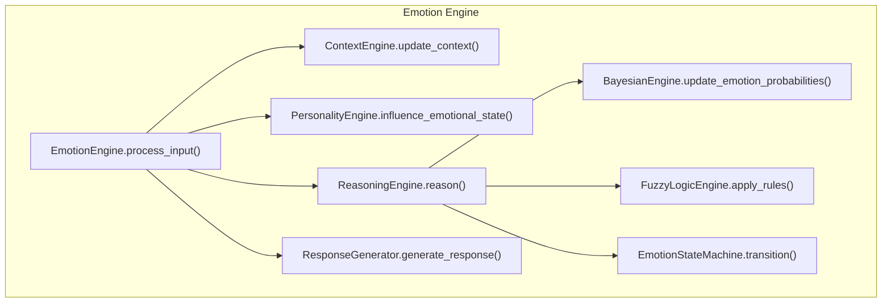
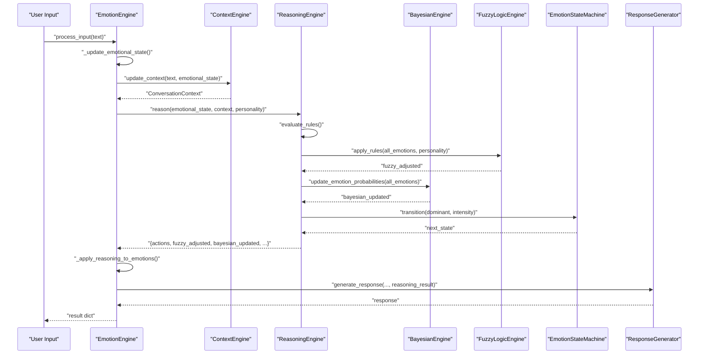
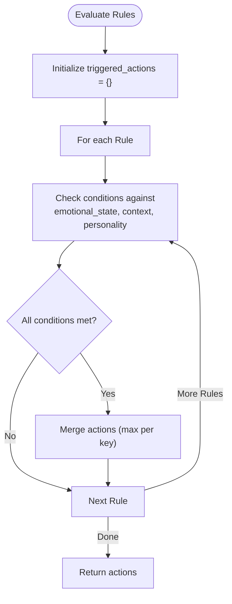
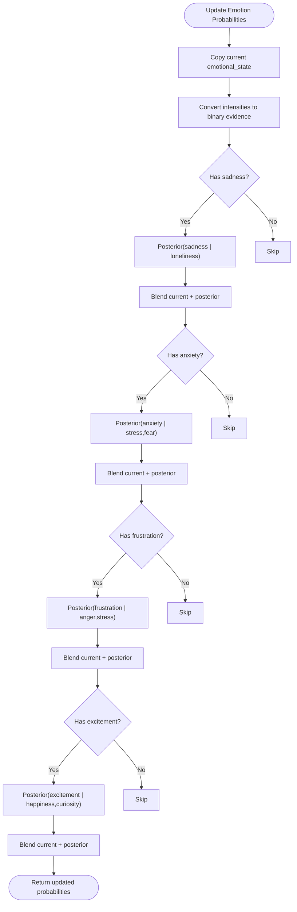
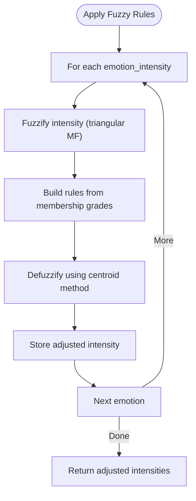
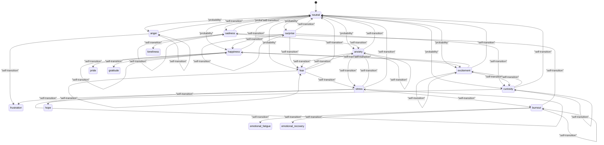
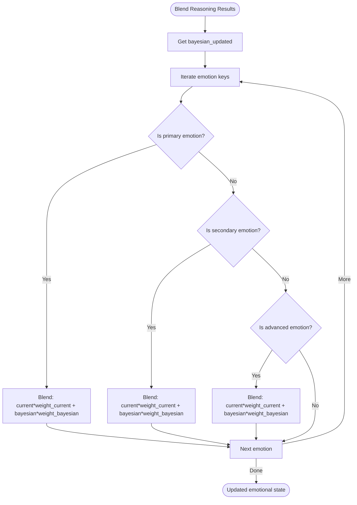
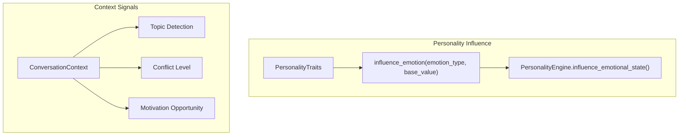
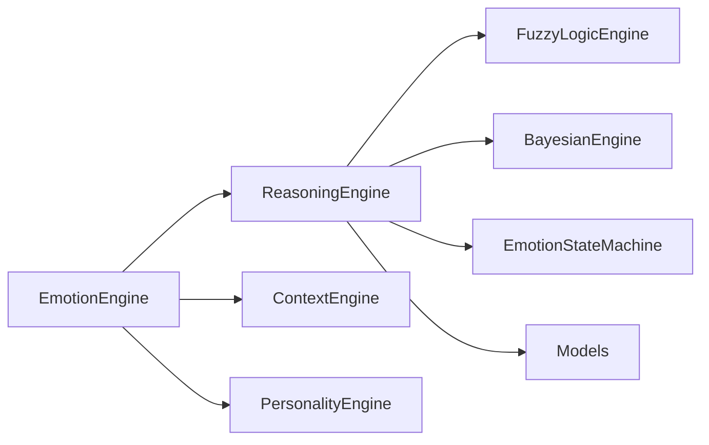

# Reasoning and Decision Engine

<cite>
**Referenced Files in This Document**
- [reasoning_engine.py](file://psychologist/emotion_engine/reasoning_engine/reasoning_engine.py)
- [bayesian_network.py](file://psychologist/emotion_engine/bayesian_engine/bayesian_network.py)
- [fuzzy_engine.py](file://psychologist/emotion_engine/fuzzy_logic/fuzzy_engine.py)
- [emotion_state_machine.py](file://psychologist/emotion_engine/state_machine/emotion_state_machine.py)
- [personality_engine.py](file://psychologist/emotion_engine/personality_engine/personality_engine.py)
- [models.py](file://psychologist/emotion_engine/models.py)
- [context_engine.py](file://psychologist/emotion_engine/context_engine/context_engine.py)
- [emotion_engine.py](file://psychologist/emotion_engine/emotion_engine.py)
- [system_constants.py](file://psychologist/system_constants.py)
</cite>

## Table of Contents
1. [Introduction](#introduction)
2. [Project Structure](#project-structure)
3. [Core Components](#core-components)
4. [Architecture Overview](#architecture-overview)
5. [Detailed Component Analysis](#detailed-component-analysis)
6. [Dependency Analysis](#dependency-analysis)
7. [Performance Considerations](#performance-considerations)
8. [Troubleshooting Guide](#troubleshooting-guide)
9. [Conclusion](#conclusion)

## Introduction
This document explains the Reasoning and Decision Engine responsible for intelligent emotional decision-making. The system combines two complementary reasoning modalities:
- Probabilistic reasoning via a Bayesian network for updating emotion probabilities based on observed evidence
- Fuzzy logic reasoning for handling uncertainty and imprecision in emotion intensities and personality traits

These modalities feed into a rule-based decision engine that selects appropriate interaction modes, predicts state transitions, and blends reasoning outcomes with current emotional states. The system integrates with personality and context engines to personalize responses and decisions.

## Project Structure
The reasoning subsystem resides under the emotion engine package and interacts with several specialized modules:
- Rule-based reasoning engine with condition-action rules
- Bayesian engine for probabilistic updates
- Fuzzy logic engine for uncertainty handling
- Emotion state machine for transitions
- Personality engine for trait-based influences
- Context engine for situational awareness
- Central emotion engine orchestrating the pipeline

**Diagram sources**
- [emotion_engine.py:37-92](file://psychologist/emotion_engine/emotion_engine.py#L37-L92)
- [reasoning_engine.py:185-204](file://psychologist/emotion_engine/reasoning_engine/reasoning_engine.py#L185-L204)
- [bayesian_network.py:73-101](file://psychologist/emotion_engine/bayesian_engine/bayesian_network.py#L73-L101)
- [fuzzy_engine.py:64-80](file://psychologist/emotion_engine/fuzzy_logic/fuzzy_engine.py#L64-L80)
- [emotion_state_machine.py:52-70](file://psychologist/emotion_engine/state_machine/emotion_state_machine.py#L52-L70)

**Section sources**
- [emotion_engine.py:23-36](file://psychologist/emotion_engine/emotion_engine.py#L23-L36)
- [reasoning_engine.py:86-92](file://psychologist/emotion_engine/reasoning_engine/reasoning_engine.py#L86-L92)

## Core Components
- Rule-based Reasoning Engine: Evaluates condition-action rules against current emotional state, context, and personality traits to select interaction modes and action parameters.
- Bayesian Engine: Updates emotion probabilities using conditional probability tables and priors based on observed evidence.
- Fuzzy Logic Engine: Applies fuzzification and defuzzification to handle imprecision in emotion intensities and personality traits.
- Emotion State Machine: Manages discrete emotion state transitions with probabilistic dynamics.
- Personality Engine: Influences emotional states based on personality traits.
- Context Engine: Maintains contextual signals (topic, sentiment trend, conflict level, motivation opportunity).
- Central Emotion Engine: Orchestrates the end-to-end pipeline, blending reasoning results with current states.

**Section sources**
- [reasoning_engine.py:8-83](file://psychologist/emotion_engine/reasoning_engine/reasoning_engine.py#L8-L83)
- [reasoning_engine.py:86-204](file://psychologist/emotion_engine/reasoning_engine/reasoning_engine.py#L86-L204)
- [bayesian_network.py:5-104](file://psychologist/emotion_engine/bayesian_engine/bayesian_network.py#L5-L104)
- [fuzzy_engine.py:4-80](file://psychologist/emotion_engine/fuzzy_logic/fuzzy_engine.py#L4-L80)
- [emotion_state_machine.py:5-89](file://psychologist/emotion_engine/state_machine/emotion_state_machine.py#L5-L89)
- [personality_engine.py:6-67](file://psychologist/emotion_engine/personality_engine/personality_engine.py#L6-L67)
- [context_engine.py:9-116](file://psychologist/emotion_engine/context_engine/context_engine.py#L9-L116)
- [emotion_engine.py:23-92](file://psychologist/emotion_engine/emotion_engine.py#L23-L92)

## Architecture Overview
The reasoning pipeline operates in a closed-loop manner:
1. Input text is processed to extract sentiment and emotion keywords, updating the current emotional state.
2. Context is updated with topic detection, sentiment trends, conflict level, and motivation opportunity.
3. The reasoning engine evaluates rules, applies fuzzy logic adjustments, and updates emotion probabilities via the Bayesian engine.
4. The emotion state machine transitions to likely next states based on the dominant emotion and intensity.
5. The central emotion engine blends Bayesian updates with current emotion values and decays states over time.
6. A response is generated based on the selected mode and personalization rules.

**Diagram sources**
- [emotion_engine.py:37-92](file://psychologist/emotion_engine/emotion_engine.py#L37-L92)
- [reasoning_engine.py:174-204](file://psychologist/emotion_engine/reasoning_engine/reasoning_engine.py#L174-L204)
- [bayesian_network.py:73-101](file://psychologist/emotion_engine/bayesian_engine/bayesian_network.py#L73-L101)
- [fuzzy_engine.py:64-80](file://psychologist/emotion_engine/fuzzy_logic/fuzzy_engine.py#L64-L80)
- [emotion_state_machine.py:52-70](file://psychologist/emotion_engine/state_machine/emotion_state_machine.py#L52-L70)
- [response_generator.py:77-85](file://psychologist/emotion_engine/response_generator/response_generator.py#L77-L85)

## Detailed Component Analysis

### Rule-Based Reasoning Engine
The rule engine defines condition-action rules keyed by emotion thresholds, context signals, and personality traits. Each rule encapsulates:
- Conditions: primary/secondary/advanced emotion thresholds, context attributes, and personality trait thresholds
- Actions: a dictionary of mode and parameter values
- Priority: controls evaluation order

Evaluation logic:
- Iterates through rules and checks each condition against the current state
- Supports comparison operators (> , < , >= , <= ) and direct thresholds
- Aggregates triggered actions by taking the maximum value per key

Decision output:
- Returns aggregated actions and mode selection
- Provides fuzzy-adjusted and Bayesian-updated emotion distributions
- Reports current FSM state and most likely next states

**Diagram sources**
- [reasoning_engine.py:15-83](file://psychologist/emotion_engine/reasoning_engine/reasoning_engine.py#L15-L83)
- [reasoning_engine.py:174-183](file://psychologist/emotion_engine/reasoning_engine/reasoning_engine.py#L174-L183)

**Section sources**
- [reasoning_engine.py:8-83](file://psychologist/emotion_engine/reasoning_engine/reasoning_engine.py#L8-L83)
- [reasoning_engine.py:86-204](file://psychologist/emotion_engine/reasoning_engine/reasoning_engine.py#L86-L204)

### Bayesian Network for Probabilistic Emotion Updates
The Bayesian engine maintains:
- Conditional probability tables for emotion relationships
- Priors for baseline probabilities
- Evidence-based posterior calculations

Key operations:
- Evidence conversion: converts continuous emotion intensities into binary evidence using thresholding
- Posterior calculation: computes P(query | evidence) using pre-defined conditional tables
- Probability blending: averages current emotion values with posterior probabilities

**Diagram sources**
- [bayesian_network.py:73-101](file://psychologist/emotion_engine/bayesian_engine/bayesian_network.py#L73-L101)
- [bayesian_network.py:54-71](file://psychologist/emotion_engine/bayesian_engine/bayesian_network.py#L54-L71)

**Section sources**
- [bayesian_network.py:5-104](file://psychologist/emotion_engine/bayesian_engine/bayesian_network.py#L5-L104)

### Fuzzy Logic for Uncertainty Handling
The fuzzy engine:
- Defines membership functions for emotion intensities and personality traits
- Fuzzifies inputs using triangular and trapezoidal membership functions
- Applies rule-based aggregation and centroid defuzzification to produce crisp outputs

Processing pipeline:
- For each emotion intensity, compute membership grades for low/medium/high
- For personality traits, compute membership grades for very_low/low/medium/high/very_high
- Aggregate rule outputs and defuzzify to a single numeric value per emotion

**Diagram sources**
- [fuzzy_engine.py:28-42](file://psychologist/emotion_engine/fuzzy_logic/fuzzy_engine.py#L28-L42)
- [fuzzy_engine.py:64-80](file://psychologist/emotion_engine/fuzzy_logic/fuzzy_engine.py#L64-L80)

**Section sources**
- [fuzzy_engine.py:4-80](file://psychologist/emotion_engine/fuzzy_logic/fuzzy_engine.py#L4-L80)

### Emotion State Transition Mechanisms
The emotion state machine:
- Maintains a current state and history
- Defines transition probabilities between discrete emotion states
- Transitions either deterministically (when triggered) or probabilistically based on current state
- Provides the most likely next states for prediction

Transition logic:
- If a trigger emotion is provided and intensity threshold is met, transition to that emotion
- Otherwise, sample next state according to transition probabilities
- Tracks history and caps it to prevent unbounded growth

**Diagram sources**
- [emotion_state_machine.py:11-50](file://psychologist/emotion_engine/state_machine/emotion_state_machine.py#L11-L50)
- [emotion_state_machine.py:52-77](file://psychologist/emotion_engine/state_machine/emotion_state_machine.py#L52-L77)

**Section sources**
- [emotion_state_machine.py:5-89](file://psychologist/emotion_engine/state_machine/emotion_state_machine.py#L5-L89)

### Reasoning Confidence Scoring and Blending
Confidence scoring:
- The system does not expose explicit confidence scores; however, the blending mechanism implicitly weights current state versus Bayesian updates
- The central emotion engine blends Bayesian updates with current values using configurable weights

Blending mechanism:
- Current state values are weighted by a configured factor
- Bayesian-updated values are weighted by another configured factor
- The sum of weights determines the degree of belief in reasoning-driven updates

**Diagram sources**
- [emotion_engine.py:131-145](file://psychologist/emotion_engine/emotion_engine.py#L131-L145)
- [system_constants.py:20-24](file://psychologist/system_constants.py#L20-L24)

**Section sources**
- [emotion_engine.py:131-145](file://psychologist/emotion_engine/emotion_engine.py#L131-L145)
- [system_constants.py:20-24](file://psychologist/system_constants.py#L20-L24)

### Integration with Personality and Context Systems
Personality influence:
- Personality traits modulate base emotion values via multiplicative factors
- Trait-based influences vary by emotion type (e.g., optimism affects happiness, neuroticism affects sadness/anger/anxiety)

Context signals:
- Topic detection, keyword extraction, sentiment trends, conflict level, and motivation opportunity inform reasoning rules and response personalization

**Diagram sources**
- [personality_engine.py:23-54](file://psychologist/emotion_engine/personality_engine/personality_engine.py#L23-L54)
- [context_engine.py:24-46](file://psychologist/emotion_engine/context_engine/context_engine.py#L24-L46)

**Section sources**
- [personality_engine.py:6-67](file://psychologist/emotion_engine/personality_engine/personality_engine.py#L6-L67)
- [context_engine.py:9-116](file://psychologist/emotion_engine/context_engine/context_engine.py#L9-L116)

## Dependency Analysis
The reasoning engine depends on:
- Fuzzy logic engine for uncertainty handling
- Bayesian engine for probabilistic updates
- Emotion state machine for transitions
- Models for data structures
- Context and personality engines for inputs

**Diagram sources**
- [reasoning_engine.py:1-5](file://psychologist/emotion_engine/reasoning_engine/reasoning_engine.py#L1-L5)
- [emotion_engine.py:1-9](file://psychologist/emotion_engine/emotion_engine.py#L1-L9)

**Section sources**
- [reasoning_engine.py:1-5](file://psychologist/emotion_engine/reasoning_engine/reasoning_engine.py#L1-L5)
- [emotion_engine.py:1-9](file://psychologist/emotion_engine/emotion_engine.py#L1-L9)

## Performance Considerations
- Rule evaluation complexity scales linearly with the number of rules; keep rule sets pruned and prioritized
- Fuzzy defuzzification uses numerical integration over a fixed step grid; adjust step size for accuracy/performance trade-offs
- Bayesian updates are constant-time per emotion; ensure evidence conversion remains efficient
- State machine transitions are O(1); transition probability lookups are constant-time
- Memory usage grows with emotional history and conversation history limits; tune constants accordingly

## Troubleshooting Guide
Common issues and resolutions:
- No mode selected: Verify rule conditions cover the current state; ensure thresholds are reasonable
- Unexpected emotion intensities: Check fuzzy defuzzification parameters and membership function shapes
- Stuck in a loop of transitions: Review transition probabilities and ensure self-transitions are balanced
- Overly sensitive to context: Adjust context signal thresholds and weights
- Slow performance: Reduce rule count, simplify fuzzy membership functions, or increase step sizes

**Section sources**
- [reasoning_engine.py:174-183](file://psychologist/emotion_engine/reasoning_engine/reasoning_engine.py#L174-L183)
- [fuzzy_engine.py:44-62](file://psychologist/emotion_engine/fuzzy_logic/fuzzy_engine.py#L44-L62)
- [emotion_state_machine.py:52-77](file://psychologist/emotion_engine/state_machine/emotion_state_machine.py#L52-L77)

## Conclusion
The Reasoning and Decision Engine provides a robust dual-mode system that combines probabilistic Bayesian updates with fuzzy logic reasoning to guide emotional decision-making. By integrating personality and context signals, the system adapts responses dynamically while maintaining stability through emotion state transitions and controlled blending of reasoning outcomes with current emotional states.