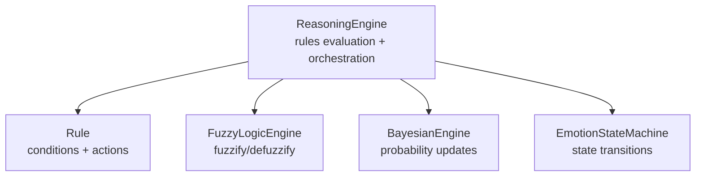
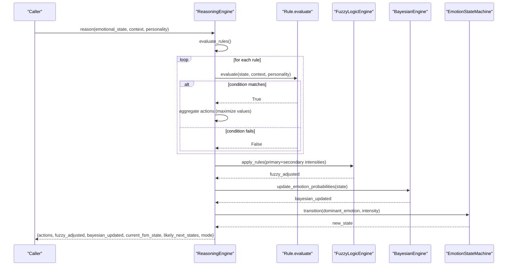
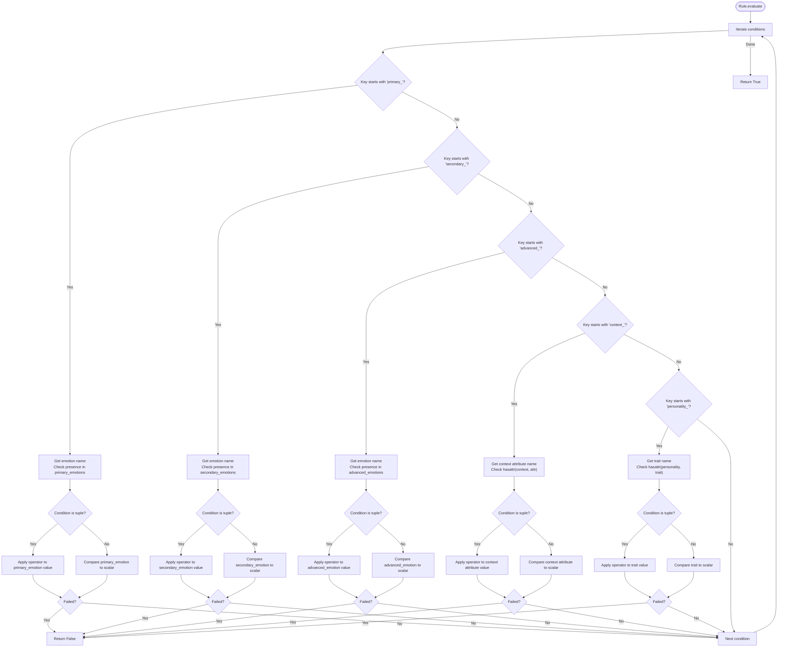
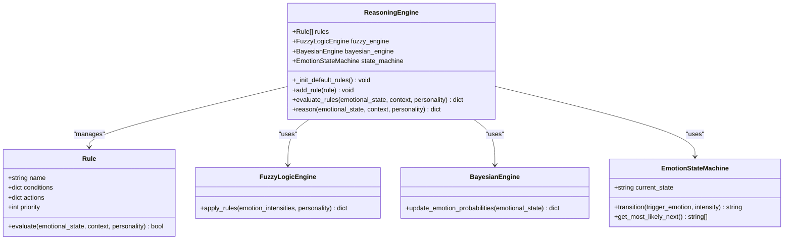
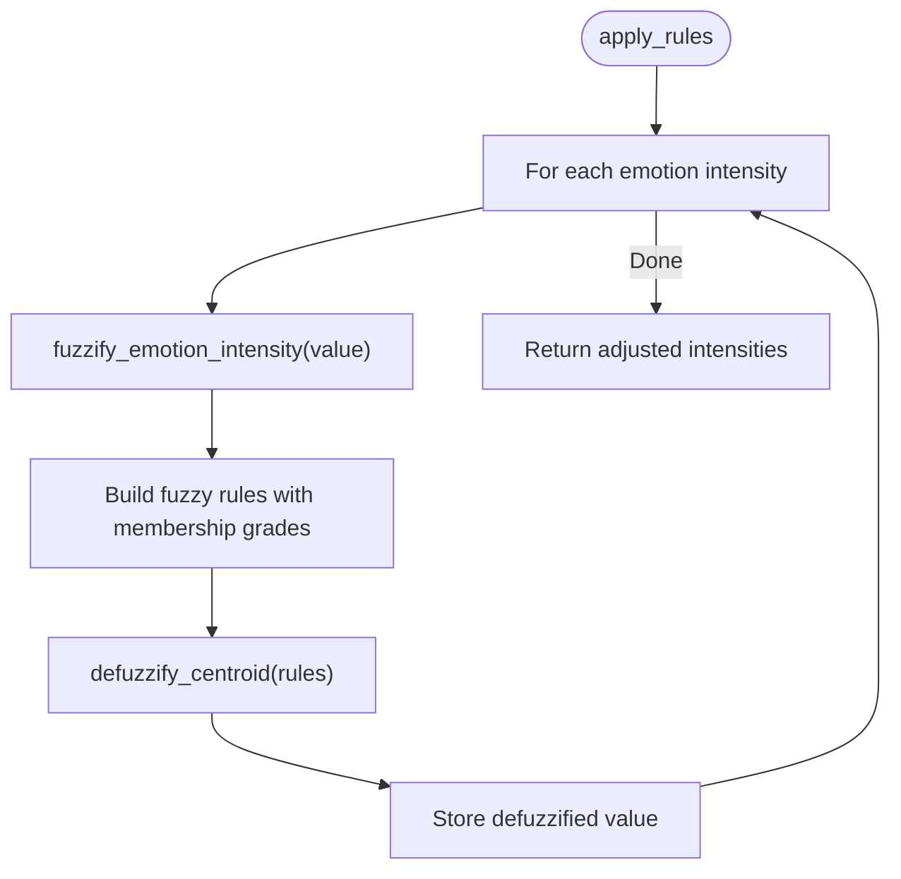
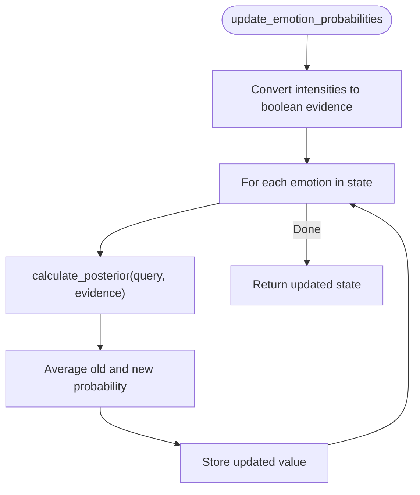
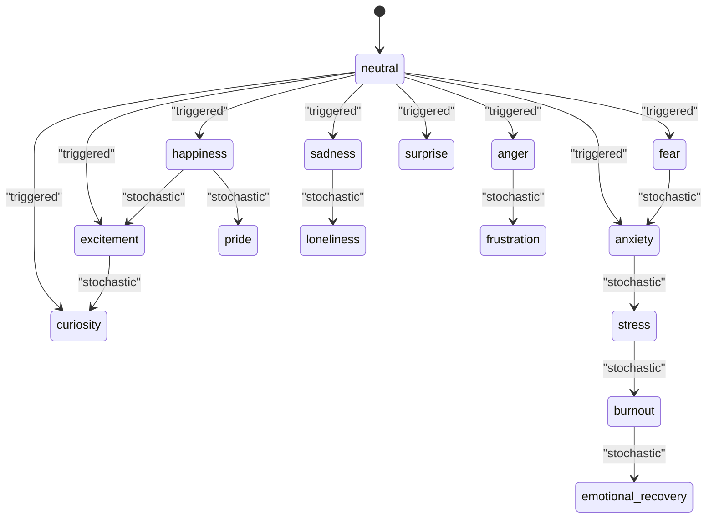
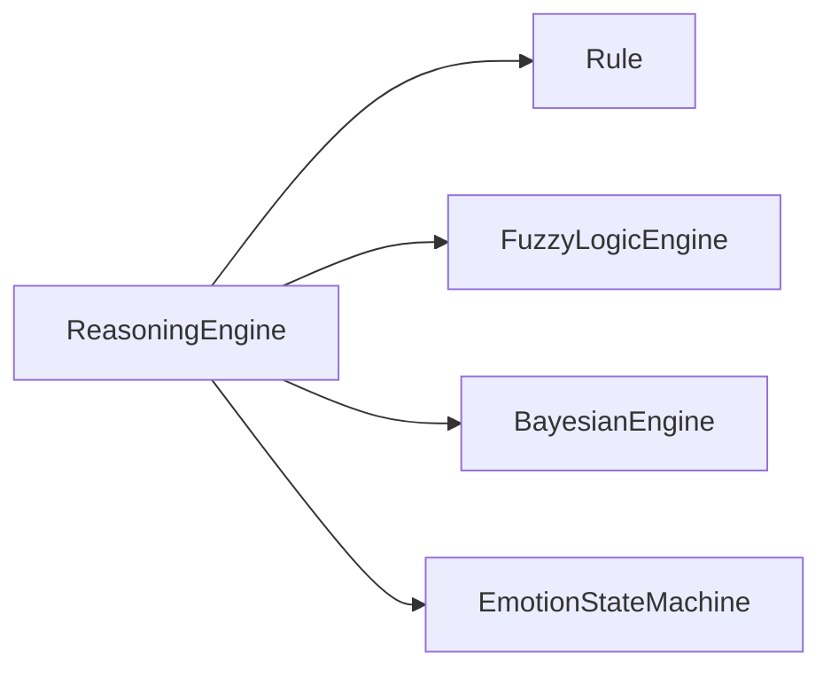

# Rule-Based Decision System

<cite>
**Referenced Files in This Document**
- [reasoning_engine.py](file://psychologist/emotion_engine/reasoning_engine/reasoning_engine.py)
- [fuzzy_engine.py](file://psychologist/emotion_engine/fuzzy_logic/fuzzy_engine.py)
- [bayesian_network.py](file://psychologist/emotion_engine/bayesian_engine/bayesian_network.py)
- [emotion_state_machine.py](file://psychologist/emotion_engine/state_machine/emotion_state_machine.py)
- [models.py](file://psychologist/emotion_engine/models.py)
</cite>

## Table of Contents
1. [Introduction](#introduction)
2. [Project Structure](#project-structure)
3. [Core Components](#core-components)
4. [Architecture Overview](#architecture-overview)
5. [Detailed Component Analysis](#detailed-component-analysis)
6. [Dependency Analysis](#dependency-analysis)
7. [Performance Considerations](#performance-considerations)
8. [Troubleshooting Guide](#troubleshooting-guide)
9. [Conclusion](#conclusion)

## Introduction
This document describes the Rule-Based Decision System that powers emotion-aware decision-making in the Psychologist application. It explains how rules are evaluated against emotional states, contextual factors, and personality traits, how actions are aggregated and prioritized, and how fuzzy logic and Bayesian inference enhance decision quality. The system integrates three complementary engines: a rule evaluator, a fuzzy logic engine for nuanced emotion blending, and a Bayesian engine for probabilistic updates.

## Project Structure
The Rule-Based Decision System resides in the emotion engine module and collaborates with supporting engines:

- Rule evaluation and orchestration: reasoning_engine.py
- Fuzzy logic for emotion fuzzification and defuzzification: fuzzy_engine.py
- Bayesian inference for emotion probability updates: bayesian_network.py
- Emotion state machine for transitions: emotion_state_machine.py
- Data models for emotional states, personality traits, and conversation context: models.py

**Diagram sources**
- [reasoning_engine.py:86-205](file://psychologist/emotion_engine/reasoning_engine/reasoning_engine.py#L86-L205)
- [fuzzy_engine.py:4-81](file://psychologist/emotion_engine/fuzzy_logic/fuzzy_engine.py#L4-L81)
- [bayesian_network.py:5-105](file://psychologist/emotion_engine/bayesian_engine/bayesian_network.py#L5-L105)
- [emotion_state_machine.py:5-90](file://psychologist/emotion_engine/state_machine/emotion_state_machine.py#L5-L90)

**Section sources**
- [reasoning_engine.py:1-205](file://psychologist/emotion_engine/reasoning_engine/reasoning_engine.py#L1-L205)
- [models.py:44-143](file://psychologist/emotion_engine/models.py#L44-L143)

## Core Components
- Rule: encapsulates a named set of conditions and actions with a numeric priority. Conditions can target primary, secondary, and advanced emotions, conversation context attributes, and personality traits. Actions are key-value pairs representing decision outputs.
- ReasoningEngine: manages a collection of rules, evaluates them against current emotional state, context, and personality, aggregates actions, and integrates fuzzy and Bayesian engines to refine decisions.

Key capabilities:
- Multi-faceted condition evaluation across primary, secondary, advanced emotions, context, and personality traits
- Condition operators: greater-than (>), less-than (<), greater-than-or-equal (>=), less-than-or-equal (<=)
- Priority-based rule ordering and conflict resolution via action aggregation
- Action combination via maximum value selection for overlapping keys

**Section sources**
- [reasoning_engine.py:8-84](file://psychologist/emotion_engine/reasoning_engine/reasoning_engine.py#L8-L84)
- [reasoning_engine.py:86-205](file://psychologist/emotion_engine/reasoning_engine/reasoning_engine.py#L86-L205)

## Architecture Overview
The system blends rule-based decision-making with fuzzy logic and Bayesian inference:

**Diagram sources**
- [reasoning_engine.py:174-205](file://psychologist/emotion_engine/reasoning_engine/reasoning_engine.py#L174-L205)
- [fuzzy_engine.py:64-81](file://psychologist/emotion_engine/fuzzy_logic/fuzzy_engine.py#L64-L81)
- [bayesian_network.py:73-101](file://psychologist/emotion_engine/bayesian_engine/bayesian_network.py#L73-L101)
- [emotion_state_machine.py:52-70](file://psychologist/emotion_engine/state_machine/emotion_state_machine.py#L52-L70)

## Detailed Component Analysis

### Rule Class and Evaluation Logic
The Rule class defines conditions and actions with an integer priority. The evaluate method checks conditions across five categories:
- primary_emotions: thresholds on primary emotion intensities
- secondary_emotions: thresholds on secondary emotion intensities
- advanced_emotions: thresholds on advanced emotion intensities
- context_: thresholds on conversation context attributes
- personality_: thresholds on personality trait values

Supported operators:
- Greater-than (>): matches when the measured value exceeds the threshold
- Less-than (<): matches when the measured value is below the threshold
- Greater-than-or-equal (>=): matches when the measured value meets or exceeds the threshold
- Less-than-or-equal (<=): matches when the measured value is at or below the threshold

Condition syntax:
- Tuple form: (operator, threshold_value)
- Scalar form: threshold_value (interpreted as a lower bound for comparison)

Evaluation flow:

**Diagram sources**
- [reasoning_engine.py:15-83](file://psychologist/emotion_engine/reasoning_engine/reasoning_engine.py#L15-L83)

**Section sources**
- [reasoning_engine.py:8-84](file://psychologist/emotion_engine/reasoning_engine/reasoning_engine.py#L8-L84)

### ReasoningEngine: Rule Priority, Aggregation, and Conflict Resolution
The ReasoningEngine maintains a prioritized list of rules and applies the following process:
- Initialization loads default rules with distinct priorities
- Adding a rule inserts it and sorts by priority (lower number means higher priority)
- Evaluation collects all triggered actions across rules
- Action aggregation uses a maximization strategy for overlapping keys (highest value wins)
- Integration with fuzzy and Bayesian engines refines emotion intensities and probabilities
- Emotion state machine transitions based on dominant emotion and intensity

**Diagram sources**
- [reasoning_engine.py:8-205](file://psychologist/emotion_engine/reasoning_engine/reasoning_engine.py#L8-L205)
- [fuzzy_engine.py:4-81](file://psychologist/emotion_engine/fuzzy_logic/fuzzy_engine.py#L4-L81)
- [bayesian_network.py:5-105](file://psychologist/emotion_engine/bayesian_engine/bayesian_network.py#L5-L105)
- [emotion_state_machine.py:5-90](file://psychologist/emotion_engine/state_machine/emotion_state_machine.py#L5-L90)

**Section sources**
- [reasoning_engine.py:86-205](file://psychologist/emotion_engine/reasoning_engine/reasoning_engine.py#L86-L205)

### Fuzzy Logic Engine: Emotion Fuzzification and Defuzzification
The fuzzy engine converts precise emotion intensities into fuzzy sets and defuzzifies outputs to crisp values. It supports:
- Triangular and trapezoidal membership functions
- Fuzzification of emotion intensities and personality traits
- Defuzzification via centroid method to produce refined intensity values

**Diagram sources**
- [fuzzy_engine.py:28-81](file://psychologist/emotion_engine/fuzzy_logic/fuzzy_engine.py#L28-L81)

**Section sources**
- [fuzzy_engine.py:4-81](file://psychologist/emotion_engine/fuzzy_logic/fuzzy_engine.py#L4-L81)

### Bayesian Engine: Probabilistic Updates
The Bayesian engine maintains prior probabilities and conditional probability tables. It computes posterior probabilities for queried emotions given observed evidence and returns updated emotion distributions.

**Diagram sources**
- [bayesian_network.py:73-101](file://psychologist/emotion_engine/bayesian_engine/bayesian_network.py#L73-L101)

**Section sources**
- [bayesian_network.py:5-105](file://psychologist/emotion_engine/bayesian_engine/bayesian_network.py#L5-L105)

### Emotion State Machine: Transitions and Predictions
The state machine tracks current emotional state, maintains a history, and predicts next likely states based on transition probabilities. It supports deterministic transitions when triggered by strong emotion and stochastic transitions otherwise.

**Diagram sources**
- [emotion_state_machine.py:11-77](file://psychologist/emotion_engine/state_machine/emotion_state_machine.py#L11-L77)

**Section sources**
- [emotion_state_machine.py:5-90](file://psychologist/emotion_engine/state_machine/emotion_state_machine.py#L5-L90)

## Dependency Analysis
The reasoning engine depends on:
- Rule: condition evaluation logic
- FuzzyLogicEngine: fuzzification and defuzzification
- BayesianEngine: probabilistic updates
- EmotionStateMachine: state transitions

**Diagram sources**
- [reasoning_engine.py:1-5](file://psychologist/emotion_engine/reasoning_engine/reasoning_engine.py#L1-L5)

**Section sources**
- [reasoning_engine.py:1-5](file://psychologist/emotion_engine/reasoning_engine/reasoning_engine.py#L1-L5)

## Performance Considerations
- Rule evaluation cost scales linearly with the number of rules and conditions per rule. Keep conditions concise and targeted.
- Action aggregation is O(R*A) where R is number of triggered rules and A is average number of actions per rule. Prefer sparse action sets.
- Fuzzy defuzzification iterates over a fixed step grid; adjust step size for accuracy vs. speed trade-offs.
- Bayesian updates are constant-time per emotion, bounded by precomputed tables.
- State machine transitions are O(1) with small transition tables.

## Troubleshooting Guide
Common issues and resolutions:
- Rule not triggering:
  - Verify condition key prefixes match available data: primary_, secondary_, advanced_, context_, personality_
  - Confirm thresholds use supported operators and numeric values
  - Ensure the corresponding attribute exists in the target object (EmotionalState, ConversationContext, PersonalityTraits)
- Conflicting actions:
  - Use priority to control precedence; lower numbers indicate higher priority
  - Overlapping action keys are maximized; confirm expected behavior aligns with maximization strategy
- Unexpected mode or intensity:
  - Check fuzzy adjustments and Bayesian updates for significant changes
  - Review dominant emotion detection and state machine transitions
- Performance degradation:
  - Reduce rule count or simplify conditions
  - Optimize membership function parameters in fuzzy engine

**Section sources**
- [reasoning_engine.py:15-83](file://psychologist/emotion_engine/reasoning_engine/reasoning_engine.py#L15-L83)
- [reasoning_engine.py:174-205](file://psychologist/emotion_engine/reasoning_engine/reasoning_engine.py#L174-L205)

## Conclusion
The Rule-Based Decision System combines explicit rule evaluation with fuzzy logic and Bayesian inference to produce robust, interpretable decisions grounded in emotional state, context, and personality. Its modular design enables incremental enhancements, clear conflict resolution via priorities and action maximization, and reliable state transitions informed by learned dynamics.