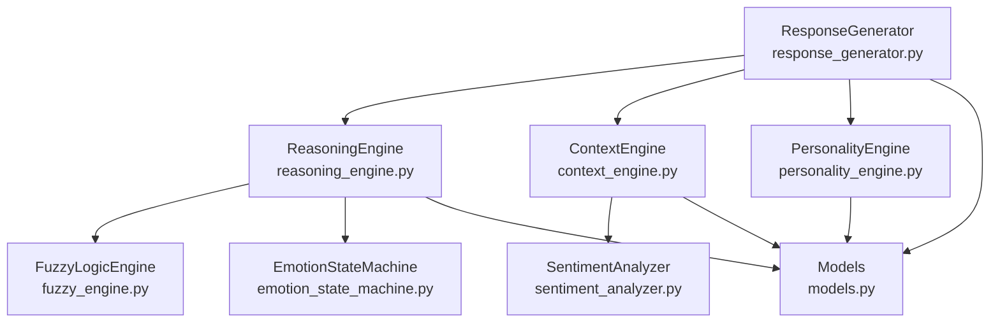
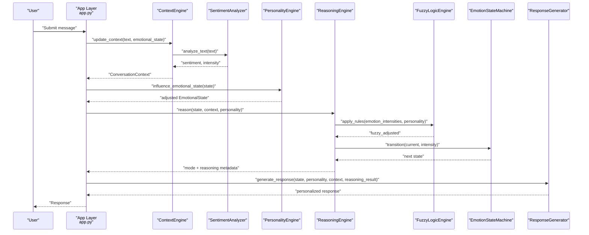
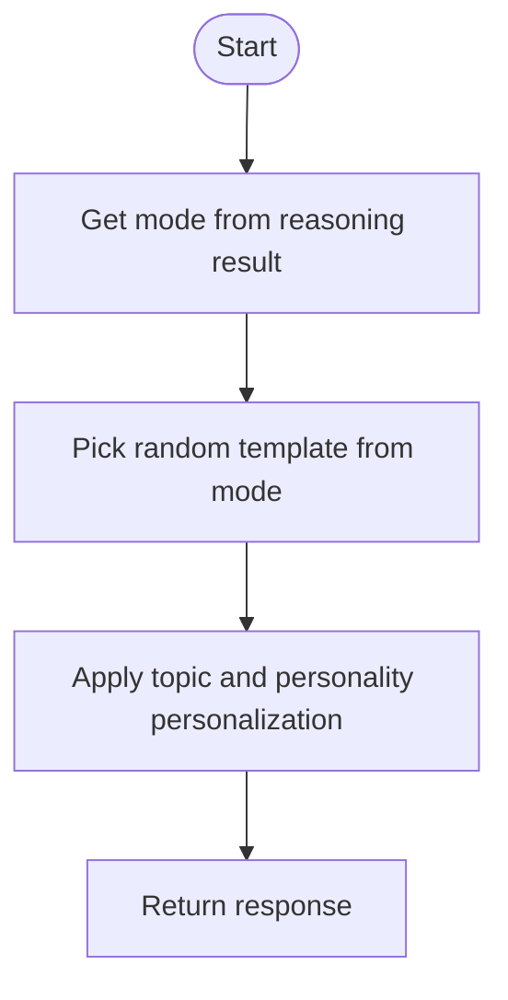
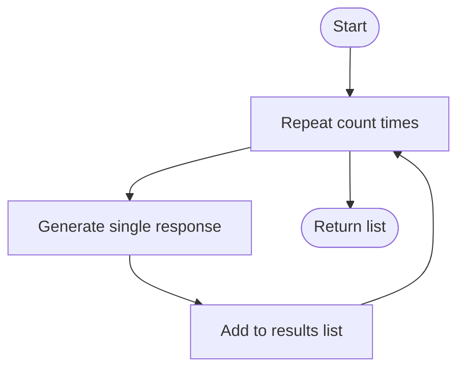
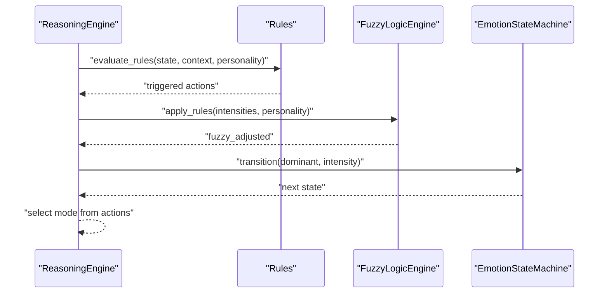
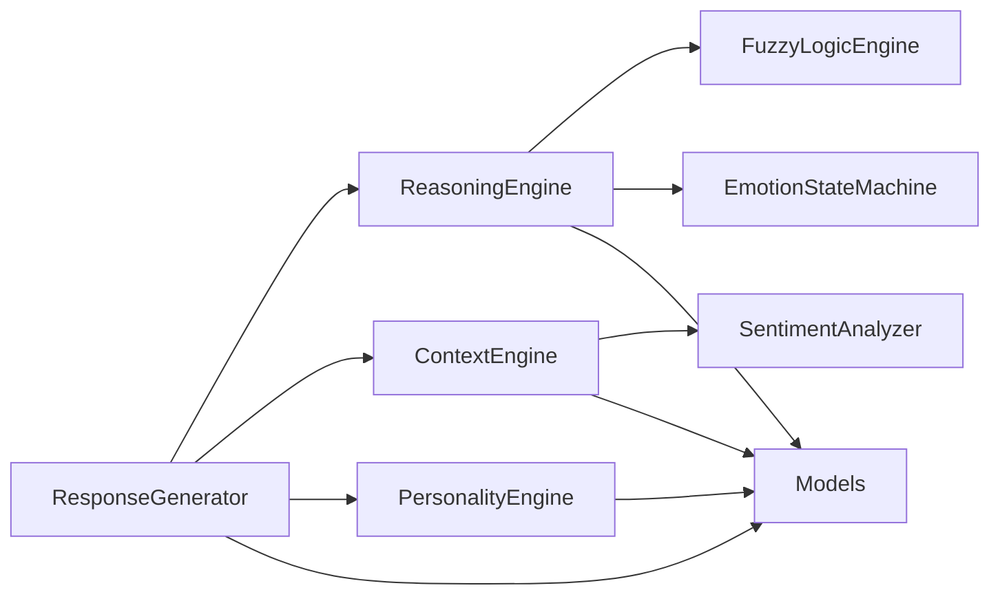

# Response Generation Engine

<cite>
**Referenced Files in This Document**
- [response_generator.py](file://psychologist/emotion_engine/response_generator/response_generator.py)
- [personality_engine.py](file://psychologist/emotion_engine/personality_engine/personality_engine.py)
- [context_engine.py](file://psychologist/emotion_engine/context_engine/context_engine.py)
- [reasoning_engine.py](file://psychologist/emotion_engine/reasoning_engine/reasoning_engine.py)
- [models.py](file://psychologist/emotion_engine/models.py)
- [sentiment_analyzer.py](file://psychologist/emotion_engine/sentiment_analysis/sentiment_analyzer.py)
- [system_constants.py](file://psychologist/system_constants.py)
- [fuzzy_engine.py](file://psychologist/emotion_engine/fuzzy_logic/fuzzy_engine.py)
- [emotion_state_machine.py](file://psychologist/emotion_engine/state_machine/emotion_state_machine.py)
- [app.py](file://psychologist/app.py)
- [interaction_config.yaml](file://psychologist/config/interaction_config.yaml)
- [safety_config.yaml](file://psychologist/config/safety_config.yaml)
</cite>

## Table of Contents
1. [Introduction](#introduction)
2. [Project Structure](#project-structure)
3. [Core Components](#core-components)
4. [Architecture Overview](#architecture-overview)
5. [Detailed Component Analysis](#detailed-component-analysis)
6. [Dependency Analysis](#dependency-analysis)
7. [Performance Considerations](#performance-considerations)
8. [Troubleshooting Guide](#troubleshooting-guide)
9. [Conclusion](#conclusion)
10. [Appendices](#appendices)

## Introduction
This document describes the Response Generation Engine responsible for producing therapeutic responses grounded in emotional state, personality traits, and contextual signals. It explains the response template system, how response modes are selected via reasoning, and how personalization is applied based on personality and context. It also documents mechanisms for response diversity, customization options across interaction scenarios, and the integration with broader emotion and interaction systems.

## Project Structure
The Response Generation Engine resides within the emotion engine subsystem and collaborates with the reasoning engine, context engine, personality engine, and fuzzy logic components. It consumes structured models for emotional state, personality traits, and conversation context, and produces natural-sounding, mode-appropriate responses.

**Diagram sources**
- [response_generator.py:1-122](file://psychologist/emotion_engine/response_generator/response_generator.py#L1-L122)
- [reasoning_engine.py:1-205](file://psychologist/emotion_engine/reasoning_engine/reasoning_engine.py#L1-L205)
- [context_engine.py:1-117](file://psychologist/emotion_engine/context_engine/context_engine.py#L1-L117)
- [personality_engine.py:1-68](file://psychologist/emotion_engine/personality_engine/personality_engine.py#L1-L68)
- [fuzzy_engine.py:1-81](file://psychologist/emotion_engine/fuzzy_logic/fuzzy_engine.py#L1-L81)
- [emotion_state_machine.py:1-90](file://psychologist/emotion_engine/state_machine/emotion_state_machine.py#L1-L90)
- [sentiment_analyzer.py:1-103](file://psychologist/emotion_engine/sentiment_analysis/sentiment_analyzer.py#L1-L103)
- [models.py:1-143](file://psychologist/emotion_engine/models.py#L1-L143)

**Section sources**
- [response_generator.py:1-122](file://psychologist/emotion_engine/response_generator/response_generator.py#L1-L122)
- [reasoning_engine.py:1-205](file://psychologist/emotion_engine/reasoning_engine/reasoning_engine.py#L1-L205)
- [context_engine.py:1-117](file://psychologist/emotion_engine/context_engine/context_engine.py#L1-L117)
- [personality_engine.py:1-68](file://psychologist/emotion_engine/personality_engine/personality_engine.py#L1-L68)
- [fuzzy_engine.py:1-81](file://psychologist/emotion_engine/fuzzy_logic/fuzzy_engine.py#L1-L81)
- [emotion_state_machine.py:1-90](file://psychologist/emotion_engine/state_machine/emotion_state_machine.py#L1-L90)
- [sentiment_analyzer.py:1-103](file://psychologist/emotion_engine/sentiment_analysis/sentiment_analyzer.py#L1-L103)
- [models.py:1-143](file://psychologist/emotion_engine/models.py#L1-L143)

## Core Components
- ResponseGenerator: Maintains a library of response templates organized by mode (supportive, calming, reassuring, celebratory, encouraging, stress relief, recovery, trust building, neutral) and personalizes generated responses based on emotional state, personality, and context.
- ReasoningEngine: Selects the appropriate response mode by evaluating rules against current emotional state, context, and personality, and optionally blending with fuzzy logic and state machine predictions.
- ContextEngine: Builds a ConversationContext from user input, including sentiment, topic detection, conflict level, motivation opportunity, repeated patterns, and trend metrics.
- PersonalityEngine: Translates personality trait profiles into influences on emotional states and provides personality summaries.
- FuzzyLogicEngine: Applies fuzzy membership functions to emotion intensities and personality traits to produce adjusted emotion values.
- EmotionStateMachine: Provides probabilistic emotion transitions to inform reasoning outcomes.
- SentimentAnalyzer: Computes sentiment polarity and intensity from text and detects emotion-related keywords.
- Models: Defines data structures for EmotionalState, PersonalityTraits, ConversationContext, and MemoryEntry.

**Section sources**
- [response_generator.py:6-122](file://psychologist/emotion_engine/response_generator/response_generator.py#L6-L122)
- [reasoning_engine.py:86-205](file://psychologist/emotion_engine/reasoning_engine/reasoning_engine.py#L86-L205)
- [context_engine.py:9-117](file://psychologist/emotion_engine/context_engine/context_engine.py#L9-L117)
- [personality_engine.py:6-68](file://psychologist/emotion_engine/personality_engine/personality_engine.py#L6-L68)
- [fuzzy_engine.py:4-81](file://psychologist/emotion_engine/fuzzy_logic/fuzzy_engine.py#L4-L81)
- [emotion_state_machine.py:5-90](file://psychologist/emotion_engine/state_machine/emotion_state_machine.py#L5-L90)
- [sentiment_analyzer.py:5-103](file://psychologist/emotion_engine/sentiment_analysis/sentiment_analyzer.py#L5-L103)
- [models.py:44-143](file://psychologist/emotion_engine/models.py#L44-L143)

## Architecture Overview
The Response Generation Engine participates in a multi-stage pipeline:
1. Input is processed to extract sentiment and build a ConversationContext.
2. Personality influences are applied to adjust emotional states.
3. A reasoning phase selects a response mode based on rules and optional fuzzy/state-machine adjustments.
4. A base response is chosen from a template set aligned with the selected mode.
5. Personalization is applied using personality and context signals.
6. Diversity is introduced by selecting randomly among templates within a mode.

**Diagram sources**
- [app.py:289-335](file://psychologist/app.py#L289-L335)
- [context_engine.py:24-46](file://psychologist/emotion_engine/context_engine/context_engine.py#L24-L46)
- [sentiment_analyzer.py:31-73](file://psychologist/emotion_engine/sentiment_analysis/sentiment_analyzer.py#L31-L73)
- [personality_engine.py:40-54](file://psychologist/emotion_engine/personality_engine/personality_engine.py#L40-L54)
- [reasoning_engine.py:185-204](file://psychologist/emotion_engine/reasoning_engine/reasoning_engine.py#L185-L204)
- [fuzzy_engine.py:64-80](file://psychologist/emotion_engine/fuzzy_logic/fuzzy_engine.py#L64-L80)
- [emotion_state_machine.py:52-77](file://psychologist/emotion_engine/state_machine/emotion_state_machine.py#L52-L77)
- [response_generator.py:77-85](file://psychologist/emotion_engine/response_generator/response_generator.py#L77-L85)

## Detailed Component Analysis

### Response Template System
- Templates are grouped by mode (supportive, calming, reassuring, celebratory, encouraging, stress_relief, recovery, trust_building, neutral).
- Each mode contains multiple phrasings to enable response diversity.
- The generator selects a random template from the chosen mode and applies personalization.

Key behaviors:
- Mode selection is driven by the reasoning result’s mode field.
- Neutral mode is used as fallback when the selected mode is unavailable.
- Diversity is ensured by returning multiple responses when requested.

**Section sources**
- [response_generator.py:10-75](file://psychologist/emotion_engine/response_generator/response_generator.py#L10-L75)
- [response_generator.py:114-122](file://psychologist/emotion_engine/response_generator/response_generator.py#L114-L122)

### Emotional Appropriateness Scoring and Mode Selection
- The ReasoningEngine evaluates a set of prioritized rules that match conditions on primary/secondary/advanced emotions, context fields, and personality traits.
- Actions from triggered rules include a mode and associated scores (e.g., empathy, comfort, reassurance).
- The dominant emotion informs a finite-state emotion model that predicts likely next states, complementing rule-triggered decisions.

Scoring highlights:
- Rules combine thresholds on emotion intensities and context/conflict indicators.
- FuzzyLogicEngine adjusts emotion intensities using membership functions for “high,” “medium,” and “low” intensity categories.
- EmotionStateMachine defines transition probabilities between emotion states, enabling dynamic mode selection influenced by recent emotional trends.

**Section sources**
- [reasoning_engine.py:94-168](file://psychologist/emotion_engine/reasoning_engine/reasoning_engine.py#L94-L168)
- [reasoning_engine.py:174-204](file://psychologist/emotion_engine/reasoning_engine/reasoning_engine.py#L174-L204)
- [fuzzy_engine.py:28-80](file://psychologist/emotion_engine/fuzzy_logic/fuzzy_engine.py#L28-L80)
- [emotion_state_machine.py:11-50](file://psychologist/emotion_engine/state_machine/emotion_state_machine.py#L11-L50)

### Response Personalization Based on Personality and Context
Personalization logic:
- Topic-aware additions: When a topic is detected (work, family, health, relationships, education, finance, hobbies), the generator appends a context-specific phrase to the base response.
- Extraversion influence:
  - High extraversion: Adds an exclamation-integrated prompt encouraging elaboration.
  - Low extraversion: Appends a prompt suggesting taking time to share.
- Dominant emotion: Used to guide tone and phrasing within the selected mode.

Diversity mechanisms:
- Multiple responses can be generated by calling the multiple-response method, which internally invokes the single-response generator multiple times.

**Section sources**
- [response_generator.py:87-118](file://psychologist/emotion_engine/response_generator/response_generator.py#L87-L118)
- [context_engine.py:48-68](file://psychologist/emotion_engine/context_engine/context_engine.py#L48-L68)

### Context Engine and Sentiment Signals
- Builds a ConversationContext from user input, including:
  - Topic detection via keyword matching.
  - Current topic keywords extraction.
  - Conflict level derived from emotion intensities and sentiment.
  - Motivation opportunity from hope, curiosity, and motivation.
  - Repeated patterns identified from conversation history.
  - Trend metrics for sentiment and intensity.
- SentimentAnalyzer computes normalized sentiment and intensity, and detects emotion-related keywords.

**Section sources**
- [context_engine.py:24-106](file://psychologist/emotion_engine/context_engine/context_engine.py#L24-L106)
- [sentiment_analyzer.py:31-103](file://psychologist/emotion_engine/sentiment_analysis/sentiment_analyzer.py#L31-L103)

### Personality Influence on Emotions
- PersonalityEngine maps traits to emotion influences (e.g., optimism affects happiness, neuroticism affects sadness/anger/anxiety/stress, agreeableness affects trust, compassion and agreeableness affect empathy).
- Influences are scaled by a factor derived from trait values, blending with base emotion intensities to produce adjusted emotional states.

**Section sources**
- [personality_engine.py:23-54](file://psychologist/emotion_engine/personality_engine/personality_engine.py#L23-L54)

### Data Models Underpinning Response Generation
- EmotionalState: Tracks primary, secondary, and advanced emotions with intensity, plus helpers to compute dominant emotion and serialize state.
- PersonalityTraits: Stores normalized trait values and serializes to dictionary form for downstream engines.
- ConversationContext: Captures topic, sentiment, trends, conflict, motivation, repeated patterns, and current topic keywords.

**Section sources**
- [models.py:44-143](file://psychologist/emotion_engine/models.py#L44-L143)

### Example Workflows

#### Workflow 1: Generating a Single Personalized Response
- Input: user text, current EmotionalState, PersonalityTraits, ConversationContext, and a reasoning result containing a mode.
- Steps:
  - Select mode from reasoning result.
  - Choose a random template from the selected mode.
  - Personalize with topic-aware addition and personality prompts.
  - Return the personalized response.

**Diagram sources**
- [response_generator.py:77-85](file://psychologist/emotion_engine/response_generator/response_generator.py#L77-L85)

#### Workflow 2: Generating Multiple Diverse Responses
- Input: same as above.
- Steps:
  - Repeat response generation multiple times.
  - Collect and return a list of distinct responses.

**Diagram sources**
- [response_generator.py:114-118](file://psychologist/emotion_engine/response_generator/response_generator.py#L114-L118)

#### Workflow 3: Mode Selection via Reasoning
- Input: EmotionalState, ConversationContext, PersonalityTraits.
- Steps:
  - Evaluate rules; collect triggered actions and scores.
  - Apply fuzzy logic adjustments to emotion intensities.
  - Transition emotion state via state machine.
  - Output mode and reasoning metadata.

**Diagram sources**
- [reasoning_engine.py:174-204](file://psychologist/emotion_engine/reasoning_engine/reasoning_engine.py#L174-L204)
- [fuzzy_engine.py:64-80](file://psychologist/emotion_engine/fuzzy_logic/fuzzy_engine.py#L64-L80)
- [emotion_state_machine.py:52-77](file://psychologist/emotion_engine/state_machine/emotion_state_machine.py#L52-L77)

### Customization Options Across Interaction Scenarios
- Response mode customization:
  - Adjust rule thresholds or add new rules to tailor mode selection for specific populations or goals.
  - Modify template sets per mode to reflect cultural or demographic preferences.
- Personality-based personalization:
  - Tune how extraversion and other traits influence tone and pacing.
  - Extend personalization prompts for additional traits (e.g., openness, conscientiousness).
- Context-awareness:
  - Expand topic keyword sets to cover domain-specific concerns.
  - Adjust conflict and motivation detection heuristics.
- Diversity controls:
  - Increase or decrease the number of candidate templates per mode.
  - Use the multiple-response method to present alternatives.

**Section sources**
- [reasoning_engine.py:94-168](file://psychologist/emotion_engine/reasoning_engine/reasoning_engine.py#L94-L168)
- [response_generator.py:10-75](file://psychologist/emotion_engine/response_generator/response_generator.py#L10-L75)
- [context_engine.py:13-21](file://psychologist/emotion_engine/context_engine/context_engine.py#L13-L21)

## Dependency Analysis
The Response Generation Engine depends on:
- Models for typed data structures.
- ContextEngine for sentiment, topics, and trends.
- ReasoningEngine for mode selection.
- FuzzyLogicEngine and EmotionStateMachine for reasoning augmentation.
- PersonalityEngine for trait-influenced emotional adjustments.

**Diagram sources**
- [response_generator.py:1-8](file://psychologist/emotion_engine/response_generator/response_generator.py#L1-L8)
- [reasoning_engine.py:1-9](file://psychologist/emotion_engine/reasoning_engine/reasoning_engine.py#L1-L9)
- [context_engine.py:1-6](file://psychologist/emotion_engine/context_engine/context_engine.py#L1-L6)
- [personality_engine.py:1-3](file://psychologist/emotion_engine/personality_engine/personality_engine.py#L1-L3)
- [fuzzy_engine.py:1-2](file://psychologist/emotion_engine/fuzzy_logic/fuzzy_engine.py#L1-L2)
- [emotion_state_machine.py:1-2](file://psychologist/emotion_engine/state_machine/emotion_state_machine.py#L1-L2)
- [sentiment_analyzer.py:1-2](file://psychologist/emotion_engine/sentiment_analysis/sentiment_analyzer.py#L1-L2)
- [models.py:1-4](file://psychologist/emotion_engine/models.py#L1-L4)

**Section sources**
- [response_generator.py:1-8](file://psychologist/emotion_engine/response_generator/response_generator.py#L1-L8)
- [reasoning_engine.py:1-9](file://psychologist/emotion_engine/reasoning_engine/reasoning_engine.py#L1-L9)
- [context_engine.py:1-6](file://psychologist/emotion_engine/context_engine/context_engine.py#L1-L6)
- [personality_engine.py:1-3](file://psychologist/emotion_engine/personality_engine/personality_engine.py#L1-L3)
- [fuzzy_engine.py:1-2](file://psychologist/emotion_engine/fuzzy_logic/fuzzy_engine.py#L1-L2)
- [emotion_state_machine.py:1-2](file://psychologist/emotion_engine/state_machine/emotion_state_machine.py#L1-L2)
- [sentiment_analyzer.py:1-2](file://psychologist/emotion_engine/sentiment_analysis/sentiment_analyzer.py#L1-L2)
- [models.py:1-4](file://psychologist/emotion_engine/models.py#L1-L4)

## Performance Considerations
- Template lookup and random selection are O(n) in the number of templates per mode; keep mode template sizes reasonable for latency-sensitive deployments.
- Context updates maintain bounded histories via system constants; tune limits to balance responsiveness and historical awareness.
- Fuzzy logic centroid computation iterates over small ranges; keep step granularity appropriate for accuracy vs. speed trade-offs.
- Personality influence and state machine transitions are constant-time operations.

[No sources needed since this section provides general guidance]

## Troubleshooting Guide
Common issues and remedies:
- Unexpected response mode:
  - Verify rule thresholds and priorities; confirm dominant emotion and context indicators align with intended behavior.
  - Inspect fuzzy logic adjustments and state machine transitions.
- Lack of personalization:
  - Confirm topic detection is working and that personality trait values are within expected ranges.
  - Ensure the reasoning result supplies a valid mode.
- Excessive repetition:
  - Increase template diversity per mode or use the multiple-response method.
  - Review context history limits and repeated pattern detection sensitivity.
- Safety overrides:
  - For crisis or diagnostic content, ensure safety configuration blocks and safe response templates are enabled and properly loaded.

**Section sources**
- [reasoning_engine.py:94-168](file://psychologist/emotion_engine/reasoning_engine/reasoning_engine.py#L94-L168)
- [response_generator.py:87-118](file://psychologist/emotion_engine/response_generator/response_generator.py#L87-L118)
- [context_engine.py:90-106](file://psychologist/emotion_engine/context_engine/context_engine.py#L90-L106)
- [safety_config.yaml:88-116](file://psychologist/config/safety_config.yaml#L88-L116)

## Conclusion
The Response Generation Engine combines explicit rule-based mode selection, fuzzy/state-machine augmentation, and personality/context-aware personalization to produce emotionally appropriate, diverse, and individualized responses. Its modular design enables straightforward customization for varied interaction scenarios while maintaining interpretability and safety.

[No sources needed since this section summarizes without analyzing specific files]

## Appendices

### Configuration References
- Interaction configuration governs dual-mode operation and response length limits.
- Safety configuration defines crisis detection keywords and safe response templates.

**Section sources**
- [interaction_config.yaml:15-29](file://psychologist/config/interaction_config.yaml#L15-L29)
- [safety_config.yaml:5-116](file://psychologist/config/safety_config.yaml#L5-L116)