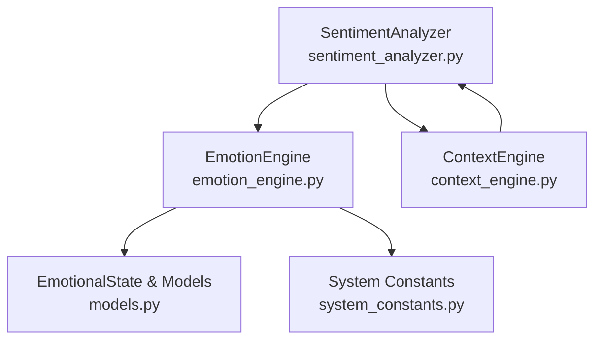
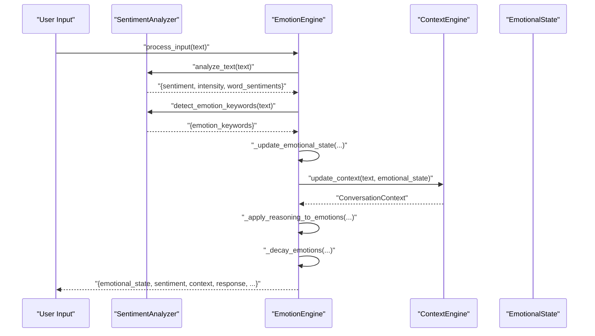
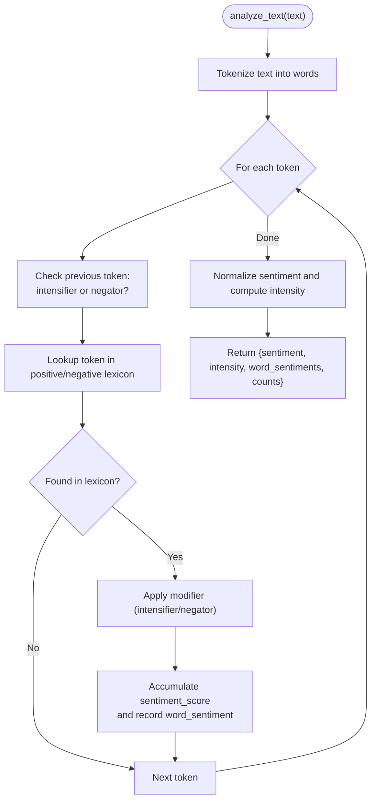
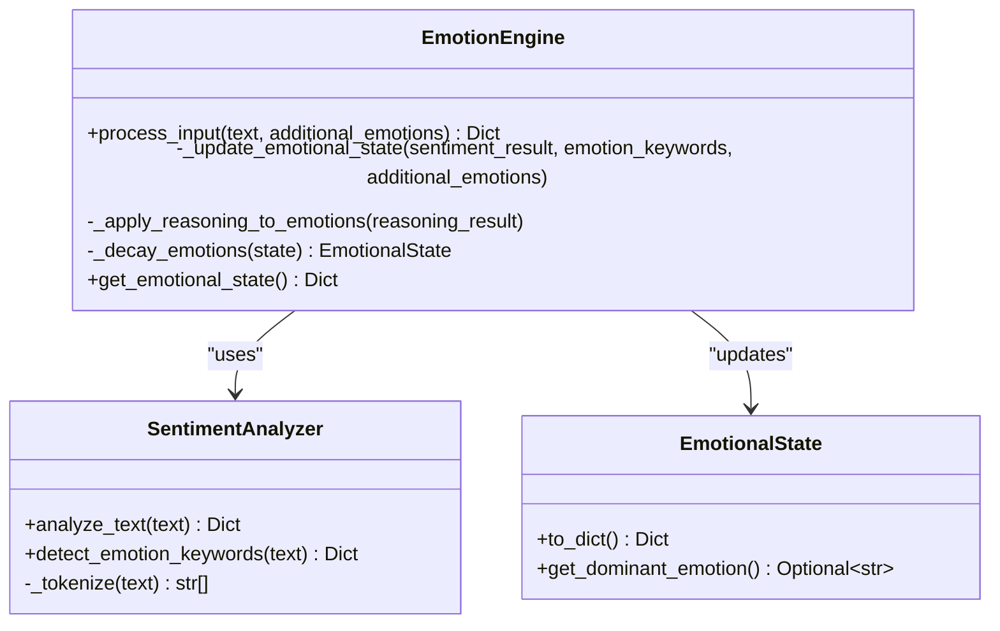
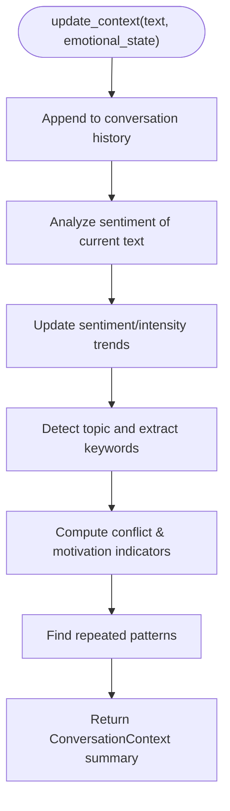
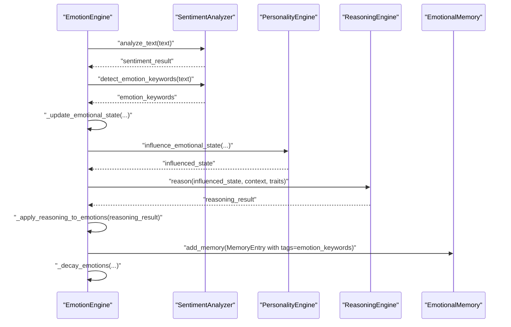
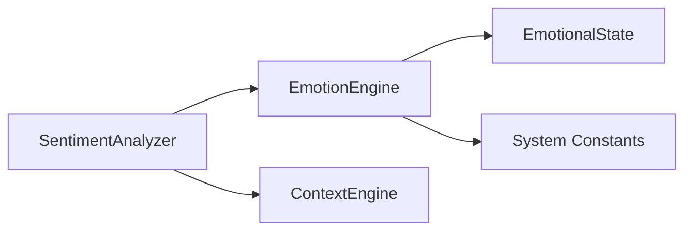

# Sentiment Analysis Module

<cite>
**Referenced Files in This Document**
- [sentiment_analyzer.py](file://psychologist/psychologist/emotion_engine/sentiment_analysis/sentiment_analyzer.py)
- [emotion_engine.py](file://psychologist/psychologist/emotion_engine/emotion_engine.py)
- [context_engine.py](file://psychologist/psychologist/emotion_engine/context_engine/context_engine.py)
- [models.py](file://psychologist/psychologist/emotion_engine/models.py)
- [system_constants.py](file://psychologist/psychologist/system_constants.py)
- [test_emotion_engine.py](file://psychologist/psychologist/emotion_engine/tests/test_emotion_engine.py)
</cite>

## Table of Contents
1. [Introduction](#introduction)
2. [Project Structure](#project-structure)
3. [Core Components](#core-components)
4. [Architecture Overview](#architecture-overview)
5. [Detailed Component Analysis](#detailed-component-analysis)
6. [Dependency Analysis](#dependency-analysis)
7. [Performance Considerations](#performance-considerations)
8. [Troubleshooting Guide](#troubleshooting-guide)
9. [Conclusion](#conclusion)
10. [Appendices](#appendices)

## Introduction
This document describes the Sentiment Analysis Module within the Psychologist project’s Emotion Engine. It explains the text processing algorithms used to detect sentiment polarity and intensity, emotion keyword extraction, and sentiment scoring mechanisms. It also documents the integration with the broader emotion processing pipeline, including sentiment classification thresholds, keyword-based emotion detection, and emotion keyword weighting. Finally, it provides examples of sentiment analysis workflows and common use cases for text input processing.

## Project Structure
The Sentiment Analysis Module resides under the emotion engine package and collaborates with other engines to form a complete emotion processing pipeline. The module exposes a SentimentAnalyzer class responsible for:
- Tokenizing raw text
- Computing sentiment polarity and intensity scores
- Detecting emotion keywords mapped to predefined emotion categories
- Returning structured sentiment results consumed by the EmotionEngine

**Diagram sources**
- [sentiment_analyzer.py:1-103](file://psychologist/psychologist/emotion_engine/sentiment_analysis/sentiment_analyzer.py#L1-L103)
- [emotion_engine.py:1-184](file://psychologist/psychologist/emotion_engine/emotion_engine.py#L1-L184)
- [context_engine.py:1-117](file://psychologist/psychologist/emotion_engine/context_engine/context_engine.py#L1-L117)
- [models.py:1-143](file://psychologist/psychologist/emotion_engine/models.py#L1-L143)
- [system_constants.py:1-103](file://psychologist/psychologist/system_constants.py#L1-L103)

**Section sources**
- [sentiment_analyzer.py:1-103](file://psychologist/psychologist/emotion_engine/sentiment_analysis/sentiment_analyzer.py#L1-L103)
- [emotion_engine.py:1-184](file://psychologist/psychologist/emotion_engine/emotion_engine.py#L1-L184)
- [context_engine.py:1-117](file://psychologist/psychologist/emotion_engine/context_engine/context_engine.py#L1-L117)
- [models.py:1-143](file://psychologist/psychologist/emotion_engine/models.py#L1-L143)
- [system_constants.py:1-103](file://psychologist/psychologist/system_constants.py#L1-L103)

## Core Components
- SentimentAnalyzer: Implements keyword-based sentiment scoring, intensity computation, and emotion keyword detection.
- EmotionEngine: Orchestrates sentiment analysis, integrates results into the broader emotion processing pipeline, applies personality influence, reasoning blending, and memory encoding.
- ContextEngine: Maintains conversational context, tracks sentiment trends, detects topics and repeated patterns, and computes conflict/motivation opportunities.
- System Constants: Provides configurable parameters controlling sentiment boosting, influence factors, and decay behavior.
- Models: Defines the EmotionalState data structure and emotion categories used across the pipeline.

Key responsibilities:
- Text tokenization and preprocessing
- Polarity scoring via positive/negative word lookup
- Intensifier and negator handling for modifier effects
- Normalized sentiment and intensity aggregation
- Keyword-based emotion category mapping
- Integration with personality influence and reasoning updates

**Section sources**
- [sentiment_analyzer.py:5-103](file://psychologist/psychologist/emotion_engine/sentiment_analysis/sentiment_analyzer.py#L5-L103)
- [emotion_engine.py:23-184](file://psychologist/psychologist/emotion_engine/emotion_engine.py#L23-L184)
- [context_engine.py:9-117](file://psychologist/psychologist/emotion_engine/context_engine/context_engine.py#L9-L117)
- [system_constants.py:12-36](file://psychologist/psychologist/system_constants.py#L12-L36)
- [models.py:44-76](file://psychologist/psychologist/emotion_engine/models.py#L44-L76)

## Architecture Overview
The sentiment analysis pipeline begins with raw text input and culminates in an updated EmotionalState within the EmotionEngine. The ContextEngine augments the processed input with contextual metadata. The pipeline is driven by configurable constants that govern sentiment influence, keyword boosting, and emotion decay.

**Diagram sources**
- [emotion_engine.py:37-92](file://psychologist/psychologist/emotion_engine/emotion_engine.py#L37-L92)
- [sentiment_analyzer.py:31-76](file://psychologist/psychologist/emotion_engine/sentiment_analysis/sentiment_analyzer.py#L31-L76)
- [context_engine.py:24-46](file://psychologist/psychologist/emotion_engine/context_engine/context_engine.py#L24-L46)
- [models.py:44-76](file://psychologist/psychologist/emotion_engine/models.py#L44-L76)

## Detailed Component Analysis

### SentimentAnalyzer
The SentimentAnalyzer performs keyword-based sentiment scoring and emotion keyword detection. It maintains internal lexicons for positive/negative words, intensifiers, and negators. The analyzer tokenizes input text and iterates through tokens to compute:
- Polarity score: cumulative weighted sentiment contribution per token
- Intensity: accumulates from intensifiers and scales with absolute sentiment magnitude
- Word-level sentiment tuples for downstream diagnostics

Processing logic highlights:
- Tokenization uses a word-boundary pattern to extract tokens
- Modifier handling:
  - Intensifiers increase the absolute weight of sentiment-bearing tokens
  - Negators flip the sign of sentiment for the immediately following token
- Normalization:
  - Sentiment scaled to [-1, 1] based on word count
  - Intensity capped and augmented by absolute normalized sentiment
- Emotion keyword detection:
  - Maps detected words to predefined emotion categories (e.g., happiness, sadness, anger, fear, surprise, disgust, anxiety, frustration)
  - Returns categorized lists of matched keywords

**Diagram sources**
- [sentiment_analyzer.py:31-76](file://psychologist/psychologist/emotion_engine/sentiment_analysis/sentiment_analyzer.py#L31-L76)

**Section sources**
- [sentiment_analyzer.py:5-103](file://psychologist/psychologist/emotion_engine/sentiment_analysis/sentiment_analyzer.py#L5-L103)

### EmotionEngine Integration
The EmotionEngine coordinates sentiment analysis with broader emotion processing:
- Calls SentimentAnalyzer to obtain sentiment and emotion keywords
- Updates EmotionalState:
  - Directly boosts happiness or sadness based on normalized sentiment
  - Boosts emotion categories proportionally to detected keywords up to a cap
  - Applies personality influence and reasoning updates
- Maintains emotional history and decays emotion values over time
- Encodes memory entries enriched with detected emotion keywords

**Diagram sources**
- [emotion_engine.py:23-184](file://psychologist/psychologist/emotion_engine/emotion_engine.py#L23-L184)
- [sentiment_analyzer.py:5-103](file://psychologist/psychologist/emotion_engine/sentiment_analysis/sentiment_analyzer.py#L5-L103)
- [models.py:44-76](file://psychologist/psychologist/emotion_engine/models.py#L44-L76)

**Section sources**
- [emotion_engine.py:37-130](file://psychologist/psychologist/emotion_engine/emotion_engine.py#L37-L130)
- [system_constants.py:12-36](file://psychologist/psychologist/system_constants.py#L12-L36)

### ContextEngine Augmentation
The ContextEngine enriches the processed input with contextual metadata:
- Tracks sentiment trend and intensity trend over conversation history
- Detects dominant topic and extracts topic keywords
- Computes conflict level and motivation opportunity indicators
- Identifies repeated patterns in user utterances

**Diagram sources**
- [context_engine.py:24-117](file://psychologist/psychologist/emotion_engine/context_engine/context_engine.py#L24-L117)

**Section sources**
- [context_engine.py:24-117](file://psychologist/psychologist/emotion_engine/context_engine/context_engine.py#L24-L117)

### Sentiment Scoring Mechanisms and Thresholds
- Polarity thresholding:
  - Positive sentiment: normalized sentiment > 0
  - Negative sentiment: normalized sentiment < 0
  - Neutral sentiment: normalized sentiment ≈ 0
- Intensity scaling:
  - Intensity increases with detected intensifiers and is further boosted by the absolute value of normalized sentiment
  - Intensity is bounded to [0, 1]
- Confidence scoring:
  - Confidence is implicit in the magnitude of normalized sentiment and the number of sentiment-bearing tokens
  - Keyword-based emotion detection adds discrete boosts proportional to keyword counts

**Section sources**
- [sentiment_analyzer.py:31-76](file://psychologist/psychologist/emotion_engine/sentiment_analysis/sentiment_analyzer.py#L31-L76)
- [emotion_engine.py:94-129](file://psychologist/psychologist/emotion_engine/emotion_engine.py#L94-L129)

### Emotion Keyword Weighting and Classification
- Keyword-based emotion detection:
  - Words are checked against predefined emotion keyword sets
  - Detected keywords are grouped by emotion category
- Keyword-based boosting:
  - Boost per keyword is configurable
  - Maximum boost is capped to prevent unbounded influence
- Emotion category coverage:
  - Primary emotions: happiness, sadness, anger, fear, surprise, disgust
  - Secondary emotions: excitement, anxiety, frustration, curiosity, hope, confidence, embarrassment, pride, jealousy, gratitude, sympathy, empathy
  - Advanced emotions: burnout, motivation, stress, loneliness, trust, distrust, attachment, nostalgia, emotional fatigue, emotional recovery

**Section sources**
- [sentiment_analyzer.py:78-103](file://psychologist/psychologist/emotion_engine/sentiment_analysis/sentiment_analyzer.py#L78-L103)
- [emotion_engine.py:105-117](file://psychologist/psychologist/emotion_engine/emotion_engine.py#L105-L117)
- [models.py:7-42](file://psychologist/psychologist/emotion_engine/models.py#L7-L42)

### Integration with Broader Emotion Processing Pipeline
- Personality influence:
  - PersonalityEngine adjusts emotion magnitudes post-sentiment update
- Reasoning blending:
  - Bayesian reasoning updates are blended with current emotion values
- Memory encoding:
  - Memory entries tag detected emotion keywords for later retrieval
- Decay mechanism:
  - Emotion values decay multiplicatively each cycle to simulate fading affect

**Diagram sources**
- [emotion_engine.py:37-184](file://psychologist/psychologist/emotion_engine/emotion_engine.py#L37-L184)

**Section sources**
- [emotion_engine.py:37-184](file://psychologist/psychologist/emotion_engine/emotion_engine.py#L37-L184)

## Dependency Analysis
The SentimentAnalyzer is a standalone component with no external dependencies. It is consumed by:
- EmotionEngine for sentiment and keyword processing
- ContextEngine for sentiment trend computation and topic detection

**Diagram sources**
- [sentiment_analyzer.py:1-103](file://psychologist/psychologist/emotion_engine/sentiment_analysis/sentiment_analyzer.py#L1-L103)
- [emotion_engine.py:1-184](file://psychologist/psychologist/emotion_engine/emotion_engine.py#L1-L184)
- [context_engine.py:1-117](file://psychologist/psychologist/emotion_engine/context_engine/context_engine.py#L1-L117)

**Section sources**
- [sentiment_analyzer.py:1-103](file://psychologist/psychologist/emotion_engine/sentiment_analysis/sentiment_analyzer.py#L1-L103)
- [emotion_engine.py:1-184](file://psychologist/psychologist/emotion_engine/emotion_engine.py#L1-L184)
- [context_engine.py:1-117](file://psychologist/psychologist/emotion_engine/context_engine/context_engine.py#L1-L117)

## Performance Considerations
- Time complexity:
  - Tokenization: O(n) where n is the number of characters
  - Lexicon lookups: O(k) per token with dictionary-based checks
  - Overall: O(n + m) where m is the number of tokens
- Space complexity:
  - Lexicons and keyword mappings are constant-size structures
  - Results include word-level sentiment tuples and emotion keyword lists
- Optimization opportunities:
  - Precompile regex patterns for tokenization
  - Use set-based lexicons for O(1) average-case lookups
  - Batch processing of multiple texts to amortize overhead

[No sources needed since this section provides general guidance]

## Troubleshooting Guide
Common issues and resolutions:
- Unexpected neutral sentiment despite explicit words:
  - Verify tokenization and case normalization
  - Confirm words are present in positive/negative lexicons
- Overly strong keyword influence:
  - Adjust SENTIMENT_BOOST_PER_KEYWORD and SENTIMENT_BOOST_MAX
- Excessively high intensity:
  - Review intensifier usage and absolute sentiment magnitude
- Misclassification of emotion categories:
  - Expand emotion keyword sets and ensure proper categorization

Validation references:
- Unit tests demonstrate positive and negative sentiment detection and basic pipeline behavior

**Section sources**
- [test_emotion_engine.py:22-33](file://psychologist/psychologist/emotion_engine/tests/test_emotion_engine.py#L22-L33)
- [test_emotion_engine.py:51-66](file://psychologist/psychologist/emotion_engine/tests/test_emotion_engine.py#L51-L66)

## Conclusion
The Sentiment Analysis Module provides a lightweight, keyword-based approach to detecting sentiment polarity and intensity and mapping emotion keywords to predefined categories. Integrated into the EmotionEngine, it contributes to dynamic emotional state updates, personality-influenced adjustments, reasoning blending, and memory encoding. Configurable constants enable tuning of sentiment influence, keyword boosting, and emotion decay, supporting robust and adaptable emotion processing across diverse user inputs.

[No sources needed since this section summarizes without analyzing specific files]

## Appendices

### Configuration Parameters
- SENTIMENT_INFLUENCE_FACTOR: Controls how much sentiment directly influences happiness/sadness
- SENTIMENT_BOOST_PER_KEYWORD: Emotion boost per detected keyword
- SENTIMENT_BOOST_MAX: Maximum boost from keyword detection
- EMOTION_DECAY_FACTOR: Factor by which emotion values decay each interaction cycle

**Section sources**
- [system_constants.py:12-36](file://psychologist/psychologist/system_constants.py#L12-L36)

### Example Workflows
- Basic sentiment classification:
  - Input: “I’m so happy today!”
  - Expected: positive sentiment, detected happiness keywords
- Mixed sentiment with negation:
  - Input: “This is not bad”
  - Expected: near-neutral sentiment with negator flipping
- Intensified negative sentiment:
  - Input: “This is terribly sad”
  - Expected: strongly negative sentiment with intensifier amplification
- Keyword-driven emotion enrichment:
  - Input: “I feel anxious and frustrated”
  - Expected: boosted anxiety and frustration values

[No sources needed since this section provides conceptual examples]