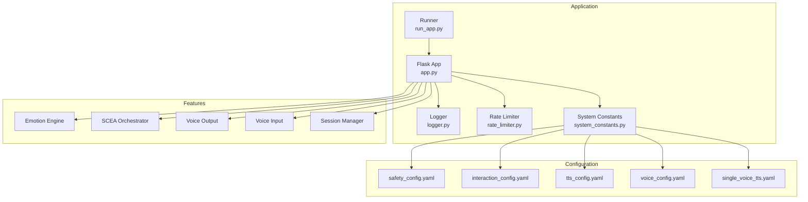
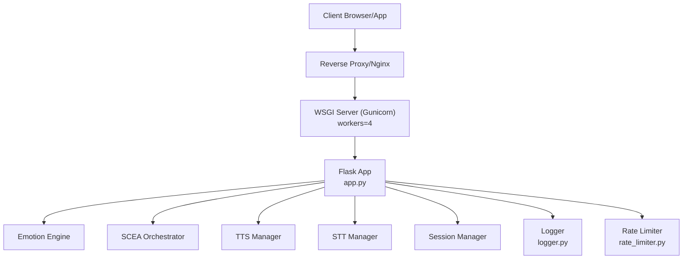
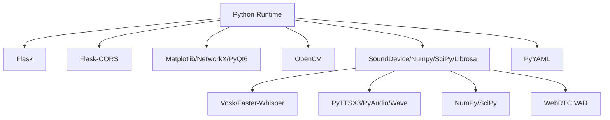

# Deployment and Operations

<cite>
**Referenced Files in This Document**
- [README.md](file://README.md)
- [psychologist/README.md](file://psychologist/README.md)
- [psychologist/app.py](file://psychologist/app.py)
- [psychologist/run_app.py](file://psychologist/run_app.py)
- [psychologist/logger.py](file://psychologist/logger.py)
- [psychologist/requirements.txt](file://psychologist/requirements.txt)
- [psychologist/system_constants.py](file://psychologist/system_constants.py)
- [psychologist/config/safety_config.yaml](file://psychologist/config/safety_config.yaml)
- [psychologist/config/interaction_config.yaml](file://psychologist/config/interaction_config.yaml)
- [psychologist/config/tts_config.yaml](file://psychologist/config/tts_config.yaml)
- [psychologist/config/single_voice_tts.yaml](file://psychologist/config/single_voice_tts.yaml)
- [psychologist/config/voice_config.yaml](file://psychologist/config/voice_config.yaml)
- [psychologist/docs/API.md](file://psychologist/docs/API.md)
- [psychologist/rate_limiter.py](file://psychologist/rate_limiter.py)
</cite>

## Table of Contents
1. [Introduction](#introduction)
2. [Project Structure](#project-structure)
3. [Core Components](#core-components)
4. [Architecture Overview](#architecture-overview)
5. [Detailed Component Analysis](#detailed-component-analysis)
6. [Dependency Analysis](#dependency-analysis)
7. [Performance Considerations](#performance-considerations)
8. [Troubleshooting Guide](#troubleshooting-guide)
9. [Conclusion](#conclusion)
10. [Appendices](#appendices)

## Introduction
This document provides comprehensive deployment and operations guidance for the Psychologist AI Companion (“ZARA”). It covers production deployment procedures, environment configuration, infrastructure setup, monitoring and logging, performance metrics, operational dashboards, maintenance and update processes, backup strategies, troubleshooting, security and access controls, and capacity planning. The system is designed to run offline, with no cloud APIs and no external data services, ensuring privacy and minimal operational dependencies.

## Project Structure
ZARA is a Flask-based web service with a frontend, emotion engine, SCEA (Self-Cognitive & Emotional Architecture) system, voice I/O, and session management. Configuration is centralized via YAML files and system constants. The application supports text, voice, and hybrid interaction modes, with a safety layer and support tools.

**Diagram sources**
- [psychologist/app.py:1-551](file://psychologist/app.py#L1-L551)
- [psychologist/run_app.py:1-27](file://psychologist/run_app.py#L1-L27)
- [psychologist/logger.py:1-72](file://psychologist/logger.py#L1-L72)
- [psychologist/rate_limiter.py:1-143](file://psychologist/rate_limiter.py#L1-L143)
- [psychologist/system_constants.py:1-103](file://psychologist/system_constants.py#L1-L103)
- [psychologist/config/safety_config.yaml:1-116](file://psychologist/config/safety_config.yaml#L1-L116)
- [psychologist/config/interaction_config.yaml:1-60](file://psychologist/config/interaction_config.yaml#L1-L60)
- [psychologist/config/tts_config.yaml:1-61](file://psychologist/config/tts_config.yaml#L1-L61)
- [psychologist/config/voice_config.yaml:1-28](file://psychologist/config/voice_config.yaml#L1-L28)
- [psychologist/config/single_voice_tts.yaml:1-69](file://psychologist/config/single_voice_tts.yaml#L1-L69)

**Section sources**
- [psychologist/README.md:1-180](file://psychologist/README.md#L1-L180)

## Core Components
- Application entrypoint and routing: [psychologist/app.py:1-551](file://psychologist/app.py#L1-L551)
- Logging and structured logging: [psychologist/logger.py:1-72](file://psychologist/logger.py#L1-L72)
- Runner and environment variable handling: [psychologist/run_app.py:1-27](file://psychologist/run_app.py#L1-L27)
- Rate limiting and input validation: [psychologist/rate_limiter.py:1-143](file://psychologist/rate_limiter.py#L1-L143)
- Centralized configuration constants: [psychologist/system_constants.py:1-103](file://psychologist/system_constants.py#L1-L103)
- Configuration files:
  - Safety: [psychologist/config/safety_config.yaml:1-116](file://psychologist/config/safety_config.yaml#L1-L116)
  - Interaction: [psychologist/config/interaction_config.yaml:1-60](file://psychologist/config/interaction_config.yaml#L1-L60)
  - TTS: [psychologist/config/tts_config.yaml:1-61](file://psychologist/config/tts_config.yaml#L1-L61)
  - Voice: [psychologist/config/voice_config.yaml:1-28](file://psychologist/config/voice_config.yaml#L1-L28)
  - Single voice TTS: [psychologist/config/single_voice_tts.yaml:1-69](file://psychologist/config/single_voice_tts.yaml#L1-L69)
- API reference: [psychologist/docs/API.md:1-520](file://psychologist/docs/API.md#L1-L520)
- Dependencies: [psychologist/requirements.txt:1-21](file://psychologist/requirements.txt#L1-L21)

Key operational characteristics:
- Production deployment uses a WSGI server behind a reverse proxy.
- Health endpoint exposes voice subsystem availability.
- Rate limits are enforced per-client IP with configurable windows.
- Logging uses a “zara” namespace with a single stdout handler.

**Section sources**
- [psychologist/app.py:1-551](file://psychologist/app.py#L1-L551)
- [psychologist/run_app.py:1-27](file://psychologist/run_app.py#L1-L27)
- [psychologist/logger.py:1-72](file://psychologist/logger.py#L1-L72)
- [psychologist/rate_limiter.py:1-143](file://psychologist/rate_limiter.py#L1-L143)
- [psychologist/system_constants.py:1-103](file://psychologist/system_constants.py#L1-L103)
- [psychologist/config/safety_config.yaml:1-116](file://psychologist/config/safety_config.yaml#L1-L116)
- [psychologist/config/interaction_config.yaml:1-60](file://psychologist/config/interaction_config.yaml#L1-L60)
- [psychologist/config/tts_config.yaml:1-61](file://psychologist/config/tts_config.yaml#L1-L61)
- [psychologist/config/voice_config.yaml:1-28](file://psychologist/config/voice_config.yaml#L1-L28)
- [psychologist/config/single_voice_tts.yaml:1-69](file://psychologist/config/single_voice_tts.yaml#L1-L69)
- [psychologist/docs/API.md:1-520](file://psychologist/docs/API.md#L1-L520)
- [psychologist/requirements.txt:1-21](file://psychologist/requirements.txt#L1-L21)

## Architecture Overview
ZARA runs as a single-process Flask application with optional WSGI deployment. The system initializes emotion and voice subsystems conditionally, exposing endpoints for emotion processing, interaction, voice I/O, session management, and safety assessment. Configuration is split between runtime constants and YAML files.

**Diagram sources**
- [psychologist/app.py:1-551](file://psychologist/app.py#L1-L551)
- [psychologist/run_app.py:1-27](file://psychologist/run_app.py#L1-L27)
- [psychologist/logger.py:1-72](file://psychologist/logger.py#L1-L72)
- [psychologist/rate_limiter.py:1-143](file://psychologist/rate_limiter.py#L1-L143)

**Section sources**
- [psychologist/README.md:48-58](file://psychologist/README.md#L48-L58)
- [psychologist/app.py:1-551](file://psychologist/app.py#L1-L551)

## Detailed Component Analysis

### Application Startup and Environment Configuration
- Entrypoint sets up logging before importing the Flask app, ensuring all modules under the “zara” namespace log consistently.
- Environment variables control host, port, and debug mode.
- Production recommends binding to 0.0.0.0 behind a reverse proxy and disabling debug mode.

Operational checklist:
- Set FLASK_HOST and FLASK_PORT appropriately.
- Ensure FLASK_DEBUG=0 in production.
- Use a WSGI server (e.g., gunicorn) with multiple workers behind a reverse proxy.

**Section sources**
- [psychologist/run_app.py:1-27](file://psychologist/run_app.py#L1-L27)
- [psychologist/app.py:545-551](file://psychologist/app.py#L545-L551)
- [psychologist/README.md:48-58](file://psychologist/README.md#L48-L58)

### Logging Architecture
- Centralized logging configuration under the “zara” namespace.
- Single stdout handler with a simple formatter; propagation disabled to prevent duplicates.
- Use get_logger(name) to create child loggers for subsystems.

Logging policy recommendations:
- Route stdout to a container log collector or syslog.
- Consider adding file rotation in production deployments.
- Keep INFO level for production; switch to DEBUG only during troubleshooting.

**Section sources**
- [psychologist/logger.py:1-72](file://psychologist/logger.py#L1-L72)
- [psychologist/run_app.py:9-11](file://psychologist/run_app.py#L9-L11)

### Rate Limiting and Safety
- Per-IP sliding-window token bucket rate limiter.
- Different defaults for read vs. write endpoints.
- Input validation ensures JSON presence, non-empty strings, and length limits.

Operational guidance:
- Tune RATE_LIMIT_REQUESTS and RATE_LIMIT_STRICT_REQUESTS in system_constants.py for load profiles.
- Monitor 429 responses and adjust limits accordingly.

**Section sources**
- [psychologist/rate_limiter.py:1-143](file://psychologist/rate_limiter.py#L1-L143)
- [psychologist/system_constants.py:92-102](file://psychologist/system_constants.py#L92-L102)
- [psychologist/app.py:159-174](file://psychologist/app.py#L159-L174)

### Voice I/O Initialization and Availability
- Voice output, input, and emotion components are initialized conditionally.
- Health endpoint reports subsystem availability.
- When unavailable, voice endpoints return 501.

Operational guidance:
- Install voice models and drivers as per requirements.
- Verify device permissions and model paths if voice features are missing.

**Section sources**
- [psychologist/app.py:63-120](file://psychologist/app.py#L63-L120)
- [psychologist/app.py:50-58](file://psychologist/app.py#L50-L58)
- [psychologist/requirements.txt:9-21](file://psychologist/requirements.txt#L9-L21)

### Session Management and Persistence
- Sessions are file-based JSON with configurable limits.
- Endpoints support starting, stopping, retrieving current and historical sessions.
- Session summaries and follow-up suggestions are generated upon session end.

Operational guidance:
- Back up sessions directory regularly.
- Monitor filesystem usage and retention limits.

**Section sources**
- [psychologist/config/interaction_config.yaml:11-13](file://psychologist/config/interaction_config.yaml#L11-L13)
- [psychologist/app.py:449-477](file://psychologist/app.py#L449-L477)

### Safety Layer and Crisis Detection
- Keyword-based detection for self-harm, harm to others, abuse, panic, and medical emergencies.
- Diagnosis blocking prevents clinical language.
- Safe response templates are provided in English and Bangla.

Operational guidance:
- Review and localize safety keywords and templates as needed.
- Ensure professional help reminders and disclaimers are enabled.

**Section sources**
- [psychologist/config/safety_config.yaml:1-116](file://psychologist/config/safety_config.yaml#L1-L116)
- [psychologist/app.py:527-543](file://psychologist/app.py#L527-L543)

### API Endpoints and Metrics Exposure
- Health, emotion, SCEA, interaction, voice output, session, and support endpoints are documented.
- Rate limits apply uniformly across endpoints.

Metrics and dashboards:
- Expose /api/health for basic liveness/readiness checks.
- Track request latency, error rates, and rate-limit hits via reverse proxy or WSGI logs.

**Section sources**
- [psychologist/docs/API.md:1-520](file://psychologist/docs/API.md#L1-L520)
- [psychologist/app.py:50-58](file://psychologist/app.py#L50-L58)

## Dependency Analysis
External dependencies are minimal and focused on voice processing and visualization. The system avoids cloud APIs and LLMs, reducing operational risk.

**Diagram sources**
- [psychologist/requirements.txt:1-21](file://psychologist/requirements.txt#L1-L21)

**Section sources**
- [psychologist/requirements.txt:1-21](file://psychologist/requirements.txt#L1-L21)

## Performance Considerations
- CPU-bound tasks: STT, TTS, and audio processing can be intensive. Provision adequate CPU and memory.
- Disk I/O: Session persistence and optional audio output storage require fast disks.
- Network: None required for core features; reverse proxy adds negligible overhead.
- Concurrency: Use multiple WSGI workers behind a reverse proxy.
- Tuning:
  - Adjust rate limits in system_constants.py to match expected QPS.
  - Monitor voice engine fallback behavior and model sizes.
  - Use hardware acceleration where supported by engines.

[No sources needed since this section provides general guidance]

## Troubleshooting Guide
Common operational issues and resolutions:
- Voice subsystem unavailable:
  - Verify voice models and drivers are installed.
  - Check device permissions and paths.
  - Confirm initialization exceptions are logged.
- Rate limit errors:
  - Inspect 429 responses and adjust limits.
  - Validate client IP forwarding in reverse proxy.
- Health endpoint shows subsystems disabled:
  - Review initialization blocks and logs.
- Session persistence failures:
  - Check filesystem permissions and disk space.
  - Validate sessions directory configuration.
- Audio quality or stuttering:
  - Reduce sample rate or engine complexity.
  - Ensure sufficient CPU headroom.

**Section sources**
- [psychologist/app.py:63-120](file://psychologist/app.py#L63-L120)
- [psychologist/rate_limiter.py:74-112](file://psychologist/rate_limiter.py#L74-L112)
- [psychologist/config/interaction_config.yaml:11-13](file://psychologist/config/interaction_config.yaml#L11-L13)

## Conclusion
ZARA is designed for low-dependency, offline-first deployment with strong privacy guarantees. Production readiness hinges on proper environment configuration, WSGI deployment, reverse proxy setup, logging, and observability. The modular architecture and configuration files simplify maintenance and tuning.

[No sources needed since this section summarizes without analyzing specific files]

## Appendices

### Deployment Checklist
- Install dependencies: [psychologist/requirements.txt:1-21](file://psychologist/requirements.txt#L1-L21)
- Configure environment variables:
  - FLASK_HOST, FLASK_PORT, FLASK_DEBUG
- Prepare voice models and drivers
- Set up reverse proxy and WSGI server
- Configure logging and log aggregation
- Back up sessions directory
- Test endpoints: [psychologist/docs/API.md:1-520](file://psychologist/docs/API.md#L1-L520)

**Section sources**
- [psychologist/requirements.txt:1-21](file://psychologist/requirements.txt#L1-L21)
- [psychologist/README.md:48-58](file://psychologist/README.md#L48-L58)
- [psychologist/docs/API.md:1-520](file://psychologist/docs/API.md#L1-L520)

### Operational Runbook
- Start:
  - Use WSGI server in production; run locally for development.
- Monitor:
  - Health endpoint for subsystem status.
  - Reverse proxy and WSGI logs for errors and latency.
- Scale:
  - Increase WSGI workers; ensure single-process rate limiter constraints.
- Update:
  - Rollback strategy: pinned versions in requirements.txt.
- Backup:
  - Archive sessions directory and audio outputs as needed.

**Section sources**
- [psychologist/README.md:48-58](file://psychologist/README.md#L48-L58)
- [psychologist/config/interaction_config.yaml:11-13](file://psychologist/config/interaction_config.yaml#L11-L13)

### Security and Access Controls
- Privacy-first design: no cloud APIs, no external data services.
- Safety layer: crisis detection, diagnosis blocking, safe templates.
- Access control:
  - Restrict FLASK_HOST to loopback or internal network in production.
  - Use reverse proxy ACLs and TLS termination.
  - Disable FLASK_DEBUG in production.

**Section sources**
- [psychologist/README.md:1-180](file://psychologist/README.md#L1-L180)
- [psychologist/config/safety_config.yaml:1-116](file://psychologist/config/safety_config.yaml#L1-L116)

### Capacity Planning
- Estimate peak concurrent users and derive target QPS.
- Size CPU/memory for STT/TTS workloads.
- Plan disk capacity for sessions and optional audio outputs.
- Account for rate-limiting impact on throughput.

[No sources needed since this section provides general guidance]