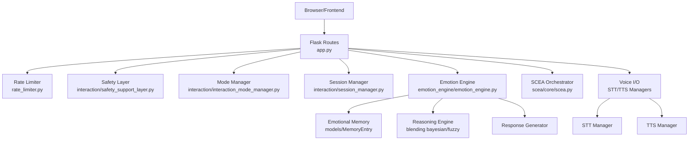
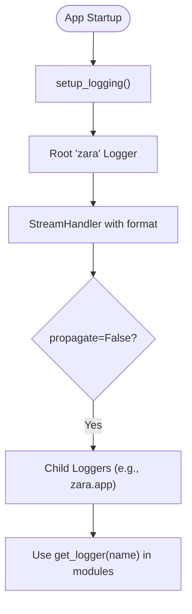
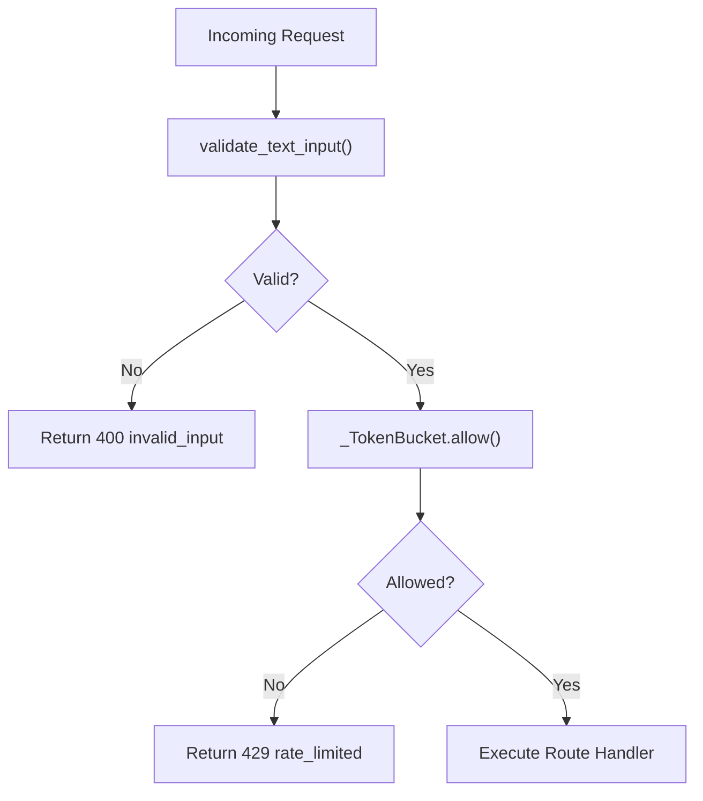
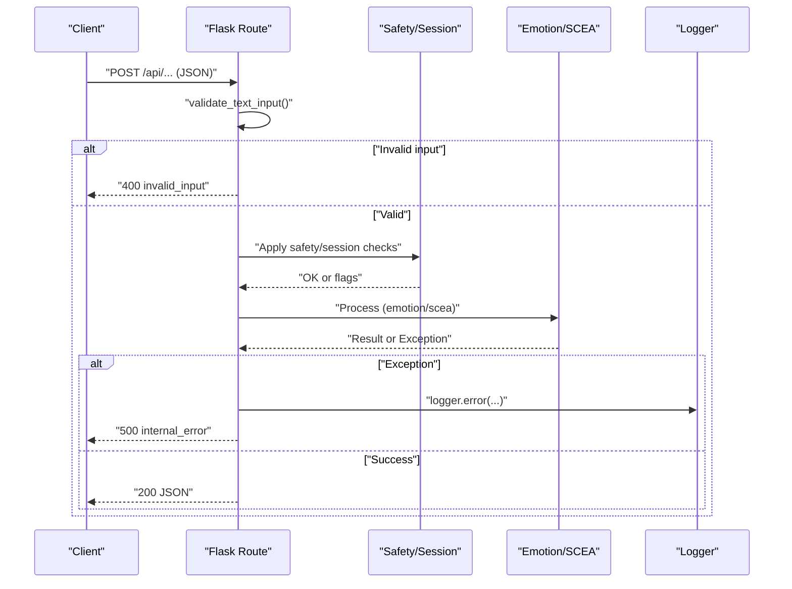
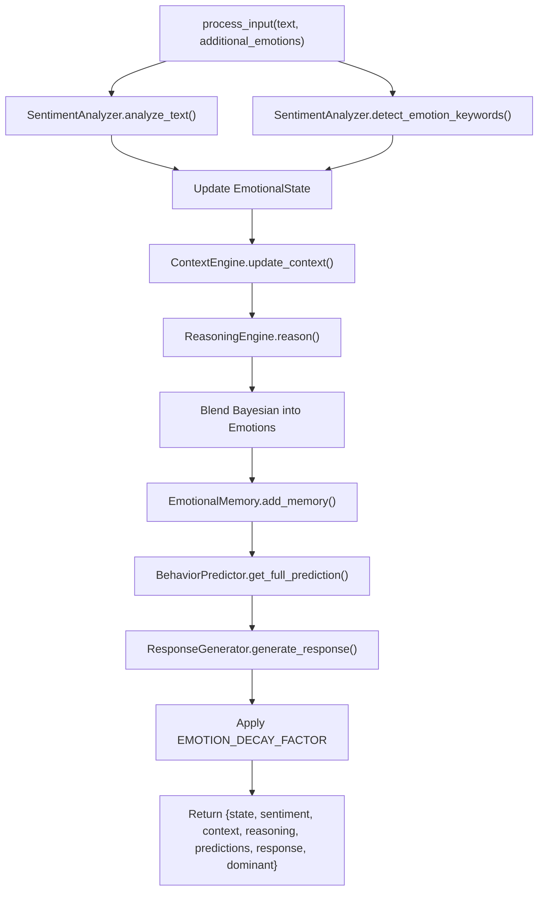
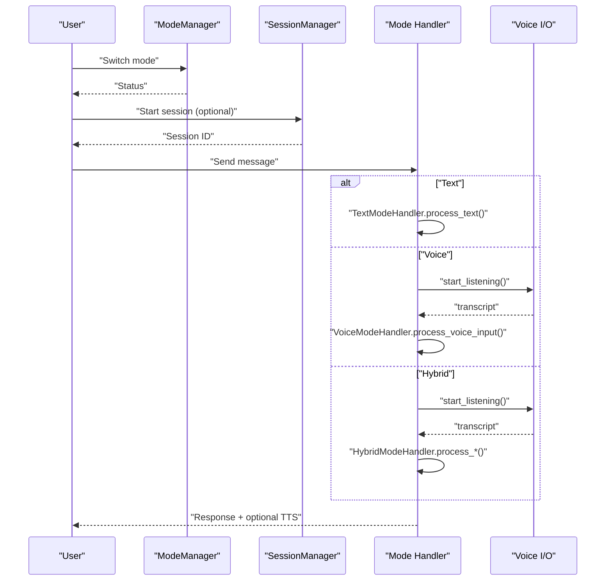
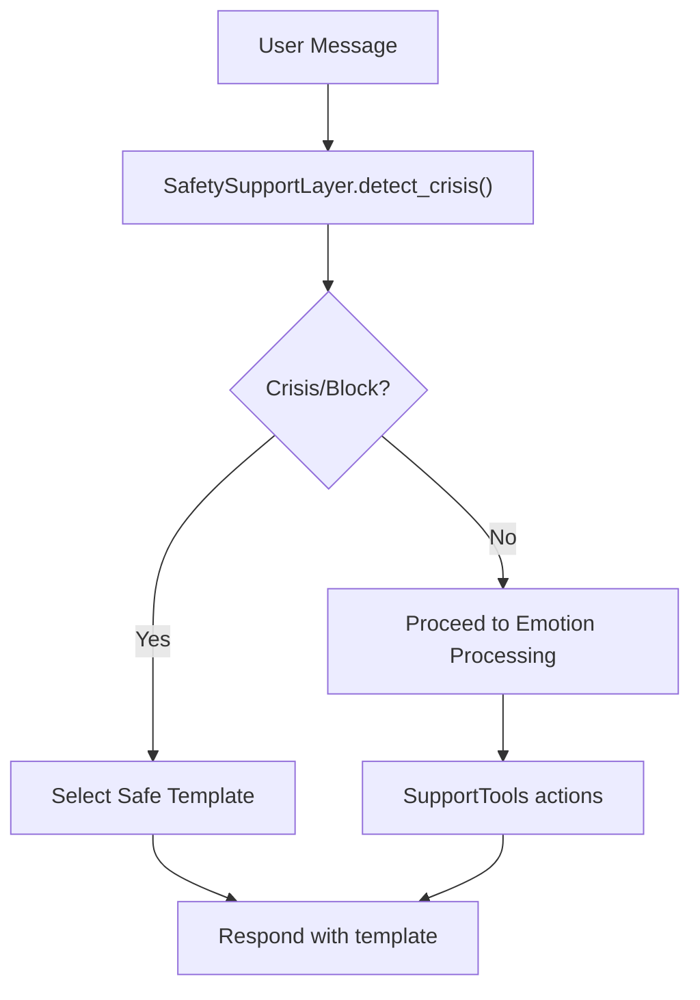
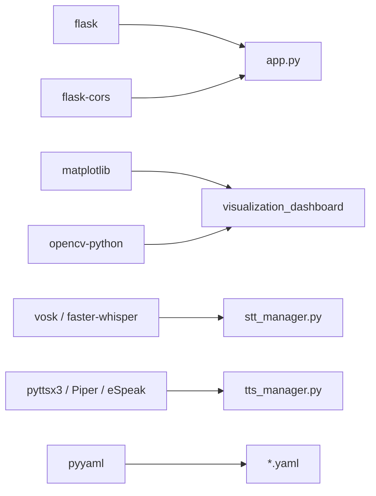

# Development Guidelines

<cite>
**Referenced Files in This Document**
- [README.md](file://README.md)
- [psychologist/README.md](file://psychologist/README.md)
- [run_app.py](file://run_app.py)
- [app.py](file://app.py)
- [logger.py](file://logger.py)
- [rate_limiter.py](file://rate_limiter.py)
- [system_constants.py](file://system_constants.py)
- [requirements.txt](file://requirements.txt)
- [emotion_engine/emotion_engine.py](file://emotion_engine/emotion_engine.py)
- [config/safety_config.yaml](file://config/safety_config.yaml)
- [config/interaction_config.yaml](file://config/interaction_config.yaml)
- [config/tts_config.yaml](file://config/tts_config.yaml)
- [config/single_voice_tts.yaml](file://config/single_voice_tts.yaml)
- [config/voice_config.yaml](file://config/voice_config.yaml)
- [tests/conftest.py](file://tests/conftest.py)
</cite>

## Table of Contents
1. [Introduction](#introduction)
2. [Project Structure](#project-structure)
3. [Core Components](#core-components)
4. [Architecture Overview](#architecture-overview)
5. [Detailed Component Analysis](#detailed-component-analysis)
6. [Dependency Analysis](#dependency-analysis)
7. [Performance Considerations](#performance-considerations)
8. [Troubleshooting Guide](#troubleshooting-guide)
9. [Contribution Guidelines](#contribution-guidelines)
10. [Extension Points and Feature Guides](#extension-points-and-feature-guides)
11. [Conclusion](#conclusion)

## Introduction
This document defines development guidelines for contributing to the Psychologist AI Companion (“ZARA”) project. It explains code organization, architecture, workflow, logging, rate limiting, error handling, testing, and extension points. It also covers environment setup, debugging, profiling, and review expectations to maintain system integrity and safety.

## Project Structure
ZARA is a Flask-based, offline-first emotional support companion. The backend is organized into cohesive subsystems:
- Application entrypoint and API routing
- Emotion engine (keyword-based sentiment, fuzzy logic, Bayesian updates, memory, reasoning, response generation)
- SCEA (Self-Cognitive & Emotional Architecture) subsystems
- Voice I/O (STT and TTS) with fallback chains
- Interaction modes (Text, Voice, Hybrid) and session management
- Safety support layer and support tools
- Configuration via YAML and centralized constants
- Frontend assets and internationalization
- Logging, rate limiting, and tests

```mermaid
graph TB
subgraph "Application"
Run["run_app.py"]
App["app.py"]
Log["logger.py"]
Lim["rate_limiter.py"]
Cfg["system_constants.py"]
end
subgraph "Emotion Engine"
EE["emotion_engine/emotion_engine.py"]
Models["emotion_engine/models.py"]
end
subgraph "SCEA"
SCEA["scea/core/scea.py"]
end
subgraph "Voice I/O"
STT["emotion_engine/voice_system/stt_manager.py"]
TTS["emotion_engine/voice_output/tts_manager.py"]
end
subgraph "Interaction"
ModeMgr["interaction/interaction_mode_manager.py"]
Session["interaction/session_manager.py"]
Safety["interaction/safety_support_layer.py"]
Tools["interaction/support_tools.py"]
TextH["interaction/text_mode_handler.py"]
VoiceH["interaction/voice_mode_handler.py"]
HybridH["interaction/hybrid_mode_handler.py"]
end
Run --> App
App --> Log
App --> Lim
App --> EE
App --> SCEA
App --> STT
App --> TTS
App --> ModeMgr
App --> Session
App --> Safety
App --> Tools
App --> TextH
App --> VoiceH
App --> HybridH
EE --> Models
```

**Diagram sources**
- [run_app.py:1-27](file://run_app.py#L1-L27)
- [app.py:1-551](file://app.py#L1-L551)
- [logger.py:1-72](file://logger.py#L1-L72)
- [rate_limiter.py:1-143](file://rate_limiter.py#L1-L143)
- [system_constants.py:1-103](file://system_constants.py#L1-L103)
- [emotion_engine/emotion_engine.py:1-184](file://emotion_engine/emotion_engine.py#L1-L184)

**Section sources**
- [psychologist/README.md:59-121](file://psychologist/README.md#L59-L121)
- [requirements.txt:1-21](file://requirements.txt#L1-L21)

## Core Components
- Application and API: Central Flask app with structured error handlers, health checks, and modular endpoints for emotion processing, SCEA, voice output, interaction modes, sessions, and support tools.
- Logging: Centralized logger under the “zara” namespace with a single setup and child loggers for subsystems.
- Rate limiting: Per-IP sliding-window token bucket with decorator-based enforcement and input validation helpers.
- Emotion Engine: Multi-stage pipeline combining sentiment, keywords, memory, reasoning, and response generation with personality influence and decay.
- Configuration: YAML configs for safety, interaction modes, voice/TTS, and single-voice settings; centralized constants for tunables.
- Tests: Pytest fixtures for isolated sessions, mocked TTS, and sample session data.

**Section sources**
- [app.py:25-551](file://app.py#L25-L551)
- [logger.py:18-72](file://logger.py#L18-L72)
- [rate_limiter.py:22-143](file://rate_limiter.py#L22-L143)
- [emotion_engine/emotion_engine.py:23-184](file://emotion_engine/emotion_engine.py#L23-L184)
- [system_constants.py:11-103](file://system_constants.py#L11-L103)
- [tests/conftest.py:23-130](file://tests/conftest.py#L23-L130)

## Architecture Overview
ZARA follows a layered, modular architecture:
- Presentation layer: Flask routes and CORS handling
- Control layer: Interaction mode manager, session manager, safety layer
- Processing layer: Emotion engine, SCEA orchestrators, voice processors
- Persistence layer: JSON-based sessions, optional audio outputs
- Configuration layer: YAML and constants



**Diagram sources**
- [app.py:60-150](file://app.py#L60-L150)
- [rate_limiter.py:74-112](file://rate_limiter.py#L74-L112)
- [emotion_engine/emotion_engine.py:23-92](file://emotion_engine/emotion_engine.py#L23-L92)

## Detailed Component Analysis

### Logging System
- Setup: One-time initialization of the “zara” root logger with stdout handler and controlled propagation.
- Usage: Child loggers per subsystem (e.g., “zara.app”, “zara.tts”) to keep logs organized.
- Best practices:
  - Use appropriate levels (info/warning/error/debug).
  - Avoid duplicate handlers by calling setup once at startup.
  - Include contextual info (e.g., exceptions) in log messages.



**Diagram sources**
- [logger.py:18-49](file://logger.py#L18-L49)
- [logger.py:52-72](file://logger.py#L52-L72)
- [run_app.py:7-11](file://run_app.py#L7-L11)

**Section sources**
- [logger.py:18-72](file://logger.py#L18-L72)
- [run_app.py:7-11](file://run_app.py#L7-L11)

### Rate Limiting and Input Validation
- Implementation: Token bucket per client IP with sliding window.
- Decorator: @rate_limit(app, requests, window_seconds) applied to routes.
- Validation: validate_text_input ensures JSON presence, non-empty strings, and length limits.
- Error handling: 429 responses with structured JSON bodies.



**Diagram sources**
- [rate_limiter.py:115-143](file://rate_limiter.py#L115-L143)
- [rate_limiter.py:74-112](file://rate_limiter.py#L74-L112)
- [app.py:159-174](file://app.py#L159-L174)

**Section sources**
- [rate_limiter.py:22-143](file://rate_limiter.py#L22-L143)
- [app.py:159-174](file://app.py#L159-L174)

### Error Handling Patterns
- Centralized error handlers for 400/404/405/429/500.
- Route-level try/catch blocks log failures and return structured errors.
- Safety layer and session manager enforce runtime guardrails.



**Diagram sources**
- [app.py:27-46](file://app.py#L27-L46)
- [app.py:168-173](file://app.py#L168-L173)
- [app.py:214-219](file://app.py#L214-L219)

**Section sources**
- [app.py:27-46](file://app.py#L27-L46)
- [app.py:168-173](file://app.py#L168-L173)
- [app.py:214-219](file://app.py#L214-L219)

### Emotion Engine Processing Pipeline
- Inputs: Text and optional additional emotions.
- Steps: sentiment analysis, keyword detection, state update, context update, reasoning, memory, behavior prediction, response generation, decay.
- Outputs: emotional state, sentiment, context, reasoning, predictions, response, dominant emotion.



**Diagram sources**
- [emotion_engine/emotion_engine.py:37-92](file://emotion_engine/emotion_engine.py#L37-L92)
- [system_constants.py:14-36](file://system_constants.py#L14-L36)

**Section sources**
- [emotion_engine/emotion_engine.py:23-184](file://emotion_engine/emotion_engine.py#L23-L184)
- [system_constants.py:11-36](file://system_constants.py#L11-L36)

### Interaction Modes and Sessions
- Modes: text, voice, hybrid; switchable at runtime with mode manager and session updates.
- Voice I/O: STT manager initializes engines and callbacks; TTS manager supports single-locked voice with fallbacks.
- Sessions: JSON-based persistence with history limits and summaries.



**Diagram sources**
- [app.py:288-447](file://app.py#L288-L447)
- [app.py:337-402](file://app.py#L337-L402)

**Section sources**
- [app.py:288-447](file://app.py#L288-L447)
- [config/interaction_config.yaml:1-60](file://config/interaction_config.yaml#L1-L60)

### Safety and Support Tools
- Safety: Crisis keyword detection (English/Bangla), diagnosis blocking, safe response templates, reminders, and disclaimers.
- Support tools: Breathing, journaling, reflection, mood check-in, grounding, session summary.



**Diagram sources**
- [config/safety_config.yaml:1-116](file://config/safety_config.yaml#L1-L116)
- [app.py:478-526](file://app.py#L478-L526)

**Section sources**
- [config/safety_config.yaml:1-116](file://config/safety_config.yaml#L1-L116)
- [app.py:478-526](file://app.py#L478-L526)

## Dependency Analysis
External dependencies are minimal and offline-friendly. Core and optional packages are declared in requirements.txt. Internal dependencies are explicit and layered (app depends on logging, rate limiting, emotion engine, voice I/O, and interaction modules).



**Diagram sources**
- [requirements.txt:1-21](file://requirements.txt#L1-L21)
- [app.py:60-150](file://app.py#L60-L150)

**Section sources**
- [requirements.txt:1-21](file://requirements.txt#L1-L21)
- [app.py:60-150](file://app.py#L60-L150)

## Performance Considerations
- Keep text lengths within configured limits to reduce processing overhead.
- Prefer keyword-based sentiment and deterministic pipelines to minimize latency.
- Use decay factors and history limits to bound memory growth.
- Avoid unnecessary repeated initialization of voice engines; reuse managers.
- Profile CPU-bound stages (e.g., STT/TTS) and consider async orchestration for I/O-bound tasks.

[No sources needed since this section provides general guidance]

## Troubleshooting Guide
- Logging: Ensure setup_logging is called before importing app modules; verify “zara” namespace logs appear.
- Rate limiting: Confirm client IP is being used; adjust window/request counts if needed.
- Voice I/O: Verify model files and device availability; fallback engines will be used if configured.
- Sessions: Check sessions directory permissions and limits; ensure cleanup after tests.
- Safety: Validate safety_config.yaml entries and language keys.

**Section sources**
- [logger.py:18-49](file://logger.py#L18-L49)
- [rate_limiter.py:74-112](file://rate_limiter.py#L74-L112)
- [config/safety_config.yaml:1-116](file://config/safety_config.yaml#L1-L116)
- [tests/conftest.py:23-50](file://tests/conftest.py#L23-L50)

## Contribution Guidelines

### Development Workflow
- Fork and branch from the latest main.
- Install dependencies from requirements.txt.
- Add or modify tests in the relevant test suites; run pytest with coverage.
- Keep commits focused; reference related issues.
- Update documentation and configuration as needed.

### Coding Conventions
- Use clear, descriptive names; avoid abbreviations.
- Group imports: standard library, third-party, local.
- Favor composition and small functions; keep handlers thin.
- Centralize configuration in system_constants.py and YAML files.
- Log meaningful events; avoid noisy debug prints.

### Documentation Standards
- Document public functions/classes with docstrings.
- Update psychologist/README.md for major changes.
- Keep API docs aligned with route behavior.

### Testing Requirements
- Write unit and integration tests; cover edge cases (empty input, long input, safety flags).
- Use pytest fixtures for isolated sessions and mocked TTS.
- Run the full test suite before submitting PRs.

**Section sources**
- [tests/conftest.py:23-130](file://tests/conftest.py#L23-L130)
- [psychologist/README.md:123-140](file://psychologist/README.md#L123-L140)

## Extension Points and Feature Guides

### Extending the Emotion Processing Engine
- Add new sentiment lexicons or keyword sets in the sentiment analyzer.
- Introduce new reasoning modules and integrate via the reasoning engine.
- Extend memory entry schema and retrieval filters.
- Respect EMOTION_DECAY_FACTOR and EMOTION_HISTORY_LIMIT.

**Section sources**
- [emotion_engine/emotion_engine.py:23-92](file://emotion_engine/emotion_engine.py#L23-L92)
- [system_constants.py:14-36](file://system_constants.py#L14-L36)

### Adding New Interaction Modes
- Implement a new handler similar to text/voice/hybrid handlers.
- Register endpoints and integrate with the mode manager and session manager.
- Honor safety and support tool constraints.

**Section sources**
- [app.py:288-447](file://app.py#L288-L447)
- [config/interaction_config.yaml:1-60](file://config/interaction_config.yaml#L1-L60)

### Integrating Additional Voice Systems
- Add a new STT/voice emotion detector following existing patterns.
- Implement a new TTS engine adapter and register in the fallback chain.
- Update voice_config.yaml and single_voice_tts.yaml accordingly.

**Section sources**
- [config/voice_config.yaml:1-28](file://config/voice_config.yaml#L1-L28)
- [config/single_voice_tts.yaml:1-69](file://config/single_voice_tts.yaml#L1-L69)
- [config/tts_config.yaml:1-61](file://config/tts_config.yaml#L1-L61)

## Conclusion
Follow these guidelines to contribute safely and effectively to ZARA. Maintain modularity, safety, and clarity. Use the provided logging, rate limiting, and configuration mechanisms. Test thoroughly and document changes. When extending, align with the established patterns and constants to preserve system integrity.