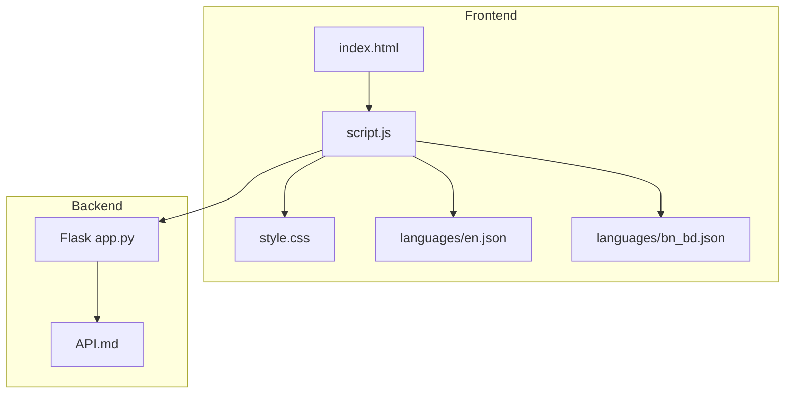
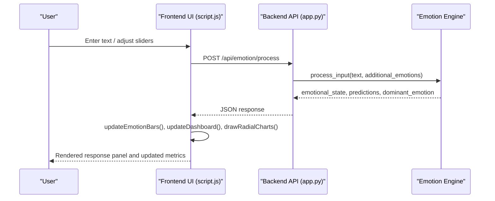
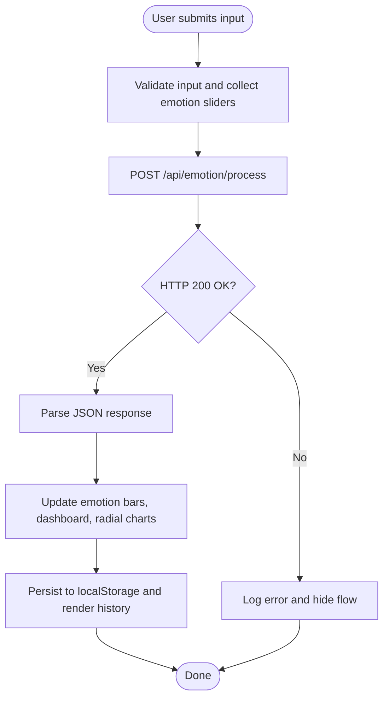
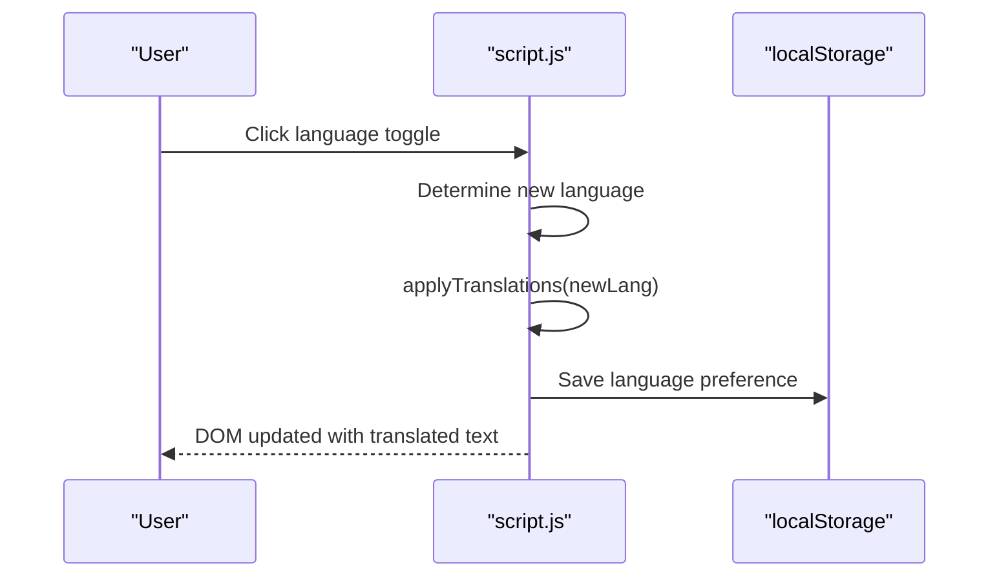
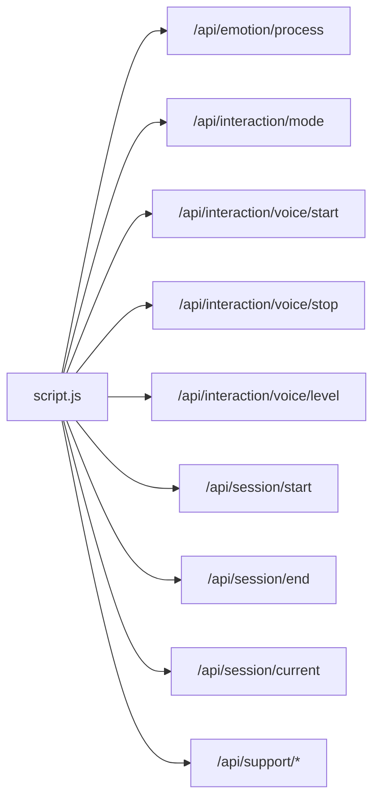

# Frontend Interface

<cite>
**Referenced Files in This Document**
- [index.html](file://psychologist/frontend/index.html)
- [script.js](file://psychologist/frontend/script.js)
- [style.css](file://psychologist/frontend/style.css)
- [en.json](file://psychologist/frontend/languages/en.json)
- [bn_bd.json](file://psychologist/frontend/languages/bn_bd.json)
- [API.md](file://psychologist/docs/API.md)
- [app.py](file://psychologist/app.py)
</cite>

## Table of Contents
1. [Introduction](#introduction)
2. [Project Structure](#project-structure)
3. [Core Components](#core-components)
4. [Architecture Overview](#architecture-overview)
5. [Detailed Component Analysis](#detailed-component-analysis)
6. [Dependency Analysis](#dependency-analysis)
7. [Performance Considerations](#performance-considerations)
8. [Troubleshooting Guide](#troubleshooting-guide)
9. [Conclusion](#conclusion)
10. [Appendices](#appendices)

## Introduction
This document describes the web-based Frontend Interface for the Psychologist project. It covers the HTML/CSS/JavaScript architecture, real-time communication with the backend API, bilingual localization (English and Bangla), responsive design patterns, and user interaction elements. It also documents the emotion display system, session history, and support tool interfaces, along with customization guidelines, accessibility considerations, and browser compatibility.

## Project Structure
The frontend is organized under the `psychologist/frontend` directory:
- index.html: Main page layout and UI sections
- script.js: JavaScript logic for rendering, animations, i18n, and API integration
- style.css: Global styles, theming, and responsive design
- languages/en.json and languages/bn_bd.json: Translation resources for i18n
- docs/API.md: Backend API specification consumed by the frontend
- app.py: Flask backend exposing the APIs used by the frontend

**Diagram sources**
- [index.html](file://psychologist/frontend/index.html)
- [script.js](file://psychologist/frontend/script.js)
- [style.css](file://psychologist/frontend/style.css)
- [en.json](file://psychologist/frontend/languages/en.json)
- [bn_bd.json](file://psychologist/frontend/languages/bn_bd.json)
- [API.md](file://psychologist/docs/API.md)
- [app.py](file://psychologist/app.py)

**Section sources**
- [index.html](file://psychologist/frontend/index.html)
- [script.js](file://psychologist/frontend/script.js)
- [style.css](file://psychologist/frontend/style.css)
- [en.json](file://psychologist/frontend/languages/en.json)
- [bn_bd.json](file://psychologist/frontend/languages/bn_bd.json)
- [API.md](file://psychologist/docs/API.md)
- [app.py](file://psychologist/app.py)

## Core Components
- Layout and Sections: The main page is split into a top status bar, sidebar navigation, main content area, and a bottom interaction console. Each section corresponds to a tabbed view rendered by JavaScript.
- Real-time Emotion and Metrics: Dynamic updates for emotion bars, needs bars, identity metrics, dashboard counters, and radial influence meters.
- Input Console: Text and voice input panels with emotion injection sliders, classification buttons, and a processing flow visualization.
- Companion Interface: Emotional support companion with conversation timeline, mode toggles, audio meter, and support tools.
- Localization: Embedded translation keys and runtime language switching with persistent preferences.

**Section sources**
- [index.html](file://psychologist/frontend/index.html)
- [script.js](file://psychologist/frontend/script.js)
- [style.css](file://psychologist/frontend/style.css)

## Architecture Overview
The frontend renders a dashboard and companion interface, periodically animates metrics, and communicates with the backend via REST endpoints. The backend exposes emotion processing, session management, interaction modes, and support tools.

**Diagram sources**
- [script.js](file://psychologist/frontend/script.js)
- [API.md](file://psychologist/docs/API.md)
- [app.py](file://psychologist/app.py)

## Detailed Component Analysis

### HTML Layout and Sections
- Top Status Bar: System name, online indicator, clock, step counter, cognitive energy bar, and language toggle.
- Sidebar Navigation: Buttons to switch between dashboard sections (Emotions, Needs, Beliefs, Goals, Identity, Memory, Graph, Debate, Simulation, History).
- Main Content: Grid of cards and panels for each section, including emotion sliders, need bars, belief filters, goal cards, conflict bars, identity metrics, memory timeline, knowledge graph, simulation panel, and input history.
- Interaction Console: Left thought stream, center cognitive input with classification buttons and emotion sliders, and right radial influence meters.
- Companion Interface: Conversation timeline, status indicators, input controls (text/voice), and support tools.

**Section sources**
- [index.html](file://psychologist/frontend/index.html)

### JavaScript Implementation
- Initialization and State:
  - Loads localized translations, initializes emotion and need arrays, and sets up DOM references.
  - Applies language preference from localStorage and updates UI accordingly.
- Rendering Functions:
  - Renders beliefs with filtering, goals grid, conflict bars, memory timeline, and input history.
  - Updates emotion bars and needs bars with animated numeric transitions.
  - Draws a knowledge graph canvas and radial influence charts.
- Real-time Updates:
  - Simulates periodic cognitive events and updates emotion bars and radial charts.
  - Starts a thought stream that rotates through cognitive process labels.
- API Integration:
  - Submits text input to `/api/emotion/process`, parses response, and updates UI.
  - Integrates companion features: session start/end, mode switching, text/voice messaging, audio level polling, and support tools.
- Event Handlers:
  - Navigation, filter buttons, input type pills, emotion sliders, language toggle, voice input via Web Speech API, keyboard shortcuts, and companion controls.

**Diagram sources**
- [script.js](file://psychologist/frontend/script.js)
- [API.md](file://psychologist/docs/API.md)

**Section sources**
- [script.js](file://psychologist/frontend/script.js)

### CSS Styling Architecture
- Theming:
  - CSS variables define dark theme colors, neon accents, and typography.
  - Glassmorphism effects with backdrop blur and semi-transparent backgrounds.
- Layout:
  - Flexbox and CSS Grid organize the top bar, sidebar, main content, and console.
  - Responsive breakpoints and fluid grids adapt to screen sizes.
- Animations and Effects:
  - Smooth transitions, glow shadows, and pulsing status indicators.
  - Animated numeric counters and progress bars.
- Components:
  - Cards, bars, radial charts, thought stream, and interactive panels styled consistently.

**Section sources**
- [style.css](file://psychologist/frontend/style.css)

### Bilingual Localization System
- Embedded Translations:
  - The script maintains an embedded translations object for English and Bangla.
  - Keys are referenced via `data-i18n` attributes in HTML and `data-i18n-placeholder` for placeholders.
- Runtime Switching:
  - Clicking the language toggle switches between English and Bangla, updates DOM text and placeholders, and persists the preference.
- Translation Files:
  - Additional translation files (`en.json`, `bn_bd.json`) provide structured keys for potential externalization.

**Diagram sources**
- [script.js](file://psychologist/frontend/script.js)
- [en.json](file://psychologist/frontend/languages/en.json)
- [bn_bd.json](file://psychologist/frontend/languages/bn_bd.json)

**Section sources**
- [script.js](file://psychologist/frontend/script.js)
- [en.json](file://psychologist/frontend/languages/en.json)
- [bn_bd.json](file://psychologist/frontend/languages/bn_bd.json)

### User Interaction Elements
- Input Console:
  - Classification pills select input type.
  - Emotion sliders inject additional emotional context.
  - Voice input via Web Speech API with a microphone button.
  - Processing flow and response panel display cognitive analysis.
- Companion Interface:
  - Mode selector (text/voice/hybrid) with dynamic UI visibility.
  - Audio meter for live input level.
  - Support tools: Calm, Breathing, Journaling, Self-Reflection, Mood Check-in, Session Summary.
  - Conversation timeline with user and assistant messages.

**Section sources**
- [index.html](file://psychologist/frontend/index.html)
- [script.js](file://psychologist/frontend/script.js)

### Backend Integration Examples
- Emotion Processing: Frontend posts text and emotion overrides to `/api/emotion/process`; backend returns updated emotional state and predictions.
- Session Management: Companion starts/ends sessions and retrieves current session state from `/api/session/start`, `/api/session/end`, and `/api/session/current`.
- Interaction Modes: Mode switching and voice I/O handled via `/api/interaction/mode`, `/api/interaction/voice/start`, `/api/interaction/voice/stop`, and `/api/interaction/voice/level`.
- Support Tools: Companion invokes `/api/support/calm`, `/api/support/breathing`, `/api/support/journal`, `/api/support/reflection`, `/api/support/mood-checkin`, and `/api/support/summary`.

**Section sources**
- [script.js](file://psychologist/frontend/script.js)
- [API.md](file://psychologist/docs/API.md)
- [app.py](file://psychologist/app.py)

## Dependency Analysis
- Frontend depends on:
  - HTML structure for sections and DOM elements
  - CSS for styling and responsive behavior
  - JavaScript for rendering, animations, i18n, and API calls
  - Backend REST endpoints for real-time data and actions
- Backend provides:
  - Emotion processing, session lifecycle, interaction modes, and support tools
  - CORS-enabled endpoints for cross-origin access from the frontend

**Diagram sources**
- [script.js](file://psychologist/frontend/script.js)
- [API.md](file://psychologist/docs/API.md)
- [app.py](file://psychologist/app.py)

**Section sources**
- [script.js](file://psychologist/frontend/script.js)
- [API.md](file://psychologist/docs/API.md)
- [app.py](file://psychologist/app.py)

## Performance Considerations
- Rendering Optimizations:
  - Use CSS transforms and opacity for animations to minimize layout thrashing.
  - Debounce or throttle frequent updates (e.g., audio level polling).
- Network Efficiency:
  - Batch UI updates after API responses to reduce reflows.
  - Cache frequently accessed DOM nodes and avoid repeated selectors.
- Asset Loading:
  - Lazy-load canvases and large components only when their sections are active.
- Memory:
  - Limit thought stream length and history items to prevent excessive DOM nodes.

## Troubleshooting Guide
- Language Toggle Not Working:
  - Ensure `localStorage` is available and the language key is saved.
  - Verify translation keys exist in the embedded dictionary.
- Voice Input Issues:
  - Confirm browser supports Web Speech API and microphone permissions are granted.
  - Check that voice endpoints are reachable and not blocked by CORS.
- API Errors:
  - Inspect network tab for 4xx/5xx responses and error payloads.
  - Validate request bodies match API specifications.
- Canvas Rendering Problems:
  - Ensure canvases are sized appropriately and drawn after DOM is ready.
- Session State:
  - If “no active session” appears, start a session before invoking session-dependent endpoints.

**Section sources**
- [script.js](file://psychologist/frontend/script.js)
- [API.md](file://psychologist/docs/API.md)

## Conclusion
The Frontend Interface delivers a modern, responsive, and bilingual dashboard with real-time emotion and session visualization. Its modular JavaScript architecture integrates seamlessly with the backend’s REST APIs, enabling rich user interactions across text, voice, and hybrid modes. The embedded i18n system and consistent CSS theming provide a cohesive user experience, while thoughtful performance and troubleshooting practices ensure reliability.

## Appendices

### UI Customization Guidelines
- Theming:
  - Adjust CSS variables for colors, gradients, and borders to match brand guidelines.
  - Modify glassmorphism effects and shadows for different visual styles.
- Layout:
  - Extend grid templates and card layouts to accommodate new metrics or panels.
  - Add new sections by defining HTML sections and updating navigation and rendering logic.
- Interactions:
  - Introduce new emotion sliders or classification types by adding DOM elements and updating data structures and rendering functions.

### Accessibility Considerations
- Keyboard Navigation:
  - Ensure focus order follows visual flow; provide skip links for main content.
  - Add ARIA roles and labels for interactive elements (buttons, sliders, charts).
- Screen Readers:
  - Use semantic HTML and descriptive labels for charts and progress bars.
  - Announce dynamic updates (e.g., emotion changes) via ARIA live regions.
- Contrast and Fonts:
  - Maintain sufficient contrast ratios for text and indicators.
  - Prefer accessible fonts and scalable units for readability.

### Browser Compatibility
- Modern Browsers:
  - The interface relies on ES6+ features, CSS Grid/Flexbox, and Canvas APIs.
- Polyfills:
  - Consider polyfills for older browsers if broader compatibility is required.
- Speech Recognition:
  - Use vendor prefixes and fallbacks for speech recognition APIs.