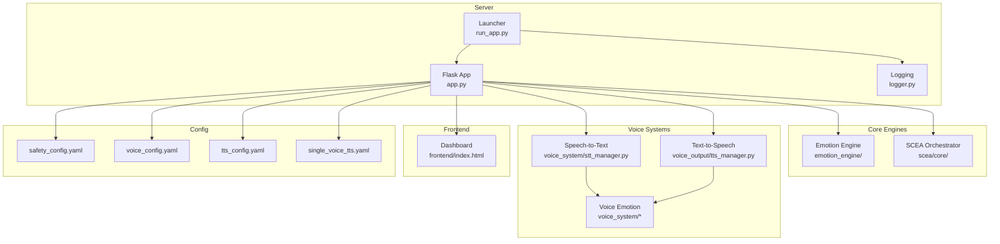

# Getting Started

<cite>
**Referenced Files in This Document**
- [README.md](file://README.md)
- [psychologist/README.md](file://psychologist/README.md)
- [requirements.txt](file://psychologist/requirements.txt)
- [run_app.py](file://psychologist/run_app.py)
- [app.py](file://psychologist/app.py)
- [system_constants.py](file://psychologist/system_constants.py)
- [safety_config.yaml](file://psychologist/config/safety_config.yaml)
- [tts_config.yaml](file://psychologist/config/tts_config.yaml)
- [voice_config.yaml](file://psychologist/config/voice_config.yaml)
- [single_voice_tts.yaml](file://psychologist/config/single_voice_tts.yaml)
- [index.html](file://psychologist/frontend/index.html)
- [logger.py](file://psychologist/logger.py)
- [example.py](file://psychologist/example.py)
- [example_scea.py](file://psychologist/example_scea.py)
</cite>

## Table of Contents
1. [Introduction](#introduction)
2. [Project Structure](#project-structure)
3. [Prerequisites](#prerequisites)
4. [Installation](#installation)
5. [Initial Configuration](#initial-configuration)
6. [First-Time Setup](#first-time-setup)
7. [Basic Usage Walkthrough](#basic-usage-walkthrough)
8. [Quick Start Examples](#quick-start-examples)
9. [Application Startup](#application-startup)
10. [Port Configuration](#port-configuration)
11. [Verification Steps](#verification-steps)
12. [Troubleshooting Guide](#troubleshooting-guide)
13. [Conclusion](#conclusion)

## Introduction
Psychologist AI Companion (ZARA) is an offline-first emotional support companion that runs entirely on your machine. It provides text and voice interaction modes, a safety layer for crisis detection, and a rich visualization dashboard. The system is designed to be privacy-preserving, with no cloud APIs or external data services.

## Project Structure
At a high level, the application consists of:
- A Flask web server exposing REST endpoints
- An emotion engine and SCEA (Self-Cognitive & Emotional Architecture) system
- Voice input/output components (STT and TTS)
- A frontend dashboard for interaction and visualization
- Configuration files for safety, voice, and TTS behavior

**Diagram sources**
- [app.py:1-551](file://psychologist/app.py#L1-L551)
- [run_app.py:1-27](file://psychologist/run_app.py#L1-L27)
- [logger.py:1-72](file://psychologist/logger.py#L1-L72)
- [index.html:1-709](file://psychologist/frontend/index.html#L1-L709)
- [safety_config.yaml:1-116](file://psychologist/config/safety_config.yaml#L1-L116)
- [voice_config.yaml:1-28](file://psychologist/config/voice_config.yaml#L1-L28)
- [tts_config.yaml:1-61](file://psychologist/config/tts_config.yaml#L1-L61)
- [single_voice_tts.yaml:1-69](file://psychologist/config/single_voice_tts.yaml#L1-L69)

**Section sources**
- [psychologist/README.md:59-121](file://psychologist/README.md#L59-L121)

## Prerequisites
- Python: Version 3.10 or newer is required.
- pip: Required to install dependencies.
- Operating system: Windows, macOS, or Linux (tested environments vary; ensure platform compatibility for audio libraries).
- Hardware recommendations:
  - CPU: Modern x86_64 or ARM64 processor
  - RAM: Minimum 4 GB; 8 GB+ recommended for smoother voice processing
  - Audio devices: Microphone and speakers/headphones for voice mode
  - Disk: Sufficient space for voice model downloads (see Voice Model Downloads below)

Notes:
- The project does not rely on large language models or cloud APIs; all processing happens locally.
- Voice functionality requires additional model downloads and compatible audio drivers.

**Section sources**
- [psychologist/README.md:20-24](file://psychologist/README.md#L20-L24)

## Installation
Follow these steps to install and prepare the application:

1. Install Python 3.10+ and ensure pip is available.
2. Clone or download the repository to your local machine.
3. Navigate to the project directory and install dependencies:
   - From the root, run: pip install -r psychologist/requirements.txt
4. Verify installation by running the example scripts:
   - python psychologist/example.py
   - python psychologist/example_scea.py

Optional: For production deployments, install a WSGI server (e.g., gunicorn) and configure environment variables as described in the project documentation.

**Section sources**
- [psychologist/README.md:25-30](file://psychologist/README.md#L25-L30)
- [requirements.txt:1-21](file://psychologist/requirements.txt#L1-L21)
- [example.py:1-61](file://psychologist/example.py#L1-L61)
- [example_scea.py:1-103](file://psychologist/example_scea.py#L1-L103)

## Initial Configuration
The system centralizes configuration in several YAML files and constants:

- Safety configuration:
  - Crisis keywords and safe response templates are defined in config/safety_config.yaml.
  - The safety layer blocks diagnostic statements and triggers crisis-safe responses.
- Voice configuration:
  - Default engines and fallbacks are set in config/tts_config.yaml and config/single_voice_tts.yaml.
  - Speech recognition defaults and engine preferences are in config/voice_config.yaml.
- System-wide constants:
  - Tunable limits and defaults are defined in system_constants.py (e.g., ports, rate limits, lengths).

Environment variables:
- FLASK_HOST: Default binding address (default: 127.0.0.1)
- FLASK_PORT: Default listening port (default: 5000)
- FLASK_DEBUG: Enable debug mode (default: 0)

These can be set before launching the application.

**Section sources**
- [safety_config.yaml:1-116](file://psychologist/config/safety_config.yaml#L1-L116)
- [tts_config.yaml:1-61](file://psychologist/config/tts_config.yaml#L1-L61)
- [single_voice_tts.yaml:1-69](file://psychologist/config/single_voice_tts.yaml#L1-L69)
- [voice_config.yaml:1-28](file://psychologist/config/voice_config.yaml#L1-L28)
- [system_constants.py:84-102](file://psychologist/system_constants.py#L84-L102)
- [psychologist/README.md:40-47](file://psychologist/README.md#L40-L47)

## First-Time Setup
On first launch, the application initializes:
- Logging via logger.py
- Emotion engine and SCEA systems
- Voice input/output components (if available)
- Session management and interaction mode manager

If voice components fail to initialize (e.g., missing models or drivers), the system continues in text-only mode and logs warnings.

Key startup behavior:
- run_app.py sets up logging and reads environment variables for host, port, and debug mode.
- app.py initializes engines, sets up endpoints, and handles voice availability dynamically.

**Section sources**
- [run_app.py:1-27](file://psychologist/run_app.py#L1-L27)
- [logger.py:1-72](file://psychologist/logger.py#L1-L72)
- [app.py:60-120](file://psychologist/app.py#L60-L120)

## Basic Usage Walkthrough
After starting the server, open the dashboard in your browser at http://127.0.0.1:5000.

The dashboard provides:
- Conversation panel for sending messages and viewing responses
- Status indicators for mode, emotion, safety, and audio state
- Input controls for text and voice modes
- Support tools (calming, breathing, journaling, reflection, mood check-in, session summary)
- Visualization panels for cognitive state, needs, identity, and more

Switch between interaction modes:
- Hybrid: Text and voice combined
- Text: Keyboard input only
- Voice: Microphone input with live transcription

Start a session, choose a mode, and interact with the companion. Responses are generated by the emotion engine and optionally spoken aloud via TTS.

**Section sources**
- [index.html:370-535](file://psychologist/frontend/index.html#L370-L535)
- [app.py:288-447](file://psychologist/app.py#L288-L447)

## Quick Start Examples
Below are two quick examples to get you started with both text and voice modes.

### Text Mode Example
- Send a message to the interaction endpoint with JSON payload containing your text.
- Optionally specify language, user mood, and whether to speak the response.
- The system responds with processed emotion state, reasoning mode, and generated text.

Reference paths:
- [Text interaction endpoint:290-335](file://psychologist/app.py#L290-L335)
- [Example script for emotion engine:1-61](file://psychologist/example.py#L1-L61)

### Voice Mode Example
- Start voice input to begin listening.
- Stop voice input to process the transcript.
- The system generates a response and optionally speaks it aloud.

Reference paths:
- [Voice start endpoint:337-356](file://psychologist/app.py#L337-L356)
- [Voice stop endpoint:358-402](file://psychologist/app.py#L358-L402)
- [Voice status endpoint:404-424](file://psychologist/app.py#L404-L424)

**Section sources**
- [app.py:290-424](file://psychologist/app.py#L290-L424)
- [example.py:1-61](file://psychologist/example.py#L1-L61)

## Application Startup
The application can be launched in two primary ways:

- Development mode:
  - Run the launcher script: python run_app.py
  - This sets up logging and starts the Flask server with host, port, and debug flags from environment variables.

- Production mode:
  - Use a WSGI server (e.g., gunicorn) to serve the app.
  - Example command: gunicorn -w 4 -b 0.0.0.0:5000 run_app:app
  - Set FLASK_DEBUG=0 and bind to 127.0.0.1 behind a reverse proxy.

Logs are structured under the zara.* namespace and printed to stdout.

**Section sources**
- [run_app.py:1-27](file://psychologist/run_app.py#L1-L27)
- [psychologist/README.md:48-57](file://psychologist/README.md#L48-L57)
- [logger.py:1-72](file://psychologist/logger.py#L1-L72)

## Port Configuration
By default, the server binds to 127.0.0.1:5000. You can override this using environment variables:

- FLASK_HOST: Change the bind address (default: 127.0.0.1)
- FLASK_PORT: Change the listen port (default: 5000)
- FLASK_DEBUG: Enable debug mode (default: 0)

These are read during startup in both run_app.py and app.py.

**Section sources**
- [run_app.py:16-23](file://psychologist/run_app.py#L16-L23)
- [app.py:545-550](file://psychologist/app.py#L545-L550)
- [system_constants.py:86-90](file://psychologist/system_constants.py#L86-L90)
- [psychologist/README.md:40-47](file://psychologist/README.md#L40-L47)

## Verification Steps
To verify a successful installation and basic functionality:

1. Health check endpoint:
   - GET /api/health
   - Response includes voice output/input/emotion availability flags.

2. Emotion processing:
   - POST /api/emotion/process with a JSON body containing text.
   - Expect a response with dominant emotion, reasoning mode, and generated text.

3. Session management:
   - POST /api/session/start to begin a session.
   - GET /api/session/current to confirm active session.
   - POST /api/session/end to end the session.

4. Voice endpoints (if available):
   - POST /api/voice-output/tts to synthesize speech.
   - GET /api/voice-output/status to inspect voice lock and activity log.

5. Frontend:
   - Open http://127.0.0.1:5000 in your browser.
   - Interact via the dashboard and observe status indicators.

Reference paths:
- [Health endpoint:50-58](file://psychologist/app.py#L50-L58)
- [Emotion processing endpoint:159-177](file://psychologist/app.py#L159-L177)
- [Session endpoints:449-476](file://psychologist/app.py#L449-L476)
- [Voice output endpoints:238-286](file://psychologist/app.py#L238-L286)

**Section sources**
- [app.py:50-58](file://psychologist/app.py#L50-L58)
- [app.py:159-177](file://psychologist/app.py#L159-L177)
- [app.py:449-476](file://psychologist/app.py#L449-L476)
- [app.py:238-286](file://psychologist/app.py#L238-L286)

## Troubleshooting Guide
Common installation and runtime issues:

- Python version mismatch:
  - Ensure Python 3.10+ is installed. Lower versions may cause import errors.

- Missing audio drivers or incompatible OS:
  - Voice input/output may fail to initialize. The system logs warnings and continues in text-only mode.
  - On Windows/macOS/Linux, ensure sounddevice, PyAudio, and system audio drivers are functional.

- Voice model downloads:
  - Piper, Vosk, and Whisper models must be downloaded separately for TTS/STT.
  - Place models in the expected directories as configured in tts_config.yaml and single_voice_tts.yaml.

- Port conflicts:
  - If port 5000 is in use, change FLASK_PORT or stop the conflicting service.

- Permission errors:
  - On some systems, microphone access may require explicit permissions.

- Rate limiting:
  - The API applies rate limits. Exceeding limits returns a 429 error.

- Safety layer behavior:
  - Crisis keywords trigger safety responses. Review config/safety_config.yaml to understand detection and templates.

**Section sources**
- [psychologist/README.md:169-176](file://psychologist/README.md#L169-L176)
- [tts_config.yaml:12-18](file://psychologist/config/tts_config.yaml#L12-L18)
- [single_voice_tts.yaml:12-18](file://psychologist/config/single_voice_tts.yaml#L12-L18)
- [app.py:39-46](file://psychologist/app.py#L39-L46)

## Conclusion
You are now ready to use the Psychologist AI Companion. Start with the dashboard at http://127.0.0.1:5000, switch between text and voice modes, and explore the visualization panels. For production deployments, use a WSGI server and configure environment variables as needed. If you encounter issues, consult the troubleshooting section and verify the health endpoints.