# Interaction Management System

<cite>
**Referenced Files in This Document**
- [interaction_mode_manager.py](file://psychologist/emotion_engine/interaction/interaction_mode_manager.py)
- [session_manager.py](file://psychologist/emotion_engine/interaction/session_manager.py)
- [safety_support_layer.py](file://psychologist/emotion_engine/interaction/safety_support_layer.py)
- [support_tools.py](file://psychologist/emotion_engine/interaction/support_tools.py)
- [text_mode_handler.py](file://psychologist/emotion_engine/interaction/text_mode_handler.py)
- [voice_mode_handler.py](file://psychologist/emotion_engine/interaction/voice_mode_handler.py)
- [hybrid_mode_handler.py](file://psychologist/emotion_engine/interaction/hybrid_mode_handler.py)
- [interaction_models.py](file://psychologist/emotion_engine/interaction/interaction_models.py)
- [interaction_config.yaml](file://psychologist/config/interaction_config.yaml)
- [safety_config.yaml](file://psychologist/config/safety_config.yaml)
- [context_engine.py](file://psychologist/emotion_engine/context_engine/context_engine.py)
- [emotional_memory.py](file://psychologist/emotion_engine/emotional_memory/emotional_memory.py)
- [emotion_state_machine.py](file://psychologist/emotion_engine/state_machine/emotion_state_machine.py)
- [learning_system.py](file://psychologist/emotion_engine/learning_system/learning_system.py)
</cite>

## Table of Contents
1. [Introduction](#introduction)
2. [Project Structure](#project-structure)
3. [Core Components](#core-components)
4. [Architecture Overview](#architecture-overview)
5. [Detailed Component Analysis](#detailed-component-analysis)
6. [Dependency Analysis](#dependency-analysis)
7. [Performance Considerations](#performance-considerations)
8. [Troubleshooting Guide](#troubleshooting-guide)
9. [Conclusion](#conclusion)
10. [Appendices](#appendices)

## Introduction
The Interaction Management System orchestrates text, voice, and hybrid interaction modes for an offline emotional support companion. It manages session lifecycles, ensures safety through keyword-based detection and response filtering, persists conversations locally, and offers privacy-preserving storage. The system integrates support tools (breathing exercises, journaling prompts, reflection questions, mood tracking) and provides a structured interaction pipeline from user input to response delivery, including optional voice synthesis.

## Project Structure
The system is organized into focused modules under the interaction package, with supporting emotion engines, voice systems, and configuration files. Key areas:
- Interaction orchestration: mode management, handlers, session manager, safety layer, support tools
- Emotion engines: context engine, emotional memory, state machine, learning system
- Configuration: YAML files for interaction and safety rules
- Voice subsystem: STT/TTS managers and related components (referenced by handlers)

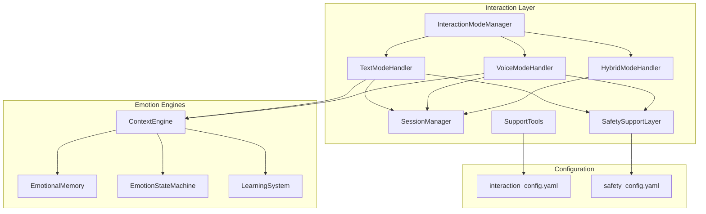

**Diagram sources**
- [interaction_mode_manager.py:17-166](file://psychologist/emotion_engine/interaction/interaction_mode_manager.py#L17-L166)
- [text_mode_handler.py:23-170](file://psychologist/emotion_engine/interaction/text_mode_handler.py#L23-L170)
- [voice_mode_handler.py:28-305](file://psychologist/emotion_engine/interaction/voice_mode_handler.py#L28-L305)
- [hybrid_mode_handler.py:18-120](file://psychologist/emotion_engine/interaction/hybrid_mode_handler.py#L18-L120)
- [session_manager.py:26-303](file://psychologist/emotion_engine/interaction/session_manager.py#L26-L303)
- [safety_support_layer.py:24-286](file://psychologist/emotion_engine/interaction/safety_support_layer.py#L24-L286)
- [support_tools.py:19-179](file://psychologist/emotion_engine/interaction/support_tools.py#L19-L179)
- [context_engine.py:9-117](file://psychologist/emotion_engine/context_engine/context_engine.py#L9-L117)
- [emotional_memory.py:8-103](file://psychologist/emotion_engine/emotional_memory/emotional_memory.py#L8-L103)
- [emotion_state_machine.py:5-90](file://psychologist/emotion_engine/state_machine/emotion_state_machine.py#L5-L90)
- [learning_system.py:5-59](file://psychologist/emotion_engine/learning_system/learning_system.py#L5-L59)
- [interaction_config.yaml:1-60](file://psychologist/config/interaction_config.yaml#L1-L60)
- [safety_config.yaml:1-116](file://psychologist/config/safety_config.yaml#L1-L116)

**Section sources**
- [interaction_mode_manager.py:17-166](file://psychologist/emotion_engine/interaction/interaction_mode_manager.py#L17-L166)
- [session_manager.py:26-303](file://psychologist/emotion_engine/interaction/session_manager.py#L26-L303)
- [safety_support_layer.py:24-286](file://psychologist/emotion_engine/interaction/safety_support_layer.py#L24-L286)
- [support_tools.py:19-179](file://psychologist/emotion_engine/interaction/support_tools.py#L19-L179)
- [text_mode_handler.py:23-170](file://psychologist/emotion_engine/interaction/text_mode_handler.py#L23-L170)
- [voice_mode_handler.py:28-305](file://psychologist/emotion_engine/interaction/voice_mode_handler.py#L28-L305)
- [hybrid_mode_handler.py:18-120](file://psychologist/emotion_engine/interaction/hybrid_mode_handler.py#L18-L120)
- [interaction_models.py:15-309](file://psychologist/emotion_engine/interaction/interaction_models.py#L15-L309)
- [interaction_config.yaml:1-60](file://psychologist/config/interaction_config.yaml#L1-L60)
- [safety_config.yaml:1-116](file://psychologist/config/safety_config.yaml#L1-L116)

## Core Components
- InteractionModeManager: central controller for mode selection and configuration across text, voice, and hybrid modes.
- TextModeHandler: end-to-end pipeline for text input including normalization, safety assessment, emotion processing, response generation, optional TTS, and session persistence.
- VoiceModeHandler: end-to-end pipeline for voice input with STT, optional voice emotion features, emotion fusion, safety checks, response generation, TTS, and session persistence.
- HybridModeHandler: seamless delegation between text and voice modes within a single session, preserving context and updating mode metadata.
- SessionManager: creates, updates, saves, loads, and summarizes sessions; maintains conversation history, detected emotions, safety flags, and follow-up suggestions.
- SafetySupportLayer: keyword-based crisis detection, moderate distress detection, response filtering to prevent diagnostic statements, and safe response templates.
- SupportTools: curated, pre-authored scripts for calming, breathing exercises, journaling prompts, reflection questions, mood check-ins, grounding exercises, and session summaries.
- InteractionModels: shared enums and dataclasses for modes, messages, sessions, safety assessments, and support actions.
- Configuration: YAML-based settings for interaction defaults, safety thresholds, and privacy controls.

**Section sources**
- [interaction_mode_manager.py:17-166](file://psychologist/emotion_engine/interaction/interaction_mode_manager.py#L17-L166)
- [text_mode_handler.py:23-170](file://psychologist/emotion_engine/interaction/text_mode_handler.py#L23-L170)
- [voice_mode_handler.py:28-305](file://psychologist/emotion_engine/interaction/voice_mode_handler.py#L28-L305)
- [hybrid_mode_handler.py:18-120](file://psychologist/emotion_engine/interaction/hybrid_mode_handler.py#L18-L120)
- [session_manager.py:26-303](file://psychologist/emotion_engine/interaction/session_manager.py#L26-L303)
- [safety_support_layer.py:24-286](file://psychologist/emotion_engine/interaction/safety_support_layer.py#L24-L286)
- [support_tools.py:19-179](file://psychologist/emotion_engine/interaction/support_tools.py#L19-L179)
- [interaction_models.py:15-309](file://psychologist/emotion_engine/interaction/interaction_models.py#L15-L309)
- [interaction_config.yaml:1-60](file://psychologist/config/interaction_config.yaml#L1-L60)
- [safety_config.yaml:1-116](file://psychologist/config/safety_config.yaml#L1-L116)

## Architecture Overview
The system follows a layered architecture:
- Presentation/UI layer interacts with InteractionModeManager to select mode.
- Handlers (Text/Voice/Hybrid) coordinate emotion processing, safety checks, and response generation.
- SessionManager persists and summarizes conversations.
- SafetySupportLayer enforces safety policies.
- SupportTools provides curated content.
- Emotion engines (ContextEngine, EmotionalMemory, EmotionStateMachine, LearningSystem) power emotion modeling and adaptation.

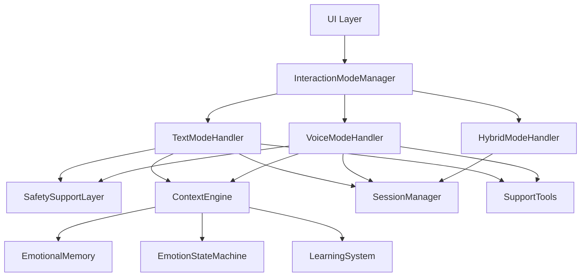

**Diagram sources**
- [interaction_mode_manager.py:17-166](file://psychologist/emotion_engine/interaction/interaction_mode_manager.py#L17-L166)
- [text_mode_handler.py:23-170](file://psychologist/emotion_engine/interaction/text_mode_handler.py#L23-L170)
- [voice_mode_handler.py:28-305](file://psychologist/emotion_engine/interaction/voice_mode_handler.py#L28-L305)
- [hybrid_mode_handler.py:18-120](file://psychologist/emotion_engine/interaction/hybrid_mode_handler.py#L18-L120)
- [session_manager.py:26-303](file://psychologist/emotion_engine/interaction/session_manager.py#L26-L303)
- [safety_support_layer.py:24-286](file://psychologist/emotion_engine/interaction/safety_support_layer.py#L24-L286)
- [support_tools.py:19-179](file://psychologist/emotion_engine/interaction/support_tools.py#L19-L179)
- [context_engine.py:9-117](file://psychologist/emotion_engine/context_engine/context_engine.py#L9-L117)
- [emotional_memory.py:8-103](file://psychologist/emotion_engine/emotional_memory/emotional_memory.py#L8-L103)
- [emotion_state_machine.py:5-90](file://psychologist/emotion_engine/state_machine/emotion_state_machine.py#L5-L90)
- [learning_system.py:5-59](file://psychologist/emotion_engine/learning_system/learning_system.py#L5-L59)

## Detailed Component Analysis

### Interaction Mode Management
- Responsibilities:
  - Maintain current mode and allowed modes.
  - Provide per-mode configuration (input/output capabilities, response length limits).
  - Track mode history and expose status.
- Behavior:
  - Parses mode names and validates against allowed sets.
  - Enforces response length constraints per mode.
  - Logs activity via callback.

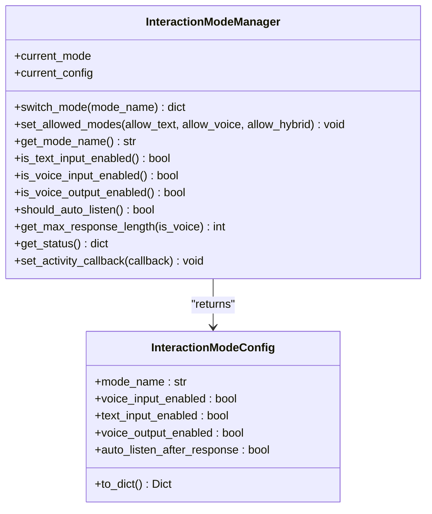

**Diagram sources**
- [interaction_mode_manager.py:17-166](file://psychologist/emotion_engine/interaction/interaction_mode_manager.py#L17-L166)
- [interaction_models.py:71-87](file://psychologist/emotion_engine/interaction/interaction_models.py#L71-L87)

**Section sources**
- [interaction_mode_manager.py:17-166](file://psychologist/emotion_engine/interaction/interaction_mode_manager.py#L17-L166)
- [interaction_models.py:17-87](file://psychologist/emotion_engine/interaction/interaction_models.py#L17-L87)

### Session Lifecycle Management
- Responsibilities:
  - Start/end sessions with timestamps and summaries.
  - Record user and assistant messages, detected emotions, safety flags, and preferences.
  - Persist sessions to JSON files and maintain a bounded history.
  - Compute recurring emotion patterns and preferred interaction mode.
- Persistence:
  - Stores sessions in a configurable directory with JSON files named by session ID.
  - Automatically cleans up oldest sessions when exceeding configured limits.

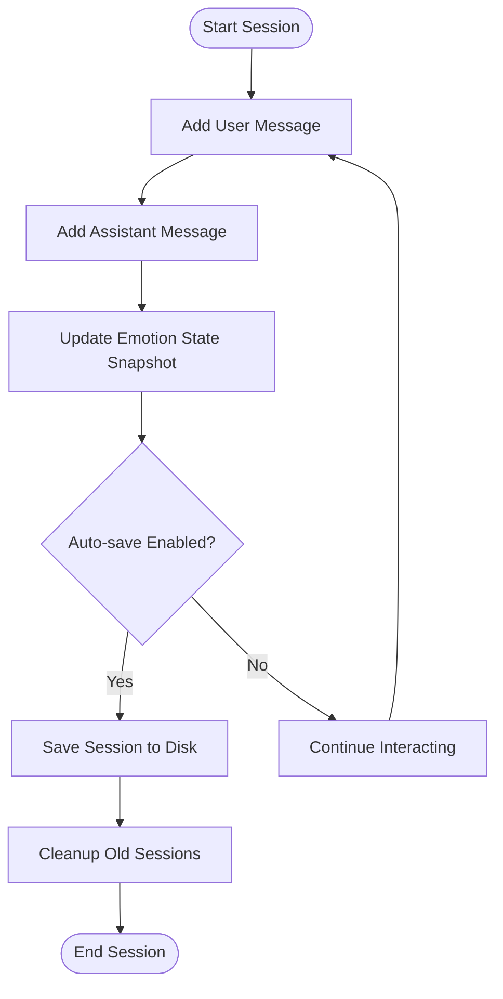

**Diagram sources**
- [session_manager.py:59-132](file://psychologist/emotion_engine/interaction/session_manager.py#L59-L132)
- [session_manager.py:279-303](file://psychologist/emotion_engine/interaction/session_manager.py#L279-L303)

**Section sources**
- [session_manager.py:26-303](file://psychologist/emotion_engine/interaction/session_manager.py#L26-L303)
- [interaction_models.py:191-262](file://psychologist/emotion_engine/interaction/interaction_models.py#L191-L262)

### Safety Monitoring Capabilities
- Detection:
  - Crisis detection using language-specific keyword categories (self-harm, harm to others, abuse, panic, medical emergencies).
  - Moderate distress detection using predefined keywords.
- Filtering:
  - Blocks diagnostic or medical claim statements in generated responses.
- Templates:
  - Provides safe, pre-written templates for crisis and non-crisis distress scenarios.
- Professional reminders and disclaimers:
  - Offers reminders and disclaimers in multiple languages.

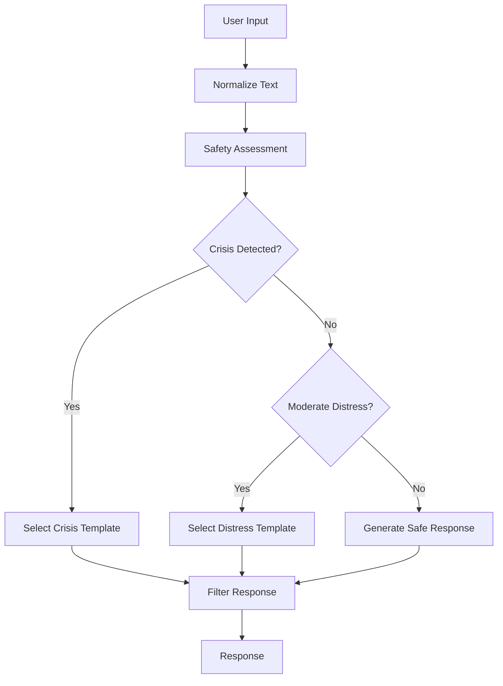

**Diagram sources**
- [safety_support_layer.py:80-135](file://psychologist/emotion_engine/interaction/safety_support_layer.py#L80-L135)
- [safety_support_layer.py:167-227](file://psychologist/emotion_engine/interaction/safety_support_layer.py#L167-L227)
- [safety_support_layer.py:231-285](file://psychologist/emotion_engine/interaction/safety_support_layer.py#L231-L285)

**Section sources**
- [safety_support_layer.py:24-286](file://psychologist/emotion_engine/interaction/safety_support_layer.py#L24-L286)
- [safety_config.yaml:5-116](file://psychologist/config/safety_config.yaml#L5-L116)

### Support Tools Library
- Offerings:
  - Calm-down scripts, breathing exercises, journaling prompts, reflection questions, mood check-ins, grounding exercises, and session summaries.
  - Content is pre-authored and localized in English and Bangla.
- Behavior:
  - Randomly selects from available scripts per action type and language.
  - Supports emotion-aware journaling prompts.

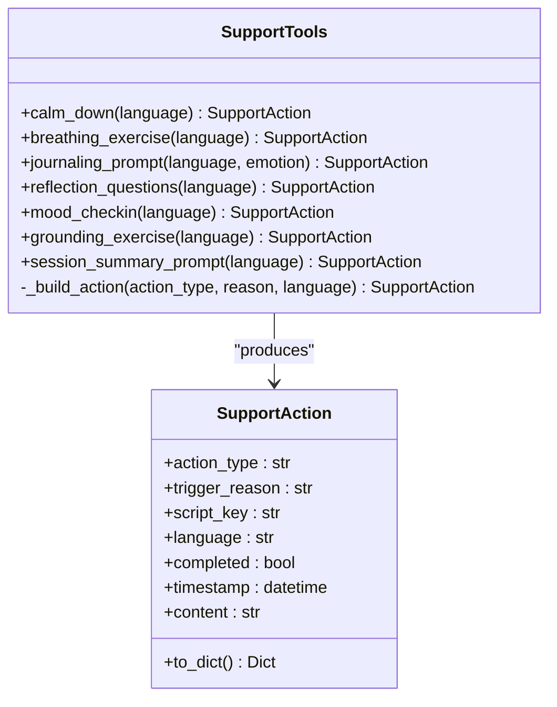

**Diagram sources**
- [support_tools.py:19-179](file://psychologist/emotion_engine/interaction/support_tools.py#L19-L179)
- [interaction_models.py:267-287](file://psychologist/emotion_engine/interaction/interaction_models.py#L267-L287)

**Section sources**
- [support_tools.py:19-179](file://psychologist/emotion_engine/interaction/support_tools.py#L19-L179)
- [interaction_models.py:57-66](file://psychologist/emotion_engine/interaction/interaction_models.py#L57-L66)

### Interaction Pipeline: Text Mode
- Steps:
  - Normalize input text.
  - Assess safety (crisis/moderate/distress).
  - Analyze emotional tone via emotion engine.
  - Build user message with detected emotion and confidence.
  - Generate assistant response (crisis template if escalated, otherwise emotion-derived).
  - Apply safety filter to response.
  - Optionally synthesize speech (TTS).
  - Persist messages and emotion state to session.

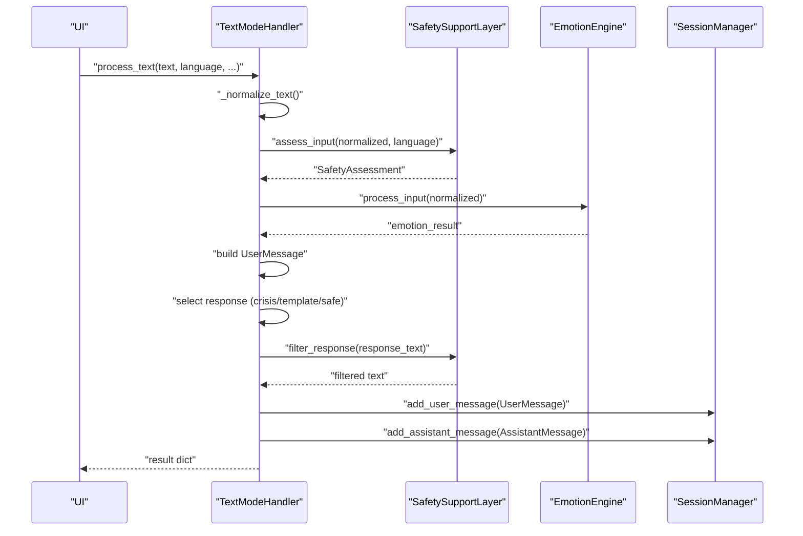

**Diagram sources**
- [text_mode_handler.py:52-158](file://psychologist/emotion_engine/interaction/text_mode_handler.py#L52-L158)
- [safety_support_layer.py:80-135](file://psychologist/emotion_engine/interaction/safety_support_layer.py#L80-L135)
- [session_manager.py:102-132](file://psychologist/emotion_engine/interaction/session_manager.py#L102-L132)

**Section sources**
- [text_mode_handler.py:23-170](file://psychologist/emotion_engine/interaction/text_mode_handler.py#L23-L170)
- [session_manager.py:102-132](file://psychologist/emotion_engine/interaction/session_manager.py#L102-L132)

### Interaction Pipeline: Voice Mode
- Steps:
  - Capture speech and obtain transcript via STT.
  - Assess safety and analyze emotional tone.
  - Optionally fuse voice emotion features with text emotion.
  - Build user message with fused emotion.
  - Generate assistant response and apply safety filter.
  - Synthesize speech (TTS) and persist session.

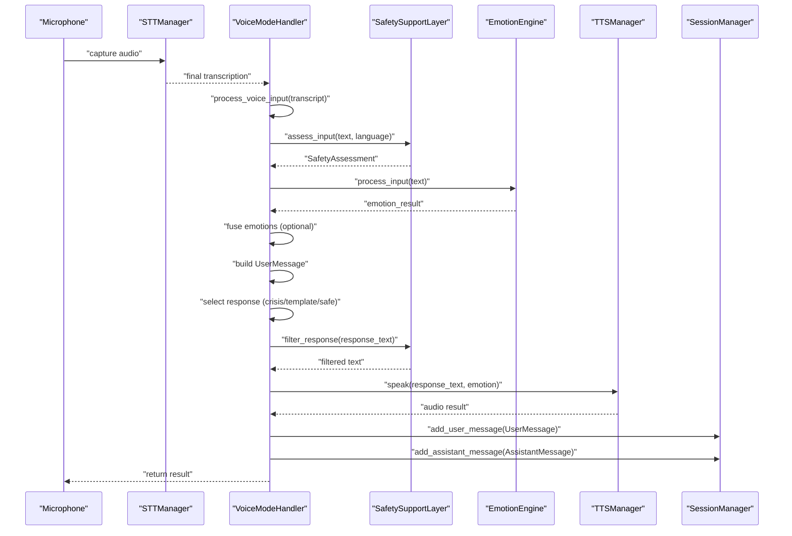

**Diagram sources**
- [voice_mode_handler.py:145-277](file://psychologist/emotion_engine/interaction/voice_mode_handler.py#L145-L277)
- [safety_support_layer.py:80-135](file://psychologist/emotion_engine/interaction/safety_support_layer.py#L80-L135)
- [session_manager.py:102-132](file://psychologist/emotion_engine/interaction/session_manager.py#L102-L132)

**Section sources**
- [voice_mode_handler.py:28-305](file://psychologist/emotion_engine/interaction/voice_mode_handler.py#L28-L305)
- [session_manager.py:102-132](file://psychologist/emotion_engine/interaction/session_manager.py#L102-L132)

### Hybrid Mode Coordination
- Responsibilities:
  - Delegate text or voice processing while maintaining a single session.
  - Preserve context and update mode metadata.
  - Mirror voice handler status for listening/speaking state and audio level.

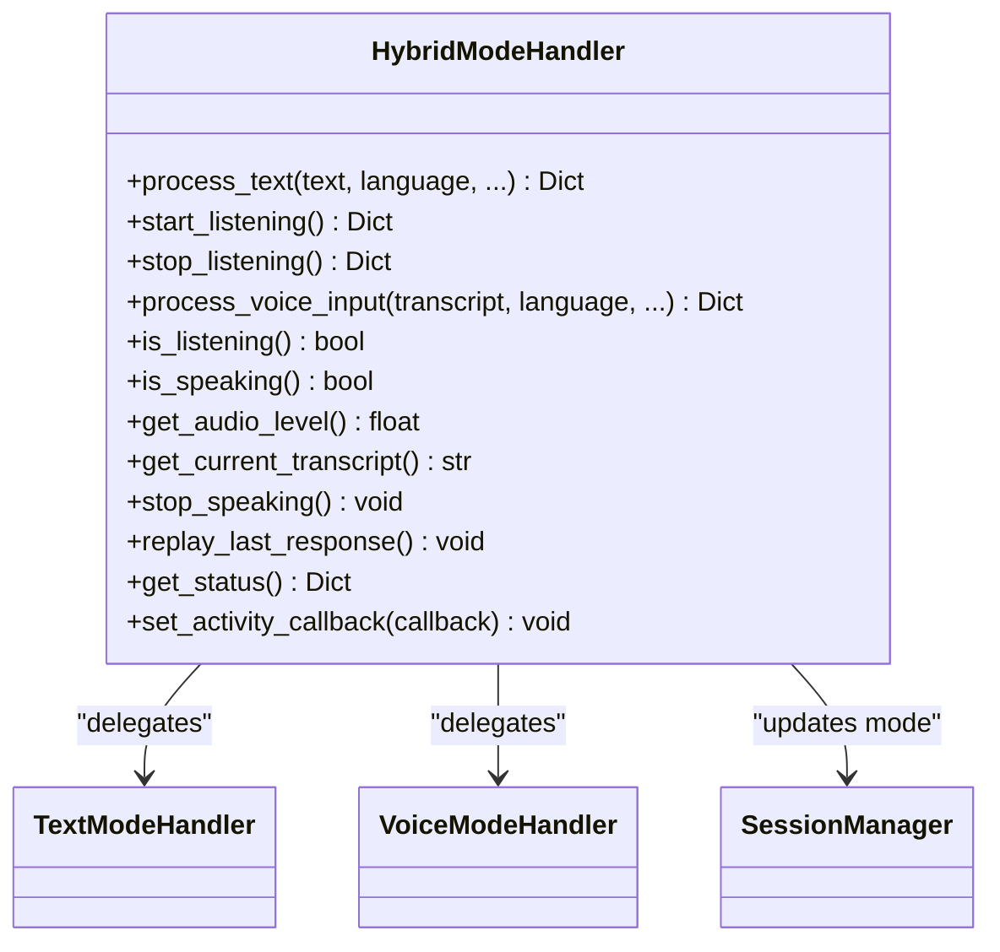

**Diagram sources**
- [hybrid_mode_handler.py:18-120](file://psychologist/emotion_engine/interaction/hybrid_mode_handler.py#L18-L120)
- [text_mode_handler.py:23-170](file://psychologist/emotion_engine/interaction/text_mode_handler.py#L23-L170)
- [voice_mode_handler.py:28-305](file://psychologist/emotion_engine/interaction/voice_mode_handler.py#L28-L305)

**Section sources**
- [hybrid_mode_handler.py:18-120](file://psychologist/emotion_engine/interaction/hybrid_mode_handler.py#L18-L120)

### Emotion Processing and Context
- ContextEngine:
  - Maintains conversation context, sentiment trends, repeated patterns, and topic detection.
- EmotionalMemory:
  - Manages short-term and long-term memories, emotional patterns, and preference snapshots.
- EmotionStateMachine:
  - Tracks and predicts emotion state transitions probabilistically.
- LearningSystem:
  - Learns response effectiveness and emotion transition patterns to adapt behavior.

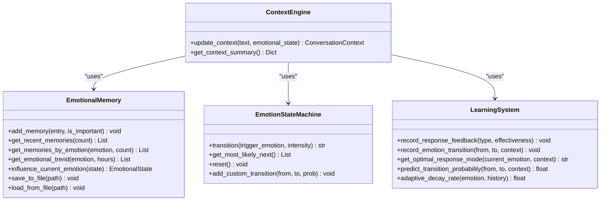

**Diagram sources**
- [context_engine.py:9-117](file://psychologist/emotion_engine/context_engine/context_engine.py#L9-L117)
- [emotional_memory.py:8-103](file://psychologist/emotion_engine/emotional_memory/emotional_memory.py#L8-L103)
- [emotion_state_machine.py:5-90](file://psychologist/emotion_engine/state_machine/emotion_state_machine.py#L5-L90)
- [learning_system.py:5-59](file://psychologist/emotion_engine/learning_system/learning_system.py#L5-L59)

**Section sources**
- [context_engine.py:9-117](file://psychologist/emotion_engine/context_engine/context_engine.py#L9-L117)
- [emotional_memory.py:8-103](file://psychologist/emotion_engine/emotional_memory/emotional_memory.py#L8-L103)
- [emotion_state_machine.py:5-90](file://psychologist/emotion_engine/state_machine/emotion_state_machine.py#L5-L90)
- [learning_system.py:5-59](file://psychologist/emotion_engine/learning_system/learning_system.py#L5-L59)

## Dependency Analysis
- Coupling:
  - Handlers depend on SafetySupportLayer and SessionManager for safety and persistence.
  - Handlers depend on EmotionEngine (via emotion_engine module) for emotion processing.
  - HybridModeHandler composes TextModeHandler and VoiceModeHandler.
- Cohesion:
  - Each handler encapsulates a single interaction modality’s pipeline.
  - SafetySupportLayer centralizes safety logic and templates.
  - SessionManager encapsulates persistence and analytics.
- External dependencies:
  - Configuration loaded from YAML files.
  - Voice subsystem components referenced by handlers (STT/TTS) are integrated externally.

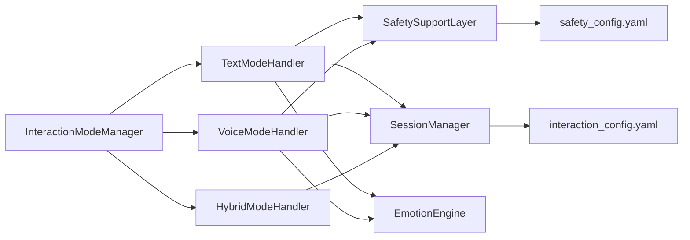

**Diagram sources**
- [interaction_mode_manager.py:17-166](file://psychologist/emotion_engine/interaction/interaction_mode_manager.py#L17-L166)
- [text_mode_handler.py:23-170](file://psychologist/emotion_engine/interaction/text_mode_handler.py#L23-L170)
- [voice_mode_handler.py:28-305](file://psychologist/emotion_engine/interaction/voice_mode_handler.py#L28-L305)
- [hybrid_mode_handler.py:18-120](file://psychologist/emotion_engine/interaction/hybrid_mode_handler.py#L18-L120)
- [session_manager.py:26-303](file://psychologist/emotion_engine/interaction/session_manager.py#L26-L303)
- [safety_support_layer.py:24-286](file://psychologist/emotion_engine/interaction/safety_support_layer.py#L24-L286)
- [interaction_config.yaml:1-60](file://psychologist/config/interaction_config.yaml#L1-L60)
- [safety_config.yaml:1-116](file://psychologist/config/safety_config.yaml#L1-L116)

**Section sources**
- [interaction_mode_manager.py:17-166](file://psychologist/emotion_engine/interaction/interaction_mode_manager.py#L17-L166)
- [text_mode_handler.py:23-170](file://psychologist/emotion_engine/interaction/text_mode_handler.py#L23-L170)
- [voice_mode_handler.py:28-305](file://psychologist/emotion_engine/interaction/voice_mode_handler.py#L28-L305)
- [hybrid_mode_handler.py:18-120](file://psychologist/emotion_engine/interaction/hybrid_mode_handler.py#L18-L120)
- [session_manager.py:26-303](file://psychologist/emotion_engine/interaction/session_manager.py#L26-L303)
- [safety_support_layer.py:24-286](file://psychologist/emotion_engine/interaction/safety_support_layer.py#L24-L286)
- [interaction_config.yaml:1-60](file://psychologist/config/interaction_config.yaml#L1-L60)
- [safety_config.yaml:1-116](file://psychologist/config/safety_config.yaml#L1-L116)

## Performance Considerations
- Response length limits:
  - Text mode responses are truncated to a maximum length; voice mode responses are shorter and truncated at sentence boundaries when needed.
- Auto-save and cleanup:
  - Sessions are auto-saved after message insertion; old sessions are pruned to maintain bounded storage.
- Safety checks:
  - Keyword-based detection avoids expensive model inference; keep keyword lists concise and localized to reduce scanning overhead.
- TTS synthesis:
  - Voice responses are synthesized after safety filtering; consider disabling auto-speaking if latency is a concern.
- Emotion processing:
  - Emotion engine operations are invoked per interaction; caching or batching may improve throughput if extended to future designs.

[No sources needed since this section provides general guidance]

## Troubleshooting Guide
- No speech detected in voice mode:
  - Ensure STT manager is available and listening is started before capturing audio.
  - Verify microphone permissions and device selection.
- Safety escalation unexpectedly triggers:
  - Review safety keyword lists and templates; adjust sensitivity by refining keyword coverage.
- Responses flagged as unsafe:
  - Confirm that diagnosis block patterns are present in generated text; the system replaces unsafe content with safe alternatives.
- Session not saving:
  - Check sessions directory permissions and available disk space; confirm auto-save setting and cleanup thresholds.
- Hybrid mode losing context:
  - Ensure mode updates are recorded via session manager and that both text and voice handlers share the same session instance.

**Section sources**
- [voice_mode_handler.py:76-110](file://psychologist/emotion_engine/interaction/voice_mode_handler.py#L76-L110)
- [safety_support_layer.py:139-163](file://psychologist/emotion_engine/interaction/safety_support_layer.py#L139-L163)
- [session_manager.py:279-303](file://psychologist/emotion_engine/interaction/session_manager.py#L279-L303)
- [hybrid_mode_handler.py:56-94](file://psychologist/emotion_engine/interaction/hybrid_mode_handler.py#L56-L94)

## Conclusion
The Interaction Management System provides a robust, offline-capable framework for text, voice, and hybrid interactions. It enforces safety through explicit keyword rules, preserves user privacy by storing data locally, and offers curated support tools to aid emotional regulation. The modular design enables clear separation of concerns, while configuration files allow flexible tuning of behavior, thresholds, and supported features.

[No sources needed since this section summarizes without analyzing specific files]

## Appendices

### Configuration Options
- Interaction defaults:
  - Default mode, allowed modes, auto-save, max session minutes, sessions directory, and max stored sessions.
- Text mode:
  - Enable/disable, long responses, emotion label visibility, and max response length.
- Voice mode:
  - Push-to-talk, continuous conversation, auto speak response, max voice response seconds, auto-listen after response, max response length, and silence timeout.
- Hybrid mode:
  - Enable/disable and context preservation when switching.
- Support tools:
  - Enable/disable each tool category.
- Safety:
  - Enable/disable crisis detection, diagnosis blocking, medical claim blocking, professional help reminder, and disclaimer banner.
- Privacy:
  - Offline-only operation, audio file storage, transcript storage, and export allowance.
- Activity stream:
  - Enable/disable and max entries.

**Section sources**
- [interaction_config.yaml:5-60](file://psychologist/config/interaction_config.yaml#L5-L60)
- [safety_config.yaml:5-116](file://psychologist/config/safety_config.yaml#L5-L116)