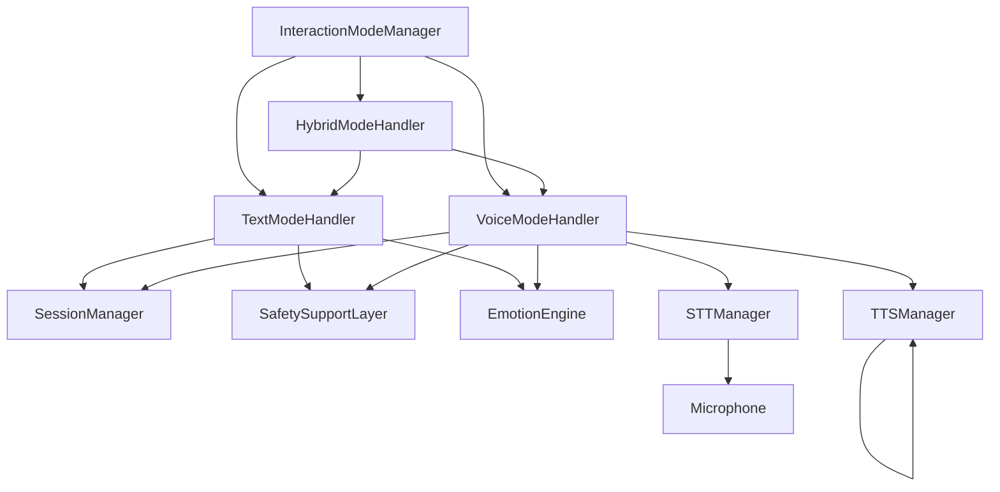
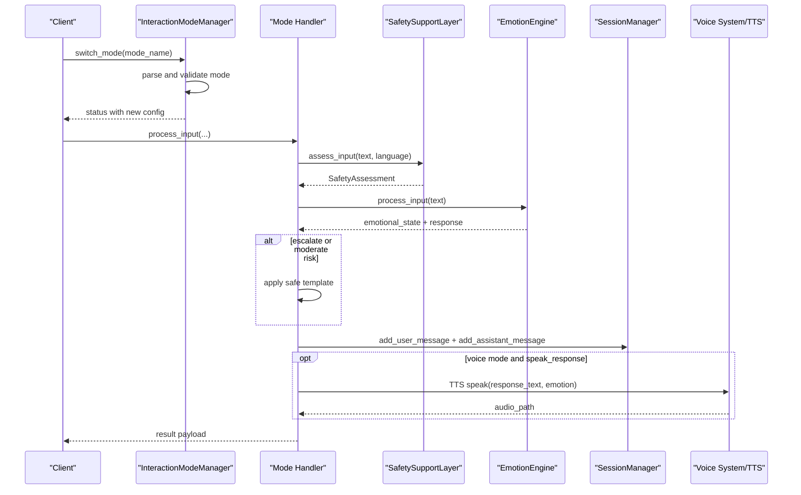
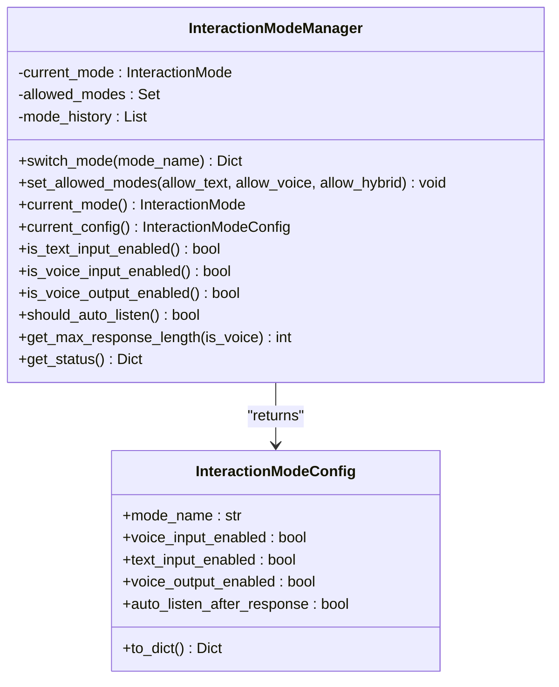
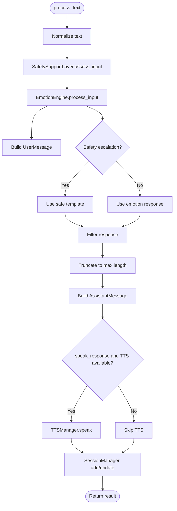
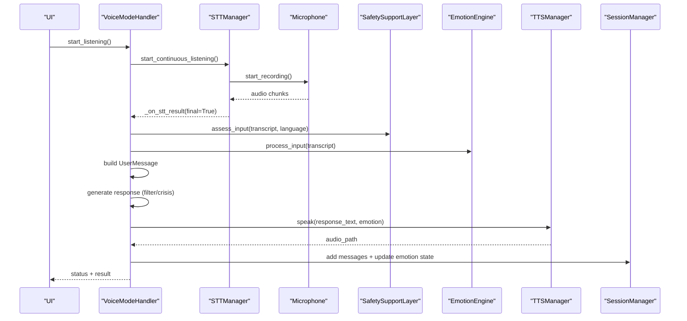
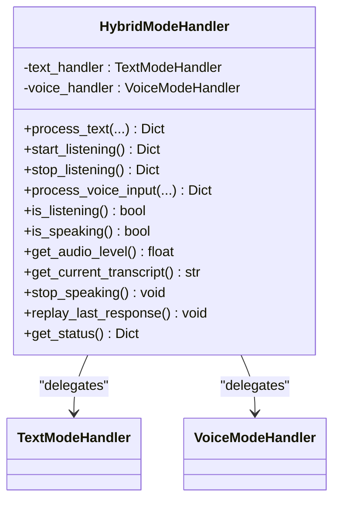
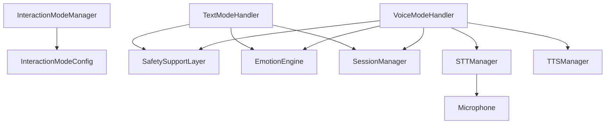

# Interaction Modes

<cite>
**Referenced Files in This Document**
- [interaction_mode_manager.py](file://psychologist/emotion_engine/interaction/interaction_mode_manager.py)
- [interaction_models.py](file://psychologist/emotion_engine/interaction/interaction_models.py)
- [text_mode_handler.py](file://psychologist/emotion_engine/interaction/text_mode_handler.py)
- [voice_mode_handler.py](file://psychologist/emotion_engine/interaction/voice_mode_handler.py)
- [hybrid_mode_handler.py](file://psychologist/emotion_engine/interaction/hybrid_mode_handler.py)
- [safety_support_layer.py](file://psychologist/emotion_engine/interaction/safety_support_layer.py)
- [session_manager.py](file://psychologist/emotion_engine/interaction/session_manager.py)
- [interaction_config.yaml](file://psychologist/config/interaction_config.yaml)
- [system_constants.py](file://psychologist/system_constants.py)
- [emotion_engine.py](file://psychologist/emotion_engine/emotion_engine.py)
- [stt_manager.py](file://psychologist/emotion_engine/voice_system/stt_manager.py)
- [microphone.py](file://psychologist/emotion_engine/voice_system/microphone.py)
- [tts_manager.py](file://psychologist/emotion_engine/voice_output/tts_manager.py)
- [test_interaction_mode_manager.py](file://psychologist/emotion_engine/interaction/tests/test_interaction_mode_manager.py)
- [test_text_mode_handler.py](file://psychologist/emotion_engine/interaction/tests/test_text_mode_handler.py)
</cite>

## Table of Contents
1. [Introduction](#introduction)
2. [Project Structure](#project-structure)
3. [Core Components](#core-components)
4. [Architecture Overview](#architecture-overview)
5. [Detailed Component Analysis](#detailed-component-analysis)
6. [Dependency Analysis](#dependency-analysis)
7. [Performance Considerations](#performance-considerations)
8. [Troubleshooting Guide](#troubleshooting-guide)
9. [Conclusion](#conclusion)

## Introduction
This document describes the interaction modes subsystem that powers the emotional support companion. It covers the three interaction modes (TEXT, VOICE, HYBRID), their configurations, mode switching, validation logic, state management, and handler implementations. It also documents configuration options, response length limits, error handling during transitions, and integration with the broader emotion processing pipeline.

## Project Structure
The interaction modes subsystem is organized around a central manager and mode-specific handlers:
- InteractionModeManager: central state machine for modes and configuration
- TextModeHandler: text-only processing pipeline
- VoiceModeHandler: voice capture, STT, voice emotion fusion, and TTS
- HybridModeHandler: delegates to text/voice handlers while preserving session context
- Supporting components: SafetySupportLayer, SessionManager, EmotionEngine, voice system (STT/Microphone), and TTS manager

**Diagram sources**
- [interaction_mode_manager.py:17-166](file://psychologist/emotion_engine/interaction/interaction_mode_manager.py#L17-L166)
- [text_mode_handler.py:23-170](file://psychologist/emotion_engine/interaction/text_mode_handler.py#L23-L170)
- [voice_mode_handler.py:28-305](file://psychologist/emotion_engine/interaction/voice_mode_handler.py#L28-L305)
- [hybrid_mode_handler.py:18-120](file://psychologist/emotion_engine/interaction/hybrid_mode_handler.py#L18-L120)
- [session_manager.py:26-303](file://psychologist/emotion_engine/interaction/session_manager.py#L26-L303)
- [safety_support_layer.py:24-286](file://psychologist/emotion_engine/interaction/safety_support_layer.py#L24-L286)
- [emotion_engine.py:23-184](file://psychologist/emotion_engine/emotion_engine.py#L23-L184)
- [stt_manager.py:17-104](file://psychologist/emotion_engine/voice_system/stt_manager.py#L17-L104)
- [microphone.py:14-95](file://psychologist/emotion_engine/voice_system/microphone.py#L14-L95)
- [tts_manager.py:31-244](file://psychologist/emotion_engine/voice_output/tts_manager.py#L31-L244)

**Section sources**
- [interaction_mode_manager.py:17-166](file://psychologist/emotion_engine/interaction/interaction_mode_manager.py#L17-L166)
- [interaction_models.py:15-88](file://psychologist/emotion_engine/interaction/interaction_models.py#L15-L88)
- [text_mode_handler.py:23-170](file://psychologist/emotion_engine/interaction/text_mode_handler.py#L23-L170)
- [voice_mode_handler.py:28-305](file://psychologist/emotion_engine/interaction/voice_mode_handler.py#L28-L305)
- [hybrid_mode_handler.py:18-120](file://psychologist/emotion_engine/interaction/hybrid_mode_handler.py#L18-L120)
- [session_manager.py:26-303](file://psychologist/emotion_engine/interaction/session_manager.py#L26-L303)
- [safety_support_layer.py:24-286](file://psychologist/emotion_engine/interaction/safety_support_layer.py#L24-L286)
- [emotion_engine.py:23-184](file://psychologist/emotion_engine/emotion_engine.py#L23-L184)
- [stt_manager.py:17-104](file://psychologist/emotion_engine/voice_system/stt_manager.py#L17-L104)
- [microphone.py:14-95](file://psychologist/emotion_engine/voice_system/microphone.py#L14-L95)
- [tts_manager.py:31-244](file://psychologist/emotion_engine/voice_output/tts_manager.py#L31-L244)

## Core Components
- InteractionModeManager: maintains current mode, allowed modes, and mode-specific configuration; exposes helpers for input/output capability checks and response length limits
- TextModeHandler: orchestrates text input through normalization, safety assessment, emotion engine processing, response filtering, optional TTS, and session persistence
- VoiceModeHandler: manages voice capture, STT callbacks, voice emotion fusion, safety checks, response generation, TTS synthesis, and session updates
- HybridModeHandler: coordinates between text and voice modes within a single session, forwarding calls and preserving context
- SafetySupportLayer: detects crisis/diagnostic language, applies safe templates, and filters responses
- SessionManager: creates, updates, persists, and summarizes sessions
- EmotionEngine: computes emotional state, reasoning, predictions, and generates supportive responses
- Voice system: STTManager and Microphone for capturing and transcribing speech
- TTSManager: synthesizes speech with emotion-aware style adjustments

**Section sources**
- [interaction_mode_manager.py:17-166](file://psychologist/emotion_engine/interaction/interaction_mode_manager.py#L17-L166)
- [text_mode_handler.py:23-170](file://psychologist/emotion_engine/interaction/text_mode_handler.py#L23-L170)
- [voice_mode_handler.py:28-305](file://psychologist/emotion_engine/interaction/voice_mode_handler.py#L28-L305)
- [hybrid_mode_handler.py:18-120](file://psychologist/emotion_engine/interaction/hybrid_mode_handler.py#L18-L120)
- [safety_support_layer.py:24-286](file://psychologist/emotion_engine/interaction/safety_support_layer.py#L24-L286)
- [session_manager.py:26-303](file://psychologist/emotion_engine/interaction/session_manager.py#L26-L303)
- [emotion_engine.py:23-184](file://psychologist/emotion_engine/emotion_engine.py#L23-L184)
- [stt_manager.py:17-104](file://psychologist/emotion_engine/voice_system/stt_manager.py#L17-L104)
- [microphone.py:14-95](file://psychologist/emotion_engine/voice_system/microphone.py#L14-L95)
- [tts_manager.py:31-244](file://psychologist/emotion_engine/voice_output/tts_manager.py#L31-L244)

## Architecture Overview
The subsystem centers on InteractionModeManager, which selects and validates modes and exposes configuration. Handlers implement the processing logic for each mode and integrate with shared services (SafetySupportLayer, EmotionEngine, SessionManager). Voice mode additionally integrates with the voice system (STTManager and Microphone) and TTSManager.

**Diagram sources**
- [interaction_mode_manager.py:70-101](file://psychologist/emotion_engine/interaction/interaction_mode_manager.py#L70-L101)
- [text_mode_handler.py:52-158](file://psychologist/emotion_engine/interaction/text_mode_handler.py#L52-L158)
- [voice_mode_handler.py:145-277](file://psychologist/emotion_engine/interaction/voice_mode_handler.py#L145-L277)
- [safety_support_layer.py:80-135](file://psychologist/emotion_engine/interaction/safety_support_layer.py#L80-L135)
- [session_manager.py:102-146](file://psychologist/emotion_engine/interaction/session_manager.py#L102-L146)
- [tts_manager.py:100-168](file://psychologist/emotion_engine/voice_output/tts_manager.py#L100-L168)

## Detailed Component Analysis

### InteractionModeManager
Responsibilities:
- Maintains current mode and allowed modes
- Provides prebuilt InteractionModeConfig for TEXT, VOICE, HYBRID
- Validates mode switching and falls back to HYBRID for invalid inputs
- Exposes helpers for input/output capability checks and response length limits
- Tracks mode history and supports activity callbacks

Key behaviors:
- Mode parsing and fallback to HYBRID for unknown modes
- Response length policy: shorter for voice mode regardless of current mode
- Allowed modes configurable at runtime

**Diagram sources**
- [interaction_mode_manager.py:17-166](file://psychologist/emotion_engine/interaction/interaction_mode_manager.py#L17-L166)
- [interaction_models.py:71-87](file://psychologist/emotion_engine/interaction/interaction_models.py#L71-L87)

**Section sources**
- [interaction_mode_manager.py:17-166](file://psychologist/emotion_engine/interaction/interaction_mode_manager.py#L17-L166)
- [interaction_models.py:15-87](file://psychologist/emotion_engine/interaction/interaction_models.py#L15-L87)

### TextModeHandler
Processing stages:
- Normalize input text
- Safety assessment (crisis/diagnostic detection)
- Emotion engine processing
- Build UserMessage
- Generate response (with safety filtering and potential crisis template)
- Truncate response according to mode’s max length
- Build AssistantMessage
- Optional TTS synthesis and metadata update
- Persist messages and update emotion state in SessionManager

Response length:
- Uses configured max length from system constants

**Diagram sources**
- [text_mode_handler.py:52-158](file://psychologist/emotion_engine/interaction/text_mode_handler.py#L52-L158)
- [safety_support_layer.py:80-135](file://psychologist/emotion_engine/interaction/safety_support_layer.py#L80-L135)
- [session_manager.py:102-146](file://psychologist/emotion_engine/interaction/session_manager.py#L102-L146)
- [tts_manager.py:100-168](file://psychologist/emotion_engine/voice_output/tts_manager.py#L100-L168)

**Section sources**
- [text_mode_handler.py:23-170](file://psychologist/emotion_engine/interaction/text_mode_handler.py#L23-L170)
- [system_constants.py:65-72](file://psychologist/system_constants.py#L65-L72)

### VoiceModeHandler
Processing stages:
- Start/stop listening via STTManager
- Capture audio chunks and compute audio level
- Receive STT result via callback and update current transcript
- Safety assessment
- Emotion engine processing
- Optional voice emotion fusion (placeholder)
- Build UserMessage
- Generate response (with safety filtering and potential crisis template)
- Truncate response to voice-specific max length
- Build AssistantMessage
- TTS synthesis and playback
- Persist messages and update emotion state

Voice-specific controls:
- Push-to-talk and continuous mode toggles
- Stop speaking and replay last response

**Diagram sources**
- [voice_mode_handler.py:76-277](file://psychologist/emotion_engine/interaction/voice_mode_handler.py#L76-L277)
- [stt_manager.py:44-91](file://psychologist/emotion_engine/voice_system/stt_manager.py#L44-L91)
- [microphone.py:40-86](file://psychologist/emotion_engine/voice_system/microphone.py#L40-L86)
- [safety_support_layer.py:80-135](file://psychologist/emotion_engine/interaction/safety_support_layer.py#L80-L135)
- [tts_manager.py:100-168](file://psychologist/emotion_engine/voice_output/tts_manager.py#L100-L168)
- [session_manager.py:102-146](file://psychologist/emotion_engine/interaction/session_manager.py#L102-L146)

**Section sources**
- [voice_mode_handler.py:28-305](file://psychologist/emotion_engine/interaction/voice_mode_handler.py#L28-L305)
- [stt_manager.py:17-104](file://psychologist/emotion_engine/voice_system/stt_manager.py#L17-L104)
- [microphone.py:14-95](file://psychologist/emotion_engine/voice_system/microphone.py#L14-L95)
- [system_constants.py:68-68](file://psychologist/system_constants.py#L68-L68)

### HybridModeHandler
Purpose:
- Allow seamless switching between text and voice inputs within a session
- Preserve session context and delegate to appropriate handler

Behavior:
- For text input: update session mode to “hybrid” and delegate to TextModeHandler
- For voice input: start/stop listening and delegate to VoiceModeHandler
- Mirror voice status and expose unified status

**Diagram sources**
- [hybrid_mode_handler.py:18-120](file://psychologist/emotion_engine/interaction/hybrid_mode_handler.py#L18-L120)

**Section sources**
- [hybrid_mode_handler.py:18-120](file://psychologist/emotion_engine/interaction/hybrid_mode_handler.py#L18-L120)

### SafetySupportLayer
Responsibilities:
- Assess input for crisis and moderate distress
- Provide safe response templates for escalation
- Filter generated responses to avoid diagnostic/professional advice
- Provide professional help reminders and disclaimers

Integration:
- Used by both TextModeHandler and VoiceModeHandler to guide response selection and filtering

**Section sources**
- [safety_support_layer.py:24-286](file://psychologist/emotion_engine/interaction/safety_support_layer.py#L24-L286)

### SessionManager
Responsibilities:
- Create, update, save, and summarize sessions
- Record user/assistant messages, safety flags, and emotion timelines
- Track active mode and user preference snapshots
- Auto-save on updates and cleanup old sessions

Integration:
- Both text and voice handlers add messages and update emotion state after processing

**Section sources**
- [session_manager.py:26-303](file://psychologist/emotion_engine/interaction/session_manager.py#L26-L303)

### EmotionEngine
Responsibilities:
- Analyze sentiment and emotion keywords
- Update and decay emotional state
- Generate reasoning blends and supportive responses
- Maintain memory entries and context

Integration:
- Consumed by both TextModeHandler and VoiceModeHandler to produce responses

**Section sources**
- [emotion_engine.py:23-184](file://psychologist/emotion_engine/emotion_engine.py#L23-L184)

## Dependency Analysis
- InteractionModeManager depends on InteractionMode and InteractionModeConfig
- Handlers depend on SafetySupportLayer, EmotionEngine, and SessionManager
- VoiceModeHandler additionally depends on STTManager and TTSManager
- STTManager depends on Microphone and audio preprocessing components
- TTSManager depends on voice engines and audio player

**Diagram sources**
- [interaction_mode_manager.py:17-166](file://psychologist/emotion_engine/interaction/interaction_mode_manager.py#L17-L166)
- [text_mode_handler.py:23-170](file://psychologist/emotion_engine/interaction/text_mode_handler.py#L23-L170)
- [voice_mode_handler.py:28-305](file://psychologist/emotion_engine/interaction/voice_mode_handler.py#L28-L305)
- [stt_manager.py:17-104](file://psychologist/emotion_engine/voice_system/stt_manager.py#L17-L104)
- [microphone.py:14-95](file://psychologist/emotion_engine/voice_system/microphone.py#L14-L95)
- [tts_manager.py:31-244](file://psychologist/emotion_engine/voice_output/tts_manager.py#L31-L244)

**Section sources**
- [interaction_mode_manager.py:17-166](file://psychologist/emotion_engine/interaction/interaction_mode_manager.py#L17-L166)
- [text_mode_handler.py:23-170](file://psychologist/emotion_engine/interaction/text_mode_handler.py#L23-L170)
- [voice_mode_handler.py:28-305](file://psychologist/emotion_engine/interaction/voice_mode_handler.py#L28-L305)
- [stt_manager.py:17-104](file://psychologist/emotion_engine/voice_system/stt_manager.py#L17-L104)
- [microphone.py:14-95](file://psychologist/emotion_engine/voice_system/microphone.py#L14-L95)
- [tts_manager.py:31-244](file://psychologist/emotion_engine/voice_output/tts_manager.py#L31-L244)

## Performance Considerations
- Voice responses are intentionally shorter to maintain clarity and reduce synthesis time
- STT and TTS operations are asynchronous and thread-backed; ensure proper lifecycle management to avoid resource leaks
- Session auto-save reduces manual persistence overhead but can increase I/O; tune auto-save and storage limits accordingly
- Emotion engine computations scale with input length; keep inputs within configured limits

[No sources needed since this section provides general guidance]

## Troubleshooting Guide
Common issues and resolutions:
- Mode switching fails silently: verify allowed modes and ensure valid mode names; InteractionModeManager falls back to HYBRID for invalid inputs
- No voice input captured: check STT availability and microphone permissions; ensure start_listening is called and STTManager initialized
- TTS not playing: confirm TTSManager is enabled and at least one engine is available; verify audio output device
- Safety escalation unexpected: review safety configuration and keyword sets; adjust thresholds or templates as needed
- Session not saving: confirm SessionManager initialization parameters and directory permissions

Validation and testing:
- Unit tests validate mode switching, capability queries, and text processing outcomes including crisis escalation

**Section sources**
- [test_interaction_mode_manager.py:1-46](file://psychologist/emotion_engine/interaction/tests/test_interaction_mode_manager.py#L1-L46)
- [test_text_mode_handler.py:1-60](file://psychologist/emotion_engine/interaction/tests/test_text_mode_handler.py#L1-L60)

## Conclusion
The interaction modes subsystem provides a robust, configurable framework for text, voice, and hybrid interactions. InteractionModeManager centralizes mode state and configuration, while specialized handlers implement end-to-end processing pipelines integrated with safety, emotion modeling, and session management. Voice mode leverages a local STT/TTS stack to deliver responsive, private interactions. Configuration files and system constants enable tuning of behavior, response lengths, and safety policies.