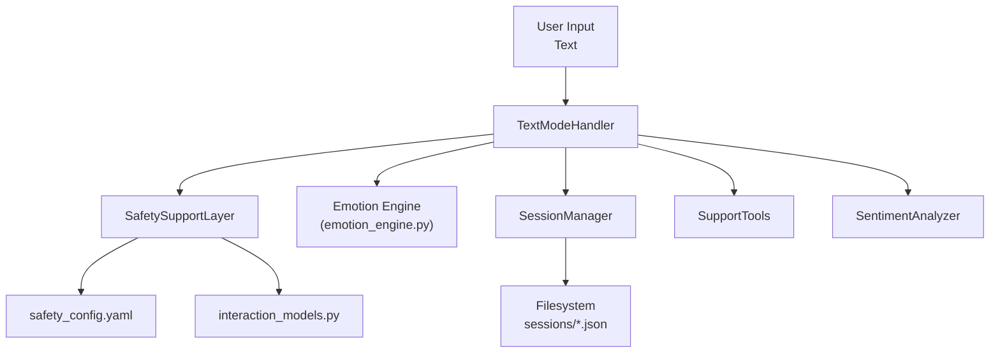
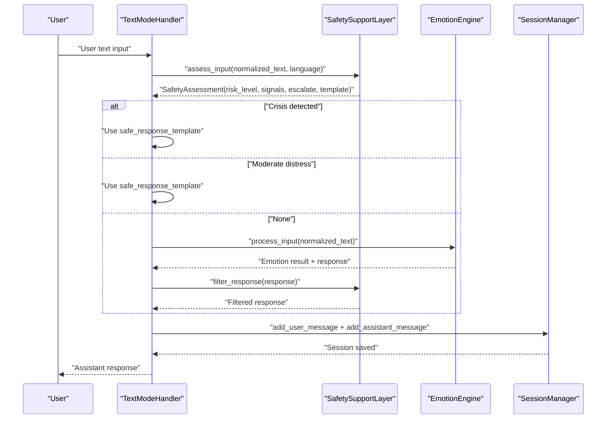
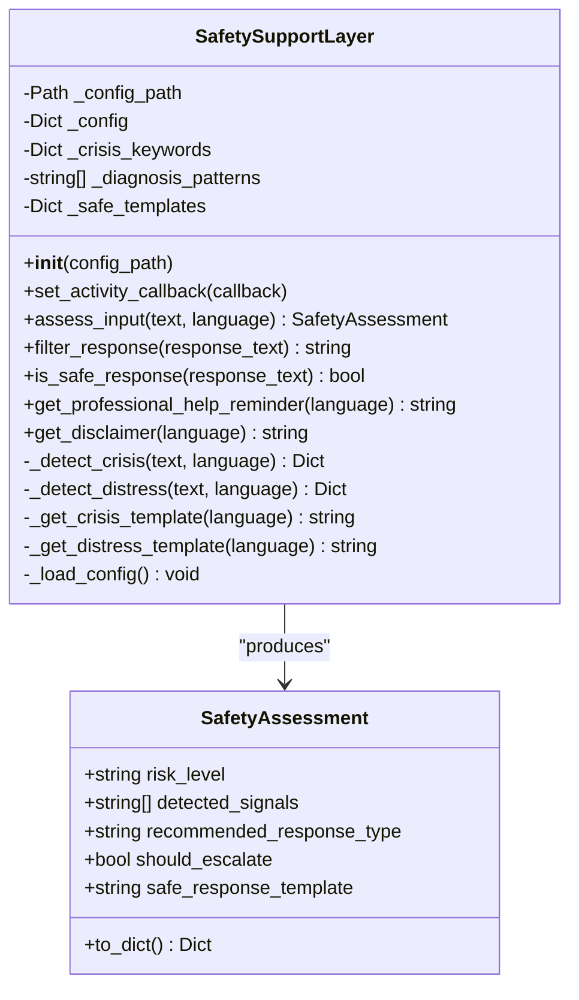
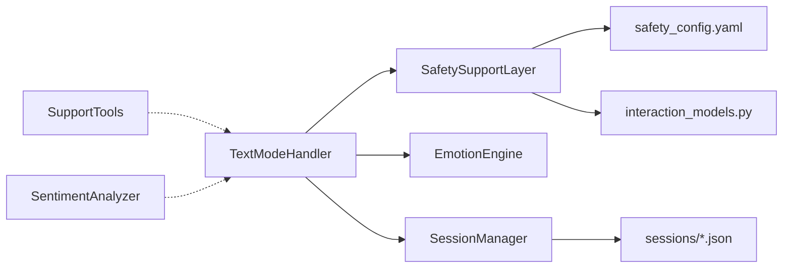

# Safety Monitoring and Crisis Management

<cite>
**Referenced Files in This Document**
- [safety_config.yaml](file://psychologist/config/safety_config.yaml)
- [safety_support_layer.py](file://psychologist/emotion_engine/interaction/safety_support_layer.py)
- [support_tools.py](file://psychologist/emotion_engine/interaction/support_tools.py)
- [sentiment_analyzer.py](file://psychologist/emotion_engine/sentiment_analysis/sentiment_analyzer.py)
- [interaction_models.py](file://psychologist/emotion_engine/interaction/interaction_models.py)
- [text_mode_handler.py](file://psychologist/emotion_engine/interaction/text_mode_handler.py)
- [session_manager.py](file://psychologist/emotion_engine/interaction/session_manager.py)
- [system_constants.py](file://psychologist/system_constants.py)
- [test_safety_edge_cases.py](file://psychologist/tests/test_safety_edge_cases.py)
- [README.md](file://psychologist/README.md)
</cite>

## Table of Contents
1. [Introduction](#introduction)
2. [Project Structure](#project-structure)
3. [Core Components](#core-components)
4. [Architecture Overview](#architecture-overview)
5. [Detailed Component Analysis](#detailed-component-analysis)
6. [Dependency Analysis](#dependency-analysis)
7. [Performance Considerations](#performance-considerations)
8. [Troubleshooting Guide](#troubleshooting-guide)
9. [Conclusion](#conclusion)
10. [Appendices](#appendices)

## Introduction
This document describes the safety monitoring and crisis management system implemented in the project. It focuses on the safety support layer architecture, crisis detection algorithms, and intervention protocols. It also explains the safety keyword matching system, sentiment analysis thresholds, automated intervention triggers, professional guidance integration, emergency contact protocols, safety escalation procedures, configuration options for safety parameters, custom keyword lists, and intervention templates. Examples of safety scenarios, intervention workflows, and crisis response automation are included, alongside legal and ethical considerations, safety monitoring best practices, and integration with external support services.

## Project Structure
The safety system spans configuration, detection, response filtering, and session management components. The following diagram shows how the major modules interact during a text-mode interaction.

**Diagram sources**
- [text_mode_handler.py:52-158](file://psychologist/emotion_engine/interaction/text_mode_handler.py#L52-L158)
- [safety_support_layer.py:80-135](file://psychologist/emotion_engine/interaction/safety_support_layer.py#L80-L135)
- [session_manager.py:102-131](file://psychologist/emotion_engine/interaction/session_manager.py#L102-L131)
- [safety_config.yaml:1-116](file://psychologist/config/safety_config.yaml#L1-L116)
- [interaction_models.py:290-309](file://psychologist/emotion_engine/interaction/interaction_models.py#L290-L309)

**Section sources**
- [README.md:157-167](file://psychologist/README.md#L157-L167)

## Core Components
- SafetySupportLayer: Implements keyword-based crisis detection, moderate distress detection, response filtering, and template retrieval for safe interventions.
- Safety configuration: Defines crisis keywords, diagnosis-blocking patterns, and safe response templates in English and Bangla.
- SupportTools: Provides pre-authored supportive content for calming, breathing exercises, journaling prompts, reflection questions, mood check-ins, grounding exercises, and session summaries.
- SentimentAnalyzer: Performs keyword-based sentiment scoring and emotion keyword detection to complement safety assessments.
- TextModeHandler: Orchestrates the text interaction pipeline, applying safety checks before generating responses and saving session data.
- SessionManager: Records safety flags, maintains session state, and persists sessions to disk with summaries and follow-ups.

**Section sources**
- [safety_support_layer.py:24-135](file://psychologist/emotion_engine/interaction/safety_support_layer.py#L24-L135)
- [safety_config.yaml:5-116](file://psychologist/config/safety_config.yaml#L5-L116)
- [support_tools.py:19-98](file://psychologist/emotion_engine/interaction/support_tools.py#L19-L98)
- [sentiment_analyzer.py:5-103](file://psychologist/emotion_engine/sentiment_analysis/sentiment_analyzer.py#L5-L103)
- [text_mode_handler.py:52-158](file://psychologist/emotion_engine/interaction/text_mode_handler.py#L52-L158)
- [session_manager.py:102-131](file://psychologist/emotion_engine/interaction/session_manager.py#L102-L131)

## Architecture Overview
The safety system operates as a pre-response filter that evaluates user input for crisis indicators and moderate distress, then selects appropriate interventions. Responses are sanitized to prevent diagnostic statements and can be supplemented with grounding or crisis templates. Sessions capture safety events for later review and reporting.

**Diagram sources**
- [text_mode_handler.py:71-125](file://psychologist/emotion_engine/interaction/text_mode_handler.py#L71-L125)
- [safety_support_layer.py:80-135](file://psychologist/emotion_engine/interaction/safety_support_layer.py#L80-L135)
- [session_manager.py:102-131](file://psychologist/emotion_engine/interaction/session_manager.py#L102-L131)

## Detailed Component Analysis

### SafetySupportLayer
Responsibilities:
- Load safety configuration from YAML.
- Assess input for crisis and moderate distress signals.
- Determine risk levels and recommended response types.
- Filter generated responses to block diagnostic language.
- Retrieve safe response templates for crisis and non-crisis distress.
- Provide professional help reminders and disclaimers.

Risk levels:
- NONE: No concern detected.
- LOW: Mild distress language.
- MODERATE: Notable distress; offer support tools.
- HIGH: Crisis signals detected; switch to crisis response.
- CRITICAL: Immediate danger; strong crisis messaging.

Crisis detection logic:
- Uses language-specific keyword categories (self_harm, harm_to_others, abuse, panic, medical_emergency).
- Severity escalation: self_harm and medical_emergency elevate to critical; others remain high.
- Distress detection: English and Bangla keywords for moderate distress.

Response filtering:
- Blocks predefined diagnosis patterns with a safe replacement message.

Template retrieval:
- Selects English or Bangla templates depending on language.
- Falls back to hardcoded defaults if configuration is missing.

**Diagram sources**
- [safety_support_layer.py:24-286](file://psychologist/emotion_engine/interaction/safety_support_layer.py#L24-L286)
- [interaction_models.py:290-309](file://psychologist/emotion_engine/interaction/interaction_models.py#L290-L309)

**Section sources**
- [safety_support_layer.py:24-286](file://psychologist/emotion_engine/interaction/safety_support_layer.py#L24-L286)
- [interaction_models.py:290-309](file://psychologist/emotion_engine/interaction/interaction_models.py#L290-L309)

### Safety Configuration (safety_config.yaml)
Key areas:
- crisis_keywords: Hierarchical categories of keywords per language (english, bangla).
- diagnosis_block_patterns: Phrases that must be blocked from system responses.
- safe_response_templates: Crisis and non-crisis distress templates in English and Bangla, plus professional help reminders and disclaimers.

Configuration usage:
- Loaded by SafetySupportLayer at initialization.
- Used to populate internal structures for detection and templating.

**Section sources**
- [safety_config.yaml:5-116](file://psychologist/config/safety_config.yaml#L5-L116)
- [safety_support_layer.py:61-76](file://psychologist/emotion_engine/interaction/safety_support_layer.py#L61-L76)

### SupportTools
Provides pre-authored supportive content for:
- Calm-down exercises
- Breathing exercises
- Journaling prompts
- Reflection questions
- Mood check-ins
- Grounding exercises
- Session summaries

Each tool is language-aware and randomly selects from curated scripts.

**Section sources**
- [support_tools.py:19-179](file://psychologist/emotion_engine/interaction/support_tools.py#L19-L179)

### SentimentAnalyzer
Performs keyword-based sentiment scoring and emotion keyword detection:
- Positive/negative word sets
- Intensifiers and negators
- Normalized sentiment and intensity scores
- Emotion keyword mapping across happiness, sadness, anger, fear, surprise, disgust, anxiety, frustration

Integration:
- TextModeHandler obtains emotion results from the emotion engine; SentimentAnalyzer complements this with keyword-based metrics.

**Section sources**
- [sentiment_analyzer.py:5-103](file://psychologist/emotion_engine/sentiment_analysis/sentiment_analyzer.py#L5-L103)

### TextModeHandler
End-to-end orchestration:
- Normalizes input text
- Applies safety assessment first
- Processes emotion via emotion engine
- Builds user and assistant messages
- Optionally synthesizes speech
- Saves session state and safety flags

Safety-triggered flows:
- If escalation is required, uses a safe response template.
- If moderate risk, applies a non-crisis distress template.
- Filters generated responses to remove diagnostic language.

**Section sources**
- [text_mode_handler.py:52-158](file://psychologist/emotion_engine/interaction/text_mode_handler.py#L52-L158)

### SessionManager
Records safety events and session metadata:
- Adds user and assistant messages
- Logs safety flags when present
- Generates summaries and follow-up suggestions
- Persists sessions to JSON files

**Section sources**
- [session_manager.py:102-131](file://psychologist/emotion_engine/interaction/session_manager.py#L102-L131)
- [session_manager.py:212-275](file://psychologist/emotion_engine/interaction/session_manager.py#L212-L275)

## Dependency Analysis
The safety system exhibits low coupling and clear separation of concerns:
- SafetySupportLayer depends on configuration and interaction models.
- TextModeHandler depends on SafetySupportLayer, Emotion Engine, and SessionManager.
- SupportTools and SentimentAnalyzer are independent utilities used by higher-level components.
- SessionManager persists safety events for auditability.

**Diagram sources**
- [safety_support_layer.py:36-48](file://psychologist/emotion_engine/interaction/safety_support_layer.py#L36-L48)
- [text_mode_handler.py:26-38](file://psychologist/emotion_engine/interaction/text_mode_handler.py#L26-L38)
- [session_manager.py:29-46](file://psychologist/emotion_engine/interaction/session_manager.py#L29-L46)

**Section sources**
- [safety_support_layer.py:36-48](file://psychologist/emotion_engine/interaction/safety_support_layer.py#L36-L48)
- [text_mode_handler.py:26-38](file://psychologist/emotion_engine/interaction/text_mode_handler.py#L26-L38)
- [session_manager.py:29-46](file://psychologist/emotion_engine/interaction/session_manager.py#L29-L46)

## Performance Considerations
- Keyword matching is O(n) per category; with a small fixed set of keywords, performance remains negligible.
- Response filtering scans generated text for predefined patterns; keep pattern lists concise.
- Random selection from templates is constant-time.
- Session writes occur on message boundaries; consider batching if throughput increases significantly.
- Text truncation ensures adherence to configured limits.

[No sources needed since this section provides general guidance]

## Troubleshooting Guide
Common issues and resolutions:
- Empty or None input: SafetyAssessment returns NONE safely; ensure upstream normalization handles edge cases.
- Misclassified risk level: Verify keyword categories and language selection logic; adjust safety_config.yaml accordingly.
- Blocked legitimate support: Diagnosis patterns are strict; ensure generated responses avoid diagnostic language.
- Missing templates: Fallbacks exist; verify configuration paths and language keys.
- Session not saved: Check filesystem permissions and session directory path.

Validation references:
- Edge-case tests cover crisis detection, diagnosis blocking, and empty input handling.
- Unit tests verify behavior for clean input, crisis detection, and distress detection.

**Section sources**
- [test_safety_edge_cases.py:133-150](file://psychologist/tests/test_safety_edge_cases.py#L133-L150)
- [test_safety_edge_cases.py:110-131](file://psychologist/tests/test_safety_edge_cases.py#L110-L131)
- [safety_support_layer.py:89-96](file://psychologist/emotion_engine/interaction/safety_support_layer.py#L89-L96)

## Conclusion
The safety monitoring and crisis management system is designed for reliability and transparency. It uses keyword-based detection, strict diagnostic language blocking, and pre-authored templates to ensure safe, consistent responses. The system integrates with session management for auditability and supports bilingual deployment. Configuration is centralized for maintainability, and tests validate critical edge cases.

[No sources needed since this section summarizes without analyzing specific files]

## Appendices

### Safety Keyword Matching System
- Categories: self_harm, harm_to_others, abuse, panic, medical_emergency.
- Languages: English and Bangla keyword sets.
- Severity: self_harm and medical_emergency marked critical; others high.
- Detection method: Case-insensitive substring matches within normalized text.

**Section sources**
- [safety_config.yaml:5-47](file://psychologist/config/safety_config.yaml#L5-L47)
- [safety_support_layer.py:167-197](file://psychologist/emotion_engine/interaction/safety_support_layer.py#L167-L197)

### Sentiment Analysis Thresholds
- SentimentAnalyzer computes normalized sentiment and intensity scores.
- Thresholds are implicit via scoring; moderate distress is determined by presence of keywords rather than numeric thresholds.
- Emotion keyword detection supports complementary classification.

**Section sources**
- [sentiment_analyzer.py:31-73](file://psychologist/emotion_engine/sentiment_analysis/sentiment_analyzer.py#L31-L73)
- [safety_support_layer.py:199-227](file://psychologist/emotion_engine/interaction/safety_support_layer.py#L199-L227)

### Automated Intervention Triggers
- Crisis escalation: Presence of critical or high-risk signals.
- Moderate distress: Presence of moderate keywords.
- Response filtering: Any generated response containing diagnosis patterns is sanitized.

**Section sources**
- [safety_support_layer.py:101-135](file://psychologist/emotion_engine/interaction/safety_support_layer.py#L101-L135)
- [safety_support_layer.py:139-163](file://psychologist/emotion_engine/interaction/safety_support_layer.py#L139-L163)

### Professional Guidance Integration
- Professional help reminder and disclaimer templates are provided in English and Bangla.
- Disclaimers emphasize the system is not a substitute for professional care.

**Section sources**
- [safety_config.yaml:107-115](file://psychologist/config/safety_config.yaml#L107-L115)
- [safety_support_layer.py:263-285](file://psychologist/emotion_engine/interaction/safety_support_layer.py#L263-L285)

### Emergency Contact Protocols
- Crisis templates instruct users to reach out to trusted persons or emergency services.
- No automatic external notifications are implemented; templates guide users toward appropriate resources.

**Section sources**
- [safety_config.yaml:88-96](file://psychologist/config/safety_config.yaml#L88-L96)
- [safety_support_layer.py:231-246](file://psychologist/emotion_engine/interaction/safety_support_layer.py#L231-L246)

### Safety Escalation Procedures
- Risk levels: NONE → LOW → MODERATE → HIGH → CRITICAL.
- Escalation occurs when crisis signals are detected; the system switches to crisis-support responses.
- Session safety flags are recorded for auditability.

**Section sources**
- [safety_support_layer.py:28-34](file://psychologist/emotion_engine/interaction/safety_support_layer.py#L28-L34)
- [session_manager.py:127-128](file://psychologist/emotion_engine/interaction/session_manager.py#L127-L128)

### Configuration Options
- safety_config.yaml: Crisis keywords, diagnosis patterns, and response templates.
- system_constants.py: Response length limits and session limits.

**Section sources**
- [safety_config.yaml:1-116](file://psychologist/config/safety_config.yaml#L1-L116)
- [system_constants.py:65-81](file://psychologist/system_constants.py#L65-L81)

### Examples of Safety Scenarios and Workflows
- Scenario A: User expresses intent to harm self.
  - Detection: self_harm category matched.
  - Severity: Critical.
  - Response: Safe crisis template applied.
  - Session: Safety flag recorded.

- Scenario B: User reports feeling overwhelmed and anxious.
  - Detection: Moderate distress keywords matched.
  - Response: Non-crisis distress template applied.
  - Session: Safety flag recorded.

- Scenario C: Generated response contains diagnostic language.
  - Filtering: Response replaced with safe alternative.

**Section sources**
- [test_safety_edge_cases.py:20-80](file://psychologist/tests/test_safety_edge_cases.py#L20-L80)
- [test_safety_edge_cases.py:110-131](file://psychologist/tests/test_safety_edge_cases.py#L110-L131)
- [text_mode_handler.py:97-112](file://psychologist/emotion_engine/interaction/text_mode_handler.py#L97-L112)

### Legal and Ethical Considerations
- The system explicitly disclaims professional mental health care and directs users to seek help from qualified professionals.
- Diagnostic language is strictly blocked to avoid misrepresentation.
- Data privacy: All processing is local; sessions are stored as JSON files.

**Section sources**
- [safety_config.yaml:113-115](file://psychologist/config/safety_config.yaml#L113-L115)
- [safety_support_layer.py:146-153](file://psychologist/emotion_engine/interaction/safety_support_layer.py#L146-L153)
- [README.md:157-167](file://psychologist/README.md#L157-L167)

### Safety Monitoring Best Practices
- Keep keyword lists localized and culturally sensitive.
- Regularly review and update templates to reflect best practices.
- Monitor session summaries for recurring distress themes.
- Train operators to recognize when external intervention is required despite system safeguards.

[No sources needed since this section provides general guidance]

### Integration with External Support Services
- The system does not automatically contact emergency services.
- Users are guided to trusted contacts and emergency numbers via templates.
- Administrators can review session safety flags and follow-up suggestions for manual intervention.

**Section sources**
- [safety_config.yaml:88-115](file://psychologist/config/safety_config.yaml#L88-L115)
- [session_manager.py:246-275](file://psychologist/emotion_engine/interaction/session_manager.py#L246-L275)