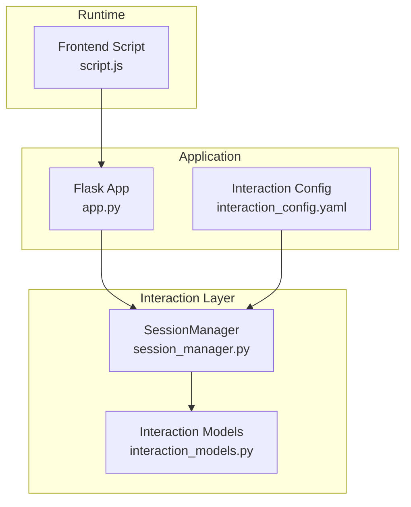
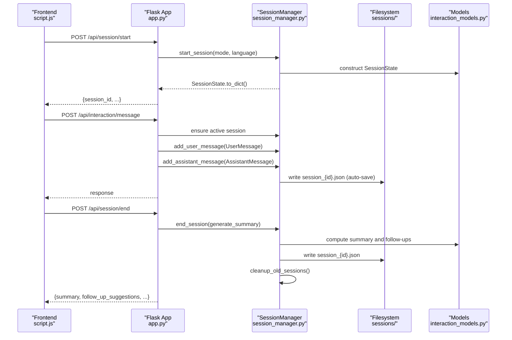
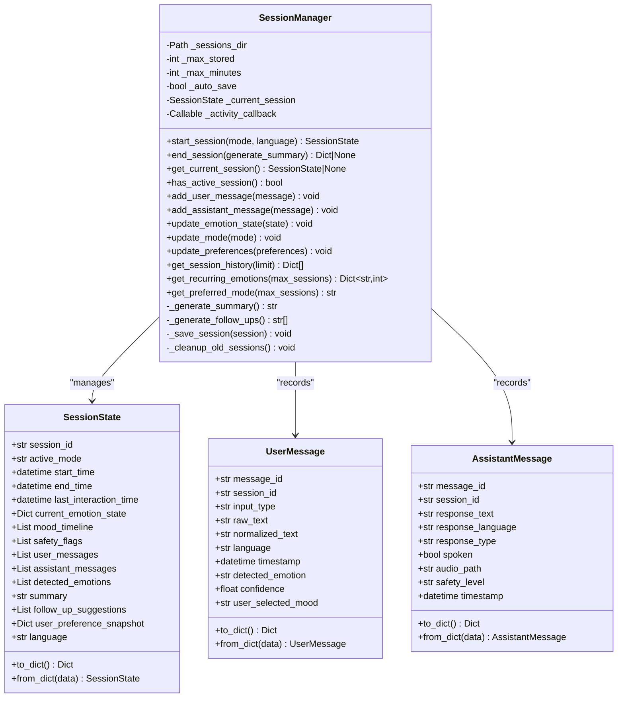
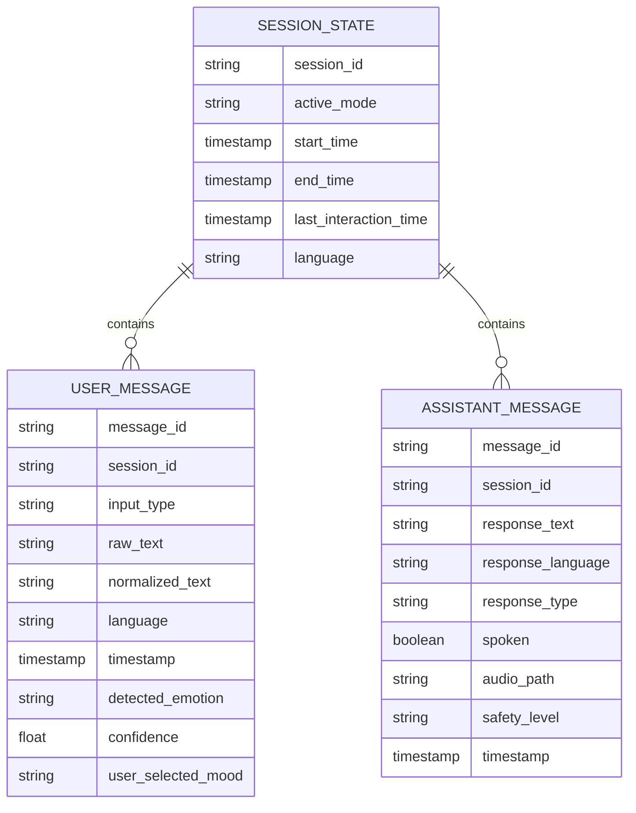
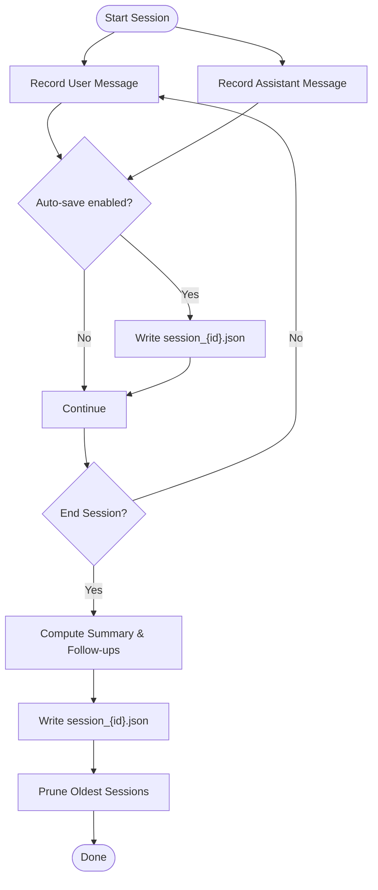
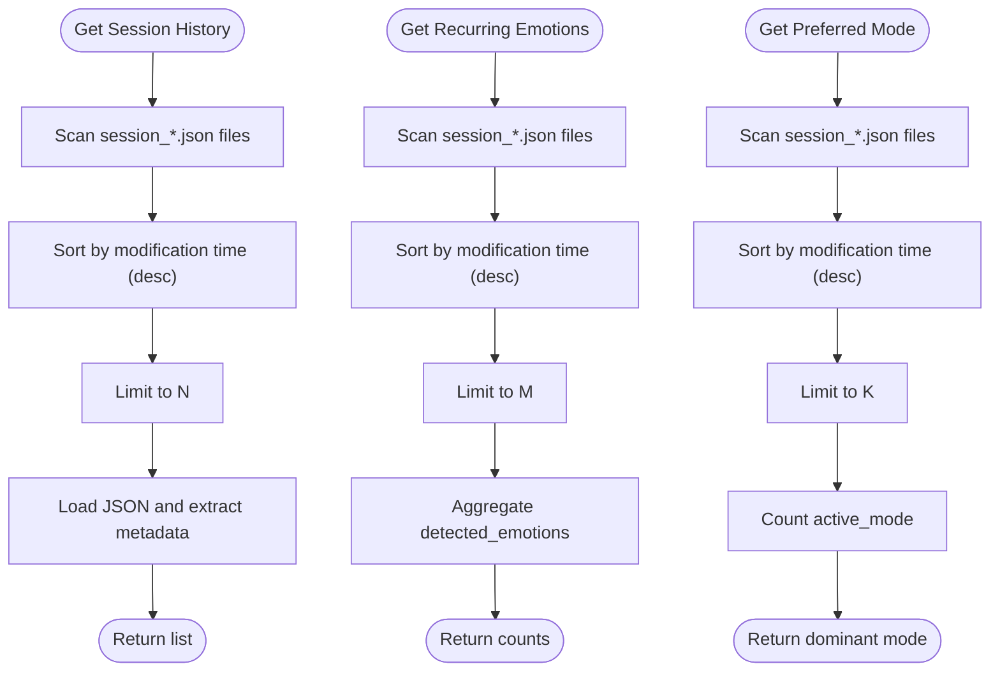
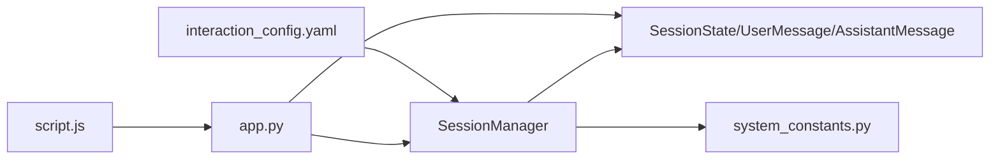

# Session Management

<cite>
**Referenced Files in This Document**
- [session_manager.py](file://psychologist/emotion_engine/interaction/session_manager.py)
- [interaction_models.py](file://psychologist/emotion_engine/interaction/interaction_models.py)
- [system_constants.py](file://psychologist/system_constants.py)
- [app.py](file://psychologist/app.py)
- [test_session_persistence.py](file://psychologist/tests/test_session_persistence.py)
- [interaction_config.yaml](file://psychologist/config/interaction_config.yaml)
- [script.js](file://psychologist/frontend/script.js)
</cite>

## Table of Contents
1. [Introduction](#introduction)
2. [Project Structure](#project-structure)
3. [Core Components](#core-components)
4. [Architecture Overview](#architecture-overview)
5. [Detailed Component Analysis](#detailed-component-analysis)
6. [Dependency Analysis](#dependency-analysis)
7. [Performance Considerations](#performance-considerations)
8. [Troubleshooting Guide](#troubleshooting-guide)
9. [Conclusion](#conclusion)
10. [Appendices](#appendices)

## Introduction
This document describes the session management system that powers the emotional support companion. It covers the session lifecycle from creation to persistence, including state tracking, conversation history storage, and recovery mechanisms. It also documents the session data model, metadata management, privacy-preserving storage, recovery procedures, automatic saving behavior, and configuration options for retention and storage location. Practical examples, troubleshooting guidance, and best practices are included to help developers and operators deploy and maintain the system reliably.

## Project Structure
The session management system spans several modules:
- Session lifecycle and persistence are implemented in the session manager.
- Data models define the session state, user messages, and assistant messages.
- Application endpoints integrate the session manager into the runtime.
- Tests validate lifecycle, persistence, and analytics.
- Configuration files define defaults for session retention and storage location.
- Frontend integration demonstrates session controls and safety indicators.

**Diagram sources**
- [session_manager.py:26-302](file://psychologist/emotion_engine/interaction/session_manager.py#L26-L302)
- [interaction_models.py:191-262](file://psychologist/emotion_engine/interaction/interaction_models.py#L191-L262)
- [app.py:87-149](file://psychologist/app.py#L87-L149)
- [interaction_config.yaml:1-60](file://psychologist/config/interaction_config.yaml#L1-L60)
- [script.js:1312-1343](file://psychologist/frontend/script.js#L1312-L1343)

**Section sources**
- [session_manager.py:26-302](file://psychologist/emotion_engine/interaction/session_manager.py#L26-L302)
- [interaction_models.py:191-262](file://psychologist/emotion_engine/interaction/interaction_models.py#L191-L262)
- [app.py:87-149](file://psychologist/app.py#L87-L149)
- [interaction_config.yaml:1-60](file://psychologist/config/interaction_config.yaml#L1-L60)
- [script.js:1312-1343](file://psychologist/frontend/script.js#L1312-L1343)

## Core Components
- SessionManager: orchestrates session lifecycle, message recording, persistence, and analytics.
- SessionState: the canonical data model for a session’s state and metadata.
- UserMessage and AssistantMessage: typed message containers persisted into sessions.
- Application integration: Flask endpoints expose session operations and safety status.
- Configuration: YAML and system constants define retention limits and storage location.

Key responsibilities:
- Lifecycle: start, record messages, update state, end, and persist.
- Analytics: generate summary, follow-up suggestions, recurring emotion counts, preferred mode.
- Persistence: write JSON files under a configurable directory, with cleanup policy.
- Integration: expose endpoints for frontend and runtime orchestration.

**Section sources**
- [session_manager.py:26-302](file://psychologist/emotion_engine/interaction/session_manager.py#L26-L302)
- [interaction_models.py:92-186](file://psychologist/emotion_engine/interaction/interaction_models.py#L92-L186)
- [interaction_models.py:191-262](file://psychologist/emotion_engine/interaction/interaction_models.py#L191-L262)
- [app.py:449-476](file://psychologist/app.py#L449-L476)
- [system_constants.py:74-78](file://psychologist/system_constants.py#L74-L78)
- [interaction_config.yaml:10-13](file://psychologist/config/interaction_config.yaml#L10-L13)

## Architecture Overview
The session management architecture integrates tightly with the interaction pipeline and the web application.

**Diagram sources**
- [session_manager.py:59-92](file://psychologist/emotion_engine/interaction/session_manager.py#L59-L92)
- [session_manager.py:102-131](file://psychologist/emotion_engine/interaction/session_manager.py#L102-L131)
- [session_manager.py:279-290](file://psychologist/emotion_engine/interaction/session_manager.py#L279-L290)
- [session_manager.py:291-302](file://psychologist/emotion_engine/interaction/session_manager.py#L291-L302)
- [interaction_models.py:92-186](file://psychologist/emotion_engine/interaction/interaction_models.py#L92-L186)
- [app.py:449-476](file://psychologist/app.py#L449-L476)
- [script.js:1312-1343](file://psychologist/frontend/script.js#L1312-L1343)

## Detailed Component Analysis

### SessionManager
Responsibilities:
- Session lifecycle: start, end, current session access, active session check.
- Message recording: user and assistant messages, emotion timeline, safety flags.
- State updates: emotion state, active mode, user preferences.
- Analytics: summary generation, follow-up suggestions, recurring emotion analysis, preferred mode.
- Persistence: save to JSON, cleanup old sessions, configurable retention.

**Diagram sources**
- [session_manager.py:26-302](file://psychologist/emotion_engine/interaction/session_manager.py#L26-L302)
- [interaction_models.py:92-186](file://psychologist/emotion_engine/interaction/interaction_models.py#L92-L186)
- [interaction_models.py:191-262](file://psychologist/emotion_engine/interaction/interaction_models.py#L191-L262)

**Section sources**
- [session_manager.py:26-302](file://psychologist/emotion_engine/interaction/session_manager.py#L26-L302)
- [interaction_models.py:92-186](file://psychologist/emotion_engine/interaction/interaction_models.py#L92-L186)
- [interaction_models.py:191-262](file://psychologist/emotion_engine/interaction/interaction_models.py#L191-L262)

### Session Data Model
SessionState captures the complete session state, including timestamps, conversation history, emotion metrics, safety flags, and user preferences. It supports serialization to/from dictionary for persistence and transport.

Key fields:
- Identity: session_id, language
- Timing: start_time, end_time, last_interaction_time
- Emotion: current_emotion_state, mood_timeline, detected_emotions
- Safety: safety_flags
- Conversation: user_messages, assistant_messages
- Metadata: active_mode, summary, follow_up_suggestions, user_preference_snapshot

**Diagram sources**
- [interaction_models.py:92-186](file://psychologist/emotion_engine/interaction/interaction_models.py#L92-L186)
- [interaction_models.py:191-262](file://psychologist/emotion_engine/interaction/interaction_models.py#L191-L262)

**Section sources**
- [interaction_models.py:92-186](file://psychologist/emotion_engine/interaction/interaction_models.py#L92-L186)
- [interaction_models.py:191-262](file://psychologist/emotion_engine/interaction/interaction_models.py#L191-L262)

### Session Lifecycle and Persistence
- Creation: start_session initializes SessionState and sets active mode/language.
- Recording: add_user_message and add_assistant_message append to conversation lists and update emotion and safety metadata.
- Auto-save: when enabled, writes JSON immediately after message recording.
- Ending: end_session computes summary and follow-ups, persists, clears current session, and prunes old sessions.
- Cleanup: removes oldest sessions beyond configured retention limit.

**Diagram sources**
- [session_manager.py:59-92](file://psychologist/emotion_engine/interaction/session_manager.py#L59-L92)
- [session_manager.py:102-131](file://psychologist/emotion_engine/interaction/session_manager.py#L102-L131)
- [session_manager.py:279-290](file://psychologist/emotion_engine/interaction/session_manager.py#L279-L290)
- [session_manager.py:291-302](file://psychologist/emotion_engine/interaction/session_manager.py#L291-L302)

**Section sources**
- [session_manager.py:59-92](file://psychologist/emotion_engine/interaction/session_manager.py#L59-L92)
- [session_manager.py:102-131](file://psychologist/emotion_engine/interaction/session_manager.py#L102-L131)
- [session_manager.py:279-290](file://psychologist/emotion_engine/interaction/session_manager.py#L279-L290)
- [session_manager.py:291-302](file://psychologist/emotion_engine/interaction/session_manager.py#L291-L302)

### Analytics and Queries
- Session history: retrieves recent sessions with summary metadata.
- Recurring emotions: aggregates detected emotions across recent sessions.
- Preferred mode: determines user’s most-used interaction mode.

**Diagram sources**
- [session_manager.py:150-208](file://psychologist/emotion_engine/interaction/session_manager.py#L150-L208)

**Section sources**
- [session_manager.py:150-208](file://psychologist/emotion_engine/interaction/session_manager.py#L150-L208)

### Privacy-Preserving Storage Implementation
- Local-only storage: sessions are written as JSON files in a local directory.
- Privacy configuration: YAML allows disabling audio file storage and controlling transcript storage and export capability.
- No encryption: session files are stored as plaintext JSON.

**Section sources**
- [session_manager.py:279-290](file://psychologist/emotion_engine/interaction/session_manager.py#L279-L290)
- [interaction_config.yaml:51-55](file://psychologist/config/interaction_config.yaml#L51-L55)

### Configuration Options
- Retention policy:
  - Maximum stored sessions: controlled by SESSION_HISTORY_LIMIT or YAML max_stored_sessions.
  - Maximum session duration: SESSION_MAX_MINUTES constant.
- Storage location:
  - sessions directory: default under project root or override via sessions_directory.
- Behavior:
  - Auto-save: enabled by default; can be disabled.
  - Default mode and privacy/export flags: defined in YAML.

**Section sources**
- [system_constants.py:74-78](file://psychologist/system_constants.py#L74-L78)
- [interaction_config.yaml:10-13](file://psychologist/config/interaction_config.yaml#L10-L13)
- [session_manager.py:29-46](file://psychologist/emotion_engine/interaction/session_manager.py#L29-L46)

### Manual Export Capabilities
- The configuration enables exporting sessions; however, the provided code does not include explicit export endpoints or functions. Operators can retrieve session history via the history endpoint and manually copy session files from the sessions directory.

**Section sources**
- [app.py:473-476](file://psychologist/app.py#L473-L476)
- [interaction_config.yaml:55](file://psychologist/config/interaction_config.yaml#L55)

### Session Recovery Procedures
- Current session recovery: if the application restarts, the active session is lost; sessions are persisted to disk upon end or auto-save. To recover, end the current session and rely on the persisted file.
- Historical recovery: use get_session_history to list recent sessions and inspect their metadata. Persistence is handled automatically by the manager.

**Section sources**
- [session_manager.py:76-92](file://psychologist/emotion_engine/interaction/session_manager.py#L76-L92)
- [session_manager.py:150-172](file://psychologist/emotion_engine/interaction/session_manager.py#L150-L172)

### Automatic Saving Intervals
- Auto-save occurs after each user or assistant message when enabled. There is no periodic timer; saving is event-driven.

**Section sources**
- [session_manager.py:118-131](file://psychologist/emotion_engine/interaction/session_manager.py#L118-L131)

### Session Synchronization Across Interaction Modes
- Mode switching updates the active_mode in the current session.
- Frontend reflects safety status and emotion state, which are part of the session state.

**Section sources**
- [session_manager.py:138-146](file://psychologist/emotion_engine/interaction/session_manager.py#L138-L146)
- [script.js:1262-1291](file://psychologist/frontend/script.js#L1262-L1291)

### Data Integrity Verification
- JSON decode errors and OS errors are caught during persistence and history loading; failures are logged and skipped to avoid crashing the system.
- Timestamp parsing is resilient in deserialization.

**Section sources**
- [session_manager.py:170-171](file://psychologist/emotion_engine/interaction/session_manager.py#L170-L171)
- [session_manager.py:288-289](file://psychologist/emotion_engine/interaction/session_manager.py#L288-L289)
- [interaction_models.py:234-251](file://psychologist/emotion_engine/interaction/interaction_models.py#L234-L251)

## Dependency Analysis

**Diagram sources**
- [session_manager.py:23-46](file://psychologist/emotion_engine/interaction/session_manager.py#L23-L46)
- [app.py:87-149](file://psychologist/app.py#L87-L149)
- [interaction_config.yaml:10-13](file://psychologist/config/interaction_config.yaml#L10-L13)
- [script.js:1312-1343](file://psychologist/frontend/script.js#L1312-L1343)

**Section sources**
- [session_manager.py:23-46](file://psychologist/emotion_engine/interaction/session_manager.py#L23-L46)
- [app.py:87-149](file://psychologist/app.py#L87-L149)
- [interaction_config.yaml:10-13](file://psychologist/config/interaction_config.yaml#L10-L13)
- [script.js:1312-1343](file://psychologist/frontend/script.js#L1312-L1343)

## Performance Considerations
- Event-driven persistence minimizes I/O overhead but still performs frequent writes when auto-save is enabled.
- Cleanup runs after end_session; with many sessions, sorting and deletion may take time proportional to session count.
- History queries scan and parse JSON files; limit the number of returned items to reduce latency.

[No sources needed since this section provides general guidance]

## Troubleshooting Guide
Common issues and resolutions:
- No active session when ending: ensure a session is started before calling end. The endpoint returns an error if none exists.
- Missing session files: verify the sessions directory exists and is writable; auto-save writes only when enabled.
- History empty: confirm session files exist and are valid JSON; invalid files are skipped.
- Safety status mismatch: safety_flags may be a list or dict depending on runtime state; the frontend normalizes both forms.

**Section sources**
- [app.py:460-465](file://psychologist/app.py#L460-L465)
- [session_manager.py:288-289](file://psychologist/emotion_engine/interaction/session_manager.py#L288-L289)
- [session_manager.py:170-171](file://psychologist/emotion_engine/interaction/session_manager.py#L170-L171)
- [script.js:1272-1291](file://psychologist/frontend/script.js#L1272-L1291)

## Conclusion
The session management system provides a robust, local-first solution for capturing, persisting, and analyzing user interactions. Its event-driven persistence, built-in analytics, and flexible configuration enable reliable operation across text, voice, and hybrid modes. While encryption is not implemented, the system’s privacy controls and local-only design align with sensitive use cases. Operators should monitor session directories, tune retention settings, and leverage the provided endpoints and tests to maintain data integrity and availability.

[No sources needed since this section summarizes without analyzing specific files]

## Appendices

### Examples of Session Operations
- Start a session: POST /api/session/start with optional mode and language.
- Send a message: POST /api/interaction/message; the system ensures an active session and records user and assistant messages.
- End a session: POST /api/session/end to persist and compute summary and follow-ups.
- View history: GET /api/session/history to list recent sessions.

**Section sources**
- [app.py:449-476](file://psychologist/app.py#L449-L476)
- [app.py:290-335](file://psychologist/app.py#L290-L335)
- [script.js:1312-1343](file://psychologist/frontend/script.js#L1312-L1343)

### Best Practices for Session Data Management
- Keep auto-save enabled for critical sessions to minimize data loss.
- Configure appropriate retention limits to balance historical insights with storage costs.
- Monitor the sessions directory for disk usage and permissions.
- Use the history and analytics endpoints to validate data quality periodically.

[No sources needed since this section provides general guidance]