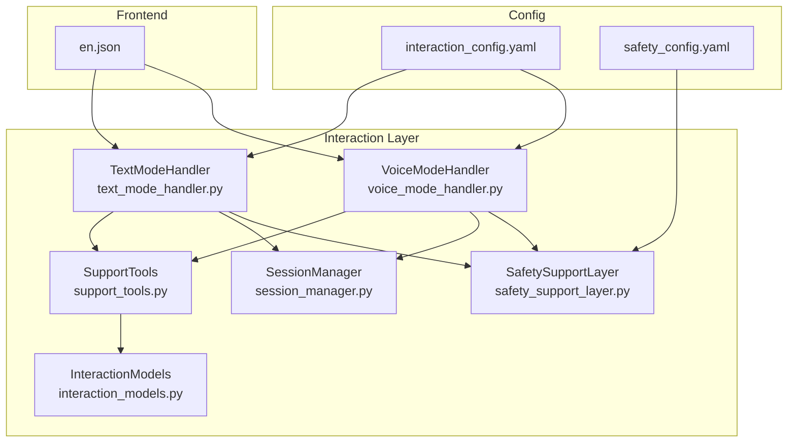
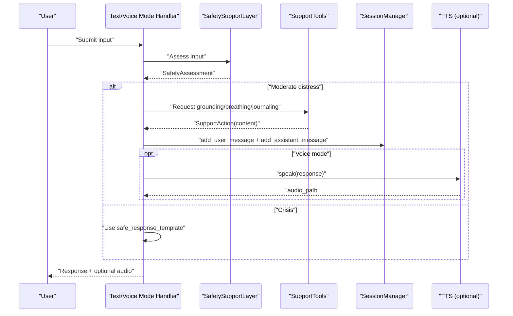
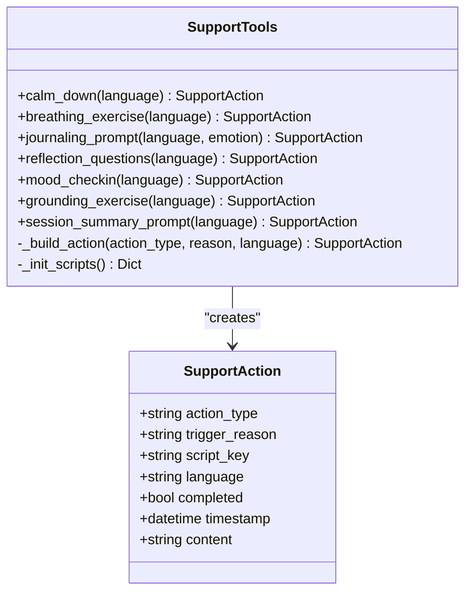
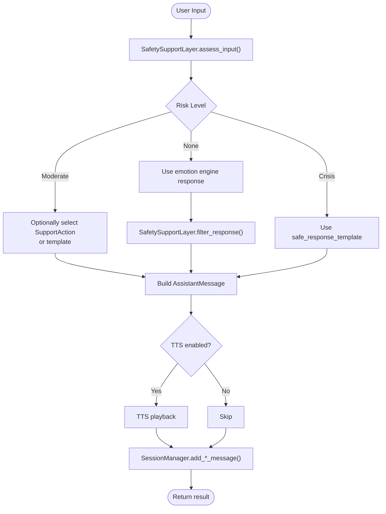
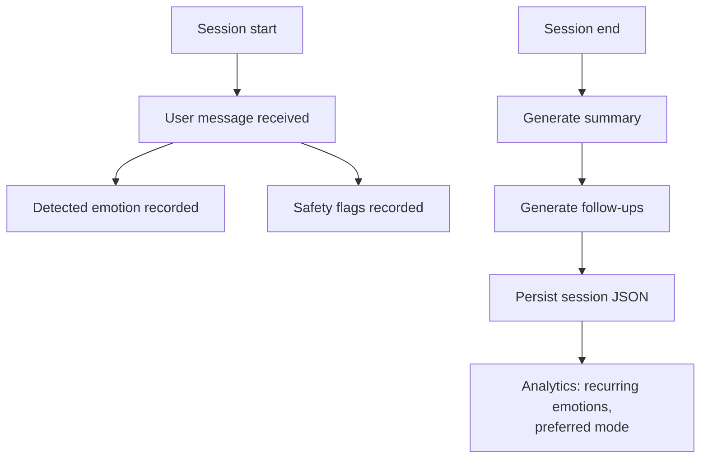
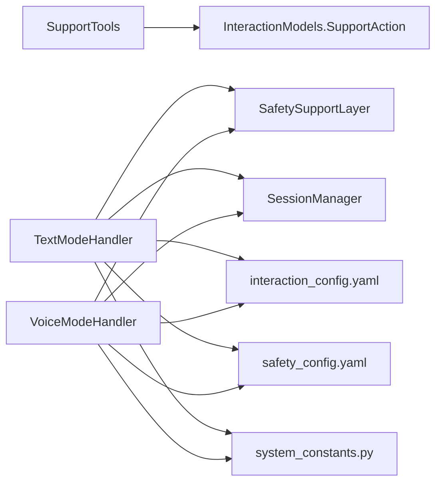

# Support Tools Library

<cite>
**Referenced Files in This Document**
- [support_tools.py](file://psychologist/emotion_engine/interaction/support_tools.py)
- [interaction_models.py](file://psychologist/emotion_engine/interaction/interaction_models.py)
- [session_manager.py](file://psychologist/emotion_engine/interaction/session_manager.py)
- [text_mode_handler.py](file://psychologist/emotion_engine/interaction/text_mode_handler.py)
- [voice_mode_handler.py](file://psychologist/emotion_engine/interaction/voice_mode_handler.py)
- [safety_support_layer.py](file://psychologist/emotion_engine/interaction/safety_support_layer.py)
- [interaction_config.yaml](file://psychologist/config/interaction_config.yaml)
- [safety_config.yaml](file://psychologist/config/safety_config.yaml)
- [system_constants.py](file://psychologist/system_constants.py)
- [test_support_tools.py](file://psychologist/emotion_engine/interaction/tests/test_support_tools.py)
- [en.json](file://psychologist/frontend/languages/en.json)
</cite>

## Table of Contents
1. [Introduction](#introduction)
2. [Project Structure](#project-structure)
3. [Core Components](#core-components)
4. [Architecture Overview](#architecture-overview)
5. [Detailed Component Analysis](#detailed-component-analysis)
6. [Dependency Analysis](#dependency-analysis)
7. [Performance Considerations](#performance-considerations)
8. [Troubleshooting Guide](#troubleshooting-guide)
9. [Conclusion](#conclusion)
10. [Appendices](#appendices)

## Introduction
This document describes the Support Tools Library, which provides offline, pre-authored supportive content for calming, breathing, journaling, reflection, mood check-ins, grounding, and session summaries. It explains how tools are configured, delivered, and integrated into the interaction pipeline, along with customization, accessibility, cultural adaptations, and effectiveness tracking. It also provides guidelines for extending the library and monitoring user engagement.

## Project Structure
The Support Tools Library lives in the interaction layer alongside the session manager, safety layer, and mode handlers. Configuration is centralized in YAML and constants files. The frontend provides localized labels for tool UI.

**Diagram sources**
- [support_tools.py:1-179](file://psychologist/emotion_engine/interaction/support_tools.py#L1-L179)
- [session_manager.py:1-303](file://psychologist/emotion_engine/interaction/session_manager.py#L1-L303)
- [text_mode_handler.py:1-170](file://psychologist/emotion_engine/interaction/text_mode_handler.py#L1-L170)
- [voice_mode_handler.py:1-305](file://psychologist/emotion_engine/interaction/voice_mode_handler.py#L1-L305)
- [safety_support_layer.py:1-286](file://psychologist/emotion_engine/interaction/safety_support_layer.py#L1-L286)
- [interaction_models.py:1-309](file://psychologist/emotion_engine/interaction/interaction_models.py#L1-L309)
- [interaction_config.yaml:1-60](file://psychologist/config/interaction_config.yaml#L1-L60)
- [safety_config.yaml:1-116](file://psychologist/config/safety_config.yaml#L1-L116)
- [en.json:1-222](file://psychologist/frontend/languages/en.json#L1-L222)

**Section sources**
- [support_tools.py:1-179](file://psychologist/emotion_engine/interaction/support_tools.py#L1-L179)
- [interaction_models.py:1-309](file://psychologist/emotion_engine/interaction/interaction_models.py#L1-L309)
- [interaction_config.yaml:1-60](file://psychologist/config/interaction_config.yaml#L1-L60)
- [safety_config.yaml:1-116](file://psychologist/config/safety_config.yaml#L1-L116)
- [system_constants.py:1-103](file://psychologist/system_constants.py#L1-L103)
- [en.json:1-222](file://psychologist/frontend/languages/en.json#L1-L222)

## Core Components
- SupportTools: Provides SupportAction instances for calming, breathing, journaling, reflection, mood check-in, grounding, and session summary. Content is pre-authored and bilingual (English and Bangla). Emotion-aware prefixes can be injected for journal prompts.
- InteractionModels: Defines enums and dataclasses for SupportActionType, SupportAction, and related pipeline structures.
- SessionManager: Records user and assistant messages, tracks detected emotions, and generates summaries and follow-ups.
- SafetySupportLayer: Detects crisis and moderate distress, applies keyword-based rules, and supplies safe response templates.
- Text/Voice Mode Handlers: Orchestrate the end-to-end pipeline, integrating safety, emotion analysis, and optional TTS, then persisting messages via SessionManager.
- Configuration: interaction_config.yaml toggles tool availability and safety features; safety_config.yaml defines keyword sets and templates.
- Frontend: en.json exposes localized UI labels for support tools.

**Section sources**
- [support_tools.py:19-179](file://psychologist/emotion_engine/interaction/support_tools.py#L19-L179)
- [interaction_models.py:57-67](file://psychologist/emotion_engine/interaction/interaction_models.py#L57-L67)
- [session_manager.py:26-303](file://psychologist/emotion_engine/interaction/session_manager.py#L26-L303)
- [safety_support_layer.py:24-286](file://psychologist/emotion_engine/interaction/safety_support_layer.py#L24-L286)
- [text_mode_handler.py:23-170](file://psychologist/emotion_engine/interaction/text_mode_handler.py#L23-L170)
- [voice_mode_handler.py:28-305](file://psychologist/emotion_engine/interaction/voice_mode_handler.py#L28-L305)
- [interaction_config.yaml:35-42](file://psychologist/config/interaction_config.yaml#L35-L42)
- [safety_config.yaml:1-116](file://psychologist/config/safety_config.yaml#L1-L116)
- [en.json:208-221](file://psychologist/frontend/languages/en.json#L208-L221)

## Architecture Overview
The Support Tools Library integrates with the interaction pipeline to deliver curated content in response to user needs or safety signals.

**Diagram sources**
- [text_mode_handler.py:52-158](file://psychologist/emotion_engine/interaction/text_mode_handler.py#L52-L158)
- [voice_mode_handler.py:145-277](file://psychologist/emotion_engine/interaction/voice_mode_handler.py#L145-L277)
- [safety_support_layer.py:80-135](file://psychologist/emotion_engine/interaction/safety_support_layer.py#L80-L135)
- [support_tools.py:27-98](file://psychologist/emotion_engine/interaction/support_tools.py#L27-L98)
- [session_manager.py:102-132](file://psychologist/emotion_engine/interaction/session_manager.py#L102-L132)

## Detailed Component Analysis

### SupportTools
- Purpose: Deliver pre-authored, offline support content in English and Bangla.
- Tool types: Calm down, Breathing exercise, Journaling prompt, Reflection questions, Mood check-in, Grounding exercise, Session summary.
- Personalization: Emotion-aware journaling prompt prefix for English and Bangla.
- Delivery: Builds a SupportAction with randomized content selection per type and language.

**Diagram sources**
- [support_tools.py:19-98](file://psychologist/emotion_engine/interaction/support_tools.py#L19-L98)
- [interaction_models.py:267-287](file://psychologist/emotion_engine/interaction/interaction_models.py#L267-L287)

**Section sources**
- [support_tools.py:27-98](file://psychologist/emotion_engine/interaction/support_tools.py#L27-L98)
- [interaction_models.py:57-67](file://psychologist/emotion_engine/interaction/interaction_models.py#L57-L67)
- [test_support_tools.py:1-40](file://psychologist/emotion_engine/interaction/tests/test_support_tools.py#L1-L40)

### Tool Configuration and Customization
- Availability: Controlled by interaction_config.yaml under the support_tools section.
- Language support: English and Bangla keys are supported; language resolution maps "bn" and "bn_bd" to "bn".
- Emotion-aware journaling: When an emotion is provided, the system prepends a localized phrase before the prompt content.

**Section sources**
- [interaction_config.yaml:35-42](file://psychologist/config/interaction_config.yaml#L35-L42)
- [support_tools.py:46-57](file://psychologist/emotion_engine/interaction/support_tools.py#L46-L57)

### Integration with Interaction Pipeline
- Text mode: Safety assessed first; if moderate risk, a grounding or distress template is selected; otherwise, emotion engine response is filtered by safety rules; optional TTS speaks the response; messages recorded via SessionManager.
- Voice mode: Similar flow with STT transcription, voice emotion fusion placeholder, shorter response truncation, TTS playback, and session persistence.

**Diagram sources**
- [text_mode_handler.py:71-147](file://psychologist/emotion_engine/interaction/text_mode_handler.py#L71-L147)
- [voice_mode_handler.py:165-265](file://psychologist/emotion_engine/interaction/voice_mode_handler.py#L165-L265)
- [safety_support_layer.py:80-135](file://psychologist/emotion_engine/interaction/safety_support_layer.py#L80-L135)
- [session_manager.py:102-132](file://psychologist/emotion_engine/interaction/session_manager.py#L102-L132)

**Section sources**
- [text_mode_handler.py:52-158](file://psychologist/emotion_engine/interaction/text_mode_handler.py#L52-L158)
- [voice_mode_handler.py:145-277](file://psychologist/emotion_engine/interaction/voice_mode_handler.py#L145-L277)
- [safety_support_layer.py:80-135](file://psychologist/emotion_engine/interaction/safety_support_layer.py#L80-L135)
- [session_manager.py:102-132](file://psychologist/emotion_engine/interaction/session_manager.py#L102-L132)

### Effectiveness Tracking and Monitoring
- Session-level analytics: SessionManager computes dominant emotion, session duration, safety flags, and follow-up suggestions based on detected emotions.
- Historical insights: Methods to retrieve recurring emotions and preferred interaction mode from recent sessions.
- UI exposure: Frontend en.json labels for support tools enable user-driven engagement.

**Diagram sources**
- [session_manager.py:102-132](file://psychologist/emotion_engine/interaction/session_manager.py#L102-L132)
- [session_manager.py:212-275](file://psychologist/emotion_engine/interaction/session_manager.py#L212-L275)
- [session_manager.py:174-209](file://psychologist/emotion_engine/interaction/session_manager.py#L174-L209)
- [en.json:208-221](file://psychologist/frontend/languages/en.json#L208-L221)

**Section sources**
- [session_manager.py:174-209](file://psychologist/emotion_engine/interaction/session_manager.py#L174-L209)
- [session_manager.py:212-275](file://psychologist/emotion_engine/interaction/session_manager.py#L212-L275)
- [en.json:208-221](file://psychologist/frontend/languages/en.json#L208-L221)

### Accessibility and Cultural Adaptations
- Language support: English and Bangla content libraries; language resolution supports "bn" and "bn_bd".
- Safety-first: Keyword-based crisis detection and safe templates prevent harmful content; diagnosis claim blocking ensures appropriate boundaries.
- UI localization: Tool titles and descriptions are localized in en.json.

**Section sources**
- [support_tools.py:88-90](file://psychologist/emotion_engine/interaction/support_tools.py#L88-L90)
- [safety_config.yaml:4-116](file://psychologist/config/safety_config.yaml#L4-L116)
- [safety_support_layer.py:167-286](file://psychologist/emotion_engine/interaction/safety_support_layer.py#L167-L286)
- [en.json:208-221](file://psychologist/frontend/languages/en.json#L208-L221)

### Adding New Support Tools
- Define a new SupportActionType in the enum and a corresponding action method in SupportTools that builds a SupportAction with randomized content.
- Add content entries under the new key in the script dictionary, ensuring English and Bangla variants.
- Toggle availability in interaction_config.yaml under support_tools.
- Localize UI labels in en.json for visibility.

**Section sources**
- [interaction_models.py:57-67](file://psychologist/emotion_engine/interaction/interaction_models.py#L57-L67)
- [support_tools.py:102-179](file://psychologist/emotion_engine/interaction/support_tools.py#L102-L179)
- [interaction_config.yaml:35-42](file://psychologist/config/interaction_config.yaml#L35-L42)
- [en.json:208-221](file://psychologist/frontend/languages/en.json#L208-L221)

### Configuring Tool Schedules and Timing Controls
- Tool availability: Controlled via interaction_config.yaml support_tools section.
- Response length limits: Enforced in text_mode_handler and voice_mode_handler using system constants for maximum lengths.
- Auto-save and session limits: Managed by SessionManager constants and configuration.

**Section sources**
- [interaction_config.yaml:35-42](file://psychologist/config/interaction_config.yaml#L35-L42)
- [system_constants.py:65-79](file://psychologist/system_constants.py#L65-L79)
- [text_mode_handler.py:113-116](file://psychologist/emotion_engine/interaction/text_mode_handler.py#L113-L116)
- [voice_mode_handler.py:223-232](file://psychologist/emotion_engine/interaction/voice_mode_handler.py#L223-L232)
- [session_manager.py:29-46](file://psychologist/emotion_engine/interaction/session_manager.py#L29-L46)

### User Engagement Patterns
- Emotion-aware prompts: Journaling prompts can be prefixed with emotion context for relevance.
- Follow-up suggestions: SessionManager suggests activities based on detected distress patterns.
- Mode preferences: Analytics derive preferred interaction mode from recent sessions.

**Section sources**
- [support_tools.py:46-57](file://psychologist/emotion_engine/interaction/support_tools.py#L46-L57)
- [session_manager.py:246-275](file://psychologist/emotion_engine/interaction/session_manager.py#L246-L275)
- [session_manager.py:191-209](file://psychologist/emotion_engine/interaction/session_manager.py#L191-L209)

## Dependency Analysis
- SupportTools depends on InteractionModels for SupportAction and on language keys for content selection.
- Mode handlers depend on SafetySupportLayer for risk assessment and on SessionManager for persistence.
- Configuration files drive availability and behavior; system constants enforce response length limits.

**Diagram sources**
- [support_tools.py:16-179](file://psychologist/emotion_engine/interaction/support_tools.py#L16-L179)
- [interaction_models.py:267-287](file://psychologist/emotion_engine/interaction/interaction_models.py#L267-L287)
- [text_mode_handler.py:26-40](file://psychologist/emotion_engine/interaction/text_mode_handler.py#L26-L40)
- [voice_mode_handler.py:31-52](file://psychologist/emotion_engine/interaction/voice_mode_handler.py#L31-L52)
- [safety_support_layer.py:36-48](file://psychologist/emotion_engine/interaction/safety_support_layer.py#L36-L48)
- [interaction_config.yaml:1-60](file://psychologist/config/interaction_config.yaml#L1-L60)
- [safety_config.yaml:1-116](file://psychologist/config/safety_config.yaml#L1-L116)
- [system_constants.py:65-79](file://psychologist/system_constants.py#L65-L79)

**Section sources**
- [support_tools.py:16-179](file://psychologist/emotion_engine/interaction/support_tools.py#L16-L179)
- [text_mode_handler.py:26-40](file://psychologist/emotion_engine/interaction/text_mode_handler.py#L26-L40)
- [voice_mode_handler.py:31-52](file://psychologist/emotion_engine/interaction/voice_mode_handler.py#L31-L52)
- [safety_support_layer.py:36-48](file://psychologist/emotion_engine/interaction/safety_support_layer.py#L36-L48)
- [interaction_config.yaml:1-60](file://psychologist/config/interaction_config.yaml#L1-L60)
- [safety_config.yaml:1-116](file://psychologist/config/safety_config.yaml#L1-L116)
- [system_constants.py:65-79](file://psychologist/system_constants.py#L65-L79)

## Performance Considerations
- Pre-authored content avoids runtime generation latency.
- Randomized content selection is O(1) after lookup.
- Safety checks use keyword matching; keep keyword lists concise and language-specific to minimize overhead.
- Response truncation is bounded by system constants to maintain UX quality.

[No sources needed since this section provides general guidance]

## Troubleshooting Guide
- Missing content: Verify language keys and presence of content arrays for the requested tool type.
- Incorrect language: Ensure language parameter maps to "en" or "bn"; otherwise defaults to English.
- Safety escalation: If inputs trigger crisis detection, the pipeline will return a safe_response_template; confirm configuration in safety_config.yaml.
- Session persistence errors: Check filesystem permissions and sessions directory configuration.

**Section sources**
- [support_tools.py:88-90](file://psychologist/emotion_engine/interaction/support_tools.py#L88-L90)
- [safety_support_layer.py:80-135](file://psychologist/emotion_engine/interaction/safety_support_layer.py#L80-L135)
- [session_manager.py:279-290](file://psychologist/emotion_engine/interaction/session_manager.py#L279-L290)

## Conclusion
The Support Tools Library delivers reliable, offline, culturally adapted support content integrated tightly with the interaction pipeline. Its configuration-driven design enables easy customization, while safety rules and session analytics support responsible, effective use. Extensibility is straightforward through new SupportActionType entries and content additions.

[No sources needed since this section summarizes without analyzing specific files]

## Appendices

### Example Usage Scenarios
- Calm-down prompt: Triggered when a user expresses overwhelm; delivered as a SupportAction with randomized content.
- Breathing exercise: Offered proactively or upon moderate distress detection; content includes structured techniques.
- Journaling prompt: Optionally emotion-aware, helping users explore feelings.
- Reflection questions: Encourage deeper self-awareness.
- Mood check-in: Structured rating and awareness prompts.
- Grounding exercise: 5-4-3-2-1 technique for present-moment focus.
- Session summary: Reflective closure with personalized prompts.

**Section sources**
- [support_tools.py:27-98](file://psychologist/emotion_engine/interaction/support_tools.py#L27-L98)
- [en.json:208-221](file://psychologist/frontend/languages/en.json#L208-L221)

### Guidelines for Adding New Tools
- Extend SupportActionType and add a method in SupportTools to build SupportAction.
- Populate script entries for English and Bangla.
- Enable in interaction_config.yaml and localize UI labels.

**Section sources**
- [interaction_models.py:57-67](file://psychologist/emotion_engine/interaction/interaction_models.py#L57-L67)
- [support_tools.py:102-179](file://psychologist/emotion_engine/interaction/support_tools.py#L102-L179)
- [interaction_config.yaml:35-42](file://psychologist/config/interaction_config.yaml#L35-L42)
- [en.json:208-221](file://psychologist/frontend/languages/en.json#L208-L221)