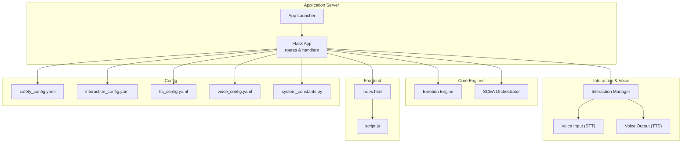
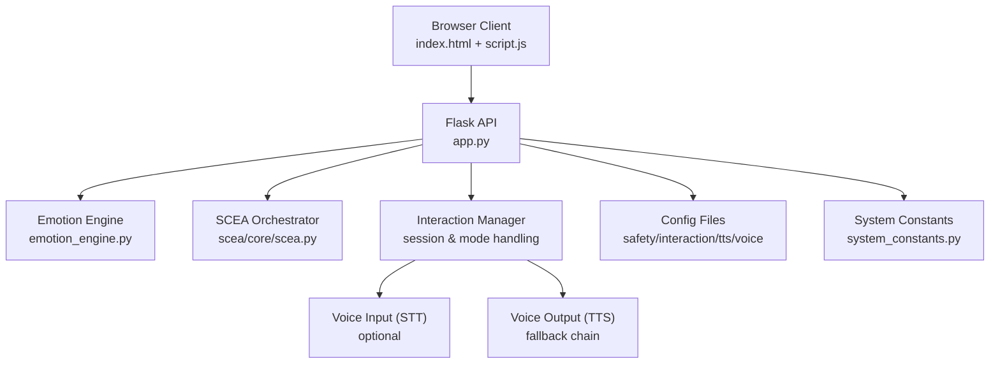
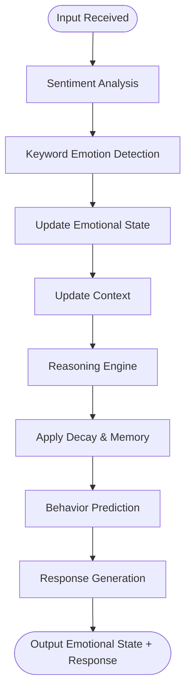
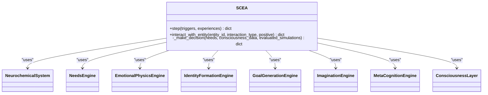
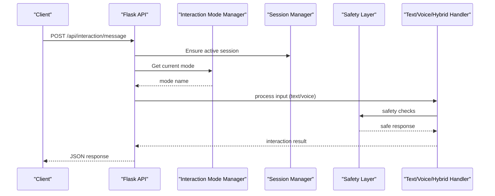
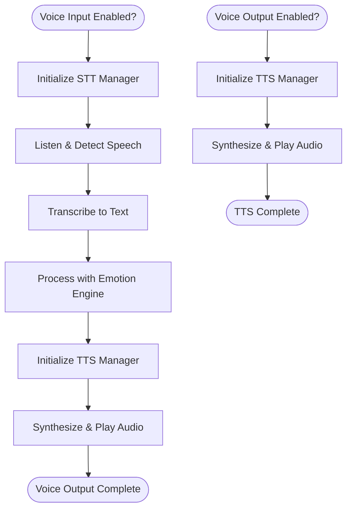
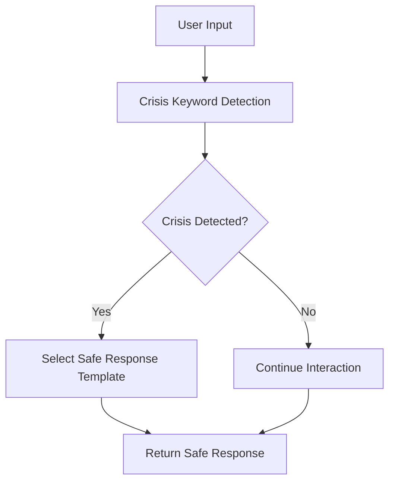
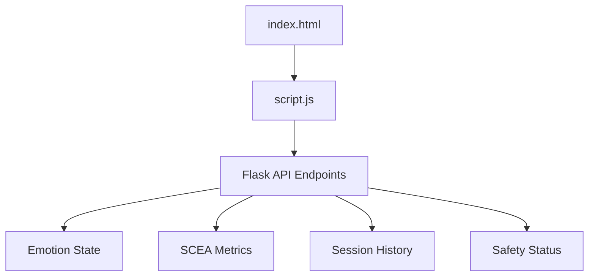
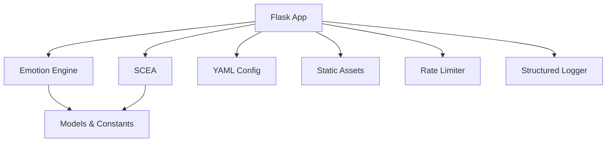

# Project Overview

<cite>
**Referenced Files in This Document**
- [README.md](file://README.md)
- [psychologist/README.md](file://psychologist/README.md)
- [app.py](file://psychologist/app.py)
- [run_app.py](file://psychologist/run_app.py)
- [system_constants.py](file://psychologist/system_constants.py)
- [scea/core/scea.py](file://psychologist/scea/core/scea.py)
- [emotion_engine/emotion_engine.py](file://psychologist/emotion_engine/emotion_engine.py)
- [emotion_engine/models.py](file://psychologist/emotion_engine/models.py)
- [scea/core/models.py](file://psychologist/scea/core/models.py)
- [config/safety_config.yaml](file://psychologist/config/safety_config.yaml)
- [config/interaction_config.yaml](file://psychologist/config/interaction_config.yaml)
- [config/tts_config.yaml](file://psychologist/config/tts_config.yaml)
- [config/voice_config.yaml](file://psychologist/config/voice_config.yaml)
- [frontend/index.html](file://psychologist/frontend/index.html)
- [frontend/script.js](file://psychologist/frontend/script.js)
</cite>

## Table of Contents
1. [Introduction](#introduction)
2. [Project Structure](#project-structure)
3. [Core Components](#core-components)
4. [Architecture Overview](#architecture-overview)
5. [Detailed Component Analysis](#detailed-component-analysis)
6. [Dependency Analysis](#dependency-analysis)
7. [Performance Considerations](#performance-considerations)
8. [Troubleshooting Guide](#troubleshooting-guide)
9. [Conclusion](#conclusion)

## Introduction
ZARA is an offline-first psychological support companion designed to provide privacy-preserving, cloud-independent emotional assistance. Its core philosophy centers on privacy-first operation: all processing—emotion analysis, response generation, voice input/output, and session storage—runs locally. The system emphasizes safety, dual-modal interaction (text and voice), and a self-cognitive architecture that simulates internal mental processes such as needs, identity, goals, and consciousness.

Key capabilities include:
- Emotional intelligence via keyword-based sentiment analysis, fuzzy logic, Bayesian reasoning, and emotional memory
- Cognitive processing through a self-cognitive & emotional architecture (SCEA) simulating neurochemistry, needs, identity, goals, and consciousness
- Therapeutic interaction modes: text, voice, and hybrid, with session persistence and safety monitoring
- Voice I/O with a fallback chain of TTS engines and optional STT/VAD components
- Bilingual support (English and Bangla) and a frontend dashboard for real-time insight

Unlike traditional chatbots powered by large language models and cloud APIs, ZARA operates entirely offline, avoids external data services, and prioritizes user safety and privacy.

**Section sources**
- [psychologist/README.md:1-180](file://psychologist/README.md#L1-L180)

## Project Structure
The project is organized into a modular Python backend (Flask), a frontend dashboard, and specialized subsystems for emotion processing, voice I/O, and self-cognitive architecture. Configuration is centralized in YAML files and system constants.

**Diagram sources**
- [app.py:1-551](file://psychologist/app.py#L1-L551)
- [run_app.py:1-27](file://psychologist/run_app.py#L1-L27)
- [system_constants.py:1-103](file://psychologist/system_constants.py#L1-L103)
- [config/safety_config.yaml:1-116](file://psychologist/config/safety_config.yaml#L1-L116)
- [config/interaction_config.yaml:1-60](file://psychologist/config/interaction_config.yaml#L1-L60)
- [config/tts_config.yaml:1-61](file://psychologist/config/tts_config.yaml#L1-L61)
- [config/voice_config.yaml:1-28](file://psychologist/config/voice_config.yaml#L1-L28)
- [frontend/index.html:1-200](file://psychologist/frontend/index.html#L1-L200)
- [frontend/script.js:1-200](file://psychologist/frontend/script.js#L1-L200)

**Section sources**
- [psychologist/README.md:59-121](file://psychologist/README.md#L59-L121)

## Core Components
- Emotion Engine: Processes user input, detects sentiment and emotion keywords, updates emotional state, maintains context, applies reasoning, predicts behavior, generates responses, and manages emotional memory and decay.
- Self-Cognitive & Emotional Architecture (SCEA): Simulates internal systems including neurochemistry, needs, identity formation, goals, imagination, meta-cognition, emotional evolution, and consciousness.
- Interaction System: Manages dual-modal (text/voice/hybrid) interaction, session lifecycle, safety monitoring, and support tools.
- Voice I/O: Provides TTS with a fallback chain and optional STT/VAD components for voice input and emotion fusion.
- Frontend Dashboard: Offers bilingual visualization of cognitive and emotional states, interaction controls, and support tools.

**Section sources**
- [emotion_engine/emotion_engine.py:1-184](file://psychologist/emotion_engine/emotion_engine.py#L1-L184)
- [scea/core/scea.py:1-200](file://psychologist/scea/core/scea.py#L1-L200)
- [app.py:60-150](file://psychologist/app.py#L60-L150)
- [frontend/index.html:1-200](file://psychologist/frontend/index.html#L1-L200)
- [frontend/script.js:1-200](file://psychologist/frontend/script.js#L1-L200)

## Architecture Overview
ZARA’s architecture integrates a Flask API with specialized subsystems. The Emotion Engine and SCEA operate independently but coordinate through the Interaction Manager. Voice I/O is optional and integrated via callbacks. The frontend consumes the API to render real-time insights and enable dual-mode interaction.

**Diagram sources**
- [app.py:1-551](file://psychologist/app.py#L1-L551)
- [emotion_engine/emotion_engine.py:1-184](file://psychologist/emotion_engine/emotion_engine.py#L1-L184)
- [scea/core/scea.py:1-200](file://psychologist/scea/core/scea.py#L1-L200)
- [system_constants.py:1-103](file://psychologist/system_constants.py#L1-L103)
- [config/safety_config.yaml:1-116](file://psychologist/config/safety_config.yaml#L1-L116)
- [config/interaction_config.yaml:1-60](file://psychologist/config/interaction_config.yaml#L1-L60)
- [config/tts_config.yaml:1-61](file://psychologist/config/tts_config.yaml#L1-L61)
- [config/voice_config.yaml:1-28](file://psychologist/config/voice_config.yaml#L1-L28)
- [frontend/index.html:1-200](file://psychologist/frontend/index.html#L1-L200)
- [frontend/script.js:1-200](file://psychologist/frontend/script.js#L1-L200)

## Detailed Component Analysis

### Emotion Engine
The Emotion Engine orchestrates sentiment analysis, emotion keyword detection, personality influence, context updates, reasoning, behavior prediction, and response generation. It maintains emotional history and applies decay factors to prevent emotional drift.

**Diagram sources**
- [emotion_engine/emotion_engine.py:37-92](file://psychologist/emotion_engine/emotion_engine.py#L37-L92)

**Section sources**
- [emotion_engine/emotion_engine.py:1-184](file://psychologist/emotion_engine/emotion_engine.py#L1-L184)
- [emotion_engine/models.py:1-143](file://psychologist/emotion_engine/models.py#L1-L143)
- [system_constants.py:12-37](file://psychologist/system_constants.py#L12-L37)

### Self-Cognitive & Emotional Architecture (SCEA)
SCEA simulates higher-order cognitive processes including neurochemical effects, needs satisfaction, emotional physics, identity formation, goal generation, imagination, meta-cognition, and consciousness. It evolves identity over time and maintains decision and memory histories.

**Diagram sources**
- [scea/core/scea.py:30-184](file://psychologist/scea/core/scea.py#L30-L184)

**Section sources**
- [scea/core/scea.py:1-200](file://psychologist/scea/core/scea.py#L1-L200)
- [scea/core/models.py:1-162](file://psychologist/scea/core/models.py#L1-L162)
- [system_constants.py:48-61](file://psychologist/system_constants.py#L48-L61)

### Interaction Pipeline (Text/Voice/Hybrid)
The Interaction Manager coordinates dual-modal input, session management, and safety checks. It supports switching between modes while preserving context and ensures session persistence.

**Diagram sources**
- [app.py:290-335](file://psychologist/app.py#L290-L335)
- [app.py:435-447](file://psychologist/app.py#L435-L447)
- [app.py:449-476](file://psychologist/app.py#L449-L476)

**Section sources**
- [app.py:60-150](file://psychologist/app.py#L60-L150)
- [app.py:290-447](file://psychologist/app.py#L290-L447)
- [config/interaction_config.yaml:1-60](file://psychologist/config/interaction_config.yaml#L1-L60)

### Voice Systems (STT/TTS)
Voice input and output are optional and configured via dedicated YAML files. STT engines (Vosk/Whisper) and TTS engines (Piper/espeak/pyttsx3) are initialized conditionally. Voice emotion detection and fusion can be enabled to enrich responses.

**Diagram sources**
- [app.py:73-119](file://psychologist/app.py#L73-L119)
- [config/voice_config.yaml:1-28](file://psychologist/config/voice_config.yaml#L1-L28)
- [config/tts_config.yaml:1-61](file://psychologist/config/tts_config.yaml#L1-L61)

**Section sources**
- [app.py:73-119](file://psychologist/app.py#L73-L119)
- [config/voice_config.yaml:1-28](file://psychologist/config/voice_config.yaml#L1-L28)
- [config/tts_config.yaml:1-61](file://psychologist/config/tts_config.yaml#L1-L61)

### Safety Monitoring
Safety is enforced through keyword-based crisis detection, diagnosis blocking, and pre-authored safe response templates. Risk flags are tracked per session and surfaced via the API.

**Diagram sources**
- [config/safety_config.yaml:1-116](file://psychologist/config/safety_config.yaml#L1-L116)
- [app.py:527-543](file://psychologist/app.py#L527-L543)

**Section sources**
- [config/safety_config.yaml:1-116](file://psychologist/config/safety_config.yaml#L1-L116)
- [app.py:527-543](file://psychologist/app.py#L527-L543)

### Frontend Dashboard
The frontend provides a bilingual interface with real-time visualization of cognitive and emotional states, interaction controls, and support tools. It consumes the API for live updates and session management.

**Diagram sources**
- [frontend/index.html:1-200](file://psychologist/frontend/index.html#L1-L200)
- [frontend/script.js:1-200](file://psychologist/frontend/script.js#L1-L200)
- [app.py:159-543](file://psychologist/app.py#L159-L543)

**Section sources**
- [frontend/index.html:1-200](file://psychologist/frontend/index.html#L1-L200)
- [frontend/script.js:1-200](file://psychologist/frontend/script.js#L1-L200)
- [app.py:159-543](file://psychologist/app.py#L159-L543)

## Dependency Analysis
ZARA’s dependencies are intentionally minimal and local:
- Flask for routing and API exposure
- YAML configuration files for runtime behavior
- Local voice engines (Piper, espeak, pyttsx3) and STT engines (Vosk, Whisper)
- In-memory rate limiting and file-based session storage
- Frontend static assets served by Flask

**Diagram sources**
- [app.py:1-551](file://psychologist/app.py#L1-L551)
- [system_constants.py:1-103](file://psychologist/system_constants.py#L1-L103)

**Section sources**
- [app.py:1-551](file://psychologist/app.py#L1-L551)
- [system_constants.py:1-103](file://psychologist/system_constants.py#L1-L103)

## Performance Considerations
- All computations run locally; performance depends on CPU and available voice models.
- Keyword-based sentiment and template-driven responses avoid heavy inference, keeping latency low.
- Session persistence and memory limits are configurable to balance fidelity and resource usage.
- Voice models must be downloaded locally; initialization overhead occurs at startup.

[No sources needed since this section provides general guidance]

## Troubleshooting Guide
Common issues and remedies:
- Voice systems unavailable: Verify voice model downloads and engine availability; the app logs warnings when components fail to initialize.
- Safety violations: Ensure crisis keywords and safe templates are properly configured; review session safety flags.
- Session persistence: Confirm sessions directory exists and writable; adjust max stored sessions and history limits.
- API rate limiting: Reduce request frequency or adjust system constants for stricter limits.

**Section sources**
- [app.py:73-119](file://psychologist/app.py#L73-L119)
- [app.py:39-46](file://psychologist/app.py#L39-L46)
- [system_constants.py:74-102](file://psychologist/system_constants.py#L74-L102)
- [config/safety_config.yaml:1-116](file://psychologist/config/safety_config.yaml#L1-L116)

## Conclusion
ZARA offers a privacy-first, offline-capable psychological support companion that blends emotional intelligence with a self-cognitive architecture. By avoiding cloud dependencies and external services, it delivers a secure, bilingual, and dual-modal experience with robust safety monitoring and session persistence. Compared to traditional chatbots, ZARA emphasizes local processing, structured safety, and long-term cognitive modeling to support emotional well-being.

[No sources needed since this section summarizes without analyzing specific files]