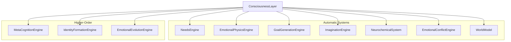
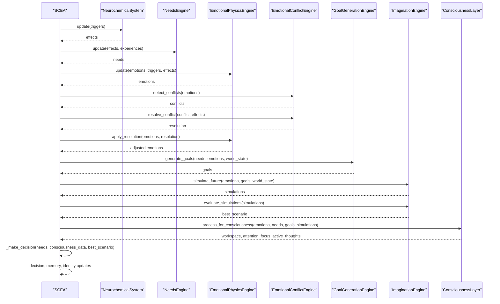
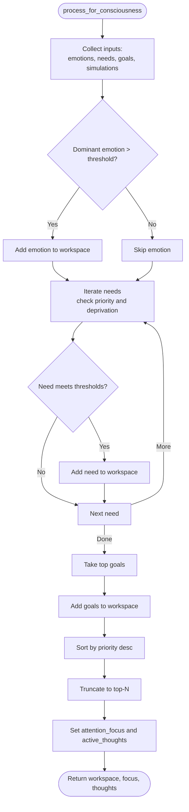
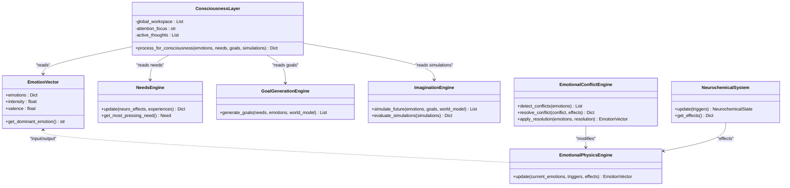
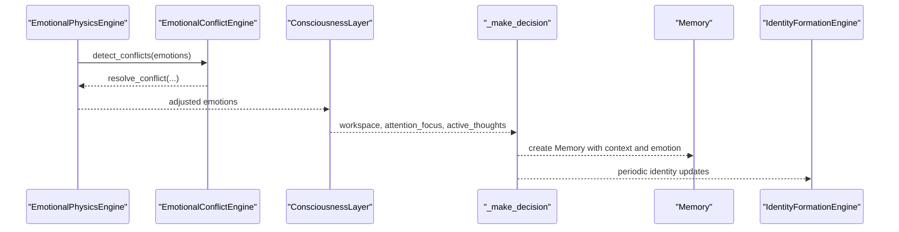
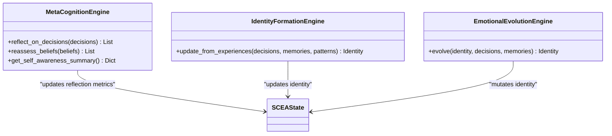
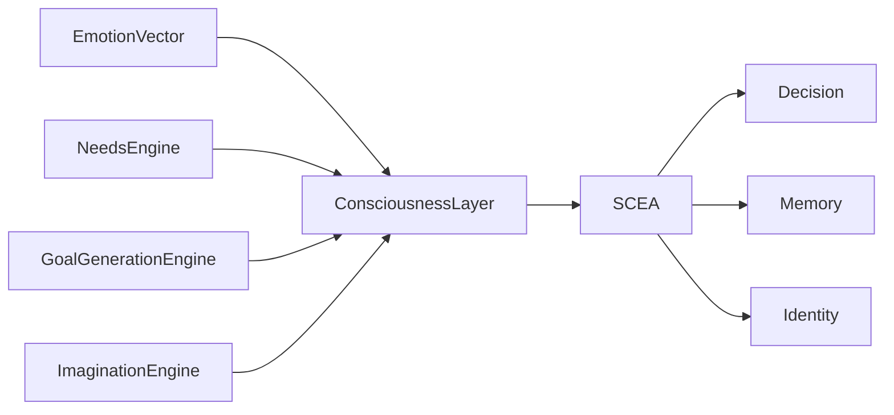
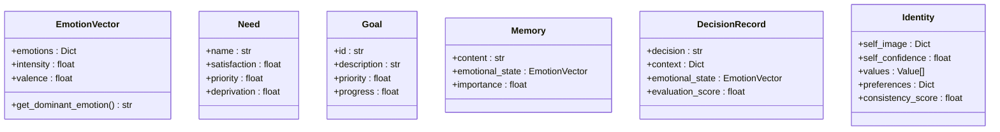

# Consciousness Layer

<cite>
**Referenced Files in This Document**
- [consciousness_system.py](file://psychologist/scea/consciousness_layer/consciousness_system.py)
- [models.py](file://psychologist/scea/core/models.py)
- [scea.py](file://psychologist/scea/core/scea.py)
- [meta_cognition_system.py](file://psychologist/scea/meta_cognition/meta_cognition_system.py)
- [identity_system.py](file://psychologist/scea/identity_formation/identity_system.py)
- [imagination_system.py](file://psychologist/scea/imagination/imagination_system.py)
- [neurochemical_system.py](file://psychologist/scea/neurochemistry/neurochemical_system.py)
- [emotional_physics_engine.py](file://psychologist/scea/emotional_physics/emotional_physics_engine.py)
- [needs_system.py](file://psychologist/scea/needs_engine/needs_system.py)
- [goal_system.py](file://psychologist/scea/goal_generation/goal_system.py)
- [cognitive_dissonance_engine.py](file://psychologist/scea/cognitive_dissonance/cognitive_dissonance_engine.py)
- [emotional_conflict_engine.py](file://psychologist/scea/conflict_engine/emotional_conflict_engine.py)
- [world_model_system.py](file://psychologist/scea/world_model/world_model_system.py)
- [emotional_evolution_system.py](file://psychologist/scea/emotional_evolution/emotional_evolution_system.py)
</cite>

## Table of Contents
1. [Introduction](#introduction)
2. [Project Structure](#project-structure)
3. [Core Components](#core-components)
4. [Architecture Overview](#architecture-overview)
5. [Detailed Component Analysis](#detailed-component-analysis)
6. [Dependency Analysis](#dependency-analysis)
7. [Performance Considerations](#performance-considerations)
8. [Troubleshooting Guide](#troubleshooting-guide)
9. [Conclusion](#conclusion)
10. [Appendices](#appendices)

## Introduction
This document explains the consciousness layer component of the SCEA system and how it simulates awareness, attention, and subjective experience. It documents selective attention mechanisms, sensory-integration-like prioritization, and the gating of information into a global workspace. It also covers how the layer integrates automatic processes (emotions, needs, goals, imagination) with conscious awareness, and how it influences perception, memory consolidation, and behavioral responses in real-time interactions. Self-awareness and metacognition are modeled via reflective summaries, while the sense of being emerges from sustained attention focus and active thoughts maintained across cycles.

## Project Structure
The consciousness layer is part of the SCEA cognitive architecture and interacts with multiple subsystems:
- Automatic systems: needs, emotions, goals, imagination, neurochemistry, conflict resolution, and world model
- Higher-order cognition: meta-cognition and identity formation
- Evolutionary identity maintenance: emotional evolution

**Diagram sources**
- [scea.py:30-46](file://psychologist/scea/core/scea.py#L30-L46)
- [consciousness_system.py:6-11](file://psychologist/scea/consciousness_layer/consciousness_system.py#L6-L11)

**Section sources**
- [scea.py:30-46](file://psychologist/scea/core/scea.py#L30-L46)

## Core Components
- ConsciousnessLayer: Maintains a global workspace, selects attention focus, and tracks active thoughts based on emotion dominance, need deprivation/priority, goal priority, and simulation valence.
- SCEA orchestrator: Drives the cycle, passing processed inputs to the consciousness layer and collecting outputs for memory, identity, and behavior.
- Supporting engines: Needs, emotions, goals, imagination, neurochemistry, conflict resolution, world model, meta-cognition, identity, and emotional evolution.

Key outputs from the consciousness layer:
- Workspace contents: prioritized items (emotion, need, goal)
- Attention focus: top-priority item
- Active thoughts: list of current focal items

These outputs gate higher-order reflection and decision-making.

**Section sources**
- [consciousness_system.py:6-55](file://psychologist/scea/-consciousness_layer/consciousness_system.py#L6-L55)
- [scea.py:113-122](file://psychologist/scea/core/scea.py#L113-L122)

## Architecture Overview
The SCEA step integrates automatic and higher-order processes. The consciousness layer sits at the intersection of emotion, needs, goals, and imagined scenarios, producing a prioritized global workspace that steers decisions and memory consolidation.

**Diagram sources**
- [scea.py:61-184](file://psychologist/scea/core/scea.py#L61-L184)
- [consciousness_system.py:12-55](file://psychologist/scea/-consciousness_layer/consciousness_system.py#L12-L55)

## Detailed Component Analysis

### ConsciousnessLayer
Responsibilities:
- Build a global workspace from:
  - Dominant emotion when above threshold
  - Needs with high priority and deprivation
  - Top goals
- Select attention focus and maintain active thoughts
- Return structured outputs for downstream use

Processing logic:
- Emotion gating: only include dominant emotion if intensity exceeds a threshold
- Need gating: include needs with priority and deprivation above thresholds
- Goal gating: include top goals
- Sorting by priority and truncating to a fixed window
- Attention focus set to the most salient item; active thoughts capture the current workspace

**Diagram sources**
- [consciousness_system.py:12-55](file://psychologist/scea/-consciousness_layer/consciousness_system.py#L12-L55)

**Section sources**
- [consciousness_system.py:6-55](file://psychologist/scea/-consciousness_layer/consciousness_system.py#L6-L55)

### Integration with Automatic Processes
- Emotions: EmotionVector provides intensity and valence; EmotionalPhysicsEngine updates emotion magnitudes and momentum; EmotionalConflictEngine resolves intrapersonal conflicts; NeurochemicalSystem translates triggers into neurotransmitter dynamics and effects.
- Needs: NeedsEngine computes satisfaction, deprivation, and priority; these feed into consciousness workspace and decision-making.
- Goals: GoalGenerationEngine creates goals from needs and environment; these compete for attention.
- Imagination: ImaginationEngine simulates outcomes and exploration, producing emotional futures used to evaluate best scenarios.

**Diagram sources**
- [consciousness_system.py:12-55](file://psychologist/scea/-consciousness_layer/consciousness_system.py#L12-L55)
- [models.py:38-58](file://psychologist/scea/core/models.py#L38-L58)
- [needs_system.py:73-99](file://psychologist/scea/needs_engine/needs_system.py#L73-L99)
- [goal_system.py:39-76](file://psychologist/scea/goal_generation/goal_system.py#L39-L76)
- [imagination_system.py:10-30](file://psychologist/scea/imagination/imagination_system.py#L10-L30)
- [neurochemical_system.py:12-92](file://psychologist/scea/neurochemistry/neurochemical_system.py#L12-L92)
- [emotional_physics_engine.py:12-41](file://psychologist/scea/emotional_physics/emotional_physics_engine.py#L12-L41)
- [emotional_conflict_engine.py:17-37](file://psychologist/scea/conflict_engine/emotional_conflict_engine.py#L17-L37)

**Section sources**
- [scea.py:61-122](file://psychologist/scea/core/scea.py#L61-L122)
- [models.py:38-58](file://psychologist/scea/core/models.py#L38-L58)

### Consciousness Influences Perception, Memory, and Behavior
- Perception: Emotions and neurochemical effects shape perception via EmotionalPhysicsEngine and ConflictEngine, which influence the inputs to the consciousness layer.
- Attention: ConsciousnessLayer’s attention focus determines which items dominate the global workspace, effectively gating what is “in focus” for decision-making.
- Memory: Decisions are recorded with context and emotional state; memory importance increases with emotion intensity, linking conscious decisions to memory consolidation.
- Behavior: Decisions are selected from the consciousness workspace plus needs and best simulation, driving action selection.

**Diagram sources**
- [scea.py:85-158](file://psychologist/scea/core/scea.py#L85-L158)
- [consciousness_system.py:12-55](file://psychologist/scea/-consciousness_layer/consciousness_system.py#L12-L55)

**Section sources**
- [scea.py:113-158](file://psychologist/scea/core/scea.py#L113-L158)

### Self-Awareness, Metacognition, and Sense of Being
- Self-awareness summary: MetaCognitionEngine tracks decision outcomes and regret, providing averages and learning rates that reflect a reflective self-model.
- Identity foundations: IdentityFormationEngine builds self-image, values, and preferences from experiences and memories, contributing to a sense of self.
- Emotional evolution: EmotionalEvolutionEngine introduces mutation-driven changes to identity, modeling ongoing identity development influenced by choices and memories.

**Diagram sources**
- [meta_cognition_system.py:10-77](file://psychologist/scea/meta_cognition/meta_cognition_system.py#L10-L77)
- [identity_system.py:21-106](file://psychologist/scea/identity_formation/identity_system.py#L21-L106)
- [emotional_evolution_system.py:11-35](file://psychologist/scea/emotional_evolution/emotional_evolution_system.py#L11-L35)

**Section sources**
- [meta_cognition_system.py:65-77](file://psychologist/scea/meta_cognition/meta_cognition_system.py#L65-L77)
- [identity_system.py:93-106](file://psychologist/scea/identity_formation/identity_system.py#L93-L106)
- [emotional_evolution_system.py:70-79](file://psychologist/scea/emotional_evolution/emotional_evolution_system.py#L70-L79)

### Real-Time Interaction Scenarios
Example 1: Social interaction
- Interaction triggers neurochemical changes (e.g., reward, social connection).
- Emotions update via EmotionalPhysicsEngine; conflicts resolved by EmotionalConflictEngine.
- ConsciousnessLayer focuses on dominant emotion or pressing need.
- Decision selects an action aligned with attention focus and best simulation.
- Memory consolidates the decision with emotional context.
- Identity and meta-cognition evolve over time.

Example 2: Exploration
- Curiosity boosts needs and goals; ImaginationEngine proposes exploration scenarios.
- ConsciousnessLayer weights curiosity-emotion and exploration likelihood.
- Decision favors exploration when valence and likelihood are high.
- Memory encodes discovery and emotional tone.
- Identity preferences and values updated by IdentityFormationEngine and EmotionalEvolutionEngine.

**Section sources**
- [scea.py:225-249](file://psychologist/scea/core/scea.py#L225-L249)
- [imagination_system.py:72-87](file://psychologist/scea/imagination/imagination_system.py#L72-L87)
- [identity_system.py:78-91](file://psychologist/scea/identity_formation/identity_system.py#L78-L91)

## Dependency Analysis
The ConsciousnessLayer depends on:
- EmotionVector for emotion intensity/valence
- NeedsEngine for need priorities and deprivation
- GoalGenerationEngine for goal descriptions and priorities
- ImaginationEngine for simulated scenarios and valence estimates

It is consumed by:
- SCEA orchestrator for attention focus and active thoughts
- Decision-making pipeline for selecting actions
- Memory creation and identity updates

**Diagram sources**
- [consciousness_system.py:12-55](file://psychologist/scea/-consciousness_layer/consciousness_system.py#L12-L55)
- [scea.py:113-122](file://psychologist/scea/core/scea.py#L113-L122)

**Section sources**
- [scea.py:113-122](file://psychologist/scea/core/scea.py#L113-L122)

## Performance Considerations
- Workspace truncation: Limiting workspace size prevents combinatorial blow-up and ensures timely attention selection.
- Thresholding: Using thresholds for emotion dominance and need deprivation reduces noise and computational load.
- Simulation limits: Cap on simulations and evaluations keeps runtime predictable.
- Decay and momentum: Natural decay and momentum reduce oscillations and stabilize emotion dynamics.

[No sources needed since this section provides general guidance]

## Troubleshooting Guide
Common issues and remedies:
- No attention focus: Verify emotion dominance threshold and ensure sufficient emotion magnitude; check NeedsEngine thresholds for needs.
- Overly broad focus: Reduce workspace window or increase thresholds; review goal priorities.
- Stale active thoughts: Confirm ConsciousnessLayer is invoked each cycle and that SCEA updates attention focus and active thoughts.
- Memory not forming: Check decision inclusion and Memory creation; ensure emotion intensity contributes to importance weighting.
- Identity not evolving: Ensure periodic identity updates occur and that experiences and memories are fed into IdentityFormationEngine.

**Section sources**
- [consciousness_system.py:47-55](file://psychologist/scea/-consciousness_layer/consciousness_system.py#L47-L55)
- [scea.py:123-158](file://psychologist/scea/core/scea.py#L123-L158)

## Conclusion
The consciousness layer in SCEA provides a minimal yet effective model of awareness and attention by constructing a global workspace from emotion, needs, goals, and imagined scenarios. It gates information into attention focus and active thoughts, enabling selective processing that influences perception, memory consolidation, and behavior. Self-awareness and identity emerge from meta-cognitive reflection and identity formation, while the sense of being arises from sustained attention focus and the continuity of active thoughts across cycles.

[No sources needed since this section summarizes without analyzing specific files]

## Appendices

### Data Models Used by ConsciousnessLayer

**Diagram sources**
- [models.py:38-132](file://psychologist/scea/core/models.py#L38-L132)