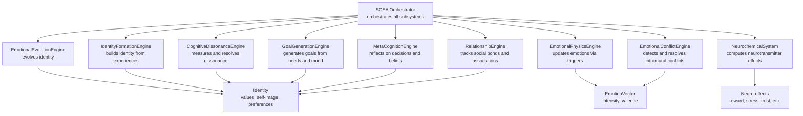
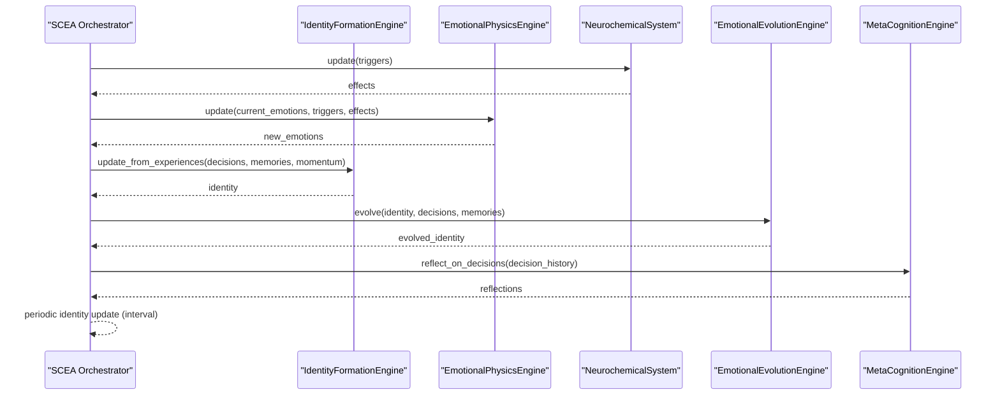
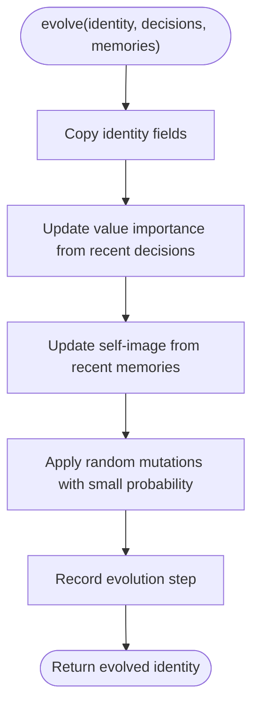
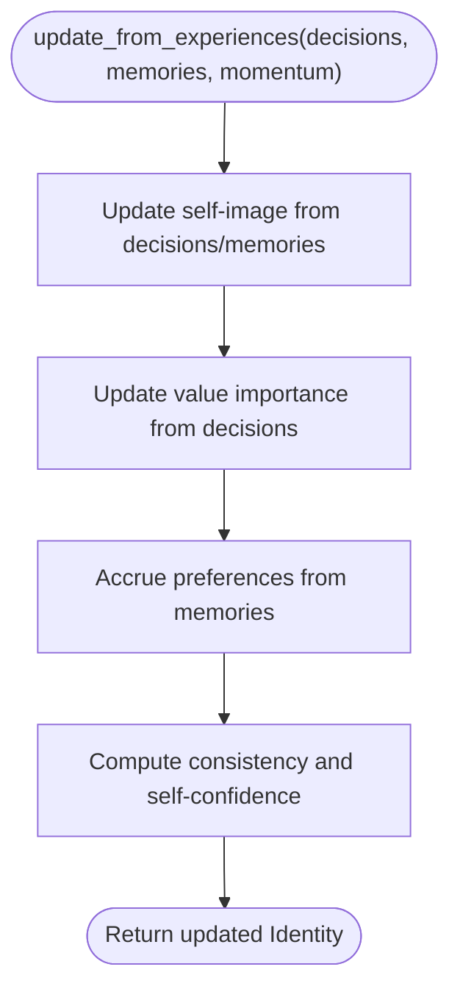
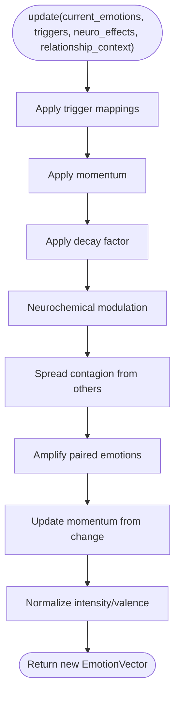
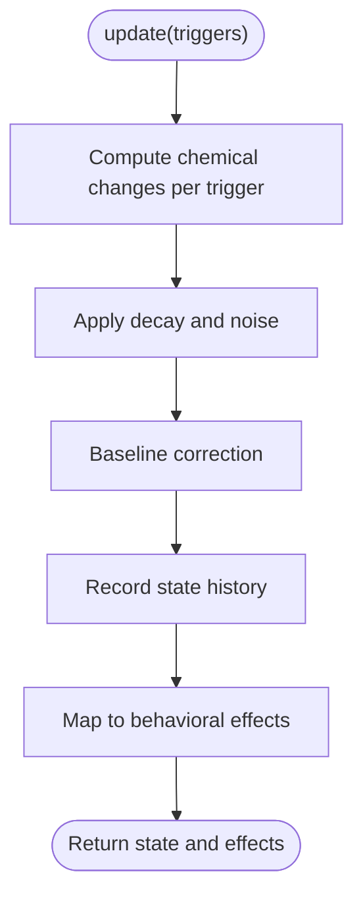
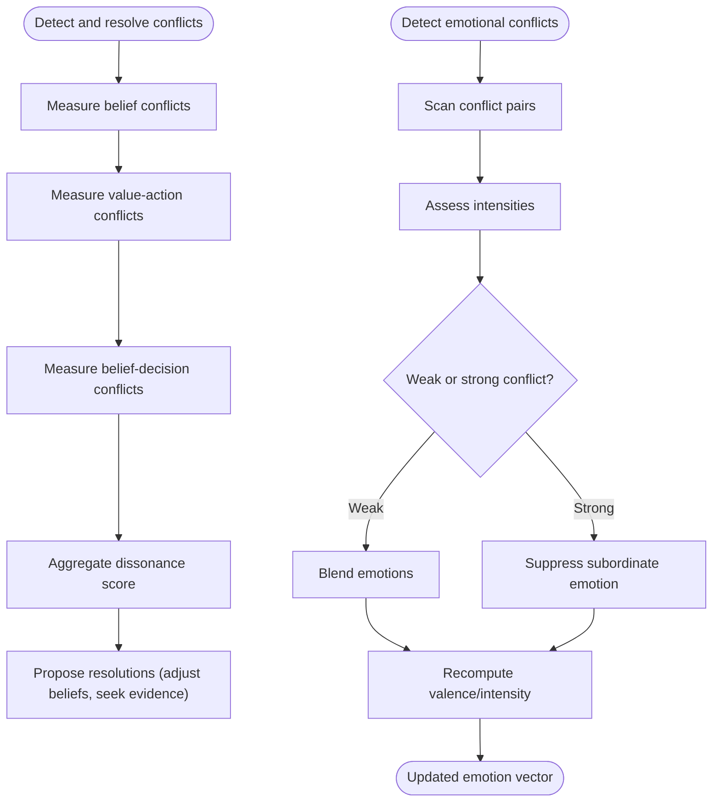
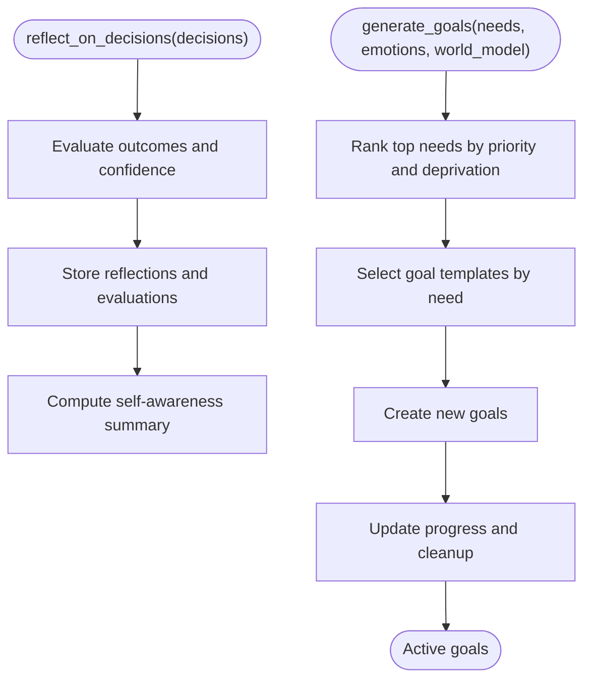
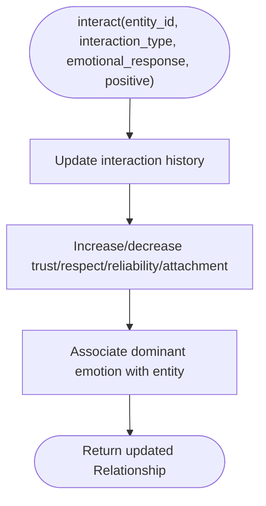
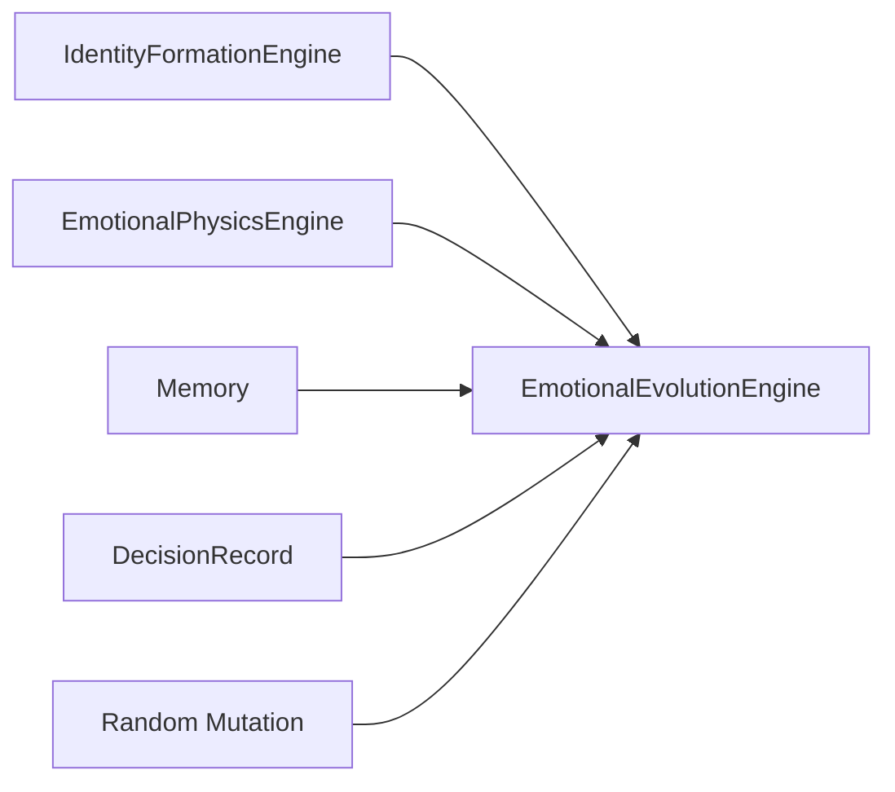

# Emotional Evolution

<cite>
**Referenced Files in This Document**
- [emotional_evolution_system.py](file://psychologist/scea/emotional_evolution/emotional_evolution_system.py)
- [scea.py](file://psychologist/scea/core/scea.py)
- [models.py](file://psychologist/scea/core/models.py)
- [identity_system.py](file://psychologist/scea/identity_formation/identity_system.py)
- [emotional_physics_engine.py](file://psychologist/scea/emotional_physics/emotional_physics_engine.py)
- [neurochemical_system.py](file://psychologist/scea/neurochemistry/neurochemical_system.py)
- [cognitive_dissonance_engine.py](file://psychologist/scea/cognitive_dissonance/cognitive_dissonance_engine.py)
- [emotional_conflict_engine.py](file://psychologist/scea/conflict_engine/emotional_conflict_engine.py)
- [relationship_system.py](file://psychologist/scea/relationship_engine/relationship_system.py)
- [meta_cognition_system.py](file://psychologist/scea/meta_cognition/meta_cognition_system.py)
- [goal_system.py](file://psychologist/scea/goal_generation/goal_system.py)
- [system_constants.py](file://psychologist/system_constants.py)
- [example_scea.py](file://psychologist/example_scea.py)
</cite>

## Table of Contents
1. [Introduction](#introduction)
2. [Project Structure](#project-structure)
3. [Core Components](#core-components)
4. [Architecture Overview](#architecture-overview)
5. [Detailed Component Analysis](#detailed-component-analysis)
6. [Dependency Analysis](#dependency-analysis)
7. [Performance Considerations](#performance-considerations)
8. [Troubleshooting Guide](#troubleshooting-guide)
9. [Conclusion](#conclusion)
10. [Appendices](#appendices)

## Introduction
This document explains the emotional evolution system within the Synthetic Conscious Emotion Architecture (SCEA) framework. It focuses on how long-term emotional development, adaptation, and growth are modeled, including mechanisms for emotional learning, habituation, and personality maturation over time. It also documents how past experiences integrate with present emotional states and future expectations, and how the system models emotional resilience, adaptation to stress, and positive psychological growth. Finally, it illustrates practical impacts on decision-making, relationship building, and psychological well-being during extended interactions.

## Project Structure
The emotional evolution system is part of the SCEA core subsystems. It collaborates with identity formation, emotional physics, neurochemistry, conflict resolution, cognitive dissonance, goals, meta-cognition, and relationships to produce evolving identity states over time.

**Diagram sources**
- [scea.py:30-46](file://psychologist/scea/core/scea.py#L30-L46)
- [emotional_evolution_system.py:6-35](file://psychologist/scea/emotional_evolution/emotional_evolution_system.py#L6-L35)
- [identity_system.py:6-31](file://psychologist/scea/identity_formation/identity_system.py#L6-L31)
- [emotional_physics_engine.py:7-41](file://psychologist/scea/emotional_physics/emotional_physics_engine.py#L7-L41)
- [neurochemical_system.py:6-92](file://psychologist/scea/neurochemistry/neurochemical_system.py#L6-L92)
- [emotional_conflict_engine.py:5-37](file://psychologist/scea/conflict_engine/emotional_conflict_engine.py#L5-L37)
- [cognitive_dissonance_engine.py:5-37](file://psychologist/scea/cognitive_dissonance/cognitive_dissonance_engine.py#L5-L37)
- [goal_system.py:6-76](file://psychologist/scea/goal_generation/goal_system.py#L6-L76)
- [meta_cognition_system.py:5-26](file://psychologist/scea/meta_cognition/meta_cognition_system.py#L5-L26)
- [relationship_system.py:6-52](file://psychologist/scea/relationship_engine/relationship_system.py#L6-L52)

**Section sources**
- [scea.py:30-46](file://psychologist/scea/core/scea.py#L30-L46)
- [system_constants.py:48-61](file://psychologist/system_constants.py#L48-L61)

## Core Components
- EmotionalEvolutionEngine: Evolves identity by updating value importance and self-image traits based on recent decisions and memories, with occasional random mutations to maintain exploration.
- IdentityFormationEngine: Constructs and maintains identity from decision history, memory content, and emotional patterns; computes consistency and self-confidence.
- EmotionalPhysicsEngine: Translates external and internal triggers into dynamic emotion vectors with momentum, decay, resonance, and contagion.
- NeurochemicalSystem: Computes neurotransmitter states and translates them into behavioral effects (e.g., reward expectation, stress level).
- Conflict and Dissonance Engines: Detect and resolve intramural emotional conflicts and cognitive dissonance to stabilize identity and decision alignment.
- Goals, Meta-cognition, Relationships: Provide contextual drivers and feedback loops that influence identity evolution and emotional stability.

**Section sources**
- [emotional_evolution_system.py:6-80](file://psychologist/scea/emotional_evolution/emotional_evolution_system.py#L6-L80)
- [identity_system.py:6-106](file://psychologist/scea/identity_formation/identity_system.py#L6-L106)
- [emotional_physics_engine.py:7-127](file://psychologist/scea/emotional_physics/emotional_physics_engine.py#L7-L127)
- [neurochemical_system.py:6-116](file://psychologist/scea/neurochemistry/neurochemical_system.py#L6-L116)
- [cognitive_dissonance_engine.py:5-99](file://psychologist/scea/cognitive_dissonance/cognitive_dissonance_engine.py#L5-L99)
- [emotional_conflict_engine.py:5-71](file://psychologist/scea/conflict_engine/emotional_conflict_engine.py#L5-L71)
- [goal_system.py:6-144](file://psychologist/scea/goal_generation/goal_system.py#L6-L144)
- [meta_cognition_system.py:5-78](file://psychologist/scea/meta_cognition/meta_cognition_system.py#L5-L78)
- [relationship_system.py:6-85](file://psychologist/scea/relationship_engine/relationship_system.py#L6-L85)

## Architecture Overview
The SCEA orchestrator coordinates subsystems at each step. Emotional evolution is triggered periodically (based on a configurable interval) to re-evaluate identity using recent decisions and memories. The process integrates:
- Identity formation from experiences
- Emotional updates via triggers and neurochemical effects
- Conflict resolution and dissonance minimization
- Goal generation and meta-cognitive reflection
- Relationship dynamics influencing emotional states

**Diagram sources**
- [scea.py:61-158](file://psychologist/scea/core/scea.py#L61-L158)
- [identity_system.py:21-31](file://psychologist/scea/identity_formation/identity_system.py#L21-L31)
- [emotional_evolution_system.py:11-35](file://psychologist/scea/emotional_evolution/emotional_evolution_system.py#L11-L35)
- [neurochemical_system.py:12-92](file://psychologist/scea/neurochemistry/neurochemical_system.py#L12-L92)
- [emotional_physics_engine.py:12-41](file://psychologist/scea/emotional_physics/emotional_physics_engine.py#L12-L41)
- [meta_cognition_system.py:10-26](file://psychologist/scea/meta_cognition/meta_cognition_system.py#L10-L26)

## Detailed Component Analysis

### EmotionalEvolutionEngine
The engine evolves identity by:
- Copying current identity attributes (values, self-image, preferences, confidence, consistency)
- Updating value importance based on recent decisions’ evaluations
- Adjusting self-image traits according to recent memories’ valence and content
- Applying rare random mutations to preserve diversity and prevent stagnation

**Diagram sources**
- [emotional_evolution_system.py:11-80](file://psychologist/scea/emotional_evolution/emotional_evolution_system.py#L11-L80)

**Section sources**
- [emotional_evolution_system.py:6-80](file://psychologist/scea/emotional_evolution/emotional_evolution_system.py#L6-L80)

### IdentityFormationEngine
IdentityFormationEngine builds identity from:
- Self-image updates from decision quality and memory valence
- Value importance reinforcement from repeated aligned actions
- Preference accrual from emotionally weighted memories
- Consistency and self-confidence derived from value stability and success metrics

**Diagram sources**
- [identity_system.py:21-106](file://psychologist/scea/identity_formation/identity_system.py#L21-L106)

**Section sources**
- [identity_system.py:6-106](file://psychologist/scea/identity_formation/identity_system.py#L6-L106)

### EmotionalPhysicsEngine
EmotionalPhysicsEngine transforms triggers into emotion dynamics:
- Trigger mapping adds emotion-specific deltas
- Momentum preserves persistence across steps
- Decay reduces emotion intensities over time
- Neuro modulation scales emotions by neurotransmitter effects
- Contagion spreads emotions based on others’ emotional associations
- Resonance amplifies paired emotions when thresholds are met
- Momentum updates capture directional tendencies

**Diagram sources**
- [emotional_physics_engine.py:12-127](file://psychologist/scea/emotional_physics/emotional_physics_engine.py#L12-L127)

**Section sources**
- [emotional_physics_engine.py:7-127](file://psychologist/scea/emotional_physics/emotional_physics_engine.py#L7-L127)

### NeurochemicalSystem
NeurochemicalSystem computes neurotransmitter states and translates them into behavioral effects:
- Triggers increase/decrease specific chemicals
- Exogenous noise and endogenous decay maintain realism
- Baseline correction stabilizes drift
- Effects map to constructs like reward expectation, stress level, trust formation, etc.

**Diagram sources**
- [neurochemical_system.py:12-111](file://psychologist/scea/neurochemistry/neurochemical_system.py#L12-L111)

**Section sources**
- [neurochemical_system.py:6-116](file://psychologist/scea/neurochemistry/neurochemical_system.py#L6-L116)

### Cognitive Dissonance and Emotional Conflict
- CognitiveDissonanceEngine measures inconsistencies among beliefs, values, and recent decisions, generating resolutions to reduce dissonance.
- EmotionalConflictEngine detects simultaneous activation of conflicting emotions and either blends or suppresses them depending on intensity and neurochemical context.

**Diagram sources**
- [cognitive_dissonance_engine.py:11-99](file://psychologist/scea/cognitive_dissonance/cognitive_dissonance_engine.py#L11-L99)
- [emotional_conflict_engine.py:17-71](file://psychologist/scea/conflict_engine/emotional_conflict_engine.py#L17-L71)

**Section sources**
- [cognitive_dissonance_engine.py:5-99](file://psychologist/scea/cognitive_dissonance/cognitive_dissonance_engine.py#L5-L99)
- [emotional_conflict_engine.py:5-71](file://psychologist/scea/conflict_engine/emotional_conflict_engine.py#L5-L71)

### Meta-cognition and Goals
- MetaCognitionEngine evaluates recent decisions, tracks regret and learning, and supports belief reassessment.
- GoalGenerationEngine generates goals from pressing needs and emotional states, maintaining progress and pruning completed or abandoned goals.

**Diagram sources**
- [meta_cognition_system.py:10-78](file://psychologist/scea/meta_cognition/meta_cognition_system.py#L10-L78)
- [goal_system.py:39-144](file://psychologist/scea/goal_generation/goal_system.py#L39-L144)

**Section sources**
- [meta_cognition_system.py:5-78](file://psychologist/scea/meta_cognition/meta_cognition_system.py#L5-L78)
- [goal_system.py:6-144](file://psychologist/scea/goal_generation/goal_system.py#L6-L144)

### Relationships and Social Contagion
RelationshipEngine encodes trust, familiarity, respect, reliability, and attachment, and associates dominant emotions with entities. These associations influence emotional contagion and social triggers that feed back into emotional physics.

**Diagram sources**
- [relationship_system.py:10-52](file://psychologist/scea/relationship_engine/relationship_system.py#L10-L52)

**Section sources**
- [relationship_system.py:6-85](file://psychologist/scea/relationship_engine/relationship_system.py#L6-L85)

## Dependency Analysis
The emotional evolution system depends on:
- IdentityFormationEngine for initial identity construction
- EmotionalPhysicsEngine for momentum and emotion dynamics
- Memory and DecisionRecord collections for recent context
- Random mutation for stochastic exploration

**Diagram sources**
- [emotional_evolution_system.py:11-80](file://psychologist/scea/emotional_evolution/emotional_evolution_system.py#L11-L80)
- [identity_system.py:21-31](file://psychologist/scea/identity_formation/identity_system.py#L21-L31)
- [emotional_physics_engine.py:12-41](file://psychologist/scea/emotional_physics/emotional_physics_engine.py#L12-L41)

**Section sources**
- [emotional_evolution_system.py:6-80](file://psychologist/scea/emotional_evolution/emotional_evolution_system.py#L6-L80)
- [identity_system.py:6-31](file://psychologist/scea/identity_formation/identity_system.py#L6-L31)
- [emotional_physics_engine.py:7-41](file://psychologist/scea/emotional_physics/emotional_physics_engine.py#L7-L41)

## Performance Considerations
- Identity updates occur at a fixed interval to balance responsiveness and computational cost.
- Memory and decision histories are capped to control memory footprint and computation.
- Emotion decay and momentum reduce oscillation while preserving meaningful persistence.
- Random mutations are low-probability to avoid excessive instability.

Practical tips:
- Tune the identity update interval to match desired adaptation speed.
- Monitor memory limits and adjust importance weights to prioritize impactful experiences.
- Calibrate mutation rates to encourage exploration without derailing progress.

**Section sources**
- [system_constants.py:48-61](file://psychologist/system_constants.py#L48-L61)
- [scea.py:148-158](file://psychologist/scea/core/scea.py#L148-L158)
- [emotional_physics_engine.py:70-76](file://psychologist/scea/emotional_physics/emotional_physics_engine.py#L70-L76)
- [emotional_evolution_system.py:70-79](file://psychologist/scea/emotional_evolution/emotional_evolution_system.py#L70-L79)

## Troubleshooting Guide
Common issues and remedies:
- Identity not evolving: Verify that identity updates are triggered at the configured interval and that recent decisions/memories are being passed to the evolution engine.
- Emotions too volatile: Increase decay and reduce resonance strengths; check neurotransmitter effects scaling.
- Overfitting to recent experiences: Reduce mutation rate or increase the window sizes for value/self-image updates.
- Relationship-driven emotional noise: Lower contagion strength or filter relationship contexts before passing to emotional physics.

**Section sources**
- [scea.py:148-158](file://psychologist/scea/core/scea.py#L148-L158)
- [emotional_evolution_system.py:37-79](file://psychologist/scea/emotional_evolution/emotional_evolution_system.py#L37-L79)
- [emotional_physics_engine.py:93-127](file://psychologist/scea/emotional_physics/emotional_physics_engine.py#L93-L127)
- [relationship_system.py:93-100](file://psychologist/scea/relationship_engine/relationship_system.py#L93-L100)

## Conclusion
The SCEA emotional evolution system models long-term psychological development by integrating identity formation, emotional dynamics, conflict resolution, and meta-cognitive reflection. Through value and self-image updates informed by recent decisions and memories, combined with controlled random mutations, the system achieves adaptive growth. Emotional physics and neurochemical effects provide realistic feedback loops, while relationships and goals anchor behavior in social and personal contexts. Together, these mechanisms support resilience, adaptation to stress, and positive psychological growth over extended interaction periods.

## Appendices

### How Emotional Evolution Influences Outcomes
- Decision-making: Evolving values and self-image alter the weighting of options, biasing toward aligned actions and reducing dissonance.
- Relationship building: Updated self-image and emotional associations refine trust and attachment dynamics, shaping social engagement.
- Psychological well-being: Reduced cognitive dissonance, consistent identity, and positive emotional momentum contribute to sustained well-being.

**Section sources**
- [cognitive_dissonance_engine.py:11-37](file://psychologist/scea/cognitive_dissonance/cognitive_dissonance_engine.py#L11-L37)
- [identity_system.py:93-106](file://psychologist/scea/identity_formation/identity_system.py#L93-L106)
- [relationship_system.py:42-51](file://psychologist/scea/relationship_engine/relationship_system.py#L42-L51)
- [scea.py:186-223](file://psychologist/scea/core/scea.py#L186-L223)

### Example Simulation
The example demonstrates how repeated experiences drive identity evolution and emotional dynamics over time, including periodic identity updates and identity metrics.

**Section sources**
- [example_scea.py:11-103](file://psychologist/example_scea.py#L11-L103)