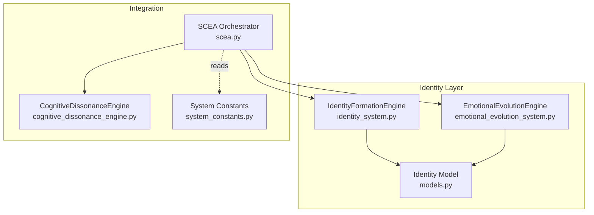
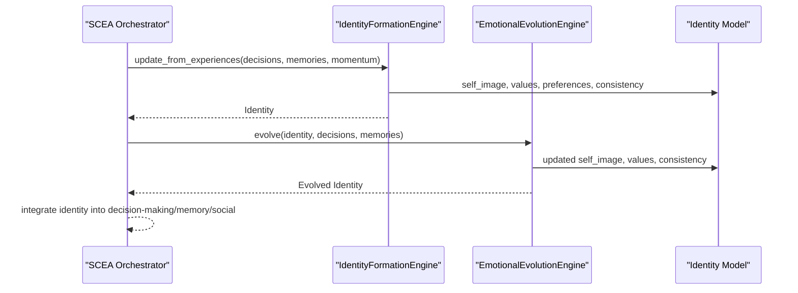
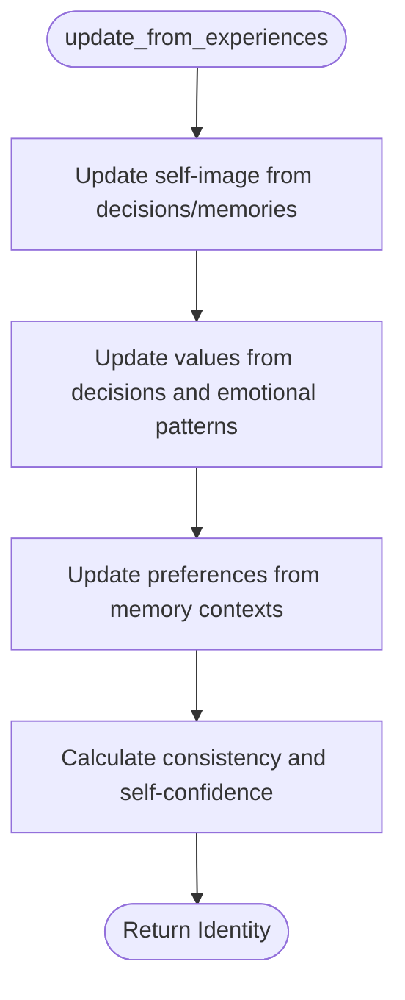
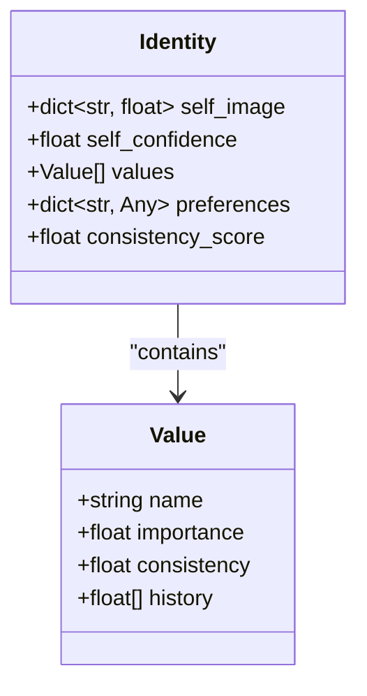
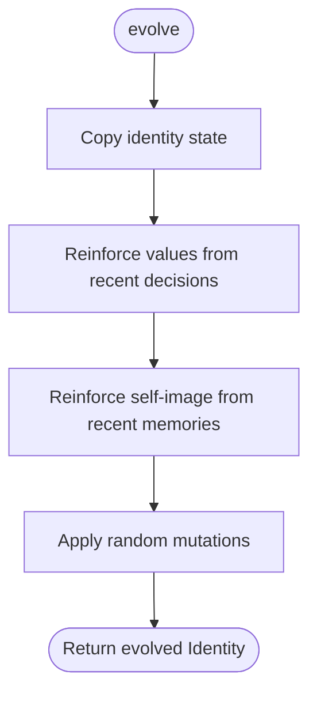
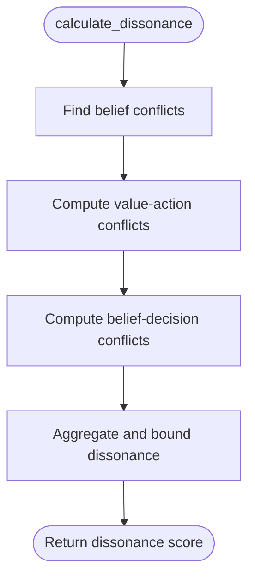
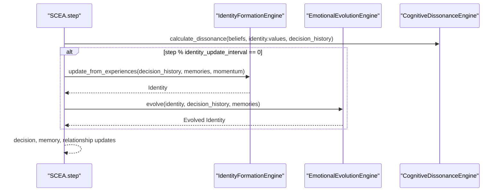
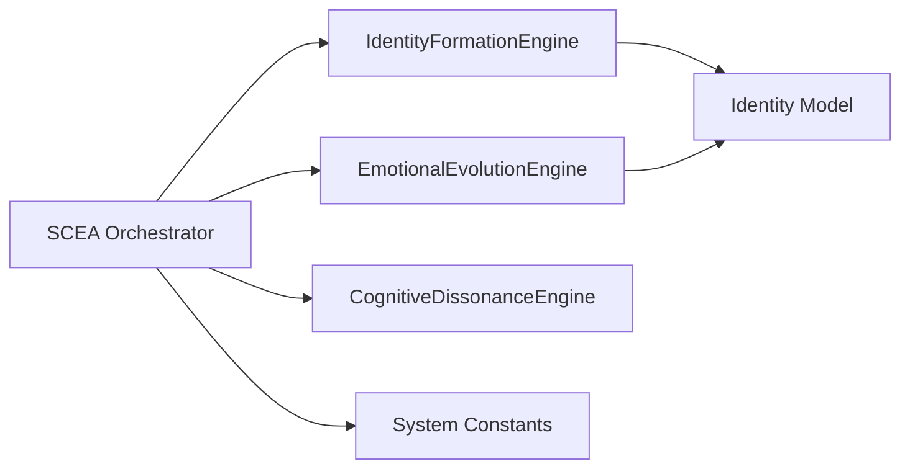

# Identity Formation

<cite>
**Referenced Files in This Document**
- [identity_system.py](file://psychologist/scea/identity_formation/identity_system.py)
- [models.py](file://psychologist/scea/core/models.py)
- [cognitive_dissonance_engine.py](file://psychologist/scea/cognitive_dissonance/cognitive_dissonance_engine.py)
- [emotional_evolution_system.py](file://psychologist/scea/emotional_evolution/emotional_evolution_system.py)
- [scea.py](file://psychologist/scea/core/scea.py)
- [system_constants.py](file://psychologist/system_constants.py)
- [test_scea.py](file://psychologist/scea/tests/test_scea.py)
</cite>

## Table of Contents
1. [Introduction](#introduction)
2. [Project Structure](#project-structure)
3. [Core Components](#core-components)
4. [Architecture Overview](#architecture-overview)
5. [Detailed Component Analysis](#detailed-component-analysis)
6. [Dependency Analysis](#dependency-analysis)
7. [Performance Considerations](#performance-considerations)
8. [Troubleshooting Guide](#troubleshooting-guide)
9. [Conclusion](#conclusion)

## Introduction
This document explains the identity formation layer of the SCEA system. It describes how the system builds and maintains a coherent sense of self across contexts and time by integrating personal memories, social roles, cultural background, and individual experiences into a unified identity model. It details mechanisms for identity consistency maintenance, role adaptation, and self-concept evolution, and shows how identity influences perception, decision-making, and social interactions within the broader SCEA framework.

## Project Structure
The identity formation layer is implemented as part of the SCEA cognitive architecture. The key files involved are:
- Identity formation engine: constructs and updates the identity model from decisions, memories, and emotional patterns.
- Core models: define the Identity, Value, DecisionRecord, and Memory data structures.
- Cognitive dissonance engine: measures and resolves inconsistencies between beliefs/values/actions.
- Emotional evolution engine: evolves identity traits and values over time with controlled mutation.
- SCEA orchestrator: coordinates periodic identity updates and integrates identity into higher-level cognition.

**Diagram sources**
- [identity_system.py:1-106](file://psychologist/scea/identity_formation/identity_system.py#L1-L106)
- [models.py:127-133](file://psychologist/scea/core/models.py#L127-L133)
- [emotional_evolution_system.py:1-80](file://psychologist/scea/emotional_evolution/emotional_evolution_system.py#L1-L80)
- [scea.py:1-250](file://psychologist/scea/core/scea.py#L1-L250)
- [cognitive_dissonance_engine.py:1-99](file://psychologist/scea/cognitive_dissonance/cognitive_dissonance_engine.py#L1-L99)
- [system_constants.py:48-61](file://psychologist/system_constants.py#L48-L61)

**Section sources**
- [identity_system.py:1-106](file://psychologist/scea/identity_formation/identity_system.py#L1-L106)
- [models.py:127-133](file://psychologist/scea/core/models.py#L127-L133)
- [scea.py:148-158](file://psychologist/scea/core/scea.py#L148-L158)
- [system_constants.py:48-61](file://psychologist/system_constants.py#L48-L61)

## Core Components
- IdentityFormationEngine: Updates self-image traits, values, preferences, and consistency metrics based on recent decisions, memories, and emotional patterns.
- Identity model: Holds self-image traits, values, preferences, consistency score, and self-confidence.
- EmotionalEvolutionEngine: Evolves identity characteristics with reinforcement from decisions and memories, and applies random mutations to maintain adaptability.
- CognitiveDissonanceEngine: Computes dissonance from belief conflicts, value-action mismatches, and belief-decision contradictions, and proposes resolutions.
- SCEA orchestrator: Periodically invokes identity updates and integrates identity into decision-making, memory encoding, and social interaction.

Key behaviors:
- Self-image updates blend recent decision evaluations with smoothing to maintain stability while reflecting growth.
- Values strengthen when consistently activated by decisions and weaken otherwise, tracked with history buffers.
- Preferences form around topics, activities, and interaction types weighted by emotional valence.
- Consistency and self-confidence derive from value history stability and current value distribution.
- Evolution introduces small random changes to prevent rigidity while reinforcing successful patterns.

**Section sources**
- [identity_system.py:21-106](file://psychologist/scea/identity_formation/identity_system.py#L21-L106)
- [models.py:127-133](file://psychologist/scea/core/models.py#L127-L133)
- [emotional_evolution_system.py:11-80](file://psychologist/scea/emotional_evolution/emotional_evolution_system.py#L11-L80)
- [cognitive_dissonance_engine.py:11-37](file://psychologist/scea/cognitive_dissonance/cognitive_dissonance_engine.py#L11-L37)
- [scea.py:148-158](file://psychologist/scea/core/scea.py#L148-L158)

## Architecture Overview
The identity formation layer participates in the SCEA loop as follows:
- At each step, the orchestrator collects recent decisions and memories and passes them to the identity engine.
- The identity engine updates self-image, values, preferences, and consistency.
- The emotional evolution engine then evolves identity characteristics.
- The resulting identity informs decision-making, memory importance weighting, and social interactions.

**Diagram sources**
- [scea.py:148-158](file://psychologist/scea/core/scea.py#L148-L158)
- [identity_system.py:21-31](file://psychologist/scea/identity_formation/identity_system.py#L21-L31)
- [emotional_evolution_system.py:11-35](file://psychologist/scea/emotional_evolution/emotional_evolution_system.py#L11-L35)

## Detailed Component Analysis

### IdentityFormationEngine
Responsibilities:
- Initialize default values and self-image traits.
- Update self-image from decision evaluations and content keywords.
- Reinforce or devalue values based on decision activation frequency and evaluation scores.
- Build preferences from memory contexts weighted by emotional valence.
- Compute consistency and self-confidence from value histories.

Processing logic highlights:
- Self-image smoothing: recent trait activations increase trait scores with temporal discounting.
- Value importance: frequent activation increases importance; prolonged absence slightly decreases it; history buffers cap growth.
- Preference accumulation: recent memories increase preference weights for topics/activities/interaction types, biased by valence.
- Consistency: derived from recent changes in value importance history; self-confidence correlates with proportion of strong values.

**Diagram sources**
- [identity_system.py:21-106](file://psychologist/scea/identity_formation/identity_system.py#L21-L106)

**Section sources**
- [identity_system.py:11-106](file://psychologist/scea/identity_formation/identity_system.py#L11-L106)

### Identity Model
Structure:
- self_image: numeric traits representing self-perception (e.g., brave, kind, curious, persistent, creative).
- values: list of Value items with name, importance, consistency, and history.
- preferences: dictionary keyed by categories (e.g., topic/activity/interaction_type) with associated weighted preferences.
- consistency_score and self_confidence: derived metrics indicating coherence and self-assurance.

**Diagram sources**
- [models.py:127-133](file://psychologist/scea/core/models.py#L127-L133)
- [models.py:119-124](file://psychologist/scea/core/models.py#L119-L124)

**Section sources**
- [models.py:127-133](file://psychologist/scea/core/models.py#L127-L133)

### EmotionalEvolutionEngine
Responsibilities:
- Copy current identity state.
- Reinforce values and self-image traits based on recent decision success/failure and positive/negative memory valence.
- Apply small random mutations to traits and values to encourage exploration and adaptation.

Mechanisms:
- Value evolution: net positive outcomes increase importance; net negative outcomes decrease it.
- Self-image evolution: positive associations strengthen traits; negative associations weaken them.
- Mutation: probabilistic small perturbations preserve diversity and prevent local optima.

**Diagram sources**
- [emotional_evolution_system.py:11-80](file://psychologist/scea/emotional_evolution/emotional_evolution_system.py#L11-L80)

**Section sources**
- [emotional_evolution_system.py:11-80](file://psychologist/scea/emotional_evolution/emotional_evolution_system.py#L11-L80)

### Cognitive Dissonance Integration
Role:
- Measures inconsistency among beliefs, values, and actions.
- Provides feedback that can influence identity updates and decision evaluation.

Computation:
- Belief conflicts, value-action conflicts, and belief-decision conflicts contribute to a normalized dissonance score.
- Resolutions include adjusting belief confidence and seeking supporting evidence.

**Diagram sources**
- [cognitive_dissonance_engine.py:11-37](file://psychologist/scea/cognitive_dissonance/cognitive_dissonance_engine.py#L11-L37)

**Section sources**
- [cognitive_dissonance_engine.py:11-99](file://psychologist/scea/cognitive_dissonance/cognitive_dissonance_engine.py#L11-L99)

### SCEA Orchestrator Integration
Integration points:
- Periodic identity updates occur at intervals defined by system constants.
- Identity feeds into decision-making priorities, memory importance weighting, and social interaction dynamics.
- Cognitive dissonance is computed using identity values and decision history.

**Diagram sources**
- [scea.py:61-184](file://psychologist/scea/core/scea.py#L61-L184)
- [scea.py:148-158](file://psychologist/scea/core/scea.py#L148-L158)
- [system_constants.py:56-57](file://psychologist/system_constants.py#L56-L57)

**Section sources**
- [scea.py:61-184](file://psychologist/scea/core/scea.py#L61-L184)
- [system_constants.py:56-57](file://psychologist/system_constants.py#L56-L57)

## Dependency Analysis
- IdentityFormationEngine depends on the Identity model and operates on DecisionRecord and Memory collections.
- EmotionalEvolutionEngine depends on Identity and DecisionRecord/Memory streams.
- SCEA orchestrator composes all engines and controls update cadence via system constants.
- CognitiveDissonanceEngine collaborates with Identity values and DecisionRecord context to compute dissonance.

**Diagram sources**
- [scea.py:30-46](file://psychologist/scea/core/scea.py#L30-L46)
- [identity_system.py:1-2](file://psychologist/scea/identity_formation/identity_system.py#L1-L2)
- [emotional_evolution_system.py:1-2](file://psychologist/scea/emotional_evolution/emotional_evolution_system.py#L1-L2)
- [cognitive_dissonance_engine.py:1-2](file://psychologist/scea/cognitive_dissonance/cognitive_dissonance_engine.py#L1-L2)
- [system_constants.py:48-61](file://psychologist/system_constants.py#L48-L61)

**Section sources**
- [scea.py:30-46](file://psychologist/scea/core/scea.py#L30-L46)
- [identity_system.py:1-2](file://psychologist/scea/identity_formation/identity_system.py#L1-L2)
- [emotional_evolution_system.py:1-2](file://psychologist/scea/emotional_evolution/emotional_evolution_system.py#L1-L2)
- [cognitive_dissonance_engine.py:1-2](file://psychologist/scea/cognitive_dissonance/cognitive_dissonance_engine.py#L1-L2)
- [system_constants.py:48-61](file://psychologist/system_constants.py#L48-L61)

## Performance Considerations
- Update cadence: Identity updates occur every fixed interval to balance responsiveness with computational cost.
- History limits: Recent windows (decisions, memories, value histories) constrain recomputation costs.
- Smoothing and discounting: Weight recent signals more heavily to reduce drift while maintaining sensitivity.
- Random mutations: Low-probability changes prevent stagnation without heavy overhead.

[No sources needed since this section provides general guidance]

## Troubleshooting Guide
Common issues and checks:
- Identity not updating: Verify the step counter modulo identity update interval and that decision/history/memory buffers are populated.
- Values not changing: Confirm decision evaluation scores and context keywords; check that recent decision counts exceed thresholds.
- Self-image stuck: Ensure memory valence signals are present; confirm trait activation keywords appear in decision content.
- Dissonance spikes: Review recent conflicting beliefs, value violations, or contradictory decisions; apply suggested resolutions.

Validation references:
- Identity update invocation and periodicity.
- Decision history and memory limits.
- Value importance thresholds and history buffer sizes.

**Section sources**
- [scea.py:148-158](file://psychologist/scea/core/scea.py#L148-L158)
- [system_constants.py:50-61](file://psychologist/system_constants.py#L50-L61)
- [identity_system.py:60-77](file://psychologist/scea/identity_formation/identity_system.py#L60-L77)
- [cognitive_dissonance_engine.py:11-37](file://psychologist/scea/cognitive_dissonance/cognitive_dissonance_engine.py#L11-L37)

## Conclusion
The identity formation layer synthesizes personal experiences, values, and emotional patterns into a dynamic, evolving self-model. Through periodic updates, consistency monitoring, and evolutionary mechanisms, it sustains coherence across contexts while enabling growth and adaptation. Integrated with dissonance computation and the broader SCEA pipeline, identity shapes perception, decision-making, and social interactions, forming a robust foundation for self-aware, adaptive behavior.