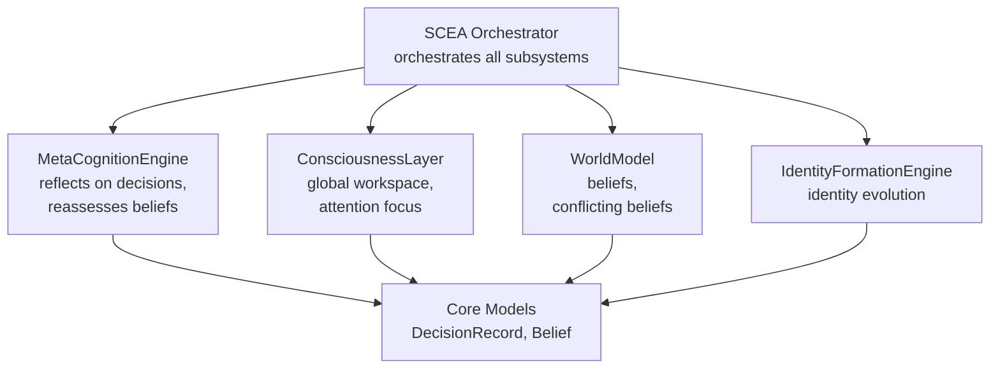
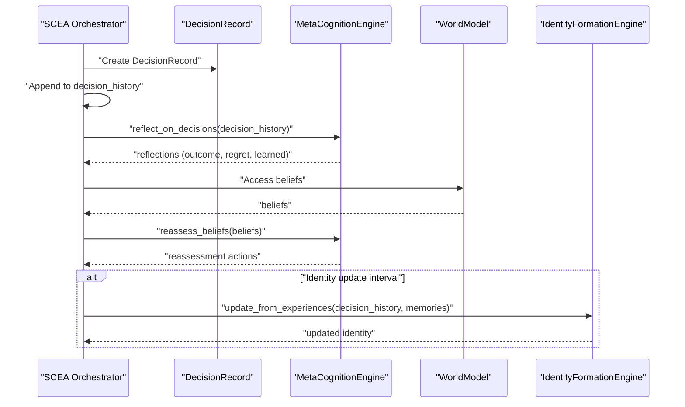
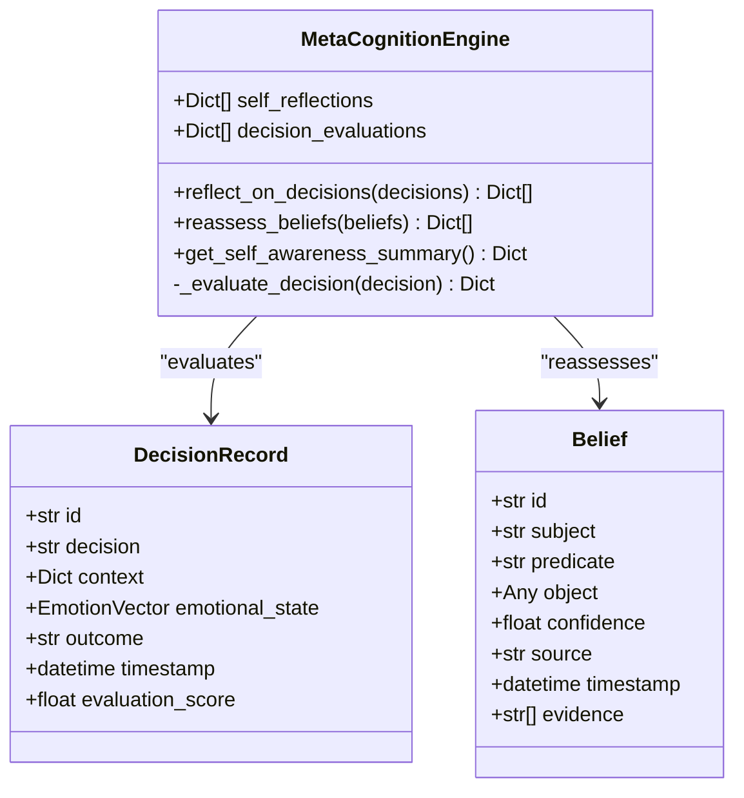
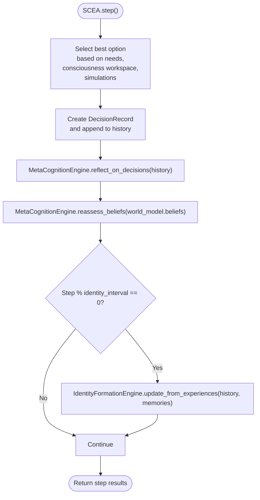
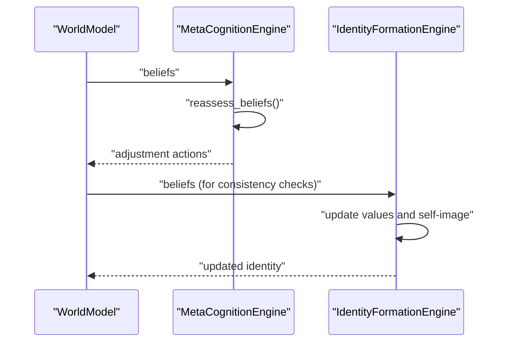
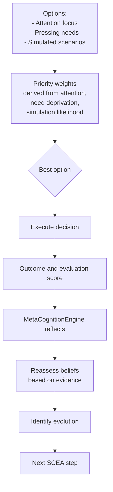
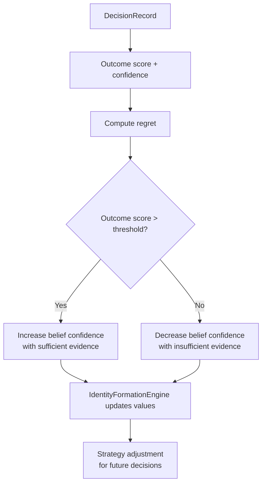
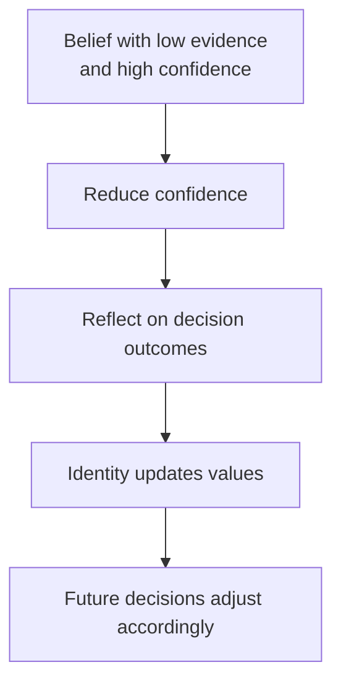
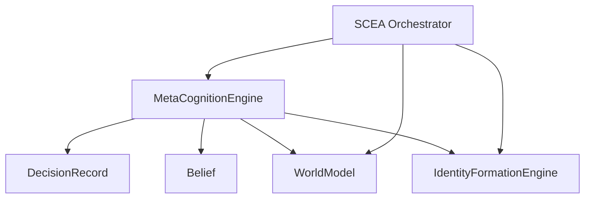

# Meta-Cognition

<cite>
**Referenced Files in This Document**
- [meta_cognition_system.py](file://psychologist/scea/meta_cognition/meta_cognition_system.py)
- [scea.py](file://psychologist/scea/core/scea.py)
- [models.py](file://psychologist/scea/core/models.py)
- [consciousness_system.py](file://psychologist/scea/consciousness_layer/consciousness_system.py)
- [world_model_system.py](file://psychologist/scea/world_model/world_model_system.py)
- [identity_system.py](file://psychologist/scea/identity_formation/identity_system.py)
- [system_constants.py](file://psychologist/system_constants.py)
- [README.md](file://psychologist/README.md)
</cite>

## Table of Contents
1. [Introduction](#introduction)
2. [Project Structure](#project-structure)
3. [Core Components](#core-components)
4. [Architecture Overview](#architecture-overview)
5. [Detailed Component Analysis](#detailed-component-analysis)
6. [Dependency Analysis](#dependency-analysis)
7. [Performance Considerations](#performance-considerations)
8. [Troubleshooting Guide](#troubleshooting-guide)
9. [Conclusion](#conclusion)
10. [Appendices](#appendices)

## Introduction
This document explains the meta-cognition system within the Self-Cognitive & Emotional Architecture (SCEA). It focuses on how the system models thinking about thinking, self-reflection, and cognitive awareness. It documents mechanisms for metacognitive monitoring, evaluation, and regulation of mental processes, including recursive thinking patterns, belief about beliefs, and cognitive flexibility. It also covers learning from experience, strategy adjustment, and intellectual humility, and illustrates how meta-cognition influences problem-solving approaches, learning efficiency, and adaptive behavior in complex interaction scenarios.

## Project Structure
The meta-cognition system is part of the SCEA architecture and integrates with other cognitive systems:
- MetaCognitionEngine: central module for self-reflection and belief reassessment
- SCEA orchestrator: coordinates all subsystems and invokes meta-cognition during each step
- Core models: DecisionRecord, Belief, EmotionVector define the data structures used by meta-cognition
- ConsciousnessLayer: provides workspace contents that inform decision-making and reflection
- WorldModel: maintains beliefs and environment state that influence meta-cognitive evaluations
- IdentityFormationEngine: evolves identity based on reflective insights and learning

**Diagram sources**
- [scea.py:30-46](file://psychologist/scea/core/scea.py#L30-L46)
- [meta_cognition_system.py:5-26](file://psychologist/scea/meta_cognition/meta_cognition_system.py#L5-L26)
- [consciousness_system.py:6-55](file://psychologist/scea/consciousness_layer/consciousness_system.py#L6-L55)
- [world_model_system.py:5-81](file://psychologist/scea/world_model/world_model_system.py#L5-L81)
- [identity_system.py:6-31](file://psychologist/scea/identity_formation/identity_system.py#L6-L31)
- [models.py:72-144](file://psychologist/scea/core/models.py#L72-L144)

**Section sources**
- [README.md:92-106](file://psychologist/README.md#L92-L106)
- [scea.py:30-46](file://psychologist/scea/core/scea.py#L30-L46)

## Core Components
- MetaCognitionEngine: Provides self-reflection on decisions, evaluates outcomes and confidence, and reassesses beliefs based on evidence and confidence thresholds. It also computes a self-awareness summary.
- SCEA orchestrator: Integrates meta-cognition into the decision loop, invoking reflection after each decision and periodically updating identity and emotional evolution.
- Core models: DecisionRecord captures decision context and outcomes; Belief encapsulates propositional knowledge with confidence and evidence; EmotionVector supplies emotional context for evaluations.
- ConsciousnessLayer: Supplies workspace contents and attention focus that guide decision selection and reflection.
- WorldModel: Maintains beliefs and environment state; conflicts among beliefs trigger meta-cognitive reassessment.
- IdentityFormationEngine: Evolves identity over time using reflective insights and learning patterns.

**Section sources**
- [meta_cognition_system.py:5-77](file://psychologist/scea/meta_cognition/meta_cognition_system.py#L5-L77)
- [scea.py:61-184](file://psychologist/scea/core/scea.py#L61-L184)
- [models.py:72-144](file://psychologist/scea/core/models.py#L72-L144)
- [consciousness_system.py:12-55](file://psychologist/scea/consciousness_layer/consciousness_system.py#L12-L55)
- [world_model_system.py:5-81](file://psychologist/scea/world_model/world_model_system.py#L5-L81)
- [identity_system.py:21-31](file://psychologist/scea/identity_formation/identity_system.py#L21-L31)

## Architecture Overview
The meta-cognition system participates in the SCEA decision loop:
- After a decision is made, a DecisionRecord is created and appended to decision history.
- MetaCognitionEngine reflects on recent decisions, computing outcome scores, confidence, regret, and learning indicators.
- Belief reassessment is triggered based on evidence counts and confidence levels.
- Periodically, IdentityFormationEngine updates identity using decision history and memories, incorporating reflective insights.
- Emotional evolution refines value importance based on successful or unsuccessful actions aligned with values.

**Diagram sources**
- [scea.py:123-158](file://psychologist/scea/core/scea.py#L123-L158)
- [meta_cognition_system.py:10-63](file://psychologist/scea/meta_cognition/meta_cognition_system.py#L10-L63)
- [world_model_system.py:5-81](file://psychologist/scea/world_model/world_model_system.py#L5-L81)
- [identity_system.py:21-31](file://psychologist/scea/identity_formation/identity_system.py#L21-L31)

## Detailed Component Analysis

### MetaCognitionEngine
The MetaCognitionEngine implements:
- Self-reflection on decisions: Evaluates recent decisions using outcome scores and emotional intensity to compute regret and learning indicators. Maintains bounded histories for efficient recall.
- Belief reassessment: Adjusts belief confidence based on evidence quantity and current confidence thresholds.
- Self-awareness summary: Aggregates metrics such as decision success rate, average regret, total reflections, and learning rate.

**Diagram sources**
- [meta_cognition_system.py:5-77](file://psychologist/scea/meta_cognition/meta_cognition_system.py#L5-L77)
- [models.py:136-144](file://psychologist/scea/core/models.py#L136-L144)
- [models.py:72-81](file://psychologist/scea/core/models.py#L72-L81)

**Section sources**
- [meta_cognition_system.py:10-77](file://psychologist/scea/meta_cognition/meta_cognition_system.py#L10-L77)
- [models.py:72-144](file://psychologist/scea/core/models.py#L72-L144)

### SCEA Integration and Reflection Loop
SCEA orchestrates meta-cognition within each step:
- Creates DecisionRecord after selecting an action.
- Appends to decision history and invokes MetaCognitionEngine to reflect on recent decisions.
- Reassesses beliefs against WorldModel’s belief set.
- Updates identity periodically using decision history and memories.
- Applies emotional evolution to refine value importance.

**Diagram sources**
- [scea.py:123-158](file://psychologist/scea/core/scea.py#L123-L158)
- [meta_cognition_system.py:10-63](file://psychologist/scea/meta_cognition/meta_cognition_system.py#L10-L63)
- [identity_system.py:21-31](file://psychologist/scea/identity_formation/identity_system.py#L21-L31)
- [system_constants.py:56-57](file://psychologist/system_constants.py#L56-L57)

**Section sources**
- [scea.py:61-184](file://psychologist/scea/core/scea.py#L61-L184)
- [system_constants.py:56-57](file://psychologist/system_constants.py#L56-L57)

### Recursive Thinking Patterns and Belief About Beliefs
Recursive thinking emerges from:
- Meta-cognition reflecting on past decisions and outcomes, informing future choices.
- Belief reassessment based on evidence quality and confidence, adjusting higher-order beliefs about knowledge reliability.
- ConsciousnessLayer’s global workspace prioritizing relevant contents, enabling recursive attention to conflicting or salient information.

**Diagram sources**
- [meta_cognition_system.py:43-63](file://psychologist/scea/meta_cognition/meta_cognition_system.py#L43-L63)
- [world_model_system.py:5-81](file://psychologist/scea/world_model/world_model_system.py#L5-L81)
- [identity_system.py:21-31](file://psychologist/scea/identity_formation/identity_system.py#L21-L31)

**Section sources**
- [meta_cognition_system.py:43-63](file://psychologist/scea/meta_cognition/meta_cognition_system.py#L43-L63)
- [world_model_system.py:72-81](file://psychologist/scea/world_model/world_model_system.py#L72-L81)
- [identity_system.py:93-106](file://psychologist/scea/identity_formation/identity_system.py#L93-L106)

### Cognitive Flexibility Mechanisms
Cognitive flexibility manifests as:
- Dynamic weighting of options: Decisions combine attention focus, pressing needs, and simulated scenarios, allowing adaptation to changing contexts.
- Evidence-driven belief adjustments: Confidence is increased or decreased based on evidence counts and prior confidence, promoting intellectual humility and openness to revision.
- Identity evolution: Values and self-image evolve according to successful or unsuccessful actions, encouraging adaptability and growth.

**Diagram sources**
- [scea.py:186-223](file://psychologist/scea/core/scea.py#L186-L223)
- [meta_cognition_system.py:28-41](file://psychologist/scea/meta_cognition/meta_cognition_system.py#L28-L41)
- [identity_system.py:60-77](file://psychologist/scea/identity_formation/identity_system.py#L60-L77)

**Section sources**
- [scea.py:186-223](file://psychologist/scea/core/scea.py#L186-L223)
- [meta_cognition_system.py:43-63](file://psychologist/scea/meta_cognition/meta_cognition_system.py#L43-L63)
- [identity_system.py:60-77](file://psychologist/scea/identity_formation/identity_system.py#L60-L77)

### Learning from Experience and Strategy Adjustment
Learning from experience occurs through:
- Outcome scoring and regret computation: Decisions are evaluated to derive learning indicators and regret measures.
- Evidence-based belief updates: Confidence is adjusted based on the amount and strength of evidence.
- Identity and value evolution: Successful actions reinforce values; unsuccessful ones prompt recalibration, guiding future strategies.

**Diagram sources**
- [meta_cognition_system.py:28-63](file://psychologist/scea/meta_cognition/meta_cognition_system.py#L28-L63)
- [identity_system.py:60-77](file://psychologist/scea/identity_formation/identity_system.py#L60-L77)

**Section sources**
- [meta_cognition_system.py:28-63](file://psychologist/scea/meta_cognition/meta_cognition_system.py#L28-L63)
- [identity_system.py:60-77](file://psychologist/scea/identity_formation/identity_system.py#L60-L77)

### Intellectual Humility
Intellectual humility is embedded in:
- Insufficient evidence leads to reduced confidence in beliefs.
- Lack of strong evidence combined with high prior confidence triggers reduction to acknowledge uncertainty.
- Identity evolution lowers value importance when actions fail to align with those values, preventing rigid adherence to outdated strategies.

**Diagram sources**
- [meta_cognition_system.py:47-53](file://psychologist/scea/meta_cognition/meta_cognition_system.py#L47-L53)
- [identity_system.py:69-72](file://psychologist/scea/identity_formation/identity_system.py#L69-L72)

**Section sources**
- [meta_cognition_system.py:47-53](file://psychologist/scea/meta_cognition/meta_cognition_system.py#L47-L53)
- [identity_system.py:69-72](file://psychologist/scea/identity_formation/identity_system.py#L69-L72)

### Influence on Problem-Solving, Learning Efficiency, and Adaptive Behavior
- Problem-solving: Meta-cognition identifies regrettable outcomes and reassesses beliefs, reducing cognitive dissonance and improving alignment between beliefs, identity, and decisions.
- Learning efficiency: Outcome-based learning and evidence-driven confidence adjustments accelerate convergence to effective strategies while maintaining intellectual humility.
- Adaptive behavior: Periodic identity updates and value evolution enable flexible responses to changing contexts, integrating emotional momentum and environmental feedback.

**Section sources**
- [scea.py:93-158](file://psychologist/scea/core/scea.py#L93-L158)
- [meta_cognition_system.py:65-77](file://psychologist/scea/meta_cognition/meta_cognition_system.py#L65-L77)
- [identity_system.py:93-106](file://psychologist/scea/identity_formation/identity_system.py#L93-L106)

## Dependency Analysis
The MetaCognitionEngine depends on core models and interacts with other SCEA subsystems:
- Depends on DecisionRecord and Belief for evaluation and reassessment.
- Interacts with WorldModel for belief data and potential conflicts.
- Works with ConsciousnessLayer indirectly through decision selection and reflection.
- Coordinates with IdentityFormationEngine for identity evolution and value refinement.

**Diagram sources**
- [meta_cognition_system.py:1-2](file://psychologist/scea/meta_cognition/meta_cognition_system.py#L1-L2)
- [models.py:72-144](file://psychologist/scea/core/models.py#L72-L144)
- [scea.py:30-46](file://psychologist/scea/core/scea.py#L30-L46)

**Section sources**
- [meta_cognition_system.py:1-2](file://psychologist/scea/meta_cognition/meta_cognition_system.py#L1-L2)
- [models.py:72-144](file://psychologist/scea/core/models.py#L72-L144)
- [scea.py:30-46](file://psychologist/scea/core/scea.py#L30-L46)

## Performance Considerations
- History limits: Meta-cognition maintains bounded histories for decision evaluations and self-reflections to control memory usage and computational overhead.
- Evidence thresholds: Belief reassessment uses simple thresholds to avoid expensive computations while still enabling dynamic adjustments.
- Identity update intervals: Identity updates occur periodically to balance responsiveness with computational cost.

**Section sources**
- [meta_cognition_system.py:19-24](file://psychologist/scea/meta_cognition/meta_cognition_system.py#L19-L24)
- [system_constants.py:50-60](file://psychologist/system_constants.py#L50-L60)

## Troubleshooting Guide
- No reflections returned: Ensure decision history is populated; meta-cognition only reflects on recent decisions.
- Belief reassessment inactive: Verify that beliefs have sufficient evidence and confidence values fall within the thresholds.
- Identity not updating: Confirm that the step count meets the identity update interval and that decision history and memories are present.
- Self-awareness summary empty: The summary requires at least one decision evaluation.

**Section sources**
- [meta_cognition_system.py:65-77](file://psychologist/scea/meta_cognition/meta_cognition_system.py#L65-L77)
- [system_constants.py:56-57](file://psychologist/system_constants.py#L56-L57)

## Conclusion
The meta-cognition system in SCEA enables recursive thinking about thinking by reflecting on decisions, evaluating outcomes and confidence, and reassessing beliefs based on evidence. It promotes cognitive flexibility, learning from experience, and intellectual humility, while influencing problem-solving approaches, learning efficiency, and adaptive behavior. Through periodic identity updates and value evolution, the system balances stability and growth, supporting long-term psychological resilience and coherent action.

## Appendices
- Example scenarios:
  - A decision with high regret and low outcome score triggers increased caution and evidence-gathering before subsequent actions.
  - Belief confidence decreases when evidence is sparse, prompting exploration and hypothesis testing.
  - Identity evolution strengthens values aligned with successful actions and reduces emphasis on values that lead to poor outcomes.