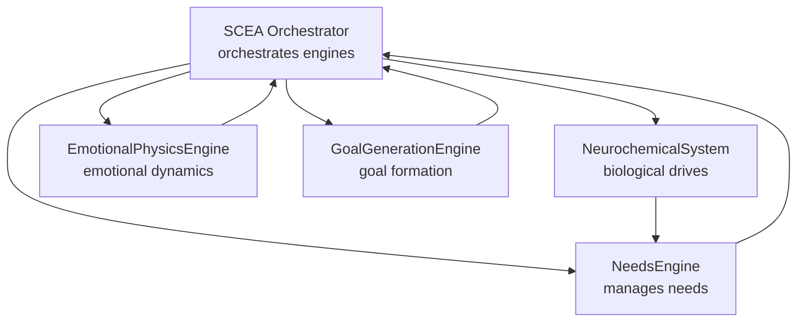
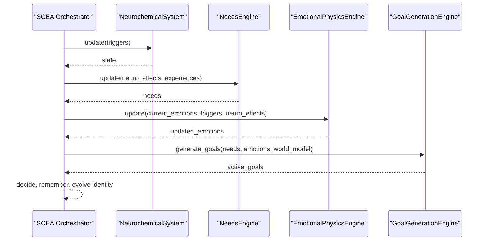
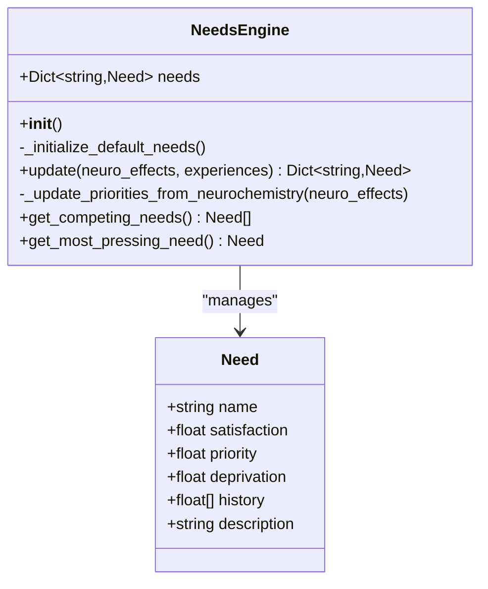
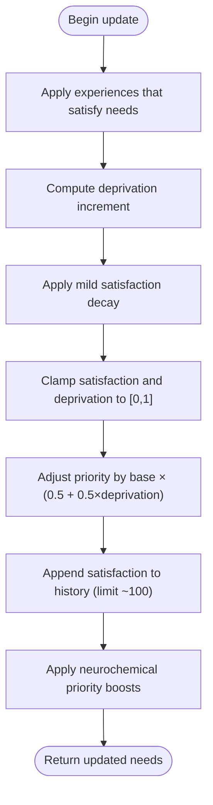
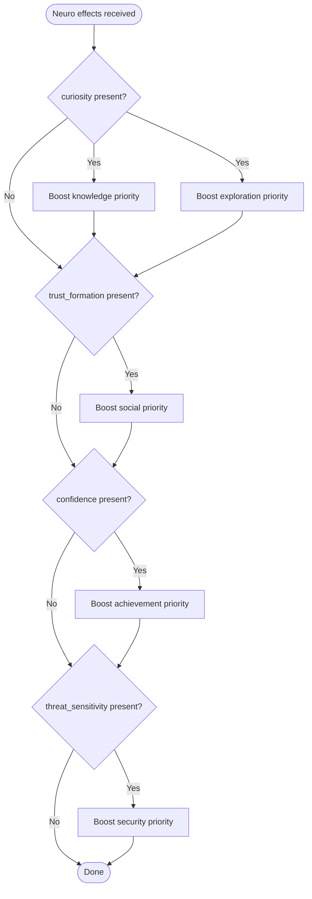
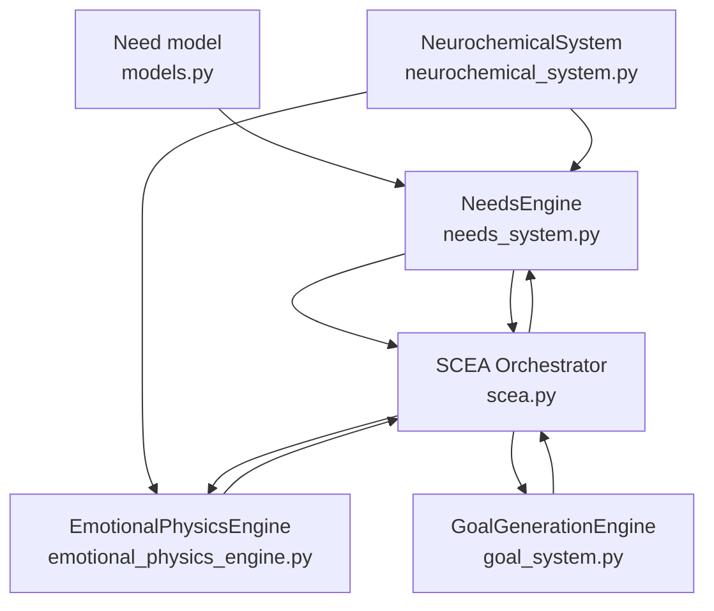

# Needs Engine

<cite>
**Referenced Files in This Document**
- [needs_system.py](file://psychologist/scea/needs_engine/needs_system.py)
- [models.py](file://psychologist/scea/core/models.py)
- [scea.py](file://psychologist/scea/core/scea.py)
- [neurochemical_system.py](file://psychologist/scea/neurochemistry/neurochemical_system.py)
- [emotional_physics_engine.py](file://psychologist/scea/emotional_physics/emotional_physics_engine.py)
- [goal_system.py](file://psychologist/scea/goal_generation/goal_system.py)
- [system_constants.py](file://psychologist/system_constants.py)
</cite>

## Table of Contents
1. [Introduction](#introduction)
2. [Project Structure](#project-structure)
3. [Core Components](#core-components)
4. [Architecture Overview](#architecture-overview)
5. [Detailed Component Analysis](#detailed-component-analysis)
6. [Dependency Analysis](#dependency-analysis)
7. [Performance Considerations](#performance-considerations)
8. [Troubleshooting Guide](#troubleshooting-guide)
9. [Conclusion](#conclusion)

## Introduction
This document explains the needs engine component of the SCEA (Self-Cognitive & Emotional Architecture) system. It details how the system models human-like needs, simulates biological drives via neurochemical effects, and captures psychological motivations. The documentation covers need fulfillment algorithms, priority ranking mechanisms, satisfaction calculation methods, and the integration between physiological needs and psychological needs. It also describes dynamic adjustments based on neurochemical states and environmental factors, and illustrates how unmet needs influence emotional states, decision-making, and long-term behavioral patterns.

## Project Structure
The needs engine resides within the SCEA subsystem and interacts with neurochemistry, emotion physics, and goal generation engines. The core data model for needs is defined centrally and consumed by the needs engine and higher-level orchestration.

**Diagram sources**
- [scea.py:30-46](file://psychologist/scea/core/scea.py#L30-L46)
- [needs_system.py:6-9](file://psychologist/scea/needs_engine/needs_system.py#L6-L9)
- [neurochemical_system.py:6-11](file://psychologist/scea/neurochemistry/neurochemical_system.py#L6-L11)
- [emotional_physics_engine.py:7-11](file://psychologist/scea/emotional_physics/emotional_physics_engine.py#L7-L11)
- [goal_system.py:6-10](file://psychologist/scea/goal_generation/goal_system.py#L6-L10)

**Section sources**
- [scea.py:30-46](file://psychologist/scea/core/scea.py#L30-L46)
- [models.py:61-68](file://psychologist/scea/core/models.py#L61-L68)

## Core Components
- NeedsEngine: Maintains a set of named needs, tracks satisfaction and deprivation, computes priorities, and integrates neurochemical effects.
- Need data model: Encapsulates name, satisfaction, priority, deprivation, history, and description.
- SCEA orchestrator: Drives the needs engine and integrates outputs into decisions and memory.

Key responsibilities:
- Initialize default needs with baseline satisfaction and priority values.
- Update satisfaction and deprivation over time, with bounded limits.
- Adjust need priorities dynamically based on deprivation and neurochemical effects.
- Expose the most pressing need and top competing needs for decision-making.

**Section sources**
- [needs_system.py:6-99](file://psychologist/scea/needs_engine/needs_system.py#L6-L99)
- [models.py:61-68](file://psychologist/scea/core/models.py#L61-L68)
- [scea.py:61-72](file://psychologist/scea/core/scea.py#L61-L72)

## Architecture Overview
The needs engine participates in the SCEA step loop. It receives neurochemical effects and experiences, updates need states, and exposes prioritized needs to the decision-making process.

**Diagram sources**
- [scea.py:61-104](file://psychologist/scea/core/scea.py#L61-L104)
- [neurochemical_system.py:12-92](file://psychologist/scea/neurochemistry/neurochemical_system.py#L12-L92)
- [needs_system.py:73-99](file://psychologist/scea/needs_engine/needs_system.py#L73-L99)
- [emotional_physics_engine.py:12-41](file://psychologist/scea/emotional_physics/emotional_physics_engine.py#L12-L41)
- [goal_system.py:39-76](file://psychologist/scea/goal_generation/goal_system.py#L39-L76)

## Detailed Component Analysis

### NeedsEngine: Data Model and Dynamics
The Need dataclass defines the internal state of each need. The NeedsEngine maintains a dictionary of needs keyed by name and applies updates each cycle.

**Diagram sources**
- [models.py:61-68](file://psychologist/scea/core/models.py#L61-L68)
- [needs_system.py:6-99](file://psychologist/scea/needs_engine/needs_system.py#L6-L99)

#### Satisfaction and Deprivation Calculation
- Satisfaction decays slightly each step and increases when experiences indicate need satisfaction.
- Deprivation accumulates based on the gap between current satisfaction and perfect satisfaction.
- Both satisfaction and deprivation are clamped to [0, 1].

**Diagram sources**
- [needs_system.py:73-99](file://psychologist/scea/needs_engine/needs_system.py#L73-L99)

**Section sources**
- [needs_system.py:73-99](file://psychologist/scea/needs_engine/needs_system.py#L73-L99)

#### Priority Ranking Mechanism
- Base priority is modulated by deprivation: higher deprivation increases effective priority.
- The engine exposes:
  - Most pressing need: the single need with highest priority×(1+deprivation).
  - Competing needs: top three needs by the same metric.

These ranked needs drive decision-making and goal generation.

**Section sources**
- [needs_system.py:125-137](file://psychologist/scea/needs_engine/needs_system.py#L125-L137)

#### Integration with Neurochemical Effects
The needs engine responds to neurochemical effects produced by the NeurochemicalSystem. These effects can increase need priorities for curiosity, trust, confidence, and threat sensitivity.

**Diagram sources**
- [needs_system.py:101-123](file://psychologist/scea/needs_engine/needs_system.py#L101-L123)

**Section sources**
- [needs_system.py:101-123](file://psychologist/scea/needs_engine/needs_system.py#L101-L123)

#### Experiences and Need Fulfillment
Experiences can directly increase a need’s satisfaction. The system accepts structured experience events indicating which need was satisfied and by how much.

- Example experience event keys:
  - satisfy_need: name of the need to increase
  - amount: optional magnitude of increase (default small)

The engine clamps satisfaction to [0, 1] after applying experience effects.

**Section sources**
- [needs_system.py:74-81](file://psychologist/scea/needs_engine/needs_system.py#L74-L81)

### Neurochemical System: Biological Drives
The NeurochemicalSystem simulates neurotransmitter levels and derives psychological effects. These effects feed into the needs engine and emotional physics.

Representative effects include:
- reward_expectation, curiosity, exploration_drive
- stability, satisfaction, confidence
- trust_formation, attachment, cooperation
- stress_level, threat_sensitivity, risk_aversion
- urgency, reactivity, defensive_drive

The system applies triggers (e.g., rewards, threats, social connections) and returns a bounded set of effect magnitudes.

**Section sources**
- [neurochemical_system.py:12-111](file://psychologist/scea/neurochemistry/neurochemical_system.py#L12-L111)

### Emotional Physics: Psychological Motivations
The EmotionalPhysicsEngine transforms triggers and neurochemical effects into emotional states. It applies momentum, decay, and resonance to produce coherent emotional dynamics.

- Triggers map to emotion increments (e.g., achievement → joy, pride, trust).
- Neuro effects modulate emotions (e.g., reward expectation → boost on joy, anticipation, curiosity).
- Momentum preserves emotional persistence across cycles.
- Resonance links related emotions (e.g., joy ↔ trust).

These emotional states influence goal generation and decision-making.

**Section sources**
- [emotional_physics_engine.py:12-127](file://psychologist/scea/emotional_physics/emotional_physics_engine.py#L12-L127)

### Goal Generation: Linking Needs to Action
The GoalGenerationEngine creates goals aligned with pressing needs and emotional drivers. It selects the top needs by priority×(1+deprivation), generates goal descriptions from templates, and manages active goals.

- Templates vary by need type (knowledge, social, achievement, exploration, stability).
- Goals are deduplicated and pruned to a manageable set.
- Progress advances over time; completed goals are tracked separately.

**Section sources**
- [goal_system.py:39-138](file://psychologist/scea/goal_generation/goal_system.py#L39-L138)

### Decision-Making: From Needs to Actions
The SCEA orchestrator aggregates needs, emotions, and goals to select the next action. Options include:
- Focus on items in consciousness workspace
- Work on satisfying the most pressing need
- Pursue the best simulated scenario

The decision with the highest priority becomes the chosen action.

**Section sources**
- [scea.py:186-223](file://psychologist/scea/core/scea.py#L186-L223)

## Dependency Analysis
The needs engine depends on the Need model and integrates with neurochemical and emotional systems. The SCEA orchestrator coordinates these dependencies.

**Diagram sources**
- [models.py:61-68](file://psychologist/scea/core/models.py#L61-L68)
- [needs_system.py:1-3](file://psychologist/scea/needs_engine/needs_system.py#L1-L3)
- [neurochemical_system.py:1-4](file://psychologist/scea/neurochemistry/neurochemical_system.py#L1-L4)
- [emotional_physics_engine.py:1-5](file://psychologist/scea/emotional_physics/emotional_physics_engine.py#L1-L5)
- [goal_system.py:1-4](file://psychologist/scea/goal_generation/goal_system.py#L1-L4)
- [scea.py:1-27](file://psychologist/scea/core/scea.py#L1-L27)

**Section sources**
- [scea.py:30-46](file://psychologist/scea/core/scea.py#L30-L46)
- [models.py:61-68](file://psychologist/scea/core/models.py#L61-L68)

## Performance Considerations
- Computational cost: Updates are linear in the number of needs and minimal per cycle.
- Memory footprint: Each need maintains a short history; histories are capped to approximately 100 entries.
- Stability: Satisfaction and deprivation are clamped to [0, 1], preventing runaway growth.
- Scalability: Adding new needs requires updating initialization and potentially priority modulation logic.

[No sources needed since this section provides general guidance]

## Troubleshooting Guide
Common issues and resolutions:
- Need satisfaction not changing:
  - Verify experience events include satisfy_need and optional amount.
  - Confirm update is called with neurochemical effects and experiences.

- Priorities not shifting:
  - Check that deprivation is increasing (satisfaction below 1.0) and that neurochemical effects are being passed to the needs engine.

- Most pressing need remains constant:
  - Ensure deprivation is accumulating and that priority modulation is active.

- Goals not forming:
  - Confirm that needs are below threshold and that emotions (e.g., curiosity) meet thresholds.

**Section sources**
- [needs_system.py:73-99](file://psychologist/scea/needs_engine/needs_system.py#L73-L99)
- [goal_system.py:39-76](file://psychologist/scea/goal_generation/goal_system.py#L39-L76)

## Conclusion
The needs engine provides a concise yet powerful model of human-like needs within the SCEA framework. By combining satisfaction and deprivation dynamics with neurochemical-driven priority adjustments, it enables realistic motivation and decision-making. The integration with emotional dynamics and goal generation yields coherent behavioral patterns shaped by both biological drives and psychological motivations. This foundation supports further extensions for modeling higher-order needs and long-term identity evolution.