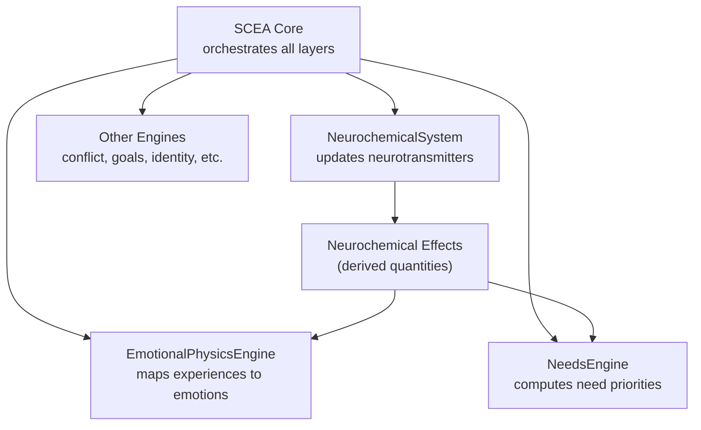
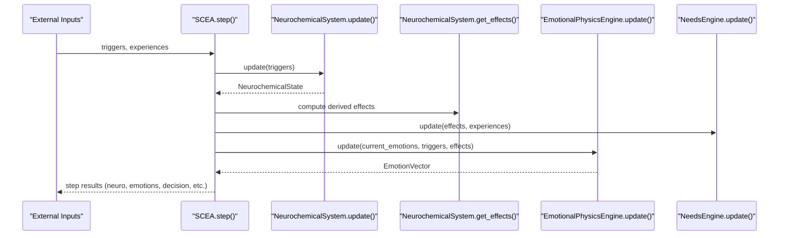
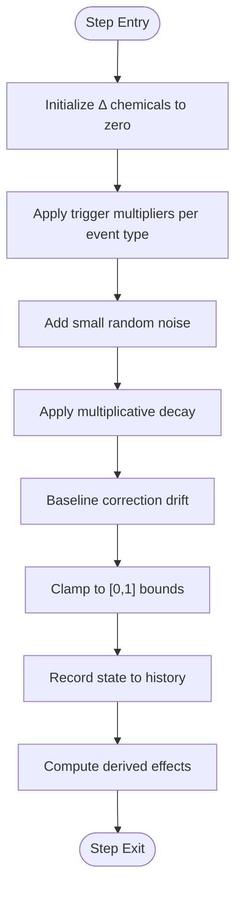
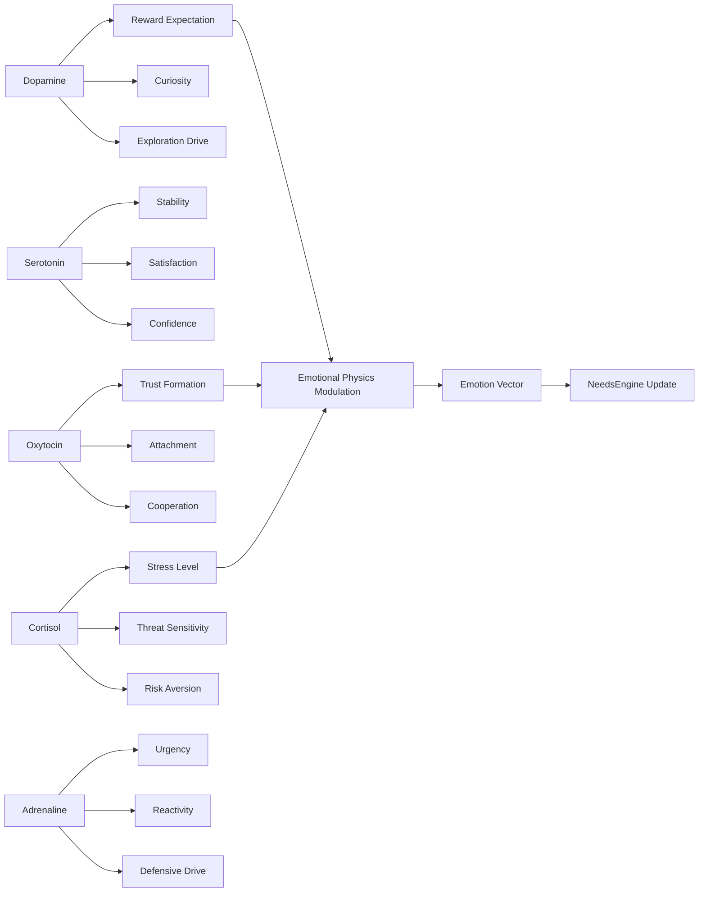
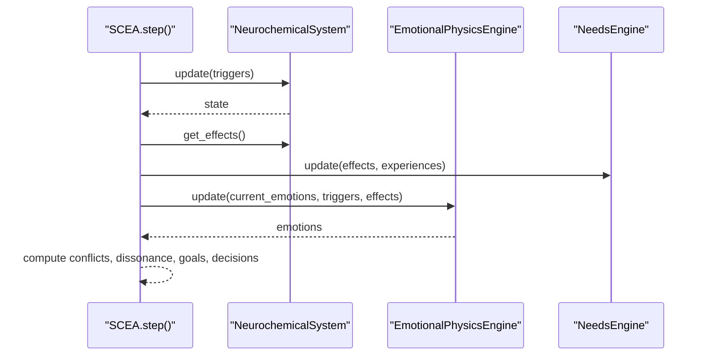
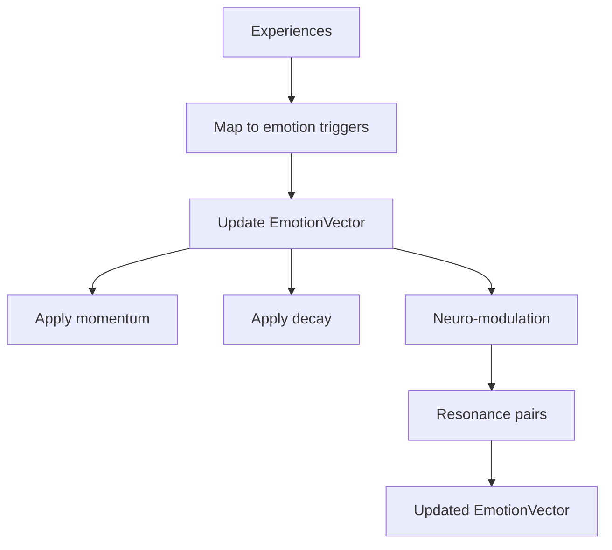
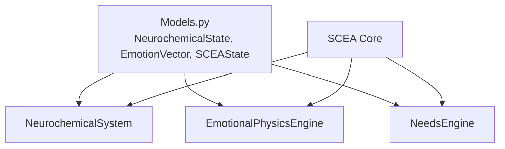

# Neurochemistry Simulation

<cite>
**Referenced Files in This Document**
- [neurochemical_system.py](file://psychologist/scea/neurochemistry/neurochemical_system.py)
- [models.py](file://psychologist/scea/core/models.py)
- [scea.py](file://psychologist/scea/core/scea.py)
- [emotional_physics_engine.py](file://psychologist/scea/emotional_physics/emotional_physics_engine.py)
- [needs_system.py](file://psychologist/scea/needs_engine/needs_system.py)
- [system_constants.py](file://psychologist/system_constants.py)
- [test_scea.py](file://psychologist/scea/tests/test_scea.py)
</cite>

## Table of Contents
1. [Introduction](#introduction)
2. [Project Structure](#project-structure)
3. [Core Components](#core-components)
4. [Architecture Overview](#architecture-overview)
5. [Detailed Component Analysis](#detailed-component-analysis)
6. [Dependency Analysis](#dependency-analysis)
7. [Performance Considerations](#performance-considerations)
8. [Troubleshooting Guide](#troubleshooting-guide)
9. [Conclusion](#conclusion)

## Introduction
This document explains the neurochemistry simulation layer of the SCEA system. It describes how neurotransmitter dynamics are modeled, how emotional states feed back into neurochemical responses, and how these biological signals influence cognition, needs, and behavior. The focus is on the mathematical formulation of dopamine, serotonin, oxytocin, and cortisol/adrenaline systems, along with feedback loops and practical implications for decision-making and behavior patterns.

## Project Structure
The neurochemistry simulation resides in the SCEA subsystem and interacts with other layers (emotions, needs, identity, and consciousness). The core files are:
- NeurochemicalSystem: Maintains and updates neurotransmitter levels and translates them into behavioral effects.
- SCEA core: Orchestrates the integration of neurochemistry with emotion physics, needs, and higher-order cognition.
- EmotionalPhysicsEngine: Translates discrete experiences into emotional states and modulates them via neurochemical effects.
- NeedsEngine: Converts neurochemical effects into need priorities and satisfaction dynamics.
- Models: Defines state containers (NeurochemicalState, EmotionVector, SCEAState) and shared types.

**Diagram sources**
- [scea.py:61-96](file://psychologist/scea/core/scea.py#L61-L96)
- [neurochemical_system.py:12-92](file://psychologist/scea/neurochemistry/neurochemical_system.py#L12-L92)
- [emotional_physics_engine.py:12-41](file://psychologist/scea/emotional_physics/emotional_physics_engine.py#L12-L41)
- [needs_system.py:73-99](file://psychologist/scea/needs_engine/needs_system.py#L73-L99)

**Section sources**
- [scea.py:30-48](file://psychologist/scea/core/scea.py#L30-L48)
- [models.py:28-35](file://psychologist/scea/core/models.py#L28-L35)

## Core Components
- NeurochemicalSystem: Implements a discrete-time dynamical system for five neurotransmitters with decay, external triggers, noise, and homeostatic correction.
- Effects mapping: Derives psychological constructs (e.g., reward expectation, curiosity, risk aversion) from neurotransmitter concentrations.
- SCEA integration: Drives the neurochemistry engine at each step, collects outputs, and feeds them into emotion and needs engines.

Key behaviors:
- Decay: Each chemical decays toward baseline at a fixed rate.
- Triggers: External events (reward, threat, achievement, etc.) induce transient changes.
- Noise: Small random fluctuations stabilize the phase space and prevent trivial fixpoints.
- Homeostasis: Slow drift back to baseline to maintain stability.
- Effects: Nonlinear mappings convert neurotransmitter levels into perceived mental states.

**Section sources**
- [neurochemical_system.py:12-111](file://psychologist/scea/neurochemistry/neurochemical_system.py#L12-L111)
- [models.py:28-35](file://psychologist/scea/core/models.py#L28-L35)

## Architecture Overview
The neurochemistry layer is invoked during each SCEA step. It updates internal states, computes derived effects, and exposes them to downstream systems.

**Diagram sources**
- [scea.py:61-96](file://psychologist/scea/core/scea.py#L61-L96)
- [neurochemical_system.py:12-111](file://psychologist/scea/neurochemistry/neurochemical_system.py#L12-L111)
- [emotional_physics_engine.py:12-41](file://psychologist/scea/emotional_physics/emotional_physics_engine.py#L12-L41)
- [needs_system.py:73-99](file://psychologist/scea/needs_engine/needs_system.py#L73-L99)

## Detailed Component Analysis

### NeurochemicalSystem
Mathematical model summary:
- State variables: dopamine, serotonin, oxytocin, cortisol, adrenaline.
- Dynamics: Each variable evolves as a noisy, decaying random walk with external additive inputs.
- Baseline correction: Slow drift toward baseline to enforce homeostasis.
- Effects: Nonlinear functions mapping neurotransmitter levels to psychological constructs.

Processing logic:
- Trigger mapping: Reward/punishment/novelty increase dopamine; stability/achievement increase serotonin; social connection/trust increase oxytocin; threat/stress increase cortisol and adrenaline; urgency increases adrenaline.
- Decay: Multiplicative decay toward zero for each chemical.
- Noise: Independent uniform noise per chemical.
- Baseline correction: Small corrective drift toward baseline for each chemical.
- History: Stores recent states for diagnostics.

Effects mapping:
- reward_expectation, curiosity, exploration_drive from dopamine.
- stability, satisfaction, confidence from serotonin.
- trust_formation, attachment, cooperation from oxytocin.
- stress_level, threat_sensitivity, risk_aversion from cortisol.
- urgency, reactivity, defensive_drive from adrenaline.

**Diagram sources**
- [neurochemical_system.py:12-92](file://psychologist/scea/neurochemistry/neurochemical_system.py#L12-L92)
- [neurochemical_system.py:94-111](file://psychologist/scea/neurochemistry/neurochemical_system.py#L94-L111)

**Section sources**
- [neurochemical_system.py:12-111](file://psychologist/scea/neurochemistry/neurochemical_system.py#L12-L111)

### Effects Mapping and Feedback Loops
Derived effects connect neurotransmitter levels to psychological states:
- Dopamine → reward expectation, curiosity, exploration drive.
- Serotonin → stability, satisfaction, confidence.
- Oxytocin → trust formation, attachment, cooperation.
- Cortisol → stress level, threat sensitivity, risk aversion.
- Adrenaline → urgency, reactivity, defensive drive.

Feedback pathways:
- Neurochemical effects influence emotion intensities (e.g., reward expectation boosts joy/anticipation; stress increases fear/anxiety; trust formation enhances prosocial emotions).
- Emotions influence needs priorities (e.g., curiosity raises knowledge/exploration; threat sensitivity raises security).
- Needs satisfaction/dissatisfaction affects future triggers and emotional responses.

**Diagram sources**
- [neurochemical_system.py:94-111](file://psychologist/scea/neurochemistry/neurochemical_system.py#L94-L111)
- [emotional_physics_engine.py:77-91](file://psychologist/scea/emotional_physics/emotional_physics_engine.py#L77-L91)
- [needs_system.py:101-123](file://psychologist/scea/needs_engine/needs_system.py#L101-L123)

**Section sources**
- [neurochemical_system.py:94-111](file://psychologist/scea/neurochemistry/neurochemical_system.py#L94-L111)
- [emotional_physics_engine.py:77-91](file://psychologist/scea/emotional_physics/emotional_physics_engine.py#L77-L91)
- [needs_system.py:101-123](file://psychologist/scea/needs_engine/needs_system.py#L101-L123)

### Integration Within SCEA
At each step:
- Neurochemistry receives triggers and returns a NeurochemicalState.
- Effects are computed and passed to EmotionalPhysicsEngine and NeedsEngine.
- EmotionalPhysicsEngine updates EmotionVector considering triggers, momentum, decay, neuro-modulation, contagion, and resonance.
- NeedsEngine updates need satisfaction, deprivation, and priorities based on neurochemical effects.
- Results are aggregated and returned to the caller.

**Diagram sources**
- [scea.py:61-96](file://psychologist/scea/core/scea.py#L61-L96)
- [emotional_physics_engine.py:12-41](file://psychologist/scea/emotional_physics/emotional_physics_engine.py#L12-L41)
- [needs_system.py:73-99](file://psychologist/scea/needs_engine/needs_system.py#L73-L99)

**Section sources**
- [scea.py:61-96](file://psychologist/scea/core/scea.py#L61-L96)

### Mathematical Models and Dynamics
- Discrete-time update: Each neurotransmitter follows a logistic-like bounded update with multiplicative decay and additive inputs.
- Trigger multipliers: Event-specific weights define how external inputs alter neurotransmitter levels.
- Noise: Uniform noise stabilizes dynamics and prevents trivial equilibria.
- Baseline correction: Small drift toward baseline enforces homeostasis.
- Effects: Linear/nonlinear functions map neurotransmitter levels to psychological constructs.

Complexity:
- Per step: O(1) updates for five chemicals plus O(1) effect computations.
- Memory: Stores up to a thousand recent states for diagnostics.

**Section sources**
- [neurochemical_system.py:12-111](file://psychologist/scea/neurochemistry/neurochemical_system.py#L12-L111)

### Feedback Between Emotions and Neurochemistry
- Emotion triggers from experiences are mapped to emotion intensities.
- Momentum preserves emotional persistence across time.
- Decay reduces residual emotional traces.
- Neuro-modulation adjusts emotion magnitudes based on neurotransmitter-derived effects.
- Contagion and resonance introduce interpersonal and intrapersonal coupling among emotions.

**Diagram sources**
- [emotional_physics_engine.py:43-126](file://psychologist/scea/emotional_physics/emotional_physics_engine.py#L43-L126)

**Section sources**
- [emotional_physics_engine.py:12-126](file://psychologist/scea/emotional_physics/emotional_physics_engine.py#L12-L126)

### Needs Engine and Cognitive Implications
- Needs are initialized with baseline satisfaction and priorities.
- Satisfaction decays slowly; deprivation accumulates when satisfaction lags behind needs.
- Priorities depend on base priority and current deprivation.
- Neurochemical effects adjust need priorities (e.g., curiosity increases knowledge/exploration; threat sensitivity increases security).

Implications:
- Chemical imbalances can shift attention toward specific needs, altering motivation and behavior.
- Persistent low dopamine may reduce curiosity and exploration; low serotonin may decrease confidence and satisfaction.
- High cortisol/adrenaline may increase risk aversion and defensive drive.

**Section sources**
- [needs_system.py:11-99](file://psychologist/scea/needs_engine/needs_system.py#L11-L99)

### Decision-Making and Behavior Patterns
- Decisions are selected from competing options: attention focus, need satisfaction, and simulated scenarios.
- Option priority considers emotional state, need pressure, and imagined outcomes.
- Memory importance is influenced by emotion intensity, guiding future behavior selection.

Examples:
- Reward experience → increased dopamine → higher reward expectation and curiosity → exploratory behavior.
- Threat experience → elevated cortisol/adrenaline → risk aversion and defensive drive → cautious behavior.
- Social connection → oxytocin rise → trust formation and cooperation → prosocial choices.
- Achievement → serotonin increase → satisfaction and confidence → sustained effort.

**Section sources**
- [scea.py:186-223](file://psychologist/scea/core/scea.py#L186-L223)
- [system_constants.py:48-60](file://psychologist/system_constants.py#L48-L60)

## Dependency Analysis
- NeurochemicalSystem depends on NeurochemicalState for state representation.
- SCEA orchestrates NeurochemicalSystem, EmotionalPhysicsEngine, and NeedsEngine.
- EmotionalPhysicsEngine depends on EmotionVector and applies mappings to emotions.
- NeedsEngine depends on Need and modifies need priorities based on neurochemical effects.

**Diagram sources**
- [models.py:28-35](file://psychologist/scea/core/models.py#L28-L35)
- [scea.py:30-48](file://psychologist/scea/core/scea.py#L30-L48)

**Section sources**
- [models.py:28-35](file://psychologist/scea/core/models.py#L28-L35)
- [scea.py:30-48](file://psychologist/scea/core/scea.py#L30-L48)

## Performance Considerations
- Computational cost: Constant-time updates per step; negligible overhead.
- Memory footprint: Up to 1000 historical states for diagnostics; manageable for real-time operation.
- Stability: Noise and decay ensure convergence; baseline correction prevents drift away from physiological realism.
- Scalability: Adding new neurotransmitters or effects requires minimal changes to the update loop.

## Troubleshooting Guide
Common issues and resolutions:
- Unstable oscillations: Verify decay rates and noise amplitudes; ensure baseline correction is active.
- No response to triggers: Confirm trigger keys match expected names and magnitudes are nonzero.
- Emotion explosion: Check effect-to-emotion mappings and clamp thresholds in emotion updates.
- Memory bloat: Adjust history limits in constants if needed.

Validation references:
- Unit tests confirm initialization, state bounds, and basic updates.

**Section sources**
- [test_scea.py:28-39](file://psychologist/scea/tests/test_scea.py#L28-L39)

## Conclusion
The neurochemistry simulation provides a compact, biologically inspired model of neurotransmitter dynamics integrated with emotion and need systems. Its discrete-time formulation captures feedback loops between emotional states and neurochemical responses, enabling realistic modeling of motivation, behavior, and identity evolution. The modular design allows straightforward extension to additional neurotransmitters or psychological constructs while maintaining computational efficiency and interpretability.