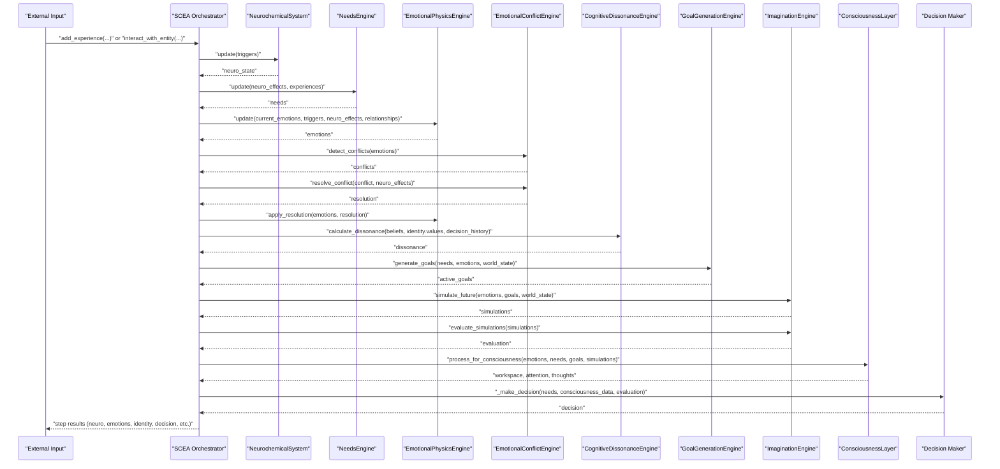
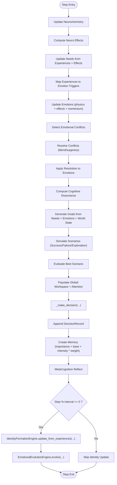
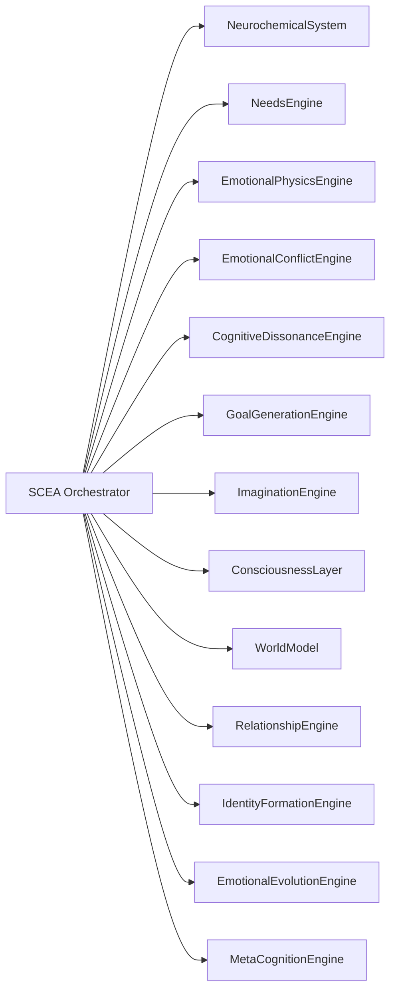

# Self-Cognitive Evolution Architecture (SCEA)

<cite>
**Referenced Files in This Document**
- [README.md](file://README.md)
- [system_constants.py](file://system_constants.py)
- [scea/__init__.py](file://psychologist/scea/__init__.py)
- [scea/core/scea.py](file://psychologist/scea/core/scea.py)
- [scea/core/models.py](file://psychologist/scea/core/models.py)
- [scea/neurochemistry/neurochemical_system.py](file://psychologist/scea/neurochemistry/neurochemical_system.py)
- [scea/needs_engine/needs_system.py](file://psychologist/scea/needs_engine/needs_system.py)
- [scea/emotional_physics/emotional_physics_engine.py](file://psychologist/scea/emotional_physics/emotional_physics_engine.py)
- [scea/world_model/world_model_system.py](file://psychologist/scea/world_model/world_model_system.py)
- [scea/relationship_engine/relationship_system.py](file://psychologist/scea/relationship_engine/relationship_system.py)
- [scea/cognitive_dissonance/cognitive_dissonance_engine.py](file://psychologist/scea/cognitive_dissonance/cognitive_dissonance_engine.py)
- [scea/conflict_engine/emotional_conflict_engine.py](file://psychologist/scea/conflict_engine/emotional_conflict_engine.py)
- [scea/goal_generation/goal_system.py](file://psychologist/scea/goal_generation/goal_system.py)
- [scea/identity_formation/identity_system.py](file://psychologist/scea/identity_formation/identity_system.py)
- [scea/imagination/imagination_system.py](file://psychologist/scea/imagination/imagination_system.py)
- [scea/meta_cognition/meta_cognition_system.py](file://psychologist/scea/meta_cognition/meta_cognition_system.py)
- [scea/emotional_evolution/emotional_evolution_system.py](file://psychologist/scea/emotional_evolution/emotional_evolution_system.py)
- [scea/consciousness_layer/consciousness_system.py](file://psychologist/scea/consciousness_layer/consciousness_system.py)
- [example_scea.py](file://psychologist/example_scea.py)
</cite>

## Table of Contents
1. [Introduction](#introduction)
2. [Project Structure](#project-structure)
3. [Core Components](#core-components)
4. [Architecture Overview](#architecture-overview)
5. [Detailed Component Analysis](#detailed-component-analysis)
6. [Dependency Analysis](#dependency-analysis)
7. [Performance Considerations](#performance-considerations)
8. [Troubleshooting Guide](#troubleshooting-guide)
9. [Conclusion](#conclusion)
10. [Appendices](#appendices)

## Introduction
The Self-Cognitive Evolution Architecture (SCEA) simulates a multi-layered model of human-like cognition and emotion. It integrates:
- Neurochemistry modeling (dopamine, serotonin, oxytocin, cortisol, adrenaline)
- Needs engine (Maslow-inspired drives)
- Identity formation and evolution
- Consciousness layer (global workspace and attention)
- Meta-cognition (self-reflection and reasoning)
- Emotional evolution (adaptive identity refinement)
- Conflict and dissonance engines (emotional balance and coherence)
- Goal generation and imagination (future simulation)
- World model and relationships (external context)

This orchestration produces emergent behaviors such as decision-making, self-awareness, and personal growth, grounded in biologically inspired dynamics and psychological principles.

## Project Structure
SCEA resides under the psychologist/scea package and is composed of cohesive subsystems that collaborate via the central orchestrator.

**Diagram sources**
- [scea/core/scea.py:30-48](file://psychologist/scea/core/scea.py#L30-L48)
- [scea/neurochemistry/neurochemical_system.py:6-11](file://psychologist/scea/neurochemistry/neurochemical_system.py#L6-L11)
- [scea/needs_engine/needs_system.py:6-9](file://psychologist/scea/needs_engine/needs_system.py#L6-L9)
- [scea/emotional_physics/emotional_physics_engine.py:7-11](file://psychologist/scea/emotional_physics/emotional_physics_engine.py#L7-L11)
- [scea/world_model/world_model_system.py:5-9](file://psychologist/scea/world_model/world_model_system.py#L5-L9)
- [scea/relationship_engine/relationship_system.py:6-8](file://psychologist/scea/relationship_engine/relationship_system.py#L6-L8)
- [scea/cognitive_dissonance/cognitive_dissonance_engine.py:5-9](file://psychologist/scea/cognitive_dissonance/cognitive_dissonance_engine.py#L5-L9)
- [scea/conflict_engine/emotional_conflict_engine.py:5-15](file://psychologist/scea/conflict_engine/emotional_conflict_engine.py#L5-L15)
- [scea/goal_generation/goal_system.py:6-10](file://psychologist/scea/goal_generation/goal_system.py#L6-L10)
- [scea/identity_formation/identity_system.py:6-9](file://psychologist/scea/identity_formation/identity_system.py#L6-L9)
- [scea/imagination/imagination_system.py:6-8](file://psychologist/scea/imagination/imagination_system.py#L6-L8)
- [scea/consciousness_layer/consciousness_system.py:6-10](file://psychologist/scea/consciousness_layer/consciousness_system.py#L6-L10)
- [scea/meta_cognition/meta_cognition_system.py:5-8](file://psychologist/scea/meta_cognition/meta_cognition_system.py#L5-L8)
- [scea/emotional_evolution/emotional_evolution_system.py:6-9](file://psychologist/scea/emotional_evolution/emotional_evolution_system.py#L6-L9)

**Section sources**
- [README.md:92-106](file://README.md#L92-L106)
- [scea/__init__.py:1-4](file://psychologist/scea/__init__.py#L1-L4)

## Core Components
- SCEA orchestrator: coordinates all subsystems, manages state, and executes a step.
- NeurochemicalSystem: simulates neurotransmitter dynamics and translates them into behavioral tendencies.
- NeedsEngine: maintains drive states and modulates priorities based on neurochemical feedback.
- EmotionalPhysicsEngine: evolves emotional states via triggers, momentum, decay, and resonance.
- Conflict and Dissonance Engines: detect and resolve internal conflicts and inconsistencies.
- GoalGenerationEngine: generates and prioritizes goals from needs and emotional context.
- ImaginationEngine: simulates potential outcomes and evaluates scenarios.
- ConsciousnessLayer: populates a global workspace and focuses attention.
- IdentityFormationEngine and EmotionalEvolutionEngine: build and refine identity and values.
- MetaCognitionEngine: reflects on decisions and reassesses beliefs.
- WorldModel and RelationshipEngine: maintain beliefs, environment state, and social bonds.

**Section sources**
- [scea/core/scea.py:30-48](file://psychologist/scea/core/scea.py#L30-L48)
- [scea/core/models.py:28-162](file://psychologist/scea/core/models.py#L28-L162)

## Architecture Overview
The SCEA orchestrator runs a single step integrating inputs (triggers, experiences), updating internal states, and producing outputs (decisions, identity changes, emotion metrics).

**Diagram sources**
- [scea/core/scea.py:61-184](file://psychologist/scea/core/scea.py#L61-L184)
- [scea/neurochemistry/neurochemical_system.py:12-92](file://psychologist/scea/neurochemistry/neurochemical_system.py#L12-L92)
- [scea/needs_engine/needs_system.py:73-99](file://psychologist/scea/needs_engine/needs_system.py#L73-L99)
- [scea/emotional_physics/emotional_physics_engine.py:12-41](file://psychologist/scea/emotional_physics/emotional_physics_engine.py#L12-L41)
- [scea/conflict_engine/emotional_conflict_engine.py:17-70](file://psychologist/scea/conflict_engine/emotional_conflict_engine.py#L17-L70)
- [scea/cognitive_dissonance/cognitive_dissonance_engine.py:11-37](file://psychologist/scea/cognitive_dissonance/cognitive_dissonance_engine.py#L11-L37)
- [scea/goal_generation/goal_system.py:39-76](file://psychologist/scea/goal_generation/goal_system.py#L39-L76)
- [scea/imagination/imagination_system.py:10-30](file://psychologist/scea/imagination/imagination_system.py#L10-L30)
- [scea/consciousness_layer/consciousness_system.py:12-55](file://psychologist/scea/consciousness_layer/consciousness_system.py#L12-L55)

## Detailed Component Analysis

### SCEA Orchestrator
- Initializes subsystems and aggregates state into a unified SCEAState.
- Executes a step by updating neurochemistry, needs, emotions, resolving conflicts, computing dissonance, generating goals, simulating futures, focusing consciousness, selecting a decision, recording memories, reflecting, and periodically evolving identity.

**Diagram sources**
- [scea/core/scea.py:61-184](file://psychologist/scea/core/scea.py#L61-L184)
- [scea/needs_engine/needs_system.py:73-99](file://psychologist/scea/needs_engine/needs_system.py#L73-L99)
- [scea/emotional_physics/emotional_physics_engine.py:12-41](file://psychologist/scea/emotional_physics/emotional_physics_engine.py#L12-L41)
- [scea/conflict_engine/emotional_conflict_engine.py:17-70](file://psychologist/scea/conflict_engine/emotional_conflict_engine.py#L17-L70)
- [scea/cognitive_dissonance/cognitive_dissonance_engine.py:11-37](file://psychologist/scea/cognitive_dissonance/cognitive_dissonance_engine.py#L11-L37)
- [scea/goal_generation/goal_system.py:39-76](file://psychologist/scea/goal_generation/goal_system.py#L39-L76)
- [scea/imagination/imagination_system.py:10-30](file://psychologist/scea/imagination/imagination_system.py#L10-L30)
- [scea/consciousness_layer/consciousness_system.py:12-55](file://psychologist/scea/consciousness_layer/consciousness_system.py#L12-L55)
- [scea/meta_cognition/meta_cognition_system.py:10-26](file://psychologist/scea/meta_cognition/meta_cognition_system.py#L10-L26)
- [scea/identity_formation/identity_system.py:21-31](file://psychologist/scea/identity_formation/identity_system.py#L21-L31)
- [scea/emotional_evolution/emotional_evolution_system.py:11-35](file://psychologist/scea/emotional_evolution/emotional_evolution_system.py#L11-L35)

**Section sources**
- [scea/core/scea.py:30-184](file://psychologist/scea/core/scea.py#L30-L184)

### Neurochemical System
- Maintains a five-factor neurochemical state with decay and baseline correction.
- Translates neurochemical levels into behavioral “effects” (e.g., reward expectation, curiosity, stability, trust formation, stress level, urgency).
- Provides bounded random noise to avoid deterministic collapse.

Mathematical characteristics:
- Decay: multiplicative decay per step.
- Baseline correction: small drift toward baseline.
- Noise: uniform random perturbation per factor.
- Effects: saturating nonlinear functions of state.

**Section sources**
- [scea/neurochemistry/neurochemical_system.py:12-111](file://psychologist/scea/neurochemistry/neurochemical_system.py#L12-L111)

### Needs Engine
- Maintains a set of intrinsic needs with satisfaction, priority, deprivation, and history.
- Updates satisfaction from experiences and applies slow decay.
- Increases deprivation over time and amplifies priority accordingly.
- Modulates need priorities based on neurochemical effects (e.g., curiosity boosts knowledge/exploration; trust formation boosts social; confidence boosts achievement; threat sensitivity boosts security).

Decision-relevant outputs:
- Most pressing need for action selection.

**Section sources**
- [scea/needs_engine/needs_system.py:73-137](file://psychologist/scea/needs_engine/needs_system.py#L73-L137)

### Emotional Physics Engine
- Applies emotion triggers mapped to specific emotion increments.
- Propagates momentum from prior to current state.
- Applies exponential decay to all emotions.
- Modulates by neurochemical effects (e.g., reward expectation boosts positive emotions; stress increases anxiety/fear/anger; trust formation enhances prosocial emotions).
- Models inter-emotion resonance (e.g., joy–trust, fear–sadness).
- Tracks momentum vectors to stabilize or amplify emotional transitions.

**Section sources**
- [scea/emotional_physics/emotional_physics_engine.py:12-127](file://psychologist/scea/emotional_physics/emotional_physics_engine.py#L12-L127)

### Conflict and Dissonance Engines
- Conflict detection identifies simultaneous strong activations of opposing emotion pairs; resolves via blending or suppression depending on intensity and neurochemical stability.
- Dissonance quantifies inconsistency among beliefs, values, and recent decisions; suggests adjustments (e.g., reduce conflicting belief confidence) and tracks resolution history.

**Section sources**
- [scea/conflict_engine/emotional_conflict_engine.py:17-70](file://psychologist/scea/conflict_engine/emotional_conflict_engine.py#L17-L70)
- [scea/cognitive_dissonance/cognitive_dissonance_engine.py:11-98](file://psychologist/scea/cognitive_dissonance/cognitive_dissonance_engine.py#L11-L98)

### Goal Generation and Imagination
- Generates goals from top-ranked needs and emotional drivers (e.g., curiosity).
- Limits active goals and prunes completed/abandoned ones.
- Simulates outcomes for selected goals (success vs. failure) and an exploration scenario; evaluates by valence-weighted likelihood.
- Provides decision context for the orchestrator’s selection.

**Section sources**
- [scea/goal_generation/goal_system.py:39-144](file://psychologist/scea/goal_generation/goal_system.py#L39-L144)
- [scea/imagination/imagination_system.py:10-87](file://psychologist/scea/imagination/imagination_system.py#L10-L87)

### Consciousness Layer
- Builds a global workspace from dominant emotion, top needs, and top goals.
- Selects attention focus and active thought list for the current step.

**Section sources**
- [scea/consciousness_layer/consciousness_system.py:12-55](file://psychologist/scea/consciousness_layer/consciousness_system.py#L12-L55)

### Identity Formation and Evolution
- IdentityFormationEngine updates self-image traits, values, and preferences from recent decisions/memories and emotional patterns; computes consistency and self-confidence.
- EmotionalEvolutionEngine evolves identity over time by reinforcing successful value/traits and applying rare mutations to preserve diversity.

**Section sources**
- [scea/identity_formation/identity_system.py:21-105](file://psychologist/scea/identity_formation/identity_system.py#L21-L105)
- [scea/emotional_evolution/emotional_evolution_system.py:11-79](file://psychologist/scea/emotional_evolution/emotional_evolution_system.py#L11-L79)

### Meta-Cognition
- Evaluates recent decisions by outcome score and emotional intensity; tracks regret and learning rate.
- Reassesses beliefs based on evidence counts and confidence thresholds.

**Section sources**
- [scea/meta_cognition/meta_cognition_system.py:10-77](file://psychologist/scea/meta_cognition/meta_cognition_system.py#L10-L77)

### World Model and Relationships
- WorldModel stores beliefs with confidence and evidence, supports queries, and tracks environment state and relationships.
- RelationshipEngine models trust, familiarity, attachment, respect, reliability, and emotional associations; accumulates interaction histories.

**Section sources**
- [scea/world_model/world_model_system.py:11-80](file://psychologist/scea/world_model/world_model_system.py#L11-L80)
- [scea/relationship_engine/relationship_system.py:10-51](file://psychologist/scea/relationship_engine/relationship_system.py#L10-L51)

## Dependency Analysis
SCEA composes subsystems with clear data dependencies and minimal coupling. The orchestrator depends on all engines for state updates and outputs. Each engine encapsulates its own state and exposes pure update functions.

**Diagram sources**
- [scea/core/scea.py:7-46](file://psychologist/scea/core/scea.py#L7-L46)

**Section sources**
- [scea/core/scea.py:7-46](file://psychologist/scea/core/scea.py#L7-L46)

## Performance Considerations
- Computational complexity is primarily linear in the number of active goals, recent memories, and belief sets.
- Memory limits and decays prevent unbounded growth in histories and emotion vectors.
- Configurable constants (e.g., identity update interval, memory importance weight) allow tuning responsiveness vs. stability.
- Simulation of future scenarios caps the number of simulations to bound computational overhead.

[No sources needed since this section provides general guidance]

## Troubleshooting Guide
Common issues and remedies:
- Emotions not changing: verify triggers and ensure experience events include type and intensity; confirm neurochemical effects are being applied.
- Identity not evolving: ensure step intervals align with the identity update period; check decision/memories are being recorded.
- Goals not forming: review need satisfaction thresholds and emotional drivers; confirm environment state keys match expectations.
- Conflicts unresolved: inspect conflict pairs and suppression strengths; ensure neurochemical stability contributes to resolution.
- Dissonance remains high: add evidence to strengthen beliefs or adjust recent decisions to align with values.

**Section sources**
- [scea/emotional_physics/emotional_physics_engine.py:12-41](file://psychologist/scea/emotional_physics/emotional_physics_engine.py#L12-L41)
- [scea/needs_engine/needs_system.py:73-99](file://psychologist/scea/needs_engine/needs_system.py#L73-L99)
- [scea/goal_generation/goal_system.py:39-76](file://psychologist/scea/goal_generation/goal_system.py#L39-L76)
- [scea/conflict_engine/emotional_conflict_engine.py:17-70](file://psychologist/scea/conflict_engine/emotional_conflict_engine.py#L17-L70)
- [scea/cognitive_dissonance/cognitive_dissonance_engine.py:11-37](file://psychologist/scea/cognitive_dissonance/cognitive_dissonance_engine.py#L11-L37)
- [scea/identity_formation/identity_system.py:21-31](file://psychologist/scea/identity_formation/identity_system.py#L21-L31)

## Conclusion
SCEA integrates biologically inspired neurochemistry, psychological needs, dynamic emotions, conflict resolution, identity formation, and meta-cognitive reflection into a coherent simulation of self-cognitive evolution. Its modular design enables controlled experimentation and customization while preserving emergent behaviors aligned with human-like decision-making, self-awareness, and personal growth.

[No sources needed since this section summarizes without analyzing specific files]

## Appendices

### Mathematical Models and Algorithms

- Neurochemical dynamics
  - Update rule: each factor decays multiplicatively and receives incremental changes from triggers plus baseline correction and noise.
  - Effects mapping: saturating functions translate neuro levels into behavioral tendencies.

- Needs update
  - Satisfaction decay and deprivation accumulation increase priority.
  - Priority modulation by neurochemical effects.

- Emotional physics
  - Trigger application, momentum propagation, exponential decay, neuro-modulation, resonance, and momentum update.

- Conflict resolution
  - Pairwise conflict detection; resolution blends or suppresses depending on intensity and stability.

- Goal generation
  - Templates per need category; probabilistic creation conditioned on environment state; progress and cleanup policies.

- Imagination evaluation
  - Valence-weighted likelihood scoring selects best scenario.

- Identity evolution
  - Reinforcement learning-like updates to values/importance and self-image traits; occasional mutations.

- Consciousness workspace
  - Priority-driven selection from emotion, needs, and goals.

- Memory importance
  - Importance = base + intensity × weight.

**Section sources**
- [scea/neurochemistry/neurochemical_system.py:12-111](file://psychologist/scea/neurochemistry/neurochemical_system.py#L12-L111)
- [scea/needs_engine/needs_system.py:73-137](file://psychologist/scea/needs_engine/needs_system.py#L73-L137)
- [scea/emotional_physics/emotional_physics_engine.py:12-127](file://psychologist/scea/emotional_physics/emotional_physics_engine.py#L12-L127)
- [scea/conflict_engine/emotional_conflict_engine.py:17-70](file://psychologist/scea/conflict_engine/emotional_conflict_engine.py#L17-L70)
- [scea/goal_generation/goal_system.py:39-144](file://psychologist/scea/goal_generation/goal_system.py#L39-L144)
- [scea/imagination/imagination_system.py:72-87](file://psychologist/scea/imagination/imagination_system.py#L72-L87)
- [scea/identity_formation/identity_system.py:21-105](file://psychologist/scea/identity_formation/identity_system.py#L21-L105)
- [scea/consciousness_layer/consciousness_system.py:12-55](file://psychologist/scea/consciousness_layer/consciousness_system.py#L12-L55)
- [scea/core/models.py:96-103](file://psychologist/scea/core/models.py#L96-L103)

### Configuration Options
Key tunable constants (see centralized configuration):
- Decision history limit
- Memory retention and importance weight
- Identity update interval
- Emotion decay and history limits
- Goal progress and cleanup thresholds
- Conflict resolution strength and blending weights
- Evolution mutation rate

These are defined and documented in the system constants module.

**Section sources**
- [system_constants.py:48-61](file://system_constants.py#L48-L61)
- [system_constants.py:14-36](file://system_constants.py#L14-L36)

### Example Scenarios and Behavior
- Social interaction: positive/negative interactions influence trust and neurochemical triggers, affecting downstream emotions and identity.
- Novelty and achievement: novelty increases curiosity and dopamine; achievement increases reward-related neuro effects and satisfaction.
- Exploration vs. security: competing needs produce conflict; resolution depends on stability and stress levels.
- Identity growth: repeated reinforcement of values and self-image traits strengthens identity; occasional mutations introduce variability.

**Section sources**
- [example_scea.py:21-75](file://psychologist/example_scea.py#L21-L75)
- [scea/relationship_engine/relationship_system.py:10-51](file://psychologist/scea/relationship_engine/relationship_system.py#L10-L51)
- [scea/neurochemistry/neurochemical_system.py:21-50](file://psychologist/scea/neurochemistry/neurochemical_system.py#L21-L50)
- [scea/identity_formation/identity_system.py:21-105](file://psychologist/scea/identity_formation/identity_system.py#L21-L105)