# Emotion Processing Engine Architecture

<cite>
**Referenced Files in This Document**
- [emotion_engine.py](file://psychologist/emotion_engine/emotion_engine.py)
- [models.py](file://psychologist/emotion_engine/models.py)
- [personality_engine.py](file://psychologist/emotion_engine/personality_engine/personality_engine.py)
- [emotional_memory.py](file://psychologist/emotion_engine/emotional_memory/emotional_memory.py)
- [sentiment_analyzer.py](file://psychologist/emotion_engine/sentiment_analysis/sentiment_analyzer.py)
- [context_engine.py](file://psychologist/emotion_engine/context_engine/context_engine.py)
- [reasoning_engine.py](file://psychologist/emotion_engine/reasoning_engine/reasoning_engine.py)
- [response_generator.py](file://psychologist/emotion_engine/response_generator/response_generator.py)
- [behavior_predictor.py](file://psychologist/emotion_engine/behavior_predictor/behavior_predictor.py)
- [fuzzy_engine.py](file://psychologist/emotion_engine/fuzzy_logic/fuzzy_engine.py)
- [bayesian_network.py](file://psychologist/emotion_engine/bayesian_engine/bayesian_network.py)
- [emotion_state_machine.py](file://psychologist/emotion_engine/state_machine/emotion_state_machine.py)
- [facial_emotion_detector.py](file://psychologist/emotion_engine/computer_vision/facial_emotion_detector.py)
- [voice_emotion_analyzer.py](file://psychologist/emotion_engine/voice_emotion/voice_emotion_analyzer.py)
- [system_constants.py](file://psychologist/system_constants.py)
</cite>

## Table of Contents
1. [Introduction](#introduction)
2. [Project Structure](#project-structure)
3. [Core Components](#core-components)
4. [Architecture Overview](#architecture-overview)
5. [Detailed Component Analysis](#detailed-component-analysis)
6. [Dependency Analysis](#dependency-analysis)
7. [Performance Considerations](#performance-considerations)
8. [Troubleshooting Guide](#troubleshooting-guide)
9. [Conclusion](#conclusion)

## Introduction
This document describes the Emotion Processing Engine subsystem, a central hub that orchestrates multi-layered emotion processing. It integrates sentiment analysis, context processing, memory management, personality influence, and response generation into a cohesive pipeline. The engine tracks primary, secondary, and advanced emotions, applies emotion decay, blends reasoning outputs, and supports both text and multimodal inputs (vision and voice). It is designed with modular components that can be independently replaced or extended.

## Project Structure
The Emotion Processing Engine resides under psychologist/emotion_engine and is composed of several specialized modules:
- Central orchestration: emotion_engine.py
- Data models: models.py
- Personality influence: personality_engine/
- Memory management: emotional_memory/
- Sentiment analysis: sentiment_analysis/
- Context processing: context_engine/
- Reasoning and decision-making: reasoning_engine/, fuzzy_logic/, bayesian_engine/, state_machine/
- Behavior prediction: behavior_predictor/
- Response generation: response_generator/
- Multimodal emotion detection: computer_vision/, voice_emotion/

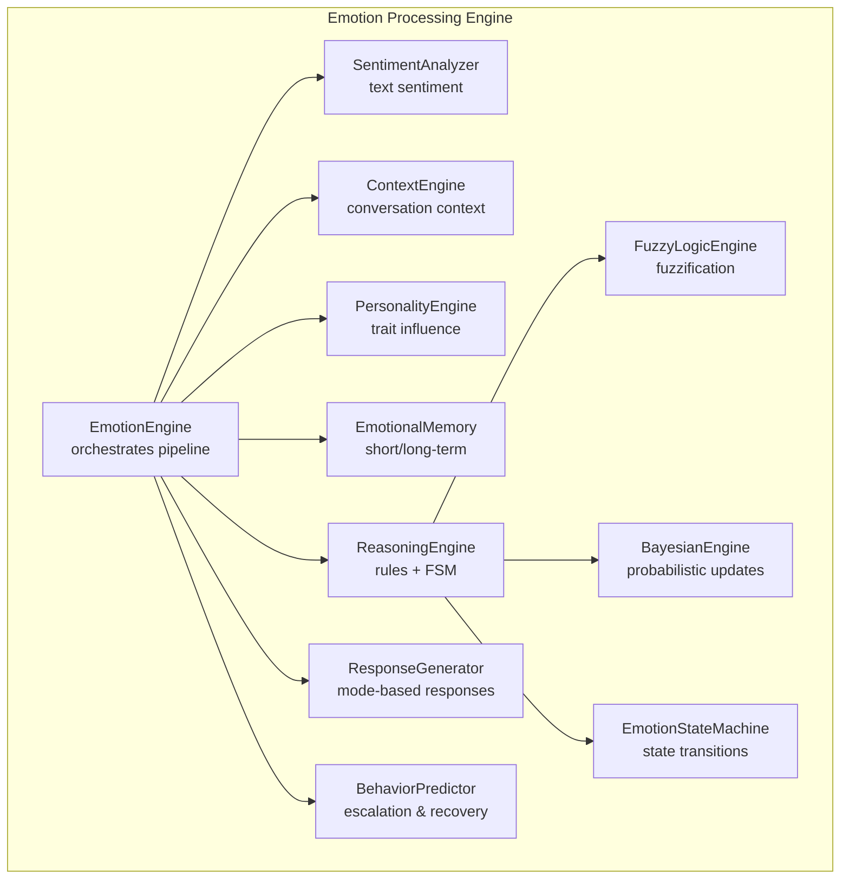

**Diagram sources**
- [emotion_engine.py:23-31](file://psychologist/emotion_engine/emotion_engine.py#L23-L31)
- [personality_engine.py:6-8](file://psychologist/emotion_engine/personality_engine/personality_engine.py#L6-L8)
- [emotional_memory.py:8-14](file://psychologist/emotion_engine/emotional_memory/emotional_memory.py#L8-L14)
- [sentiment_analyzer.py:5-6](file://psychologist/emotion_engine/sentiment_analysis/sentiment_analyzer.py#L5-L6)
- [context_engine.py:9-12](file://psychologist/emotion_engine/context_engine/context_engine.py#L9-L12)
- [reasoning_engine.py:86-92](file://psychologist/emotion_engine/reasoning_engine/reasoning_engine.py#L86-L92)
- [fuzzy_engine.py:4-6](file://psychologist/emotion_engine/fuzzy_logic/fuzzy_engine.py#L4-L6)
- [bayesian_network.py:5-8](file://psychologist/emotion_engine/bayesian_engine/bayesian_network.py#L5-L8)
- [emotion_state_machine.py:5-9](file://psychologist/emotion_engine/state_machine/emotion_state_machine.py#L5-L9)
- [response_generator.py:6-8](file://psychologist/emotion_engine/response_generator/response_generator.py#L6-L8)
- [behavior_predictor.py:7-8](file://psychologist/emotion_engine/behavior_predictor/behavior_predictor.py#L7-L8)

**Section sources**
- [emotion_engine.py:1-184](file://psychologist/emotion_engine/emotion_engine.py#L1-L184)
- [models.py:1-143](file://psychologist/emotion_engine/models.py#L1-L143)

## Core Components
- EmotionEngine: Central orchestrator coordinating sentiment analysis, context updates, reasoning, memory, behavior prediction, and response generation. Implements emotion decay and history management.
- PersonalityEngine: Applies personality trait influence to emotional states, scaling emotion intensities based on traits such as neuroticism, openness, agreeableness, and others.
- EmotionalMemory: Manages short-term and long-term memory entries, emotional patterns, and preference storage; supports retrieval and persistence.
- SentimentAnalyzer: Tokenizes text, computes sentiment polarity and intensity, and detects emotion keywords to boost relevant emotion values.
- ContextEngine: Maintains conversation context including topic, sentiment trends, conflict level, motivation opportunity, and repeated patterns.
- ReasoningEngine: Evaluates emotion/personality/context rules, applies fuzzy logic adjustments, Bayesian updates, and state machine transitions.
- ResponseGenerator: Selects and personalizes responses based on reasoning mode and personality traits.
- BehaviorPredictor: Predicts escalation risk, recovery trajectory, next likely emotions, engagement, and motivation.
- FuzzyLogicEngine: Fuzzifies emotion intensities and personality traits, applies rules, and defuzzifies outputs.
- BayesianEngine: Updates emotion probabilities using predefined conditional probability tables and priors.
- EmotionStateMachine: Encodes probabilistic state transitions among emotion states.

**Section sources**
- [emotion_engine.py:23-31](file://psychologist/emotion_engine/emotion_engine.py#L23-L31)
- [personality_engine.py:6-54](file://psychologist/emotion_engine/personality_engine/personality_engine.py#L6-L54)
- [emotional_memory.py:8-84](file://psychologist/emotion_engine/emotional_memory/emotional_memory.py#L8-L84)
- [sentiment_analyzer.py:5-73](file://psychologist/emotion_engine/sentiment_analysis/sentiment_analyzer.py#L5-L73)
- [context_engine.py:9-46](file://psychologist/emotion_engine/context_engine/context_engine.py#L9-L46)
- [reasoning_engine.py:86-204](file://psychologist/emotion_engine/reasoning_engine/reasoning_engine.py#L86-L204)
- [response_generator.py:6-85](file://psychologist/emotion_engine/response_generator/response_generator.py#L6-L85)
- [behavior_predictor.py:7-132](file://psychologist/emotion_engine/behavior_predictor/behavior_predictor.py#L7-L132)
- [fuzzy_engine.py:4-81](file://psychologist/emotion_engine/fuzzy_logic/fuzzy_engine.py#L4-L81)
- [bayesian_network.py:5-104](file://psychologist/emotion_engine/bayesian_engine/bayesian_network.py#L5-L104)
- [emotion_state_machine.py:5-70](file://psychologist/emotion_engine/state_machine/emotion_state_machine.py#L5-L70)

## Architecture Overview
The Emotion Processing Engine follows a layered pipeline:
1. Input ingestion and sentiment extraction
2. Emotion state update with keyword boosting and personality influence
3. Context computation and trend tracking
4. Reasoning with rule evaluation, fuzzy logic, Bayesian updates, and state transitions
5. Memory consolidation and pattern tracking
6. Behavior prediction and response generation
7. Emotion decay for temporal dynamics

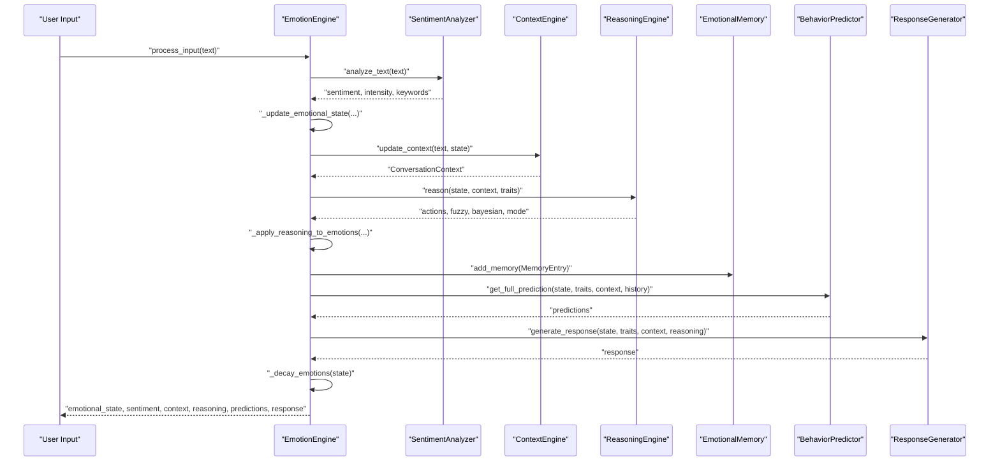

**Diagram sources**
- [emotion_engine.py:37-92](file://psychologist/emotion_engine/emotion_engine.py#L37-L92)
- [sentiment_analyzer.py:31-73](file://psychologist/emotion_engine/sentiment_analysis/sentiment_analyzer.py#L31-L73)
- [context_engine.py:24-46](file://psychologist/emotion_engine/context_engine/context_engine.py#L24-L46)
- [reasoning_engine.py:185-204](file://psychologist/emotion_engine/reasoning_engine/reasoning_engine.py#L185-L204)
- [emotional_memory.py:17-28](file://psychologist/emotion_engine/emotional_memory/emotional_memory.py#L17-L28)
- [behavior_predictor.py:125-132](file://psychologist/emotion_engine/behavior_predictor/behavior_predictor.py#L125-L132)
- [response_generator.py:77-85](file://psychologist/emotion_engine/response_generator/response_generator.py#L77-L85)

## Detailed Component Analysis

### EmotionEngine: Central Orchestration
- Responsibilities:
  - Coordinates sentiment analysis, context updates, reasoning, memory, behavior prediction, and response generation.
  - Manages current emotional state, history, and interaction count.
  - Applies emotion decay and personality influence after reasoning.
- Processing logic:
  - Updates primary/secondary/advanced emotions using sentiment and keyword detection.
  - Blends Bayesian reasoning with current emotion values.
  - Persists memory entries with computed importance.
  - Generates predictions and response based on reasoning mode.

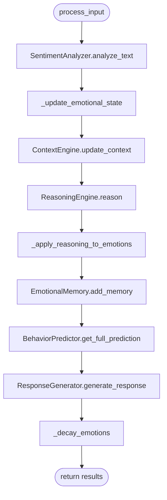

**Diagram sources**
- [emotion_engine.py:37-92](file://psychologist/emotion_engine/emotion_engine.py#L37-L92)
- [sentiment_analyzer.py:31-73](file://psychologist/emotion_engine/sentiment_analysis/sentiment_analyzer.py#L31-L73)
- [context_engine.py:24-46](file://psychologist/emotion_engine/context_engine/context_engine.py#L24-L46)
- [reasoning_engine.py:185-204](file://psychologist/emotion_engine/reasoning_engine/reasoning_engine.py#L185-L204)
- [emotional_memory.py:17-28](file://psychologist/emotion_engine/emotional_memory/emotional_memory.py#L17-L28)
- [behavior_predictor.py:125-132](file://psychologist/emotion_engine/behavior_predictor/behavior_predictor.py#L125-L132)
- [response_generator.py:77-85](file://psychologist/emotion_engine/response_generator/response_generator.py#L77-L85)

**Section sources**
- [emotion_engine.py:23-184](file://psychologist/emotion_engine/emotion_engine.py#L23-L184)

### Personality Influence Integration
- PersonalityEngine scales emotion intensities based on traits such as neuroticism, optimism, confidence, agreeableness, and curiosity.
- Influence is applied across primary, secondary, and advanced emotions to adjust baseline emotional expression.

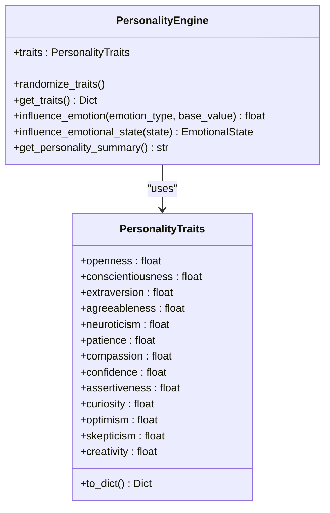

**Diagram sources**
- [personality_engine.py:6-54](file://psychologist/emotion_engine/personality_engine/personality_engine.py#L6-L54)
- [models.py:79-110](file://psychologist/emotion_engine/models.py#L79-L110)

**Section sources**
- [personality_engine.py:23-54](file://psychologist/emotion_engine/personality_engine/personality_engine.py#L23-L54)
- [models.py:79-110](file://psychologist/emotion_engine/models.py#L79-L110)

### Emotion State Management and Decay
- EmotionalState encapsulates primary, secondary, and advanced emotion distributions plus intensity.
- EmotionEngine applies decay to all emotion categories and intensity at each interaction cycle.

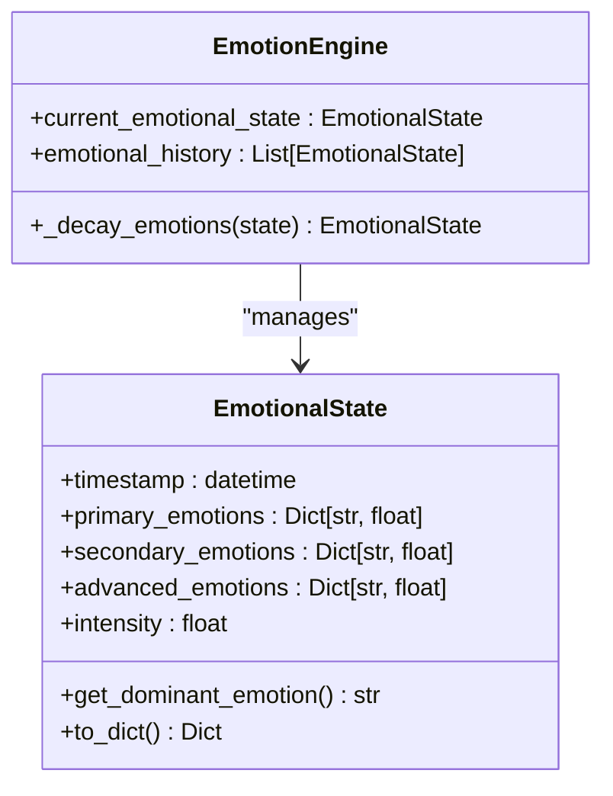

**Diagram sources**
- [models.py:44-76](file://psychologist/emotion_engine/models.py#L44-L76)
- [emotion_engine.py:147-162](file://psychologist/emotion_engine/emotion_engine.py#L147-L162)

**Section sources**
- [models.py:44-76](file://psychologist/emotion_engine/models.py#L44-L76)
- [emotion_engine.py:147-162](file://psychologist/emotion_engine/emotion_engine.py#L147-L162)
- [system_constants.py:14-18](file://psychologist/system_constants.py#L14-L18)

### Multi-Layered Emotion Tracking
- Primary emotions: happiness, sadness, anger, fear, surprise, disgust.
- Secondary emotions: excitement, anxiety, frustration, curiosity, hope, confidence, embarrassment, pride, jealousy, gratitude, sympathy, empathy.
- Advanced emotions: burnout, motivation, stress, loneliness, trust, distrust, attachment, nostalgia, emotional fatigue, emotional recovery.

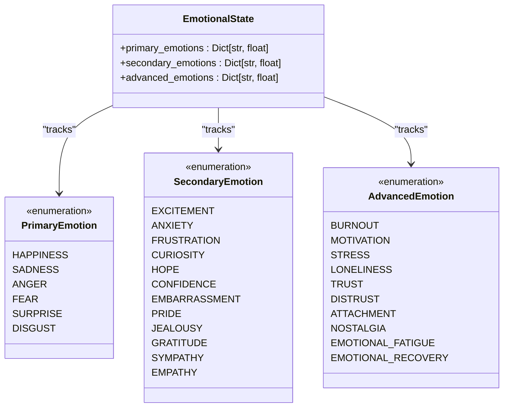

**Diagram sources**
- [models.py:7-42](file://psychologist/emotion_engine/models.py#L7-L42)
- [models.py:44-76](file://psychologist/emotion_engine/models.py#L44-L76)

**Section sources**
- [models.py:7-42](file://psychologist/emotion_engine/models.py#L7-L42)
- [models.py:44-76](file://psychologist/emotion_engine/models.py#L44-L76)

### Emotion Decay Mechanisms
- Exponentially decays all emotion values and intensity each interaction using a configurable decay factor.
- Ensures emotional states evolve naturally over time and prevent persistent stale activations.

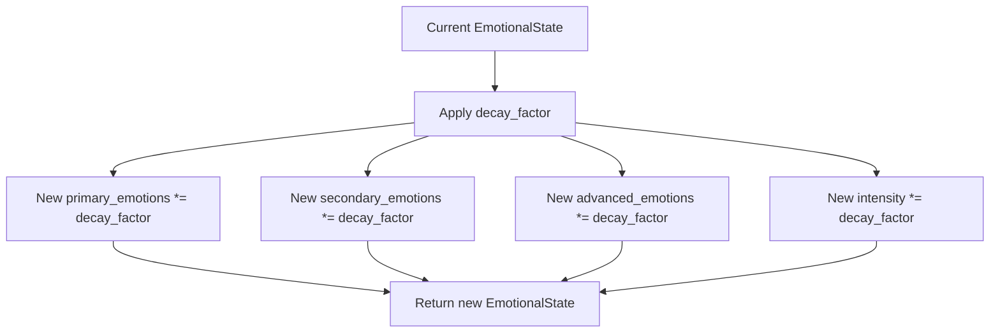

**Diagram sources**
- [emotion_engine.py:147-162](file://psychologist/emotion_engine/emotion_engine.py#L147-L162)
- [system_constants.py:14](file://psychologist/system_constants.py#L14)

**Section sources**
- [emotion_engine.py:147-162](file://psychologist/emotion_engine/emotion_engine.py#L147-L162)
- [system_constants.py:14](file://psychologist/system_constants.py#L14)

### Personality Trait Integration
- PersonalityEngine computes influence factors per emotion type and scales base values accordingly.
- Integrates with EmotionEngine to adjust emotional state post-sentiment and pre-response generation.

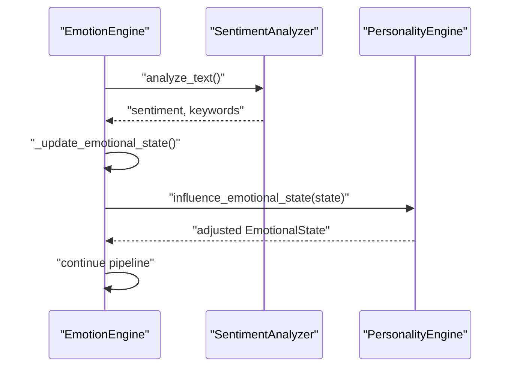

**Diagram sources**
- [emotion_engine.py:94-129](file://psychologist/emotion_engine/emotion_engine.py#L94-L129)
- [personality_engine.py:40-54](file://psychologist/emotion_engine/personality_engine/personality_engine.py#L40-L54)

**Section sources**
- [personality_engine.py:23-54](file://psychologist/emotion_engine/personality_engine/personality_engine.py#L23-L54)
- [emotion_engine.py:94-129](file://psychologist/emotion_engine/emotion_engine.py#L94-L129)

### Memory Management and Pattern Tracking
- Short-term memory stores recent interactions; transfers oldest entries to long-term memory when capacity is exceeded.
- Long-term memory retains important entries based on importance thresholds and emotional patterns.
- Tracks average emotion trends and user preferences for downstream personalization.

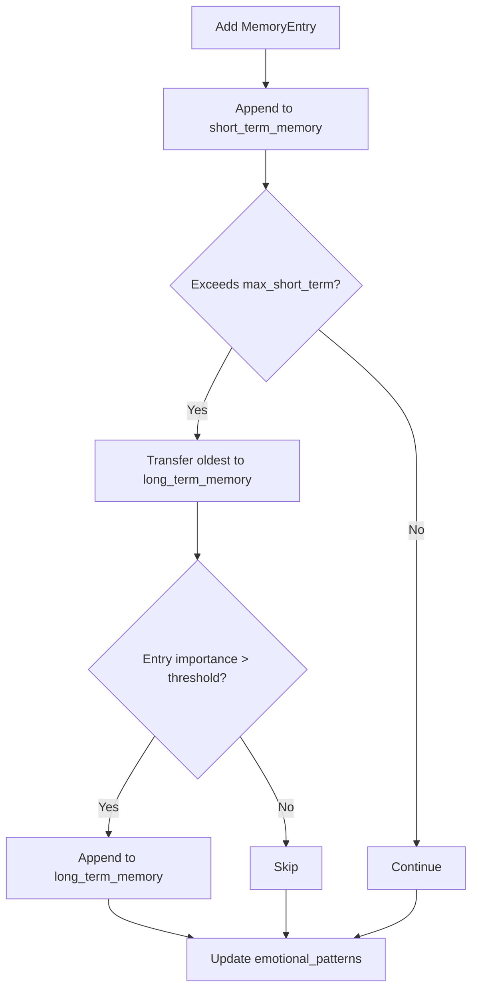

**Diagram sources**
- [emotional_memory.py:17-44](file://psychologist/emotion_engine/emotional_memory/emotional_memory.py#L17-L44)

**Section sources**
- [emotional_memory.py:8-84](file://psychologist/emotion_engine/emotional_memory/emotional_memory.py#L8-L84)

### Reasoning Pipeline: Rules, Fuzzy Logic, and Bayesian Updates
- Rule evaluation checks conditions against primary/secondary/advanced emotions, context, and personality traits.
- FuzzyLogicEngine fuzzifies intensities and defuzzifies outputs to smooth emotion adjustments.
- BayesianEngine updates emotion probabilities using conditional probability tables and priors.
- EmotionStateMachine transitions based on dominant emotion and intensity.

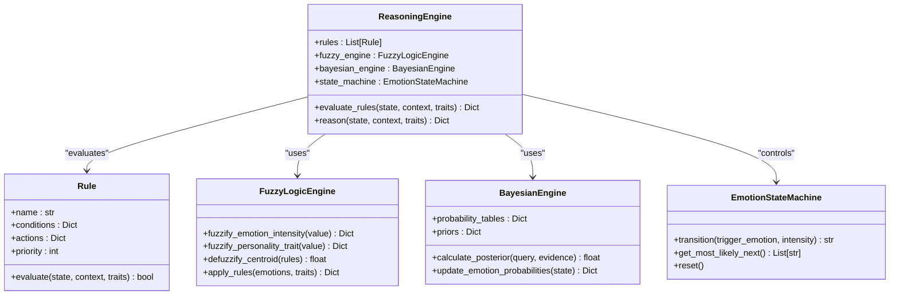

**Diagram sources**
- [reasoning_engine.py:86-204](file://psychologist/emotion_engine/reasoning_engine/reasoning_engine.py#L86-L204)
- [fuzzy_engine.py:4-81](file://psychologist/emotion_engine/fuzzy_logic/fuzzy_engine.py#L4-L81)
- [bayesian_network.py:5-104](file://psychologist/emotion_engine/bayesian_engine/bayesian_network.py#L5-L104)
- [emotion_state_machine.py:5-70](file://psychologist/emotion_engine/state_machine/emotion_state_machine.py#L5-L70)

**Section sources**
- [reasoning_engine.py:8-83](file://psychologist/emotion_engine/reasoning_engine/reasoning_engine.py#L8-L83)
- [reasoning_engine.py:174-204](file://psychologist/emotion_engine/reasoning_engine/reasoning_engine.py#L174-L204)
- [fuzzy_engine.py:28-81](file://psychologist/emotion_engine/fuzzy_logic/fuzzy_engine.py#L28-L81)
- [bayesian_network.py:54-101](file://psychologist/emotion_engine/bayesian_engine/bayesian_network.py#L54-L101)
- [emotion_state_machine.py:52-70](file://psychologist/emotion_engine/state_machine/emotion_state_machine.py#L52-L70)

### Response Generation and Personalization
- ResponseGenerator selects mode-based templates and personalizes responses according to personality traits and context topics.
- Supports multiple response variants and style retrieval.

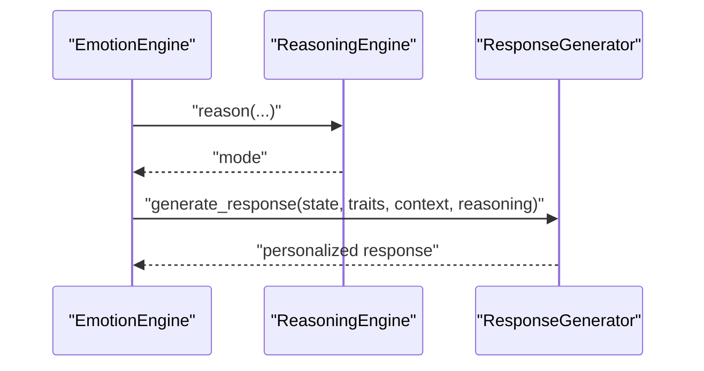

**Diagram sources**
- [emotion_engine.py:75-80](file://psychologist/emotion_engine/emotion_engine.py#L75-L80)
- [reasoning_engine.py:197-204](file://psychologist/emotion_engine/reasoning_engine/reasoning_engine.py#L197-L204)
- [response_generator.py:77-112](file://psychologist/emotion_engine/response_generator/response_generator.py#L77-L112)

**Section sources**
- [response_generator.py:6-122](file://psychologist/emotion_engine/response_generator/response_generator.py#L6-L122)

### Behavior Prediction and Safety Considerations
- BehaviorPredictor estimates escalation risk, recovery time, next likely emotions, engagement, and motivation.
- Provides recommended actions (e.g., intervene vs. monitor) to inform safety and intervention strategies.

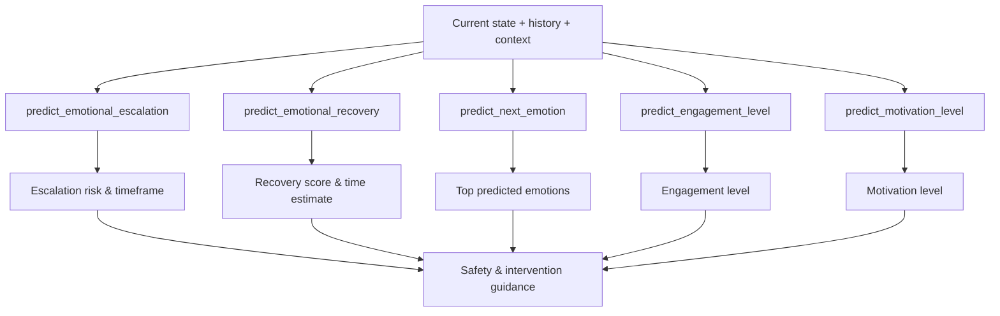

**Diagram sources**
- [behavior_predictor.py:16-132](file://psychologist/emotion_engine/behavior_predictor/behavior_predictor.py#L16-L132)

**Section sources**
- [behavior_predictor.py:7-132](file://psychologist/emotion_engine/behavior_predictor/behavior_predictor.py#L7-L132)

### Multimodal Emotion Inputs (Vision and Voice)
- FacialEmotionDetector: Attempts to detect facial expressions and emotions from images or webcam feeds (optional OpenCV dependency).
- VoiceEmotionAnalyzer: Estimates emotion distribution from audio samples or microphone input (optional NumPy dependency).

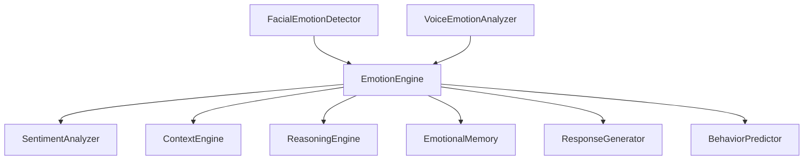

**Diagram sources**
- [facial_emotion_detector.py:9-45](file://psychologist/emotion_engine/computer_vision/facial_emotion_detector.py#L9-L45)
- [voice_emotion_analyzer.py:8-57](file://psychologist/emotion_engine/voice_emotion/voice_emotion_analyzer.py#L8-L57)
- [emotion_engine.py:37-92](file://psychologist/emotion_engine/emotion_engine.py#L37-L92)

**Section sources**
- [facial_emotion_detector.py:1-65](file://psychologist/emotion_engine/computer_vision/facial_emotion_detector.py#L1-L65)
- [voice_emotion_analyzer.py:1-58](file://psychologist/emotion_engine/voice_emotion/voice_emotion_analyzer.py#L1-L58)

## Dependency Analysis
- EmotionEngine depends on all major subsystems and coordinates their outputs.
- ReasoningEngine composes FuzzyLogicEngine, BayesianEngine, and EmotionStateMachine.
- ContextEngine reuses SentimentAnalyzer for sentiment scoring.
- PersonalityEngine and EmotionalMemory are standalone but integrated by EmotionEngine.
- Constants are centralized in system_constants.py to avoid magic numbers.

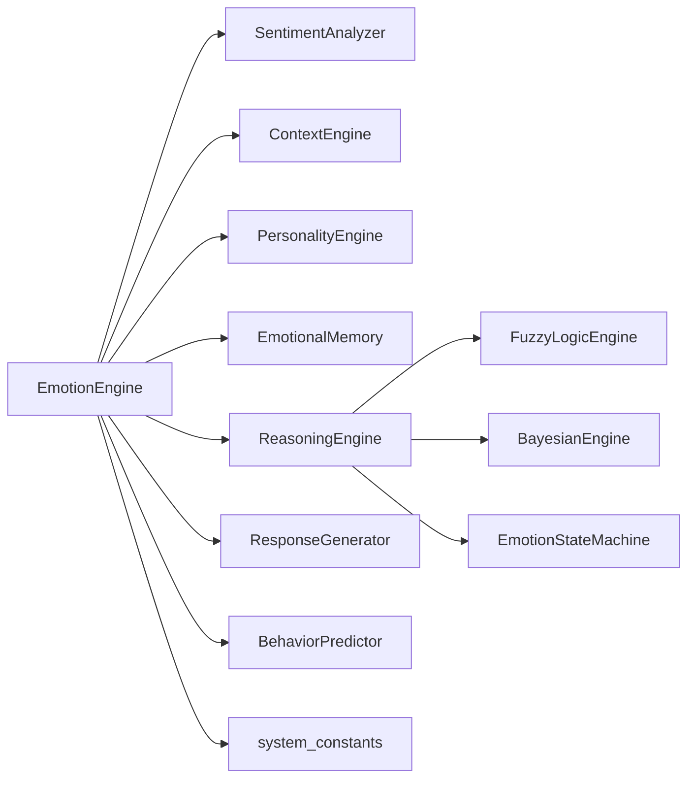

**Diagram sources**
- [emotion_engine.py:23-31](file://psychologist/emotion_engine/emotion_engine.py#L23-L31)
- [reasoning_engine.py:86-92](file://psychologist/emotion_engine/reasoning_engine/reasoning_engine.py#L86-L92)
- [context_engine.py:9-12](file://psychologist/emotion_engine/context_engine/context_engine.py#L9-L12)
- [system_constants.py:12-37](file://psychologist/system_constants.py#L12-L37)

**Section sources**
- [emotion_engine.py:11-20](file://psychologist/emotion_engine/emotion_engine.py#L11-L20)
- [system_constants.py:1-103](file://psychologist/system_constants.py#L1-L103)

## Performance Considerations
- Emotion decay reduces computational load by limiting long histories and preventing unbounded growth.
- Memory limits (short-term and long-term) bound storage and retrieval costs.
- Fuzzy and Bayesian computations are lightweight and operate over small emotion vectors.
- Recommendations:
  - Tune decay factor and history limits via system constants for desired responsiveness vs. stability.
  - Monitor memory usage and adjust max_short_term/max_long_term as needed.
  - Consider caching frequent sentiment and context computations if throughput demands increase.

[No sources needed since this section provides general guidance]

## Troubleshooting Guide
- Missing optional dependencies:
  - OpenCV for facial detection and NumPy for audio analysis are optional. If unavailable, detectors return availability flags and empty emotion maps.
- Symptom: No facial/voice emotion detected
  - Cause: Missing or misconfigured optional libraries
  - Action: Install required packages or disable multimodal inputs
- Symptom: Emotion values remain unchanged
  - Cause: Personality influence or decay factor set extremes
  - Action: Review personality trait values and decay factor in system constants
- Symptom: Responses feel generic
  - Cause: Personality traits not randomized or context topic not detected
  - Action: Randomize traits and ensure input text contains topic keywords

**Section sources**
- [facial_emotion_detector.py:1-6](file://psychologist/emotion_engine/computer_vision/facial_emotion_detector.py#L1-L6)
- [voice_emotion_analyzer.py:1-5](file://psychologist/emotion_engine/voice_emotion/voice_emotion_analyzer.py#L1-L5)
- [personality_engine.py:10-18](file://psychologist/emotion_engine/personality_engine/personality_engine.py#L10-L18)
- [system_constants.py:14](file://psychologist/system_constants.py#L14)

## Conclusion
The Emotion Processing Engine provides a robust, modular framework for multi-modal emotion understanding and response generation. Its layered pipeline integrates sentiment analysis, context awareness, personality-driven influence, memory-backed learning, and predictive modeling. The design enables independent replacement and extension of components while maintaining coherent emotion state management and decay dynamics.