# Flask Backend Architecture

<cite>
**Referenced Files in This Document**
- [app.py](file://psychologist/app.py)
- [run_app.py](file://psychologist/run_app.py)
- [logger.py](file://psychologist/logger.py)
- [rate_limiter.py](file://psychologist/rate_limiter.py)
- [system_constants.py](file://psychologist/system_constants.py)
- [emotion_engine/__init__.py](file://psychologist/emotion_engine/__init__.py)
- [emotion_engine/models.py](file://psychologist/emotion_engine/models.py)
- [emotion_engine/interaction/session_manager.py](file://psychologist/emotion_engine/interaction/session_manager.py)
- [emotion_engine/interaction/interaction_mode_manager.py](file://psychologist/emotion_engine/interaction/interaction_mode_manager.py)
- [emotion_engine/interaction/text_mode_handler.py](file://psychologist/emotion_engine/interaction/text_mode_handler.py)
- [frontend/index.html](file://psychologist/frontend/index.html)
- [frontend/script.js](file://psychologist/frontend/script.js)
- [config/interaction_config.yaml](file://psychologist/config/interaction_config.yaml)
- [config/safety_config.yaml](file://psychologist/config/safety_config.yaml)
</cite>

## Table of Contents
1. [Introduction](#introduction)
2. [Project Structure](#project-structure)
3. [Core Components](#core-components)
4. [Architecture Overview](#architecture-overview)
5. [Detailed Component Analysis](#detailed-component-analysis)
6. [Dependency Analysis](#dependency-analysis)
7. [Performance Considerations](#performance-considerations)
8. [Troubleshooting Guide](#troubleshooting-guide)
9. [Conclusion](#conclusion)

## Introduction
This document describes the Flask backend architecture for the psychological support companion. It covers centralized routing, error handling, middleware configuration, application initialization (including CORS, logging, and component instantiation), modular endpoint organization, rate limiting, input validation, error handling patterns, health checks, static file serving for the frontend, and the observer pattern implementation for activity monitoring across subsystems.

## Project Structure
The backend is organized around a central Flask application that orchestrates emotion processing, SCEA operations, voice management, interaction handling, session management, and support tools. The frontend is served statically from the `frontend` directory. Configuration is managed via YAML files and system constants.

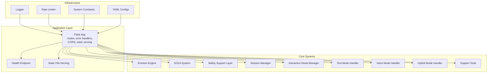

**Diagram sources**
- [app.py:22-551](file://psychologist/app.py#L22-L551)
- [logger.py:18-72](file://psychologist/logger.py#L18-L72)
- [rate_limiter.py:74-143](file://psychologist/rate_limiter.py#L74-L143)
- [system_constants.py:12-103](file://psychologist/system_constants.py#L12-L103)
- [config/interaction_config.yaml:1-60](file://psychologist/config/interaction_config.yaml#L1-L60)
- [config/safety_config.yaml:1-116](file://psychologist/config/safety_config.yaml#L1-L116)

**Section sources**
- [app.py:22-551](file://psychologist/app.py#L22-L551)

## Core Components
- Central Flask application with CORS enabled and structured error handlers.
- Emotion engine and personality management endpoints.
- SCEA step and interaction endpoints.
- Voice output endpoints (when available) with rate limits.
- Interaction endpoints for text, voice, and hybrid modes with session management.
- Session management for persistence and analytics.
- Support tools endpoints for calming, breathing, journaling, reflection, mood check-in, and session summary.
- Safety assessment and filtering integrated into interaction flows.
- Rate limiting and input validation utilities.
- Centralized logging and system constants.

**Section sources**
- [app.py:25-551](file://psychologist/app.py#L25-L551)
- [rate_limiter.py:74-143](file://psychologist/rate_limiter.py#L74-L143)
- [logger.py:18-72](file://psychologist/logger.py#L18-L72)
- [system_constants.py:12-103](file://psychologist/system_constants.py#L12-L103)

## Architecture Overview
The Flask application initializes subsystems, sets up activity callbacks for monitoring, and exposes modular endpoints grouped by domain. The frontend is served statically from the `frontend` directory. Logging and rate limiting are applied centrally.

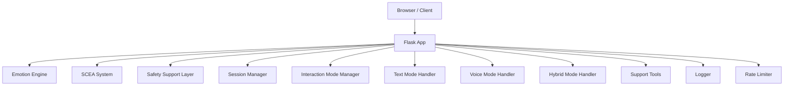

**Diagram sources**
- [app.py:60-150](file://psychologist/app.py#L60-L150)
- [app.py:159-526](file://psychologist/app.py#L159-L526)
- [logger.py:18-72](file://psychologist/logger.py#L18-L72)
- [rate_limiter.py:74-143](file://psychologist/rate_limiter.py#L74-L143)

## Detailed Component Analysis

### Application Initialization and Middleware
- Flask app creation with static folder pointing to `frontend`.
- CORS enabled globally.
- Structured error handlers for common HTTP errors and rate limiting.
- Health check endpoint returns availability of voice subsystems.
- Centralized logging setup via `logger.setup_logging()` executed before importing the app module.
- Environment-driven host, port, and debug flags.

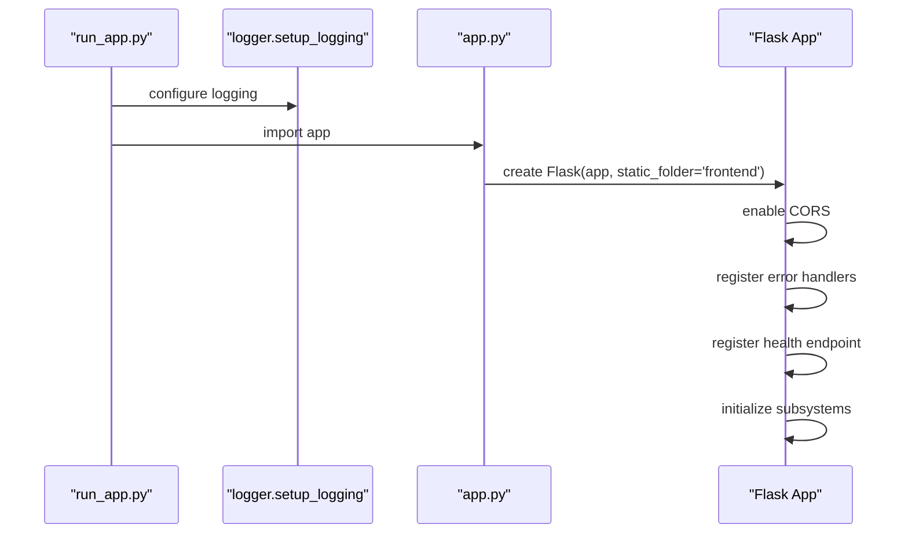

**Diagram sources**
- [run_app.py:10-27](file://psychologist/run_app.py#L10-L27)
- [app.py:22-551](file://psychologist/app.py#L22-L551)
- [logger.py:18-72](file://psychologist/logger.py#L18-L72)

**Section sources**
- [run_app.py:10-27](file://psychologist/run_app.py#L10-L27)
- [app.py:22-551](file://psychologist/app.py#L22-L551)
- [logger.py:18-72](file://psychologist/logger.py#L18-L72)

### Centralized Routing and Endpoints
- Emotion endpoints: process, state, personality (get/set), memory, reset.
- SCEA endpoints: step, interact.
- Voice output endpoints: speak, stop, replay, status (conditional availability).
- Interaction endpoints: message, voice start/stop/status/level, mode switch/get, session start/end/current/history.
- Support tools: calm, breathing, journal, reflection, mood-checkin, summary.
- Safety status endpoint.
- Static file serving for frontend.

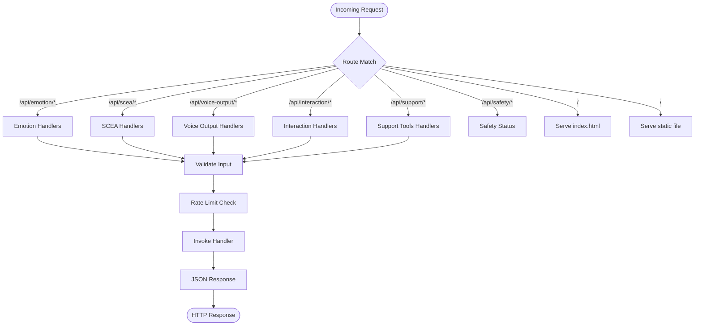

**Diagram sources**
- [app.py:159-526](file://psychologist/app.py#L159-L526)
- [rate_limiter.py:74-143](file://psychologist/rate_limiter.py#L74-L143)

**Section sources**
- [app.py:159-526](file://psychologist/app.py#L159-L526)

### Emotion Processing Module
- EmotionEngine instantiated and exposed via endpoints.
- Personality traits GET/POST endpoints backed by `PersonalityTraits` dataclass.
- Memory and state endpoints for introspection and reset.

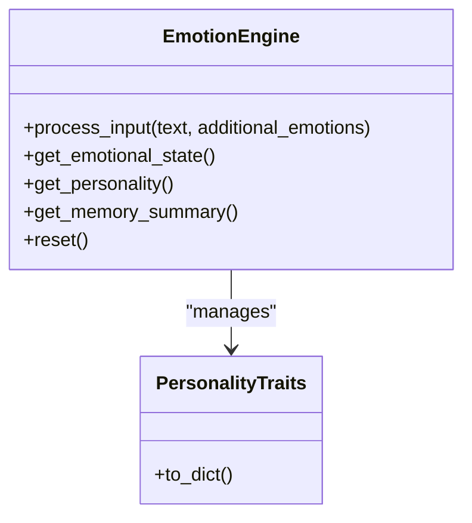

**Diagram sources**
- [app.py:60-61](file://psychologist/app.py#L60-L61)
- [emotion_engine/models.py:80-110](file://psychologist/emotion_engine/models.py#L80-L110)

**Section sources**
- [app.py:159-204](file://psychologist/app.py#L159-L204)
- [emotion_engine/models.py:80-110](file://psychologist/emotion_engine/models.py#L80-L110)

### SCEA Operations Module
- SCEA system instantiated and exposed via step and interact endpoints.
- Triggers and experiences passed as JSON payload.

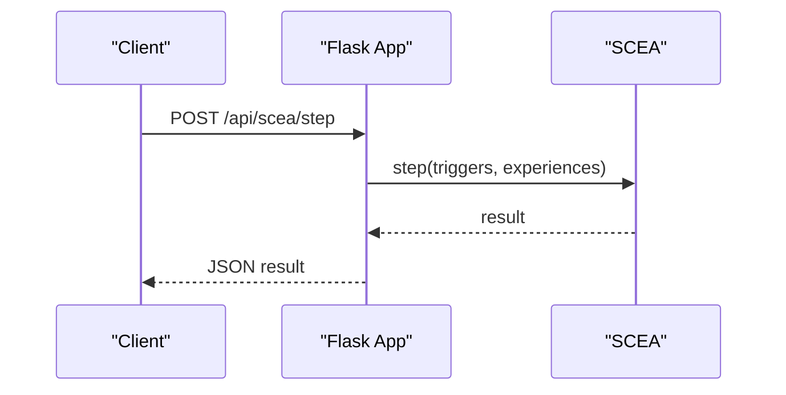

**Diagram sources**
- [app.py:205-219](file://psychologist/app.py#L205-L219)

**Section sources**
- [app.py:205-237](file://psychologist/app.py#L205-L237)

### Voice Management Module
- Voice output: TTS manager initialized with a single locked voice; endpoints conditionally available.
- Voice input: STT manager initialized with engines; endpoints conditionally available.
- Voice emotion: feature extraction, emotion detection, fusion components conditionally available.
- Activity monitoring: callbacks registered across voice subsystems.

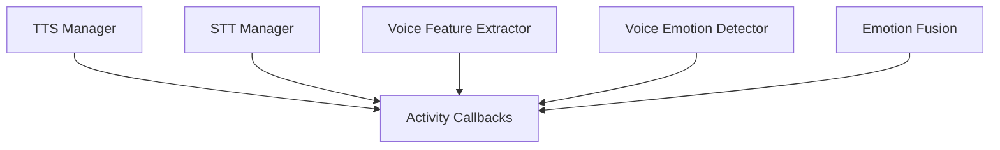

**Diagram sources**
- [app.py:73-119](file://psychologist/app.py#L73-L119)

**Section sources**
- [app.py:240-287](file://psychologist/app.py#L240-L287)
- [app.py:337-424](file://psychologist/app.py#L337-L424)
- [app.py:404-434](file://psychologist/app.py#L404-L434)

### Interaction Handling and Session Management
- InteractionModeManager controls mode switching and configuration.
- SessionManager manages session lifecycle, persistence, and analytics.
- TextModeHandler orchestrates text-based interaction with safety checks and optional TTS.
- VoiceModeHandler and HybridModeHandler orchestrate voice-based flows.
- SupportTools provides crisis and wellness tools.

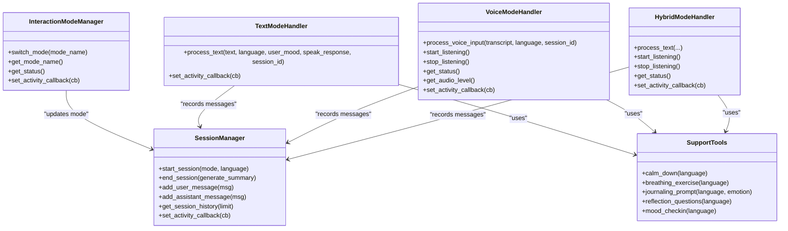

**Diagram sources**
- [emotion_engine/interaction/interaction_mode_manager.py:17-166](file://psychologist/emotion_engine/interaction/interaction_mode_manager.py#L17-L166)
- [emotion_engine/interaction/session_manager.py:26-303](file://psychologist/emotion_engine/interaction/session_manager.py#L26-L303)
- [emotion_engine/interaction/text_mode_handler.py:23-170](file://psychologist/emotion_engine/interaction/text_mode_handler.py#L23-L170)

**Section sources**
- [app.py:288-526](file://psychologist/app.py#L288-L526)
- [emotion_engine/interaction/interaction_mode_manager.py:17-166](file://psychologist/emotion_engine/interaction/interaction_mode_manager.py#L17-L166)
- [emotion_engine/interaction/session_manager.py:26-303](file://psychologist/emotion_engine/interaction/session_manager.py#L26-L303)
- [emotion_engine/interaction/text_mode_handler.py:23-170](file://psychologist/emotion_engine/interaction/text_mode_handler.py#L23-L170)

### Rate Limiting Implementation
- Token-bucket sliding window per client IP.
- Decorator factory applies rate limits to routes.
- Validation utility ensures safe text input lengths and formats.

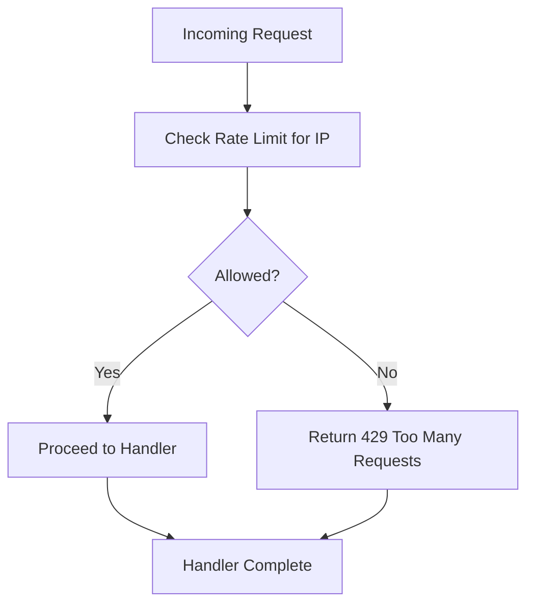

**Diagram sources**
- [rate_limiter.py:22-113](file://psychologist/rate_limiter.py#L22-L113)

**Section sources**
- [rate_limiter.py:74-143](file://psychologist/rate_limiter.py#L74-L143)

### Input Validation and Error Handling Patterns
- Centralized validation for text input with configurable max length.
- Structured error handlers for 400, 404, 405, 429, and 500.
- Safety assessment and filtering integrated into interaction flows.
- Strict rate limits for write-heavy endpoints.

**Section sources**
- [rate_limiter.py:115-143](file://psychologist/rate_limiter.py#L115-L143)
- [app.py:27-46](file://psychologist/app.py#L27-L46)
- [app.py:290-335](file://psychologist/app.py#L290-L335)

### Health Check and Static File Serving
- Health endpoint reports voice subsystem availability and returns basic status.
- Static file serving for frontend index and other assets.

**Section sources**
- [app.py:48-58](file://psychologist/app.py#L48-L58)
- [app.py:151-158](file://psychologist/app.py#L151-L158)

### Observer Pattern for Activity Monitoring
- Global activity log maintained and updated by handlers.
- All major components register activity callbacks to log events consistently.

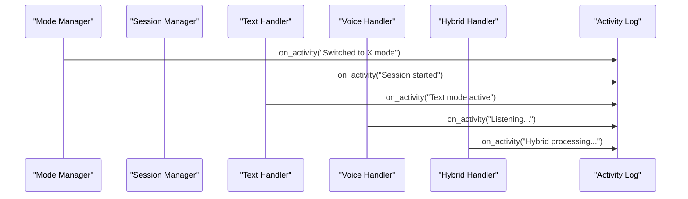

**Diagram sources**
- [app.py:69-149](file://psychologist/app.py#L69-L149)

**Section sources**
- [app.py:69-149](file://psychologist/app.py#L69-L149)

## Dependency Analysis
- The Flask app depends on subsystems for emotion processing, SCEA, voice, interaction, and support tools.
- Centralized logging and rate limiting are cross-cutting concerns.
- Configuration is externalized via YAML and system constants.

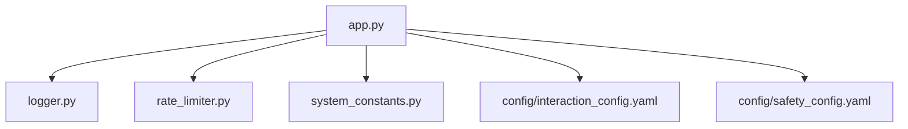

**Diagram sources**
- [app.py:6-18](file://psychologist/app.py#L6-L18)
- [logger.py:18-72](file://psychologist/logger.py#L18-L72)
- [rate_limiter.py:74-143](file://psychologist/rate_limiter.py#L74-L143)
- [system_constants.py:12-103](file://psychologist/system_constants.py#L12-L103)
- [config/interaction_config.yaml:1-60](file://psychologist/config/interaction_config.yaml#L1-L60)
- [config/safety_config.yaml:1-116](file://psychologist/config/safety_config.yaml#L1-L116)

**Section sources**
- [app.py:6-18](file://psychologist/app.py#L6-L18)
- [system_constants.py:12-103](file://psychologist/system_constants.py#L12-L103)

## Performance Considerations
- In-memory rate limiting is efficient for single-process deployments but unsuitable for multi-process scaling without a shared backend.
- Centralized logging avoids overhead by configuring a single root logger and preventing propagation.
- Static file serving minimizes dynamic processing for frontend assets.
- Consider moving rate limiting to a shared cache for horizontal scaling.

## Troubleshooting Guide
- Health endpoint indicates subsystem availability; if voice endpoints return 501, verify voice subsystem initialization.
- Structured error responses provide actionable messages for invalid input, rate limiting, and internal errors.
- Logging is configured at startup; ensure logs are visible to diagnose initialization failures.

**Section sources**
- [app.py:48-58](file://psychologist/app.py#L48-L58)
- [app.py:27-46](file://psychologist/app.py#L27-L46)
- [run_app.py:10-27](file://psychologist/run_app.py#L10-L27)

## Conclusion
The Flask backend provides a centralized, modular architecture for emotion processing, SCEA operations, voice management, interaction handling, session management, and support tools. It integrates robust logging, rate limiting, input validation, and a consistent observer pattern for activity monitoring. The design emphasizes offline-first operation, static frontend serving, and clear separation of concerns across subsystems.