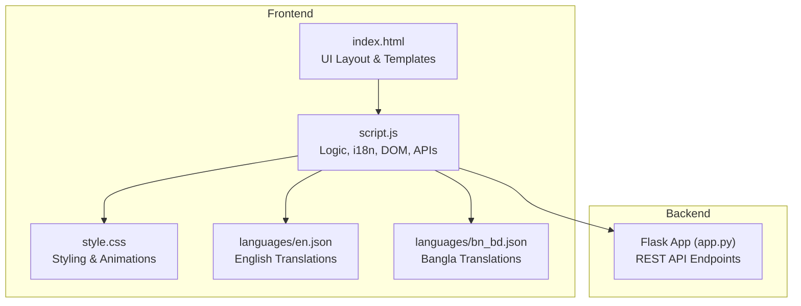
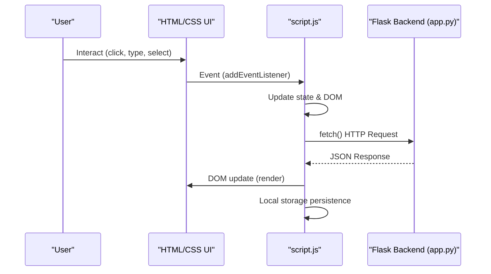
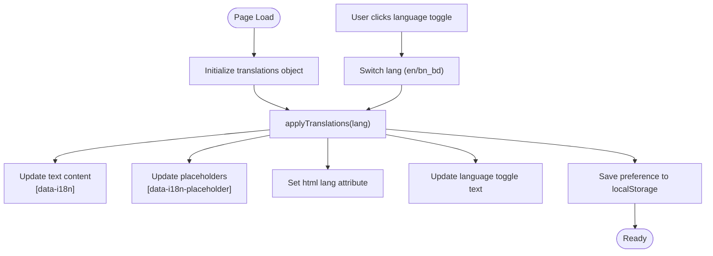
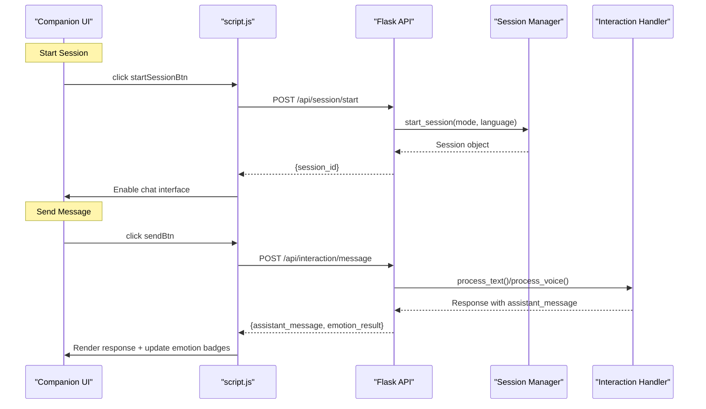
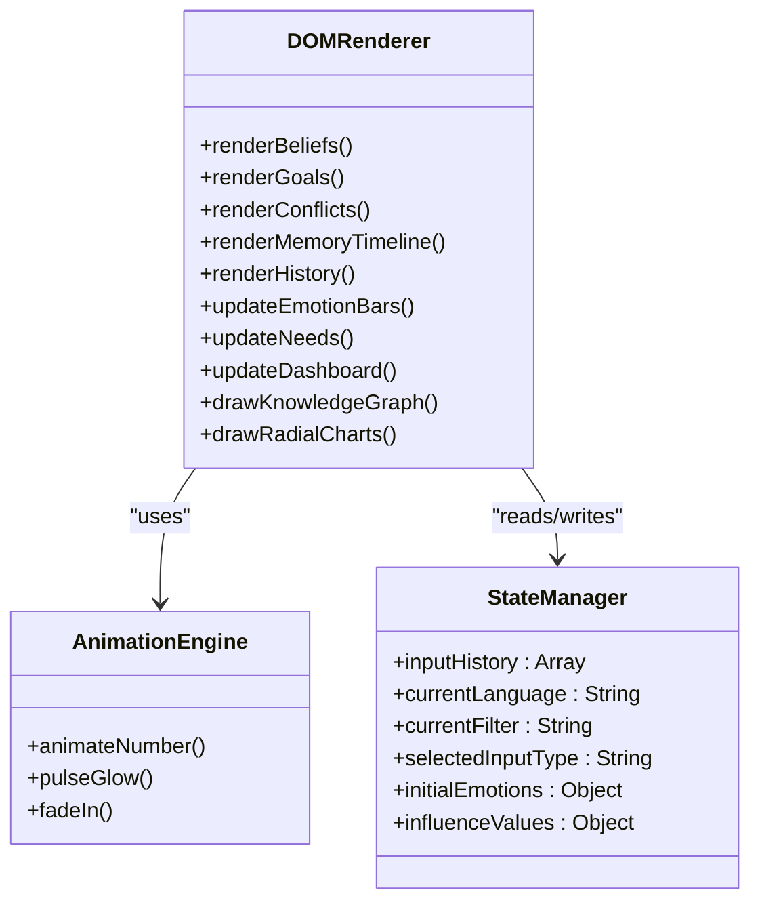
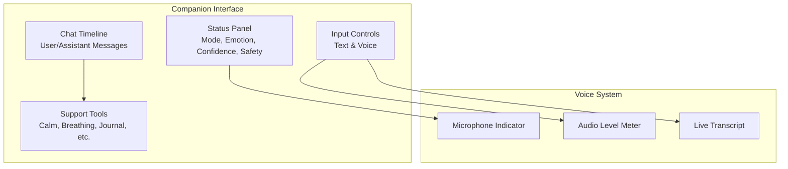
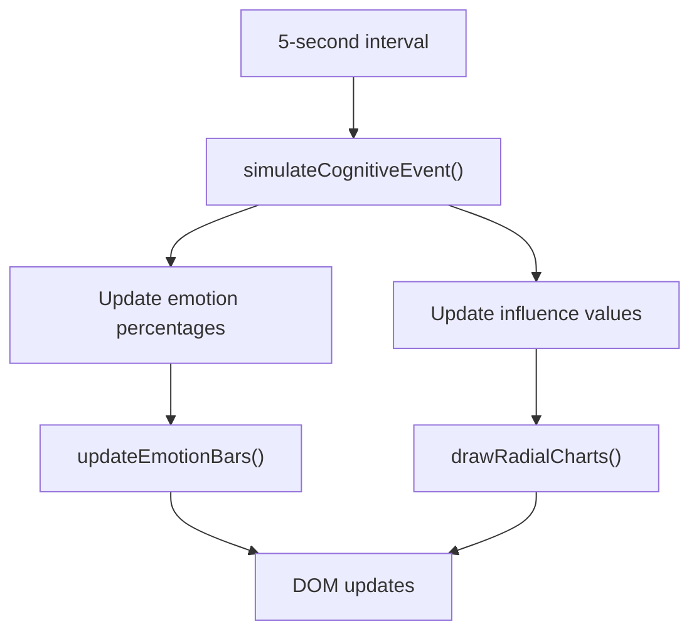
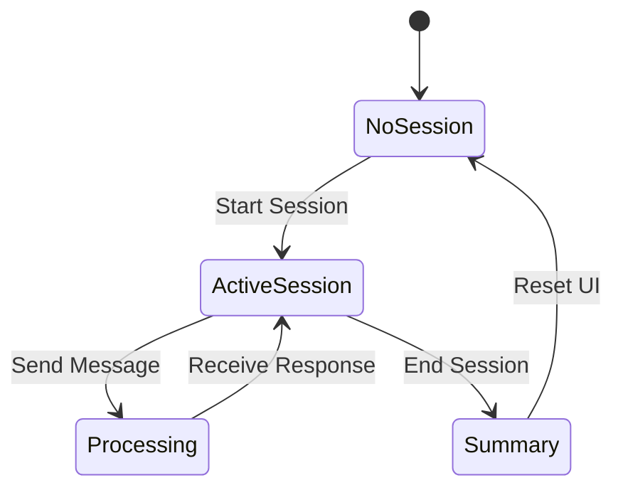
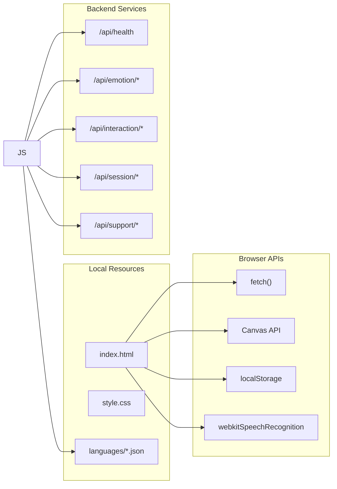

# Frontend Web Architecture

<cite>
**Referenced Files in This Document**
- [index.html](file://psychologist/frontend/index.html)
- [script.js](file://psychologist/frontend/script.js)
- [style.css](file://psychologist/frontend/style.css)
- [en.json](file://psychologist/frontend/languages/en.json)
- [bn_bd.json](file://psychologist/frontend/languages/bn_bd.json)
- [app.py](file://psychologist/app.py)
</cite>

## Table of Contents
1. [Introduction](#introduction)
2. [Project Structure](#project-structure)
3. [Core Components](#core-components)
4. [Architecture Overview](#architecture-overview)
5. [Detailed Component Analysis](#detailed-component-analysis)
6. [Dependency Analysis](#dependency-analysis)
7. [Performance Considerations](#performance-considerations)
8. [Troubleshooting Guide](#troubleshooting-guide)
9. [Conclusion](#conclusion)

## Introduction
This document describes the Web Interface subsystem of the Psychologist project, focusing on the frontend architecture built with HTML, CSS, and JavaScript. The interface supports bilingual operation (English and Bangla), real-time communication with the Flask backend, dynamic DOM manipulation, and a comprehensive emotional support companion. It covers user interaction controls, real-time emotional state visualization, voice input indicators, session management, event handling patterns, API integration, and responsive design implementation.

## Project Structure
The frontend is organized around three primary files:
- index.html: Defines the complete UI layout, semantic sections, and data attributes for internationalization
- script.js: Implements client-side logic, i18n system, DOM rendering, real-time updates, and API integration
- style.css: Provides dark-themed, glass-morphism UI with responsive grid layouts and animations
- languages/: Contains JSON translation files for English and Bangla

**Diagram sources**
- [index.html](file://psychologist/frontend/index.html)
- [script.js](file://psychologist/frontend/script.js)
- [style.css](file://psychologist/frontend/style.css)
- [en.json](file://psychologist/frontend/languages/en.json)
- [bn_bd.json](file://psychologist/frontend/languages/bn_bd.json)
- [app.py](file://psychologist/app.py)

**Section sources**
- [index.html](file://psychologist/frontend/index.html)
- [script.js](file://psychologist/frontend/script.js)
- [style.css](file://psychologist/frontend/style.css)
- [en.json](file://psychologist/frontend/languages/en.json)
- [bn_bd.json](file://psychologist/frontend/languages/bn_bd.json)

## Core Components
The frontend comprises several major components:

- **Top Status Bar**: Displays system status, clock, step counter, cognitive energy bar, and language toggle
- **Sidebar Navigation**: Section navigation with active state management
- **Main Dashboard**: Real-time cognitive state cards, dominant emotion display, and system metrics
- **Emotion Panel**: Interactive emotion sliders with animated progress bars
- **Internal Needs**: Need strength visualization with gradient fills
- **Belief System**: Filterable belief list with badges and confidence indicators
- **Goal Generation**: Goal cards with status tags and priority indicators
- **Cognitive Conflicts**: Conflict visualization between opposing forces
- **Self-Identity**: Identity metrics dashboard
- **Memory Timeline**: Chronological event display with timeline visualization
- **Knowledge Graph**: Canvas-based graph visualization
- **Internal Debate**: Agent card displays for internal dialogue
- **Simulation Panel**: Future scenario simulation with risk/reward scoring
- **Input History**: Searchable, filterable input history with impact metrics
- **Emotional Support Companion**: Full-featured chat interface with session management, voice input, safety monitoring, and support tools
- **Interaction Console**: Real-time thought stream, input classification, emotion injection controls, processing flow, and response analysis

**Section sources**
- [index.html](file://psychologist/frontend/index.html)
- [script.js](file://psychologist/frontend/script.js)

## Architecture Overview
The frontend follows a modular, event-driven architecture with clear separation of concerns:

**Diagram sources**
- [script.js](file://psychologist/frontend/script.js)
- [app.py](file://psychologist/app.py)

The architecture emphasizes:
- **Event-Driven Updates**: All UI changes occur via event handlers and DOM manipulation
- **Real-Time Communication**: Periodic polling for voice levels and periodic updates for simulated cognitive events
- **Bilingual Localization**: Embedded translation system with runtime switching
- **Session Management**: Persistent session state across companion interactions
- **Responsive Design**: CSS Grid and Flexbox layouts adapting to viewport

**Section sources**
- [script.js](file://psychologist/frontend/script.js)
- [app.py](file://psychologist/app.py)

## Detailed Component Analysis

### Bilingual Localization System
The frontend implements a comprehensive i18n system with embedded translations and runtime switching:

**Diagram sources**
- [script.js](file://psychologist/frontend/script.js)

Key features:
- Embedded translation dictionaries in script.js
- Fallback to English for missing keys
- Runtime language switching with immediate UI updates
- HTML lang attribute adjustment for accessibility
- Local storage persistence of language preference

**Section sources**
- [script.js](file://psychologist/frontend/script.js)
- [en.json](file://psychologist/frontend/languages/en.json)
- [bn_bd.json](file://psychologist/frontend/languages/bn_bd.json)

### Real-Time Communication Patterns
The frontend communicates with the Flask backend through RESTful endpoints:

**Diagram sources**
- [script.js](file://psychologist/frontend/script.js)
- [app.py](file://psychologist/app.py)

Communication patterns include:
- Session lifecycle management (start/end)
- Mode switching (text/voice/hybrid)
- Voice input streaming with level polling
- Safety monitoring integration
- Support tool invocation

**Section sources**
- [script.js](file://psychologist/frontend/script.js)
- [app.py](file://psychologist/app.py)

### DOM Manipulation and Dynamic Updates
The frontend employs sophisticated DOM manipulation for real-time updates:

**Diagram sources**
- [script.js](file://psychologist/frontend/script.js)

Implementation highlights:
- Canvas-based visualizations for knowledge graph and radial charts
- Animated number transitions for metrics and percentages
- Dynamic grid layouts with CSS Grid and Flexbox
- Real-time thought stream generation with timestamped entries
- Responsive layout adaptation for different screen sizes

**Section sources**
- [script.js](file://psychologist/frontend/script.js)
- [style.css](file://psychologist/frontend/style.css)

### User Interface Components and Interactions

#### Emotional Support Companion
The companion provides a comprehensive therapeutic interface:

**Diagram sources**
- [index.html](file://psychologist/frontend/index.html)
- [script.js](file://psychologist/frontend/script.js)

Key features:
- Three interaction modes with mode-specific UI visibility
- Session lifecycle with automatic start/stop
- Voice input with push-to-talk and continuous modes
- Audio level visualization during recording
- Safety state monitoring with color-coded badges
- Support tools for self-soothing and reflection

**Section sources**
- [index.html](file://psychologist/frontend/index.html)
- [script.js](file://psychologist/frontend/script.js)

#### Real-Time Dashboard
The dashboard continuously updates cognitive metrics:

**Diagram sources**
- [script.js](file://psychologist/frontend/script.js)

**Section sources**
- [script.js](file://psychologist/frontend/script.js)

### Session Management Features
The frontend maintains persistent session state across interactions:

**Diagram sources**
- [script.js](file://psychologist/frontend/script.js)

Features include:
- Automatic session creation for first interaction
- Session ID persistence for backend correlation
- Message history preservation in chat container
- Emotion state synchronization
- Safety flag monitoring and display

**Section sources**
- [script.js](file://psychologist/frontend/script.js)

## Dependency Analysis
The frontend has minimal external dependencies, relying primarily on browser APIs and local resources:

**Diagram sources**
- [script.js](file://psychologist/frontend/script.js)
- [app.py](file://psychologist/app.py)

**Section sources**
- [script.js](file://psychologist/frontend/script.js)
- [app.py](file://psychologist/app.py)

## Performance Considerations
The frontend is optimized for smooth real-time updates:

- **Efficient DOM Updates**: Batched updates and selective re-rendering minimize layout thrashing
- **Canvas Optimizations**: Canvas drawing deferred until needed (e.g., knowledge graph tab activation)
- **Animation Performance**: requestAnimationFrame-based number animations with appropriate easing
- **Memory Management**: Thought stream limits to prevent unbounded growth
- **Network Efficiency**: Minimal API calls with polling only for voice levels
- **Responsive Design**: CSS Grid and Flexbox reduce JavaScript layout calculations

## Troubleshooting Guide
Common issues and solutions:

### Language Toggle Not Working
- Verify localStorage availability
- Check translation keys exist in both JSON files
- Ensure HTML lang attribute updates correctly

### Voice Input Issues
- Confirm webkitSpeechRecognition availability
- Verify microphone permissions
- Check audio level polling intervals

### API Communication Failures
- Monitor network tab for CORS errors
- Verify Flask backend is running
- Check rate limit thresholds

### Canvas Rendering Problems
- Ensure canvas dimensions are set before drawing
- Verify tab activation triggers redraw
- Check for cross-origin resource sharing issues

**Section sources**
- [script.js](file://psychologist/frontend/script.js)
- [app.py](file://psychologist/app.py)

## Conclusion
The Web Interface subsystem demonstrates a mature, event-driven architecture that effectively combines real-time communication, dynamic UI updates, and comprehensive bilingual support. The modular design enables maintainable development while the responsive layout ensures accessibility across device types. The integration with the Flask backend provides robust session management and therapeutic interaction capabilities, making it suitable for deployment in clinical and personal wellness contexts.