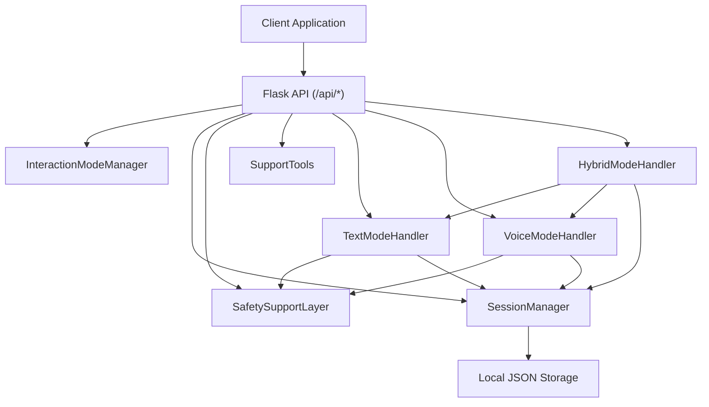
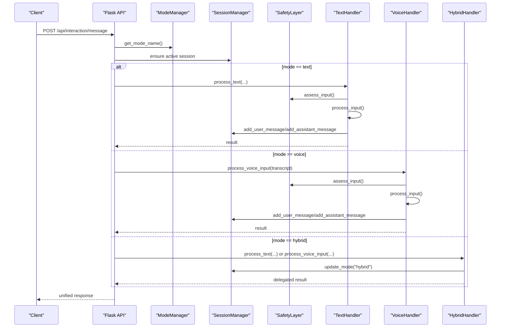
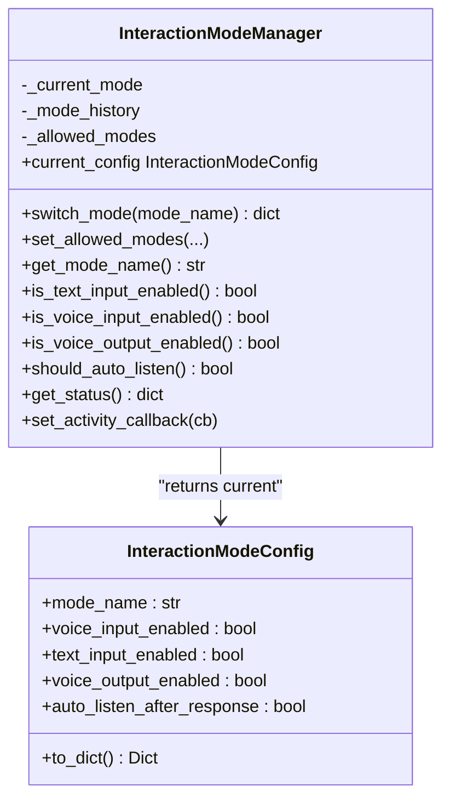
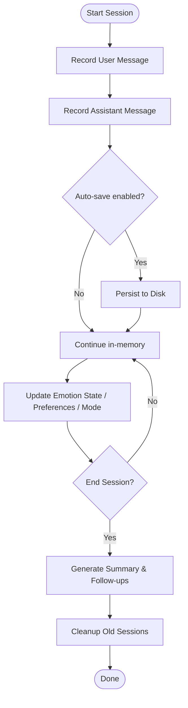
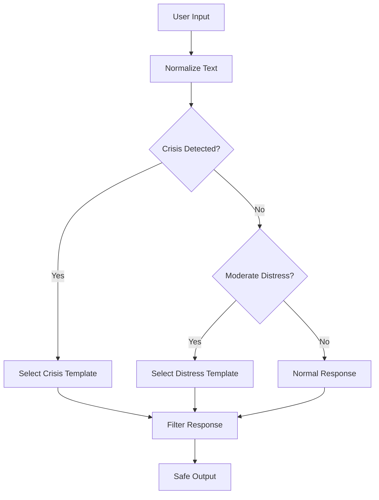
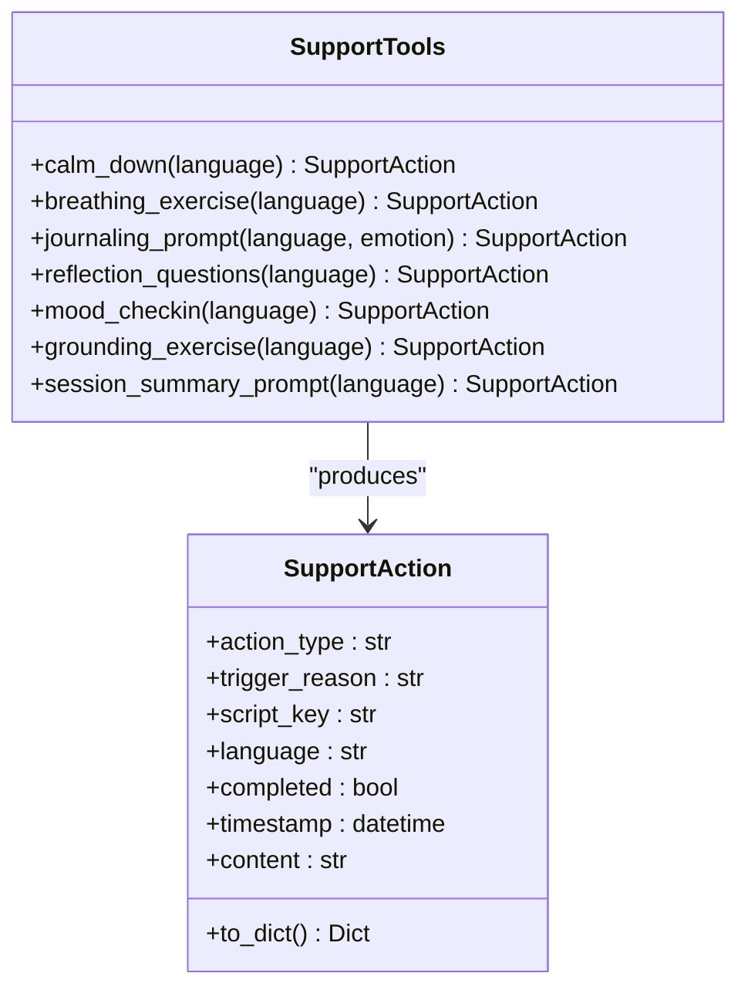
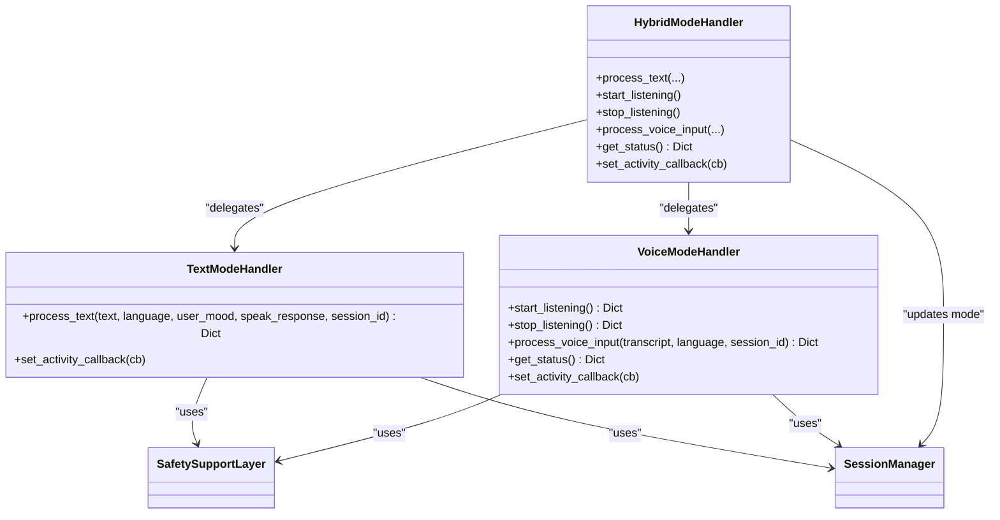
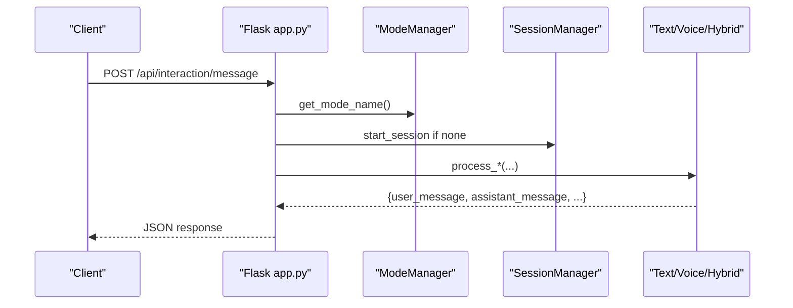
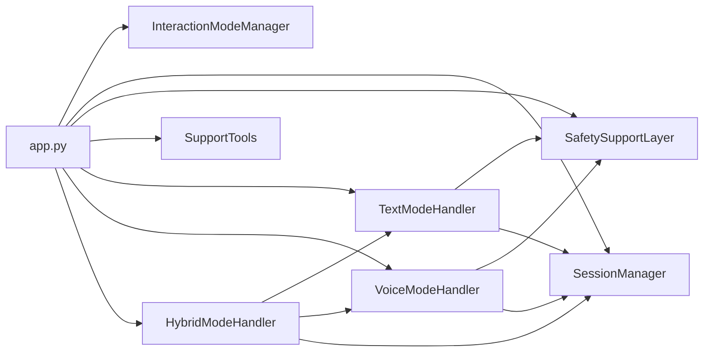

# Interaction Management Architecture

<cite>
**Referenced Files in This Document**
- [app.py](file://app.py)
- [API.md](file://docs/API.md)
- [interaction_mode_manager.py](file://psychologist/emotion_engine/interaction/interaction_mode_manager.py)
- [session_manager.py](file://psychologist/emotion_engine/interaction/session_manager.py)
- [text_mode_handler.py](file://psychologist/emotion_engine/interaction/text_mode_handler.py)
- [voice_mode_handler.py](file://psychologist/emotion_engine/interaction/voice_mode_handler.py)
- [hybrid_mode_handler.py](file://psychologist/emotion_engine/interaction/hybrid_mode_handler.py)
- [safety_support_layer.py](file://psychologist/emotion_engine/interaction/safety_support_layer.py)
- [support_tools.py](file://psychologist/emotion_engine/interaction/support_tools.py)
- [interaction_models.py](file://psychologist/emotion_engine/interaction/interaction_models.py)
- [interaction_config.yaml](file://psychologist/config/interaction_config.yaml)
- [safety_config.yaml](file://psychologist/config/safety_config.yaml)
- [system_constants.py](file://psychologist/system_constants.py)
</cite>

## Table of Contents
1. [Introduction](#introduction)
2. [Project Structure](#project-structure)
3. [Core Components](#core-components)
4. [Architecture Overview](#architecture-overview)
5. [Detailed Component Analysis](#detailed-component-analysis)
6. [Dependency Analysis](#dependency-analysis)
7. [Performance Considerations](#performance-considerations)
8. [Troubleshooting Guide](#troubleshooting-guide)
9. [Conclusion](#conclusion)

## Introduction
This document describes the Interaction Management subsystem that powers dual-mode (text, voice, hybrid) interaction for an offline emotional support companion. It explains the mode-switching architecture, session lifecycle and persistence, safety support integration, support tools coordination, activity monitoring, and the handler pattern that abstracts mode differences behind a unified API.

## Project Structure
The Interaction Management subsystem resides under the emotion_engine.interaction package and integrates with the Flask application entry point. The key modules are:
- Mode manager: orchestrates mode selection and configuration
- Handlers: text, voice, and hybrid pipelines
- Session manager: lifecycle, persistence, and analytics
- Safety support layer: keyword-based risk detection and safe responses
- Support tools: curated scripts for grounding and reflection
- Data models: shared enums and DTOs
- Configuration: YAML and system constants
- API: unified endpoints for clients

**Diagram sources**
- [app.py:84-150](file://app.py#L84-L150)
- [interaction_mode_manager.py:17-166](file://psychologist/emotion_engine/interaction/interaction_mode_manager.py#L17-L166)
- [session_manager.py:26-303](file://psychologist/emotion_engine/interaction/session_manager.py#L26-L303)
- [text_mode_handler.py:23-170](file://psychologist/emotion_engine/interaction/text_mode_handler.py#L23-L170)
- [voice_mode_handler.py:28-305](file://psychologist/emotion_engine/interaction/voice_mode_handler.py#L28-L305)
- [hybrid_mode_handler.py:18-120](file://psychologist/emotion_engine/interaction/hybrid_mode_handler.py#L18-L120)
- [safety_support_layer.py:24-286](file://psychologist/emotion_engine/interaction/safety_support_layer.py#L24-L286)
- [support_tools.py:19-179](file://psychologist/emotion_engine/interaction/support_tools.py#L19-L179)

**Section sources**
- [app.py:84-150](file://app.py#L84-L150)
- [API.md:264-402](file://docs/API.md#L264-L402)

## Core Components
- InteractionModeManager: central controller for mode state, transitions, and configuration
- TextModeHandler: text-only pipeline with normalization, safety, emotion analysis, response generation, optional TTS, and session recording
- VoiceModeHandler: voice-to-text pipeline with STT, voice emotion features, fusion, safety, response generation, TTS, and session recording
- HybridModeHandler: delegates to text or voice handlers while preserving session continuity
- SessionManager: creates, updates, persists, and queries sessions; generates summaries and follow-ups
- SafetySupportLayer: keyword-based risk detection, safe templates, and response filtering
- SupportTools: curated scripts for calming, breathing, journaling, reflection, mood check-in, grounding, and session summary
- Data models: enums and DTOs for modes, messages, sessions, safety assessments, and support actions
- Configuration: YAML and system constants define defaults and limits

**Section sources**
- [interaction_mode_manager.py:17-166](file://psychologist/emotion_engine/interaction/interaction_mode_manager.py#L17-L166)
- [text_mode_handler.py:23-170](file://psychologist/emotion_engine/interaction/text_mode_handler.py#L23-L170)
- [voice_mode_handler.py:28-305](file://psychologist/emotion_engine/interaction/voice_mode_handler.py#L28-L305)
- [hybrid_mode_handler.py:18-120](file://psychologist/emotion_engine/interaction/hybrid_mode_handler.py#L18-L120)
- [session_manager.py:26-303](file://psychologist/emotion_engine/interaction/session_manager.py#L26-L303)
- [safety_support_layer.py:24-286](file://psychologist/emotion_engine/interaction/safety_support_layer.py#L24-L286)
- [support_tools.py:19-179](file://psychologist/emotion_engine/interaction/support_tools.py#L19-L179)
- [interaction_models.py:15-309](file://psychologist/emotion_engine/interaction/interaction_models.py#L15-L309)
- [interaction_config.yaml:1-60](file://psychologist/config/interaction_config.yaml#L1-L60)
- [system_constants.py:63-82](file://psychologist/system_constants.py#L63-L82)

## Architecture Overview
The system exposes a unified API that routes requests to the appropriate handler based on the current mode. Handlers share common collaborators (safety, session manager) while adapting to input modalities. The mode manager governs allowed modes and emits activity events. Sessions persist automatically and can be summarized and queried.

**Diagram sources**
- [app.py:288-448](file://app.py#L288-L448)
- [interaction_mode_manager.py:57-101](file://psychologist/emotion_engine/interaction/interaction_mode_manager.py#L57-L101)
- [session_manager.py:59-92](file://psychologist/emotion_engine/interaction/session_manager.py#L59-L92)
- [text_mode_handler.py:52-158](file://psychologist/emotion_engine/interaction/text_mode_handler.py#L52-L158)
- [voice_mode_handler.py:145-277](file://psychologist/emotion_engine/interaction/voice_mode_handler.py#L145-L277)
- [hybrid_mode_handler.py:48-94](file://psychologist/emotion_engine/interaction/hybrid_mode_handler.py#L48-L94)

## Detailed Component Analysis

### Mode-Switching Architecture
The InteractionModeManager encapsulates mode state and transitions. It validates requested modes, maintains allowed modes, and logs activity. Each mode carries a configuration indicating input/output capabilities and behavior flags.

**Diagram sources**
- [interaction_mode_manager.py:17-166](file://psychologist/emotion_engine/interaction/interaction_mode_manager.py#L17-L166)
- [interaction_models.py:71-87](file://psychologist/emotion_engine/interaction/interaction_models.py#L71-L87)

Key behaviors:
- Allowed modes are configurable at runtime
- Mode switching returns a status dictionary with previous/current mode and new config
- Activity callbacks are propagated for monitoring

**Section sources**
- [interaction_mode_manager.py:45-144](file://psychologist/emotion_engine/interaction/interaction_mode_manager.py#L45-L144)
- [interaction_config.yaml:5-13](file://psychologist/config/interaction_config.yaml#L5-L13)

### Session Management System
SessionManager manages the lifecycle of user sessions, including creation, message recording, persistence, cleanup, and analytics. Sessions are stored as JSON files and include metadata, messages, detected emotions, safety flags, and summaries.

**Diagram sources**
- [session_manager.py:59-303](file://psychologist/emotion_engine/interaction/session_manager.py#L59-L303)
- [interaction_models.py:191-262](file://psychologist/emotion_engine/interaction/interaction_models.py#L191-L262)

Persistence and limits:
- Maximum stored sessions and session duration are enforced
- Automatic saving occurs after message additions
- Session history queries and recurring emotion analysis are supported

**Section sources**
- [session_manager.py:29-98](file://psychologist/emotion_engine/interaction/session_manager.py#L29-L98)
- [session_manager.py:102-147](file://psychologist/emotion_engine/interaction/session_manager.py#L102-L147)
- [session_manager.py:150-209](file://psychologist/emotion_engine/interaction/session_manager.py#L150-L209)
- [session_manager.py:212-276](file://psychologist/emotion_engine/interaction/session_manager.py#L212-L276)
- [session_manager.py:279-303](file://psychologist/emotion_engine/interaction/session_manager.py#L279-L303)
- [system_constants.py:74-78](file://psychologist/system_constants.py#L74-L78)

### Safety Support Layer Integration
The SafetySupportLayer performs keyword-based risk detection and response filtering. It supports multiple languages and provides safe templates for crisis and moderate distress scenarios.

**Diagram sources**
- [safety_support_layer.py:80-135](file://psychologist/emotion_engine/interaction/safety_support_layer.py#L80-L135)
- [safety_config.yaml:5-116](file://psychologist/config/safety_config.yaml#L5-L116)

Safety features:
- Multi-language keyword sets
- Diagnosis/medical claim blocking
- Safe response templates
- Risk level classification

**Section sources**
- [safety_support_layer.py:36-77](file://psychologist/emotion_engine/interaction/safety_support_layer.py#L36-L77)
- [safety_support_layer.py:80-135](file://psychologist/emotion_engine/interaction/safety_support_layer.py#L80-L135)
- [safety_support_layer.py:139-163](file://psychologist/emotion_engine/interaction/safety_support_layer.py#L139-L163)
- [safety_config.yaml:64-87](file://psychologist/config/safety_config.yaml#L64-L87)

### Support Tools Coordination
SupportTools provides curated scripts for calming, breathing exercises, journaling prompts, reflection questions, mood check-ins, grounding exercises, and session summaries. Scripts are localized and randomly selected per request.

**Diagram sources**
- [support_tools.py:19-98](file://psychologist/emotion_engine/interaction/support_tools.py#L19-L98)
- [interaction_models.py:267-287](file://psychologist/emotion_engine/interaction/interaction_models.py#L267-L287)

**Section sources**
- [support_tools.py:27-82](file://psychologist/emotion_engine/interaction/support_tools.py#L27-L82)
- [support_tools.py:85-98](file://psychologist/emotion_engine/interaction/support_tools.py#L85-L98)

### Handler Pattern Implementation
Handlers implement a consistent processing pattern: input validation, safety assessment, emotion analysis, response generation, optional TTS, and session recording. The hybrid handler coordinates between text and voice modes while maintaining a single session context.

**Diagram sources**
- [text_mode_handler.py:23-170](file://psychologist/emotion_engine/interaction/text_mode_handler.py#L23-L170)
- [voice_mode_handler.py:28-305](file://psychologist/emotion_engine/interaction/voice_mode_handler.py#L28-L305)
- [hybrid_mode_handler.py:18-120](file://psychologist/emotion_engine/interaction/hybrid_mode_handler.py#L18-L120)
- [session_manager.py:26-303](file://psychologist/emotion_engine/interaction/session_manager.py#L26-L303)
- [safety_support_layer.py:24-286](file://psychologist/emotion_engine/interaction/safety_support_layer.py#L24-L286)

**Section sources**
- [text_mode_handler.py:52-158](file://psychologist/emotion_engine/interaction/text_mode_handler.py#L52-L158)
- [voice_mode_handler.py:145-277](file://psychologist/emotion_engine/interaction/voice_mode_handler.py#L145-L277)
- [hybrid_mode_handler.py:48-119](file://psychologist/emotion_engine/interaction/hybrid_mode_handler.py#L48-L119)

### Unified API Interface
The Flask application exposes a unified API that abstracts mode differences. Clients send a single endpoint for messages and receive a consistent response structure regardless of mode. Mode switching updates the session’s active mode for continuity.

**Diagram sources**
- [app.py:288-335](file://app.py#L288-L335)
- [API.md:266-319](file://docs/API.md#L266-L319)

Endpoints and behaviors:
- POST /api/interaction/message: primary conversation endpoint
- POST /api/interaction/voice/start and stop: voice capture controls
- GET /api/interaction/voice/status and level: voice I/O status
- POST /api/interaction/mode: switch modes with session update
- Session endpoints: start, end, current, history
- Support endpoints: calming, breathing, journaling, reflection, mood check-in, summary
- Safety status endpoint: current risk level and flags

**Section sources**
- [app.py:288-448](file://app.py#L288-L448)
- [API.md:264-402](file://docs/API.md#L264-L402)

## Dependency Analysis
The subsystem exhibits clear separation of concerns:
- Handlers depend on SafetySupportLayer and SessionManager
- HybridModeHandler composes TextModeHandler and VoiceModeHandler
- Flask app wires all collaborators and exposes unified endpoints
- Configuration and system constants drive behavior and limits

**Diagram sources**
- [app.py:84-150](file://app.py#L84-L150)
- [text_mode_handler.py:23-39](file://psychologist/emotion_engine/interaction/text_mode_handler.py#L23-L39)
- [voice_mode_handler.py:28-52](file://psychologist/emotion_engine/interaction/voice_mode_handler.py#L28-L52)
- [hybrid_mode_handler.py:18-34](file://psychologist/emotion_engine/interaction/hybrid_mode_handler.py#L18-L34)

**Section sources**
- [app.py:84-150](file://app.py#L84-L150)

## Performance Considerations
- Response length limits differ by mode to optimize user experience (text vs. voice)
- Auto-save reduces data loss risk at the cost of I/O frequency; tune based on storage constraints
- Session history and memory sizes are bounded by configuration and system constants
- Voice pipelines involve multiple synchronous steps; ensure hardware resources for STT/TTS
- Rate limiting protects the API from overload

[No sources needed since this section provides general guidance]

## Troubleshooting Guide
Common issues and diagnostics:
- No active session: ensure session start or rely on automatic creation in message endpoint
- Voice subsystem not available: endpoints return 501 when TTS/STT initialization fails
- Mode mismatch: voice endpoints are disabled in text mode; switch mode first
- Safety escalation: crisis or moderate risk triggers safe templates; verify configuration
- Session persistence failures: check filesystem permissions and sessions directory

**Section sources**
- [app.py:283-287](file://app.py#L283-L287)
- [app.py:340-356](file://app.py#L340-L356)
- [app.py:435-447](file://app.py#L435-L447)
- [session_manager.py:279-290](file://psychologist/emotion_engine/interaction/session_manager.py#L279-L290)

## Conclusion
The Interaction Management subsystem cleanly separates mode orchestration, session lifecycle, safety gating, and support tooling behind a unified API. The handler pattern ensures consistent processing across text, voice, and hybrid modes, while configuration and constants enable tunable behavior. Together, these components deliver a robust, offline-first emotional support experience with strong safety and persistence guarantees.