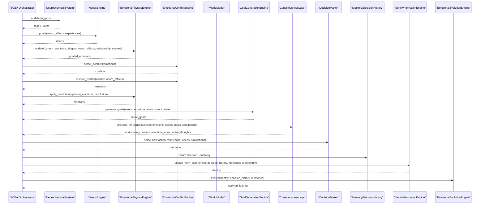
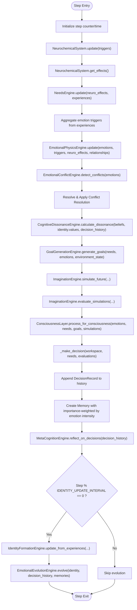
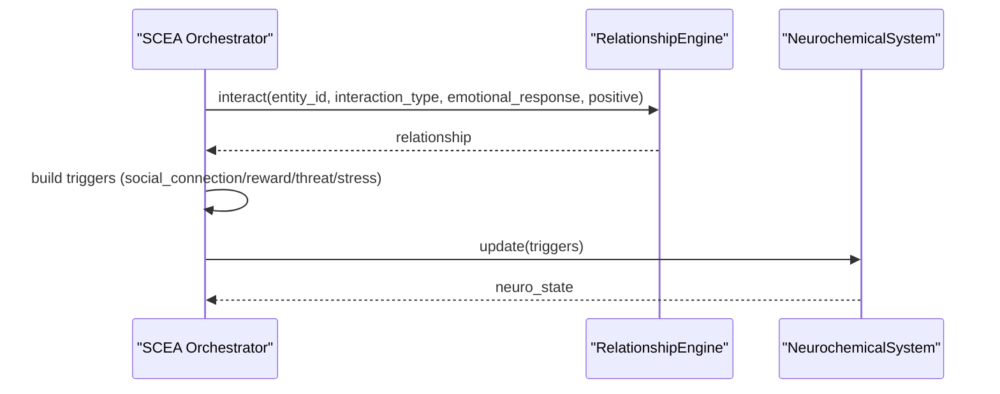
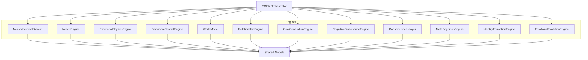

# SCEA Consciousness Architecture

<cite>
**Referenced Files in This Document**
- [scea.py](file://psychologist/scea/core/scea.py)
- [models.py](file://psychologist/scea/core/models.py)
- [neurochemical_system.py](file://psychologist/scea/neurochemistry/neurochemical_system.py)
- [needs_system.py](file://psychologist/scea/needs_engine/needs_system.py)
- [emotional_physics_engine.py](file://psychologist/scea/emotional_physics/emotional_physics_engine.py)
- [world_model_system.py](file://psychologist/scea/world_model/world_model_system.py)
- [relationship_system.py](file://psychologist/scea/relationship_engine/relationship_system.py)
- [cognitive_dissonance_engine.py](file://psychologist/scea/cognitive_dissonance/cognitive_dissonance_engine.py)
- [emotional_conflict_engine.py](file://psychologist/scea/conflict_engine/emotional_conflict_engine.py)
- [goal_system.py](file://psychologist/scea/goal_generation/goal_system.py)
- [consciousness_system.py](file://psychologist/scea/consciousness_layer/consciousness_system.py)
- [meta_cognition_system.py](file://psychologist/scea/meta_cognition/meta_cognition_system.py)
- [emotional_evolution_system.py](file://psychologist/scea/emotional_evolution/emotional_evolution_system.py)
- [identity_system.py](file://psychologist/scea/identity_formation/identity_system.py)
</cite>

## Table of Contents
1. [Introduction](#introduction)
2. [Project Structure](#project-structure)
3. [Core Components](#core-components)
4. [Architecture Overview](#architecture-overview)
5. [Detailed Component Analysis](#detailed-component-analysis)
6. [Dependency Analysis](#dependency-analysis)
7. [Performance Considerations](#performance-considerations)
8. [Troubleshooting Guide](#troubleshooting-guide)
9. [Conclusion](#conclusion)

## Introduction
This document describes the Self-Cognitive Evolution Architecture (SCEA) subsystem, a multi-layered consciousness simulation system designed to model human-like mental processes. The architecture integrates neurochemistry simulation, needs-driven motivation, emotional dynamics, world modeling, relationship tracking, cognitive dissonance, conflict resolution, goal generation, consciousness layer, meta-cognition, and long-term identity and emotional evolution. It also documents the decision-making pipeline, entity interaction mechanisms, and the integration with the emotion processing engine. The system emphasizes hierarchical layers with strong feedback loops among components to emulate emergent cognition and evolving self-models.

## Project Structure
The SCEA subsystem is organized by functional layers under the scea package, with a central orchestrator coordinating specialized engines. Core data models define shared state structures across all components.

```mermaid
graph TB
subgraph "SCEA Core"
SCEA["SCEA Orchestrator<br/>orchestrates all engines"]
Models["Shared Models<br/>NeurochemicalState, EmotionVector,<br/>Need, Belief, Goal, Memory,<br/>Relationship, Identity, DecisionRecord"]
end
subgraph "Neuroscience Layer"
Neuro["NeurochemicalSystem<br/>neurotransmitter dynamics"]
Needs["NeedsEngine<br/>motivational drives"]
end
subgraph "Emotional Layer"
EmPhy["EmotionalPhysicsEngine<br/>emotion propagation"]
Conf["EmotionalConflictEngine<br/>conflict detection & resolution"]
end
subgraph "Cognition Layer"
WM["WorldModel<br/>beliefs & environment"]
Rel["RelationshipEngine<br/>interactions & bonds"]
Goals["GoalGenerationEngine<br/>goal creation & progress"]
Disc["CognitiveDissonanceEngine<br/>value/belief alignment"]
end
subgraph "Consciousness Layer"
Con["ConsciousnessLayer<br/>global workspace & attention"]
Meta["MetaCognitionEngine<br/>self-reflection & evaluation"]
end
subgraph "Identity & Evolution"
Ident["IdentityFormationEngine<br/>identity construction"]
Evo["EmotionalEvolutionEngine<br/>identity evolution"]
end
SCEA --> Neuro
SCEA --> Needs
SCEA --> EmPhy
SCEA --> Conf
SCEA --> WM
SCEA --> Rel
SCEA --> Goals
SCEA --> Disc
SCEA --> Con
SCEA --> Meta
SCEA --> Ident
SCEA --> Evo
Neuro --> Models
Needs --> Models
EmPhy --> Models
Conf --> Models
WM --> Models
Rel --> Models
Goals --> Models
Disc --> Models
Con --> Models
Meta --> Models
Ident --> Models
Evo --> Models
```

**Diagram sources**
- [scea.py:30-48](file://psychologist/scea/core/scea.py#L30-L48)
- [models.py:28-162](file://psychologist/scea/core/models.py#L28-L162)

**Section sources**
- [scea.py:1-250](file://psychologist/scea/core/scea.py#L1-L250)
- [models.py:1-162](file://psychologist/scea/core/models.py#L1-L162)

## Core Components
This section outlines the primary engines and their roles within the SCEA orchestration loop.

- SCEA Orchestrator: Coordinates state initialization, per-step updates, decision-making, memory and identity maintenance, and periodic identity evolution.
- Shared Models: Define the state structures used across all engines (neurochemistry, emotions, needs, beliefs, goals, memories, relationships, identity, decisions).
- NeurochemicalSystem: Simulates neurotransmitter dynamics and translates them into behavioral effects.
- NeedsEngine: Drives motivational priorities from internal states and external triggers.
- EmotionalPhysicsEngine: Propagates and modulates emotions over time with momentum, decay, and social contagion.
- EmotionalConflictEngine: Detects and resolves conflicting emotions using suppression or blending strategies.
- WorldModel: Maintains beliefs and environment state for contextual reasoning.
- RelationshipEngine: Tracks entity relationships and emotional associations.
- GoalGenerationEngine: Creates and manages goals aligned with needs and environment.
- CognitiveDissonanceEngine: Quantifies and proposes resolutions for inconsistencies among beliefs, values, and actions.
- ConsciousnessLayer: Constructs a global workspace of attention-grabbing contents (emotions, needs, goals).
- MetaCognitionEngine: Evaluates past decisions and supports self-awareness metrics.
- IdentityFormationEngine: Builds and maintains identity traits, values, and preferences.
- EmotionalEvolutionEngine: Evolves identity over time via reinforcement and mutation.

**Section sources**
- [scea.py:30-48](file://psychologist/scea/core/scea.py#L30-L48)
- [models.py:28-162](file://psychologist/scea/core/models.py#L28-L162)
- [neurochemical_system.py:6-116](file://psychologist/scea/neurochemistry/neurochemical_system.py#L6-L116)
- [needs_system.py:6-138](file://psychologist/scea/needs_engine/needs_system.py#L6-L138)
- [emotional_physics_engine.py:7-127](file://psychologist/scea/emotional_physics/emotional_physics_engine.py#L7-L127)
- [emotional_conflict_engine.py:5-71](file://psychologist/scea/conflict_engine/emotional_conflict_engine.py#L5-L71)
- [world_model_system.py:5-81](file://psychologist/scea/world_model/world_model_system.py#L5-L81)
- [relationship_system.py:6-85](file://psychologist/scea/relationship_engine/relationship_system.py#L6-L85)
- [goal_system.py:6-144](file://psychologist/scea/goal_generation/goal_system.py#L6-L144)
- [cognitive_dissonance_engine.py:5-99](file://psychologist/scea/cognitive_dissonance/cognitive_dissonance_engine.py#L5-L99)
- [consciousness_system.py:6-56](file://psychologist/scea/consciousness_layer/consciousness_system.py#L6-L56)
- [meta_cognition_system.py:5-78](file://psychologist/scea/meta_cognition/meta_cognition_system.py#L5-L78)
- [identity_system.py:6-106](file://psychologist/scea/identity_formation/identity_system.py#L6-L106)
- [emotional_evolution_system.py:6-80](file://psychologist/scea/emotional_evolution/emotional_evolution_system.py#L6-L80)

## Architecture Overview
The SCEA architecture follows a closed-loop, hierarchical design. At each step, the orchestrator pulls triggers and experiences, updates neurochemical and emotional states, detects and resolves conflicts, generates goals, constructs consciousness contents, selects a decision, records memory and decision history, periodically updates identity and evolves it, and feeds back into subsequent steps.

**Diagram sources**
- [scea.py:61-184](file://psychologist/scea/core/scea.py#L61-L184)
- [emotional_conflict_engine.py:39-71](file://psychologist/scea/conflict_engine/emotional_conflict_engine.py#L39-L71)
- [emotional_physics_engine.py:12-41](file://psychologist/scea/emotional_physics/emotional_physics_engine.py#L12-L41)
- [goal_system.py:39-76](file://psychologist/scea/goal_generation/goal_system.py#L39-L76)
- [consciousness_system.py:12-55](file://psychologist/scea/consciousness_layer/consciousness_system.py#L12-L55)
- [identity_system.py:21-31](file://psychologist/scea/identity_formation/identity_system.py#L21-L31)
- [emotional_evolution_system.py:11-35](file://psychologist/scea/emotional_evolution/emotional_evolution_system.py#L11-L35)

## Detailed Component Analysis

### SCEA Orchestrator
The orchestrator initializes state and runs a per-step cycle. It aggregates inputs (triggers and experiences), updates layered engines, computes cognitive dissonance, generates goals, simulates futures, constructs consciousness contents, selects a decision, records outcomes, and periodically evolves identity.

Key responsibilities:
- State initialization linking each engine’s state to the central SCEAState.
- Step-wise update pipeline integrating neurochemistry, needs, emotions, conflicts, goals, consciousness, and identity.
- Decision-making combining workspace contents, pressing needs, and simulated scenarios.
- Memory and decision history management with limits.
- Periodic identity update and evolution.

**Diagram sources**
- [scea.py:61-184](file://psychologist/scea/core/scea.py#L61-L184)
- [models.py:147-162](file://psychologist/scea/core/models.py#L147-L162)

**Section sources**
- [scea.py:30-184](file://psychologist/scea/core/scea.py#L30-L184)
- [models.py:147-162](file://psychologist/scea/core/models.py#L147-L162)

### Neurochemical Simulation
The NeurochemicalSystem models five neurotransmitters with decay, baseline correction, and noise. Triggers influence synthesis rates, and derived effects feed into downstream systems (e.g., curiosity, trust, stress sensitivity).

Highlights:
- Trigger mapping to dopamine, serotonin, oxytocin, cortisol, adrenaline.
- Baseline drift correction and history tracking.
- Effects mapping to psychological constructs (e.g., reward expectation, exploration drive, cooperation).

**Section sources**
- [neurochemical_system.py:6-116](file://psychologist/scea/neurochemistry/neurochemical_system.py#L6-L116)

### Needs Engine
The NeedsEngine maintains a set of intrinsic needs with satisfaction, priority, and deprivation. It updates needs from experiences, applies natural decay, and modulates priorities according to neurochemical effects.

Highlights:
- Default needs include knowledge, social, achievement, stability, exploration, security, recognition, autonomy.
- Deprivation increases unsatisfied needs; priorities scale with deprivation.
- Neurochemical modulation adjusts need priorities (e.g., curiosity boosts knowledge/exploration).

**Section sources**
- [needs_system.py:6-138](file://psychologist/scea/needs_engine/needs_system.py#L6-L138)

### Emotional Physics
The EmotionalPhysicsEngine propagates emotions over time with:
- Trigger-based activation mapped to emotion dimensions.
- Momentum carrying forward directional tendencies.
- Exponential decay to prevent sustained states.
- Neurochemical modulation (e.g., reward expectation, stress level, trust formation).
- Social contagion from relationship contexts.
- Resonance pairs that mutually reinforce compatible emotions.
- History tracking for diagnostics.

**Section sources**
- [emotional_physics_engine.py:7-127](file://psychologist/scea/emotional_physics/emotional_physics_engine.py#L7-L127)

### Emotional Conflict Resolution
Detects simultaneous strong activations of conflicting emotion pairs and resolves them either by blending (mild conflicts) or suppressing the subordinate emotion (strong conflicts), guided by neurochemical stability.

**Section sources**
- [emotional_conflict_engine.py:5-71](file://psychologist/scea/conflict_engine/emotional_conflict_engine.py#L5-L71)

### World Model and Relationships
The WorldModel maintains beliefs with confidence and supporting evidence, and tracks environment state. The RelationshipEngine tracks entity relationships with trust, familiarity, attachment, respect, reliability, and emotional associations.

**Section sources**
- [world_model_system.py:5-81](file://psychologist/scea/world_model/world_model_system.py#L5-L81)
- [relationship_system.py:6-85](file://psychologist/scea/relationship_engine/relationship_system.py#L6-L85)

### Cognitive Dissonance
Quantifies inconsistency among beliefs, values, and recent decisions, and proposes resolutions (e.g., adjusting belief confidence, seeking evidence).

**Section sources**
- [cognitive_dissonance_engine.py:5-99](file://psychologist/scea/cognitive_dissonance/cognitive_dissonance_engine.py#L5-L99)

### Goal Generation
Generates goals aligned with pressing needs and environmental context, with templates per need type. Progresses goals over time and cleans up completed or abandoned ones.

**Section sources**
- [goal_system.py:6-144](file://psychologist/scea/goal_generation/goal_system.py#L6-L144)

### Consciousness Layer
Constructs a global workspace from dominant emotions, pressing needs, and top goals, selecting attention focus and active thoughts for the current step.

**Section sources**
- [consciousness_system.py:6-56](file://psychologist/scea/consciousness_layer/consciousness_system.py#L6-L56)

### Meta-Cognition
Evaluates recent decisions, computes regret and learning, and supports belief reassessment based on evidence quality.

**Section sources**
- [meta_cognition_system.py:5-78](file://psychologist/scea/meta_cognition/meta_cognition_system.py#L5-L78)

### Identity Formation and Evolution
IdentityFormationEngine builds identity traits, values, and preferences from experiences and memories, calculating consistency and self-confidence. EmotionalEvolutionEngine evolves identity over time via reinforcement and random mutations.

**Section sources**
- [identity_system.py:6-106](file://psychologist/scea/identity_formation/identity_system.py#L6-L106)
- [emotional_evolution_system.py:6-80](file://psychologist/scea/emotional_evolution/emotional_evolution_system.py#L6-L80)

### Entity Interaction System
The orchestrator exposes an interaction method that updates relationships, triggers neurochemical responses based on interaction valence, and feeds back into the system.

**Diagram sources**
- [scea.py:225-245](file://psychologist/scea/core/scea.py#L225-L245)
- [relationship_system.py:10-52](file://psychologist/scea/relationship_engine/relationship_system.py#L10-L52)
- [neurochemical_system.py:12-92](file://psychologist/scea/neurochemistry/neurochemical_system.py#L12-L92)

**Section sources**
- [scea.py:225-245](file://psychologist/scea/core/scea.py#L225-L245)

## Dependency Analysis
The SCEA orchestrator composes all engines and shares a unified state model. Engines depend on shared models but otherwise maintain loose coupling. Feedback loops exist across neurochemistry → needs → emotions → conflicts → goals → consciousness → decision → memory → identity → evolution.

**Diagram sources**
- [scea.py:30-48](file://psychologist/scea/core/scea.py#L30-L48)
- [models.py:28-162](file://psychologist/scea/core/models.py#L28-L162)

**Section sources**
- [scea.py:30-48](file://psychologist/scea/core/scea.py#L30-L48)
- [models.py:28-162](file://psychologist/scea/core/models.py#L28-L162)

## Performance Considerations
- State Limits: Decision history and memory arrays are capped to bound computational overhead.
- Decay and Baseline Correction: Prevents runaway emotion or chemistry values and stabilizes long-term behavior.
- Priority-Based Filtering: Consciousness workspace and goal lists are truncated to manageable sizes.
- Modular Updates: Each engine operates independently, enabling targeted optimization (e.g., vectorized emotion updates).
- Periodic Identity Evolution: Controlled frequency reduces computational load while preserving adaptability.

[No sources needed since this section provides general guidance]

## Troubleshooting Guide
Common issues and mitigations:
- Emotional Instability: Verify decay and baseline correction parameters in the neurochemical and emotional physics engines. Check for excessive triggers or noise.
- Overly Active Goals: Review goal generation thresholds and templates; ensure environment context is meaningful.
- Identity Stagnation: Confirm that identity update intervals and evolution mutation rates are appropriate; check decision evaluation scores.
- Memory Bloat: Ensure memory importance weighting and limits are configured; verify sorting and pruning logic.
- Relationship Drift: Validate interaction histories and emotional association accumulation; confirm familiarity and trust dynamics.

**Section sources**
- [scea.py:129-144](file://psychologist/scea/core/scea.py#L129-L144)
- [goal_system.py:121-138](file://psychologist/scea/goal_generation/goal_system.py#L121-L138)
- [identity_system.py:93-106](file://psychologist/scea/identity_formation/identity_system.py#L93-L106)
- [emotional_evolution_system.py:70-80](file://psychologist/scea/emotional_evolution/emotional_evolution_system.py#L70-L80)

## Conclusion
The SCEA subsystem presents a comprehensive, hierarchical model of consciousness simulation. Its layered design—neurochemistry, needs, emotions, cognition, consciousness, meta-cognition, identity, and evolution—enables rich feedback loops and emergent behavior. The orchestrator coordinates these components into a coherent decision-making pipeline, integrating entity interactions and long-term identity evolution. This architecture provides a robust foundation for further extension and integration with broader emotion processing and interaction systems.