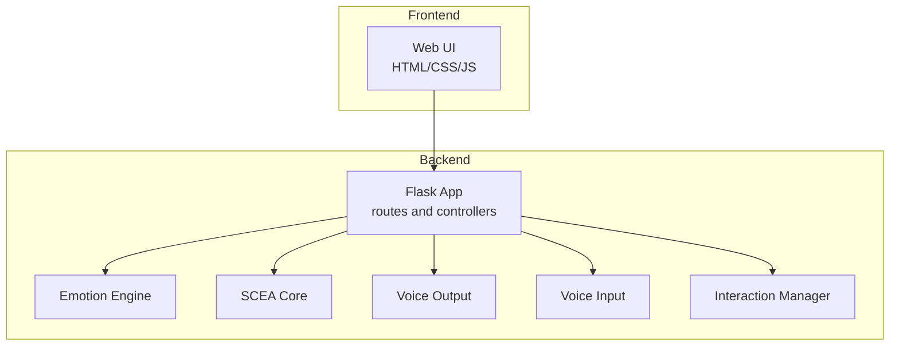
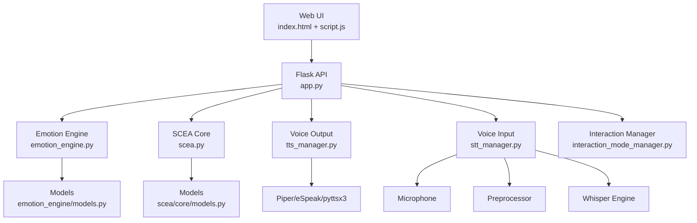
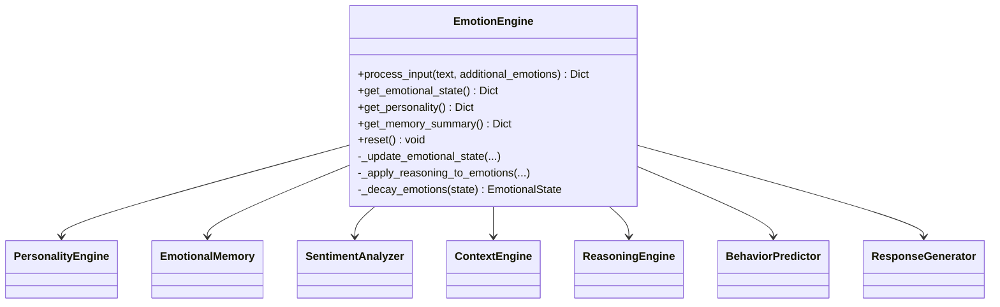
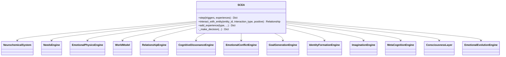
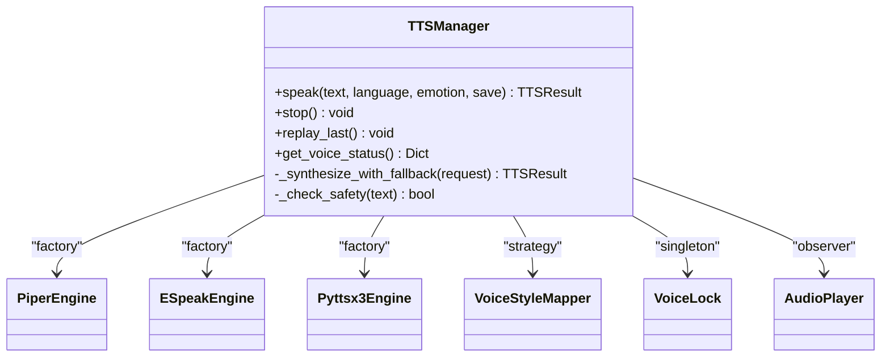
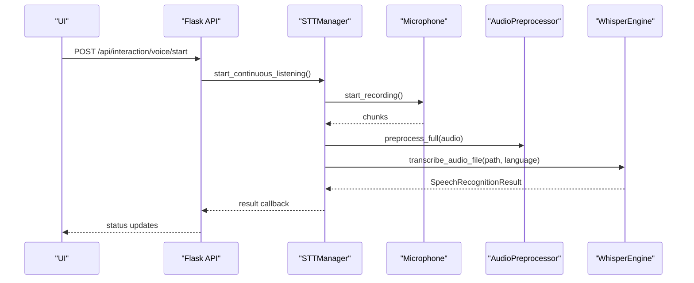
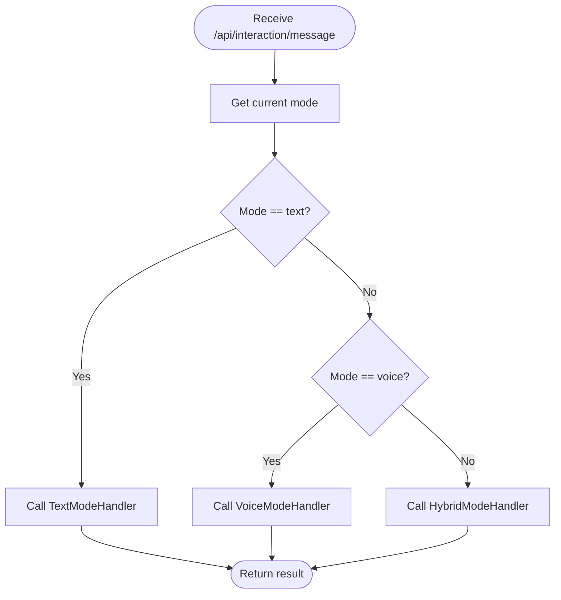
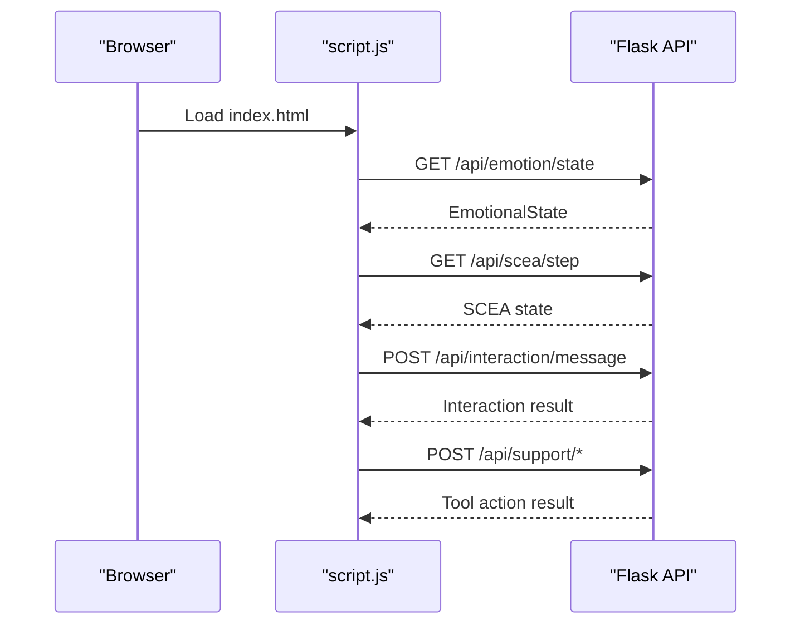
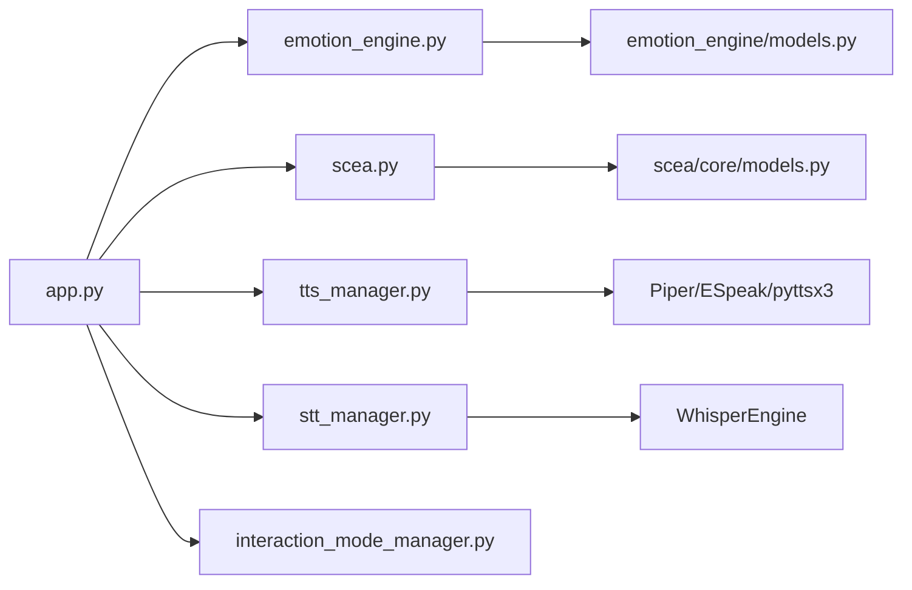

# System Architecture

<cite>
**Referenced Files in This Document**
- [app.py](file://psychologist/app.py)
- [run_app.py](file://psychologist/run_app.py)
- [README.md](file://psychologist/README.md)
- [system_constants.py](file://psychologist/system_constants.py)
- [emotion_engine.py](file://psychologist/emotion_engine/emotion_engine.py)
- [scea.py](file://psychologist/scea/core/scea.py)
- [tts_manager.py](file://psychologist/emotion_engine/voice_output/tts_manager.py)
- [stt_manager.py](file://psychologist/emotion_engine/voice_system/stt_manager.py)
- [interaction_mode_manager.py](file://psychologist/emotion_engine/interaction/interaction_mode_manager.py)
- [models.py (emotion_engine)](file://psychologist/emotion_engine/models.py)
- [models.py (scea)](file://psychologist/scea/core/models.py)
- [index.html](file://psychologist/frontend/index.html)
- [script.js](file://psychologist/frontend/script.js)
</cite>

## Table of Contents
1. [Introduction](#introduction)
2. [Project Structure](#project-structure)
3. [Core Components](#core-components)
4. [Architecture Overview](#architecture-overview)
5. [Detailed Component Analysis](#detailed-component-analysis)
6. [Dependency Analysis](#dependency-analysis)
7. [Performance Considerations](#performance-considerations)
8. [Troubleshooting Guide](#troubleshooting-guide)
9. [Conclusion](#conclusion)
10. [Appendices](#appendices)

## Introduction
This document describes the system architecture of the Psychologist AI Companion (“ZARA”), an offline-first emotional support system. The platform is implemented as a Flask-based backend that orchestrates three primary subsystems:
- Emotion Processing Engine: A keyword-based sentiment analyzer, fuzzy logic blending, Bayesian updates, and a response generator.
- SCEA (Self-Cognitive & Emotional Architecture): A higher-order cognitive architecture simulating neurochemistry, needs, goals, identity, consciousness, and meta-cognition.
- Voice Processing Systems: A single-locked voice output pipeline (TTS) and a voice input pipeline (STT) with optional voice emotion fusion.

The system follows a modular layered architecture separating:
- Emotion processing
- Cognitive systems (SCEA)
- Interaction management (modes, sessions, safety)
- Voice processing (input/output)

Design patterns include:
- Factory pattern for TTS engines (engine registration and selection)
- Observer pattern for activity monitoring callbacks
- Strategy pattern for emotion styling (mapping emotions to prosody parameters)

External dependencies are minimized to enable offline-first operation, and the web interface provides real-time dashboards and controls.

## Project Structure
The repository is organized into:
- Backend Flask application and API routes
- Emotion engine modules for processing and response generation
- SCEA cognitive architecture modules
- Voice processing modules for STT and TTS
- Frontend web assets and JavaScript-driven dashboards
- Configuration and constants

**Diagram sources**
- [app.py:151-551](file://psychologist/app.py#L151-L551)
- [emotion_engine.py:23-184](file://psychologist/emotion_engine/emotion_engine.py#L23-L184)
- [scea.py:30-250](file://psychologist/scea/core/scea.py#L30-L250)
- [tts_manager.py:31-244](file://psychologist/emotion_engine/voice_output/tts_manager.py#L31-L244)
- [stt_manager.py:17-104](file://psychologist/emotion_engine/voice_system/stt_manager.py#L17-L104)
- [interaction_mode_manager.py:17-166](file://psychologist/emotion_engine/interaction/interaction_mode_manager.py#L17-L166)
- [index.html:1-709](file://psychologist/frontend/index.html#L1-L709)
- [script.js:1-800](file://psychologist/frontend/script.js#L1-L800)

**Section sources**
- [README.md:59-121](file://psychologist/README.md#L59-L121)
- [app.py:22-158](file://psychologist/app.py#L22-L158)

## Core Components
- Flask Application and API
  - Central entrypoint initializes emotion engine, SCEA, voice systems, and interaction managers.
  - Provides health checks, emotion endpoints, SCEA endpoints, voice output endpoints, and interaction endpoints.
  - Implements rate limiting and structured error handling.

- Emotion Engine
  - Orchestrates sentiment analysis, emotion keyword detection, personality influence, context updates, reasoning, behavior prediction, and response generation.
  - Manages emotional state decay and memory storage.

- SCEA (Self-Cognitive & Emotional Architecture)
  - Coordinates neurochemistry, needs, goals, identity, consciousness, and meta-cognition.
  - Steps through cycles updating states, detecting conflicts, generating decisions, and evolving identity.

- Voice Processing Systems
  - TTS Manager: Single-voice orchestration with fallback engines (Piper → eSpeak → pyttsx3), emotion style mapping, and playback control.
  - STT Manager: Continuous listening, preprocessing, and transcription using Whisper when available.

- Interaction Management
  - Mode manager supports text, voice, and hybrid modes with configuration and validation.
  - Session manager tracks sessions, safety flags, and persistence.
  - Safety support layer filters inputs and responses for crisis safety.

- Frontend Web Interface
  - Real-time dashboards for emotion state, needs, beliefs, goals, identity, memory, and simulation.
  - Companion panel for conversation, status indicators, input controls, and support tools.
  - Script-driven rendering and i18n support.

**Section sources**
- [app.py:60-150](file://psychologist/app.py#L60-L150)
- [emotion_engine.py:23-184](file://psychologist/emotion_engine/emotion_engine.py#L23-L184)
- [scea.py:30-250](file://psychologist/scea/core/scea.py#L30-L250)
- [tts_manager.py:31-244](file://psychologist/emotion_engine/voice_output/tts_manager.py#L31-L244)
- [stt_manager.py:17-104](file://psychologist/emotion_engine/voice_system/stt_manager.py#L17-L104)
- [interaction_mode_manager.py:17-166](file://psychologist/emotion_engine/interaction/interaction_mode_manager.py#L17-L166)
- [index.html:1-709](file://psychologist/frontend/index.html#L1-L709)
- [script.js:1-800](file://psychologist/frontend/script.js#L1-L800)

## Architecture Overview
The system employs a layered architecture:
- Presentation Layer: Web UI renders cognitive states and provides controls.
- API Layer: Flask routes expose emotion processing, SCEA, voice I/O, and interaction endpoints.
- Processing Layer: Emotion Engine and SCEA modules encapsulate domain logic.
- Voice Layer: STT and TTS modules manage audio I/O with fallback strategies.
- Persistence Layer: Sessions and memory are persisted locally; voice models are downloaded separately.

**Diagram sources**
- [app.py:151-551](file://psychologist/app.py#L151-L551)
- [emotion_engine.py:23-184](file://psychologist/emotion_engine/emotion_engine.py#L23-L184)
- [scea.py:30-250](file://psychologist/scea/core/scea.py#L30-L250)
- [tts_manager.py:31-244](file://psychologist/emotion_engine/voice_output/tts_manager.py#L31-L244)
- [stt_manager.py:17-104](file://psychologist/emotion_engine/voice_system/stt_manager.py#L17-L104)
- [interaction_mode_manager.py:17-166](file://psychologist/emotion_engine/interaction/interaction_mode_manager.py#L17-L166)
- [models.py (emotion_engine):44-143](file://psychologist/emotion_engine/models.py#L44-L143)
- [models.py (scea):28-162](file://psychologist/scea/core/models.py#L28-L162)

## Detailed Component Analysis

### Emotion Processing Engine
The Emotion Engine composes multiple specialized modules:
- PersonalityEngine: Applies Big-Five traits to emotional states.
- EmotionalMemory: Stores short/long-term memories with importance weighting.
- SentimentAnalyzer: Keyword-based sentiment scoring and emotion keyword detection.
- ContextEngine: Maintains conversation context and trends.
- ReasoningEngine: Blends current and Bayesian-updated emotion values.
- BehaviorPredictor: Predicts behavioral tendencies.
- ResponseGenerator: Produces template-based responses.

**Diagram sources**
- [emotion_engine.py:23-184](file://psychologist/emotion_engine/emotion_engine.py#L23-L184)
- [models.py (emotion_engine):44-143](file://psychologist/emotion_engine/models.py#L44-L143)

**Section sources**
- [emotion_engine.py:37-92](file://psychologist/emotion_engine/emotion_engine.py#L37-L92)
- [models.py (emotion_engine):44-143](file://psychologist/emotion_engine/models.py#L44-L143)

### SCEA (Self-Cognitive & Emotional Architecture)
SCEA orchestrates higher-order cognition:
- NeurochemicalSystem: Simulates dopamine, serotonin, oxytocin, cortisol, adrenaline.
- NeedsEngine: Maslow-style needs hierarchy with satisfaction and deprivation.
- EmotionalPhysicsEngine: Emotion vector dynamics and valence/intensity computation.
- WorldModel: Belief and environment modeling.
- RelationshipEngine: Trust and attachment modeling.
- CognitiveDissonanceEngine: Measures and manages dissonance.
- EmotionalConflictEngine: Detects and resolves conflicts.
- GoalGenerationEngine: Generates and prioritizes goals.
- IdentityFormationEngine: Builds and evolves identity.
- ImaginationEngine: Simulates scenarios and evaluates outcomes.
- MetaCognitionEngine: Reflects on decisions and learning.
- ConsciousnessLayer: Processes attention focus and active thoughts.
- EmotionalEvolutionEngine: Long-term identity evolution.

**Diagram sources**
- [scea.py:30-250](file://psychologist/scea/core/scea.py#L30-L250)
- [models.py (scea):28-162](file://psychologist/scea/core/models.py#L28-L162)

**Section sources**
- [scea.py:61-184](file://psychologist/scea/core/scea.py#L61-L184)
- [models.py (scea):28-162](file://psychologist/scea/core/models.py#L28-L162)

### Voice Processing Systems

#### TTS Manager (Factory Pattern)
The TTS Manager registers and selects engines in priority order (Piper → eSpeak → pyttsx3). It applies emotion styles via VoiceStyleMapper and enforces a single locked voice identity.

**Diagram sources**
- [tts_manager.py:31-244](file://psychologist/emotion_engine/voice_output/tts_manager.py#L31-L244)

**Section sources**
- [tts_manager.py:55-88](file://psychologist/emotion_engine/voice_output/tts_manager.py#L55-L88)
- [tts_manager.py:100-168](file://psychologist/emotion_engine/voice_output/tts_manager.py#L100-L168)
- [tts_manager.py:172-193](file://psychologist/emotion_engine/voice_output/tts_manager.py#L172-L193)

#### STT Manager (Observer Pattern)
The STT Manager initializes Whisper when available, continuously listens via a microphone thread, preprocesses audio, and invokes a result callback upon completion.

**Diagram sources**
- [stt_manager.py:44-92](file://psychologist/emotion_engine/voice_system/stt_manager.py#L44-L92)
- [app.py:337-357](file://psychologist/app.py#L337-L357)

**Section sources**
- [stt_manager.py:44-74](file://psychologist/emotion_engine/voice_system/stt_manager.py#L44-L74)
- [stt_manager.py:75-92](file://psychologist/emotion_engine/voice_system/stt_manager.py#L75-L92)

### Interaction Management (Strategy Pattern for Modes)
The InteractionModeManager encapsulates mode configurations (text, voice, hybrid) and validates transitions. The system dynamically dispatches to appropriate handlers based on the current mode.

**Diagram sources**
- [app.py:290-336](file://psychologist/app.py#L290-L336)
- [interaction_mode_manager.py:70-102](file://psychologist/emotion_engine/interaction/interaction_mode_manager.py#L70-L102)

**Section sources**
- [interaction_mode_manager.py:21-43](file://psychologist/emotion_engine/interaction/interaction_mode_manager.py#L21-L43)
- [app.py:300-332](file://psychologist/app.py#L300-L332)

### Web Interface Architecture and Real-Time Communication
The frontend is a single-page application that:
- Renders cognitive dashboards and the companion panel.
- Polls and fetches system state from the backend.
- Emits user actions (sessions, inputs, support tools) to the API.
- Uses i18n and maintains local state for inputs and history.

**Diagram sources**
- [index.html:1-709](file://psychologist/frontend/index.html#L1-L709)
- [script.js:1-800](file://psychologist/frontend/script.js#L1-L800)
- [app.py:175-278](file://psychologist/app.py#L175-L278)

**Section sources**
- [index.html:370-536](file://psychologist/frontend/index.html#L370-L536)
- [script.js:1-800](file://psychologist/frontend/script.js#L1-L800)
- [app.py:290-526](file://psychologist/app.py#L290-L526)

## Dependency Analysis
Key internal dependencies:
- app.py depends on emotion_engine, scea.core.scea, and interaction modules.
- Emotion Engine depends on models and reasoning modules.
- SCEA depends on multiple subsystems and models.
- Voice modules depend on engine implementations and preprocessor/audio utilities.
- Frontend depends on API endpoints and renders state.

**Diagram sources**
- [app.py:9-18](file://psychologist/app.py#L9-L18)
- [emotion_engine.py:1-11](file://psychologist/emotion_engine/emotion_engine.py#L1-L11)
- [scea.py:1-6](file://psychologist/scea/core/scea.py#L1-L6)
- [tts_manager.py:16-27](file://psychologist/emotion_engine/voice_output/tts_manager.py#L16-L27)
- [stt_manager.py:8-12](file://psychologist/emotion_engine/voice_system/stt_manager.py#L8-L12)

**Section sources**
- [app.py:9-18](file://psychologist/app.py#L9-L18)
- [emotion_engine.py:1-11](file://psychologist/emotion_engine/emotion_engine.py#L1-L11)
- [scea.py:1-6](file://psychologist/scea/core/scea.py#L1-L6)

## Performance Considerations
- Rate limiting: In-memory limits protect endpoints from overload.
- Decaying emotions: EMOTION_DECAY_FACTOR reduces long-term drift.
- Memory limits: EMOTION_HISTORY_LIMIT and SCEA_MEMORY_LIMIT cap memory usage.
- Voice output constraints: Single locked voice avoids synchronization overhead; fallback engines mitigate engine unavailability.
- STT streaming: Continuous listening with buffering balances responsiveness and accuracy.

[No sources needed since this section provides general guidance]

## Troubleshooting Guide
Common issues and mitigations:
- Voice output not available: The system gracefully degrades to a non-functional stub endpoint and logs warnings during initialization.
- Voice input not available: STT initialization failures are logged; the system continues with text mode.
- Safety violations: Requests containing unsafe voice cloning keywords are blocked by TTS safety checks.
- Session persistence: JSON-based files are used; ensure storage permissions and disk space.
- External models: Whisper/Vosk/Piper models must be downloaded separately; missing models disable respective engines.

**Section sources**
- [app.py:73-120](file://psychologist/app.py#L73-L120)
- [tts_manager.py:228-244](file://psychologist/emotion_engine/voice_output/tts_manager.py#L228-L244)
- [README.md:169-176](file://psychologist/README.md#L169-L176)

## Conclusion
ZARA’s architecture cleanly separates concerns across emotion processing, cognitive systems, interaction management, and voice I/O. The Flask backend exposes a cohesive API, while the frontend delivers real-time dashboards and controls. Design patterns such as Factory (TTS engines), Observer (activity callbacks), and Strategy (emotion styling) improve modularity and maintainability. The offline-first approach ensures privacy and resilience, with clear system boundaries and manageable external dependencies.

[No sources needed since this section summarizes without analyzing specific files]

## Appendices

### System Boundaries and Offline-First Approach
- All emotion analysis, reasoning, and voice I/O operate locally.
- No cloud APIs or external data services are used.
- Voice models must be downloaded separately; otherwise, voice features are disabled.

**Section sources**
- [README.md:3-6](file://psychologist/README.md#L3-L6)
- [README.md:169-176](file://psychologist/README.md#L169-L176)

### Configuration and Constants
Centralized configuration via system_constants.py governs emotion decay, history limits, response lengths, and API rate limits.

**Section sources**
- [system_constants.py:12-103](file://psychologist/system_constants.py#L12-L103)