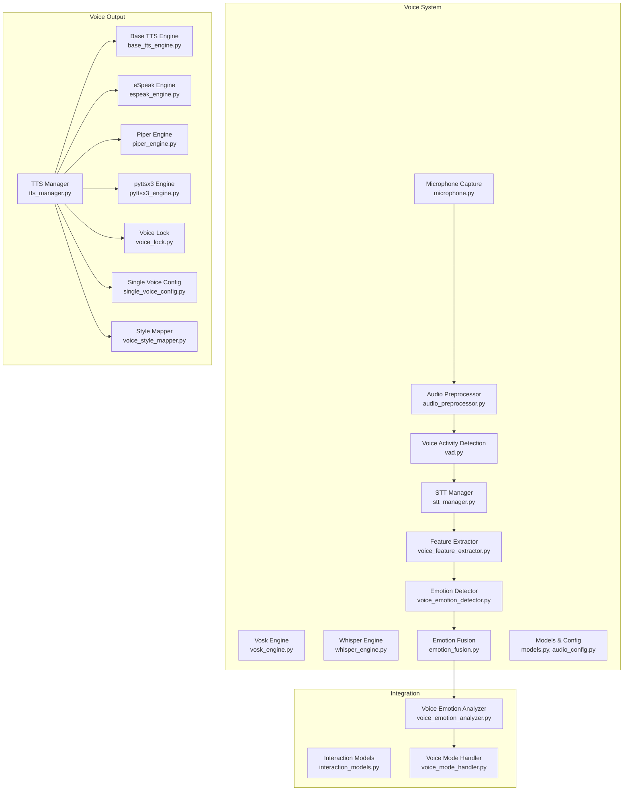
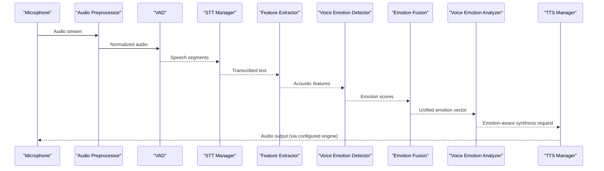
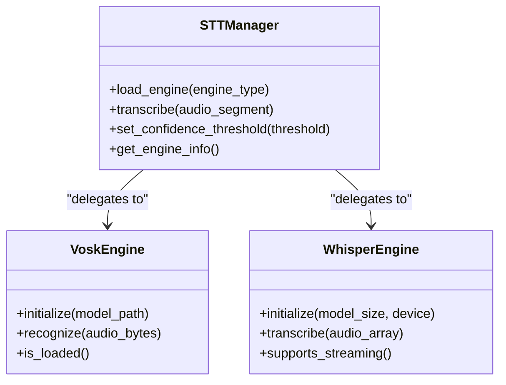
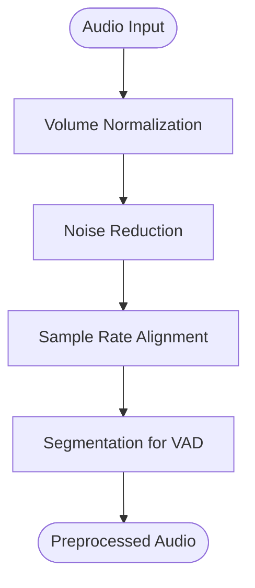
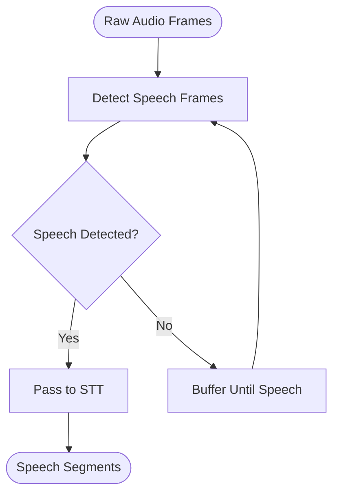
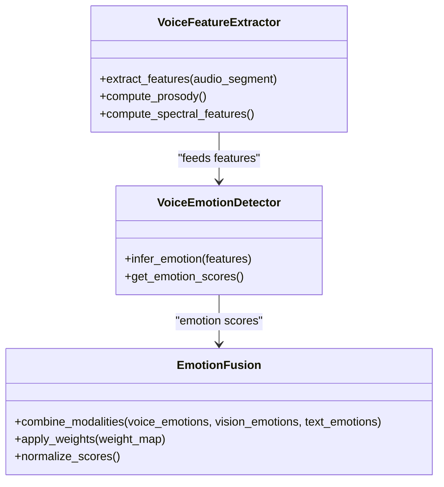
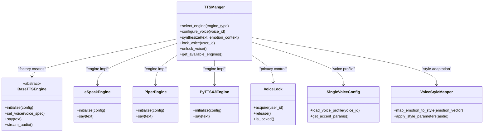
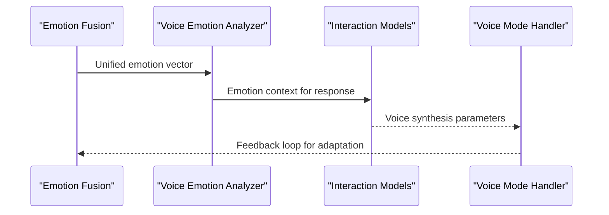
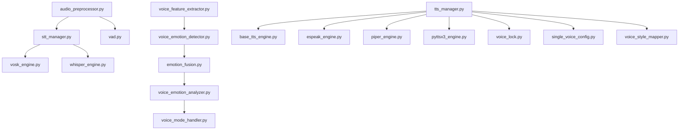

# Voice Processing Architecture

<cite>
**Referenced Files in This Document**
- [stt_manager.py](file://psychologist/emotion_engine/voice_system/stt_manager.py)
- [vosk_engine.py](file://psychologist/emotion_engine/voice_system/vosk_engine.py)
- [whisper_engine.py](file://psychologist/emotion_engine/voice_system/whisper_engine.py)
- [audio_preprocessor.py](file://psychologist/emotion_engine/voice_system/audio_preprocessor.py)
- [voice_emotion_detector.py](file://psychologist/emotion_engine/voice_system/voice_emotion_detector.py)
- [emotion_fusion.py](file://psychologist/emotion_engine/voice_system/emotion_fusion.py)
- [voice_feature_extractor.py](file://psychologist/emotion_engine/voice_system/voice_feature_extractor.py)
- [microphone.py](file://psychologist/emotion_engine/voice_system/microphone.py)
- [vad.py](file://psychologist/emotion_engine/voice_system/vad.py)
- [audio_config.py](file://psychologist/emotion_engine/voice_system/audio_config.py)
- [models.py](file://psychologist/emotion_engine/voice_system/models.py)
- [tts_manager.py](file://psychologist/emotion_engine/voice_output/tts_manager.py)
- [base_tts_engine.py](file://psychologist/emotion_engine/voice_output/base_tts_engine.py)
- [espeak_engine.py](file://psychologist/emotion_engine/voice_output/espeak_engine.py)
- [piper_engine.py](file://psychologist/emotion_engine/voice_output/piper_engine.py)
- [pyttsx3_engine.py](file://psychologist/emotion_engine/voice_output/pyttsx3_engine.py)
- [voice_lock.py](file://psychologist/emotion_engine/voice_output/voice_lock.py)
- [single_voice_config.py](file://psychologist/emotion_engine/voice_output/single_voice_config.py)
- [voice_style_mapper.py](file://psychologist/emotion_engine/voice_output/voice_style_mapper.py)
- [voice_emotion_analyzer.py](file://psychologist/emotion_engine/voice_emotion/voice_emotion_analyzer.py)
- [interaction_models.py](file://psychologist/emotion_engine/interaction/interaction_models.py)
- [voice_mode_handler.py](file://psychologist/emotion_engine/interaction/voice_mode_handler.py)
</cite>

## Table of Contents
1. [Introduction](#introduction)
2. [Project Structure](#project-structure)
3. [Core Components](#core-components)
4. [Architecture Overview](#architecture-overview)
5. [Detailed Component Analysis](#detailed-component-analysis)
6. [Dependency Analysis](#dependency-analysis)
7. [Performance Considerations](#performance-considerations)
8. [Troubleshooting Guide](#troubleshooting-guide)
9. [Conclusion](#conclusion)

## Introduction
This document describes the Voice Processing subsystem architecture responsible for real-time audio capture, speech-to-text (STT), voice emotion detection, audio preprocessing, and text-to-speech (TTS) synthesis. The system supports dual-mode operation integrating Vosk and Whisper STT engines, emotion fusion algorithms, and a flexible TTS manager with engine selection and voice locking for privacy. It coordinates with the broader emotion processing engine to incorporate voice-derived affective signals into the agent's behavioral and response generation pipeline.

## Project Structure
The Voice Processing subsystem is organized under two primary packages:
- voice_system: Core voice processing logic including STT, audio preprocessing, emotion detection, and feature extraction
- voice_output: TTS orchestration, engine abstraction, and voice management

**Diagram sources**
- [stt_manager.py](file://psychologist/emotion_engine/voice_system/stt_manager.py)
- [vosk_engine.py](file://psychologist/emotion_engine/voice_system/vosk_engine.py)
- [whisper_engine.py](file://psychologist/emotion_engine/voice_system/whisper_engine.py)
- [audio_preprocessor.py](file://psychologist/emotion_engine/voice_system/audio_preprocessor.py)
- [vad.py](file://psychologist/emotion_engine/voice_system/vad.py)
- [microphone.py](file://psychologist/emotion_engine/voice_system/microphone.py)
- [voice_feature_extractor.py](file://psychologist/emotion_engine/voice_system/voice_feature_extractor.py)
- [voice_emotion_detector.py](file://psychologist/emotion_engine/voice_system/voice_emotion_detector.py)
- [emotion_fusion.py](file://psychologist/emotion_engine/voice_system/emotion_fusion.py)
- [models.py](file://psychologist/emotion_engine/voice_system/models.py)
- [audio_config.py](file://psychologist/emotion_engine/voice_system/audio_config.py)
- [tts_manager.py](file://psychologist/emotion_engine/voice_output/tts_manager.py)
- [base_tts_engine.py](file://psychologist/emotion_engine/voice_output/base_tts_engine.py)
- [espeak_engine.py](file://psychologist/emotion_engine/voice_output/espeak_engine.py)
- [piper_engine.py](file://psychologist/emotion_engine/voice_output/piper_engine.py)
- [pyttsx3_engine.py](file://psychologist/emotion_engine/voice_output/pyttsx3_engine.py)
- [voice_lock.py](file://psychologist/emotion_engine/voice_output/voice_lock.py)
- [single_voice_config.py](file://psychologist/emotion_engine/voice_output/single_voice_config.py)
- [voice_style_mapper.py](file://psychologist/emotion_engine/voice_output/voice_style_mapper.py)
- [voice_emotion_analyzer.py](file://psychologist/emotion_engine/voice_emotion/voice_emotion_analyzer.py)
- [interaction_models.py](file://psychologist/emotion_engine/interaction/interaction_models.py)
- [voice_mode_handler.py](file://psychologist/emotion_engine/interaction/voice_mode_handler.py)

**Section sources**
- [stt_manager.py](file://psychologist/emotion_engine/voice_system/stt_manager.py)
- [tts_manager.py](file://psychologist/emotion_engine/voice_output/tts_manager.py)

## Core Components
- STT Manager: Orchestrates speech recognition using Vosk and Whisper engines, manages model loading, and emits transcriptions with confidence metrics.
- Audio Preprocessor: Normalizes audio streams, applies noise reduction, and prepares samples for downstream processing.
- Voice Activity Detection (VAD): Identifies speech segments to gate STT processing and reduce false positives.
- Voice Emotion Detector: Extracts acoustic features and infers affective states from voice characteristics.
- Emotion Fusion: Aggregates voice-based emotions with other modalities (vision, text) for unified affective state representation.
- TTS Manager: Factory-style engine selection, voice locking for privacy, and coordinated audio output management.

**Section sources**
- [stt_manager.py](file://psychologist/emotion_engine/voice_system/stt_manager.py)
- [audio_preprocessor.py](file://psychologist/emotion_engine/voice_system/audio_preprocessor.py)
- [vad.py](file://psychologist/emotion_engine/voice_system/vad.py)
- [voice_emotion_detector.py](file://psychologist/emotion_engine/voice_system/voice_emotion_detector.py)
- [emotion_fusion.py](file://psychologist/emotion_engine/voice_system/emotion_fusion.py)
- [tts_manager.py](file://psychologist/emotion_engine/voice_output/tts_manager.py)

## Architecture Overview
The Voice Processing subsystem follows a modular pipeline:
- Input capture via Microphone
- Preprocessing and VAD segmentation
- STT transcription with confidence
- Feature extraction and emotion inference
- Emotion fusion with external modalities
- TTS synthesis and output coordination

**Diagram sources**
- [microphone.py](file://psychologist/emotion_engine/voice_system/microphone.py)
- [audio_preprocessor.py](file://psychologist/emotion_engine/voice_system/audio_preprocessor.py)
- [vad.py](file://psychologist/emotion_engine/voice_system/vad.py)
- [stt_manager.py](file://psychologist/emotion_engine/voice_system/stt_manager.py)
- [voice_feature_extractor.py](file://psychologist/emotion_engine/voice_system/voice_feature_extractor.py)
- [voice_emotion_detector.py](file://psychologist/emotion_engine/voice_system/voice_emotion_detector.py)
- [emotion_fusion.py](file://psychologist/emotion_engine/voice_system/emotion_fusion.py)
- [voice_emotion_analyzer.py](file://psychologist/emotion_engine/voice_emotion/voice_emotion_analyzer.py)
- [tts_manager.py](file://psychologist/emotion_engine/voice_output/tts_manager.py)

## Detailed Component Analysis

### STT Manager and Engines
The STT Manager provides a unified interface for speech recognition, supporting Vosk and Whisper engines. It handles model initialization, streaming audio segmentation, and transcription emission with confidence thresholds.

**Diagram sources**
- [stt_manager.py](file://psychologist/emotion_engine/voice_system/stt_manager.py)
- [vosk_engine.py](file://psychologist/emotion_engine/voice_system/vosk_engine.py)
- [whisper_engine.py](file://psychologist/emotion_engine/voice_system/whisper_engine.py)

Key responsibilities:
- Engine selection and lifecycle management
- Confidence thresholding and filtering
- Streaming vs batch processing modes

**Section sources**
- [stt_manager.py](file://psychologist/emotion_engine/voice_system/stt_manager.py)
- [vosk_engine.py](file://psychologist/emotion_engine/voice_system/vosk_engine.py)
- [whisper_engine.py](file://psychologist/emotion_engine/voice_system/whisper_engine.py)

### Audio Preprocessing Pipeline
The audio preprocessing stage normalizes volume, removes background noise, and aligns sample rates to ensure consistent input quality for STT and emotion detectors.

**Diagram sources**
- [audio_preprocessor.py](file://psychologist/emotion_engine/voice_system/audio_preprocessor.py)

**Section sources**
- [audio_preprocessor.py](file://psychologist/emotion_engine/voice_system/audio_preprocessor.py)

### Voice Activity Detection (VAD)
VAD identifies speech frames to gate STT processing, reducing unnecessary computation and improving accuracy by focusing on active speech periods.

**Diagram sources**
- [vad.py](file://psychologist/emotion_engine/voice_system/vad.py)

**Section sources**
- [vad.py](file://psychologist/emotion_engine/voice_system/vad.py)

### Voice Emotion Detection and Fusion
Voice emotion detection extracts acoustic features and infers affective states. These are fused with other modalities to form a unified emotion vector for the agent.

**Diagram sources**
- [voice_feature_extractor.py](file://psychologist/emotion_engine/voice_system/voice_feature_extractor.py)
- [voice_emotion_detector.py](file://psychologist/emotion_engine/voice_system/voice_emotion_detector.py)
- [emotion_fusion.py](file://psychologist/emotion_engine/voice_system/emotion_fusion.py)

**Section sources**
- [voice_feature_extractor.py](file://psychologist/emotion_engine/voice_system/voice_feature_extractor.py)
- [voice_emotion_detector.py](file://psychologist/emotion_engine/voice_system/voice_emotion_detector.py)
- [emotion_fusion.py](file://psychologist/emotion_engine/voice_system/emotion_fusion.py)

### TTS Manager Architecture
The TTS Manager implements a factory pattern to select and configure appropriate text-to-speech engines. It coordinates voice locking for privacy and integrates with voice style mapping for expressive synthesis.

**Diagram sources**
- [tts_manager.py](file://psychologist/emotion_engine/voice_output/tts_manager.py)
- [base_tts_engine.py](file://psychologist/emotion_engine/voice_output/base_tts_engine.py)
- [espeak_engine.py](file://psychologist/emotion_engine/voice_output/espeak_engine.py)
- [piper_engine.py](file://psychologist/emotion_engine/voice_output/piper_engine.py)
- [pyttsx3_engine.py](file://psychologist/emotion_engine/voice_output/pyttsx3_engine.py)
- [voice_lock.py](file://psychologist/emotion_engine/voice_output/voice_lock.py)
- [single_voice_config.py](file://psychologist/emotion_engine/voice_output/single_voice_config.py)
- [voice_style_mapper.py](file://psychologist/emotion_engine/voice_output/voice_style_mapper.py)

**Section sources**
- [tts_manager.py](file://psychologist/emotion_engine/voice_output/tts_manager.py)
- [base_tts_engine.py](file://psychologist/emotion_engine/voice_output/base_tts_engine.py)
- [voice_lock.py](file://psychologist/emotion_engine/voice_output/voice_lock.py)
- [single_voice_config.py](file://psychologist/emotion_engine/voice_output/single_voice_config.py)
- [voice_style_mapper.py](file://psychologist/emotion_engine/voice_output/voice_style_mapper.py)

### Integration with Emotion Processing Engine
Voice-derived emotions are integrated into the broader emotion processing pipeline, informing the voice mode handler and influencing agent responses.

**Diagram sources**
- [emotion_fusion.py](file://psychologist/emotion_engine/voice_system/emotion_fusion.py)
- [voice_emotion_analyzer.py](file://psychologist/emotion_engine/voice_emotion/voice_emotion_analyzer.py)
- [interaction_models.py](file://psychologist/emotion_engine/interaction/interaction_models.py)
- [voice_mode_handler.py](file://psychologist/emotion_engine/interaction/voice_mode_handler.py)

**Section sources**
- [voice_emotion_analyzer.py](file://psychologist/emotion_engine/voice_emotion/voice_emotion_analyzer.py)
- [interaction_models.py](file://psychologist/emotion_engine/interaction/interaction_models.py)
- [voice_mode_handler.py](file://psychologist/emotion_engine/interaction/voice_mode_handler.py)

## Dependency Analysis
The Voice Processing subsystem exhibits strong cohesion within functional domains and moderate coupling to the emotion processing engine and interaction handlers. Key dependency flows:
- voice_system depends on shared models and audio configuration
- voice_output depends on voice management utilities and TTS engines
- Integration points connect to emotion fusion and voice mode handler

**Diagram sources**
- [stt_manager.py](file://psychologist/emotion_engine/voice_system/stt_manager.py)
- [vosk_engine.py](file://psychologist/emotion_engine/voice_system/vosk_engine.py)
- [whisper_engine.py](file://psychologist/emotion_engine/voice_system/whisper_engine.py)
- [audio_preprocessor.py](file://psychologist/emotion_engine/voice_system/audio_preprocessor.py)
- [vad.py](file://psychologist/emotion_engine/voice_system/vad.py)
- [voice_feature_extractor.py](file://psychologist/emotion_engine/voice_system/voice_feature_extractor.py)
- [voice_emotion_detector.py](file://psychologist/emotion_engine/voice_system/voice_emotion_detector.py)
- [emotion_fusion.py](file://psychologist/emotion_engine/voice_system/emotion_fusion.py)
- [voice_emotion_analyzer.py](file://psychologist/emotion_engine/voice_emotion/voice_emotion_analyzer.py)
- [voice_mode_handler.py](file://psychologist/emotion_engine/interaction/voice_mode_handler.py)
- [tts_manager.py](file://psychologist/emotion_engine/voice_output/tts_manager.py)
- [base_tts_engine.py](file://psychologist/emotion_engine/voice_output/base_tts_engine.py)
- [espeak_engine.py](file://psychologist/emotion_engine/voice_output/espeak_engine.py)
- [piper_engine.py](file://psychologist/emotion_engine/voice_output/piper_engine.py)
- [pyttsx3_engine.py](file://psychologist/emotion_engine/voice_output/pyttsx3_engine.py)
- [voice_lock.py](file://psychologist/emotion_engine/voice_output/voice_lock.py)
- [single_voice_config.py](file://psychologist/emotion_engine/voice_output/single_voice_config.py)
- [voice_style_mapper.py](file://psychologist/emotion_engine/voice_output/voice_style_mapper.py)

**Section sources**
- [models.py](file://psychologist/emotion_engine/voice_system/models.py)
- [audio_config.py](file://psychologist/emotion_engine/voice_system/audio_config.py)

## Performance Considerations
- STT Engine Selection: Choose Vosk for CPU-bound environments and Whisper for GPU-accelerated inference. Tune confidence thresholds to balance latency and accuracy.
- Audio Preprocessing: Apply minimal, efficient filters to preserve prosodic cues while reducing noise.
- VAD Sensitivity: Adjust VAD thresholds to minimize missed detections and false positives during quiet or overlapping speech.
- Emotion Fusion: Weight voice emotions according to domain relevance and sensor reliability to avoid dominance by noisy modalities.
- TTS Factory Pattern: Cache engine instances per configuration to reduce cold-start latency; leverage voice locking to prevent concurrent writes.

## Troubleshooting Guide
Common issues and resolutions:
- STT produces no output:
  - Verify engine initialization and model paths
  - Confirm audio format compatibility and sample rate alignment
- Low transcription accuracy:
  - Increase confidence thresholds or retrain models
  - Improve microphone placement and room acoustics
- Emotion scores unstable:
  - Validate feature extraction parameters and normalization
  - Rebalance fusion weights for stability
- TTS voice lock conflicts:
  - Ensure proper acquisition and release of voice locks
  - Check for concurrent synthesis requests

**Section sources**
- [stt_manager.py](file://psychologist/emotion_engine/voice_system/stt_manager.py)
- [audio_preprocessor.py](file://psychologist/emotion_engine/voice_system/audio_preprocessor.py)
- [emotion_fusion.py](file://psychologist/emotion_engine/voice_system/emotion_fusion.py)
- [tts_manager.py](file://psychologist/emotion_engine/voice_output/tts_manager.py)
- [voice_lock.py](file://psychologist/emotion_engine/voice_output/voice_lock.py)

## Conclusion
The Voice Processing subsystem integrates robust STT engines, audio preprocessing, emotion detection, and TTS synthesis into a cohesive pipeline. Its modular design enables flexible engine selection, privacy-preserving voice locking, and seamless integration with the emotion processing engine. By tuning configuration parameters and maintaining clean separation of concerns, the system delivers reliable, expressive, and contextually aware voice interactions.