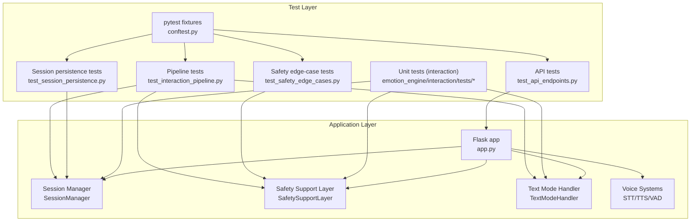
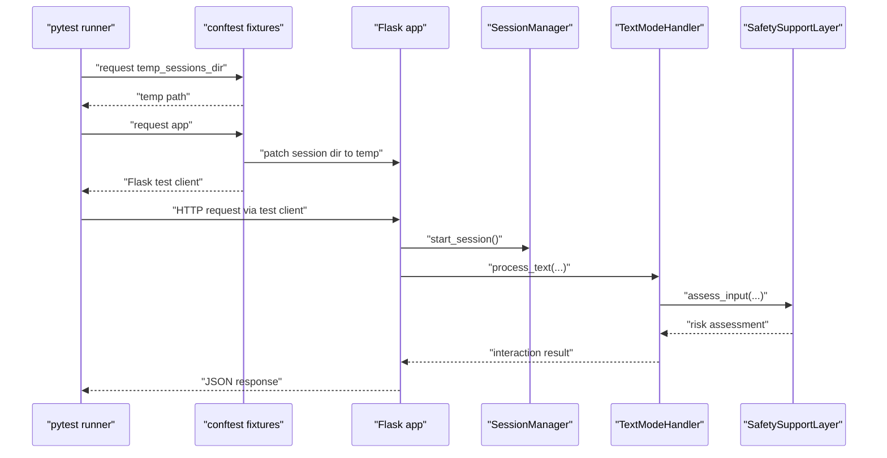
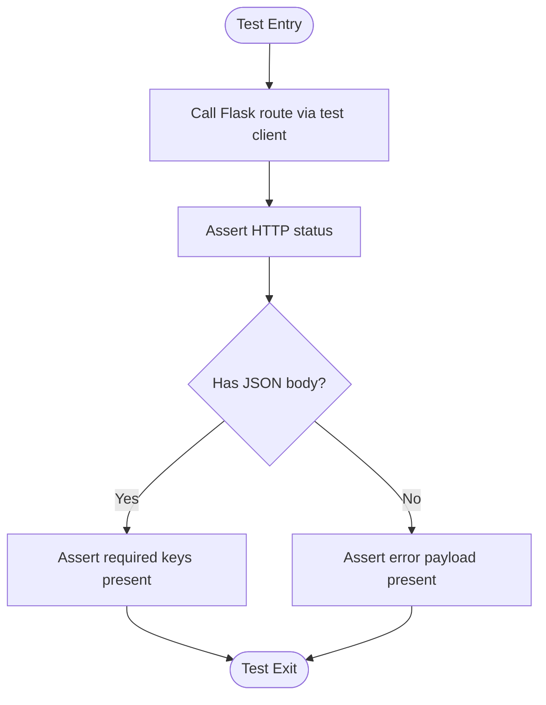
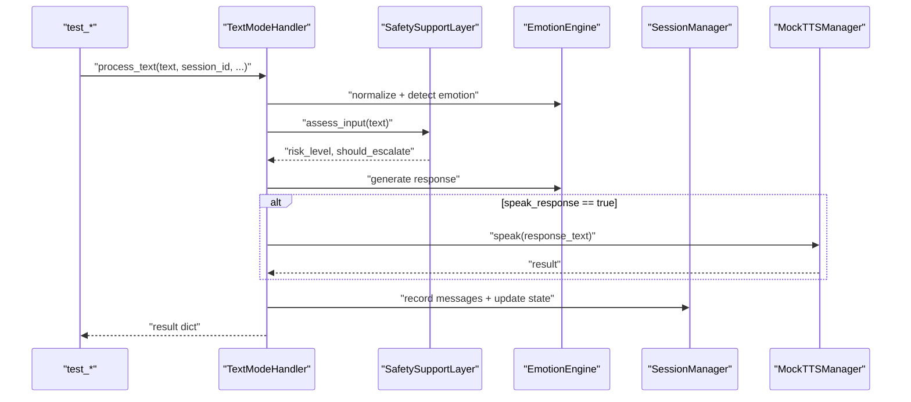
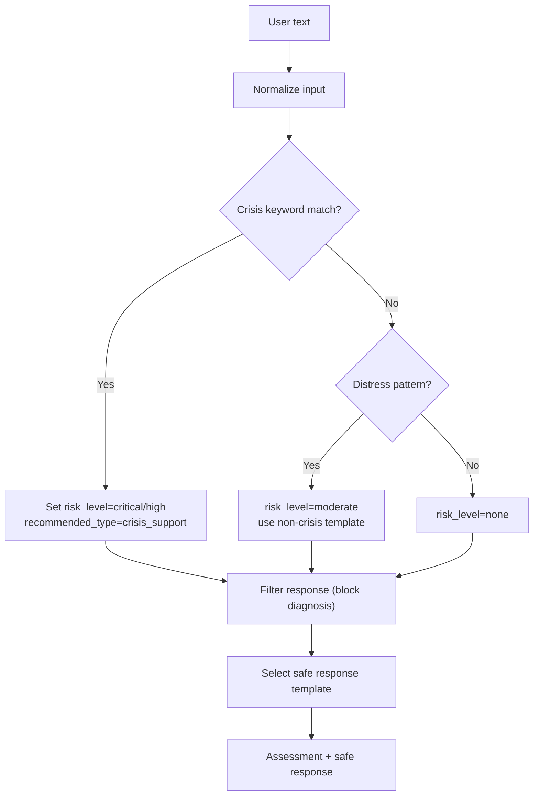
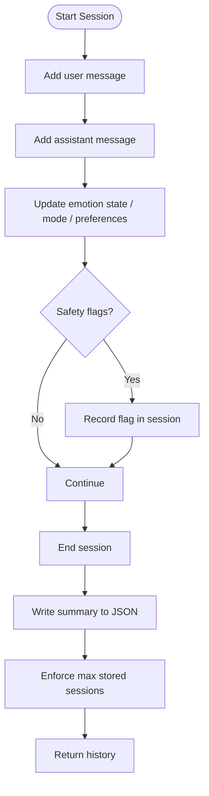
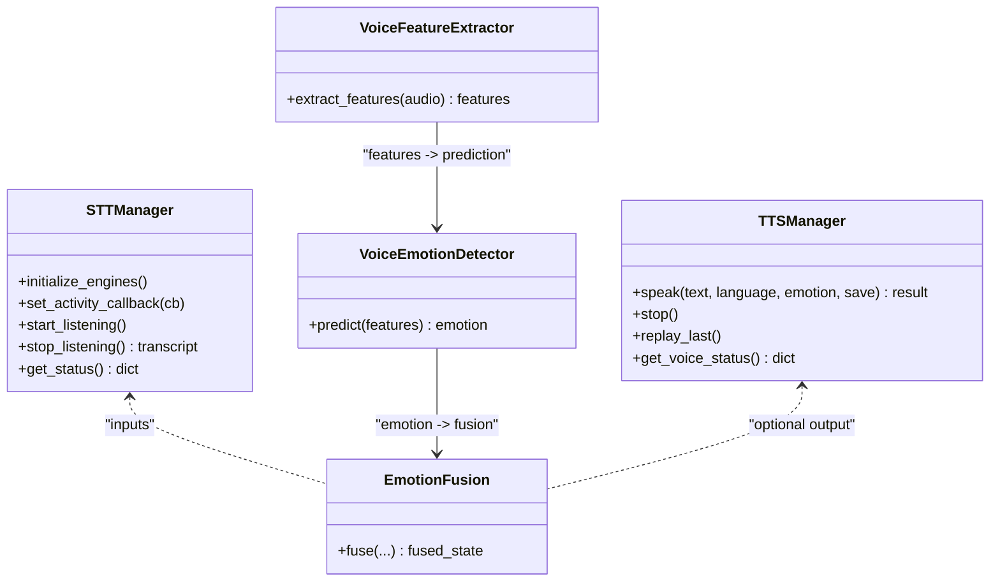
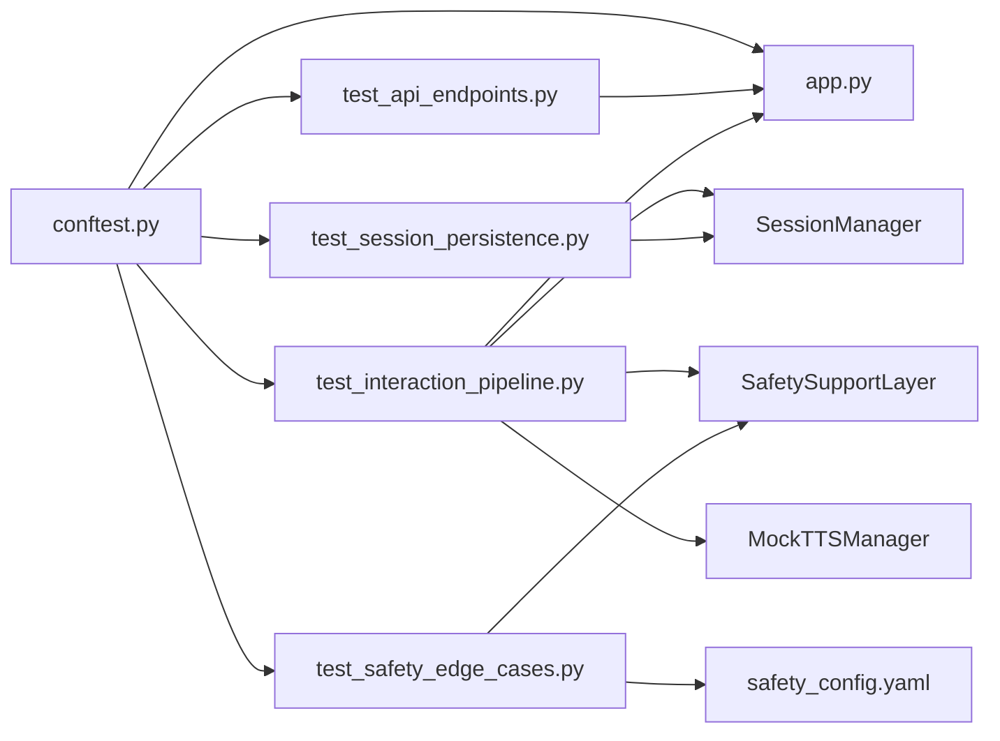

# Testing Strategy

<cite>
**Referenced Files in This Document**
- [conftest.py](file://psychologist/tests/conftest.py)
- [test_api_endpoints.py](file://psychologist/tests/test_api_endpoints.py)
- [test_interaction_pipeline.py](file://psychologist/tests/test_interaction_pipeline.py)
- [test_safety_edge_cases.py](file://psychologist/tests/test_safety_edge_cases.py)
- [test_session_persistence.py](file://psychologist/tests/test_session_persistence.py)
- [app.py](file://psychologist/app.py)
- [requirements.txt](file://psychologist/requirements.txt)
- [safety_config.yaml](file://psychologist/config/safety_config.yaml)
- [test_interaction_mode_manager.py](file://psychologist/emotion_engine/interaction/tests/test_interaction_mode_manager.py)
- [test_safety_support_layer.py](file://psychologist/emotion_engine/interaction/tests/test_safety_support_layer.py)
- [test_session_manager.py](file://psychologist/emotion_engine/interaction/tests/test_session_manager.py)
- [test_support_tools.py](file://psychologist/emotion_engine/interaction/tests/test_support_tools.py)
- [test_text_mode_handler.py](file://psychologist/emotion_engine/interaction/tests/test_text_mode_handler.py)
</cite>

## Table of Contents
1. [Introduction](#introduction)
2. [Project Structure](#project-structure)
3. [Core Components](#core-components)
4. [Architecture Overview](#architecture-overview)
5. [Detailed Component Analysis](#detailed-component-analysis)
6. [Dependency Analysis](#dependency-analysis)
7. [Performance Considerations](#performance-considerations)
8. [Troubleshooting Guide](#troubleshooting-guide)
9. [Conclusion](#conclusion)
10. [Appendices](#appendices)

## Introduction
This document defines the testing strategy for the Psychologist AI Companion. It explains the pytest-based testing framework, test organization by functional areas, and testing approaches for unit, integration, and end-to-end scenarios. It also covers safety testing for crisis detection, voice system testing for speech recognition and synthesis, session management testing for data persistence, and provides guidance on configuration, fixtures, mocking, performance and load testing, and CI/automation.

## Project Structure
The testing suite is organized by functional area and component:
- API endpoint tests validate Flask routes and error handling.
- Interaction pipeline tests validate the full text-mode processing flow.
- Safety edge-case tests validate the safety support layer logic.
- Session persistence tests validate session lifecycle, storage, and analytics.
- Component-specific unit tests exist under emotion_engine/interaction/tests for mode manager, safety layer, session manager, support tools, and text handler.

**Diagram sources**
- [conftest.py:1-130](file://psychologist/tests/conftest.py#L1-L130)
- [test_api_endpoints.py:1-239](file://psychologist/tests/test_api_endpoints.py#L1-L239)
- [test_interaction_pipeline.py:1-269](file://psychologist/tests/test_interaction_pipeline.py#L1-L269)
- [test_safety_edge_cases.py:1-170](file://psychologist/tests/test_safety_edge_cases.py#L1-L170)
- [test_session_persistence.py:1-288](file://psychologist/tests/test_session_persistence.py#L1-L288)
- [app.py:1-551](file://psychologist/app.py#L1-L551)

**Section sources**
- [conftest.py:1-130](file://psychologist/tests/conftest.py#L1-L130)
- [test_api_endpoints.py:1-239](file://psychologist/tests/test_api_endpoints.py#L1-L239)
- [test_interaction_pipeline.py:1-269](file://psychologist/tests/test_interaction_pipeline.py#L1-L269)
- [test_safety_edge_cases.py:1-170](file://psychologist/tests/test_safety_edge_cases.py#L1-L170)
- [test_session_persistence.py:1-288](file://psychologist/tests/test_session_persistence.py#L1-L288)
- [app.py:1-551](file://psychologist/app.py#L1-L551)

## Core Components
- Shared fixtures for Flask app and test client, temporary session directories, and minimal TTS mocking.
- API tests covering health checks, emotion endpoints, SCEA endpoints, session endpoints, support actions, interaction endpoints, and error handling.
- Pipeline tests validating the text-mode interaction flow, safety overrides, distress handling, normalization, TTS integration, and session recording.
- Safety edge-case tests validating crisis detection, distress detection, diagnosis blocking, and language templates.
- Session persistence tests validating lifecycle, message recording, persistence to disk, summaries, follow-up suggestions, recurring emotions, preferred mode, and cleanup.
- Unit tests for interaction components (mode manager, safety layer, session manager, support tools, text handler).

**Section sources**
- [conftest.py:23-130](file://psychologist/tests/conftest.py#L23-L130)
- [test_api_endpoints.py:11-239](file://psychologist/tests/test_api_endpoints.py#L11-L239)
- [test_interaction_pipeline.py:21-269](file://psychologist/tests/test_interaction_pipeline.py#L21-L269)
- [test_safety_edge_cases.py:15-170](file://psychologist/tests/test_safety_edge_cases.py#L15-L170)
- [test_session_persistence.py:27-288](file://psychologist/tests/test_session_persistence.py#L27-L288)
- [test_interaction_mode_manager.py:1-46](file://psychologist/emotion_engine/interaction/tests/test_interaction_mode_manager.py#L1-L46)
- [test_safety_support_layer.py:1-42](file://psychologist/emotion_engine/interaction/tests/test_safety_support_layer.py#L1-L42)
- [test_session_manager.py:1-65](file://psychologist/emotion_engine/interaction/tests/test_session_manager.py#L1-L65)
- [test_support_tools.py:1-40](file://psychologist/emotion_engine/interaction/tests/test_support_tools.py#L1-L40)
- [test_text_mode_handler.py:1-60](file://psychologist/emotion_engine/interaction/tests/test_text_mode_handler.py#L1-L60)

## Architecture Overview
The testing architecture leverages pytest fixtures to isolate tests from shared resources and to simulate environments without audio hardware. The Flask app is configured with a test client, and session data is written to a temporary directory. Tests exercise both API endpoints and internal components, ensuring correctness across safety, session management, and interaction pipelines.

**Diagram sources**
- [conftest.py:31-50](file://psychologist/tests/conftest.py#L31-L50)
- [app.py:290-335](file://psychologist/app.py#L290-L335)
- [test_interaction_pipeline.py:38-90](file://psychologist/tests/test_interaction_pipeline.py#L38-L90)

**Section sources**
- [conftest.py:31-50](file://psychologist/tests/conftest.py#L31-L50)
- [app.py:290-335](file://psychologist/app.py#L290-L335)
- [test_interaction_pipeline.py:38-90](file://psychologist/tests/test_interaction_pipeline.py#L38-L90)

## Detailed Component Analysis

### API Endpoint Testing
- Validates health endpoint and all emotion/SCEA/session/support/interaction routes.
- Ensures proper JSON error responses for invalid input, missing bodies, and method-not-allowed conditions.
- Exercises rate-limited endpoints and verifies structured error handlers.

**Diagram sources**
- [test_api_endpoints.py:11-239](file://psychologist/tests/test_api_endpoints.py#L11-L239)

**Section sources**
- [test_api_endpoints.py:11-239](file://psychologist/tests/test_api_endpoints.py#L11-L239)

### Interaction Pipeline Testing (Text Mode)
- Full end-to-end flow: normalize -> safety check -> emotion detection -> response generation -> optional TTS -> session save.
- Covers normal processing, crisis override, distress handling, response filtering, text normalization, TTS integration, and session recording.
- Uses a mock TTS manager to avoid audio hardware and validates call sequences.

**Diagram sources**
- [test_interaction_pipeline.py:21-36](file://psychologist/tests/test_interaction_pipeline.py#L21-L36)
- [test_interaction_pipeline.py:180-201](file://psychologist/tests/test_interaction_pipeline.py#L180-L201)
- [test_interaction_pipeline.py:203-245](file://psychologist/tests/test_interaction_pipeline.py#L203-L245)

**Section sources**
- [test_interaction_pipeline.py:21-269](file://psychologist/tests/test_interaction_pipeline.py#L21-L269)

### Safety Testing Protocols
- Crisis detection across multiple languages and variants.
- Distress detection thresholds and safe response templates.
- Diagnosis blocking and safe response validation.
- Graceful handling of empty/None input and non-string inputs.
- Professional help reminders and disclaimers per language.

**Diagram sources**
- [test_safety_edge_cases.py:20-80](file://psychologist/tests/test_safety_edge_cases.py#L20-L80)
- [test_safety_edge_cases.py:82-108](file://psychologist/tests/test_safety_edge_cases.py#L82-L108)
- [test_safety_edge_cases.py:110-131](file://psychologist/tests/test_safety_edge_cases.py#L110-L131)
- [test_safety_edge_cases.py:133-150](file://psychologist/tests/test_safety_edge_cases.py#L133-L150)
- [safety_config.yaml:5-116](file://psychologist/config/safety_config.yaml#L5-L116)

**Section sources**
- [test_safety_edge_cases.py:15-170](file://psychologist/tests/test_safety_edge_cases.py#L15-L170)
- [safety_config.yaml:1-116](file://psychologist/config/safety_config.yaml#L1-L116)

### Session Management Testing
- Lifecycle: start, add messages, update state, end, load/save, history.
- Persistence: JSON files in temp directory, auto-save toggle, cleanup policy.
- Analytics: summary generation, follow-up suggestions, recurring emotions, preferred mode.
- Edge cases: no active session, empty sessions, old session cleanup.

**Diagram sources**
- [test_session_persistence.py:37-118](file://psychologist/tests/test_session_persistence.py#L37-L118)
- [test_session_persistence.py:120-165](file://psychologist/tests/test_session_persistence.py#L120-L165)
- [test_session_persistence.py:167-197](file://psychologist/tests/test_session_persistence.py#L167-L197)
- [test_session_persistence.py:199-229](file://psychologist/tests/test_session_persistence.py#L199-L229)
- [test_session_persistence.py:231-257](file://psychologist/tests/test_session_persistence.py#L231-L257)
- [test_session_persistence.py:259-288](file://psychologist/tests/test_session_persistence.py#L259-L288)

**Section sources**
- [test_session_persistence.py:27-288](file://psychologist/tests/test_session_persistence.py#L27-L288)

### Voice System Testing
- Voice input: STT initialization, listening controls, status reporting, audio level monitoring.
- Voice output: TTS speak/stop/replay endpoints, status reporting, mocked TTS behavior.
- Voice emotion: feature extraction, emotion detector, fusion logic.
- Testing approach: Use the mock TTS fixture to validate TTS integration without audio hardware; validate STT availability and status endpoints; validate emotion fusion inputs and outputs.

**Diagram sources**
- [app.py:90-119](file://psychologist/app.py#L90-L119)
- [conftest.py:58-101](file://psychologist/tests/conftest.py#L58-L101)

**Section sources**
- [app.py:90-119](file://psychologist/app.py#L90-L119)
- [conftest.py:58-101](file://psychologist/tests/conftest.py#L58-L101)

### Component-Specific Unit Tests
- Interaction Mode Manager: mode switching, validation fallback, activity callbacks.
- Safety Support Layer: neutral/crisis/distress detection, diagnosis blocking, language templates.
- Session Manager: start/add/save/load/end, persistence, history.
- Support Tools: calm-down, breathing, journaling, reflection prompts.
- Text Mode Handler: normal and crisis processing flows.

**Section sources**
- [test_interaction_mode_manager.py:1-46](file://psychologist/emotion_engine/interaction/tests/test_interaction_mode_manager.py#L1-L46)
- [test_safety_support_layer.py:1-42](file://psychologist/emotion_engine/interaction/tests/test_safety_support_layer.py#L1-L42)
- [test_session_manager.py:1-65](file://psychologist/emotion_engine/interaction/tests/test_session_manager.py#L1-L65)
- [test_support_tools.py:1-40](file://psychologist/emotion_engine/interaction/tests/test_support_tools.py#L1-L40)
- [test_text_mode_handler.py:1-60](file://psychologist/emotion_engine/interaction/tests/test_text_mode_handler.py#L1-L60)

## Dependency Analysis
- Test fixtures depend on the Flask app and patch session directories to a temp location.
- API tests depend on app routes and rate-limiting decorators.
- Pipeline tests depend on EmotionEngine, SafetySupportLayer, SessionManager, and a mock TTS manager.
- Safety edge-case tests depend on SafetySupportLayer and safety_config.yaml.
- Session persistence tests depend on SessionManager and JSON serialization.
- Component unit tests depend on their respective classes under emotion_engine/interaction.

**Diagram sources**
- [conftest.py:31-50](file://psychologist/tests/conftest.py#L31-L50)
- [test_api_endpoints.py:11-239](file://psychologist/tests/test_api_endpoints.py#L11-L239)
- [test_interaction_pipeline.py:21-36](file://psychologist/tests/test_interaction_pipeline.py#L21-L36)
- [test_safety_edge_cases.py:15-170](file://psychologist/tests/test_safety_edge_cases.py#L15-L170)
- [test_session_persistence.py:27-288](file://psychologist/tests/test_session_persistence.py#L27-L288)
- [app.py:1-551](file://psychologist/app.py#L1-L551)
- [safety_config.yaml:1-116](file://psychologist/config/safety_config.yaml#L1-L116)

**Section sources**
- [conftest.py:31-50](file://psychologist/tests/conftest.py#L31-L50)
- [test_api_endpoints.py:11-239](file://psychologist/tests/test_api_endpoints.py#L11-L239)
- [test_interaction_pipeline.py:21-36](file://psychologist/tests/test_interaction_pipeline.py#L21-L36)
- [test_safety_edge_cases.py:15-170](file://psychologist/tests/test_safety_edge_cases.py#L15-L170)
- [test_session_persistence.py:27-288](file://psychologist/tests/test_session_persistence.py#L27-L288)
- [app.py:1-551](file://psychologist/app.py#L1-L551)
- [safety_config.yaml:1-116](file://psychologist/config/safety_config.yaml#L1-L116)

## Performance Considerations
- Rate limiting: Many endpoints are rate-limited; tests should respect limits to avoid false negatives.
- Memory usage: Session persistence writes JSON files; tests should clean temp directories after runs.
- Audio hardware: Use the mock TTS fixture to avoid blocking I/O and reduce flakiness.
- Large responses: Tests validate truncation behavior; ensure downstream consumers handle truncated text gracefully.

[No sources needed since this section provides general guidance]

## Troubleshooting Guide
Common issues and resolutions:
- Missing audio hardware: Use the mock TTS fixture to bypass audio dependencies.
- Session conflicts: Ensure session is started before interaction; tests use a temp sessions directory to avoid cross-test interference.
- Rate limit errors: Verify request frequency and adjust tests accordingly.
- JSON parsing errors: Confirm request bodies are valid JSON and within length limits.
- Fixture cleanup: Ensure temp directories are removed after tests to prevent disk bloat.

**Section sources**
- [conftest.py:58-101](file://psychologist/tests/conftest.py#L58-L101)
- [test_api_endpoints.py:227-239](file://psychologist/tests/test_api_endpoints.py#L227-L239)
- [app.py:159-174](file://psychologist/app.py#L159-L174)

## Conclusion
The testing strategy combines pytest fixtures, targeted unit tests, robust integration tests, and comprehensive safety validations. By isolating state with temp directories, mocking audio I/O, and validating both API and internal pipelines, the suite ensures reliability, safety, and maintainability across all major components.

[No sources needed since this section summarizes without analyzing specific files]

## Appendices

### Test Configuration and Fixtures
- Flask app fixture patches session directories and cleans up after each test.
- Test client fixture enables HTTP-level testing without a live server.
- Mock TTS fixture records speak calls and simulates voice output behavior.
- Sample session JSON fixture provides realistic session data for persistence tests.

**Section sources**
- [conftest.py:23-130](file://psychologist/tests/conftest.py#L23-L130)

### Writing Effective Tests
- Keep tests focused and deterministic; use fixtures for setup/teardown.
- Validate both success paths and error conditions.
- Prefer small, incremental assertions to localize failures quickly.
- Use representative inputs (including edge cases) for safety and normalization.

[No sources needed since this section provides general guidance]

### Continuous Integration and Automation
- Run pytest with coverage to track test coverage.
- Configure linters and formatters to keep tests readable.
- Use GitHub Actions or similar to run tests on push and pull requests.
- Cache pip dependencies and reuse virtual environments for speed.

[No sources needed since this section provides general guidance]

### Dependencies for Testing
- Core dependencies include Flask, CORS, and optional visualization/computer vision packages.
- Voice system dependencies include audio libraries and ASR engines; tests can run without them using mocks.

**Section sources**
- [requirements.txt:1-21](file://psychologist/requirements.txt#L1-L21)