# Audio Processing Pipeline

<cite>
**Referenced Files in This Document**
- [audio_preprocessor.py](file://psychologist/emotion_engine/voice_system/audio_preprocessor.py)
- [microphone.py](file://psychologist/emotion_engine/voice_system/microphone.py)
- [emotion_fusion.py](file://psychologist/emotion_engine/voice_system/emotion_fusion.py)
- [audio_config.py](file://psychologist/emotion_engine/voice_system/audio_config.py)
- [vad.py](file://psychologist/emotion_engine/voice_system/vad.py)
- [models.py](file://psychologist/emotion_engine/voice_system/models.py)
- [stt_manager.py](file://psychologist/emotion_engine/voice_system/stt_manager.py)
- [voice_emotion_detector.py](file://psychologist/emotion_engine/voice_system/voice_emotion_detector.py)
- [voice_feature_extractor.py](file://psychologist/emotion_engine/voice_system/voice_feature_extractor.py)
- [voice_config.yaml](file://config/voice_config.yaml)
</cite>

## Table of Contents
1. [Introduction](#introduction)
2. [Project Structure](#project-structure)
3. [Core Components](#core-components)
4. [Architecture Overview](#architecture-overview)
5. [Detailed Component Analysis](#detailed-component-analysis)
6. [Dependency Analysis](#dependency-analysis)
7. [Performance Considerations](#performance-considerations)
8. [Troubleshooting Guide](#troubleshooting-guide)
9. [Conclusion](#conclusion)
10. [Appendices](#appendices)

## Introduction
This document describes the Audio Processing Pipeline responsible for capturing, preprocessing, analyzing, and integrating audio signals into the broader voice processing system. It covers:
- Audio preprocessor capabilities for noise reduction, filtering, normalization, silence trimming, and resampling
- Microphone integration for device selection, capture configuration, and input quality monitoring
- Audio configuration management via YAML-based settings for sampling rates, engines, and quality weights
- Emotion fusion combining voice-based emotional analysis with textual and memory-based modalities
- Real-time processing considerations, latency optimization, and resource management
- Configuration examples, troubleshooting steps, and performance tuning guidance

## Project Structure
The audio pipeline spans several modules under the voice system, with shared models and configuration:
- Voice system modules: microphone capture, preprocessing, VAD, STT orchestration, voice feature extraction, voice emotion detection, and multimodal emotion fusion
- Shared models: audio input configuration and structured results for speech and emotion
- Configuration: YAML-based settings for speech recognition, TTS, voice emotion, and privacy

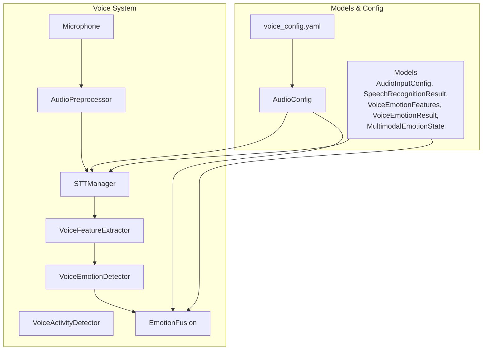

**Diagram sources**
- [microphone.py:14-95](file://psychologist/emotion_engine/voice_system/microphone.py#L14-L95)
- [audio_preprocessor.py:7-66](file://psychologist/emotion_engine/voice_system/audio_preprocessor.py#L7-L66)
- [vad.py:7-50](file://psychologist/emotion_engine/voice_system/vad.py#L7-L50)
- [stt_manager.py:17-104](file://psychologist/emotion_engine/voice_system/stt_manager.py#L17-L104)
- [voice_feature_extractor.py:11-62](file://psychologist/emotion_engine/voice_system/voice_feature_extractor.py#L11-L62)
- [voice_emotion_detector.py:6-53](file://psychologist/emotion_engine/voice_system/voice_emotion_detector.py#L6-L53)
- [emotion_fusion.py:7-49](file://psychologist/emotion_engine/voice_system/emotion_fusion.py#L7-L49)
- [audio_config.py:11-101](file://psychologist/emotion_engine/voice_system/audio_config.py#L11-L101)
- [models.py:8-108](file://psychologist/emotion_engine/voice_system/models.py#L8-L108)
- [voice_config.yaml:1-28](file://config/voice_config.yaml#L1-L28)

**Section sources**
- [microphone.py:14-95](file://psychologist/emotion_engine/voice_system/microphone.py#L14-L95)
- [audio_preprocessor.py:7-66](file://psychologist/emotion_engine/voice_system/audio_preprocessor.py#L7-L66)
- [vad.py:7-50](file://psychologist/emotion_engine/voice_system/vad.py#L7-L50)
- [stt_manager.py:17-104](file://psychologist/emotion_engine/voice_system/stt_manager.py#L17-L104)
- [voice_feature_extractor.py:11-62](file://psychologist/emotion_engine/voice_system/voice_feature_extractor.py#L11-L62)
- [voice_emotion_detector.py:6-53](file://psychologist/emotion_engine/voice_system/voice_emotion_detector.py#L6-L53)
- [emotion_fusion.py:7-49](file://psychologist/emotion_engine/voice_system/emotion_fusion.py#L7-L49)
- [audio_config.py:11-101](file://psychologist/emotion_engine/voice_system/audio_config.py#L11-L101)
- [models.py:8-108](file://psychologist/emotion_engine/voice_system/models.py#L8-L108)
- [voice_config.yaml:1-28](file://config/voice_config.yaml#L1-L28)

## Core Components
- AudioPreprocessor: Applies high-pass filtering, normalization, noise reduction, silence trimming, and optional resampling to clean and prepare audio for downstream tasks.
- Microphone: Provides device enumeration, asynchronous audio capture via callbacks, level monitoring, and chunk delivery via a queue.
- VoiceActivityDetector: Performs frame-wise voice activity detection using WebRTC VAD to segment speech regions.
- STTManager: Orchestrates continuous listening, buffering chunks, preprocessing, and transcription using selected engines.
- VoiceFeatureExtractor: Computes acoustic features (pitch statistics, energy, spectral centroid, MFCC summary, intensity) for emotion analysis.
- VoiceEmotionDetector: Translates extracted features into emotion probabilities using rule-based scoring.
- EmotionFusion: Combines voice-based, textual, and memory-based emotion scores into a unified multimodal state with configurable weights.
- AudioConfig and voice_config.yaml: Centralized configuration for engines, sampling rates, voice emotion weights, and privacy settings.

**Section sources**
- [audio_preprocessor.py:7-66](file://psychologist/emotion_engine/voice_system/audio_preprocessor.py#L7-L66)
- [microphone.py:14-95](file://psychologist/emotion_engine/voice_system/microphone.py#L14-L95)
- [vad.py:7-50](file://psychologist/emotion_engine/voice_system/vad.py#L7-L50)
- [stt_manager.py:17-104](file://psychologist/emotion_engine/voice_system/stt_manager.py#L17-L104)
- [voice_feature_extractor.py:11-62](file://psychologist/emotion_engine/voice_system/voice_feature_extractor.py#L11-L62)
- [voice_emotion_detector.py:6-53](file://psychologist/emotion_engine/voice_system/voice_emotion_detector.py#L6-L53)
- [emotion_fusion.py:7-49](file://psychologist/emotion_engine/voice_system/emotion_fusion.py#L7-L49)
- [audio_config.py:11-101](file://psychologist/emotion_engine/voice_system/audio_config.py#L11-L101)
- [models.py:8-108](file://psychologist/emotion_engine/voice_system/models.py#L8-L108)
- [voice_config.yaml:1-28](file://config/voice_config.yaml#L1-L28)

## Architecture Overview
The pipeline captures audio asynchronously, buffers chunks, preprocesses the audio, optionally detects speech regions, extracts features, infers voice-based emotions, and fuses them with other modalities.

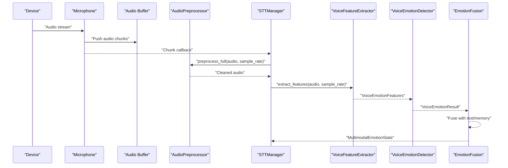

**Diagram sources**
- [microphone.py:40-67](file://psychologist/emotion_engine/voice_system/microphone.py#L40-L67)
- [stt_manager.py:51-92](file://psychologist/emotion_engine/voice_system/stt_manager.py#L51-L92)
- [audio_preprocessor.py:57-64](file://psychologist/emotion_engine/voice_system/audio_preprocessor.py#L57-L64)
- [voice_feature_extractor.py:13-60](file://psychologist/emotion_engine/voice_system/voice_feature_extractor.py#L13-L60)
- [voice_emotion_detector.py:8-51](file://psychologist/emotion_engine/voice_system/voice_emotion_detector.py#L8-L51)
- [emotion_fusion.py:11-47](file://psychologist/emotion_engine/voice_system/emotion_fusion.py#L11-L47)

## Detailed Component Analysis

### AudioPreprocessor
Responsibilities:
- High-pass filtering to remove DC and low-frequency noise
- Peak normalization to prevent clipping
- Noise reduction via spectral subtraction-like technique using early segment statistics
- Silence trimming around non-silent regions with configurable padding
- Resampling to target rate when needed

Processing logic:
- Applies filters and transforms in sequence to produce a clean, normalized waveform suitable for transcription and emotion analysis.

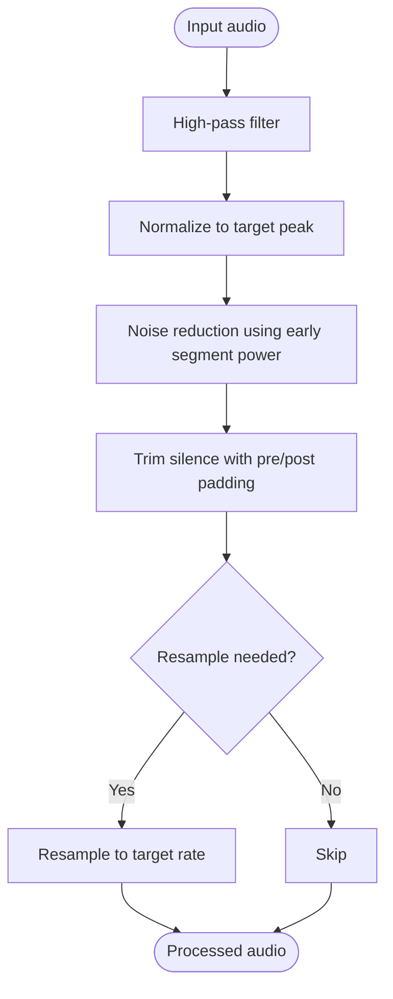

**Diagram sources**
- [audio_preprocessor.py:57-64](file://psychologist/emotion_engine/voice_system/audio_preprocessor.py#L57-L64)
- [audio_preprocessor.py:32-34](file://psychologist/emotion_engine/voice_system/audio_preprocessor.py#L32-L34)
- [audio_preprocessor.py:9-13](file://psychologist/emotion_engine/voice_system/audio_preprocessor.py#L9-L13)
- [audio_preprocessor.py:16-29](file://psychologist/emotion_engine/voice_system/audio_preprocessor.py#L16-L29)
- [audio_preprocessor.py:37-47](file://psychologist/emotion_engine/voice_system/audio_preprocessor.py#L37-L47)
- [audio_preprocessor.py:50-54](file://psychologist/emotion_engine/voice_system/audio_preprocessor.py#L50-L54)

**Section sources**
- [audio_preprocessor.py:7-66](file://psychologist/emotion_engine/voice_system/audio_preprocessor.py#L7-L66)

### Microphone Integration
Responsibilities:
- Device enumeration to select input devices with input channels
- Asynchronous capture via sounddevice InputStream with configurable sample rate, channels, and chunk size
- Audio level computation and optional level callback
- Thread-safe queue-based chunk delivery

Key behaviors:
- Starts/stops the input stream safely
- Emits chunks to a queue for downstream processing
- Clears queue and handles empty reads gracefully

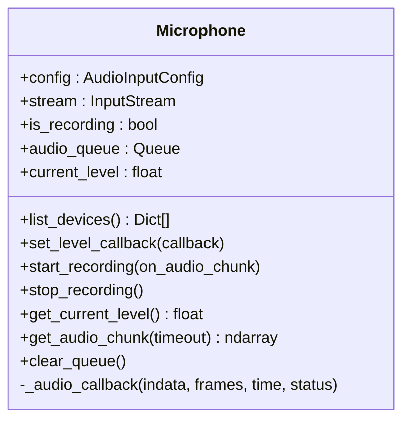

**Diagram sources**
- [microphone.py:14-95](file://psychologist/emotion_engine/voice_system/microphone.py#L14-L95)
- [models.py:8-17](file://psychologist/emotion_engine/voice_system/models.py#L8-L17)

**Section sources**
- [microphone.py:14-95](file://psychologist/emotion_engine/voice_system/microphone.py#L14-L95)
- [models.py:8-17](file://psychologist/emotion_engine/voice_system/models.py#L8-L17)

### Voice Activity Detection (VAD)
Responsibilities:
- Frame-wise speech/non-speech classification using WebRTC VAD
- Region segmentation to identify contiguous speech segments
- Frame size computed from sample rate and duration

Behavior:
- Converts float32 waveform to int16 per VAD requirement
- Pads or truncates frames to exact size
- Returns boolean per frame and aggregates speech regions

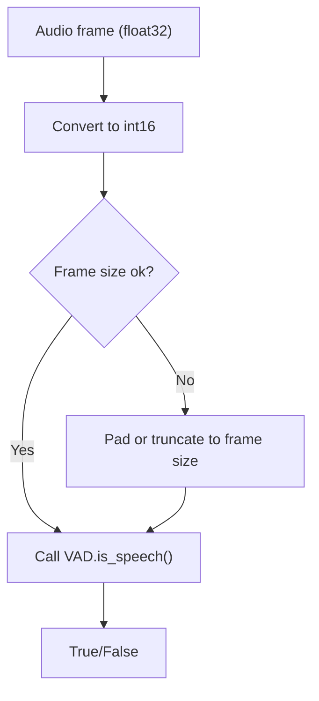

**Diagram sources**
- [vad.py:14-26](file://psychologist/emotion_engine/voice_system/vad.py#L14-L26)
- [vad.py:28-48](file://psychologist/emotion_engine/voice_system/vad.py#L28-L48)

**Section sources**
- [vad.py:7-50](file://psychologist/emotion_engine/voice_system/vad.py#L7-L50)

### Speech-to-Text Manager (STTManager)
Responsibilities:
- Continuous listening loop that buffers audio chunks from the microphone
- Preprocessing prior to transcription
- Engine selection and transcription execution
- Saving temporary audio for engines that require files
- Callback-driven result emission

Processing flow:
- Initializes engines, starts recording, accumulates chunks, preprocesses, transcribes, and emits results.

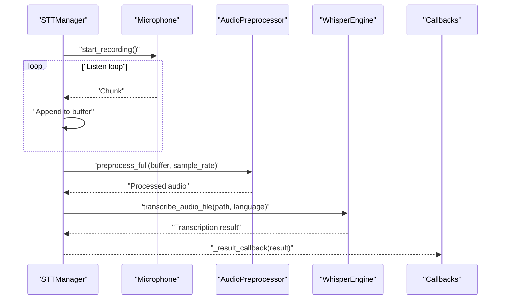

**Diagram sources**
- [stt_manager.py:44-92](file://psychologist/emotion_engine/voice_system/stt_manager.py#L44-L92)
- [audio_preprocessor.py:57-64](file://psychologist/emotion_engine/voice_system/audio_preprocessor.py#L57-L64)

**Section sources**
- [stt_manager.py:17-104](file://psychologist/emotion_engine/voice_system/stt_manager.py#L17-L104)

### Voice Feature Extraction
Responsibilities:
- Normalizes audio
- Extracts pitch statistics using probabilistic peak tracking
- Computes energy, spectral centroid, MFCC summary, and RMS-based intensity
- Provides simplified speaking rate and silence ratio estimates

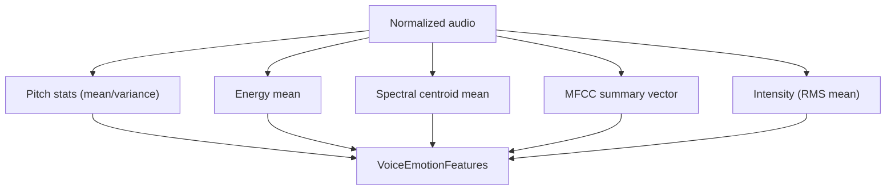

**Diagram sources**
- [voice_feature_extractor.py:13-60](file://psychologist/emotion_engine/voice_system/voice_feature_extractor.py#L13-L60)

**Section sources**
- [voice_feature_extractor.py:11-62](file://psychologist/emotion_engine/voice_system/voice_feature_extractor.py#L11-L62)
- [models.py:44-66](file://psychologist/emotion_engine/voice_system/models.py#L44-L66)

### Voice Emotion Detector
Responsibilities:
- Translates acoustic features into emotion probabilities using rule-based scoring
- Normalizes scores and determines dominant emotion and confidence

Scoring rationale:
- Happy: high pitch mean/variance, high energy
- Sad: low pitch mean/variance, low energy
- Angry: high pitch, high variance, high energy
- Fearful: elevated pitch and variance with variable energy
- Calm: low pitch, low variance with moderate energy

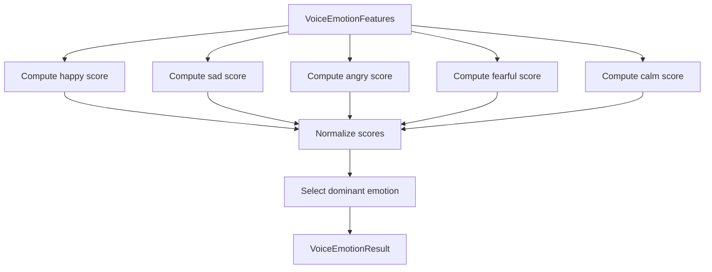

**Diagram sources**
- [voice_emotion_detector.py:8-51](file://psychologist/emotion_engine/voice_system/voice_emotion_detector.py#L8-L51)

**Section sources**
- [voice_emotion_detector.py:6-53](file://psychologist/emotion_engine/voice_system/voice_emotion_detector.py#L6-L53)
- [models.py:70-84](file://psychologist/emotion_engine/voice_system/models.py#L70-L84)

### Emotion Fusion
Responsibilities:
- Combines voice-based, textual, and memory-based emotion distributions using configurable weights
- Normalizes fused scores and selects the dominant emotion
- Produces a multimodal emotion state with explanation summary

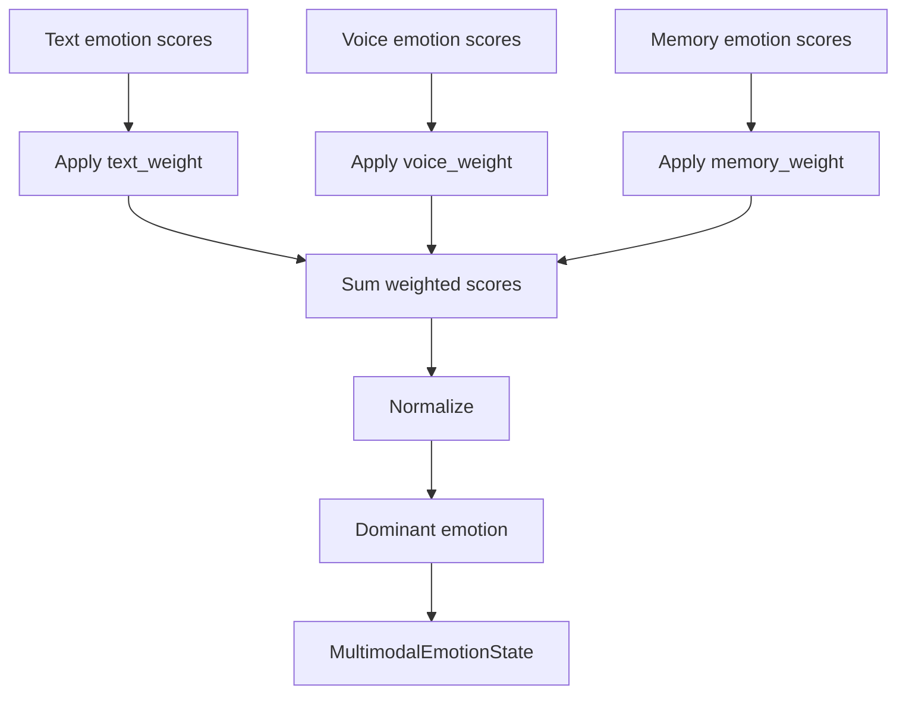

**Diagram sources**
- [emotion_fusion.py:11-47](file://psychologist/emotion_engine/voice_system/emotion_fusion.py#L11-L47)
- [models.py:88-106](file://psychologist/emotion_engine/voice_system/models.py#L88-L106)

**Section sources**
- [emotion_fusion.py:7-49](file://psychologist/emotion_engine/voice_system/emotion_fusion.py#L7-L49)
- [models.py:88-106](file://psychologist/emotion_engine/voice_system/models.py#L88-L106)

### Audio Configuration Management
Responsibilities:
- Loads and persists YAML-based configuration
- Provides typed accessors for STT/TTS engines, sampling rates, voice emotion weights, and privacy settings
- Defaults to safe values when configuration is missing or invalid

Configuration highlights:
- Speech recognition: default/fallback engines, language, sample rate, continuous listening, and raw audio saving
- TTS: default/fallback engines, voice identity, speed, pitch, volume, and output persistence
- Voice emotion: enable flags, fusion enablement, and weights for text/voice/memory
- Privacy: offline-only operation, cloud audio allowance, voice cloning, and storage preferences

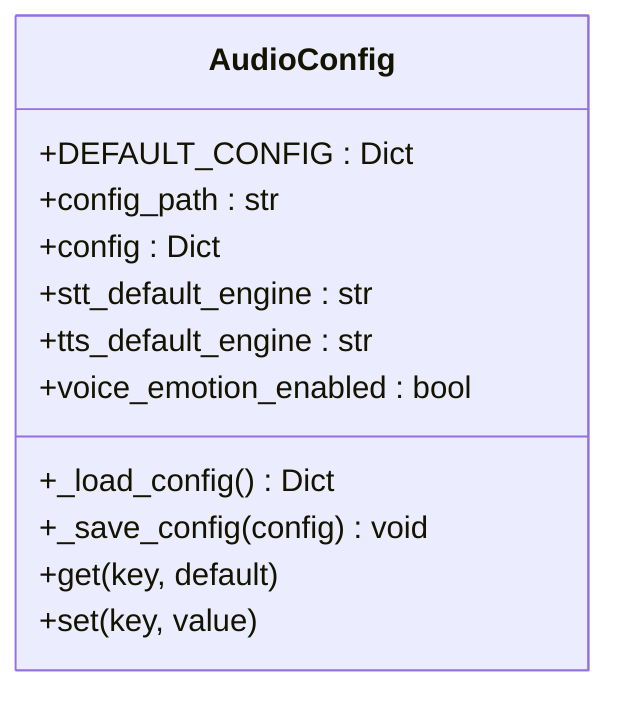

**Diagram sources**
- [audio_config.py:11-101](file://psychologist/emotion_engine/voice_system/audio_config.py#L11-L101)
- [voice_config.yaml:1-28](file://config/voice_config.yaml#L1-L28)

**Section sources**
- [audio_config.py:11-101](file://psychologist/emotion_engine/voice_system/audio_config.py#L11-L101)
- [voice_config.yaml:1-28](file://config/voice_config.yaml#L1-L28)

## Dependency Analysis
The voice system modules depend on shared models and configuration. STTManager composes microphone, preprocessor, and engines. Emotion fusion depends on configuration weights and multimodal states.

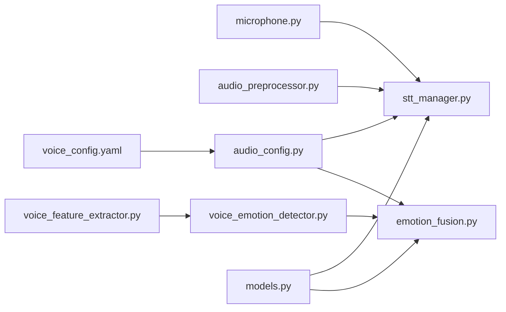

**Diagram sources**
- [stt_manager.py:17-28](file://psychologist/emotion_engine/voice_system/stt_manager.py#L17-L28)
- [emotion_fusion.py:8-9](file://psychologist/emotion_engine/voice_system/emotion_fusion.py#L8-L9)
- [audio_config.py:46-48](file://psychologist/emotion_engine/voice_system/audio_config.py#L46-L48)
- [models.py:8-108](file://psychologist/emotion_engine/voice_system/models.py#L8-L108)

**Section sources**
- [stt_manager.py:17-28](file://psychologist/emotion_engine/voice_system/stt_manager.py#L17-L28)
- [emotion_fusion.py:8-9](file://psychologist/emotion_engine/voice_system/emotion_fusion.py#L8-L9)
- [audio_config.py:46-48](file://psychologist/emotion_engine/voice_system/audio_config.py#L46-L48)
- [models.py:8-108](file://psychologist/emotion_engine/voice_system/models.py#L8-L108)

## Performance Considerations
- Latency optimization
  - Reduce chunk size for lower latency at the cost of CPU overhead; balance chunk_size against responsiveness
  - Use efficient preprocessing order to minimize redundant copies
  - Prefer in-memory processing and avoid unnecessary file writes; temporary WAV saving is used for engines requiring files
- Resource management
  - Monitor current audio level to detect clipping and adjust gain upstream
  - Keep audio queues bounded; clear queues before starting recording to avoid backlog
  - Use appropriate sample rates (e.g., 16 kHz) to balance quality and compute load
- Throughput and accuracy
  - Apply high-pass filtering and noise reduction to improve downstream transcription and emotion accuracy
  - Use VAD to skip silence and reduce unnecessary processing
  - Tune voice emotion weights to emphasize reliable modalities in your deployment context

[No sources needed since this section provides general guidance]

## Troubleshooting Guide
Common issues and resolutions:
- No audio captured
  - Verify device enumeration and selection; ensure the chosen device supports input channels
  - Confirm sample rate and channel count match the device’s defaults
  - Check that the recording thread started without exceptions
- Low-quality transcription
  - Increase noise reduction strength or improve microphone placement
  - Normalize audio to prevent clipping; ensure peak normalization is applied
  - Use high-pass filtering to remove rumble and DC offset
- Emotion scores unstable
  - Validate feature extraction completeness; check for NaNs or zero-energy segments
  - Adjust voice emotion weights to emphasize more reliable modalities
- Excessive latency
  - Reduce chunk size and ensure the system is not I/O bound
  - Avoid blocking operations in callbacks; keep preprocessing lightweight
- Configuration not taking effect
  - Confirm YAML path and permissions; ensure the file exists and is readable
  - Use setters to persist updates to disk

**Section sources**
- [microphone.py:24-35](file://psychologist/emotion_engine/voice_system/microphone.py#L24-L35)
- [microphone.py:44-57](file://psychologist/emotion_engine/voice_system/microphone.py#L44-L57)
- [audio_preprocessor.py:9-13](file://psychologist/emotion_engine/voice_system/audio_preprocessor.py#L9-L13)
- [audio_preprocessor.py:16-29](file://psychologist/emotion_engine/voice_system/audio_preprocessor.py#L16-L29)
- [stt_manager.py:75-92](file://psychologist/emotion_engine/voice_system/stt_manager.py#L75-L92)
- [audio_config.py:50-60](file://psychologist/emotion_engine/voice_system/audio_config.py#L50-L60)

## Conclusion
The Audio Processing Pipeline integrates robust microphone capture, efficient preprocessing, transcription orchestration, and multimodal emotion fusion. By tuning configuration parameters, optimizing chunk sizes, and leveraging VAD and noise reduction, deployments can achieve responsive, accurate, and privacy-compliant voice processing across diverse hardware and environments.

[No sources needed since this section summarizes without analyzing specific files]

## Appendices

### Configuration Examples
- Minimal desktop setup
  - Sample rate: 16000 Hz
  - Channels: 1
  - Chunk size: 4096
  - Engines: Vosk for STT, Piper for TTS
  - Voice emotion weights: text 0.55, voice 0.35, memory 0.10
- Laptop with integrated mic
  - Reduce chunk size to 2048 for lower latency
  - Enable noise reduction and high-pass filtering
  - Keep continuous listening disabled to reduce CPU usage
- Headset with external mic
  - Match device default sample rate and channels
  - Normalize audio and trim silence to reduce file sizes
- Offline-only deployment
  - Set offline-only flag and disable cloud audio
  - Persist configuration to YAML for reproducibility

**Section sources**
- [voice_config.yaml:6-27](file://config/voice_config.yaml#L6-L27)
- [models.py:8-17](file://psychologist/emotion_engine/voice_system/models.py#L8-L17)
- [audio_config.py:11-44](file://psychologist/emotion_engine/voice_system/audio_config.py#L11-L44)