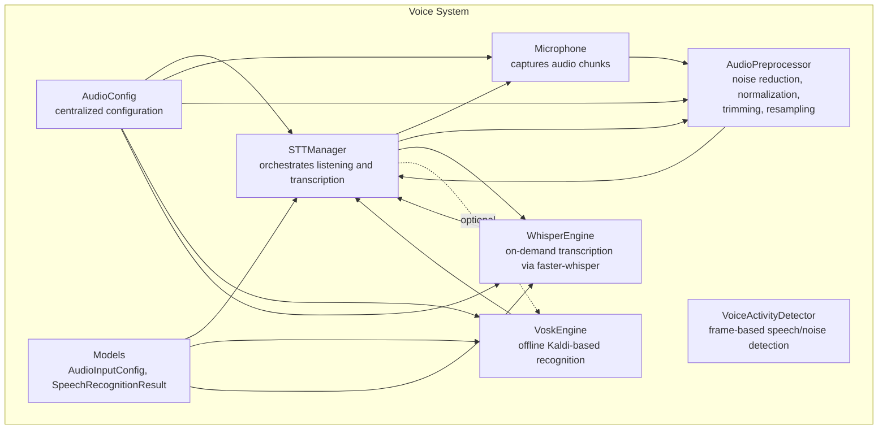
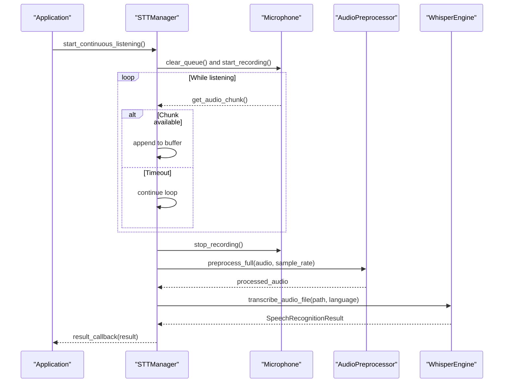
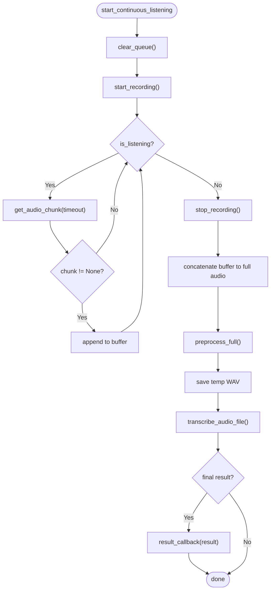
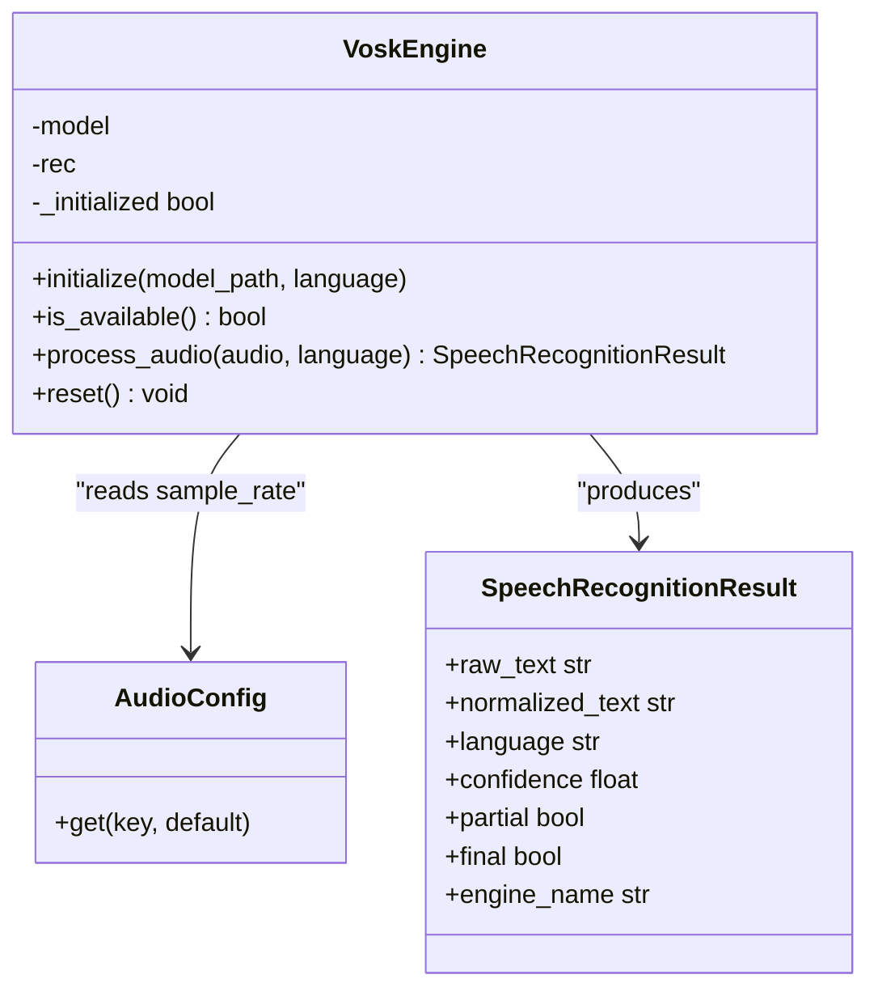
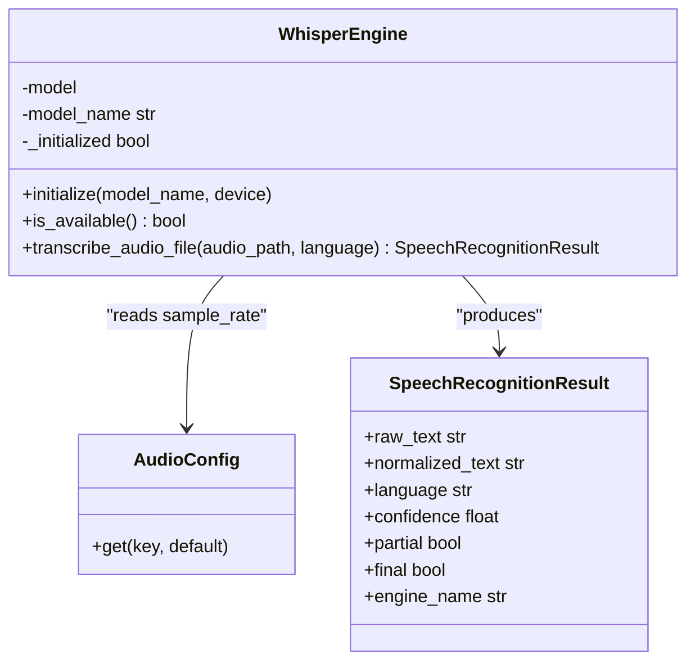
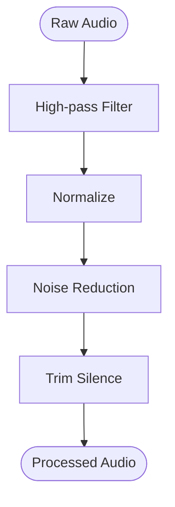
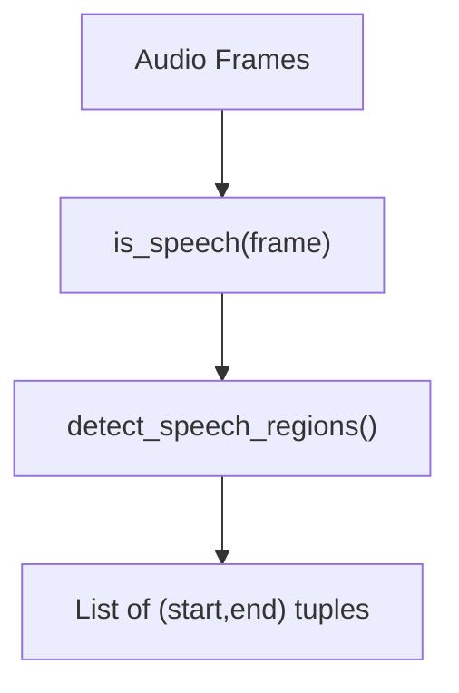
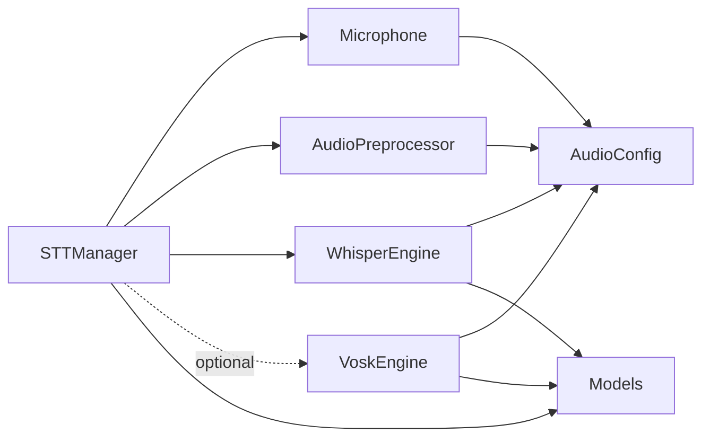
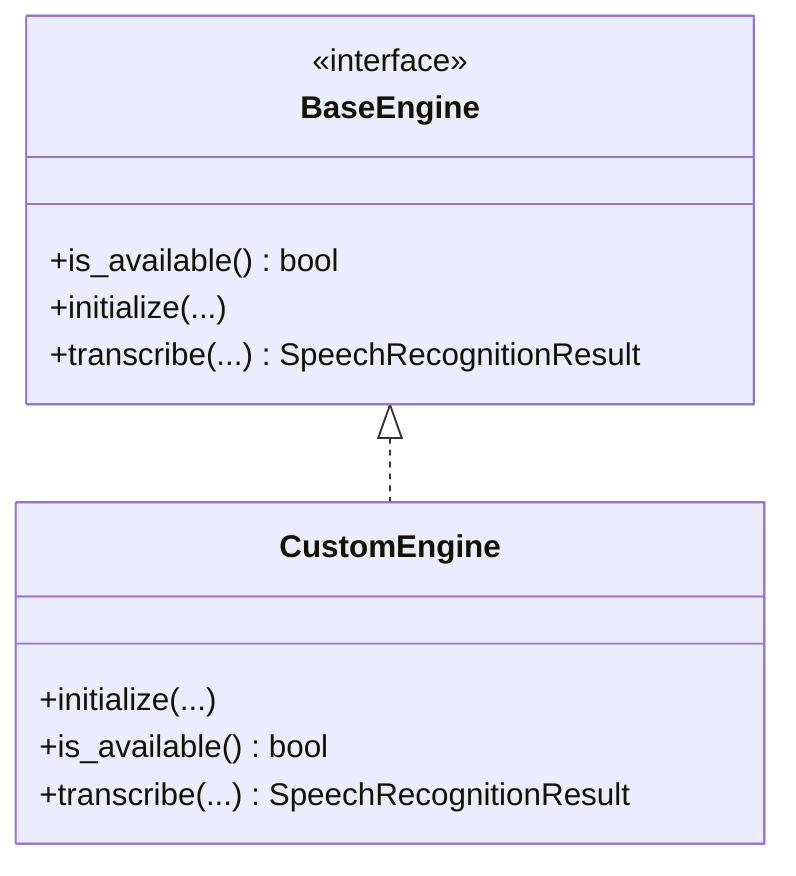

# Speech Recognition (STT)

<cite>
**Referenced Files in This Document**
- [stt_manager.py](file://psychologist/emotion_engine/voice_system/stt_manager.py)
- [vosk_engine.py](file://psychologist/emotion_engine/voice_system/vosk_engine.py)
- [whisper_engine.py](file://psychologist/emotion_engine/voice_system/whisper_engine.py)
- [audio_preprocessor.py](file://psychologist/emotion_engine/voice_system/audio_preprocessor.py)
- [vad.py](file://psychologist/emotion_engine/voice_system/vad.py)
- [audio_config.py](file://psychologist/emotion_engine/voice_system/audio_config.py)
- [microphone.py](file://psychologist/emotion_engine/voice_system/microphone.py)
- [models.py](file://psychologist/emotion_engine/voice_system/models.py)
</cite>

## Table of Contents
1. [Introduction](#introduction)
2. [Project Structure](#project-structure)
3. [Core Components](#core-components)
4. [Architecture Overview](#architecture-overview)
5. [Detailed Component Analysis](#detailed-component-analysis)
6. [Dependency Analysis](#dependency-analysis)
7. [Performance Considerations](#performance-considerations)
8. [Troubleshooting Guide](#troubleshooting-guide)
9. [Conclusion](#conclusion)
10. [Appendices](#appendices)

## Introduction
This document describes the Speech Recognition (STT) subsystem responsible for converting spoken audio into text. It explains how the STT Manager coordinates continuous listening, audio preprocessing, and transcription via two engines: Vosk (offline) and Whisper (on-demand). It also documents the audio pipeline, voice activity detection (VAD), configuration options, performance tuning, troubleshooting, and extension guidelines for adding new engines.

## Project Structure
The STT system resides under the voice_system package and integrates tightly with audio capture, preprocessing, and result modeling.

**Diagram sources**
- [stt_manager.py:17-104](file://psychologist/emotion_engine/voice_system/stt_manager.py#L17-L104)
- [microphone.py:14-95](file://psychologist/emotion_engine/voice_system/microphone.py#L14-L95)
- [audio_preprocessor.py:7-66](file://psychologist/emotion_engine/voice_system/audio_preprocessor.py#L7-L66)
- [vad.py:7-50](file://psychologist/emotion_engine/voice_system/vad.py#L7-L50)
- [vosk_engine.py:13-89](file://psychologist/emotion_engine/voice_system/vosk_engine.py#L13-L89)
- [whisper_engine.py:13-65](file://psychologist/emotion_engine/voice_system/whisper_engine.py#L13-L65)
- [audio_config.py:11-101](file://psychologist/emotion_engine/voice_system/audio_config.py#L11-L101)
- [models.py:8-41](file://psychologist/emotion_engine/voice_system/models.py#L8-L41)

**Section sources**
- [stt_manager.py:17-104](file://psychologist/emotion_engine/voice_system/stt_manager.py#L17-L104)
- [audio_config.py:11-101](file://psychologist/emotion_engine/voice_system/audio_config.py#L11-L101)
- [models.py:8-41](file://psychologist/emotion_engine/voice_system/models.py#L8-L41)

## Core Components
- STT Manager: Central coordinator for continuous listening, buffering audio chunks, invoking preprocessing, and selecting a transcription engine. It supports callbacks for results and activity logging.
- Engines:
  - VoskEngine: Offline speech recognition using Kaldi models. Initializes with a local model path and sample rate.
  - WhisperEngine: On-demand transcription using faster-whisper. Initializes with a model name and device selection.
- Audio Pipeline: Preprocessing steps include high-pass filtering, normalization, noise reduction, silence trimming, and resampling.
- Voice Activity Detection: Frame-based detection using WebRTC VAD to identify speech regions.
- Configuration: Centralized YAML-backed configuration for STT defaults, sample rates, engines, and privacy settings.
- Models: Typed data structures for input configuration and recognition results.

**Section sources**
- [stt_manager.py:17-104](file://psychologist/emotion_engine/voice_system/stt_manager.py#L17-L104)
- [vosk_engine.py:13-89](file://psychologist/emotion_engine/voice_system/vosk_engine.py#L13-L89)
- [whisper_engine.py:13-65](file://psychologist/emotion_engine/voice_system/whisper_engine.py#L13-L65)
- [audio_preprocessor.py:7-66](file://psychologist/emotion_engine/voice_system/audio_preprocessor.py#L7-L66)
- [vad.py:7-50](file://psychologist/emotion_engine/voice_system/vad.py#L7-L50)
- [audio_config.py:11-101](file://psychologist/emotion_engine/voice_system/audio_config.py#L11-L101)
- [models.py:8-41](file://psychologist/emotion_engine/voice_system/models.py#L8-L41)

## Architecture Overview
The STT Manager runs a dedicated listening thread that continuously reads audio chunks from the Microphone, buffers them, and triggers transcription after stopping. The audio is preprocessed before being passed to the selected engine. The Whisper engine is currently integrated; Vosk initialization is supported but not invoked in the current flow.

**Diagram sources**
- [stt_manager.py:44-104](file://psychologist/emotion_engine/voice_system/stt_manager.py#L44-L104)
- [microphone.py:40-87](file://psychologist/emotion_engine/voice_system/microphone.py#L40-L87)
- [audio_preprocessor.py:57-66](file://psychologist/emotion_engine/voice_system/audio_preprocessor.py#L57-L66)
- [whisper_engine.py:43-63](file://psychologist/emotion_engine/voice_system/whisper_engine.py#L43-L63)

## Detailed Component Analysis

### STT Manager
Responsibilities:
- Initialize engines and configure defaults.
- Manage continuous listening loop with a background thread.
- Buffer audio chunks from the microphone until stopped.
- Preprocess full buffered audio and trigger transcription.
- Route results to a registered callback and emit activity events.

Key behaviors:
- Starts/stops recording via the Microphone interface.
- Uses a temporary WAV file for Whisper transcription.
- Emits activity logs via an optional callback.
- Supports language switching.

**Diagram sources**
- [stt_manager.py:44-104](file://psychologist/emotion_engine/voice_system/stt_manager.py#L44-L104)
- [microphone.py:40-87](file://psychologist/emotion_engine/voice_system/microphone.py#L40-L87)
- [audio_preprocessor.py:57-66](file://psychologist/emotion_engine/voice_system/audio_preprocessor.py#L57-L66)
- [whisper_engine.py:43-63](file://psychologist/emotion_engine/voice_system/whisper_engine.py#L43-L63)

**Section sources**
- [stt_manager.py:17-104](file://psychologist/emotion_engine/voice_system/stt_manager.py#L17-L104)

### Vosk Engine (Offline)
Capabilities:
- Loads a local Kaldi model from disk.
- Processes audio in 16-bit PCM frames.
- Produces final or partial results depending on engine state.
- Provides availability checks and safe initialization.

Initialization and usage:
- Model path defaults under the models/stt/vosk directory.
- Sample rate configured via AudioConfig.
- Accepts language parameter for recognition.

**Diagram sources**
- [vosk_engine.py:13-89](file://psychologist/emotion_engine/voice_system/vosk_engine.py#L13-L89)
- [audio_config.py:69-77](file://psychologist/emotion_engine/voice_system/audio_config.py#L69-L77)
- [models.py:20-41](file://psychologist/emotion_engine/voice_system/models.py#L20-L41)

**Section sources**
- [vosk_engine.py:13-89](file://psychologist/emotion_engine/voice_system/vosk_engine.py#L13-L89)
- [audio_config.py:69-77](file://psychologist/emotion_engine/voice_system/audio_config.py#L69-L77)
- [models.py:20-41](file://psychologist/emotion_engine/voice_system/models.py#L20-L41)

### Whisper Engine (On-demand)
Capabilities:
- Uses faster-whisper for efficient transcription.
- Initializes a model with a given name and device.
- Transcribes a saved WAV file and aggregates segment texts.
- Provides language-specific transcription and confidence estimates.

Initialization and usage:
- Model name defaults to a small English-optimized variant.
- Device selection allows CPU or GPU acceleration.
- Transcription uses beam search and language hints.

**Diagram sources**
- [whisper_engine.py:13-65](file://psychologist/emotion_engine/voice_system/whisper_engine.py#L13-L65)
- [audio_config.py:69-77](file://psychologist/emotion_engine/voice_system/audio_config.py#L69-L77)
- [models.py:20-41](file://psychologist/emotion_engine/voice_system/models.py#L20-L41)

**Section sources**
- [whisper_engine.py:13-65](file://psychologist/emotion_engine/voice_system/whisper_engine.py#L13-L65)
- [audio_config.py:69-77](file://psychologist/emotion_engine/voice_system/audio_config.py#L69-L77)
- [models.py:20-41](file://psychologist/emotion_engine/voice_system/models.py#L20-L41)

### Audio Preprocessor
Pipeline stages:
- High-pass filtering to remove DC and low-frequency noise.
- Normalization to prevent clipping and maintain consistent levels.
- Noise reduction via spectral subtraction-like technique using early audio energy.
- Silence trimming around speech segments with configurable padding.
- Resampling to target sample rate when needed.

**Diagram sources**
- [audio_preprocessor.py:57-66](file://psychologist/emotion_engine/voice_system/audio_preprocessor.py#L57-L66)

**Section sources**
- [audio_preprocessor.py:7-66](file://psychologist/emotion_engine/voice_system/audio_preprocessor.py#L7-L66)

### Voice Activity Detector (VAD)
Features:
- WebRTC VAD wrapper operating at fixed frame sizes.
- Frame-wise classification enabling region detection.
- Region extraction returns start/end indices for speech segments.

**Diagram sources**
- [vad.py:14-48](file://psychologist/emotion_engine/voice_system/vad.py#L14-L48)

**Section sources**
- [vad.py:7-50](file://psychologist/emotion_engine/voice_system/vad.py#L7-L50)

### Microphone
Responsibilities:
- Enumerates input devices and selects one by ID.
- Streams audio chunks asynchronously into a queue.
- Computes RMS energy for level monitoring.
- Provides blocking retrieval of chunks with timeouts.

Integration:
- Used by STT Manager to collect audio during listening.
- Supplies sample rate and channel configuration to preprocessing.

**Section sources**
- [microphone.py:14-95](file://psychologist/emotion_engine/voice_system/microphone.py#L14-L95)

### Configuration and Models
- AudioConfig centralizes settings for STT, TTS, voice emotion, and privacy. It loads from a YAML file and exposes getters/setters.
- AudioInputConfig defines microphone and VAD parameters.
- SpeechRecognitionResult standardizes output across engines.

**Section sources**
- [audio_config.py:11-101](file://psychologist/emotion_engine/voice_system/audio_config.py#L11-L101)
- [models.py:8-41](file://psychologist/emotion_engine/voice_system/models.py#L8-L41)

## Dependency Analysis
- STT Manager depends on Microphone, AudioPreprocessor, and WhisperEngine. VoskEngine is present but not invoked in the current flow.
- Engines depend on AudioConfig for sample rate and related settings.
- AudioPreprocessor is a standalone utility used by STT Manager.
- VAD is available for future integration into the listening loop.
- Models define shared data contracts.

**Diagram sources**
- [stt_manager.py:17-104](file://psychologist/emotion_engine/voice_system/stt_manager.py#L17-L104)
- [vosk_engine.py:13-89](file://psychologist/emotion_engine/voice_system/vosk_engine.py#L13-L89)
- [whisper_engine.py:13-65](file://psychologist/emotion_engine/voice_system/whisper_engine.py#L13-L65)
- [audio_preprocessor.py:7-66](file://psychologist/emotion_engine/voice_system/audio_preprocessor.py#L7-L66)
- [microphone.py:14-95](file://psychologist/emotion_engine/voice_system/microphone.py#L14-L95)
- [audio_config.py:11-101](file://psychologist/emotion_engine/voice_system/audio_config.py#L11-L101)
- [models.py:8-41](file://psychologist/emotion_engine/voice_system/models.py#L8-L41)

**Section sources**
- [stt_manager.py:17-104](file://psychologist/emotion_engine/voice_system/stt_manager.py#L17-L104)
- [vosk_engine.py:13-89](file://psychologist/emotion_engine/voice_system/vosk_engine.py#L13-L89)
- [whisper_engine.py:13-65](file://psychologist/emotion_engine/voice_system/whisper_engine.py#L13-L65)
- [audio_preprocessor.py:7-66](file://psychologist/emotion_engine/voice_system/audio_preprocessor.py#L7-L66)
- [microphone.py:14-95](file://psychologist/emotion_engine/voice_system/microphone.py#L14-L95)
- [audio_config.py:11-101](file://psychologist/emotion_engine/voice_system/audio_config.py#L11-L101)
- [models.py:8-41](file://psychologist/emotion_engine/voice_system/models.py#L8-L41)

## Performance Considerations
- Engine selection: Vosk is designed for offline, real-time operation; Whisper is powerful but requires saving audio to disk and may be slower. Choose based on latency and offline requirements.
- Sample rate: Ensure microphone and engine sample rates match to avoid resampling overhead.
- Noise reduction: Tune noise reduction strength to balance intelligibility and artifacts.
- Silence trimming: Adjust thresholds and padding to minimize truncation of speech while removing excessive silence.
- Device selection: Prefer GPU acceleration for Whisper when available; otherwise use CPU with quantization settings.
- Continuous listening: Keep chunk sizes reasonable to balance responsiveness and CPU usage.

[No sources needed since this section provides general guidance]

## Troubleshooting Guide
Common issues and resolutions:
- Vosk not initialized:
  - Symptom: No results from Vosk.
  - Cause: Missing or invalid model path.
  - Action: Verify model directory exists and contains a valid Vosk model; ensure initialization succeeds.
- Whisper not available:
  - Symptom: Whisper engine reports unavailable.
  - Cause: Missing faster-whisper installation.
  - Action: Install the required dependency; confirm initialization completes.
- Low recognition accuracy:
  - Symptom: Garbled or partial results.
  - Causes: Poor microphone quality, background noise, incorrect language setting.
  - Actions: Improve environment, increase noise reduction, adjust silence thresholds, set correct language.
- High CPU usage:
  - Symptom: System slowdown during transcription.
  - Actions: Reduce sample rate, disable unnecessary features, use smaller Whisper models, enable GPU acceleration.
- Stuttering or dropped audio:
  - Symptom: Intermittent gaps in captured audio.
  - Causes: Small chunk sizes, insufficient buffer, device misconfiguration.
  - Actions: Increase chunk size, ensure device supports requested sample rate, monitor queue depth.

**Section sources**
- [vosk_engine.py:25-46](file://psychologist/emotion_engine/voice_system/vosk_engine.py#L25-L46)
- [whisper_engine.py:24-34](file://psychologist/emotion_engine/voice_system/whisper_engine.py#L24-L34)
- [stt_manager.py:75-92](file://psychologist/emotion_engine/voice_system/stt_manager.py#L75-L92)
- [microphone.py:40-57](file://psychologist/emotion_engine/voice_system/microphone.py#L40-L57)

## Conclusion
The STT system provides a modular, extensible framework for speech-to-text processing. The STT Manager orchestrates continuous listening and preprocessing, while engines (Vosk and Whisper) offer complementary strengths. The audio pipeline and VAD components are ready for refinement and integration. Configuration is centralized and YAML-backed for easy customization across environments.

[No sources needed since this section summarizes without analyzing specific files]

## Appendices

### Configuration Examples and Tuning
- STT defaults and engines:
  - Set default and fallback engines, language, sample rate, and continuous listening mode via configuration.
- Microphone and VAD:
  - Configure device ID, sample rate, channels, chunk size, and silence thresholds.
- Preprocessing:
  - Adjust high-pass cutoff, normalization target, noise reduction factor, and silence trimming thresholds.
- Whisper:
  - Select model name and device; consider quantization and beam size for speed/accuracy trade-offs.
- Privacy:
  - Enforce offline-only operation and control audio storage preferences.

**Section sources**
- [audio_config.py:11-101](file://psychologist/emotion_engine/voice_system/audio_config.py#L11-L101)
- [models.py:8-41](file://psychologist/emotion_engine/voice_system/models.py#L8-L41)

### Integration Patterns
- Continuous listening:
  - Use STT Manager’s continuous loop to capture audio and trigger transcription on stop.
- Result handling:
  - Register a result callback to receive final transcripts and confidence metrics.
- Activity logging:
  - Provide an activity callback to track transcription progress and errors.
- Multi-engine support:
  - Initialize and select engines based on availability and environment constraints.

**Section sources**
- [stt_manager.py:34-38](file://psychologist/emotion_engine/voice_system/stt_manager.py#L34-L38)
- [stt_manager.py:44-74](file://psychologist/emotion_engine/voice_system/stt_manager.py#L44-L74)
- [stt_manager.py:80-92](file://psychologist/emotion_engine/voice_system/stt_manager.py#L80-L92)

### Custom Engine Implementation Guidelines
Steps to add a new engine:
- Define a class with methods for availability checking, initialization, and transcription.
- Accept configuration via AudioConfig and return a standardized SpeechRecognitionResult.
- Integrate into STT Manager by registering the engine instance and invoking it in the processing flow.
- Provide logging for initialization and runtime errors.
- Ensure compatibility with the audio pipeline and sample rate expectations.

**Diagram sources**
- [models.py:20-41](file://psychologist/emotion_engine/voice_system/models.py#L20-L41)
- [stt_manager.py:75-92](file://psychologist/emotion_engine/voice_system/stt_manager.py#L75-L92)