# Text-to-Speech (TTS)

<cite>
**Referenced Files in This Document**
- [tts_manager.py](file://psychologist/emotion_engine/voice_output/tts_manager.py)
- [base_tts_engine.py](file://psychologist/emotion_engine/voice_output/base_tts_engine.py)
- [piper_engine.py](file://psychologist/emotion_engine/voice_output/piper_engine.py)
- [espeak_engine.py](file://psychologist/emotion_engine/voice_output/espeak_engine.py)
- [pyttsx3_engine.py](file://psychologist/emotion_engine/voice_output/pyttsx3_engine.py)
- [models.py](file://psychologist/emotion_engine/voice_output/models.py)
- [voice_config.py](file://psychologist/emotion_engine/voice_output/voice_config.py)
- [single_voice_config.py](file://psychologist/emotion_engine/voice_output/single_voice_config.py)
- [voice_style_mapper.py](file://psychologist/emotion_engine/voice_output/voice_style_mapper.py)
- [audio_player.py](file://psychologist/emotion_engine/voice_output/audio_player.py)
- [voice_lock.py](file://psychologist/emotion_engine/voice_output/voice_lock.py)
</cite>

## Table of Contents
1. [Introduction](#introduction)
2. [Project Structure](#project-structure)
3. [Core Components](#core-components)
4. [Architecture Overview](#architecture-overview)
5. [Detailed Component Analysis](#detailed-component-analysis)
6. [Dependency Analysis](#dependency-analysis)
7. [Performance Considerations](#performance-considerations)
8. [Troubleshooting Guide](#troubleshooting-guide)
9. [Conclusion](#conclusion)
10. [Appendices](#appendices)

## Introduction
This document describes the Text-to-Speech (TTS) system used for single-voice, offline, and emotionally expressive speech synthesis. The system orchestrates multiple TTS engines through a factory-like initialization process, applies emotion-driven prosody adjustments, and ensures a fixed local voice identity is enforced at runtime. It supports Piper neural TTS, eSpeak NG, and pyttsx3, with a robust fallback chain and optional audio playback and persistence.

## Project Structure
The TTS subsystem resides under psychologist/emotion_engine/voice_output and consists of:
- A central orchestrator (TTSManager) coordinating engine availability, fallback, and playback
- A base engine abstraction (BaseTTSEngine) for uniform engine interfaces
- Three concrete engines: PiperEngine, ESpeakEngine, Pyttsx3Engine
- Configuration modules for single-voice enforcement and style mapping
- Supporting utilities for audio playback, voice locking, and shared data models

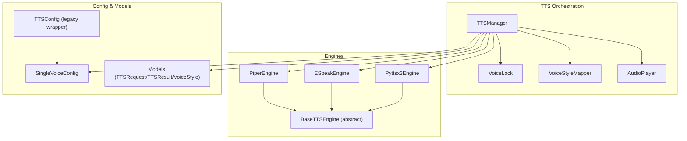

**Diagram sources**
- [tts_manager.py:31-244](file://psychologist/emotion_engine/voice_output/tts_manager.py#L31-L244)
- [base_tts_engine.py:6-36](file://psychologist/emotion_engine/voice_output/base_tts_engine.py#L6-L36)
- [piper_engine.py:8-88](file://psychologist/emotion_engine/voice_output/piper_engine.py#L8-L88)
- [espeak_engine.py:11-83](file://psychologist/emotion_engine/voice_output/espeak_engine.py#L11-L83)
- [pyttsx3_engine.py:13-118](file://psychologist/emotion_engine/voice_output/pyttsx3_engine.py#L13-L118)
- [single_voice_config.py:17-230](file://psychologist/emotion_engine/voice_output/single_voice_config.py#L17-L230)
- [voice_config.py:17-142](file://psychologist/emotion_engine/voice_output/voice_config.py#L17-L142)
- [models.py:7-48](file://psychologist/emotion_engine/voice_output/models.py#L7-L48)

**Section sources**
- [tts_manager.py:1-244](file://psychologist/emotion_engine/voice_output/tts_manager.py#L1-L244)
- [base_tts_engine.py:1-36](file://psychologist/emotion_engine/voice_output/base_tts_engine.py#L1-L36)
- [piper_engine.py:1-88](file://psychologist/emotion_engine/voice_output/piper_engine.py#L1-L88)
- [espeak_engine.py:1-83](file://psychologist/emotion_engine/voice_output/espeak_engine.py#L1-L83)
- [pyttsx3_engine.py:1-118](file://psychologist/emotion_engine/voice_output/pyttsx3_engine.py#L1-L118)
- [models.py:1-48](file://psychologist/emotion_engine/voice_output/models.py#L1-L48)
- [single_voice_config.py:1-230](file://psychologist/emotion_engine/voice_output/single_voice_config.py#L1-L230)
- [voice_config.py:1-142](file://psychologist/emotion_engine/voice_output/voice_config.py#L1-L142)
- [voice_style_mapper.py:1-77](file://psychologist/emotion_engine/voice_output/voice_style_mapper.py#L1-L77)
- [audio_player.py:1-110](file://psychologist/emotion_engine/voice_output/audio_player.py#L1-L110)
- [voice_lock.py:1-97](file://psychologist/emotion_engine/voice_output/voice_lock.py#L1-L97)

## Core Components
- TTSManager: Initializes engines, selects an active engine, applies emotion styles, synthesizes speech, plays audio, persists output, and enforces safety and voice locking.
- BaseTTSEngine: Defines the common interface for engine availability, initialization, synthesis, stopping, and voice enumeration.
- PiperEngine: Neural TTS via the Piper library or CLI, loads ONNX models from the models/tts directory, and writes WAV files.
- ESpeakEngine: Open-source TTS via the eSpeak binary, sets language, speed, and amplitude, and optionally writes WAV files.
- Pyttsx3Engine: Local TTS via pyttsx3, sets rate and volume, selects voices by ID or language hints, and either saves to file or speaks immediately.
- SingleVoiceConfig: Enforces a single locked local voice identity and exposes configuration for engines, safety, and style.
- VoiceStyleMapper: Translates detected emotions into bounded prosody adjustments (speed, pitch, volume, pause).
- AudioPlayer: Plays generated WAV files using PyAudio or Pygame fallback.
- VoiceLock: Prevents runtime voice identity changes unless developer mode is enabled.
- Models: Shared data structures for TTS requests, results, and voice styles.

**Section sources**
- [tts_manager.py:31-244](file://psychologist/emotion_engine/voice_output/tts_manager.py#L31-L244)
- [base_tts_engine.py:6-36](file://psychologist/emotion_engine/voice_output/base_tts_engine.py#L6-L36)
- [piper_engine.py:8-88](file://psychologist/emotion_engine/voice_output/piper_engine.py#L8-L88)
- [espeak_engine.py:11-83](file://psychologist/emotion_engine/voice_output/espeak_engine.py#L11-L83)
- [pyttsx3_engine.py:13-118](file://psychologist/emotion_engine/voice_output/pyttsx3_engine.py#L13-L118)
- [single_voice_config.py:17-230](file://psychologist/emotion_engine/voice_output/single_voice_config.py#L17-L230)
- [voice_style_mapper.py:13-77](file://psychologist/emotion_engine/voice_output/voice_style_mapper.py#L13-L77)
- [audio_player.py:25-110](file://psychologist/emotion_engine/voice_output/audio_player.py#L25-L110)
- [voice_lock.py:13-97](file://psychologist/emotion_engine/voice_output/voice_lock.py#L13-L97)
- [models.py:7-48](file://psychologist/emotion_engine/voice_output/models.py#L7-L48)

## Architecture Overview
The TTSManager acts as the central orchestrator. It initializes engines in priority order, locks the voice identity, and routes synthesis requests through a fallback chain. Emotion-driven prosody is applied before synthesis, and the resulting audio is optionally played and persisted.

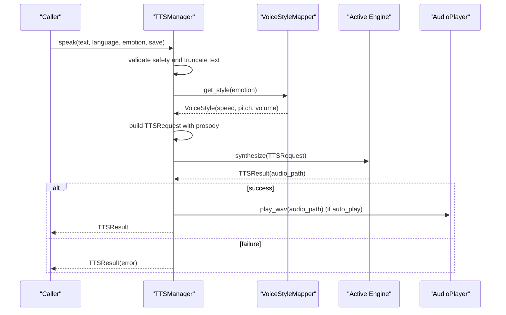

**Diagram sources**
- [tts_manager.py:100-168](file://psychologist/emotion_engine/voice_output/tts_manager.py#L100-L168)
- [voice_style_mapper.py:23-59](file://psychologist/emotion_engine/voice_output/voice_style_mapper.py#L23-L59)
- [audio_player.py:36-62](file://psychologist/emotion_engine/voice_output/audio_player.py#L36-L62)

## Detailed Component Analysis

### TTS Manager Orchestration
- Initialization: Loads engines in priority order, initializes those available, selects the active engine, and locks the voice identity.
- Fallback Chain: Attempts synthesis in order of primary → fallback → backup; returns the first successful result.
- Safety and Limits: Blocks unsafe requests, truncates long texts, and logs activities.
- Playback and Persistence: Optionally plays audio and saves to file based on configuration.

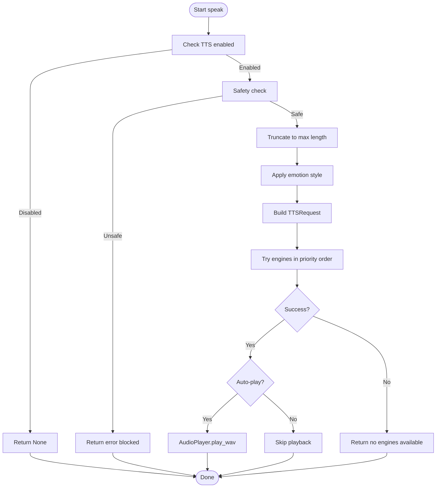

**Diagram sources**
- [tts_manager.py:100-193](file://psychologist/emotion_engine/voice_output/tts_manager.py#L100-L193)

**Section sources**
- [tts_manager.py:31-244](file://psychologist/emotion_engine/voice_output/tts_manager.py#L31-L244)

### Base TTS Engine Abstraction
- Defines the contract for engine availability checks, initialization, synthesis, stopping, and voice enumeration.
- Ensures consistent behavior across engines and enables polymorphic orchestration.

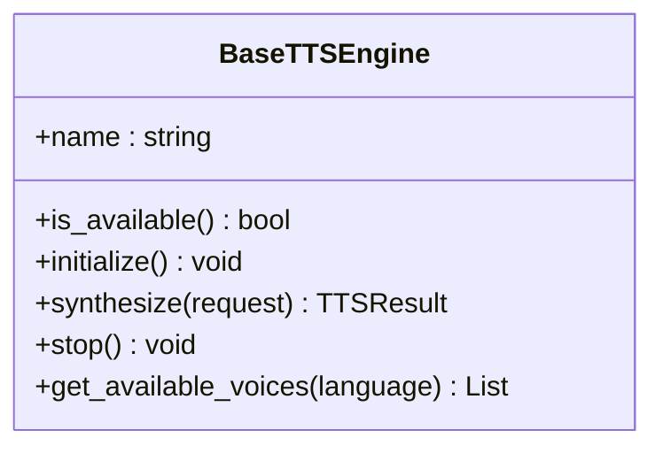

**Diagram sources**
- [base_tts_engine.py:6-36](file://psychologist/emotion_engine/voice_output/base_tts_engine.py#L6-L36)

**Section sources**
- [base_tts_engine.py:6-36](file://psychologist/emotion_engine/voice_output/base_tts_engine.py#L6-L36)

### Piper Engine (Neural TTS)
- Availability: Checks for the Piper Python package or validates the piper CLI.
- Initialization: Prepares the models/tts directory for voice models.
- Synthesis: Uses the PiperVoice loader with a selected ONNX model; falls back to CLI if library import fails.
- Voice Selection: Chooses model by request.voice_id or defaults per language; writes WAV to audio_outputs.

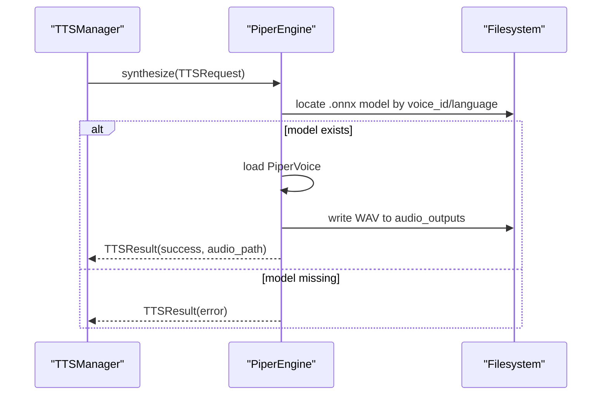

**Diagram sources**
- [piper_engine.py:40-84](file://psychologist/emotion_engine/voice_output/piper_engine.py#L40-L84)

**Section sources**
- [piper_engine.py:8-88](file://psychologist/emotion_engine/voice_output/piper_engine.py#L8-L88)

### eSpeak Engine (Open-Source Speech Synthesis)
- Availability: Validates the espeak CLI.
- Synthesis: Invokes espeak with language, speed, amplitude, and optional WAV output.
- Voice Enumeration: Queries installed voices via the CLI.

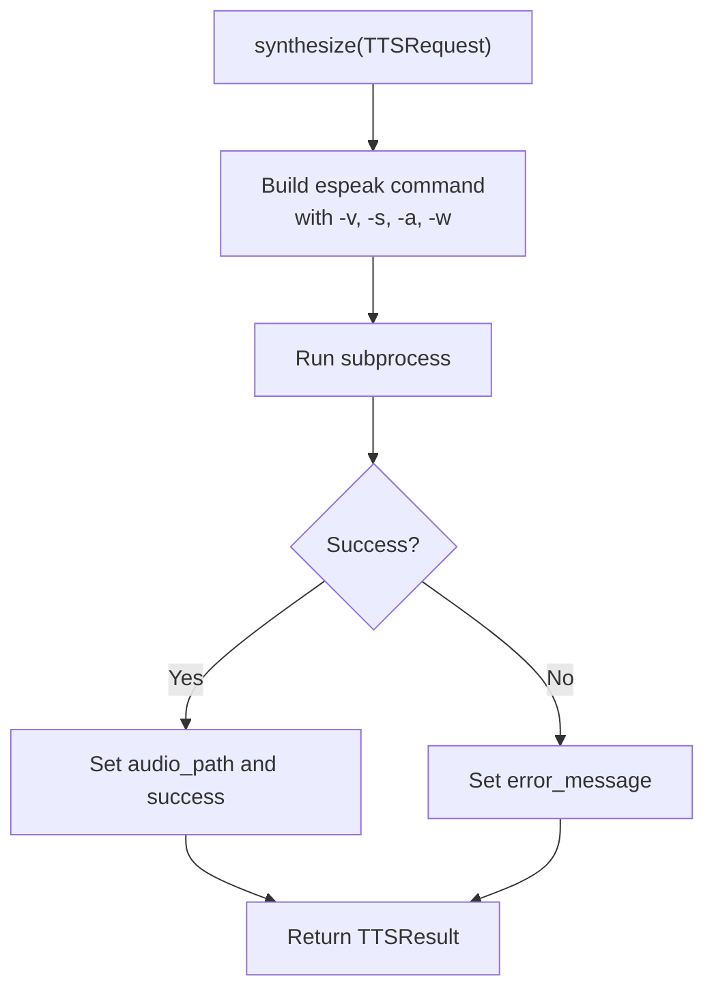

**Diagram sources**
- [espeak_engine.py:43-79](file://psychologist/emotion_engine/voice_output/espeak_engine.py#L43-L79)

**Section sources**
- [espeak_engine.py:11-83](file://psychologist/emotion_engine/voice_output/espeak_engine.py#L11-L83)

### Pyttsx3 Engine (Local Offline TTS)
- Availability: Checks for the pyttsx3 package.
- Initialization: Creates a thread-local engine instance and enumerates voices.
- Synthesis: Sets rate and volume, selects voice by ID or language hints, and either saves to file or speaks immediately.
- Stop: Attempts to stop the engine if available.

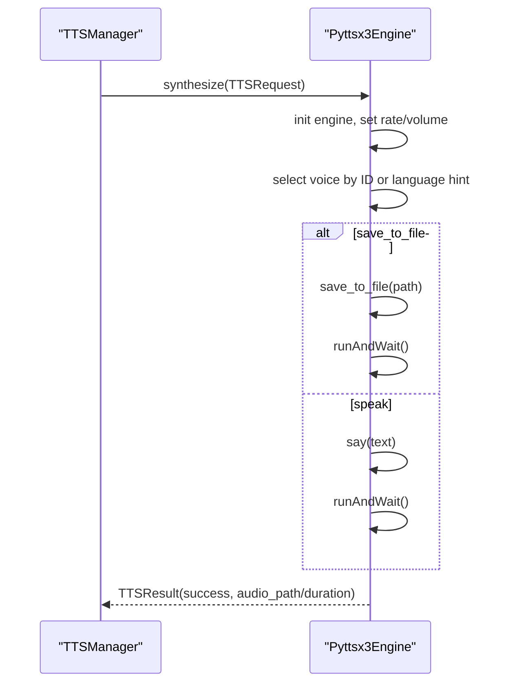

**Diagram sources**
- [pyttsx3_engine.py:49-110](file://psychologist/emotion_engine/voice_output/pyttsx3_engine.py#L49-L110)

**Section sources**
- [pyttsx3_engine.py:13-118](file://psychologist/emotion_engine/voice_output/pyttsx3_engine.py#L13-L118)

### Voice Configuration Management
- SingleVoiceConfig: Loads defaults, merges overlays, and exposes properties for TTS mode, engine priorities, voice identity, safety flags, and style bounds.
- TTSConfig (legacy wrapper): Maintains backward compatibility by reading single_voice_tts.yaml or tts_config.yaml and exposing a unified .get/.set API.

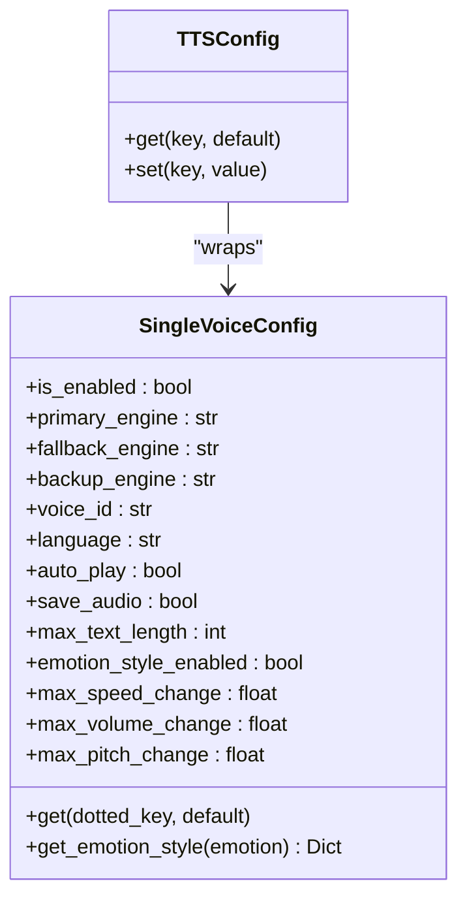

**Diagram sources**
- [single_voice_config.py:17-230](file://psychologist/emotion_engine/voice_output/single_voice_config.py#L17-L230)
- [voice_config.py:17-142](file://psychologist/emotion_engine/voice_output/voice_config.py#L17-L142)

**Section sources**
- [single_voice_config.py:17-230](file://psychologist/emotion_engine/voice_output/single_voice_config.py#L17-L230)
- [voice_config.py:17-142](file://psychologist/emotion_engine/voice_output/voice_config.py#L17-L142)

### Voice Style Mapping for Emotional Expression
- Maps emotion names to VoiceStyle objects with bounded multipliers for speed, pitch, volume, and pause.
- Clamps deltas against configured maximums to avoid extreme prosody.

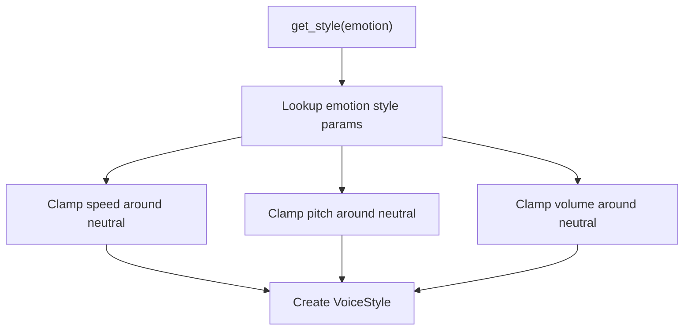

**Diagram sources**
- [voice_style_mapper.py:23-59](file://psychologist/emotion_engine/voice_output/voice_style_mapper.py#L23-L59)

**Section sources**
- [voice_style_mapper.py:13-77](file://psychologist/emotion_engine/voice_output/voice_style_mapper.py#L13-L77)
- [models.py:41-48](file://psychologist/emotion_engine/voice_output/models.py#L41-L48)

### Voice Selection and Locking Mechanisms
- VoiceLock prevents runtime changes to voice identity or engine unless developer mode is enabled.
- TTSManager locks the voice at startup using SingleVoiceConfig values.

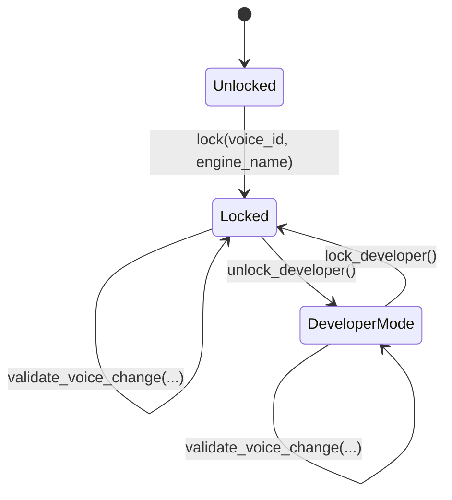

**Diagram sources**
- [voice_lock.py:28-87](file://psychologist/emotion_engine/voice_output/voice_lock.py#L28-L87)

**Section sources**
- [voice_lock.py:13-97](file://psychologist/emotion_engine/voice_output/voice_lock.py#L13-L97)
- [tts_manager.py:81-87](file://psychologist/emotion_engine/voice_output/tts_manager.py#L81-L87)

### Audio Quality Settings and Playback
- AudioPlayer supports PyAudio and Pygame playback, with a stop mechanism and cleanup.
- WAV files are written to the audio_outputs directory and streamed for playback.

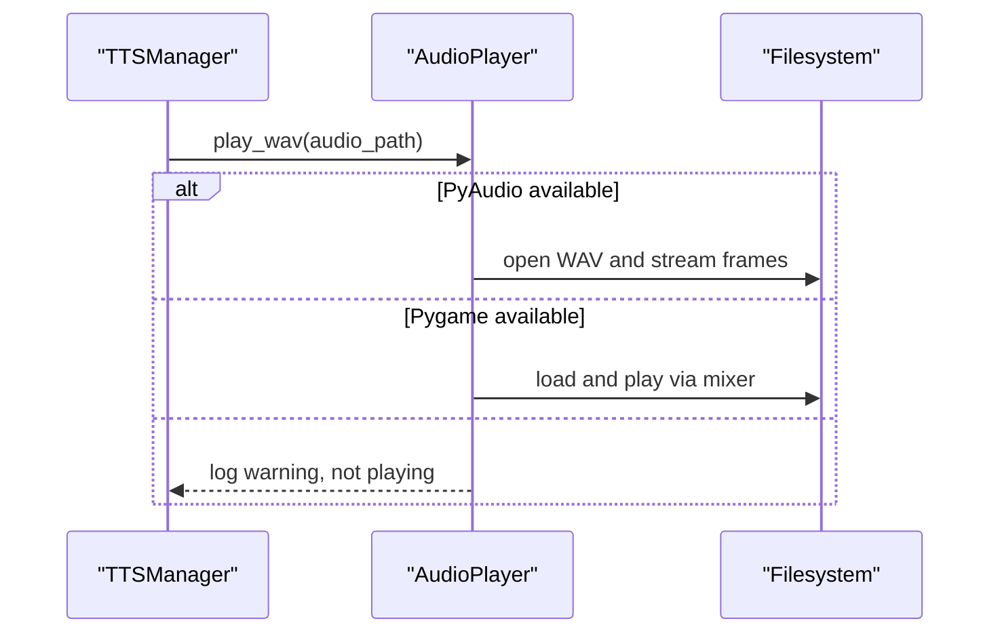

**Diagram sources**
- [audio_player.py:36-99](file://psychologist/emotion_engine/voice_output/audio_player.py#L36-L99)

**Section sources**
- [audio_player.py:25-110](file://psychologist/emotion_engine/voice_output/audio_player.py#L25-L110)

## Dependency Analysis
- TTSManager depends on BaseTTSEngine implementations, SingleVoiceConfig, VoiceStyleMapper, VoiceLock, and AudioPlayer.
- Engines depend on external binaries/packages and write audio to audio_outputs.
- Configuration modules provide centralized settings and safety enforcement.

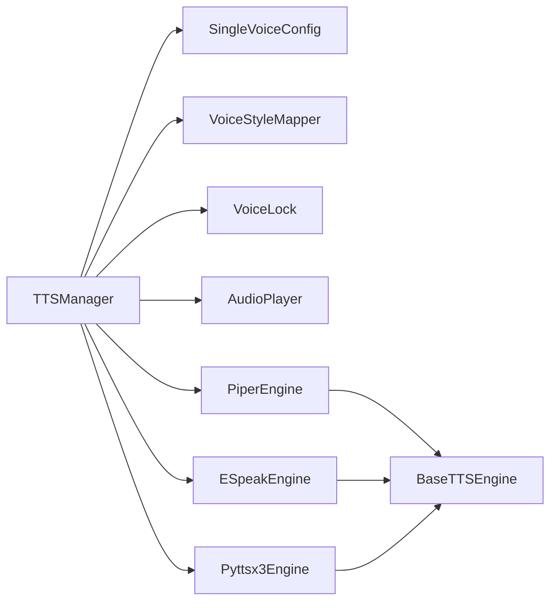

**Diagram sources**
- [tts_manager.py:41-87](file://psychologist/emotion_engine/voice_output/tts_manager.py#L41-L87)
- [base_tts_engine.py:6-36](file://psychologist/emotion_engine/voice_output/base_tts_engine.py#L6-L36)
- [piper_engine.py:8-88](file://psychologist/emotion_engine/voice_output/piper_engine.py#L8-L88)
- [espeak_engine.py:11-83](file://psychologist/emotion_engine/voice_output/espeak_engine.py#L11-L83)
- [pyttsx3_engine.py:13-118](file://psychologist/emotion_engine/voice_output/pyttsx3_engine.py#L13-L118)

**Section sources**
- [tts_manager.py:41-87](file://psychologist/emotion_engine/voice_output/tts_manager.py#L41-L87)

## Performance Considerations
- Engine Priority: Place the fastest and most reliable engine first (default Piper).
- Model Loading: Ensure ONNX models are present to avoid fallback overhead.
- Audio Persistence: Disable saving when not needed to reduce I/O.
- Playback Libraries: Install PyAudio for efficient streaming; Pygame is a fallback.
- Text Length: Respect max_text_length to prevent timeouts and memory pressure.
- Proseody Bounds: Keep style deltas moderate to preserve intelligibility.

[No sources needed since this section provides general guidance]

## Troubleshooting Guide
- No Engines Available: Verify engine availability checks and that at least one engine initializes successfully.
- Piper Voice Model Missing: Confirm the ONNX model exists in models/tts and matches the configured voice_id or language defaults.
- eSpeak Not Found: Ensure the espeak binary is installed and accessible in PATH.
- Pyttsx3 Import Failure: Install the pyttsx3 package and ensure COM initialization is handled on Windows.
- Audio Playback Issues: Install PyAudio or Pygame; check permissions and device availability.
- Safety Blocked Requests: Review the safety keywords and disable online/offline restrictions as appropriate.
- Voice Changes Disallowed: Unlock developer mode only for debugging; otherwise, the voice remains locked.

**Section sources**
- [tts_manager.py:228-244](file://psychologist/emotion_engine/voice_output/tts_manager.py#L228-L244)
- [piper_engine.py:15-26](file://psychologist/emotion_engine/voice_output/piper_engine.py#L15-L26)
- [espeak_engine.py:17-23](file://psychologist/emotion_engine/voice_output/espeak_engine.py#L17-L23)
- [pyttsx3_engine.py:21-27](file://psychologist/emotion_engine/voice_output/pyttsx3_engine.py#L21-L27)
- [audio_player.py:11-23](file://psychologist/emotion_engine/voice_output/audio_player.py#L11-L23)
- [voice_lock.py:65-87](file://psychologist/emotion_engine/voice_output/voice_lock.py#L65-L87)

## Conclusion
The TTS system enforces a single, locked local voice identity while leveraging multiple engines for robustness and quality. Emotion-driven prosody enhances expressiveness without altering voice identity. Configuration modules centralize behavior, and the fallback chain ensures continuity. With proper installation and tuning, the system delivers responsive, offline-first speech synthesis suitable for therapeutic interaction scenarios.

[No sources needed since this section summarizes without analyzing specific files]

## Appendices

### Example Integration Patterns
- Single-Voice Synthesis: Call TTSManager.speak with desired emotion and save flag; rely on fallback chain for reliability.
- Style Mapping: Adjust emotion styles in configuration to reflect desired expressive ranges.
- Custom Engine: Implement BaseTTSEngine, register in TTSManager initialization, and ensure is_available and initialize are robust.

**Section sources**
- [tts_manager.py:55-87](file://psychologist/emotion_engine/voice_output/tts_manager.py#L55-L87)
- [voice_style_mapper.py:23-59](file://psychologist/emotion_engine/voice_output/voice_style_mapper.py#L23-L59)
- [base_tts_engine.py:12-35](file://psychologist/emotion_engine/voice_output/base_tts_engine.py#L12-L35)